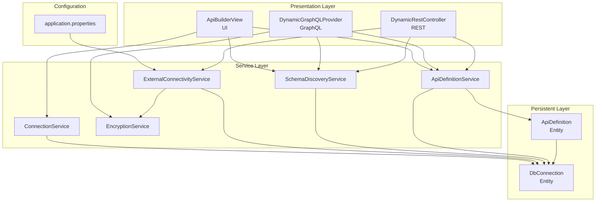
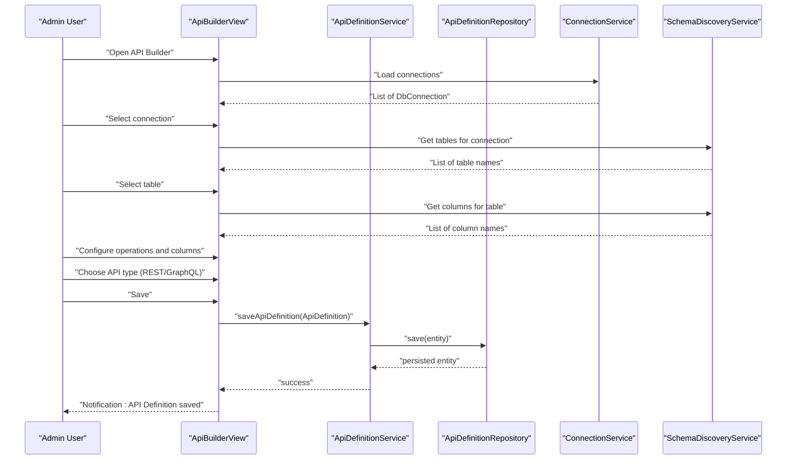
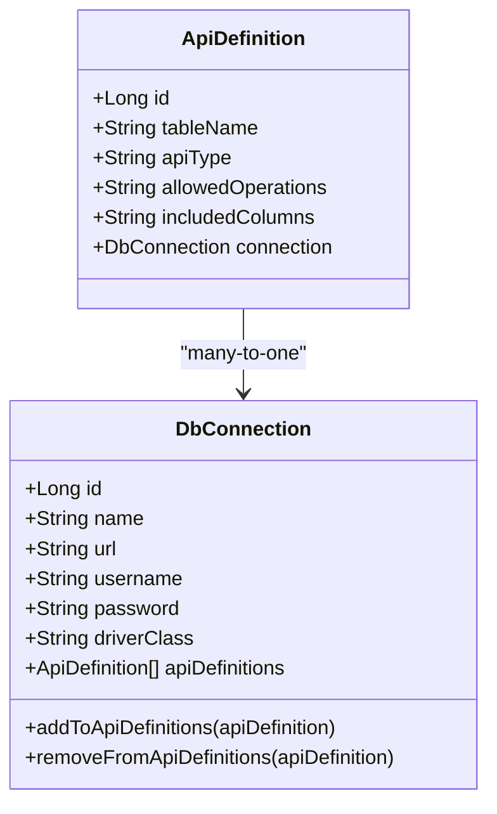
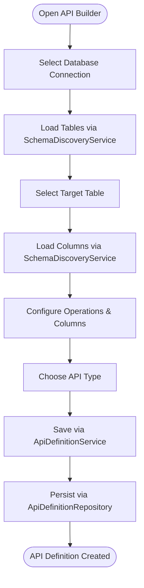
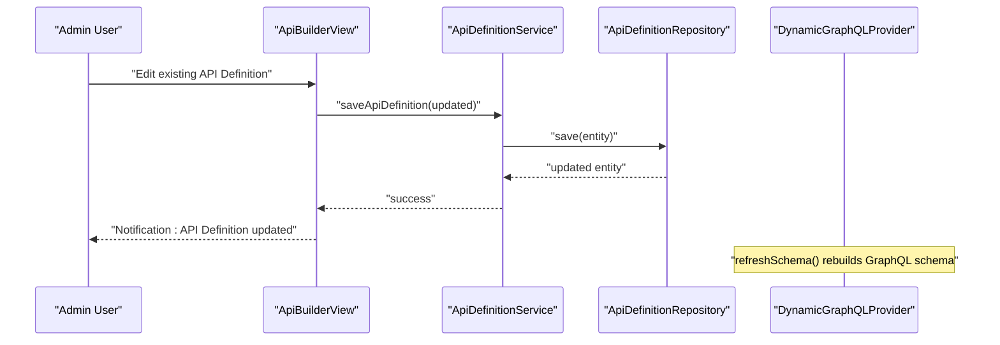
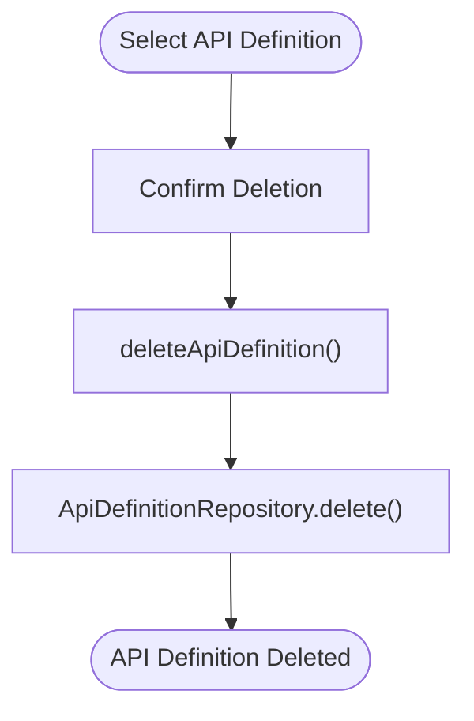
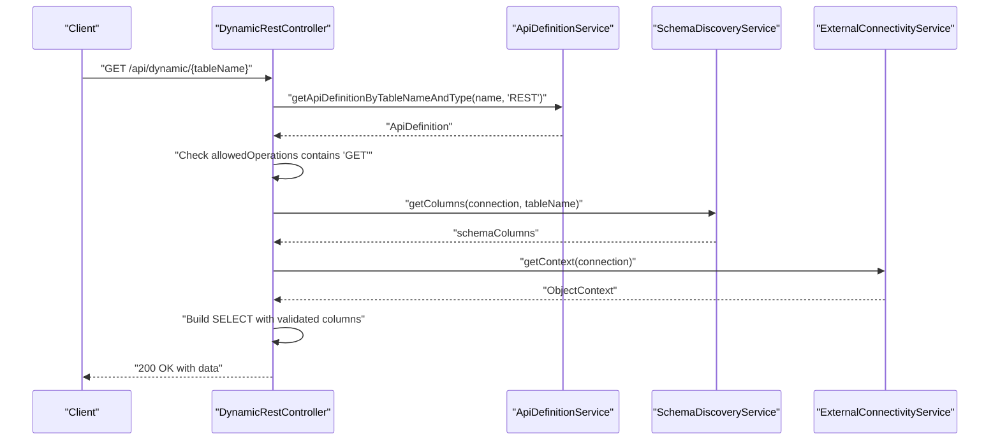
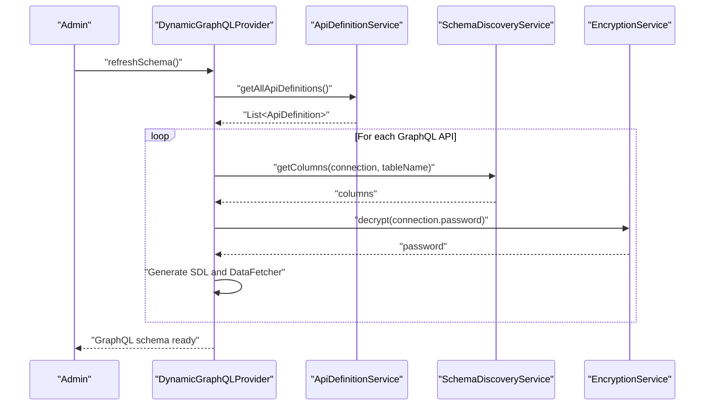
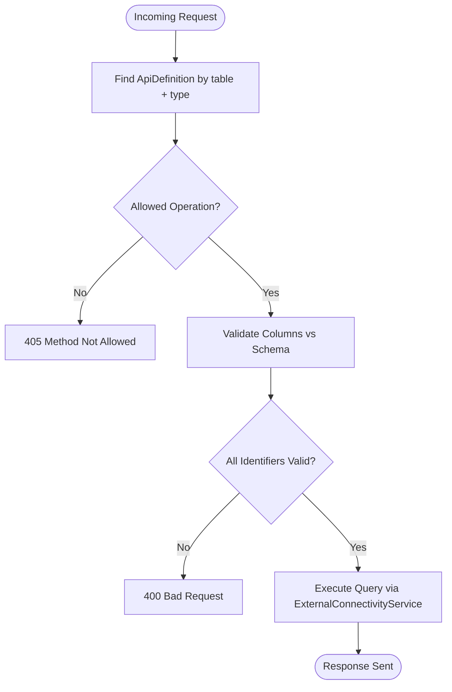
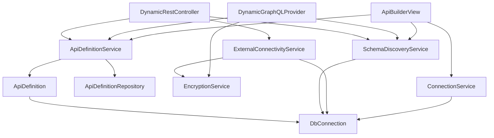

# API Definition Management

<cite>
**Referenced Files in This Document**
- [ApiDefinition.java](file://src/main/java/com/db2api/persistent/api/ApiDefinition.java)
- [ApiDefinitionRepository.java](file://src/main/java/com/db2api/repository/api/ApiDefinitionRepository.java)
- [ApiDefinitionService.java](file://src/main/java/com/db2api/service/api/ApiDefinitionService.java)
- [ApiBuilderView.java](file://src/main/java/com/db2api/ui/api/ApiBuilderView.java)
- [DynamicRestController.java](file://src/main/java/com/db2api/controller/DynamicRestController.java)
- [DynamicGraphQLProvider.java](file://src/main/java/com/db2api/config/DynamicGraphQLProvider.java)
- [SchemaDiscoveryService.java](file://src/main/java/com/db2api/service/api/SchemaDiscoveryService.java)
- [DbConnection.java](file://src/main/java/com/db2api/persistent/connection/DbConnection.java)
- [ConnectionService.java](file://src/main/java/com/db2api/service/connection/ConnectionService.java)
- [ExternalConnectivityService.java](file://src/main/java/com/db2api/service/connection/ExternalConnectivityService.java)
- [EncryptionService.java](file://src/main/java/com/db2api/service/EncryptionService.java)
- [application.properties](file://src/main/resources/application.properties)
</cite>

## Table of Contents
1. [Introduction](#introduction)
2. [Project Structure](#project-structure)
3. [Core Components](#core-components)
4. [Architecture Overview](#architecture-overview)
5. [Detailed Component Analysis](#detailed-component-analysis)
6. [Dependency Analysis](#dependency-analysis)
7. [Performance Considerations](#performance-considerations)
8. [Troubleshooting Guide](#troubleshooting-guide)
9. [Conclusion](#conclusion)

## Introduction
This document describes the API Definition Management functionality of the DB2API system. It explains how API definitions specify database connections, table mappings, and API types (GraphQL/REST). It covers configuration options, management workflows, validation rules, constraint checking, and integration with schema discovery and generation services. The goal is to provide a comprehensive understanding of how administrators and developers can create, update, and delete API definitions, configure table relationships, and manage the API lifecycle safely and efficiently.

## Project Structure
The API Definition Management feature spans several layers:
- Persistent entities define the data model for API definitions and database connections.
- Services encapsulate business logic for CRUD operations, schema discovery, and connectivity.
- Controllers expose REST endpoints and integrate with GraphQL generation.
- UI components provide a guided workflow for building APIs.
- Configuration defines application-wide settings and security.

**Diagram sources**
- [ApiDefinition.java:13-56](file://src/main/java/com/db2api/persistent/api/ApiDefinition.java#L13-L56)
- [DbConnection.java:16-84](file://src/main/java/com/db2api/persistent/connection/DbConnection.java#L16-L84)
- [ApiDefinitionService.java:10-38](file://src/main/java/com/db2api/service/api/ApiDefinitionService.java#L10-L38)
- [SchemaDiscoveryService.java:15-59](file://src/main/java/com/db2api/service/api/SchemaDiscoveryService.java#L15-L59)
- [ExternalConnectivityService.java:15-54](file://src/main/java/com/db2api/service/connection/ExternalConnectivityService.java#L15-L54)
- [ConnectionService.java:15-57](file://src/main/java/com/db2api/service/connection/ConnectionService.java#L15-L57)
- [EncryptionService.java:13-58](file://src/main/java/com/db2api/service/EncryptionService.java#L13-L58)
- [ApiBuilderView.java:31-55](file://src/main/java/com/db2api/ui/api/ApiBuilderView.java#L31-L55)
- [DynamicRestController.java:25-52](file://src/main/java/com/db2api/controller/DynamicRestController.java#L25-L52)
- [DynamicGraphQLProvider.java:31-53](file://src/main/java/com/db2api/config/DynamicGraphQLProvider.java#L31-L53)
- [application.properties:1-20](file://src/main/resources/application.properties#L1-L20)

**Section sources**
- [application.properties:1-20](file://src/main/resources/application.properties#L1-L20)

## Core Components
This section documents the primary components involved in API Definition Management.

- ApiDefinition entity
  - Purpose: Represents a dynamic API mapping to a database table via a specific connection.
  - Key attributes:
    - id: Primary key.
    - tableName: Target database table name exposed by the API.
    - apiType: API type (e.g., REST, GraphQL).
    - allowedOperations: Comma-separated HTTP operations permitted (e.g., GET, PUT, DELETE).
    - includedColumns: Comma-separated list of columns to include in responses.
    - connection: Many-to-one relationship to DbConnection.
  - Validation and constraints:
    - tableName and apiType are used together to uniquely identify an API definition.
    - allowedOperations and includedColumns are stored as comma-separated strings and validated during runtime operations.

- DbConnection entity
  - Purpose: Stores connection metadata and credentials for external databases.
  - Key attributes:
    - id, name, url, username, password, driverClass.
    - Bidirectional relationship with ApiDefinition via a collection of API definitions.
  - Security:
    - Passwords are encrypted before persistence and decrypted for connectivity.

- ApiDefinitionService
  - Responsibilities:
    - Retrieve all API definitions.
    - Find API definitions by table name and API type.
    - Save and delete API definitions.
    - Create new API definition instances.

- SchemaDiscoveryService
  - Responsibilities:
    - Discover database tables and columns for a given connection.
    - Uses JDBC metadata to enumerate tables and columns.

- ExternalConnectivityService
  - Responsibilities:
    - Create and cache Cayenne ServerRuntime per connection.
    - Provide ObjectContext for executing queries.
    - Decrypt connection passwords for establishing connections.

- ApiBuilderView (UI)
  - Responsibilities:
    - Present cascading selections: connection → table → columns → operations → type.
    - Persist selections into ApiDefinition and save via ApiDefinitionService.
    - Integrate with SchemaDiscoveryService for dynamic lists.

- DynamicRestController
  - Responsibilities:
    - Expose dynamic REST endpoints for configured API definitions.
    - Enforce allowed operations and validate identifiers against schema.
    - Build safe SQL queries using validated column lists.

- DynamicGraphQLProvider
  - Responsibilities:
    - Dynamically generate GraphQL schema from API definitions.
    - Wire data fetchers to query external databases.
    - Refresh schema when API definitions change.

**Section sources**
- [ApiDefinition.java:13-56](file://src/main/java/com/db2api/persistent/api/ApiDefinition.java#L13-L56)
- [DbConnection.java:16-84](file://src/main/java/com/db2api/persistent/connection/DbConnection.java#L16-L84)
- [ApiDefinitionService.java:10-38](file://src/main/java/com/db2api/service/api/ApiDefinitionService.java#L10-L38)
- [SchemaDiscoveryService.java:15-59](file://src/main/java/com/db2api/service/api/SchemaDiscoveryService.java#L15-L59)
- [ExternalConnectivityService.java:15-54](file://src/main/java/com/db2api/service/connection/ExternalConnectivityService.java#L15-L54)
- [ApiBuilderView.java:31-55](file://src/main/java/com/db2api/ui/api/ApiBuilderView.java#L31-L55)
- [DynamicRestController.java:25-52](file://src/main/java/com/db2api/controller/DynamicRestController.java#L25-L52)
- [DynamicGraphQLProvider.java:31-53](file://src/main/java/com/db2api/config/DynamicGraphQLProvider.java#L31-L53)

## Architecture Overview
The API Definition Management architecture integrates UI-driven configuration with backend services that enforce validation and security, and with runtime controllers that serve REST and GraphQL endpoints.

**Diagram sources**
- [ApiBuilderView.java:165-256](file://src/main/java/com/db2api/ui/api/ApiBuilderView.java#L165-L256)
- [ApiDefinitionService.java:27-29](file://src/main/java/com/db2api/service/api/ApiDefinitionService.java#L27-L29)
- [ApiDefinitionRepository.java:11](file://src/main/java/com/db2api/repository/api/ApiDefinitionRepository.java#L11)
- [ConnectionService.java:26-28](file://src/main/java/com/db2api/service/connection/ConnectionService.java#L26-L28)
- [SchemaDiscoveryService.java:24-40](file://src/main/java/com/db2api/service/api/SchemaDiscoveryService.java#L24-L40)

## Detailed Component Analysis

### ApiDefinition Entity Analysis
The ApiDefinition entity models the core configuration for dynamic APIs. It links a database table to a connection and captures exposure rules.

**Diagram sources**
- [ApiDefinition.java:13-56](file://src/main/java/com/db2api/persistent/api/ApiDefinition.java#L13-L56)
- [DbConnection.java:16-84](file://src/main/java/com/db2api/persistent/connection/DbConnection.java#L16-L84)

**Section sources**
- [ApiDefinition.java:13-56](file://src/main/java/com/db2api/persistent/api/ApiDefinition.java#L13-L56)
- [DbConnection.java:16-84](file://src/main/java/com/db2api/persistent/connection/DbConnection.java#L16-L84)

### API Lifecycle Workflows

#### Creating an API Definition
- UI-driven creation:
  - Select a database connection.
  - Choose a table; auto-populate columns.
  - Select allowed operations and included columns.
  - Choose API type (REST or GraphQL).
  - Save the definition.
- Backend persistence:
  - ApiBuilderView constructs an ApiDefinition and persists it via ApiDefinitionService.
  - ApiDefinitionService delegates to ApiDefinitionRepository for persistence.

**Diagram sources**
- [ApiBuilderView.java:165-256](file://src/main/java/com/db2api/ui/api/ApiBuilderView.java#L165-L256)
- [ApiDefinitionService.java:27-29](file://src/main/java/com/db2api/service/api/ApiDefinitionService.java#L27-L29)
- [ApiDefinitionRepository.java:11](file://src/main/java/com/db2api/repository/api/ApiDefinitionRepository.java#L11)
- [SchemaDiscoveryService.java:24-40](file://src/main/java/com/db2api/service/api/SchemaDiscoveryService.java#L24-L40)

**Section sources**
- [ApiBuilderView.java:165-256](file://src/main/java/com/db2api/ui/api/ApiBuilderView.java#L165-L256)
- [ApiDefinitionService.java:27-29](file://src/main/java/com/db2api/service/api/ApiDefinitionService.java#L27-L29)
- [ApiDefinitionRepository.java:11](file://src/main/java/com/db2api/repository/api/ApiDefinitionRepository.java#L11)
- [SchemaDiscoveryService.java:24-40](file://src/main/java/com/db2api/service/api/SchemaDiscoveryService.java#L24-L40)

#### Updating an API Definition
- Modify connection, table, operations, or included columns.
- Save updates; ApiDefinitionService persists changes.
- For GraphQL, DynamicGraphQLProvider.refreshSchema rebuilds the schema.

**Diagram sources**
- [ApiBuilderView.java:121-136](file://src/main/java/com/db2api/ui/api/ApiBuilderView.java#L121-L136)
- [ApiDefinitionService.java:27-29](file://src/main/java/com/db2api/service/api/ApiDefinitionService.java#L27-L29)
- [ApiDefinitionRepository.java:11](file://src/main/java/com/db2api/repository/api/ApiDefinitionRepository.java#L11)
- [DynamicGraphQLProvider.java:77-132](file://src/main/java/com/db2api/config/DynamicGraphQLProvider.java#L77-L132)

**Section sources**
- [ApiBuilderView.java:121-136](file://src/main/java/com/db2api/ui/api/ApiBuilderView.java#L121-L136)
- [ApiDefinitionService.java:27-29](file://src/main/java/com/db2api/service/api/ApiDefinitionService.java#L27-L29)
- [ApiDefinitionRepository.java:11](file://src/main/java/com/db2api/repository/api/ApiDefinitionRepository.java#L11)
- [DynamicGraphQLProvider.java:77-132](file://src/main/java/com/db2api/config/DynamicGraphQLProvider.java#L77-L132)

#### Deleting an API Definition
- Select the API definition in the UI grid.
- Delete action invokes ApiDefinitionService.deleteApiDefinition.
- Persistence layer removes the entity.

**Diagram sources**
- [ApiBuilderView.java:148-158](file://src/main/java/com/db2api/ui/api/ApiBuilderView.java#L148-L158)
- [ApiDefinitionService.java:31-33](file://src/main/java/com/db2api/service/api/ApiDefinitionService.java#L31-L33)
- [ApiDefinitionRepository.java:11](file://src/main/java/com/db2api/repository/api/ApiDefinitionRepository.java#L11)

**Section sources**
- [ApiBuilderView.java:148-158](file://src/main/java/com/db2api/ui/api/ApiBuilderView.java#L148-L158)
- [ApiDefinitionService.java:31-33](file://src/main/java/com/db2api/service/api/ApiDefinitionService.java#L31-L33)
- [ApiDefinitionRepository.java:11](file://src/main/java/com/db2api/repository/api/ApiDefinitionRepository.java#L11)

### REST Endpoint Management
DynamicRestController serves REST endpoints derived from ApiDefinition configurations. It enforces allowed operations and validates identifiers against the discovered schema.

**Diagram sources**
- [DynamicRestController.java:76-113](file://src/main/java/com/db2api/controller/DynamicRestController.java#L76-L113)
- [ApiDefinitionService.java:23-25](file://src/main/java/com/db2api/service/api/ApiDefinitionService.java#L23-L25)
- [SchemaDiscoveryService.java:42-58](file://src/main/java/com/db2api/service/api/SchemaDiscoveryService.java#L42-L58)
- [ExternalConnectivityService.java:25-27](file://src/main/java/com/db2api/service/connection/ExternalConnectivityService.java#L25-L27)

**Section sources**
- [DynamicRestController.java:76-113](file://src/main/java/com/db2api/controller/DynamicRestController.java#L76-L113)
- [ApiDefinitionService.java:23-25](file://src/main/java/com/db2api/service/api/ApiDefinitionService.java#L23-L25)
- [SchemaDiscoveryService.java:42-58](file://src/main/java/com/db2api/service/api/SchemaDiscoveryService.java#L42-L58)
- [ExternalConnectivityService.java:25-27](file://src/main/java/com/db2api/service/connection/ExternalConnectivityService.java#L25-L27)

### GraphQL Endpoint Management
DynamicGraphQLProvider generates a GraphQL schema dynamically from API definitions and wires data fetchers to query external databases.

**Diagram sources**
- [DynamicGraphQLProvider.java:77-132](file://src/main/java/com/db2api/config/DynamicGraphQLProvider.java#L77-L132)
- [ApiDefinitionService.java:19-21](file://src/main/java/com/db2api/service/api/ApiDefinitionService.java#L19-L21)
- [SchemaDiscoveryService.java:42-58](file://src/main/java/com/db2api/service/api/SchemaDiscoveryService.java#L42-L58)
- [EncryptionService.java:47-57](file://src/main/java/com/db2api/service/EncryptionService.java#L47-L57)

**Section sources**
- [DynamicGraphQLProvider.java:77-132](file://src/main/java/com/db2api/config/DynamicGraphQLProvider.java#L77-L132)
- [ApiDefinitionService.java:19-21](file://src/main/java/com/db2api/service/api/ApiDefinitionService.java#L19-L21)
- [SchemaDiscoveryService.java:42-58](file://src/main/java/com/db2api/service/api/SchemaDiscoveryService.java#L42-L58)
- [EncryptionService.java:47-57](file://src/main/java/com/db2api/service/EncryptionService.java#L47-L57)

### Validation Rules and Constraint Checking
- Allowed operations enforcement:
  - REST endpoints check ApiDefinition.allowedOperations before executing requests.
- Identifier validation:
  - SQL identifiers are validated against the discovered schema to prevent injection and ensure safety.
- Column inclusion:
  - Included columns are validated against schema; invalid entries are ignored or rejected depending on the operation.
- API type filtering:
  - REST endpoints filter by apiType = "REST".
  - GraphQL schema generation filters by apiType = "GraphQL".

**Diagram sources**
- [DynamicRestController.java:78-85](file://src/main/java/com/db2api/controller/DynamicRestController.java#L78-L85)
- [DynamicRestController.java:127-130](file://src/main/java/com/db2api/controller/DynamicRestController.java#L127-L130)
- [DynamicRestController.java:301-315](file://src/main/java/com/db2api/controller/DynamicRestController.java#L301-L315)

**Section sources**
- [DynamicRestController.java:78-85](file://src/main/java/com/db2api/controller/DynamicRestController.java#L78-L85)
- [DynamicRestController.java:127-130](file://src/main/java/com/db2api/controller/DynamicRestController.java#L127-L130)
- [DynamicRestController.java:301-315](file://src/main/java/com/db2api/controller/DynamicRestController.java#L301-L315)

### Configuration Options
- Database connectivity:
  - DbConnection stores JDBC URL, driver class, username, and encrypted password.
  - ConnectionService manages encryption and persistence of connections.
- Encryption:
  - EncryptionService provides AES encryption/decryption for sensitive data.
- External connectivity:
  - ExternalConnectivityService creates Cayenne ServerRuntime per connection and caches them.
- Application properties:
  - application.properties configures the system database and JPA/Hibernate settings.

**Section sources**
- [DbConnection.java:16-84](file://src/main/java/com/db2api/persistent/connection/DbConnection.java#L16-L84)
- [ConnectionService.java:26-37](file://src/main/java/com/db2api/service/connection/ConnectionService.java#L26-L37)
- [EncryptionService.java:13-58](file://src/main/java/com/db2api/service/EncryptionService.java#L13-L58)
- [ExternalConnectivityService.java:25-54](file://src/main/java/com/db2api/service/connection/ExternalConnectivityService.java#L25-L54)
- [application.properties:1-20](file://src/main/resources/application.properties#L1-L20)

## Dependency Analysis
The following diagram shows key dependencies among components involved in API Definition Management.

**Diagram sources**
- [ApiDefinition.java:13-56](file://src/main/java/com/db2api/persistent/api/ApiDefinition.java#L13-L56)
- [DbConnection.java:16-84](file://src/main/java/com/db2api/persistent/connection/DbConnection.java#L16-L84)
- [ApiDefinitionService.java:10-38](file://src/main/java/com/db2api/service/api/ApiDefinitionService.java#L10-L38)
- [ApiDefinitionRepository.java:11](file://src/main/java/com/db2api/repository/api/ApiDefinitionRepository.java#L11)
- [SchemaDiscoveryService.java:15-59](file://src/main/java/com/db2api/service/api/SchemaDiscoveryService.java#L15-L59)
- [ExternalConnectivityService.java:15-54](file://src/main/java/com/db2api/service/connection/ExternalConnectivityService.java#L15-L54)
- [EncryptionService.java:13-58](file://src/main/java/com/db2api/service/EncryptionService.java#L13-L58)
- [ConnectionService.java:15-57](file://src/main/java/com/db2api/service/connection/ConnectionService.java#L15-L57)
- [ApiBuilderView.java:31-55](file://src/main/java/com/db2api/ui/api/ApiBuilderView.java#L31-L55)
- [DynamicRestController.java:25-52](file://src/main/java/com/db2api/controller/DynamicRestController.java#L25-L52)
- [DynamicGraphQLProvider.java:31-53](file://src/main/java/com/db2api/config/DynamicGraphQLProvider.java#L31-L53)

**Section sources**
- [ApiDefinition.java:13-56](file://src/main/java/com/db2api/persistent/api/ApiDefinition.java#L13-L56)
- [DbConnection.java:16-84](file://src/main/java/com/db2api/persistent/connection/DbConnection.java#L16-L84)
- [ApiDefinitionService.java:10-38](file://src/main/java/com/db2api/service/api/ApiDefinitionService.java#L10-L38)
- [ApiDefinitionRepository.java:11](file://src/main/java/com/db2api/repository/api/ApiDefinitionRepository.java#L11)
- [SchemaDiscoveryService.java:15-59](file://src/main/java/com/db2api/service/api/SchemaDiscoveryService.java#L15-L59)
- [ExternalConnectivityService.java:15-54](file://src/main/java/com/db2api/service/connection/ExternalConnectivityService.java#L15-L54)
- [EncryptionService.java:13-58](file://src/main/java/com/db2api/service/EncryptionService.java#L13-L58)
- [ConnectionService.java:15-57](file://src/main/java/com/db2api/service/connection/ConnectionService.java#L15-L57)
- [ApiBuilderView.java:31-55](file://src/main/java/com/db2api/ui/api/ApiBuilderView.java#L31-L55)
- [DynamicRestController.java:25-52](file://src/main/java/com/db2api/controller/DynamicRestController.java#L25-L52)
- [DynamicGraphQLProvider.java:31-53](file://src/main/java/com/db2api/config/DynamicGraphQLProvider.java#L31-L53)

## Performance Considerations
- Connection caching:
  - ExternalConnectivityService caches ServerRuntime per connection ID to reduce overhead.
- Schema discovery:
  - SchemaDiscoveryService performs JDBC metadata queries; cache results at the UI layer where appropriate.
- SQL construction:
  - DynamicRestController builds validated column lists and uses parameterized queries to avoid SQL injection and improve performance.
- Encryption:
  - EncryptionService prepares keys once per operation; consider optimizing repeated encryptions if needed.

[No sources needed since this section provides general guidance]

## Troubleshooting Guide
- API definition not found:
  - Verify that tableName and apiType match the stored ApiDefinition.
  - Check ApiDefinitionRepository.findByTableNameAndApiType behavior.
- Method not allowed:
  - Ensure allowedOperations includes the requested HTTP method.
- Invalid column name:
  - Confirm column names exist in the discovered schema for the selected table.
- Connection failures:
  - Test connection via ConnectionService.testConnection.
  - Verify encryption/decryption of passwords.
- GraphQL schema not updating:
  - Trigger DynamicGraphQLProvider.refreshSchema after modifying API definitions.

**Section sources**
- [ApiDefinitionRepository.java:13-20](file://src/main/java/com/db2api/repository/api/ApiDefinitionRepository.java#L13-L20)
- [DynamicRestController.java:78-85](file://src/main/java/com/db2api/controller/DynamicRestController.java#L78-L85)
- [ConnectionService.java:47-56](file://src/main/java/com/db2api/service/connection/ConnectionService.java#L47-L56)
- [DynamicGraphQLProvider.java:77-132](file://src/main/java/com/db2api/config/DynamicGraphQLProvider.java#L77-L132)

## Conclusion
API Definition Management in DB2API enables administrators to securely and flexibly expose database tables as REST or GraphQL APIs. The system enforces validation rules, integrates schema discovery, and leverages encryption and connection caching for performance and security. Through the UI, services, and controllers described above, users can create, update, and delete API definitions, configure table relationships, and manage the API lifecycle effectively.