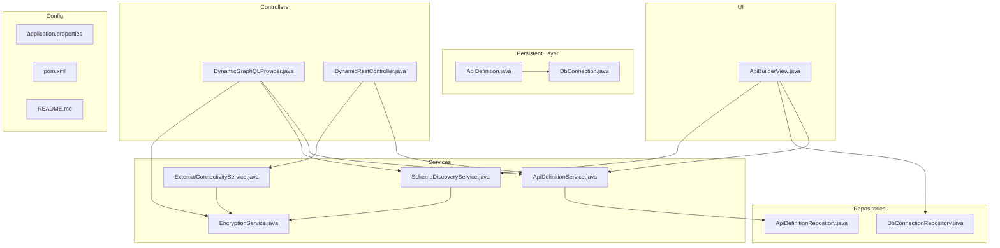
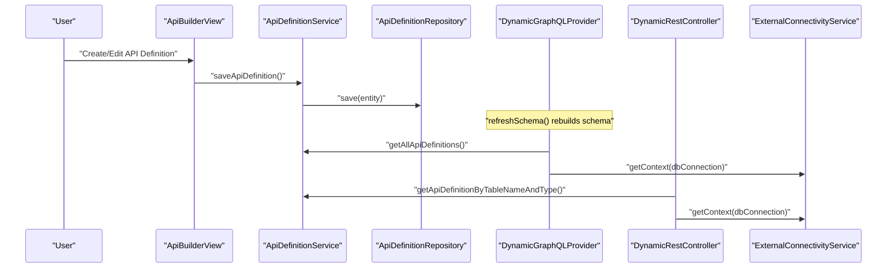
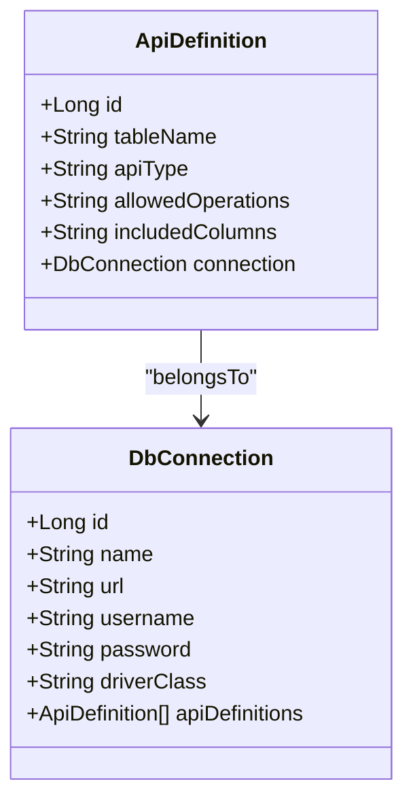
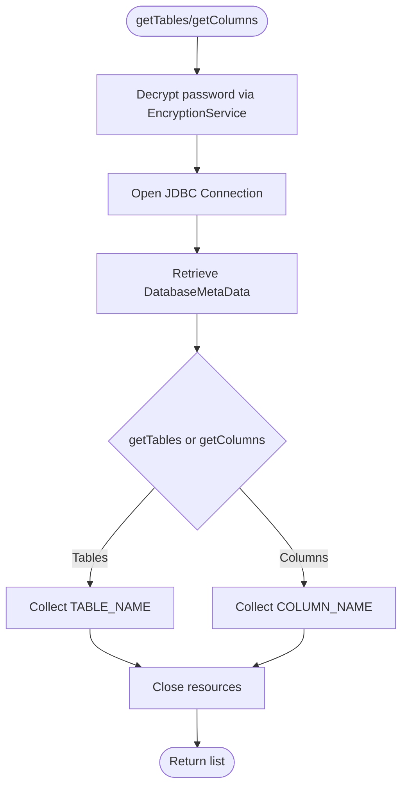
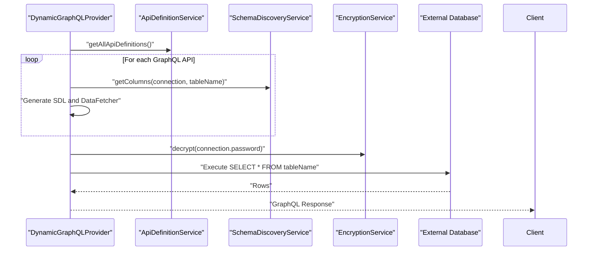
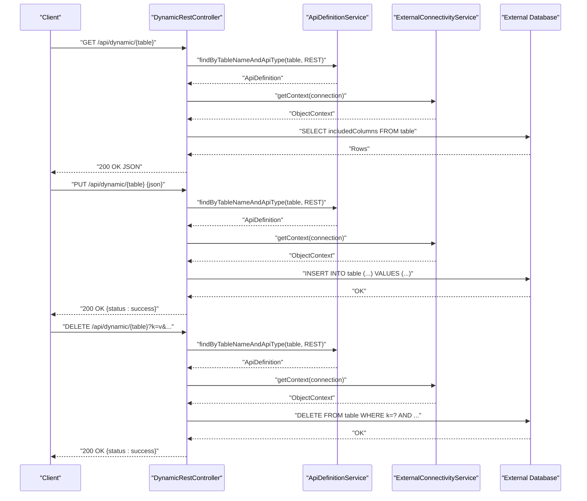
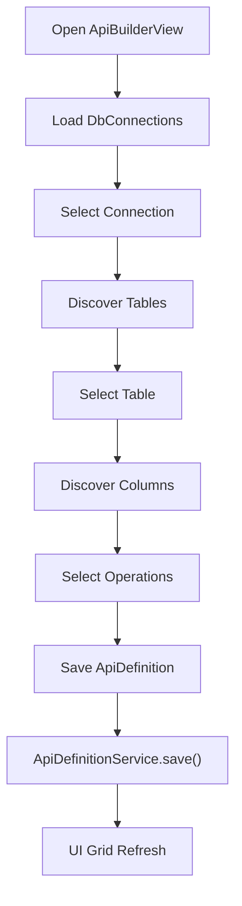
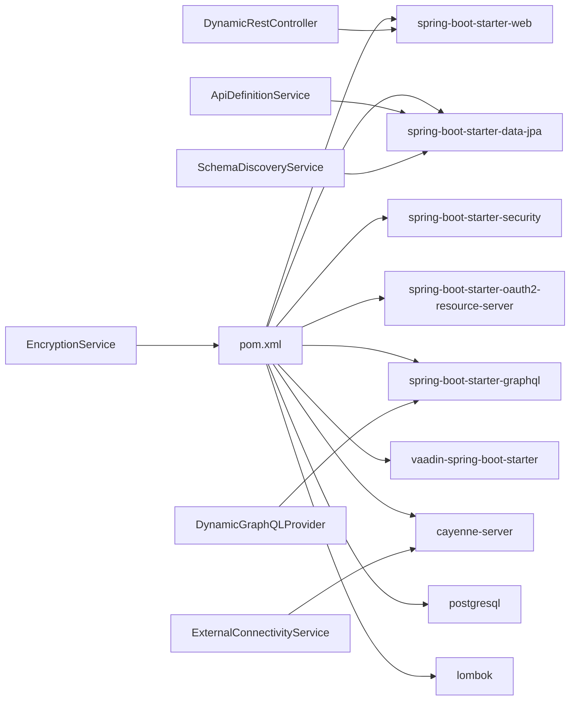

# API Generation Engine

<cite>
**Referenced Files in This Document**
- [README.md](file://README.md)
- [pom.xml](file://pom.xml)
- [application.properties](file://src/main/resources/application.properties)
- [ApiDefinition.java](file://src/main/java/com/db2api/persistent/api/ApiDefinition.java)
- [DbConnection.java](file://src/main/java/com/db2api/persistent/connection/DbConnection.java)
- [ApiDefinitionService.java](file://src/main/java/com/db2api/service/api/ApiDefinitionService.java)
- [SchemaDiscoveryService.java](file://src/main/java/com/db2api/service/api/SchemaDiscoveryService.java)
- [DynamicGraphQLProvider.java](file://src/main/java/com/db2api/config/DynamicGraphQLProvider.java)
- [DynamicRestController.java](file://src/main/java/com/db2api/controller/DynamicRestController.java)
- [ExternalConnectivityService.java](file://src/main/java/com/db2api/service/connection/ExternalConnectivityService.java)
- [EncryptionService.java](file://src/main/java/com/db2api/service/EncryptionService.java)
- [ApiBuilderView.java](file://src/main/java/com/db2api/ui/api/ApiBuilderView.java)
- [ApiDefinitionRepository.java](file://src/main/java/com/db2api/repository/api/ApiDefinitionRepository.java)
- [DbConnectionRepository.java](file://src/main/java/com/db2api/repository/connection/DbConnectionRepository.java)
</cite>

## Table of Contents
1. [Introduction](#introduction)
2. [Project Structure](#project-structure)
3. [Core Components](#core-components)
4. [Architecture Overview](#architecture-overview)
5. [Detailed Component Analysis](#detailed-component-analysis)
6. [Dependency Analysis](#dependency-analysis)
7. [Performance Considerations](#performance-considerations)
8. [Troubleshooting Guide](#troubleshooting-guide)
9. [Conclusion](#conclusion)
10. [Appendices](#appendices)

## Introduction
This document describes the API generation engine of DB2API, focusing on schema discovery, dynamic GraphQL API generation, REST API creation from database schemas, and dynamic endpoint management. It documents the ApiDefinition entity, the DynamicGraphQLProvider implementation, the SchemaDiscoveryService functionality, and the API definition management pipeline. Practical examples illustrate generating APIs from different database schemas, customizing API behavior, and extending the generation engine. Performance considerations and optimization strategies are also addressed.

## Project Structure
The application is a Spring Boot web application with:
- Persistent entities for API definitions and database connections
- Services for API definition management, schema discovery, encryption, and external connectivity
- Controllers for dynamic REST endpoints and GraphQL provider
- UI for building and managing API definitions
- Configuration for application properties and dependencies

**Diagram sources**
- [ApiDefinition.java:1-57](file://src/main/java/com/db2api/persistent/api/ApiDefinition.java#L1-L57)
- [DbConnection.java:1-85](file://src/main/java/com/db2api/persistent/connection/DbConnection.java#L1-L85)
- [ApiDefinitionService.java:1-39](file://src/main/java/com/db2api/service/api/ApiDefinitionService.java#L1-L39)
- [SchemaDiscoveryService.java:1-60](file://src/main/java/com/db2api/service/api/SchemaDiscoveryService.java#L1-L60)
- [EncryptionService.java:1-59](file://src/main/java/com/db2api/service/EncryptionService.java#L1-L59)
- [ExternalConnectivityService.java:1-55](file://src/main/java/com/db2api/service/connection/ExternalConnectivityService.java#L1-L55)
- [DynamicGraphQLProvider.java:1-178](file://src/main/java/com/db2api/config/DynamicGraphQLProvider.java#L1-L178)
- [DynamicRestController.java:1-168](file://src/main/java/com/db2api/controller/DynamicRestController.java#L1-L168)
- [ApiBuilderView.java:1-258](file://src/main/java/com/db2api/ui/api/ApiBuilderView.java#L1-L258)
- [ApiDefinitionRepository.java:1-22](file://src/main/java/com/db2api/repository/api/ApiDefinitionRepository.java#L1-L22)
- [DbConnectionRepository.java:1-13](file://src/main/java/com/db2api/repository/connection/DbConnectionRepository.java#L1-L13)
- [application.properties:1-20](file://src/main/resources/application.properties#L1-L20)
- [pom.xml:1-130](file://pom.xml#L1-L130)
- [README.md:1-99](file://README.md#L1-L99)

**Section sources**
- [README.md:65-82](file://README.md#L65-L82)
- [pom.xml:25-99](file://pom.xml#L25-L99)
- [application.properties:1-20](file://src/main/resources/application.properties#L1-L20)

## Core Components
- ApiDefinition entity: Maps a database table to a dynamic REST or GraphQL endpoint, storing table name, API type, allowed operations, included columns, and the associated database connection.
- DbConnection entity: Stores connection metadata and credentials required to connect to external databases, including a list of associated API definitions.
- ApiDefinitionService: Manages CRUD operations for API definitions and retrieves definitions by table and type.
- SchemaDiscoveryService: Discovers database tables and columns via JDBC metadata, using decrypted credentials.
- EncryptionService: Provides AES encryption/decryption for sensitive connection credentials.
- ExternalConnectivityService: Builds Cayenne ServerRuntime instances per connection and caches them for reuse, providing ObjectContexts for external queries.
- DynamicGraphQLProvider: Dynamically generates a GraphQL schema from API definitions, wiring data fetchers to external database queries.
- DynamicRestController: Exposes dynamic REST endpoints for GET, PUT, and DELETE operations against external databases based on ApiDefinition configurations.
- ApiBuilderView: UI for designing API definitions, selecting connections, tables, columns, and operations, and persisting them.

**Section sources**
- [ApiDefinition.java:9-56](file://src/main/java/com/db2api/persistent/api/ApiDefinition.java#L9-L56)
- [DbConnection.java:12-83](file://src/main/java/com/db2api/persistent/connection/DbConnection.java#L12-L83)
- [ApiDefinitionService.java:10-38](file://src/main/java/com/db2api/service/api/ApiDefinitionService.java#L10-L38)
- [SchemaDiscoveryService.java:15-59](file://src/main/java/com/db2api/service/api/SchemaDiscoveryService.java#L15-L59)
- [EncryptionService.java:13-58](file://src/main/java/com/db2api/service/EncryptionService.java#L13-L58)
- [ExternalConnectivityService.java:15-54](file://src/main/java/com/db2api/service/connection/ExternalConnectivityService.java#L15-L54)
- [DynamicGraphQLProvider.java:25-177](file://src/main/java/com/db2api/config/DynamicGraphQLProvider.java#L25-L177)
- [DynamicRestController.java:16-167](file://src/main/java/com/db2api/controller/DynamicRestController.java#L16-L167)
- [ApiBuilderView.java:26-257](file://src/main/java/com/db2api/ui/api/ApiBuilderView.java#L26-L257)

## Architecture Overview
The engine orchestrates schema discovery, API definition management, and dynamic endpoint generation:
- UI captures user intent and persists ApiDefinition entries.
- Services coordinate schema inspection and connectivity.
- Controllers translate HTTP requests into SQL against external databases.
- GraphQL schema is regenerated at runtime based on ApiDefinition entries.

**Diagram sources**
- [ApiBuilderView.java:121-136](file://src/main/java/com/db2api/ui/api/ApiBuilderView.java#L121-L136)
- [ApiDefinitionService.java:27-29](file://src/main/java/com/db2api/service/api/ApiDefinitionService.java#L27-L29)
- [ApiDefinitionRepository.java:10-21](file://src/main/java/com/db2api/repository/api/ApiDefinitionRepository.java#L10-L21)
- [DynamicGraphQLProvider.java:77-132](file://src/main/java/com/db2api/config/DynamicGraphQLProvider.java#L77-L132)
- [DynamicRestController.java:51-80](file://src/main/java/com/db2api/controller/DynamicRestController.java#L51-L80)
- [ExternalConnectivityService.java:25-27](file://src/main/java/com/db2api/service/connection/ExternalConnectivityService.java#L25-L27)

## Detailed Component Analysis

### ApiDefinition Entity
- Purpose: Represents a dynamic API mapping to a database table.
- Fields:
  - id: primary key
  - tableName: target database table
  - apiType: REST or GraphQL
  - allowedOperations: comma-separated HTTP operations
  - includedColumns: comma-separated columns to include
  - connection: many-to-one to DbConnection
- Behavior: Links API exposure rules to a specific external database connection.

**Diagram sources**
- [ApiDefinition.java:17-56](file://src/main/java/com/db2api/persistent/api/ApiDefinition.java#L17-L56)
- [DbConnection.java:20-83](file://src/main/java/com/db2api/persistent/connection/DbConnection.java#L20-L83)

**Section sources**
- [ApiDefinition.java:9-56](file://src/main/java/com/db2api/persistent/api/ApiDefinition.java#L9-L56)

### SchemaDiscoveryService
- Responsibilities:
  - Discover tables for a given DbConnection
  - Discover columns for a given table and DbConnection
- Implementation:
  - Decrypts password via EncryptionService
  - Uses JDBC DatabaseMetaData to enumerate tables/views and columns
  - Returns lists of names for UI and GraphQL generation

**Diagram sources**
- [SchemaDiscoveryService.java:24-58](file://src/main/java/com/db2api/service/api/SchemaDiscoveryService.java#L24-L58)
- [EncryptionService.java:47-57](file://src/main/java/com/db2api/service/EncryptionService.java#L47-L57)

**Section sources**
- [SchemaDiscoveryService.java:15-59](file://src/main/java/com/db2api/service/api/SchemaDiscoveryService.java#L15-L59)

### DynamicGraphQLProvider
- Responsibilities:
  - Build a runtime GraphQL schema from ApiDefinition entries
  - Wire data fetchers to external database queries
  - Rebuild schema on demand
- Workflow:
  - Load all ApiDefinition entries where apiType is GraphQL
  - Generate SDL with Query fields and type definitions
  - Resolve columns via SchemaDiscoveryService
  - Create RuntimeWiring and build executable schema
  - Execute queries by fetching data from external database using decrypted credentials

**Diagram sources**
- [DynamicGraphQLProvider.java:77-132](file://src/main/java/com/db2api/config/DynamicGraphQLProvider.java#L77-L132)
- [ApiDefinitionService.java:19-21](file://src/main/java/com/db2api/service/api/ApiDefinitionService.java#L19-L21)
- [SchemaDiscoveryService.java:42-58](file://src/main/java/com/db2api/service/api/SchemaDiscoveryService.java#L42-L58)
- [EncryptionService.java:47-57](file://src/main/java/com/db2api/service/EncryptionService.java#L47-L57)

**Section sources**
- [DynamicGraphQLProvider.java:25-177](file://src/main/java/com/db2api/config/DynamicGraphQLProvider.java#L25-L177)

### DynamicRestController
- Responsibilities:
  - Serve dynamic REST endpoints for GET, PUT, DELETE
  - Enforce allowed operations from ApiDefinition
  - Translate requests into SQL executed against external databases via Cayenne
- Endpoints:
  - GET /api/dynamic/{tableName}: returns rows filtered by included columns
  - PUT /api/dynamic/{tableName}: inserts a row from JSON body
  - DELETE /api/dynamic/{tableName}?conditions...: deletes matching rows

**Diagram sources**
- [DynamicRestController.java:47-166](file://src/main/java/com/db2api/controller/DynamicRestController.java#L47-L166)
- [ApiDefinitionService.java:23-25](file://src/main/java/com/db2api/service/api/ApiDefinitionService.java#L23-L25)
- [ExternalConnectivityService.java:25-27](file://src/main/java/com/db2api/service/connection/ExternalConnectivityService.java#L25-L27)

**Section sources**
- [DynamicRestController.java:16-167](file://src/main/java/com/db2api/controller/DynamicRestController.java#L16-L167)

### API Definition Management
- UI-driven creation/editing/deletion of ApiDefinition entries
- Cascading selections: connection -> table -> columns
- Persistence via ApiDefinitionRepository and ApiDefinitionService
- Role-based access control in UI prevents destructive actions for viewers

**Diagram sources**
- [ApiBuilderView.java:165-256](file://src/main/java/com/db2api/ui/api/ApiBuilderView.java#L165-L256)
- [ApiDefinitionService.java:27-29](file://src/main/java/com/db2api/service/api/ApiDefinitionService.java#L27-L29)
- [SchemaDiscoveryService.java:24-58](file://src/main/java/com/db2api/service/api/SchemaDiscoveryService.java#L24-L58)
- [DbConnectionRepository.java:10-12](file://src/main/java/com/db2api/repository/connection/DbConnectionRepository.java#L10-L12)

**Section sources**
- [ApiBuilderView.java:26-257](file://src/main/java/com/db2api/ui/api/ApiBuilderView.java#L26-L257)
- [ApiDefinitionService.java:10-38](file://src/main/java/com/db2api/service/api/ApiDefinitionService.java#L10-L38)
- [ApiDefinitionRepository.java:10-21](file://src/main/java/com/db2api/repository/api/ApiDefinitionRepository.java#L10-L21)

### Practical Examples

- Example 1: Expose a single table via GraphQL
  - Steps:
    - Create DbConnection to external database
    - Use ApiBuilderView to select connection, table, and columns
    - Choose API type GraphQL and save
    - DynamicGraphQLProvider regenerates schema and data fetchers
    - Query via /graphql with generated SDL
  - Reference paths:
    - [ApiBuilderView.java:205-222](file://src/main/java/com/db2api/ui/api/ApiBuilderView.java#L205-L222)
    - [DynamicGraphQLProvider.java:77-132](file://src/main/java/com/db2api/config/DynamicGraphQLProvider.java#L77-L132)

- Example 2: Expose a table via REST with column filtering
  - Steps:
    - Create ApiDefinition with apiType REST
    - Set includedColumns to limit response fields
    - Allow GET operation
    - Call GET /api/dynamic/{table} to retrieve filtered rows
  - Reference paths:
    - [DynamicRestController.java:47-81](file://src/main/java/com/db2api/controller/DynamicRestController.java#L47-L81)
    - [ApiDefinitionService.java:23-25](file://src/main/java/com/db2api/service/api/ApiDefinitionService.java#L23-L25)

- Example 3: Insert data via REST
  - Steps:
    - Allow PUT operation in ApiDefinition
    - Send JSON payload to PUT /api/dynamic/{table}
    - ExternalConnectivityService executes INSERT with provided values
  - Reference paths:
    - [DynamicRestController.java:90-125](file://src/main/java/com/db2api/controller/DynamicRestController.java#L90-L125)
    - [ExternalConnectivityService.java:25-27](file://src/main/java/com/db2api/service/connection/ExternalConnectivityService.java#L25-L27)

- Example 4: Delete data via REST with conditions
  - Steps:
    - Allow DELETE operation in ApiDefinition
    - Provide query parameters as WHERE conditions
    - ExternalConnectivityService executes DELETE with conditions
  - Reference paths:
    - [DynamicRestController.java:127-166](file://src/main/java/com/db2api/controller/DynamicRestController.java#L127-L166)

- Example 5: Customize API behavior
  - Allowed operations: modify allowedOperations to restrict GET/PUT/DELETE
  - Included columns: refine includedColumns to limit exposed fields
  - Connection changes: switch DbConnection to route traffic to another database
  - Reference paths:
    - [ApiDefinition.java:38-48](file://src/main/java/com/db2api/persistent/api/ApiDefinition.java#L38-L48)
    - [ApiDefinitionService.java:27-29](file://src/main/java/com/db2api/service/api/ApiDefinitionService.java#L27-L29)

- Example 6: Extend the generation engine
  - Add new API types: extend DynamicGraphQLProvider and DynamicRestController to support new protocols
  - Add new operations: expand DynamicRestController handlers and ApiDefinition.allowedOperations
  - Add new UI controls: extend ApiBuilderView to capture additional constraints
  - Reference paths:
    - [DynamicGraphQLProvider.java:77-132](file://src/main/java/com/db2api/config/DynamicGraphQLProvider.java#L77-L132)
    - [DynamicRestController.java:47-166](file://src/main/java/com/db2api/controller/DynamicRestController.java#L47-L166)
    - [ApiBuilderView.java:224-227](file://src/main/java/com/db2api/ui/api/ApiBuilderView.java#L224-L227)

## Dependency Analysis
- External libraries and frameworks:
  - Spring Boot starters for web, data JPA, security, OAuth2 resource server, and GraphQL
  - Vaadin for UI
  - Apache Cayenne for ORM and external connectivity
  - PostgreSQL JDBC driver
  - Lombok for concise POJOs
- Internal dependencies:
  - ApiDefinition depends on DbConnection
  - Services depend on repositories and EncryptionService
  - Controllers depend on services and ExternalConnectivityService
  - UI depends on services and SchemaDiscoveryService

**Diagram sources**
- [pom.xml:25-99](file://pom.xml#L25-L99)
- [DynamicGraphQLProvider.java:1-16](file://src/main/java/com/db2api/config/DynamicGraphQLProvider.java#L1-L16)
- [DynamicRestController.java:1-14](file://src/main/java/com/db2api/controller/DynamicRestController.java#L1-L14)
- [ApiDefinitionService.java:1-10](file://src/main/java/com/db2api/service/api/ApiDefinitionService.java#L1-L10)
- [SchemaDiscoveryService.java:1-13](file://src/main/java/com/db2api/service/api/SchemaDiscoveryService.java#L1-L13)
- [ExternalConnectivityService.java:1-13](file://src/main/java/com/db2api/service/connection/ExternalConnectivityService.java#L1-L13)
- [EncryptionService.java:1-13](file://src/main/java/com/db2api/service/EncryptionService.java#L1-L13)

**Section sources**
- [pom.xml:25-99](file://pom.xml#L25-L99)

## Performance Considerations
- Connection pooling and caching:
  - ExternalConnectivityService caches ServerRuntime per connection ID to avoid repeated initialization.
  - Consider tuning Cayenne’s internal pool and query timeout settings.
- Query efficiency:
  - Use ApiDefinition.includedColumns to limit SELECT payloads.
  - Prefer indexed columns in DELETE conditions to minimize scans.
- Schema regeneration:
  - DynamicGraphQLProvider.refreshSchema() rebuilds the schema; cache and invalidate judiciously to avoid frequent rebuilds.
- Encryption overhead:
  - EncryptionService performs AES operations; ensure secret keys are stable and avoid re-preparing keys unnecessarily.
- UI responsiveness:
  - Debounce cascading selections in ApiBuilderView to reduce repeated schema discovery calls.
- Logging and monitoring:
  - Replace console prints with structured logging for production environments.

[No sources needed since this section provides general guidance]

## Troubleshooting Guide
- Authentication failures:
  - Verify JWT-based authentication and roles; ensure clients send tokens to protected endpoints.
  - Reference: [README.md:96-99](file://README.md#L96-L99)
- Connection testing:
  - Use ConnectionService.testConnection() to validate external database connectivity before creating API definitions.
  - Reference: [ConnectionService.java:47-56](file://src/main/java/com/db2api/service/connection/ConnectionService.java#L47-L56)
- Decryption errors:
  - Confirm encryption secret matches application configuration; ensure passwords were encrypted before saving.
  - Reference: [EncryptionService.java:18-58](file://src/main/java/com/db2api/service/EncryptionService.java#L18-L58)
- Missing endpoints:
  - Ensure ApiDefinition exists with matching table name and API type; verify allowedOperations include requested method.
  - Reference: [ApiDefinitionService.java:23-25](file://src/main/java/com/db2api/service/api/ApiDefinitionService.java#L23-L25)
- GraphQL schema not updating:
  - Trigger DynamicGraphQLProvider.refreshSchema() or restart the application to regenerate schema from current ApiDefinition entries.
  - Reference: [DynamicGraphQLProvider.java:58-61](file://src/main/java/com/db2api/config/DynamicGraphQLProvider.java#L58-L61)
- UI not loading tables/columns:
  - Confirm DbConnection is saved with encrypted password and reachable; check SchemaDiscoveryService logs for JDBC errors.
  - Reference: [SchemaDiscoveryService.java:24-58](file://src/main/java/com/db2api/service/api/SchemaDiscoveryService.java#L24-L58)

**Section sources**
- [README.md:96-99](file://README.md#L96-L99)
- [ConnectionService.java:47-56](file://src/main/java/com/db2api/service/connection/ConnectionService.java#L47-L56)
- [EncryptionService.java:18-58](file://src/main/java/com/db2api/service/EncryptionService.java#L18-L58)
- [ApiDefinitionService.java:23-25](file://src/main/java/com/db2api/service/api/ApiDefinitionService.java#L23-L25)
- [DynamicGraphQLProvider.java:58-61](file://src/main/java/com/db2api/config/DynamicGraphQLProvider.java#L58-L61)
- [SchemaDiscoveryService.java:24-58](file://src/main/java/com/db2api/service/api/SchemaDiscoveryService.java#L24-L58)

## Conclusion
DB2API’s API generation engine combines schema discovery, dynamic endpoint management, and secure connectivity to deliver automatic REST and GraphQL APIs from arbitrary databases. The ApiDefinition entity and supporting services enable flexible customization, while the UI streamlines definition authoring. By leveraging caching, column filtering, and careful schema regeneration, the engine balances flexibility with performance.

[No sources needed since this section summarizes without analyzing specific files]

## Appendices

### API Endpoints Overview
- REST base path: /api/dynamic
  - GET /{tableName}: retrieve rows with included columns
  - PUT /{tableName}: insert a row from JSON body
  - DELETE /{tableName}?conditions: delete rows matching conditions
- GraphQL endpoint: /graphql
  - Queries mapped to tables defined in ApiDefinition with GraphQL type

**Section sources**
- [README.md:84-99](file://README.md#L84-L99)
- [DynamicRestController.java:47-166](file://src/main/java/com/db2api/controller/DynamicRestController.java#L47-L166)
- [DynamicGraphQLProvider.java:77-132](file://src/main/java/com/db2api/config/DynamicGraphQLProvider.java#L77-L132)