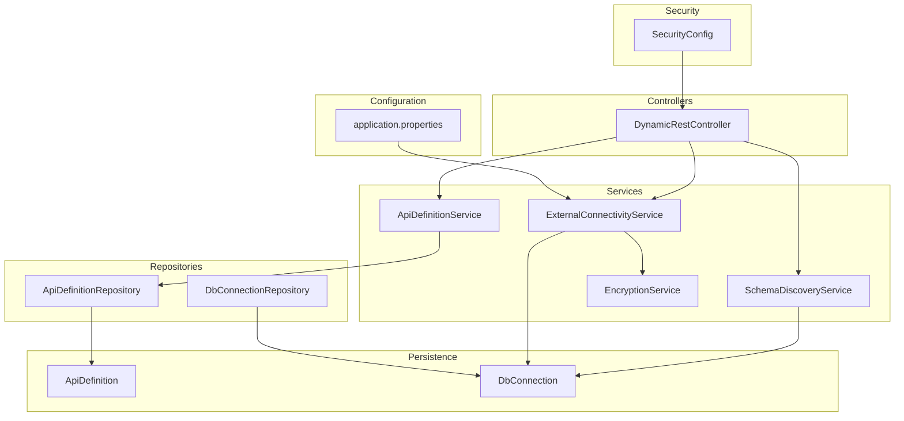
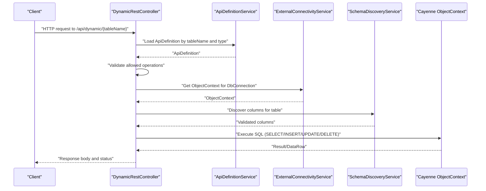
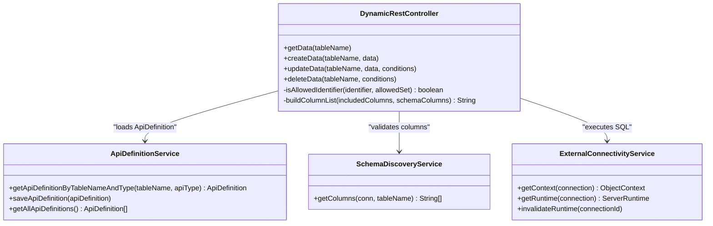
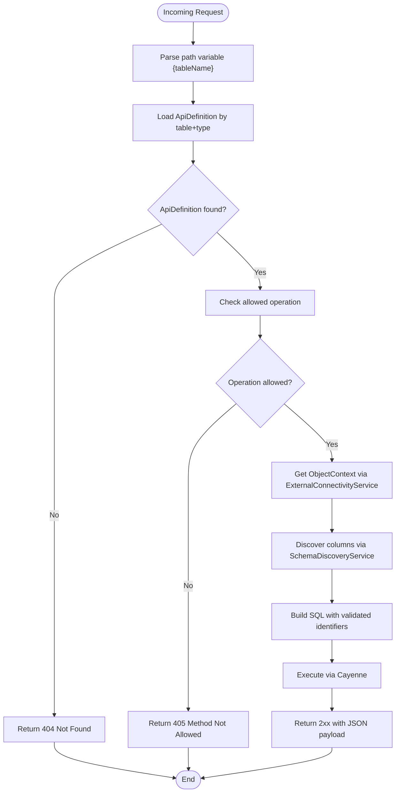
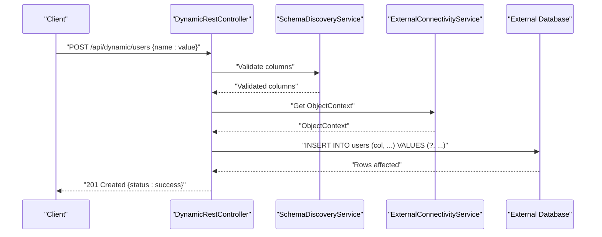
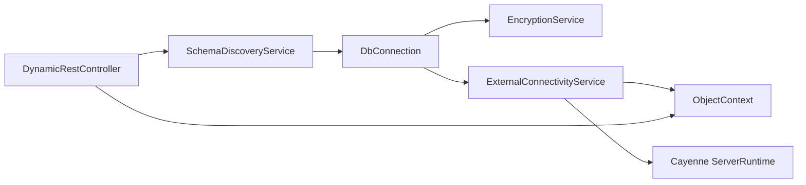
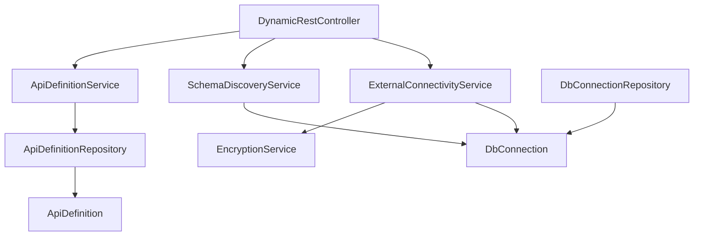

# Dynamic Endpoint Management

<cite>
**Referenced Files in This Document**
- [DynamicRestController.java](file://src/main/java/com/db2api/controller/DynamicRestController.java)
- [ApiDefinitionService.java](file://src/main/java/com/db2api/service/api/ApiDefinitionService.java)
- [SchemaDiscoveryService.java](file://src/main/java/com/db2api/service/api/SchemaDiscoveryService.java)
- [ExternalConnectivityService.java](file://src/main/java/com/db2api/service/connection/ExternalConnectivityService.java)
- [ApiDefinition.java](file://src/main/java/com/db2api/persistent/api/ApiDefinition.java)
- [DbConnection.java](file://src/main/java/com/db2api/persistent/connection/DbConnection.java)
- [DbConnectionRepository.java](file://src/main/java/com/db2api/repository/connection/DbConnectionRepository.java)
- [ApiDefinitionRepository.java](file://src/main/java/com/db2api/repository/api/ApiDefinitionRepository.java)
- [SecurityConfig.java](file://src/main/java/com/db2api/config/SecurityConfig.java)
- [EncryptionService.java](file://src/main/java/com/db2api/service/EncryptionService.java)
- [application.properties](file://src/main/resources/application.properties)
- [README.md](file://README.md)
</cite>

## Table of Contents
1. [Introduction](#introduction)
2. [Project Structure](#project-structure)
3. [Core Components](#core-components)
4. [Architecture Overview](#architecture-overview)
5. [Detailed Component Analysis](#detailed-component-analysis)
6. [Dependency Analysis](#dependency-analysis)
7. [Performance Considerations](#performance-considerations)
8. [Troubleshooting Guide](#troubleshooting-guide)
9. [Conclusion](#conclusion)
10. [Appendices](#appendices)

## Introduction
This document explains the Dynamic Endpoint Management system that generates REST endpoints from database tables at runtime. It covers how endpoints are discovered and invoked, how routing works, and how request/response handling is performed. It also documents the DynamicRestController implementation, endpoint registration, and integration with external database connectivity via Apache Cayenne. Guidance is provided for generating CRUD endpoints, handling different HTTP methods, implementing custom behaviors, and addressing security, validation, and performance considerations.

## Project Structure
The Dynamic Endpoint Management system spans several layers:
- Controllers: expose REST endpoints under a dynamic base path
- Services: orchestrate API definitions, schema discovery, and external connectivity
- Persistence: define entities for API definitions and database connections
- Repositories: provide data access for entities
- Security: protect dynamic endpoints with JWT resource server authentication
- Configuration: application properties and security configuration

**Diagram sources**
- [DynamicRestController.java:25-52](file://src/main/java/com/db2api/controller/DynamicRestController.java#L25-L52)
- [ApiDefinitionService.java:10-38](file://src/main/java/com/db2api/service/api/ApiDefinitionService.java#L10-L38)
- [SchemaDiscoveryService.java:15-59](file://src/main/java/com/db2api/service/api/SchemaDiscoveryService.java#L15-L59)
- [ExternalConnectivityService.java:15-54](file://src/main/java/com/db2api/service/connection/ExternalConnectivityService.java#L15-L54)
- [EncryptionService.java:21-111](file://src/main/java/com/db2api/service/EncryptionService.java#L21-L111)
- [ApiDefinition.java:17-66](file://src/main/java/com/db2api/persistent/api/ApiDefinition.java#L17-L66)
- [DbConnection.java:16-84](file://src/main/java/com/db2api/persistent/connection/DbConnection.java#L16-L84)
- [ApiDefinitionRepository.java:10-21](file://src/main/java/com/db2api/repository/api/ApiDefinitionRepository.java#L10-L21)
- [DbConnectionRepository.java:10-12](file://src/main/java/com/db2api/repository/connection/DbConnectionRepository.java#L10-L12)
- [SecurityConfig.java:28-90](file://src/main/java/com/db2api/config/SecurityConfig.java#L28-L90)
- [application.properties:1-20](file://src/main/resources/application.properties#L1-L20)

**Section sources**
- [README.md:65-82](file://README.md#L65-L82)
- [application.properties:1-20](file://src/main/resources/application.properties#L1-L20)

## Core Components
- DynamicRestController: Exposes dynamic REST endpoints under /api/dynamic/{tableName}. Implements GET (read), POST (create), PUT (update), and DELETE methods. Validates identifiers and enforces allowed operations from ApiDefinition.
- ApiDefinitionService: Loads API definitions by table name and type, persists changes, and supports CRUD operations on ApiDefinition entities.
- SchemaDiscoveryService: Discovers database tables and columns for validation and column selection.
- ExternalConnectivityService: Manages Cayenne ServerRuntime instances per connection and provides ObjectContext for SQL execution.
- EncryptionService: Encrypts and decrypts sensitive data such as database passwords using AES/GCM.
- ApiDefinition and DbConnection: Entities that define which tables are exposed, allowed operations, included columns, and the target database connection.
- SecurityConfig: Protects /api/dynamic/** and /graphql with JWT resource server authentication.

**Section sources**
- [DynamicRestController.java:76-113](file://src/main/java/com/db2api/controller/DynamicRestController.java#L76-L113)
- [DynamicRestController.java:191-238](file://src/main/java/com/db2api/controller/DynamicRestController.java#L191-L238)
- [DynamicRestController.java:123-182](file://src/main/java/com/db2api/controller/DynamicRestController.java#L123-L182)
- [DynamicRestController.java:247-291](file://src/main/java/com/db2api/controller/DynamicRestController.java#L247-L291)
- [ApiDefinitionService.java:19-37](file://src/main/java/com/db2api/service/api/ApiDefinitionService.java#L19-L37)
- [SchemaDiscoveryService.java:24-58](file://src/main/java/com/db2api/service/api/SchemaDiscoveryService.java#L24-L58)
- [ExternalConnectivityService.java:25-53](file://src/main/java/com/db2api/service/connection/ExternalConnectivityService.java#L25-L53)
- [EncryptionService.java:59-110](file://src/main/java/com/db2api/service/EncryptionService.java#L59-L110)
- [ApiDefinition.java:21-66](file://src/main/java/com/db2api/persistent/api/ApiDefinition.java#L21-L66)
- [DbConnection.java:20-84](file://src/main/java/com/db2api/persistent/connection/DbConnection.java#L20-L84)
- [SecurityConfig.java:53-63](file://src/main/java/com/db2api/config/SecurityConfig.java#L53-L63)

## Architecture Overview
The system routes dynamic REST requests to a controller that validates the request against an API definition, discovers the schema, and executes SQL against an external database through Cayenne. Security is enforced via JWT resource server authentication for dynamic endpoints.

**Diagram sources**
- [DynamicRestController.java:76-113](file://src/main/java/com/db2api/controller/DynamicRestController.java#L76-L113)
- [DynamicRestController.java:123-182](file://src/main/java/com/db2api/controller/DynamicRestController.java#L123-L182)
- [DynamicRestController.java:191-238](file://src/main/java/com/db2api/controller/DynamicRestController.java#L191-L238)
- [DynamicRestController.java:247-291](file://src/main/java/com/db2api/controller/DynamicRestController.java#L247-L291)
- [ApiDefinitionService.java:23-25](file://src/main/java/com/db2api/service/api/ApiDefinitionService.java#L23-L25)
- [ExternalConnectivityService.java:25-27](file://src/main/java/com/db2api/service/connection/ExternalConnectivityService.java#L25-L27)
- [SchemaDiscoveryService.java:42-58](file://src/main/java/com/db2api/service/api/SchemaDiscoveryService.java#L42-L58)

## Detailed Component Analysis

### DynamicRestController
Responsibilities:
- Route dynamic endpoints under /api/dynamic/{tableName}
- Enforce allowed operations from ApiDefinition
- Validate identifiers against schema
- Build and execute SQL via Cayenne
- Return structured JSON responses

Key behaviors:
- GET: Selects columns based on ApiDefinition.includedColumns and schema validation
- POST: Inserts data with column validation
- PUT: Updates data with column and condition validation
- DELETE: Deletes data with condition validation

**Diagram sources**
- [DynamicRestController.java:25-52](file://src/main/java/com/db2api/controller/DynamicRestController.java#L25-L52)
- [ApiDefinitionService.java:10-38](file://src/main/java/com/db2api/service/api/ApiDefinitionService.java#L10-L38)
- [SchemaDiscoveryService.java:15-59](file://src/main/java/com/db2api/service/api/SchemaDiscoveryService.java#L15-L59)
- [ExternalConnectivityService.java:15-54](file://src/main/java/com/db2api/service/connection/ExternalConnectivityService.java#L15-L54)

**Section sources**
- [DynamicRestController.java:76-113](file://src/main/java/com/db2api/controller/DynamicRestController.java#L76-L113)
- [DynamicRestController.java:123-182](file://src/main/java/com/db2api/controller/DynamicRestController.java#L123-L182)
- [DynamicRestController.java:191-238](file://src/main/java/com/db2api/controller/DynamicRestController.java#L191-L238)
- [DynamicRestController.java:247-291](file://src/main/java/com/db2api/controller/DynamicRestController.java#L247-L291)
- [DynamicRestController.java:62-68](file://src/main/java/com/db2api/controller/DynamicRestController.java#L62-L68)
- [DynamicRestController.java:301-315](file://src/main/java/com/db2api/controller/DynamicRestController.java#L301-L315)

### Endpoint Routing Mechanisms
- Base path: /api/dynamic
- Path variable: {tableName} resolves to a configured ApiDefinition
- Allowed operations: Controlled by ApiDefinition.allowedOperations
- Validation: Column names validated against discovered schema

**Diagram sources**
- [DynamicRestController.java:76-113](file://src/main/java/com/db2api/controller/DynamicRestController.java#L76-L113)
- [DynamicRestController.java:123-182](file://src/main/java/com/db2api/controller/DynamicRestController.java#L123-L182)
- [DynamicRestController.java:191-238](file://src/main/java/com/db2api/controller/DynamicRestController.java#L191-L238)
- [DynamicRestController.java:247-291](file://src/main/java/com/db2api/controller/DynamicRestController.java#L247-L291)
- [ApiDefinitionService.java:23-25](file://src/main/java/com/db2api/service/api/ApiDefinitionService.java#L23-L25)
- [ExternalConnectivityService.java:25-27](file://src/main/java/com/db2api/service/connection/ExternalConnectivityService.java#L25-L27)
- [SchemaDiscoveryService.java:42-58](file://src/main/java/com/db2api/service/api/SchemaDiscoveryService.java#L42-L58)

**Section sources**
- [DynamicRestController.java:76-113](file://src/main/java/com/db2api/controller/DynamicRestController.java#L76-L113)
- [DynamicRestController.java:123-182](file://src/main/java/com/db2api/controller/DynamicRestController.java#L123-L182)
- [DynamicRestController.java:191-238](file://src/main/java/com/db2api/controller/DynamicRestController.java#L191-L238)
- [DynamicRestController.java:247-291](file://src/main/java/com/db2api/controller/DynamicRestController.java#L247-L291)

### Request/Response Handling
- GET: Returns a list of records as JSON objects
- POST: Accepts a JSON body; returns CREATED with a success status
- PUT: Accepts a JSON body and query conditions; returns OK with a success status
- DELETE: Accepts query conditions; returns OK with a success status
- Validation errors: Returns BAD REQUEST with an error message
- Internal errors: Returns INTERNAL SERVER ERROR with an error message

**Diagram sources**
- [DynamicRestController.java:191-238](file://src/main/java/com/db2api/controller/DynamicRestController.java#L191-L238)
- [SchemaDiscoveryService.java:42-58](file://src/main/java/com/db2api/service/api/SchemaDiscoveryService.java#L42-L58)
- [ExternalConnectivityService.java:25-27](file://src/main/java/com/db2api/service/connection/ExternalConnectivityService.java#L25-L27)

**Section sources**
- [DynamicRestController.java:191-238](file://src/main/java/com/db2api/controller/DynamicRestController.java#L191-L238)

### Endpoint Registration Processes
- No programmatic endpoint registration occurs at runtime. Instead:
  - ApiDefinition defines the logical mapping between a table and a dynamic endpoint
  - DynamicRestController reads ApiDefinition to determine allowed operations and table/column constraints
  - Routing is handled by Spring MVC path variables and method annotations

Operational steps:
- Create or update an ApiDefinition entity with the target table, allowed operations, and included columns
- Ensure the DbConnection exists and is reachable
- Invoke the dynamic endpoint using the configured table name

**Section sources**
- [ApiDefinitionService.java:23-25](file://src/main/java/com/db2api/service/api/ApiDefinitionService.java#L23-L25)
- [ApiDefinition.java:33-52](file://src/main/java/com/db2api/persistent/api/ApiDefinition.java#L33-L52)
- [DbConnection.java:38-57](file://src/main/java/com/db2api/persistent/connection/DbConnection.java#L38-L57)

### Integration with External Database Connectivity
- ExternalConnectivityService builds a Cayenne ServerRuntime per connection and caches it
- EncryptionService decrypts stored passwords for database authentication
- SchemaDiscoveryService connects to the external database to discover tables and columns
- DynamicRestController executes SQL using Cayenne’s ObjectContext

**Diagram sources**
- [DbConnection.java:20-84](file://src/main/java/com/db2api/persistent/connection/DbConnection.java#L20-L84)
- [EncryptionService.java:89-110](file://src/main/java/com/db2api/service/EncryptionService.java#L89-L110)
- [ExternalConnectivityService.java:29-53](file://src/main/java/com/db2api/service/connection/ExternalConnectivityService.java#L29-L53)
- [SchemaDiscoveryService.java:24-58](file://src/main/java/com/db2api/service/api/SchemaDiscoveryService.java#L24-L58)
- [DynamicRestController.java:92-100](file://src/main/java/com/db2api/controller/DynamicRestController.java#L92-L100)

**Section sources**
- [ExternalConnectivityService.java:25-53](file://src/main/java/com/db2api/service/connection/ExternalConnectivityService.java#L25-L53)
- [EncryptionService.java:59-110](file://src/main/java/com/db2api/service/EncryptionService.java#L59-L110)
- [SchemaDiscoveryService.java:24-58](file://src/main/java/com/db2api/service/api/SchemaDiscoveryService.java#L24-L58)
- [DbConnection.java:38-57](file://src/main/java/com/db2api/persistent/connection/DbConnection.java#L38-L57)

### Examples: Generating CRUD Endpoints and Custom Behaviors
- Generate a GET endpoint for a table:
  - Create an ApiDefinition with apiType=REST and allowedOperations containing GET
  - Optionally set includedColumns to limit returned fields
  - Invoke GET /api/dynamic/{tableName}

- Generate a POST endpoint:
  - Ensure allowedOperations contains POST
  - Send JSON body with column-value pairs
  - On success, receive 201 with a success status

- Generate a PUT endpoint:
  - Ensure allowedOperations contains PUT
  - Send JSON body with updates and query parameters as conditions
  - On success, receive 200 with a success status

- Generate a DELETE endpoint:
  - Ensure allowedOperations contains DELETE
  - Provide query parameters as conditions
  - On success, receive 200 with a success status

- Implement custom behaviors:
  - Modify ApiDefinition.allowedOperations to restrict methods
  - Adjust ApiDefinition.includedColumns to control projections
  - Use ApiDefinition.connection to route to different external databases

**Section sources**
- [ApiDefinition.java:39-52](file://src/main/java/com/db2api/persistent/api/ApiDefinition.java#L39-L52)
- [ApiDefinitionService.java:23-25](file://src/main/java/com/db2api/service/api/ApiDefinitionService.java#L23-L25)
- [DynamicRestController.java:76-113](file://src/main/java/com/db2api/controller/DynamicRestController.java#L76-L113)
- [DynamicRestController.java:123-182](file://src/main/java/com/db2api/controller/DynamicRestController.java#L123-L182)
- [DynamicRestController.java:191-238](file://src/main/java/com/db2api/controller/DynamicRestController.java#L191-L238)
- [DynamicRestController.java:247-291](file://src/main/java/com/db2api/controller/DynamicRestController.java#L247-L291)

## Dependency Analysis
The following diagram shows the primary dependencies among components involved in dynamic endpoint execution.

**Diagram sources**
- [DynamicRestController.java:34-36](file://src/main/java/com/db2api/controller/DynamicRestController.java#L34-L36)
- [ApiDefinitionService.java:13-17](file://src/main/java/com/db2api/service/api/ApiDefinitionService.java#L13-L17)
- [SchemaDiscoveryService.java:18-22](file://src/main/java/com/db2api/service/api/SchemaDiscoveryService.java#L18-L22)
- [ExternalConnectivityService.java:19-23](file://src/main/java/com/db2api/service/connection/ExternalConnectivityService.java#L19-L23)
- [ApiDefinitionRepository.java:11-20](file://src/main/java/com/db2api/repository/api/ApiDefinitionRepository.java#L11-L20)
- [DbConnectionRepository.java:11-12](file://src/main/java/com/db2api/repository/connection/DbConnectionRepository.java#L11-12)
- [ApiDefinition.java:57-59](file://src/main/java/com/db2api/persistent/api/ApiDefinition.java#L57-L59)
- [DbConnection.java:62-63](file://src/main/java/com/db2api/persistent/connection/DbConnection.java#L62-L63)

**Section sources**
- [DynamicRestController.java:34-36](file://src/main/java/com/db2api/controller/DynamicRestController.java#L34-L36)
- [ApiDefinitionService.java:13-17](file://src/main/java/com/db2api/service/api/ApiDefinitionService.java#L13-L17)
- [SchemaDiscoveryService.java:18-22](file://src/main/java/com/db2api/service/api/SchemaDiscoveryService.java#L18-L22)
- [ExternalConnectivityService.java:19-23](file://src/main/java/com/db2api/service/connection/ExternalConnectivityService.java#L19-L23)
- [ApiDefinitionRepository.java:11-20](file://src/main/java/com/db2api/repository/api/ApiDefinitionRepository.java#L11-L20)
- [DbConnectionRepository.java:11-12](file://src/main/java/com/db2api/repository/connection/DbConnectionRepository.java#L11-12)
- [ApiDefinition.java:57-59](file://src/main/java/com/db2api/persistent/api/ApiDefinition.java#L57-L59)
- [DbConnection.java:62-63](file://src/main/java/com/db2api/persistent/connection/DbConnection.java#L62-L63)

## Performance Considerations
- Connection caching: ExternalConnectivityService caches Cayenne ServerRuntime per connection ID to avoid repeated initialization overhead.
- Identifier validation: Using schema-discovered column sets prevents unnecessary SQL work and reduces risk of invalid queries.
- Column projection: ApiDefinition.includedColumns limits SELECT payloads, reducing network and parsing overhead.
- Parameterized queries: All dynamic SQL uses parameter binding to prevent SQL injection and improve plan reuse.
- Concurrency: Runtime cache uses concurrent structures to support multi-threaded access safely.

Recommendations:
- Monitor cache hit rates for ServerRuntime instances
- Limit includedColumns to frequently accessed fields
- Consider pagination for large datasets (implement at caller level)
- Tune external database connection pooling and timeouts

**Section sources**
- [ExternalConnectivityService.java:18-38](file://src/main/java/com/db2api/service/connection/ExternalConnectivityService.java#L18-L38)
- [DynamicRestController.java:301-315](file://src/main/java/com/db2api/controller/DynamicRestController.java#L301-L315)

## Troubleshooting Guide
Common issues and resolutions:
- 404 Not Found for dynamic endpoints:
  - Verify ApiDefinition exists with matching table name and apiType
  - Confirm the table name matches the path variable used in the request

- 405 Method Not Allowed:
  - Check ApiDefinition.allowedOperations for the requested HTTP verb
  - Update ApiDefinition if the operation should be enabled

- 400 Bad Request (column validation failures):
  - Ensure column names are present in the discovered schema
  - Confirm column names match the external table schema

- 500 Internal Server Error:
  - Review logs for SQL execution exceptions
  - Validate external database connectivity and credentials

- Authentication failures:
  - Ensure JWT bearer token is provided for /api/dynamic/** and /graphql
  - Verify JWT issuer, audience, and signing key configuration

**Section sources**
- [DynamicRestController.java:79-85](file://src/main/java/com/db2api/controller/DynamicRestController.java#L79-L85)
- [DynamicRestController.java:128-130](file://src/main/java/com/db2api/controller/DynamicRestController.java#L128-L130)
- [DynamicRestController.java:150-153](file://src/main/java/com/db2api/controller/DynamicRestController.java#L150-L153)
- [DynamicRestController.java:258-259](file://src/main/java/com/db2api/controller/DynamicRestController.java#L258-L259)
- [SecurityConfig.java:58-62](file://src/main/java/com/db2api/config/SecurityConfig.java#L58-L62)

## Conclusion
The Dynamic Endpoint Management system provides a secure, flexible mechanism to expose external database tables as REST endpoints. By combining ApiDefinition-driven configuration, schema-aware validation, and Cayenne-backed SQL execution, it enables rapid API generation with strong safeguards. Security is enforced via JWT resource server authentication, and performance is optimized through connection caching and targeted column projections.

## Appendices

### Security Model
- Dynamic endpoints under /api/dynamic/** and /graphql are protected by JWT resource server authentication
- Session policy is stateless
- Authentication requires a valid JWT issued by the configured key

**Section sources**
- [SecurityConfig.java:53-63](file://src/main/java/com/db2api/config/SecurityConfig.java#L53-L63)
- [SecurityConfig.java:70-79](file://src/main/java/com/db2api/config/SecurityConfig.java#L70-L79)

### Configuration Reference
- Application port and system database settings are defined in application.properties
- Encryption secret and JWT secret are configurable via application properties

**Section sources**
- [application.properties:1-20](file://src/main/resources/application.properties#L1-L20)