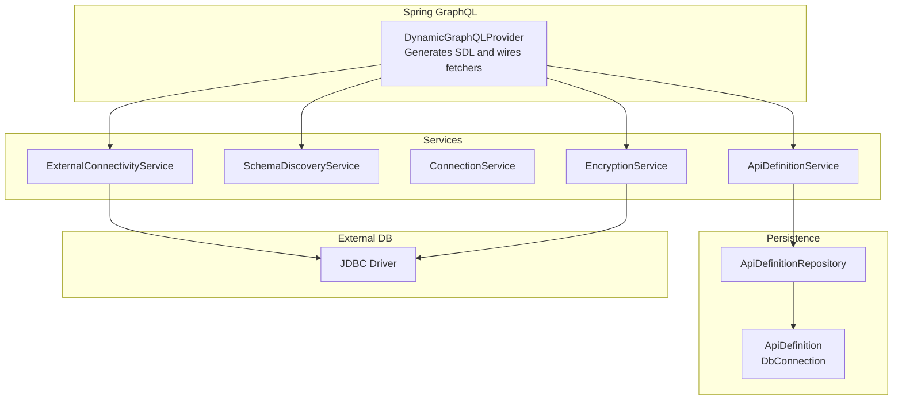
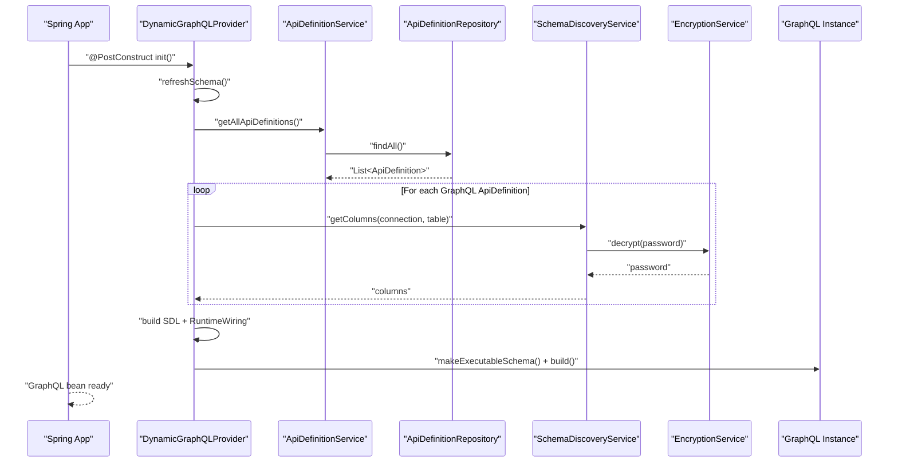
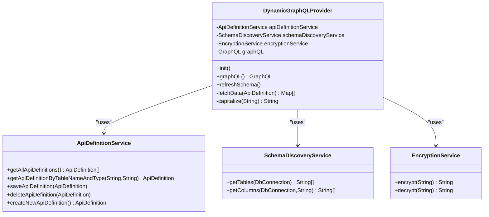
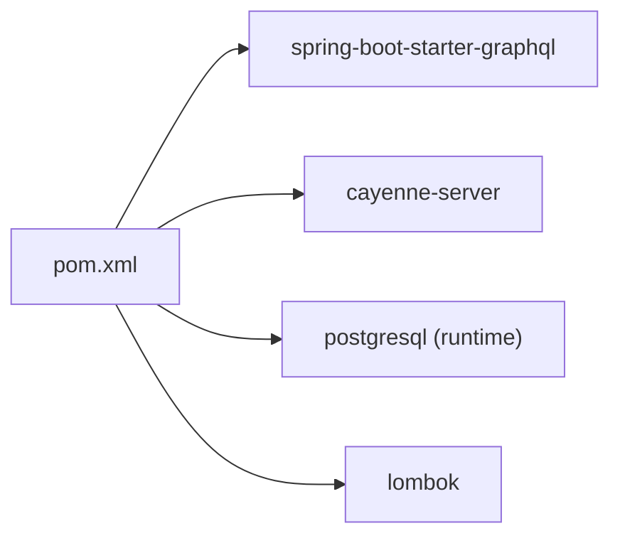
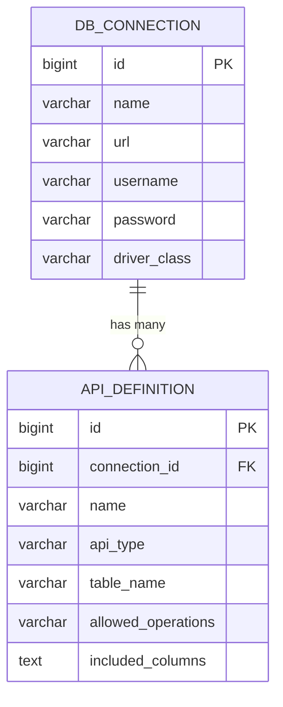

# Dynamic GraphQL Generation

<cite>
**Referenced Files in This Document**
- [DynamicGraphQLProvider.java](file://src/main/java/com/db2api/config/DynamicGraphQLProvider.java)
- [SchemaDiscoveryService.java](file://src/main/java/com/db2api/service/api/SchemaDiscoveryService.java)
- [ApiDefinitionService.java](file://src/main/java/com/db2api/service/api/ApiDefinitionService.java)
- [ApiDefinition.java](file://src/main/java/com/db2api/persistent/api/ApiDefinition.java)
- [DbConnection.java](file://src/main/java/com/db2api/persistent/connection/DbConnection.java)
- [EncryptionService.java](file://src/main/java/com/db2api/service/EncryptionService.java)
- [DynamicRestController.java](file://src/main/java/com/db2api/controller/DynamicRestController.java)
- [ExternalConnectivityService.java](file://src/main/java/com/db2api/service/connection/ExternalConnectivityService.java)
- [ConnectionService.java](file://src/main/java/com/db2api/service/connection/ConnectionService.java)
- [ApiDefinitionRepository.java](file://src/main/java/com/db2api/repository/api/ApiDefinitionRepository.java)
- [application.properties](file://src/main/resources/application.properties)
- [schema.sql](file://src/main/resources/schema.sql)
- [pom.xml](file://pom.xml)
- [README.md](file://README.md)
</cite>

## Table of Contents
1. [Introduction](#introduction)
2. [Project Structure](#project-structure)
3. [Core Components](#core-components)
4. [Architecture Overview](#architecture-overview)
5. [Detailed Component Analysis](#detailed-component-analysis)
6. [Dependency Analysis](#dependency-analysis)
7. [Performance Considerations](#performance-considerations)
8. [Troubleshooting Guide](#troubleshooting-guide)
9. [Conclusion](#conclusion)
10. [Appendices](#appendices)

## Introduction
This document explains the Dynamic GraphQL Generation system that builds a GraphQL schema at runtime from database tables defined in the system. It covers how the schema is generated from ApiDefinition entries, how SDL (Schema Definition Language) is constructed, how the runtime wiring is applied, and how data fetchers are connected to external databases. It also documents schema refresh mechanisms, error handling, and performance optimization strategies. The system integrates with Spring GraphQL, Apache Cayenne for dynamic connections, and a simple encryption service for credential handling.

## Project Structure
The Dynamic GraphQL Generation resides in the Spring Boot backend under the config and service packages. The primary runtime provider generates the schema and wires data fetchers. Supporting services handle schema discovery, API definitions persistence, encryption, and external connectivity.

**Diagram sources**
- [DynamicGraphQLProvider.java:32-132](file://src/main/java/com/db2api/config/DynamicGraphQLProvider.java#L32-L132)
- [ApiDefinitionService.java:11-38](file://src/main/java/com/db2api/service/api/ApiDefinitionService.java#L11-L38)
- [SchemaDiscoveryService.java:16-59](file://src/main/java/com/db2api/service/api/SchemaDiscoveryService.java#L16-L59)
- [ConnectionService.java:16-57](file://src/main/java/com/db2api/service/connection/ConnectionService.java#L16-L57)
- [ExternalConnectivityService.java:16-54](file://src/main/java/com/db2api/service/connection/ExternalConnectivityService.java#L16-L54)
- [EncryptionService.java:14-58](file://src/main/java/com/db2api/service/EncryptionService.java#L14-L58)
- [ApiDefinitionRepository.java:10-21](file://src/main/java/com/db2api/repository/api/ApiDefinitionRepository.java#L10-L21)
- [ApiDefinition.java:17-56](file://src/main/java/com/db2api/persistent/api/ApiDefinition.java#L17-L56)
- [DbConnection.java:20-84](file://src/main/java/com/db2api/persistent/connection/DbConnection.java#L20-L84)

**Section sources**
- [README.md:65-82](file://README.md#L65-L82)
- [pom.xml:25-98](file://pom.xml#L25-L98)

## Core Components
- DynamicGraphQLProvider: Builds the GraphQL schema from ApiDefinition entries, constructs SDL, parses it into a TypeDefinitionRegistry, wires runtime fetchers, and produces an executable GraphQL instance.
- SchemaDiscoveryService: Discovers database tables/columns via JDBC metadata to drive schema generation.
- ApiDefinitionService: Manages API definitions persisted in the system DB.
- EncryptionService: AES-based encryption/decryption for stored credentials.
- ExternalConnectivityService: Creates Cayenne ServerRuntime instances per connection and caches them for reuse.
- DynamicRestController: Provides REST endpoints for dynamic operations (contrast to GraphQL), demonstrating dynamic SQL execution against external databases.

**Section sources**
- [DynamicGraphQLProvider.java:32-132](file://src/main/java/com/db2api/config/DynamicGraphQLProvider.java#L32-L132)
- [SchemaDiscoveryService.java:16-59](file://src/main/java/com/db2api/service/api/SchemaDiscoveryService.java#L16-L59)
- [ApiDefinitionService.java:11-38](file://src/main/java/com/db2api/service/api/ApiDefinitionService.java#L11-L38)
- [EncryptionService.java:14-58](file://src/main/java/com/db2api/service/EncryptionService.java#L14-L58)
- [ExternalConnectivityService.java:16-54](file://src/main/java/com/db2api/service/connection/ExternalConnectivityService.java#L16-L54)
- [DynamicRestController.java:21-167](file://src/main/java/com/db2api/controller/DynamicRestController.java#L21-L167)

## Architecture Overview
The Dynamic GraphQL system operates as follows:
- On startup, DynamicGraphQLProvider initializes and refreshes the schema.
- It enumerates ApiDefinition entries marked for GraphQL, discovers table columns, and builds SDL.
- The SDL is parsed into a TypeDefinitionRegistry, and RuntimeWiring attaches data fetchers keyed by table names.
- Each data fetcher executes a SELECT against the external database using the connection defined in ApiDefinition.
- Results are returned as lists of maps, suitable for GraphQL resolution.

**Diagram sources**
- [DynamicGraphQLProvider.java:58-132](file://src/main/java/com/db2api/config/DynamicGraphQLProvider.java#L58-L132)
- [ApiDefinitionService.java:19-25](file://src/main/java/com/db2api/service/api/ApiDefinitionService.java#L19-L25)
- [ApiDefinitionRepository.java:13-20](file://src/main/java/com/db2api/repository/api/ApiDefinitionRepository.java#L13-L20)
- [SchemaDiscoveryService.java:42-58](file://src/main/java/com/db2api/service/api/SchemaDiscoveryService.java#L42-L58)
- [EncryptionService.java:47-57](file://src/main/java/com/db2api/service/EncryptionService.java#L47-L57)

## Detailed Component Analysis

### DynamicGraphQLProvider
Responsibilities:
- Initialize and refresh the GraphQL schema.
- Enumerate ApiDefinition entries with GraphQL type.
- Build SDL for Query fields and corresponding types.
- Discover columns via SchemaDiscoveryService.
- Wire data fetchers keyed by table names.
- Construct an executable GraphQL schema and expose it as a Spring bean.

Key behaviors:
- Schema refresh constructs SDL with a Query field per table and a matching type with String fields for each discovered column.
- Data fetchers execute SELECT statements against the external database using JDBC.
- If no GraphQL APIs are defined, a minimal SDL is produced to avoid errors.

**Diagram sources**
- [DynamicGraphQLProvider.java:32-178](file://src/main/java/com/db2api/config/DynamicGraphQLProvider.java#L32-L178)
- [ApiDefinitionService.java:11-38](file://src/main/java/com/db2api/service/api/ApiDefinitionService.java#L11-L38)
- [SchemaDiscoveryService.java:16-59](file://src/main/java/com/db2api/service/api/SchemaDiscoveryService.java#L16-L59)
- [EncryptionService.java:14-58](file://src/main/java/com/db2api/service/EncryptionService.java#L14-L58)

**Section sources**
- [DynamicGraphQLProvider.java:58-132](file://src/main/java/com/db2api/config/DynamicGraphQLProvider.java#L58-L132)
- [DynamicGraphQLProvider.java:140-164](file://src/main/java/com/db2api/config/DynamicGraphQLProvider.java#L140-L164)

### SchemaDiscoveryService
Responsibilities:
- Discover database tables and columns using JDBC DatabaseMetaData.
- Decrypt connection passwords via EncryptionService before connecting.

Behavior:
- getTables returns table names for a given DbConnection.
- getColumns returns column names for a given table and connection.

**Section sources**
- [SchemaDiscoveryService.java:24-58](file://src/main/java/com/db2api/service/api/SchemaDiscoveryService.java#L24-L58)

### ApiDefinitionService and ApiDefinitionRepository
Responsibilities:
- Retrieve, save, and manage ApiDefinition entities.
- Find ApiDefinition by table name and API type.

Integration:
- ApiDefinitionRepository provides a finder by table name and API type.

**Section sources**
- [ApiDefinitionService.java:19-37](file://src/main/java/com/db2api/service/api/ApiDefinitionService.java#L19-L37)
- [ApiDefinitionRepository.java:13-20](file://src/main/java/com/db2api/repository/api/ApiDefinitionRepository.java#L13-L20)
- [ApiDefinition.java:17-56](file://src/main/java/com/db2api/persistent/api/ApiDefinition.java#L17-L56)

### EncryptionService
Responsibilities:
- Provide AES encryption/decryption for sensitive data like passwords.
- Prepare a secret key from a configurable secret property.

Usage:
- Used by SchemaDiscoveryService and ExternalConnectivityService to decrypt stored credentials.

**Section sources**
- [EncryptionService.java:18-57](file://src/main/java/com/db2api/service/EncryptionService.java#L18-L57)

### ExternalConnectivityService
Responsibilities:
- Create and cache Cayenne ServerRuntime instances per connection ID.
- Provide ObjectContext for executing SQL against external databases.

Note:
- The Dynamic GraphQL provider currently uses JDBC for data fetching; ExternalConnectivityService is primarily used by REST endpoints.

**Section sources**
- [ExternalConnectivityService.java:25-53](file://src/main/java/com/db2api/service/connection/ExternalConnectivityService.java#L25-L53)

### DynamicRestController (contextual)
While not part of GraphQL, this controller demonstrates dynamic SQL execution against external databases using Cayenne and ApiDefinition configurations. It contrasts with GraphQL’s static SDL plus runtime fetchers approach.

**Section sources**
- [DynamicRestController.java:47-81](file://src/main/java/com/db2api/controller/DynamicRestController.java#L47-L81)
- [DynamicRestController.java:90-125](file://src/main/java/com/db2api/controller/DynamicRestController.java#L90-L125)
- [DynamicRestController.java:134-166](file://src/main/java/com/db2api/controller/DynamicRestController.java#L134-L166)

## Dependency Analysis
The Dynamic GraphQL system depends on:
- Spring GraphQL starter for GraphQL support.
- JDBC drivers for external database connectivity.
- Lombok for concise entity definitions.
- Apache Cayenne for optional external connectivity (used by REST endpoints).

**Diagram sources**
- [pom.xml:25-98](file://pom.xml#L25-L98)

**Section sources**
- [pom.xml:25-98](file://pom.xml#L25-L98)

## Performance Considerations
- Schema refresh cost: Building SDL and wiring fetchers occurs during initialization and refresh. Minimize unnecessary refresh calls.
- Column discovery: SchemaDiscoveryService performs JDBC metadata queries per table. Cache results if frequently accessed.
- Data fetchers: Each GraphQL query triggers a SELECT against the external database. Consider pagination, filtering, and limiting columns in ApiDefinition to reduce payload sizes.
- Connection pooling: ExternalConnectivityService caches Cayenne runtimes. For JDBC-based fetchers, consider adding a connection pool for external DB connections.
- Encryption overhead: EncryptionService computes keys on demand. Cache the prepared key if called frequently.
- Query complexity: Prefer simpler SDL types (String) for now; consider mapping SQL types to GraphQL types to reduce conversion overhead.

[No sources needed since this section provides general guidance]

## Troubleshooting Guide
Common issues and resolutions:
- Empty or minimal schema: If no GraphQL ApiDefinition entries exist, the provider falls back to a minimal SDL with a hello field. Verify ApiDefinition entries with api_type set to GraphQL.
- Column mapping: Current implementation maps all columns to String. Extend SchemaDiscoveryService to map SQL types to GraphQL types for accurate schemas.
- Credentials decryption failures: Ensure the encryption secret property is correctly set and matches the server configuration.
- External database connectivity: Confirm JDBC URL, driver class, username, and decrypted password are valid. Test connections via ConnectionService.
- Runtime errors in fetchers: Exceptions during JDBC execution are printed. Wrap in proper logging and return structured error responses.

**Section sources**
- [DynamicGraphQLProvider.java:115-120](file://src/main/java/com/db2api/config/DynamicGraphQLProvider.java#L115-L120)
- [DynamicGraphQLProvider.java:160-163](file://src/main/java/com/db2api/config/DynamicGraphQLProvider.java#L160-L163)
- [EncryptionService.java:30-33](file://src/main/java/com/db2api/service/EncryptionService.java#L30-L33)
- [ConnectionService.java:47-56](file://src/main/java/com/db2api/service/connection/ConnectionService.java#L47-L56)

## Conclusion
The Dynamic GraphQL Generation system dynamically constructs a GraphQL schema from database tables defined in ApiDefinition entries. It leverages SDL generation, runtime wiring, and JDBC-based data fetchers to expose external database content via GraphQL. The system is extensible: mapping SQL types to GraphQL types, adding connection pooling, and optimizing schema refresh frequency will improve accuracy and performance.

[No sources needed since this section summarizes without analyzing specific files]

## Appendices

### Example: Generating GraphQL Schema from Table Structures
- Create ApiDefinition entries with api_type set to GraphQL and specify the target table and connection.
- Ensure SchemaDiscoveryService can discover columns for the table.
- Invoke refreshSchema to regenerate the schema and data fetchers.
- Query the GraphQL endpoint to retrieve data.

**Section sources**
- [ApiDefinition.java:34-36](file://src/main/java/com/db2api/persistent/api/ApiDefinition.java#L34-L36)
- [ApiDefinitionService.java:19-25](file://src/main/java/com/db2api/service/api/ApiDefinitionService.java#L19-L25)
- [SchemaDiscoveryService.java:42-58](file://src/main/java/com/db2api/service/api/SchemaDiscoveryService.java#L42-L58)
- [DynamicGraphQLProvider.java:77-132](file://src/main/java/com/db2api/config/DynamicGraphQLProvider.java#L77-L132)

### Example: Handling Complex Relationships
- Current implementation exposes flat table lists. To support relationships:
  - Introduce foreign key discovery and join logic.
  - Extend SDL generation to include nested fields and unions/interfaces.
  - Enhance data fetchers to resolve relations via joins or separate queries.

[No sources needed since this section provides general guidance]

### Example: Customizing GraphQL Types
- Modify SchemaDiscoveryService to map SQL types to GraphQL types (e.g., integer, boolean, datetime).
- Update SDL generation to emit precise types instead of String for all fields.
- Adjust data fetchers to normalize values according to GraphQL types.

[No sources needed since this section provides general guidance]

### Schema Refresh Mechanisms
- Programmatic refresh: Call refreshSchema programmatically when ApiDefinition entries change.
- Cache invalidation: For Cayenne-based external connectivity, invalidate cached runtimes when connection details change.

**Section sources**
- [DynamicGraphQLProvider.java:77-132](file://src/main/java/com/db2api/config/DynamicGraphQLProvider.java#L77-L132)
- [ExternalConnectivityService.java:33-38](file://src/main/java/com/db2api/service/connection/ExternalConnectivityService.java#L33-L38)

### Data Model Overview

**Diagram sources**
- [schema.sql:14-31](file://src/main/resources/schema.sql#L14-L31)
- [DbConnection.java:20-84](file://src/main/java/com/db2api/persistent/connection/DbConnection.java#L20-L84)
- [ApiDefinition.java:17-56](file://src/main/java/com/db2api/persistent/api/ApiDefinition.java#L17-L56)