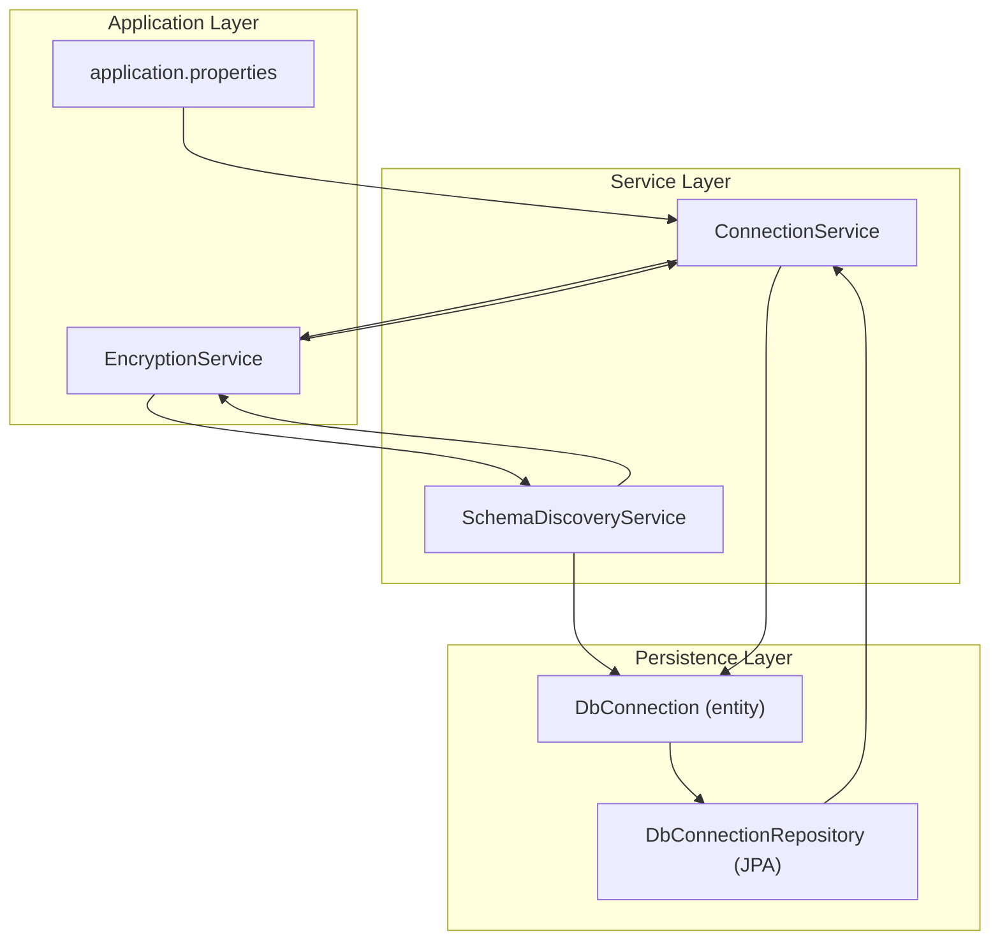
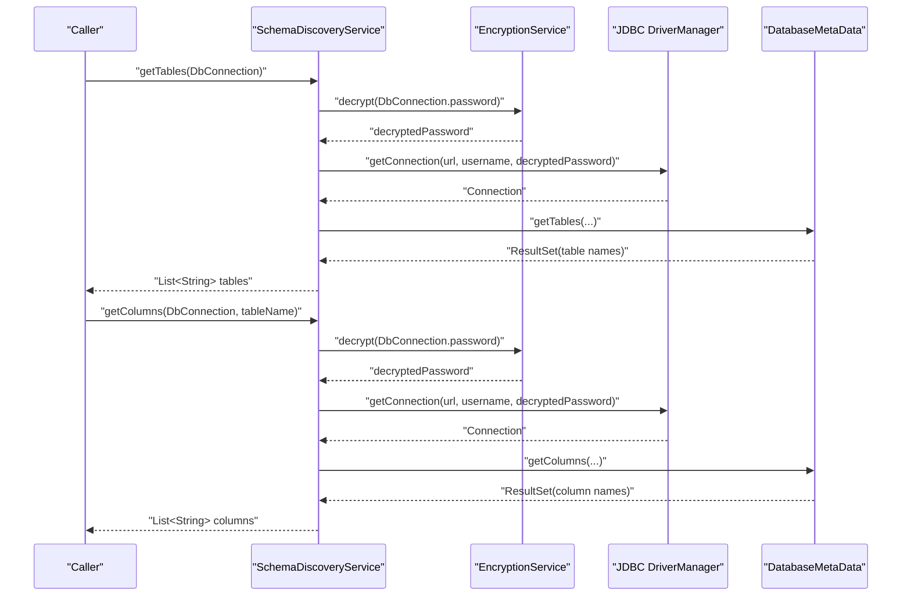
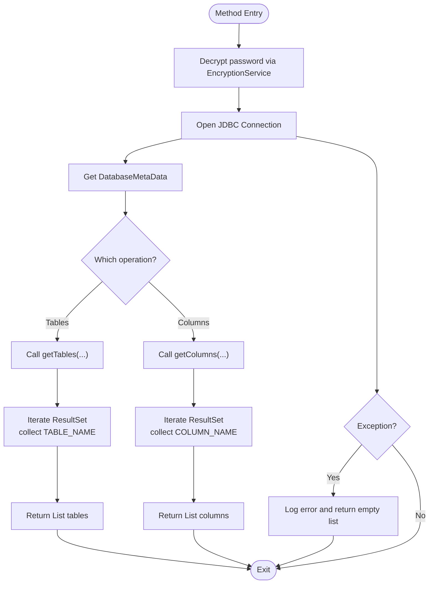
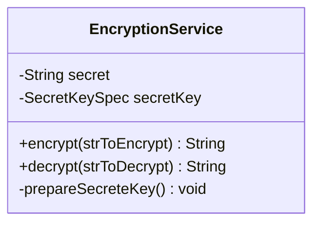
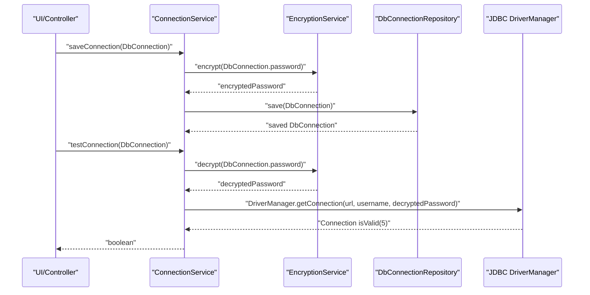
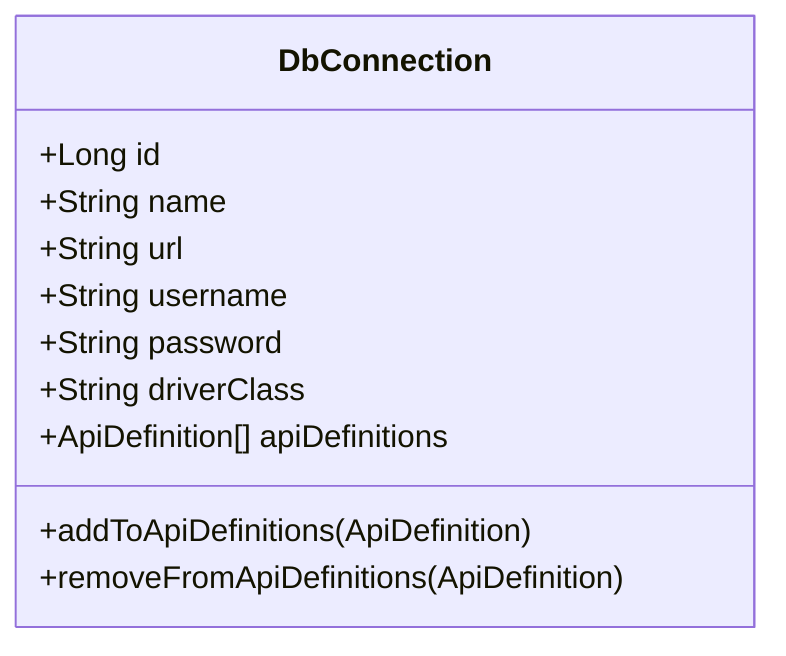
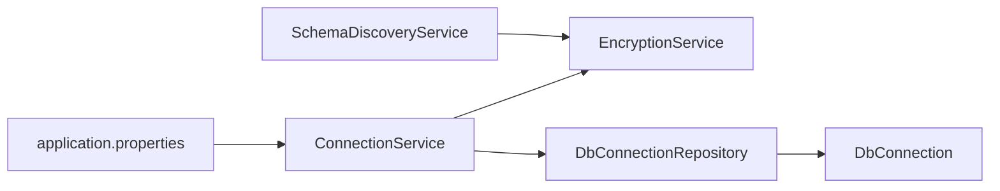

# Schema Discovery Service

<cite>
**Referenced Files in This Document**
- [SchemaDiscoveryService.java](file://src/main/java/com/db2api/service/api/SchemaDiscoveryService.java)
- [EncryptionService.java](file://src/main/java/com/db2api/service/EncryptionService.java)
- [ConnectionService.java](file://src/main/java/com/db2api/service/ConnectionService.java)
- [DbConnection.java](file://src/main/java/com/db2api/persistent/connection/DbConnection.java)
- [DbConnectionRepository.java](file://src/main/java/com/db2api/repository/connection/DbConnectionRepository.java)
- [application.properties](file://src/main/resources/application.properties)
- [README.md](file://README.md)
</cite>

## Table of Contents
1. [Introduction](#introduction)
2. [Project Structure](#project-structure)
3. [Core Components](#core-components)
4. [Architecture Overview](#architecture-overview)
5. [Detailed Component Analysis](#detailed-component-analysis)
6. [Dependency Analysis](#dependency-analysis)
7. [Performance Considerations](#performance-considerations)
8. [Troubleshooting Guide](#troubleshooting-guide)
9. [Conclusion](#conclusion)

## Introduction
This document explains the Schema Discovery Service component responsible for introspecting external database schemas to extract table structures and column definitions. It covers how the service connects to databases via JDBC, retrieves metadata using standard JDBC DatabaseMetaData, and maps discovered schema elements. It also documents connection handling, credential encryption, error handling, and potential optimizations for performance and reliability.

## Project Structure
The Schema Discovery Service resides in the service layer and collaborates with encryption utilities and persistence entities to manage database connections and credentials. The application’s configuration defines the system database used for storing connection metadata.

**Diagram sources**
- [application.properties:1-20](file://src/main/resources/application.properties#L1-L20)
- [EncryptionService.java:1-59](file://src/main/java/com/db2api/service/EncryptionService.java#L1-L59)
- [DbConnection.java:1-85](file://src/main/java/com/db2api/persistent/connection/DbConnection.java#L1-L85)
- [DbConnectionRepository.java:1-13](file://src/main/java/com/db2api/repository/connection/DbConnectionRepository.java#L1-L13)
- [SchemaDiscoveryService.java:1-60](file://src/main/java/com/db2api/service/api/SchemaDiscoveryService.java#L1-L60)
- [ConnectionService.java:1-54](file://src/main/java/com/db2api/service/ConnectionService.java#L1-L54)

**Section sources**
- [application.properties:1-20](file://src/main/resources/application.properties#L1-L20)
- [README.md:1-99](file://README.md#L1-L99)

## Core Components
- SchemaDiscoveryService: Provides methods to discover database tables and columns by connecting to external databases using JDBC and querying DatabaseMetaData.
- EncryptionService: Handles encryption and decryption of sensitive connection credentials stored in the system database.
- ConnectionService: Manages database connection lifecycle, including testing connectivity and persisting encrypted credentials.
- DbConnection: JPA entity representing a database connection configuration with JDBC URL, username, encrypted password, and driver class.
- DbConnectionRepository: JPA repository for DbConnection persistence.

**Section sources**
- [SchemaDiscoveryService.java:1-60](file://src/main/java/com/db2api/service/api/SchemaDiscoveryService.java#L1-L60)
- [EncryptionService.java:1-59](file://src/main/java/com/db2api/service/EncryptionService.java#L1-L59)
- [ConnectionService.java:1-54](file://src/main/java/com/db2api/service/ConnectionService.java#L1-L54)
- [DbConnection.java:1-85](file://src/main/java/com/db2api/persistent/connection/DbConnection.java#L1-L85)
- [DbConnectionRepository.java:1-13](file://src/main/java/com/db2api/repository/connection/DbConnectionRepository.java#L1-L13)

## Architecture Overview
The Schema Discovery Service operates by:
- Decrypting stored credentials using EncryptionService.
- Establishing a JDBC connection to the target database using the decrypted credentials.
- Using DatabaseMetaData to enumerate tables and columns.
- Returning lists of table names and column names to the caller.

**Diagram sources**
- [SchemaDiscoveryService.java:24-58](file://src/main/java/com/db2api/service/api/SchemaDiscoveryService.java#L24-L58)
- [EncryptionService.java:47-57](file://src/main/java/com/db2api/service/EncryptionService.java#L47-L57)

## Detailed Component Analysis

### SchemaDiscoveryService
Responsibilities:
- Discover database tables for a given DbConnection by querying DatabaseMetaData.getTables.
- Discover column names for a specific table by querying DatabaseMetaData.getColumns.
- Manage per-call JDBC connections and handle exceptions during discovery.

Implementation highlights:
- Uses try-with-resources to ensure connections and result sets are closed.
- Leverages EncryptionService to decrypt stored passwords before connecting.
- Returns empty lists on errors to avoid crashing callers.

**Diagram sources**
- [SchemaDiscoveryService.java:24-58](file://src/main/java/com/db2api/service/api/SchemaDiscoveryService.java#L24-L58)
- [EncryptionService.java:47-57](file://src/main/java/com/db2api/service/EncryptionService.java#L47-L57)

**Section sources**
- [SchemaDiscoveryService.java:24-58](file://src/main/java/com/db2api/service/api/SchemaDiscoveryService.java#L24-L58)

### EncryptionService
Responsibilities:
- Provide symmetric encryption and decryption of sensitive data (e.g., connection passwords).
- Derive a 16-byte AES key from a configurable secret string.

Behavior:
- Uses AES/ECB/PKCS5Padding for encryption/decryption.
- Logs errors during encryption/decryption operations.

**Diagram sources**
- [EncryptionService.java:14-58](file://src/main/java/com/db2api/service/EncryptionService.java#L14-L58)

**Section sources**
- [EncryptionService.java:18-57](file://src/main/java/com/db2api/service/EncryptionService.java#L18-L57)

### ConnectionService
Responsibilities:
- Persist and retrieve DbConnection entities.
- Test connectivity to a DbConnection by validating the JDBC connection.
- Encrypt passwords before saving to the system database.

Integration:
- Works with DbConnectionRepository for persistence.
- Uses EncryptionService for encrypt/decrypt operations.

**Diagram sources**
- [ConnectionService.java:27-52](file://src/main/java/com/db2api/service/ConnectionService.java#L27-L52)
- [EncryptionService.java:35-57](file://src/main/java/com/db2api/service/EncryptionService.java#L35-L57)
- [DbConnectionRepository.java:11-12](file://src/main/java/com/db2api/repository/connection/DbConnectionRepository.java#L11-L12)

**Section sources**
- [ConnectionService.java:18-52](file://src/main/java/com/db2api/service/ConnectionService.java#L18-L52)
- [DbConnectionRepository.java:11-12](file://src/main/java/com/db2api/repository/connection/DbConnectionRepository.java#L11-L12)

### DbConnection Entity
Responsibilities:
- Store connection metadata: name, JDBC URL, username, encrypted password, and driver class.
- Maintain bidirectional relationship with ApiDefinition.

**Diagram sources**
- [DbConnection.java:20-83](file://src/main/java/com/db2api/persistent/connection/DbConnection.java#L20-L83)

**Section sources**
- [DbConnection.java:20-83](file://src/main/java/com/db2api/persistent/connection/DbConnection.java#L20-L83)

### Data Types and Column Mapping Strategy
Current implementation:
- Discovers table names and column names using JDBC DatabaseMetaData.
- Does not extract detailed data types or constraints in the provided code.

Recommendations for extending column mapping:
- Use DatabaseMetaData.getColumns to retrieve column attributes such as type name, precision, scale, nullability, and default values.
- Map JDBC type names to application-level type descriptors for downstream API generation.
- Normalize vendor-specific types to a canonical representation.

Note: The current code focuses on names; detailed type extraction is not implemented in the referenced files.

**Section sources**
- [SchemaDiscoveryService.java:29-34](file://src/main/java/com/db2api/service/api/SchemaDiscoveryService.java#L29-L34)
- [SchemaDiscoveryService.java:47-52](file://src/main/java/com/db2api/service/api/SchemaDiscoveryService.java#L47-L52)

### Discovering Schemas Across Database Systems
Supported systems:
- The project README indicates support for MySQL, PostgreSQL, and DB2, with extensibility to other SQL databases.

Notes:
- The application’s system database is configured to PostgreSQL.
- Schema discovery relies on JDBC and DatabaseMetaData, which are standardized. However, actual behavior depends on the JDBC driver used for the target database.

**Section sources**
- [README.md:31-34](file://README.md#L31-L34)
- [application.properties:7-16](file://src/main/resources/application.properties#L7-L16)

## Dependency Analysis
- SchemaDiscoveryService depends on EncryptionService for credential decryption.
- ConnectionService depends on EncryptionService for encrypting credentials and on DbConnectionRepository for persistence.
- DbConnectionRepository is a JPA repository for DbConnection.
- application.properties configures the system database used for storing connection metadata.

**Diagram sources**
- [SchemaDiscoveryService.java:18-22](file://src/main/java/com/db2api/service/api/SchemaDiscoveryService.java#L18-L22)
- [EncryptionService.java:18-19](file://src/main/java/com/db2api/service/EncryptionService.java#L18-L19)
- [ConnectionService.java:15-21](file://src/main/java/com/db2api/service/ConnectionService.java#L15-L21)
- [DbConnectionRepository.java:11-12](file://src/main/java/com/db2api/repository/connection/DbConnectionRepository.java#L11-L12)
- [DbConnection.java:62-63](file://src/main/java/com/db2api/persistent/connection/DbConnection.java#L62-L63)
- [application.properties:7-16](file://src/main/resources/application.properties#L7-L16)

**Section sources**
- [SchemaDiscoveryService.java:18-22](file://src/main/java/com/db2api/service/api/SchemaDiscoveryService.java#L18-L22)
- [ConnectionService.java:15-21](file://src/main/java/com/db2api/service/ConnectionService.java#L15-L21)
- [DbConnectionRepository.java:11-12](file://src/main/java/com/db2api/repository/connection/DbConnectionRepository.java#L11-L12)
- [DbConnection.java:62-63](file://src/main/java/com/db2api/persistent/connection/DbConnection.java#L62-L63)
- [application.properties:7-16](file://src/main/resources/application.properties#L7-L16)

## Performance Considerations
- Connection lifecycle: Current implementation opens and closes a JDBC connection per discovery call. This is simple but can be costly under frequent calls.
- Recommendations:
  - Reuse connections or use a connection pool for external databases to reduce overhead.
  - Add caching for discovered table/column lists keyed by DbConnection identity and a schema version timestamp.
  - Limit discovery scans to specific schemas/namespaces when supported by the target database.
  - Batch metadata queries where possible to minimize round trips.

[No sources needed since this section provides general guidance]

## Troubleshooting Guide
Common issues and resolutions:
- Connection failures:
  - Verify JDBC URL, username, and decrypted password.
  - Confirm the JDBC driver class name matches the target database.
  - Ensure network connectivity and firewall rules allow outbound connections.
- Empty results:
  - Confirm the target database contains tables/views matching the discovery criteria.
  - Check case sensitivity of table names and schema filters.
- Credential errors:
  - Ensure EncryptionService secret is consistent across deployments.
  - Validate that passwords are encrypted before saving and decrypted during use.

Operational checks:
- Use ConnectionService.testConnection to validate connectivity before attempting discovery.
- Monitor logs for exceptions thrown during discovery or encryption/decryption.

**Section sources**
- [ConnectionService.java:44-52](file://src/main/java/com/db2api/service/ConnectionService.java#L44-L52)
- [EncryptionService.java:35-57](file://src/main/java/com/db2api/service/EncryptionService.java#L35-L57)
- [SchemaDiscoveryService.java:35-38](file://src/main/java/com/db2api/service/api/SchemaDiscoveryService.java#L35-L38)

## Conclusion
The Schema Discovery Service provides a straightforward mechanism to discover tables and columns from external databases using JDBC and DatabaseMetaData. It integrates with EncryptionService to securely handle credentials and works alongside ConnectionService and DbConnection for connection management. Extending the service to include detailed column type mapping and adding connection pooling and caching would improve performance and robustness for production use.