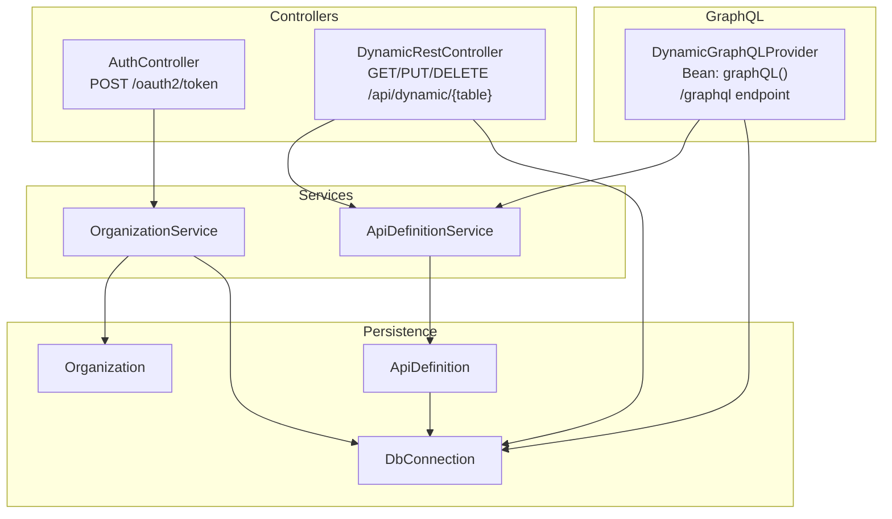
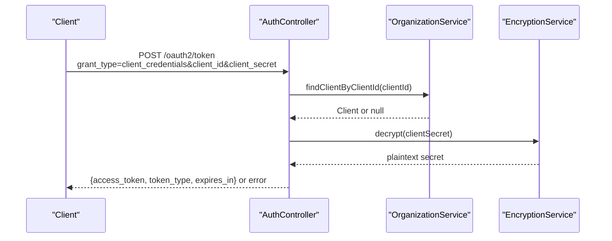
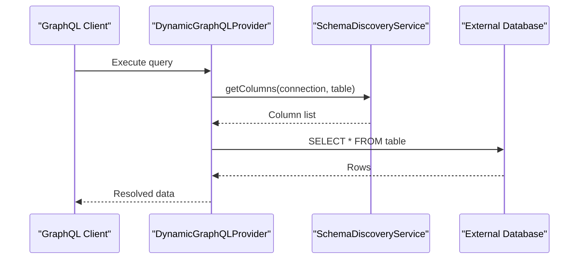
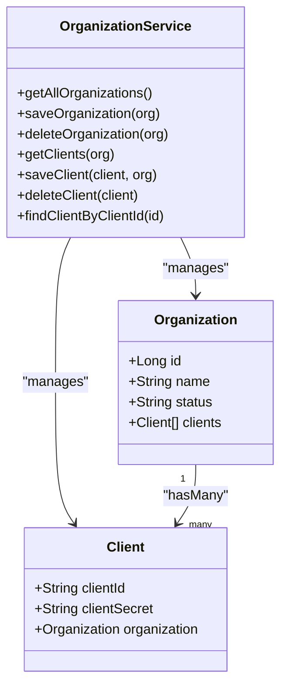
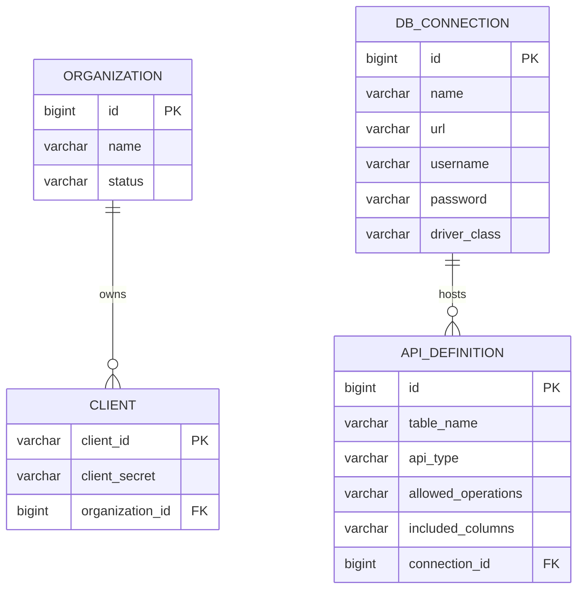
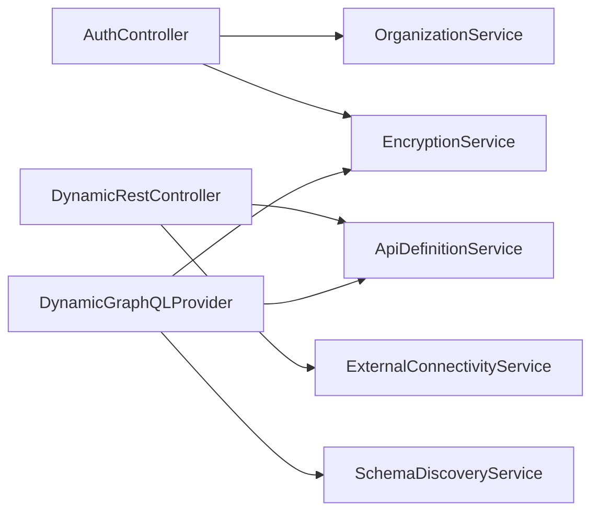

# API Reference

<cite>
**Referenced Files in This Document**
- [README.md](file://README.md)
- [application.properties](file://src/main/resources/application.properties)
- [AuthController.java](file://src/main/java/com/db2api/controller/AuthController.java)
- [DynamicRestController.java](file://src/main/java/com/db2api/controller/DynamicRestController.java)
- [DynamicGraphQLProvider.java](file://src/main/java/com/db2api/config/DynamicGraphQLProvider.java)
- [SecurityConfig.java](file://src/main/java/com/db2api/config/SecurityConfig.java)
- [OrganizationService.java](file://src/main/java/com/db2api/service/organization/OrganizationService.java)
- [ApiDefinitionService.java](file://src/main/java/com/db2api/service/api/ApiDefinitionService.java)
- [Organization.java](file://src/main/java/com/db2api/persistent/organization/Organization.java)
- [DbConnection.java](file://src/main/java/com/db2api/persistent/connection/DbConnection.java)
- [ApiDefinition.java](file://src/main/java/com/db2api/persistent/api/ApiDefinition.java)
</cite>

## Table of Contents
1. [Introduction](#introduction)
2. [Project Structure](#project-structure)
3. [Core Components](#core-components)
4. [Architecture Overview](#architecture-overview)
5. [Detailed Component Analysis](#detailed-component-analysis)
6. [Dependency Analysis](#dependency-analysis)
7. [Performance Considerations](#performance-considerations)
8. [Troubleshooting Guide](#troubleshooting-guide)
9. [Conclusion](#conclusion)
10. [Appendices](#appendices)

## Introduction
This document provides a comprehensive API reference for DB2API’s public interfaces. It covers:
- Authentication endpoints (OAuth2 client_credentials token issuance)
- Management endpoints for organizations and clients
- Dynamic REST API endpoints for CRUD operations against configured database tables
- GraphQL schema exposure and runtime wiring
- HTTP methods, URL patterns, request/response schemas, authentication requirements, and error handling
- Practical usage examples, client implementation guidelines, and integration patterns
- Rate limiting, versioning, and API evolution strategies

## Project Structure
The API surface is primarily implemented in Spring MVC controllers and GraphQL wiring, backed by services and persistent entities. Configuration includes Spring Security, Vaadin integration, and Cayenne for dynamic database access.

**Diagram sources**
- [AuthController.java:54-109](file://src/main/java/com/db2api/controller/AuthController.java#L54-L109)
- [DynamicRestController.java:47-166](file://src/main/java/com/db2api/controller/DynamicRestController.java#L47-L166)
- [DynamicGraphQLProvider.java:68-132](file://src/main/java/com/db2api/config/DynamicGraphQLProvider.java#L68-L132)
- [OrganizationService.java:79-81](file://src/main/java/com/db2api/service/organization/OrganizationService.java#L79-L81)
- [ApiDefinitionService.java:23-25](file://src/main/java/com/db2api/service/api/ApiDefinitionService.java#L23-L25)
- [Organization.java:14-65](file://src/main/java/com/db2api/persistent/organization/Organization.java#L14-L65)
- [DbConnection.java:16-85](file://src/main/java/com/db2api/persistent/connection/DbConnection.java#L16-L85)
- [ApiDefinition.java:13-57](file://src/main/java/com/db2api/persistent/api/ApiDefinition.java#L13-L57)

**Section sources**
- [README.md:84-99](file://README.md#L84-L99)
- [application.properties:1-20](file://src/main/resources/application.properties#L1-L20)

## Core Components
- Authentication: OAuth2 client_credentials token issuance via a dedicated endpoint.
- Dynamic REST: CRUD over external databases mapped by API definitions.
- GraphQL: Dynamic schema generation exposing configured tables as queries.
- Management: Organization and Client lifecycle managed by services and repositories.

**Section sources**
- [AuthController.java:25-109](file://src/main/java/com/db2api/controller/AuthController.java#L25-L109)
- [DynamicRestController.java:21-166](file://src/main/java/com/db2api/controller/DynamicRestController.java#L21-L166)
- [DynamicGraphQLProvider.java:31-132](file://src/main/java/com/db2api/config/DynamicGraphQLProvider.java#L31-L132)
- [OrganizationService.java:15-83](file://src/main/java/com/db2api/service/organization/OrganizationService.java#L15-L83)
- [ApiDefinitionService.java:10-39](file://src/main/java/com/db2api/service/api/ApiDefinitionService.java#L10-L39)

## Architecture Overview
The system exposes:
- REST endpoints under /api/dynamic/{table} for GET (list), PUT (insert), DELETE (filtered)
- OAuth2 token endpoint at /oauth2/token
- GraphQL endpoint via /graphql (exposed by the GraphQL bean)

**Diagram sources**
- [AuthController.java:54-109](file://src/main/java/com/db2api/controller/AuthController.java#L54-L109)
- [OrganizationService.java:79-81](file://src/main/java/com/db2api/service/organization/OrganizationService.java#L79-L81)

## Detailed Component Analysis

### Authentication Endpoints
- Endpoint: POST /oauth2/token
- Purpose: Issue a JWT access token using OAuth2 client_credentials grant type.
- Authentication: None required for token issuance; validates client credentials.
- Request parameters:
  - grant_type: Must be client_credentials
  - client_id: Registered client identifier
  - client_secret: Client secret (plaintext comparison against stored encrypted value)
- Response:
  - Success: {access_token, token_type, expires_in}
  - Error: {error} with appropriate HTTP status (400 for unsupported_grant_type, 401 for invalid_client, 500 for server_error)
- Notes:
  - Token audience/issuer and scopes are defined in the controller.
  - Expiration is set to 1 hour from issuance.

Practical example:
- Obtain token:
  - curl -X POST "https://host:port/oauth2/token" -F "grant_type=client_credentials" -F "client_id=YOUR_CLIENT_ID" -F "client_secret=YOUR_CLIENT_SECRET"
- Use token:
  - curl -H "Authorization: Bearer YOUR_ACCESS_TOKEN" "https://host:port/api/dynamic/your_table"

**Section sources**
- [AuthController.java:54-109](file://src/main/java/com/db2api/controller/AuthController.java#L54-L109)
- [OrganizationService.java:79-81](file://src/main/java/com/db2api/service/organization/OrganizationService.java#L79-L81)

### Dynamic REST API Endpoints
Base path: /api/dynamic/{tableName}

- GET /api/dynamic/{tableName}
  - Description: Retrieve records from the external database table.
  - Allowed only if ApiDefinition.allowedOperations includes GET.
  - Response: Array of objects (rows) with selected columns.
  - Errors: 404 if table not mapped, 405 if GET not allowed, 500 on internal error.

- PUT /api/dynamic/{tableName}
  - Description: Insert a record into the table.
  - Allowed only if ApiDefinition.allowedOperations includes PUT.
  - Request body: JSON object with column-value pairs.
  - Response: {status: "success"} on success; error object on failure.
  - Errors: 405 if PUT not allowed, 500 on internal error.

- DELETE /api/dynamic/{tableName}?conditions...
  - Description: Delete records matching provided conditions.
  - Allowed only if ApiDefinition.allowedOperations includes DELETE.
  - Query parameters: key=value pairs forming WHERE conditions (AND joined).
  - Response: {status: "success"} on success; error object on failure.
  - Errors: 400 if no conditions provided, 405 if DELETE not allowed, 500 on internal error.

Security note:
- Controllers currently lack explicit client authorization checks per request. Consider integrating client-scoped access validation using the issued token and client identity.

**Section sources**
- [DynamicRestController.java:47-166](file://src/main/java/com/db2api/controller/DynamicRestController.java#L47-L166)
- [ApiDefinitionService.java:23-25](file://src/main/java/com/db2api/service/api/ApiDefinitionService.java#L23-L25)

### GraphQL API
- Endpoint: /graphql (via the GraphQL bean)
- Schema generation:
  - Scans ApiDefinition entries where api_type is GraphQL.
  - Builds a Query field for each table and a corresponding type with String-typed fields.
  - Data fetchers execute SELECT * against the configured DbConnection.
- Refresh:
  - Schema is rebuilt at startup and can be refreshed programmatically via refreshSchema().
- Example query:
  - query { your_table { column1 column2 ... } }

**Diagram sources**
- [DynamicGraphQLProvider.java:77-132](file://src/main/java/com/db2api/config/DynamicGraphQLProvider.java#L77-L132)
- [DynamicGraphQLProvider.java:140-164](file://src/main/java/com/db2api/config/DynamicGraphQLProvider.java#L140-L164)

**Section sources**
- [DynamicGraphQLProvider.java:31-132](file://src/main/java/com/db2api/config/DynamicGraphQLProvider.java#L31-L132)

### Management Endpoints (Organizations and Clients)
The UI layer exposes views for managing organizations and clients. While the controllers are not shown in the provided files, the services and persistence entities indicate the following capabilities:

- Organization
  - Entities: Organization, Client
  - Services: OrganizationService provides CRUD and client management helpers
  - Persistence: JPA entities with relationships

- Client
  - On creation, if client_id is absent, a UUID is generated.
  - The raw client_secret is encrypted before storage.
  - Clients belong to an Organization.

**Diagram sources**
- [Organization.java:14-65](file://src/main/java/com/db2api/persistent/organization/Organization.java#L14-L65)
- [OrganizationService.java:15-83](file://src/main/java/com/db2api/service/organization/OrganizationService.java#L15-L83)

**Section sources**
- [OrganizationService.java:15-83](file://src/main/java/com/db2api/service/organization/OrganizationService.java#L15-L83)
- [Organization.java:14-65](file://src/main/java/com/db2api/persistent/organization/Organization.java#L14-L65)

### Data Model Overview

**Diagram sources**
- [Organization.java:14-65](file://src/main/java/com/db2api/persistent/organization/Organization.java#L14-L65)
- [DbConnection.java:16-85](file://src/main/java/com/db2api/persistent/connection/DbConnection.java#L16-L85)
- [ApiDefinition.java:13-57](file://src/main/java/com/db2api/persistent/api/ApiDefinition.java#L13-L57)

## Dependency Analysis
- AuthController depends on OrganizationService and EncryptionService to validate client credentials and issue tokens.
- DynamicRestController depends on ApiDefinitionService and ExternalConnectivityService to resolve table mappings and execute SQL against external databases.
- DynamicGraphQLProvider depends on ApiDefinitionService, SchemaDiscoveryService, and EncryptionService to build and wire the GraphQL schema.
- SecurityConfig integrates Vaadin login and sets up password encoding.

**Diagram sources**
- [AuthController.java:28-43](file://src/main/java/com/db2api/controller/AuthController.java#L28-L43)
- [DynamicRestController.java:25-39](file://src/main/java/com/db2api/controller/DynamicRestController.java#L25-L39)
- [DynamicGraphQLProvider.java:47-53](file://src/main/java/com/db2api/config/DynamicGraphQLProvider.java#L47-L53)

**Section sources**
- [SecurityConfig.java:15-52](file://src/main/java/com/db2api/config/SecurityConfig.java#L15-L52)

## Performance Considerations
- Token signing and decryption occur per request; cache decrypted secrets or tokens if throughput demands.
- Dynamic SQL construction in PUT/DELETE uses parameterized queries; ensure included_columns and allowedOperations are validated to prevent excessive payload sizes.
- GraphQL schema discovery queries external databases; consider caching column metadata and refreshing on configuration changes.
- External database connectivity: reuse connections and apply connection pooling at the DataSource level.

[No sources needed since this section provides general guidance]

## Troubleshooting Guide
- OAuth2 token endpoint returns 400 with unsupported_grant_type: Ensure grant_type equals client_credentials.
- OAuth2 token endpoint returns 401 with invalid_client: Verify client_id exists and client_secret matches the stored encrypted value.
- OAuth2 token endpoint returns 500 with server_error: Check server logs for signing exceptions.
- Dynamic REST returns 404: No ApiDefinition found for the given table and REST type.
- Dynamic REST returns 405: The requested operation (GET/PUT/DELETE) is not allowed for the table.
- Dynamic REST returns 500: SQL execution failed; check external database connectivity and credentials.
- GraphQL returns empty schema: Ensure at least one ApiDefinition with api_type GraphQL exists; otherwise a minimal fallback is used.

**Section sources**
- [AuthController.java:59-108](file://src/main/java/com/db2api/controller/AuthController.java#L59-L108)
- [DynamicRestController.java:52-80](file://src/main/java/com/db2api/controller/DynamicRestController.java#L52-L80)
- [DynamicRestController.java:93-125](file://src/main/java/com/db2api/controller/DynamicRestController.java#L93-L125)
- [DynamicRestController.java:137-165](file://src/main/java/com/db2api/controller/DynamicRestController.java#L137-L165)
- [DynamicGraphQLProvider.java:115-119](file://src/main/java/com/db2api/config/DynamicGraphQLProvider.java#L115-L119)

## Conclusion
DB2API provides a flexible, dynamic API platform supporting OAuth2-secured REST endpoints and a runtime-generated GraphQL schema. Administrators define API mappings and permissions, while clients consume the endpoints using issued JWT tokens. For production deployments, integrate client-scoped authorization, implement rate limiting, and adopt semantic versioning for API definitions.

[No sources needed since this section summarizes without analyzing specific files]

## Appendices

### HTTP Methods and URL Patterns
- POST /oauth2/token
- GET /api/dynamic/{tableName}
- PUT /api/dynamic/{tableName}
- DELETE /api/dynamic/{tableName}?conditions...

**Section sources**
- [AuthController.java:54-109](file://src/main/java/com/db2api/controller/AuthController.java#L54-L109)
- [DynamicRestController.java:47-166](file://src/main/java/com/db2api/controller/DynamicRestController.java#L47-L166)

### Request/Response Schemas
- OAuth2 token request:
  - grant_type: client_credentials
  - client_id: string
  - client_secret: string
- OAuth2 token response:
  - access_token: string
  - token_type: string
  - expires_in: integer
- OAuth2 error response:
  - error: string
- Dynamic REST GET response:
  - Array of objects (table rows)
- Dynamic REST PUT/DELETE response:
  - {status: "success"} or {error: string}

**Section sources**
- [AuthController.java:101-104](file://src/main/java/com/db2api/controller/AuthController.java#L101-L104)
- [DynamicRestController.java:76-76](file://src/main/java/com/db2api/controller/DynamicRestController.java#L76-L76)
- [DynamicRestController.java:121-121](file://src/main/java/com/db2api/controller/DynamicRestController.java#L121-L121)
- [DynamicRestController.java:162-162](file://src/main/java/com/db2api/controller/DynamicRestController.java#L162-L162)

### Authentication Requirements
- Use the OAuth2 client_credentials flow to obtain a Bearer token.
- Include Authorization: Bearer <access_token> in protected requests.

**Section sources**
- [AuthController.java:101-104](file://src/main/java/com/db2api/controller/AuthController.java#L101-L104)

### Rate Limiting, Versioning, and Evolution
- Rate limiting: Implement at the gateway or controller layer using Spring Retry/Resilience4j or external systems.
- Versioning: Introduce a version prefix in URLs (e.g., /v1/api/dynamic/{table}) or media types.
- API evolution: Maintain backward compatibility by deprecating fields/methods and evolving ApiDefinition mappings without breaking existing clients.

[No sources needed since this section provides general guidance]