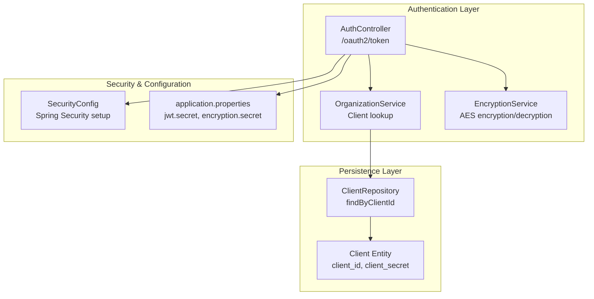
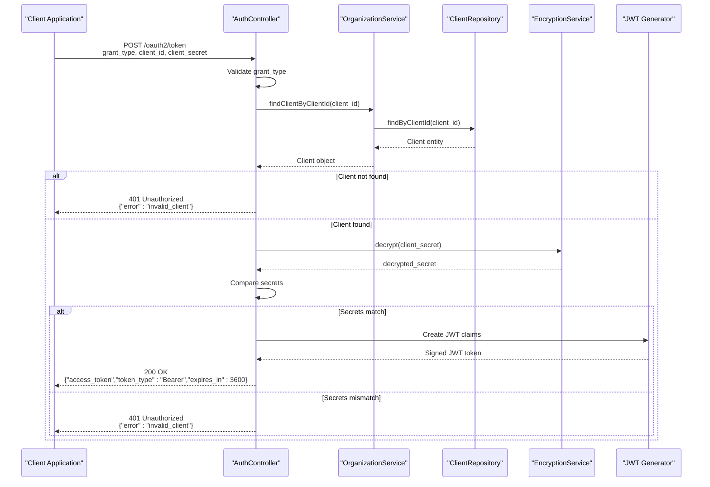
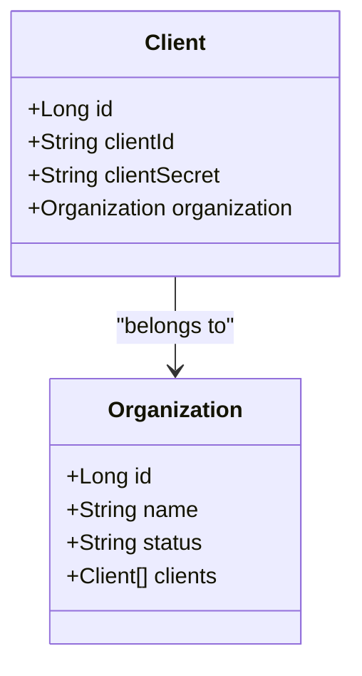
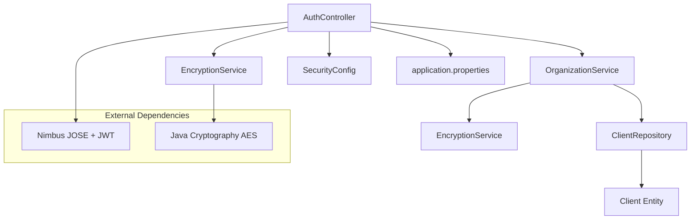

# Authentication Endpoints

<cite>
**Referenced Files in This Document**
- [AuthController.java](file://src/main/java/com/db2api/controller/AuthController.java)
- [OrganizationService.java](file://src/main/java/com/db2api/service/organization/OrganizationService.java)
- [ClientRepository.java](file://src/main/java/com/db2api/repository/organization/ClientRepository.java)
- [Client.java](file://src/main/java/com/db2api/persistent/organization/Client.java)
- [EncryptionService.java](file://src/main/java/com/db2api/service/EncryptionService.java)
- [SecurityConfig.java](file://src/main/java/com/db2api/config/SecurityConfig.java)
- [application.properties](file://src/main/resources/application.properties)
- [schema.sql](file://src/main/resources/schema.sql)
- [README.md](file://README.md)
</cite>

## Table of Contents
1. [Introduction](#introduction)
2. [Project Structure](#project-structure)
3. [Core Components](#core-components)
4. [Architecture Overview](#architecture-overview)
5. [Detailed Component Analysis](#detailed-component-analysis)
6. [Dependency Analysis](#dependency-analysis)
7. [Performance Considerations](#performance-considerations)
8. [Troubleshooting Guide](#troubleshooting-guide)
9. [Conclusion](#conclusion)

## Introduction
This document provides comprehensive API documentation for DB2API's authentication endpoints, focusing on the OAuth2 client_credentials grant type implementation. It covers the /oauth2/token endpoint, request/response formats, error handling, JWT token structure, security considerations, and integration patterns for obtaining access tokens.

## Project Structure
The authentication implementation spans several key components:
- REST controller for OAuth2 token issuance
- Organization service for client management
- Client persistence layer
- Encryption service for secret handling
- Security configuration for the application



**Diagram sources**
- [AuthController.java:25-43](file://src/main/java/com/db2api/controller/AuthController.java#L25-L43)
- [OrganizationService.java:15-27](file://src/main/java/com/db2api/service/organization/OrganizationService.java#L15-L27)
- [ClientRepository.java:9-13](file://src/main/java/com/db2api/repository/organization/ClientRepository.java#L9-L13)
- [Client.java:11-42](file://src/main/java/com/db2api/persistent/organization/Client.java#L11-L42)
- [SecurityConfig.java:15-28](file://src/main/java/com/db2api/config/SecurityConfig.java#L15-L28)
- [application.properties:1-20](file://src/main/resources/application.properties#L1-L20)

**Section sources**
- [AuthController.java:25-43](file://src/main/java/com/db2api/controller/AuthController.java#L25-L43)
- [OrganizationService.java:15-27](file://src/main/java/com/db2api/service/organization/OrganizationService.java#L15-L27)
- [ClientRepository.java:9-13](file://src/main/java/com/db2api/repository/organization/ClientRepository.java#L9-L13)
- [Client.java:11-42](file://src/main/java/com/db2api/persistent/organization/Client.java#L11-L42)
- [SecurityConfig.java:15-28](file://src/main/java/com/db2api/config/SecurityConfig.java#L15-L28)
- [application.properties:1-20](file://src/main/resources/application.properties#L1-L20)

## Core Components
The authentication system consists of four primary components working together to issue JWT access tokens using the client_credentials grant type.

### AuthController
The REST controller handles OAuth2 token requests and validates client credentials against stored secrets.

Key responsibilities:
- Validates grant_type parameter equals "client_credentials"
- Authenticates clients using stored encrypted secrets
- Generates JWT access tokens with standardized claims
- Returns appropriate HTTP status codes for success and error conditions

### OrganizationService
Manages client lifecycle and provides client lookup functionality.

Primary functions:
- Retrieves client records by client_id
- Creates new clients with generated credentials
- Integrates with encryption service for secret management

### ClientRepository
Provides data access for client entities with specialized query methods.

Capabilities:
- Fast lookup by client_id using unique constraint
- Standard CRUD operations for client management

### EncryptionService
Handles symmetric encryption/decryption of client secrets using AES.

Security features:
- AES encryption with SHA-1 derived keys
- Base64 encoding for storage and transmission
- Configuration-driven secret key management

**Section sources**
- [AuthController.java:45-109](file://src/main/java/com/db2api/controller/AuthController.java#L45-L109)
- [OrganizationService.java:79-81](file://src/main/java/com/db2api/service/organization/OrganizationService.java#L79-L81)
- [ClientRepository.java:12](file://src/main/java/com/db2api/repository/organization/ClientRepository.java#L12)
- [EncryptionService.java:35-57](file://src/main/java/com/db2api/service/EncryptionService.java#L35-L57)

## Architecture Overview
The authentication flow follows a layered architecture with clear separation of concerns between presentation, business logic, persistence, and security layers.



**Diagram sources**
- [AuthController.java:54-109](file://src/main/java/com/db2api/controller/AuthController.java#L54-L109)
- [OrganizationService.java:79-81](file://src/main/java/com/db2api/service/organization/OrganizationService.java#L79-L81)
- [ClientRepository.java:12](file://src/main/java/com/db2api/repository/organization/ClientRepository.java#L12)
- [EncryptionService.java:47-52](file://src/main/java/com/db2api/service/EncryptionService.java#L47-L52)

## Detailed Component Analysis

### OAuth2 Token Endpoint (/oauth2/token)
The primary authentication endpoint implements the client_credentials grant type for machine-to-machine authentication.

#### Endpoint Definition
- **Method**: POST
- **Path**: `/oauth2/token`
- **Content-Type**: application/x-www-form-urlencoded
- **Purpose**: Issue JWT access tokens for client applications

#### Request Parameters
| Parameter | Type | Required | Description |
|-----------|------|----------|-------------|
| grant_type | string | Yes | Must equal "client_credentials" |
| client_id | string | Yes | Unique identifier for the client application |
| client_secret | string | Yes | Secret key associated with the client |

#### Successful Response
When authentication succeeds, the endpoint returns a JSON object with the following structure:

```json
{
  "access_token": "eyJhbGciOiJIUzI1NiIsInR5cCI6IkpXVCJ9...",
  "token_type": "Bearer",
  "expires_in": 3600
}
```

Response fields:
- **access_token**: JWT token serialized as a string
- **token_type**: Always "Bearer" for OAuth2 compliance
- **expires_in**: Token lifetime in seconds (default: 3600)

#### Error Responses
The endpoint returns appropriate HTTP status codes with error messages:

| Status Code | Error Type | Description |
|-------------|------------|-------------|
| 400 | unsupported_grant_type | grant_type is not "client_credentials" |
| 401 | invalid_client | Client not found or invalid credentials |
| 500 | server_error | Internal server error during token generation |

#### Implementation Details
The authentication flow validates credentials through multiple layers:
1. Grant type verification
2. Client existence check
3. Secret comparison using decrypted values
4. JWT token generation with HS256 signature

**Section sources**
- [AuthController.java:54-109](file://src/main/java/com/db2api/controller/AuthController.java#L54-L109)

### JWT Token Structure and Claims
The system generates JWT tokens with standardized OAuth2 claims for interoperability with various OAuth2 clients.

#### Token Header
- **Algorithm**: HS256 (HMAC-SHA256)
- **Type**: JWT

#### Token Claims
| Claim | Value | Description |
|-------|-------|-------------|
| sub | client_id | Subject identifier (client application) |
| scope | "api:read api:write" | Access permissions |
| iss | "http://localhost:8080" | Issuer identifier |
| exp | timestamp | Expiration time (1 hour from issuance) |
| iat | timestamp | Issuance time |

#### Token Validation
Clients can validate tokens by:
1. Verifying the HS256 signature using the shared secret
2. Checking the issuer claim matches the expected endpoint
3. Validating the expiration timestamp
4. Confirming the subject corresponds to authorized client

**Section sources**
- [AuthController.java:89-104](file://src/main/java/com/db2api/controller/AuthController.java#L89-L104)

### Client Management and Secret Storage
The system manages client credentials through a secure persistence layer with encrypted storage.

#### Client Entity Structure


**Diagram sources**
- [Client.java:15-42](file://src/main/java/com/db2api/persistent/organization/Client.java#L15-L42)

#### Secret Management
- **Storage**: AES-encrypted secrets in database
- **Generation**: Random UUID-based secrets for new clients
- **Validation**: Decryption and comparison during authentication
- **Configuration**: Environment-specific encryption keys

#### Database Schema
The client table enforces uniqueness and referential integrity:
- Unique constraint on client_id for fast lookups
- Foreign key relationship to organization
- Encrypted secret storage for security

**Section sources**
- [Client.java:27-34](file://src/main/java/com/db2api/persistent/organization/Client.java#L27-L34)
- [schema.sql:7-12](file://src/main/resources/schema.sql#L7-L12)
- [OrganizationService.java:53-60](file://src/main/java/com/db2api/service/organization/OrganizationService.java#L53-L60)

### Security Configuration
The application integrates with Spring Security for comprehensive protection.

#### Security Setup
- **Vaadin Integration**: Custom login view for administrative access
- **Password Encoding**: BCrypt for user passwords
- **Endpoint Protection**: OAuth2 bearer tokens for API access

#### Configuration Properties
- **JWT Secret**: `${app.jwt.secret}` for token signing
- **Encryption Secret**: `${app.encryption.secret}` for client secrets
- **Server Port**: Default 8080 for local development

**Section sources**
- [SecurityConfig.java:36-40](file://src/main/java/com/db2api/config/SecurityConfig.java#L36-L40)
- [SecurityConfig.java:47-50](file://src/main/java/com/db2api/config/SecurityConfig.java#L47-L50)
- [application.properties:31-34](file://src/main/resources/application.properties#L31-L34)

## Dependency Analysis
The authentication system exhibits clean dependency relationships with clear separation between layers.



**Diagram sources**
- [AuthController.java:28-42](file://src/main/java/com/db2api/controller/AuthController.java#L28-L42)
- [OrganizationService.java:18-26](file://src/main/java/com/db2api/service/organization/OrganizationService.java#L18-L26)
- [EncryptionService.java:6-11](file://src/main/java/com/db2api/service/EncryptionService.java#L6-L11)

### Component Coupling
- **AuthController** depends on OrganizationService and EncryptionService
- **OrganizationService** depends on ClientRepository and EncryptionService
- **ClientRepository** depends on JPA for persistence operations
- **EncryptionService** depends on Java Cryptography Extension

### Cohesion and Separation
- Each component has a single responsibility
- Clear boundaries between presentation, business logic, and persistence layers
- Minimal cross-layer dependencies

**Section sources**
- [AuthController.java:28-42](file://src/main/java/com/db2api/controller/AuthController.java#L28-L42)
- [OrganizationService.java:18-26](file://src/main/java/com/db2api/service/organization/OrganizationService.java#L18-L26)
- [ClientRepository.java:3-8](file://src/main/java/com/db2api/repository/organization/ClientRepository.java#L3-L8)

## Performance Considerations
The authentication system is designed for efficiency and scalability.

### Token Generation Performance
- **Memory Usage**: JWT creation uses minimal memory overhead
- **CPU Usage**: AES decryption and HMAC signing are efficient operations
- **Database Queries**: Single client lookup with indexed client_id

### Caching Strategies
- **Client Lookup**: Consider caching frequently accessed client records
- **Secret Validation**: Cache decrypted secrets for short periods
- **Token Validation**: Implement token validation caching for repeated requests

### Scalability Factors
- **Horizontal Scaling**: Stateless JWT tokens enable easy scaling
- **Database Load**: Client_id indexing minimizes query times
- **Network Efficiency**: Compact JWT tokens reduce bandwidth usage

## Troubleshooting Guide

### Common Authentication Failures

#### Invalid Grant Type
**Symptoms**: 400 Bad Request with "unsupported_grant_type"
**Causes**: 
- grant_type parameter missing or incorrect
- Using unsupported grant type
**Solutions**:
- Ensure grant_type equals "client_credentials"
- Verify request format is application/x-www-form-urlencoded

#### Invalid Client Credentials
**Symptoms**: 401 Unauthorized with "invalid_client"
**Causes**:
- Non-existent client_id
- Incorrect client_secret
- Database connectivity issues
**Solutions**:
- Verify client_id exists in database
- Confirm client_secret matches encrypted value
- Check database connection configuration

#### Server Errors
**Symptoms**: 500 Internal Server Error with "server_error"
**Causes**:
- JWT generation failures
- Encryption/decryption errors
- Missing configuration properties
**Solutions**:
- Verify JWT secret configuration
- Check encryption secret validity
- Review server logs for detailed error information

### Debugging Steps
1. **Verify Request Format**: Ensure proper form-encoded parameters
2. **Check Database Connectivity**: Confirm client record exists
3. **Validate Configuration**: Verify required properties are set
4. **Review Logs**: Examine server logs for detailed error messages
5. **Test Token Validation**: Validate JWT signature and claims

### Security Best Practices
- **Secret Rotation**: Regularly rotate client secrets
- **Access Logging**: Monitor authentication attempts
- **Rate Limiting**: Implement rate limiting for token endpoint
- **Network Security**: Use HTTPS in production environments

**Section sources**
- [AuthController.java:59-107](file://src/main/java/com/db2api/controller/AuthController.java#L59-L107)
- [EncryptionService.java:35-57](file://src/main/java/com/db2api/service/EncryptionService.java#L35-L57)

## Conclusion
DB2API's authentication system provides a robust, standards-compliant implementation of OAuth2 client_credentials grant type. The system offers secure token issuance, clear error handling, and extensible architecture suitable for production deployment. By following the documented patterns and security considerations, developers can integrate seamlessly with the authentication endpoints while maintaining security best practices.

The implementation demonstrates clean separation of concerns, efficient database operations, and comprehensive error handling, making it suitable for both development and production environments. The JWT-based approach ensures interoperability with various OAuth2 clients while maintaining security through encrypted credential storage and proper token validation mechanisms.