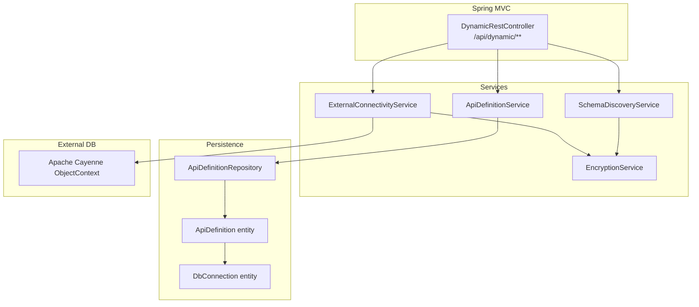
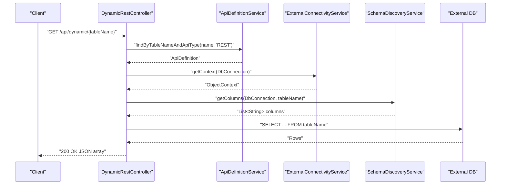
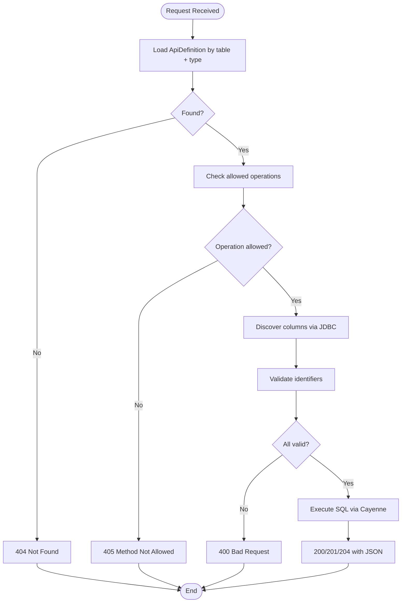
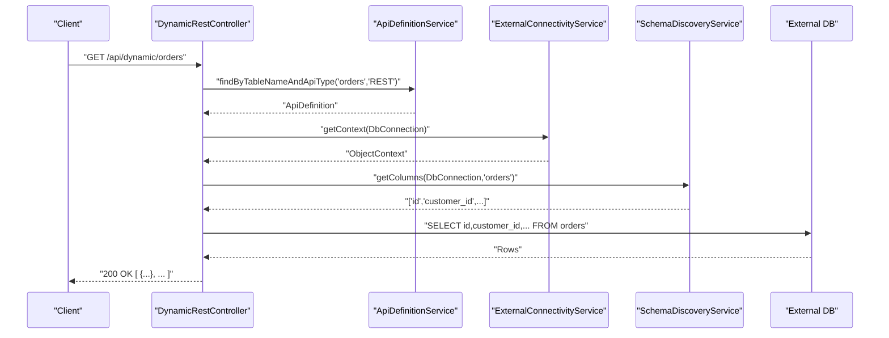
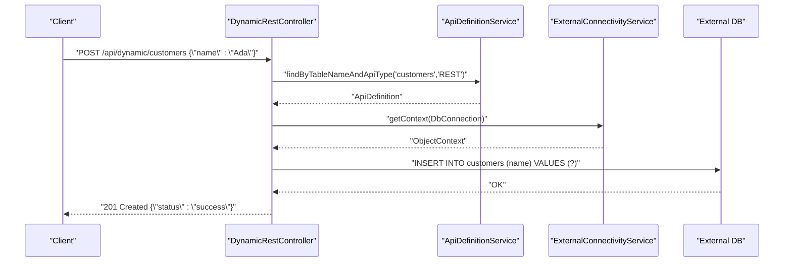
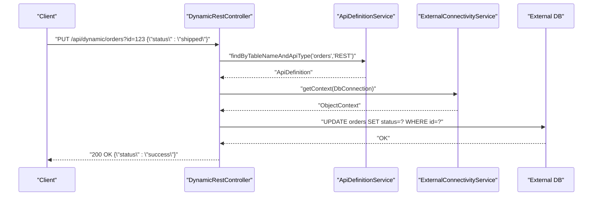
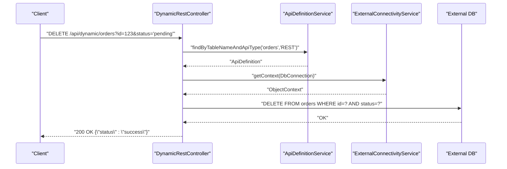
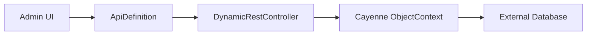
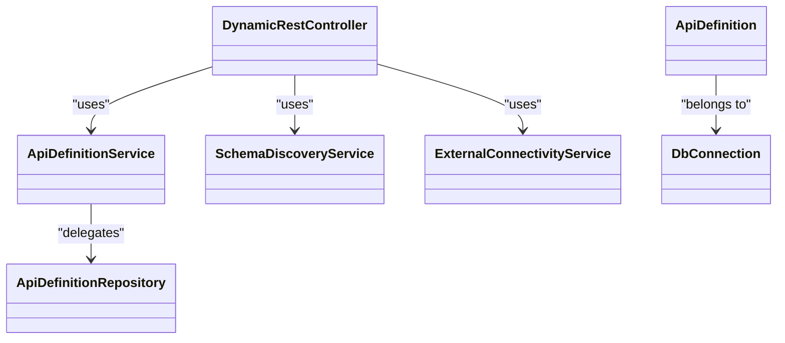
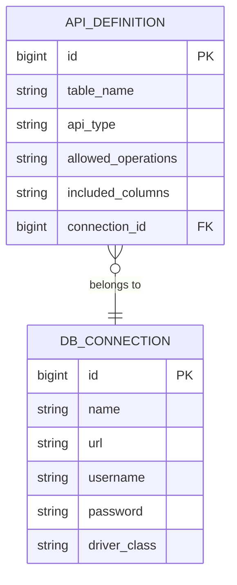

# Dynamic API Endpoints

<cite>
**Referenced Files in This Document**
- [DynamicRestController.java](file://src/main/java/com/db2api/controller/DynamicRestController.java)
- [ApiDefinitionService.java](file://src/main/java/com/db2api/service/api/ApiDefinitionService.java)
- [SchemaDiscoveryService.java](file://src/main/java/com/db2api/service/api/SchemaDiscoveryService.java)
- [ExternalConnectivityService.java](file://src/main/java/com/db2api/service/connection/ExternalConnectivityService.java)
- [ApiDefinition.java](file://src/main/java/com/db2api/persistent/api/ApiDefinition.java)
- [DbConnection.java](file://src/main/java/com/db2api/persistent/connection/DbConnection.java)
- [ApiDefinitionRepository.java](file://src/main/java/com/db2api/repository/api/ApiDefinitionRepository.java)
- [SecurityConfig.java](file://src/main/java/com/db2api/config/SecurityConfig.java)
- [RequestLoggingFilter.java](file://src/main/java/com/db2api/config/RequestLoggingFilter.java)
- [EncryptionService.java](file://src/main/java/com/db2api/service/EncryptionService.java)
- [application.properties](file://src/main/resources/application.properties)
- [README.md](file://README.md)
</cite>

## Table of Contents
1. [Introduction](#introduction)
2. [Project Structure](#project-structure)
3. [Core Components](#core-components)
4. [Architecture Overview](#architecture-overview)
5. [Detailed Component Analysis](#detailed-component-analysis)
6. [Dependency Analysis](#dependency-analysis)
7. [Performance Considerations](#performance-considerations)
8. [Troubleshooting Guide](#troubleshooting-guide)
9. [Conclusion](#conclusion)
10. [Appendices](#appendices)

## Introduction
This document describes DB2API’s dynamic REST endpoints under the base path /api/dynamic. These endpoints dynamically translate HTTP requests into SQL queries against external databases, based on administrator-defined API definitions. The primary pattern is /api/dynamic/{tableName}, supporting GET (read), POST (create), PUT (update), and DELETE operations. The system enforces schema-aware column validation, secure credential handling, and JWT-based authentication for protected endpoints.

## Project Structure
The dynamic REST functionality centers around a REST controller that delegates to services for API definition retrieval, schema discovery, and database connectivity via Apache Cayenne. Security is enforced at the framework level for the dynamic endpoints.

**Diagram sources**
- [DynamicRestController.java:25-52](file://src/main/java/com/db2api/controller/DynamicRestController.java#L25-L52)
- [ApiDefinitionService.java:10-38](file://src/main/java/com/db2api/service/api/ApiDefinitionService.java#L10-L38)
- [SchemaDiscoveryService.java:15-59](file://src/main/java/com/db2api/service/api/SchemaDiscoveryService.java#L15-L59)
- [ExternalConnectivityService.java:15-54](file://src/main/java/com/db2api/service/connection/ExternalConnectivityService.java#L15-L54)
- [ApiDefinitionRepository.java:10-21](file://src/main/java/com/db2api/repository/api/ApiDefinitionRepository.java#L10-L21)
- [ApiDefinition.java:17-66](file://src/main/java/com/db2api/persistent/api/ApiDefinition.java#L17-L66)
- [DbConnection.java:16-84](file://src/main/java/com/db2api/persistent/connection/DbConnection.java#L16-L84)

**Section sources**
- [README.md:65-99](file://README.md#L65-L99)
- [application.properties:1-20](file://src/main/resources/application.properties#L1-L20)

## Core Components
- DynamicRestController: Exposes /api/dynamic/{tableName} with GET, POST, PUT, DELETE. It validates allowed operations, checks identifiers against schema, builds safe SQL, executes via Cayenne, and returns JSON arrays or maps.
- ApiDefinitionService: Loads API definitions by table name and type (e.g., REST).
- SchemaDiscoveryService: Discovers tables/columns from external databases using JDBC metadata and encrypted credentials.
- ExternalConnectivityService: Manages Cayenne ServerRuntime caches per connection and provides ObjectContext instances.
- ApiDefinition entity: Holds table name, API type, allowed operations, included columns, and the associated DbConnection.
- DbConnection entity: Stores JDBC URL, driver class, username, and encrypted password.
- SecurityConfig: Protects /api/dynamic/** and /graphql with JWT resource server authentication.
- RequestLoggingFilter: Logs request method, URI, status, and duration.

**Section sources**
- [DynamicRestController.java:76-113](file://src/main/java/com/db2api/controller/DynamicRestController.java#L76-L113)
- [DynamicRestController.java:191-238](file://src/main/java/com/db2api/controller/DynamicRestController.java#L191-L238)
- [DynamicRestController.java:247-291](file://src/main/java/com/db2api/controller/DynamicRestController.java#L247-L291)
- [ApiDefinitionService.java:19-25](file://src/main/java/com/db2api/service/api/ApiDefinitionService.java#L19-L25)
- [SchemaDiscoveryService.java:24-58](file://src/main/java/com/db2api/service/api/SchemaDiscoveryService.java#L24-L58)
- [ExternalConnectivityService.java:25-38](file://src/main/java/com/db2api/service/connection/ExternalConnectivityService.java#L25-L38)
- [ApiDefinition.java:33-59](file://src/main/java/com/db2api/persistent/api/ApiDefinition.java#L33-L59)
- [DbConnection.java:38-57](file://src/main/java/com/db2api/persistent/connection/DbConnection.java#L38-L57)
- [SecurityConfig.java:58-62](file://src/main/java/com/db2api/config/SecurityConfig.java#L58-L62)
- [RequestLoggingFilter.java:31-48](file://src/main/java/com/db2api/config/RequestLoggingFilter.java#L31-L48)

## Architecture Overview
The dynamic REST endpoints follow a layered design:
- Controller layer validates and orchestrates.
- Service layer retrieves definitions, discovers schema, and manages connectivity.
- Persistence layer stores API definitions and connection configurations.
- External layer executes SQL via Cayenne.

**Diagram sources**
- [DynamicRestController.java:76-113](file://src/main/java/com/db2api/controller/DynamicRestController.java#L76-L113)
- [ApiDefinitionService.java:23-25](file://src/main/java/com/db2api/service/api/ApiDefinitionService.java#L23-L25)
- [ExternalConnectivityService.java:25-27](file://src/main/java/com/db2api/service/connection/ExternalConnectivityService.java#L25-L27)
- [SchemaDiscoveryService.java:42-58](file://src/main/java/com/db2api/service/api/SchemaDiscoveryService.java#L42-L58)

## Detailed Component Analysis

### Endpoint Pattern and Supported Methods
- Base path: /api/dynamic/{tableName}
- Allowed HTTP methods: GET, POST, PUT, DELETE
- Path variable {tableName} is resolved to an admin-configured table name stored in ApiDefinition, preventing direct SQL injection.

Response format:
- GET returns an array of JSON objects representing rows.
- POST/PUT/DELETE return a JSON object with a status field on success; errors return a JSON object with an error field.

Error handling:
- Not found when no matching REST API definition exists.
- Method not allowed when operation is not permitted.
- Bad request for missing conditions or invalid columns.
- Internal server error for database exceptions.

**Section sources**
- [DynamicRestController.java:76-113](file://src/main/java/com/db2api/controller/DynamicRestController.java#L76-L113)
- [DynamicRestController.java:123-182](file://src/main/java/com/db2api/controller/DynamicRestController.java#L123-L182)
- [DynamicRestController.java:191-238](file://src/main/java/com/db2api/controller/DynamicRestController.java#L191-L238)
- [DynamicRestController.java:247-291](file://src/main/java/com/db2api/controller/DynamicRestController.java#L247-L291)

### Parameter Handling and Filtering
- GET supports no query parameters; filtering/sorting must be handled by the underlying database or application logic.
- PUT/POST body: JSON object with column-value pairs for updates/insertions.
- DELETE requires query parameters forming a WHERE clause; each key must be a valid schema column.

Validation:
- Column names are validated against discovered schema using a strict identifier pattern.
- Non-matching identifiers yield a bad request response.

**Section sources**
- [DynamicRestController.java:76-113](file://src/main/java/com/db2api/controller/DynamicRestController.java#L76-L113)
- [DynamicRestController.java:123-182](file://src/main/java/com/db2api/controller/DynamicRestController.java#L123-L182)
- [DynamicRestController.java:247-291](file://src/main/java/com/db2api/controller/DynamicRestController.java#L247-L291)
- [SchemaDiscoveryService.java:42-58](file://src/main/java/com/db2api/service/api/SchemaDiscoveryService.java#L42-L58)

### Response Formatting
- GET returns a JSON array of objects, each object representing a row with column keys and values.
- POST/PUT/DELETE return a JSON object with a status field on success; failures include an error field.

**Section sources**
- [DynamicRestController.java:102-108](file://src/main/java/com/db2api/controller/DynamicRestController.java#L102-L108)
- [DynamicRestController.java:177](file://src/main/java/com/db2api/controller/DynamicRestController.java#L177)
- [DynamicRestController.java:233](file://src/main/java/com/db2api/controller/DynamicRestController.java#L233)
- [DynamicRestController.java:286](file://src/main/java/com/db2api/controller/DynamicRestController.java#L286)

### Error Handling for Database Connectivity Issues
- Exceptions during SELECT/INSERT/UPDATE/DELETE are caught, logged, and responded with internal server error.
- Schema discovery and connectivity rely on decrypted credentials; failures are logged and surfaced to callers.

**Section sources**
- [DynamicRestController.java:109-112](file://src/main/java/com/db2api/controller/DynamicRestController.java#L109-L112)
- [DynamicRestController.java:234-237](file://src/main/java/com/db2api/controller/DynamicRestController.java#L234-L237)
- [DynamicRestController.java:287-290](file://src/main/java/com/db2api/controller/DynamicRestController.java#L287-L290)
- [SchemaDiscoveryService.java:35-38](file://src/main/java/com/db2api/service/api/SchemaDiscoveryService.java#L35-L38)

### Endpoint Discovery Mechanisms and Schema Validation
- ApiDefinitionService loads ApiDefinition entries filtered by table name and API type.
- SchemaDiscoveryService enumerates tables/columns using JDBC DatabaseMetaData.
- ExternalConnectivityService caches Cayenne runtimes per connection ID and provides ObjectContext for queries.

**Diagram sources**
- [ApiDefinitionService.java:23-25](file://src/main/java/com/db2api/service/api/ApiDefinitionService.java#L23-L25)
- [SchemaDiscoveryService.java:42-58](file://src/main/java/com/db2api/service/api/SchemaDiscoveryService.java#L42-L58)
- [DynamicRestController.java:76-113](file://src/main/java/com/db2api/controller/DynamicRestController.java#L76-L113)
- [DynamicRestController.java:123-182](file://src/main/java/com/db2api/controller/DynamicRestController.java#L123-L182)
- [DynamicRestController.java:247-291](file://src/main/java/com/db2api/controller/DynamicRestController.java#L247-L291)

**Section sources**
- [ApiDefinitionService.java:19-25](file://src/main/java/com/db2api/service/api/ApiDefinitionService.java#L19-L25)
- [SchemaDiscoveryService.java:24-58](file://src/main/java/com/db2api/service/api/SchemaDiscoveryService.java#L24-L58)
- [ExternalConnectivityService.java:29-38](file://src/main/java/com/db2api/service/connection/ExternalConnectivityService.java#L29-L38)

### Data Transformation and Column Selection
- Included columns are validated against schema; if none specified, the controller selects all columns.
- The controller converts Cayenne DataRow objects into generic maps for JSON serialization.

**Section sources**
- [DynamicRestController.java:94-108](file://src/main/java/com/db2api/controller/DynamicRestController.java#L94-L108)
- [DynamicRestController.java:301-315](file://src/main/java/com/db2api/controller/DynamicRestController.java#L301-L315)

### Authentication and Authorization
- Dynamic endpoints under /api/dynamic/** are protected as JWT resource server endpoints.
- Requests require a valid JWT issued with the configured secret; otherwise, they are rejected.

**Section sources**
- [SecurityConfig.java:58-62](file://src/main/java/com/db2api/config/SecurityConfig.java#L58-L62)
- [SecurityConfig.java:70-79](file://src/main/java/com/db2api/config/SecurityConfig.java#L70-L79)

### Logging and Monitoring
- RequestLoggingFilter logs method, URI, status, and duration for every request.
- Controller logs database errors with table context.

**Section sources**
- [RequestLoggingFilter.java:31-48](file://src/main/java/com/db2api/config/RequestLoggingFilter.java#L31-L48)
- [DynamicRestController.java:109-111](file://src/main/java/com/db2api/controller/DynamicRestController.java#L109-L111)

### Example Workflows

#### GET /api/dynamic/{tableName}
- Validates existence and permissions.
- Discovers columns and constructs a safe SELECT.
- Executes via Cayenne and returns JSON array.

**Diagram sources**
- [DynamicRestController.java:76-113](file://src/main/java/com/db2api/controller/DynamicRestController.java#L76-L113)
- [ApiDefinitionService.java:23-25](file://src/main/java/com/db2api/service/api/ApiDefinitionService.java#L23-L25)
- [ExternalConnectivityService.java:25-27](file://src/main/java/com/db2api/service/connection/ExternalConnectivityService.java#L25-L27)
- [SchemaDiscoveryService.java:42-58](file://src/main/java/com/db2api/service/api/SchemaDiscoveryService.java#L42-L58)

#### POST /api/dynamic/{tableName}
- Validates allowed operations and columns.
- Builds INSERT statement with provided body and executes.

**Diagram sources**
- [DynamicRestController.java:191-238](file://src/main/java/com/db2api/controller/DynamicRestController.java#L191-L238)
- [ApiDefinitionService.java:23-25](file://src/main/java/com/db2api/service/api/ApiDefinitionService.java#L23-L25)
- [ExternalConnectivityService.java:25-27](file://src/main/java/com/db2api/service/connection/ExternalConnectivityService.java#L25-L27)

#### PUT /api/dynamic/{tableName}?id=123
- Validates allowed operations and columns.
- Builds UPDATE with body values and WHERE conditions.

**Diagram sources**
- [DynamicRestController.java:123-182](file://src/main/java/com/db2api/controller/DynamicRestController.java#L123-L182)
- [ApiDefinitionService.java:23-25](file://src/main/java/com/db2api/service/api/ApiDefinitionService.java#L23-L25)
- [ExternalConnectivityService.java:25-27](file://src/main/java/com/db2api/service/connection/ExternalConnectivityService.java#L25-L27)

#### DELETE /api/dynamic/{tableName}?id=123&status=pending
- Validates allowed operations and columns.
- Builds DELETE with WHERE conditions.

**Diagram sources**
- [DynamicRestController.java:247-291](file://src/main/java/com/db2api/controller/DynamicRestController.java#L247-L291)
- [ApiDefinitionService.java:23-25](file://src/main/java/com/db2api/service/api/ApiDefinitionService.java#L23-L25)
- [ExternalConnectivityService.java:25-27](file://src/main/java/com/db2api/service/connection/ExternalConnectivityService.java#L25-L27)

### Conceptual Overview
- The system dynamically maps HTTP verbs to SQL operations based on admin-defined API definitions.
- Security is enforced at the framework level for protected endpoints.
- Schema discovery ensures only known columns are used, mitigating injection risks.

[No sources needed since this diagram shows conceptual workflow, not actual code structure]

## Dependency Analysis

**Diagram sources**
- [DynamicRestController.java:34-51](file://src/main/java/com/db2api/controller/DynamicRestController.java#L34-L51)
- [ApiDefinitionService.java:13-17](file://src/main/java/com/db2api/service/api/ApiDefinitionService.java#L13-L17)
- [SchemaDiscoveryService.java:18-22](file://src/main/java/com/db2api/service/api/SchemaDiscoveryService.java#L18-L22)
- [ExternalConnectivityService.java:19-23](file://src/main/java/com/db2api/service/connection/ExternalConnectivityService.java#L19-L23)
- [ApiDefinition.java:57-59](file://src/main/java/com/db2api/persistent/api/ApiDefinition.java#L57-L59)
- [DbConnection.java:62-63](file://src/main/java/com/db2api/persistent/connection/DbConnection.java#L62-L63)
- [ApiDefinitionRepository.java:10-21](file://src/main/java/com/db2api/repository/api/ApiDefinitionRepository.java#L10-L21)

**Section sources**
- [ApiDefinitionRepository.java:10-21](file://src/main/java/com/db2api/repository/api/ApiDefinitionRepository.java#L10-L21)
- [ApiDefinition.java:57-59](file://src/main/java/com/db2api/persistent/api/ApiDefinition.java#L57-L59)

## Performance Considerations
- Pagination: Not implemented in the controller; consider adding LIMIT/OFFSET or cursor-based pagination at the caller level.
- Sorting/Filtering: Not supported in the controller; implement at the application or database level.
- Caching: ExternalConnectivityService caches Cayenne runtimes per connection ID; consider adding query/result caching for repeated reads.
- Large datasets: Prefer selective column inclusion via ApiDefinition.includedColumns to reduce payload sizes.
- Indexes: Ensure appropriate indexes on filtered columns in external databases.

[No sources needed since this section provides general guidance]

## Troubleshooting Guide
Common issues and resolutions:
- 404 Not Found: No REST API definition matches the path variable; verify ApiDefinition entries.
- 405 Method Not Allowed: Operation not enabled for the API definition; update allowedOperations.
- 400 Bad Request: Invalid column names or missing conditions; confirm schema discovery and column names.
- 500 Internal Server Error: Database connectivity or query failure; check logs and external database availability.

Operational tips:
- Enable logging for DynamicRestController and RequestLoggingFilter to capture request durations and errors.
- Verify JWT configuration and secrets for protected endpoints.

**Section sources**
- [DynamicRestController.java:79-85](file://src/main/java/com/db2api/controller/DynamicRestController.java#L79-L85)
- [DynamicRestController.java:128-130](file://src/main/java/com/db2api/controller/DynamicRestController.java#L128-L130)
- [DynamicRestController.java:135-137](file://src/main/java/com/db2api/controller/DynamicRestController.java#L135-L137)
- [DynamicRestController.java:150-153](file://src/main/java/com/db2api/controller/DynamicRestController.java#L150-L153)
- [DynamicRestController.java:250-252](file://src/main/java/com/db2api/controller/DynamicRestController.java#L250-L252)
- [DynamicRestController.java:257-259](file://src/main/java/com/db2api/controller/DynamicRestController.java#L257-L259)
- [DynamicRestController.java:272-275](file://src/main/java/com/db2api/controller/DynamicRestController.java#L272-L275)
- [RequestLoggingFilter.java:31-48](file://src/main/java/com/db2api/config/RequestLoggingFilter.java#L31-L48)

## Conclusion
DB2API’s dynamic REST endpoints provide a secure, schema-aware bridge from HTTP to external databases. By leveraging admin-defined API definitions, strict column validation, and JWT-protected endpoints, the system enables rapid integration with minimal boilerplate. For production workloads, consider adding pagination, caching, and advanced filtering/sorting at the application layer.

[No sources needed since this section summarizes without analyzing specific files]

## Appendices

### API Definition Model

**Diagram sources**
- [ApiDefinition.java:27-59](file://src/main/java/com/db2api/persistent/api/ApiDefinition.java#L27-L59)
- [DbConnection.java:27-57](file://src/main/java/com/db2api/persistent/connection/DbConnection.java#L27-L57)

### Configuration References
- Server port and system database properties are defined in application.properties.
- Dynamic endpoints are protected by Spring Security configuration.

**Section sources**
- [application.properties:3-16](file://src/main/resources/application.properties#L3-L16)
- [SecurityConfig.java:58-62](file://src/main/java/com/db2api/config/SecurityConfig.java#L58-L62)