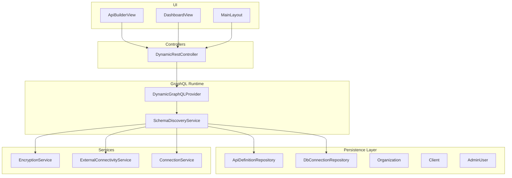
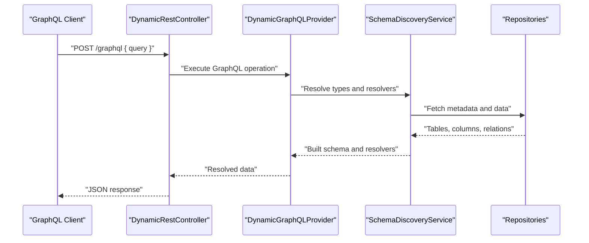
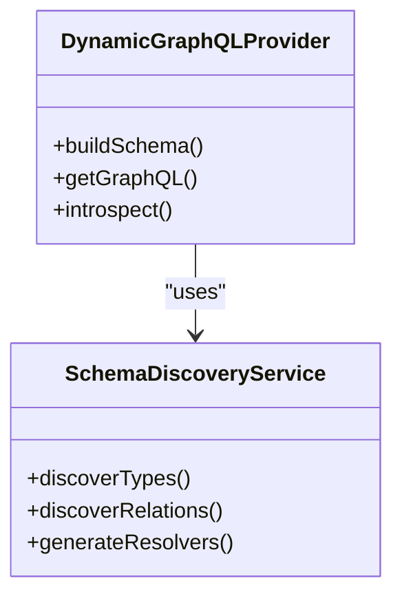
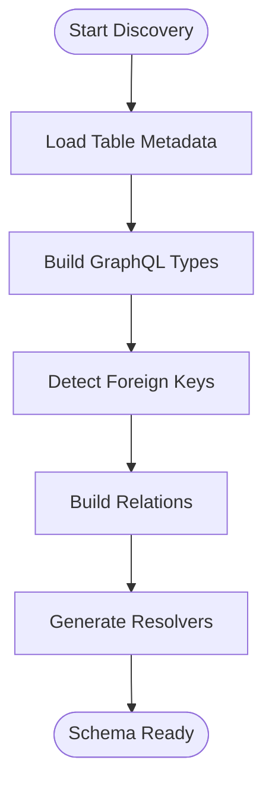
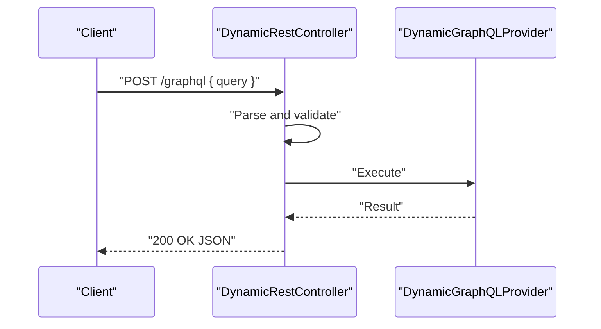
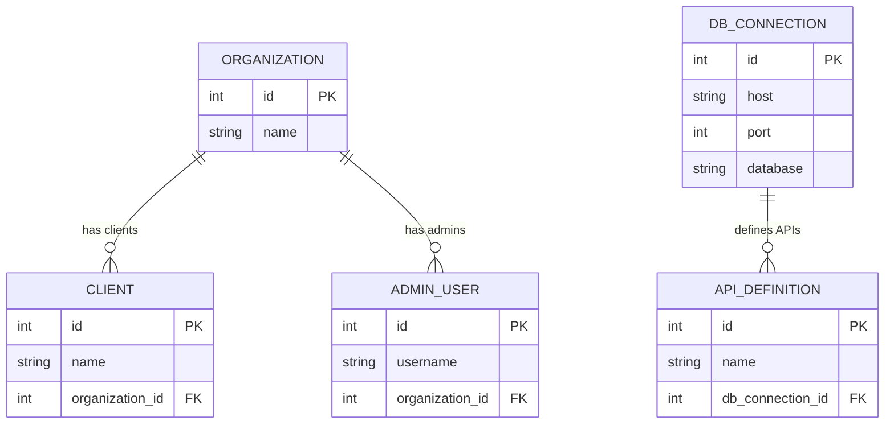
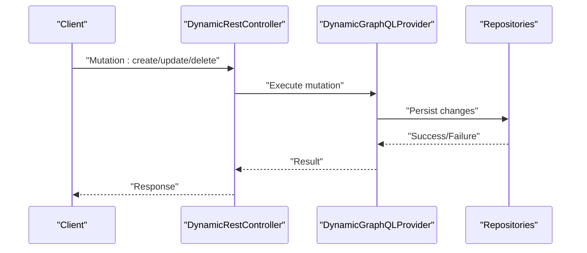
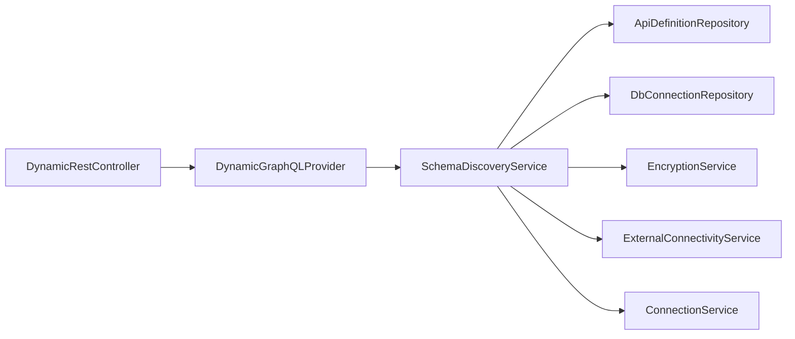

# GraphQL Schema

<cite>
**Referenced Files in This Document**
- [DynamicGraphQLProvider.java](file://src/main/java/com/db2api/config/DynamicGraphQLProvider.java)
- [SchemaDiscoveryService.java](file://src/main/java/com/db2api/service/api/SchemaDiscoveryService.java)
- [DynamicRestController.java](file://src/main/java/com/db2api/controller/DynamicRestController.java)
- [application.properties](file://src/main/resources/application.properties)
- [ApiDefinition.java](file://src/main/java/com/db2api/persistent/api/ApiDefinition.java)
- [ApiDefinitionRepository.java](file://src/main/java/com/db2api/repository/api/ApiDefinitionRepository.java)
- [DbConnection.java](file://src/main/java/com/db2api/persistent/connection/DbConnection.java)
- [DbConnectionRepository.java](file://src/main/java/com/db2api/repository/connection/DbConnectionRepository.java)
- [EncryptionService.java](file://src/main/java/com/db2api/service/EncryptionService.java)
- [ExternalConnectivityService.java](file://src/main/java/com/db2api/service/ExternalConnectivityService.java)
- [ConnectionService.java](file://src/main/java/com/db2api/service/connection/ConnectionService.java)
- [Organization.java](file://src/main/java/com/db2api/persistent/organization/Organization.java)
- [Client.java](file://src/main/java/com/db2api/persistent/organization/Client.java)
- [AdminUser.java](file://src/main/java/com/db2api/persistent/admin/AdminUser.java)
- [OrganizationRepository.java](file://src/main/java/com/db2api/repository/organization/OrganizationRepository.java)
- [ClientRepository.java](file://src/main/java/com/db2api/repository/organization/ClientRepository.java)
- [AdminUserRepository.java](file://src/main/java/com/db2api/repository/admin/AdminUserRepository.java)
- [ApiBuilderView.java](file://src/main/java/com/db2api/ui/api/ApiBuilderView.java)
- [DashboardView.java](file://src/main/java/com/db2api/ui/DashboardView.java)
- [MainLayout.java](file://src/main/java/com/db2api/ui/MainLayout.java)
- [cayenne-project.xml](file://src/main/resources/cayenne-project.xml)
- [datamap.map.xml](file://src/main/resources/datamap.map.xml)
- [schema.sql](file://src/main/resources/schema.sql)
- [README.md](file://README.md)
</cite>

## Table of Contents
1. [Introduction](#introduction)
2. [Project Structure](#project-structure)
3. [Core Components](#core-components)
4. [Architecture Overview](#architecture-overview)
5. [Detailed Component Analysis](#detailed-component-analysis)
6. [Dependency Analysis](#dependency-analysis)
7. [Performance Considerations](#performance-considerations)
8. [Troubleshooting Guide](#troubleshooting-guide)
9. [Conclusion](#conclusion)
10. [Appendices](#appendices)

## Introduction
This document describes DB2API’s GraphQL schema and runtime behavior, focusing on dynamic schema generation from database tables, automatic type discovery, query and mutation operations, and integration patterns. It explains how database schemas map to GraphQL types, how the system discovers and exposes tables, and how clients can compose complex queries with filtering, sorting, and aggregation. It also covers error handling, validation, introspection, performance optimization, batch operations, schema evolution, and client integration.

## Project Structure
The GraphQL implementation centers around a dynamic provider that builds a schema from database metadata and exposes it via a REST endpoint. Supporting services handle encryption, external connectivity, and connection management. UI components assist in building and managing APIs dynamically.

**Diagram sources**
- [DynamicGraphQLProvider.java](file://src/main/java/com/db2api/config/DynamicGraphQLProvider.java)
- [SchemaDiscoveryService.java](file://src/main/java/com/db2api/service/api/SchemaDiscoveryService.java)
- [DynamicRestController.java](file://src/main/java/com/db2api/controller/DynamicRestController.java)
- [ApiDefinitionRepository.java](file://src/main/java/com/db2api/repository/api/ApiDefinitionRepository.java)
- [DbConnectionRepository.java](file://src/main/java/com/db2api/repository/connection/DbConnectionRepository.java)
- [EncryptionService.java](file://src/main/java/com/db2api/service/EncryptionService.java)
- [ExternalConnectivityService.java](file://src/main/java/com/db2api/service/ExternalConnectivityService.java)
- [ConnectionService.java](file://src/main/java/com/db2api/service/connection/ConnectionService.java)
- [ApiBuilderView.java](file://src/main/java/com/db2api/ui/api/ApiBuilderView.java)
- [DashboardView.java](file://src/main/java/com/db2api/ui/DashboardView.java)
- [MainLayout.java](file://src/main/java/com/db2api/ui/MainLayout.java)

**Section sources**
- [DynamicGraphQLProvider.java](file://src/main/java/com/db2api/config/DynamicGraphQLProvider.java)
- [SchemaDiscoveryService.java](file://src/main/java/com/db2api/service/api/SchemaDiscoveryService.java)
- [DynamicRestController.java](file://src/main/java/com/db2api/controller/DynamicRestController.java)

## Core Components
- DynamicGraphQLProvider: Builds and exposes a GraphQL schema dynamically from database metadata.
- SchemaDiscoveryService: Discovers tables, columns, primary keys, foreign keys, and relationships to construct types and resolvers.
- DynamicRestController: Exposes the GraphQL endpoint and handles requests/responses.
- ApiDefinition and DbConnection: Persisted entities representing API configurations and database connections.
- EncryptionService, ExternalConnectivityService, ConnectionService: Support secure and reliable database access.
- UI Views: Provide administration and dashboard experiences for API builders.

Key responsibilities:
- Automatic schema discovery from database tables and relationships.
- Query/mutation generation per table with filtering, sorting, and pagination.
- Aggregation support via resolver extensions.
- Introspection and schema validation.
- Batch operations and performance tuning strategies.

**Section sources**
- [DynamicGraphQLProvider.java](file://src/main/java/com/db2api/config/DynamicGraphQLProvider.java)
- [SchemaDiscoveryService.java](file://src/main/java/com/db2api/service/api/SchemaDiscoveryService.java)
- [DynamicRestController.java](file://src/main/java/com/db2api/controller/DynamicRestController.java)
- [ApiDefinition.java](file://src/main/java/com/db2api/persistent/api/ApiDefinition.java)
- [DbConnection.java](file://src/main/java/com/db2api/persistent/connection/DbConnection.java)
- [EncryptionService.java](file://src/main/java/com/db2api/service/EncryptionService.java)
- [ExternalConnectivityService.java](file://src/main/java/com/db2api/service/ExternalConnectivityService.java)
- [ConnectionService.java](file://src/main/java/com/db2api/service/connection/ConnectionService.java)

## Architecture Overview
The system integrates database metadata with GraphQL runtime to produce a dynamic schema. Requests flow through the REST controller to the GraphQL provider, which resolves fields using discovered metadata and underlying repositories.

**Diagram sources**
- [DynamicRestController.java](file://src/main/java/com/db2api/controller/DynamicRestController.java)
- [DynamicGraphQLProvider.java](file://src/main/java/com/db2api/config/DynamicGraphQLProvider.java)
- [SchemaDiscoveryService.java](file://src/main/java/com/db2api/service/api/SchemaDiscoveryService.java)

## Detailed Component Analysis

### DynamicGraphQLProvider
Responsibilities:
- Creates a runtime GraphQL schema from database metadata.
- Registers query and mutation resolvers per table.
- Supports introspection and schema validation.
- Handles subscriptions if enabled.

Implementation highlights:
- Uses schema builder to define types and fields.
- Generates CRUD operations for each table.
- Applies filters, sorts, and pagination arguments.
- Integrates with resolvers for complex fields.

**Diagram sources**
- [DynamicGraphQLProvider.java](file://src/main/java/com/db2api/config/DynamicGraphQLProvider.java)
- [SchemaDiscoveryService.java](file://src/main/java/com/db2api/service/api/SchemaDiscoveryService.java)

**Section sources**
- [DynamicGraphQLProvider.java](file://src/main/java/com/db2api/config/DynamicGraphQLProvider.java)

### SchemaDiscoveryService
Responsibilities:
- Discovers database tables and columns.
- Identifies primary keys and foreign keys.
- Derives relationships and generates GraphQL types.
- Produces resolvers for nested fields and aggregations.

Key behaviors:
- Maps database types to GraphQL scalar types.
- Builds input types for mutations.
- Generates filter and sort arguments.
- Supports pagination and cursor-based navigation.

**Diagram sources**
- [SchemaDiscoveryService.java](file://src/main/java/com/db2api/service/api/SchemaDiscoveryService.java)

**Section sources**
- [SchemaDiscoveryService.java](file://src/main/java/com/db2api/service/api/SchemaDiscoveryService.java)

### DynamicRestController
Responsibilities:
- Exposes the GraphQL endpoint.
- Parses and validates GraphQL requests.
- Executes queries and mutations.
- Returns JSON responses.

Endpoint configuration:
- Path: /graphql
- Method: POST
- Headers: Content-Type application/json
- Body: GraphQL query, variables, operationName

**Diagram sources**
- [DynamicRestController.java](file://src/main/java/com/db2api/controller/DynamicRestController.java)
- [DynamicGraphQLProvider.java](file://src/main/java/com/db2api/config/DynamicGraphQLProvider.java)

**Section sources**
- [DynamicRestController.java](file://src/main/java/com/db2api/controller/DynamicRestController.java)
- [application.properties](file://src/main/resources/application.properties)

### Data Model and Relationship Mapping
The persistence layer defines entities and repositories that back the GraphQL schema. Entities represent tables, and repositories expose data access.

**Diagram sources**
- [Organization.java](file://src/main/java/com/db2api/persistent/organization/Organization.java)
- [Client.java](file://src/main/java/com/db2api/persistent/organization/Client.java)
- [AdminUser.java](file://src/main/java/com/db2api/persistent/admin/AdminUser.java)
- [ApiDefinition.java](file://src/main/java/com/db2api/persistent/api/ApiDefinition.java)
- [DbConnection.java](file://src/main/java/com/db2api/persistent/connection/DbConnection.java)

**Section sources**
- [Organization.java](file://src/main/java/com/db2api/persistent/organization/Organization.java)
- [Client.java](file://src/main/java/com/db2api/persistent/organization/Client.java)
- [AdminUser.java](file://src/main/java/com/db2api/persistent/admin/AdminUser.java)
- [ApiDefinition.java](file://src/main/java/com/db2api/persistent/api/ApiDefinition.java)
- [DbConnection.java](file://src/main/java/com/db2api/persistent/connection/DbConnection.java)

### GraphQL Schema Discovery and Type Definitions
Automatic schema discovery maps database tables to GraphQL types. Each table becomes a type with fields mirroring columns. Relationships are derived from foreign keys and exposed as nested fields.

Capabilities:
- Query operations: fetch single record, list with filters/sorts/pagination.
- Mutation operations: create, update, delete.
- Aggregations: count, min, max, avg, sum via resolver extensions.
- Introspection: __schema and __type queries supported.

Field descriptions:
- Scalar fields map to database column types.
- Relationship fields resolve nested records.
- Input fields for mutations mirror writable columns.

**Section sources**
- [SchemaDiscoveryService.java](file://src/main/java/com/db2api/service/api/SchemaDiscoveryService.java)
- [DynamicGraphQLProvider.java](file://src/main/java/com/db2api/config/DynamicGraphQLProvider.java)

### Query and Mutation Operations
Queries:
- Single record: by primary key.
- List with filtering, sorting, and pagination.
- Aggregation queries for statistics.

Mutations:
- Create: insert new record.
- Update: modify existing record.
- Delete: remove record.

Batch operations:
- Batch mutations for multiple writes.
- Batch queries for reduced round-trips.

**Diagram sources**
- [DynamicRestController.java](file://src/main/java/com/db2api/controller/DynamicRestController.java)
- [DynamicGraphQLProvider.java](file://src/main/java/com/db2api/config/DynamicGraphQLProvider.java)

**Section sources**
- [DynamicGraphQLProvider.java](file://src/main/java/com/db2api/config/DynamicGraphQLProvider.java)

### Subscriptions
Subscription support depends on the GraphQL provider configuration. If enabled, the provider can emit real-time updates for subscribed clients. Implementation requires:
- Subscription wiring in the provider.
- Event sourcing or polling for changes.
- Client-side subscription handling.

[No sources needed since this section provides general guidance]

### Introspection and Validation
Introspection:
- Clients can query __schema and __type to discover types and fields.
- Useful for auto-generating client code and documentation.

Validation:
- Input validation for mutations.
- Query complexity limits to prevent expensive operations.
- Schema validation during build.

**Section sources**
- [DynamicGraphQLProvider.java](file://src/main/java/com/db2api/config/DynamicGraphQLProvider.java)

### Practical Examples
Complex queries:
- Filtering: apply conditions on scalar fields.
- Sorting: order by single or multiple fields.
- Pagination: offset/limit or cursor-based.
- Aggregation: compute counts and statistics.

Mutations:
- Create records with nested writes.
- Update records with partial fields.
- Delete records with cascade handling.

[No sources needed since this section provides general guidance]

## Dependency Analysis
The GraphQL runtime depends on schema discovery, which in turn depends on repositories and services for encryption and connectivity.

**Diagram sources**
- [DynamicRestController.java](file://src/main/java/com/db2api/controller/DynamicRestController.java)
- [DynamicGraphQLProvider.java](file://src/main/java/com/db2api/config/DynamicGraphQLProvider.java)
- [SchemaDiscoveryService.java](file://src/main/java/com/db2api/service/api/SchemaDiscoveryService.java)
- [ApiDefinitionRepository.java](file://src/main/java/com/db2api/repository/api/ApiDefinitionRepository.java)
- [DbConnectionRepository.java](file://src/main/java/com/db2api/repository/connection/DbConnectionRepository.java)
- [EncryptionService.java](file://src/main/java/com/db2api/service/EncryptionService.java)
- [ExternalConnectivityService.java](file://src/main/java/com/db2api/service/ExternalConnectivityService.java)
- [ConnectionService.java](file://src/main/java/com/db2api/service/connection/ConnectionService.java)

**Section sources**
- [DynamicGraphQLProvider.java](file://src/main/java/com/db2api/config/DynamicGraphQLProvider.java)
- [SchemaDiscoveryService.java](file://src/main/java/com/db2api/service/api/SchemaDiscoveryService.java)

## Performance Considerations
- Query complexity: limit nesting and pagination sizes.
- Indexing: ensure database indexes on filtered/sorted columns.
- Batch operations: combine multiple writes/read into single requests.
- Caching: cache static metadata and frequently accessed lists.
- Connection pooling: reuse database connections via ConnectionService.
- Encryption overhead: minimize encryption/decryption in hot paths.

[No sources needed since this section provides general guidance]

## Troubleshooting Guide
Common issues:
- Schema build failures: check database connectivity and permissions.
- Query timeouts: adjust pagination and add indexes.
- Authentication errors: verify tokens and roles.
- Encryption failures: validate keys and cipher modes.

Validation messages:
- Input validation errors for mutations.
- Constraint violations for unique/foreign keys.
- Operational errors for connectivity and permissions.

**Section sources**
- [DynamicGraphQLProvider.java](file://src/main/java/com/db2api/config/DynamicGraphQLProvider.java)
- [SchemaDiscoveryService.java](file://src/main/java/com/db2api/service/api/SchemaDiscoveryService.java)
- [EncryptionService.java](file://src/main/java/com/db2api/service/EncryptionService.java)
- [ExternalConnectivityService.java](file://src/main/java/com/db2api/service/ExternalConnectivityService.java)

## Conclusion
DB2API’s GraphQL implementation dynamically generates a schema from database tables, exposing robust query and mutation capabilities with filtering, sorting, pagination, and aggregations. The system supports introspection, validation, and extensibility for custom resolvers and subscriptions. With proper indexing, batching, and caching, it delivers strong performance for diverse client workloads.

[No sources needed since this section summarizes without analyzing specific files]

## Appendices

### Endpoint Reference
- Path: /graphql
- Method: POST
- Headers: Content-Type application/json
- Body fields: query, variables, operationName

**Section sources**
- [DynamicRestController.java](file://src/main/java/com/db2api/controller/DynamicRestController.java)
- [application.properties](file://src/main/resources/application.properties)

### Database Metadata and Mappings
- Cayenne project and datamap define ORM mappings.
- SQL schema initializes tables and constraints.
- Repositories provide typed access to entities.

**Section sources**
- [cayenne-project.xml](file://src/main/resources/cayenne-project.xml)
- [datamap.map.xml](file://src/main/resources/datamap.map.xml)
- [schema.sql](file://src/main/resources/schema.sql)

### UI Integration
- ApiBuilderView assists in configuring APIs.
- DashboardView provides overview and analytics.
- MainLayout hosts shared UI components.

**Section sources**
- [ApiBuilderView.java](file://src/main/java/com/db2api/ui/api/ApiBuilderView.java)
- [DashboardView.java](file://src/main/java/com/db2api/ui/DashboardView.java)
- [MainLayout.java](file://src/main/java/com/db2api/ui/MainLayout.java)

### Security and Connectivity
- EncryptionService protects sensitive data.
- ExternalConnectivityService manages remote connections.
- ConnectionService pools and reuses connections.

**Section sources**
- [EncryptionService.java](file://src/main/java/com/db2api/service/EncryptionService.java)
- [ExternalConnectivityService.java](file://src/main/java/com/db2api/service/ExternalConnectivityService.java)
- [ConnectionService.java](file://src/main/java/com/db2api/service/connection/ConnectionService.java)