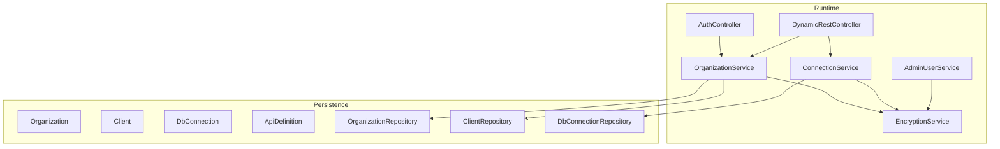
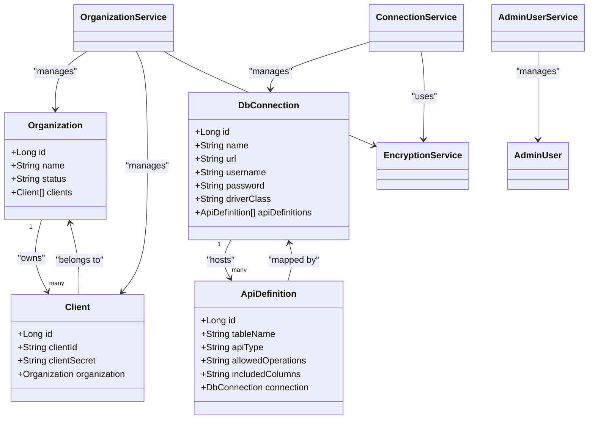
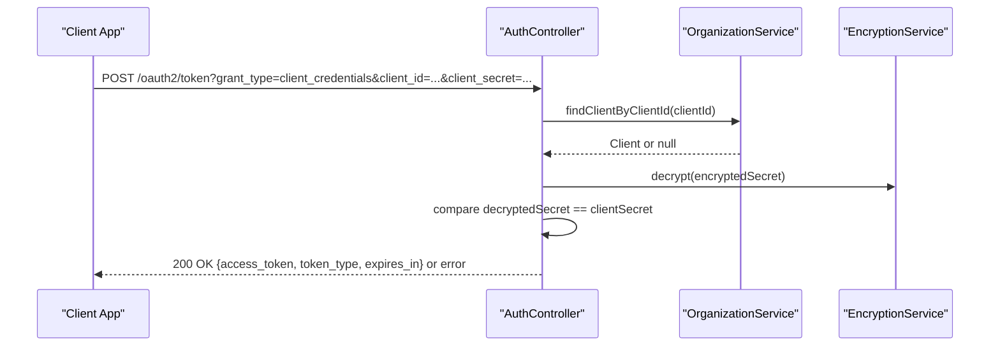
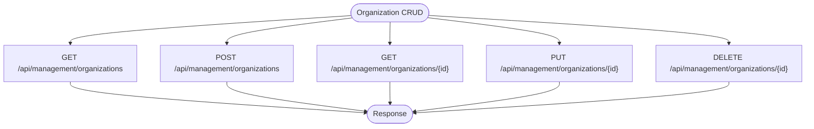
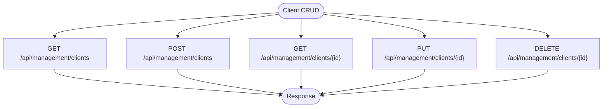
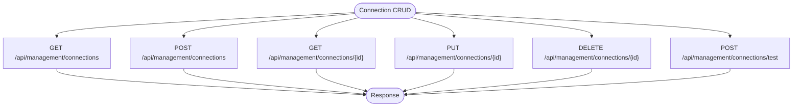
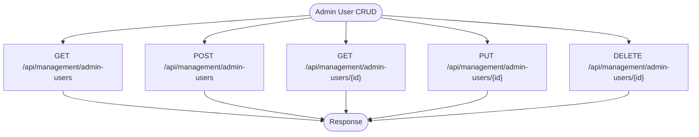
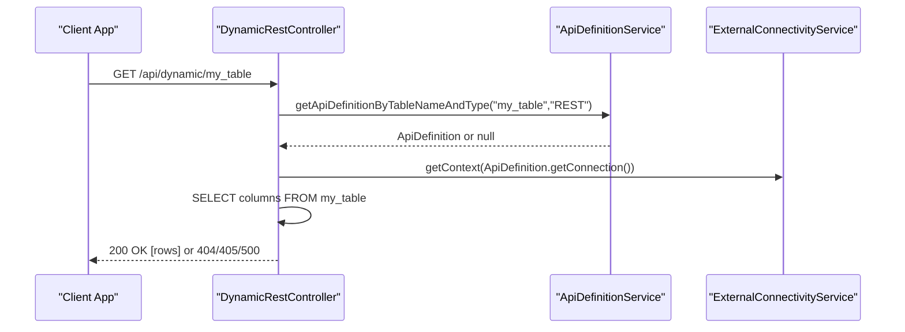
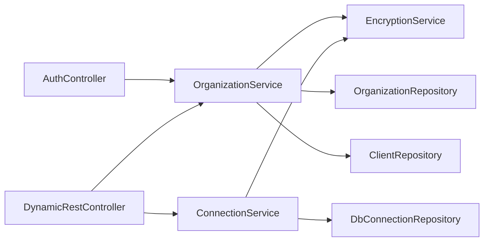
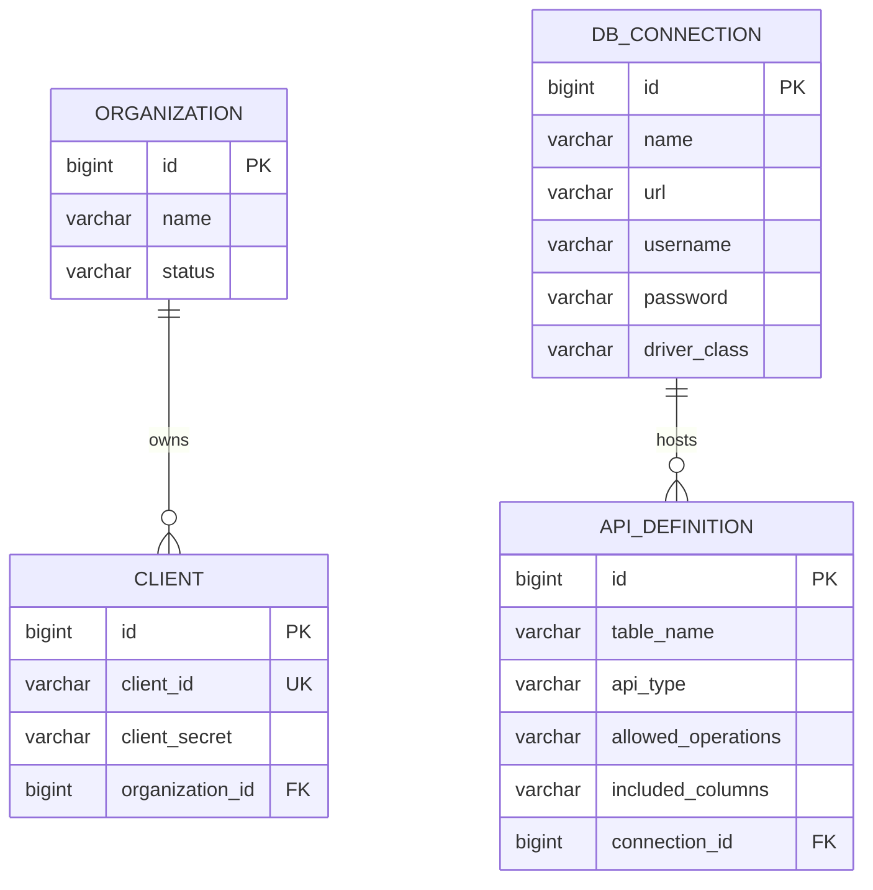

# Management Endpoints

<cite>
**Referenced Files in This Document**
- [application.properties](file://src/main/resources/application.properties)
- [AuthController.java](file://src/main/java/com/db2api/controller/AuthController.java)
- [DynamicRestController.java](file://src/main/java/com/db2api/controller/DynamicRestController.java)
- [OrganizationService.java](file://src/main/java/com/db2api/service/organization/OrganizationService.java)
- [ConnectionService.java](file://src/main/java/com/db2api/service/connection/ConnectionService.java)
- [AdminUserService.java](file://src/main/java/com/db2api/service/admin/AdminUserService.java)
- [EncryptionService.java](file://src/main/java/com/db2api/service/EncryptionService.java)
- [Organization.java](file://src/main/java/com/db2api/persistent/organization/Organization.java)
- [Client.java](file://src/main/java/com/db2api/persistent/organization/Client.java)
- [DbConnection.java](file://src/main/java/com/db2api/persistent/connection/DbConnection.java)
- [ApiDefinition.java](file://src/main/java/com/db2api/persistent/api/ApiDefinition.java)
- [OrganizationRepository.java](file://src/main/java/com/db2api/repository/organization/OrganizationRepository.java)
- [ClientRepository.java](file://src/main/java/com/db2api/repository/organization/ClientRepository.java)
- [DbConnectionRepository.java](file://src/main/java/com/db2api/repository/connection/DbConnectionRepository.java)
</cite>

## Table of Contents
1. [Introduction](#introduction)
2. [Project Structure](#project-structure)
3. [Core Components](#core-components)
4. [Architecture Overview](#architecture-overview)
5. [Detailed Component Analysis](#detailed-component-analysis)
6. [Dependency Analysis](#dependency-analysis)
7. [Performance Considerations](#performance-considerations)
8. [Troubleshooting Guide](#troubleshooting-guide)
9. [Conclusion](#conclusion)
10. [Appendices](#appendices)

## Introduction
This document describes the management endpoints for DB2API’s administrative resources: organizations, clients, database connections, and administrative users. It covers REST endpoints for CRUD operations, authentication using Bearer tokens, request/response schemas, status codes, and operational guidance for creating organizations with client credentials, configuring encrypted database connections, managing administrative users, and handling validation errors. It also outlines bulk operations, filtering, pagination, and resource relationships among organizations, clients, and connections.

## Project Structure
The management endpoints are implemented as Spring MVC controllers backed by services and repositories. The system exposes:
- OAuth2 token endpoint for client credential grants
- Dynamic REST endpoints for external database access
- Management endpoints for organizations, clients, connections, and admin users

**Diagram sources**
- [AuthController.java:1-111](file://src/main/java/com/db2api/controller/AuthController.java#L1-L111)
- [DynamicRestController.java:1-168](file://src/main/java/com/db2api/controller/DynamicRestController.java#L1-L168)
- [OrganizationService.java:1-83](file://src/main/java/com/db2api/service/organization/OrganizationService.java#L1-L83)
- [ConnectionService.java:1-58](file://src/main/java/com/db2api/service/connection/ConnectionService.java#L1-L58)
- [AdminUserService.java:1-41](file://src/main/java/com/db2api/service/admin/AdminUserService.java#L1-L41)
- [EncryptionService.java:1-59](file://src/main/java/com/db2api/service/EncryptionService.java#L1-L59)
- [Organization.java:1-65](file://src/main/java/com/db2api/persistent/organization/Organization.java#L1-L65)
- [Client.java:1-43](file://src/main/java/com/db2api/persistent/organization/Client.java#L1-L43)
- [DbConnection.java:1-85](file://src/main/java/com/db2api/persistent/connection/DbConnection.java#L1-L85)
- [ApiDefinition.java:1-57](file://src/main/java/com/db2api/persistent/api/ApiDefinition.java#L1-L57)
- [OrganizationRepository.java:1-10](file://src/main/java/com/db2api/repository/organization/OrganizationRepository.java#L1-L10)
- [ClientRepository.java:1-14](file://src/main/java/com/db2api/repository/organization/ClientRepository.java#L1-L14)
- [DbConnectionRepository.java:1-13](file://src/main/java/com/db2api/repository/connection/DbConnectionRepository.java#L1-L13)

**Section sources**
- [application.properties:1-20](file://src/main/resources/application.properties#L1-L20)
- [AuthController.java:1-111](file://src/main/java/com/db2api/controller/AuthController.java#L1-L111)
- [DynamicRestController.java:1-168](file://src/main/java/com/db2api/controller/DynamicRestController.java#L1-L168)
- [OrganizationService.java:1-83](file://src/main/java/com/db2api/service/organization/OrganizationService.java#L1-L83)
- [ConnectionService.java:1-58](file://src/main/java/com/db2api/service/connection/ConnectionService.java#L1-L58)
- [AdminUserService.java:1-41](file://src/main/java/com/db2api/service/admin/AdminUserService.java#L1-L41)
- [EncryptionService.java:1-59](file://src/main/java/com/db2api/service/EncryptionService.java#L1-L59)
- [Organization.java:1-65](file://src/main/java/com/db2api/persistent/organization/Organization.java#L1-L65)
- [Client.java:1-43](file://src/main/java/com/db2api/persistent/organization/Client.java#L1-L43)
- [DbConnection.java:1-85](file://src/main/java/com/db2api/persistent/connection/DbConnection.java#L1-L85)
- [ApiDefinition.java:1-57](file://src/main/java/com/db2api/persistent/api/ApiDefinition.java#L1-L57)
- [OrganizationRepository.java:1-10](file://src/main/java/com/db2api/repository/organization/OrganizationRepository.java#L1-L10)
- [ClientRepository.java:1-14](file://src/main/java/com/db2api/repository/organization/ClientRepository.java#L1-L14)
- [DbConnectionRepository.java:1-13](file://src/main/java/com/db2api/repository/connection/DbConnectionRepository.java#L1-L13)

## Core Components
- Authentication and Authorization
  - OAuth2 token endpoint issues Bearer tokens for client credentials.
  - Dynamic REST endpoints require Bearer tokens for access.
- Resource Management
  - Organizations: top-level tenants owning Clients.
  - Clients: OAuth2 credentials bound to Organizations.
  - Database Connections: external DB configurations with encrypted credentials.
  - API Definitions: map tables to dynamic REST endpoints.
  - Administrative Users: manage the system UI with role-based access.

**Section sources**
- [AuthController.java:54-109](file://src/main/java/com/db2api/controller/AuthController.java#L54-L109)
- [DynamicRestController.java:47-166](file://src/main/java/com/db2api/controller/DynamicRestController.java#L47-L166)
- [Organization.java:14-65](file://src/main/java/com/db2api/persistent/organization/Organization.java#L14-L65)
- [Client.java:11-43](file://src/main/java/com/db2api/persistent/organization/Client.java#L11-L43)
- [DbConnection.java:16-85](file://src/main/java/com/db2api/persistent/connection/DbConnection.java#L16-L85)
- [ApiDefinition.java:13-57](file://src/main/java/com/db2api/persistent/api/ApiDefinition.java#L13-L57)
- [AdminUserService.java:22-40](file://src/main/java/com/db2api/service/admin/AdminUserService.java#L22-L40)

## Architecture Overview
The management endpoints follow a layered architecture:
- Controllers expose REST endpoints and delegate to services.
- Services encapsulate business logic, handle encryption/decryption, and coordinate persistence.
- Repositories provide JPA access to entities.
- Entities model relationships: Organization has many Clients; DbConnection has many ApiDefinitions; Client belongs to Organization; ApiDefinition belongs to DbConnection.

**Diagram sources**
- [Organization.java:14-65](file://src/main/java/com/db2api/persistent/organization/Organization.java#L14-L65)
- [Client.java:11-43](file://src/main/java/com/db2api/persistent/organization/Client.java#L11-L43)
- [DbConnection.java:16-85](file://src/main/java/com/db2api/persistent/connection/DbConnection.java#L16-L85)
- [ApiDefinition.java:13-57](file://src/main/java/com/db2api/persistent/api/ApiDefinition.java#L13-L57)
- [OrganizationService.java:16-83](file://src/main/java/com/db2api/service/organization/OrganizationService.java#L16-L83)
- [ConnectionService.java:16-58](file://src/main/java/com/db2api/service/connection/ConnectionService.java#L16-L58)
- [AdminUserService.java:12-41](file://src/main/java/com/db2api/service/admin/AdminUserService.java#L12-L41)
- [EncryptionService.java:14-59](file://src/main/java/com/db2api/service/EncryptionService.java#L14-L59)

## Detailed Component Analysis

### Authentication and Authorization
- Endpoint: POST /oauth2/token
  - Purpose: Issue Bearer access tokens using client_credentials grant.
  - Required headers: none.
  - Query parameters:
    - grant_type: must be client_credentials
    - client_id: registered client identifier
    - client_secret: plaintext client secret
  - Response:
    - 200 OK: { access_token, token_type, expires_in }
    - 400 Bad Request: { error: unsupported_grant_type }
    - 401 Unauthorized: { error: invalid_client }
    - 500 Internal Server Error: { error: server_error }
  - Notes:
    - Tokens are signed with HS256 and valid for 1 hour.
    - Use Authorization: Bearer <access_token> for protected endpoints.

**Diagram sources**
- [AuthController.java:54-109](file://src/main/java/com/db2api/controller/AuthController.java#L54-L109)
- [OrganizationService.java:79-81](file://src/main/java/com/db2api/service/organization/OrganizationService.java#L79-L81)
- [EncryptionService.java:47-57](file://src/main/java/com/db2api/service/EncryptionService.java#L47-L57)

**Section sources**
- [AuthController.java:54-109](file://src/main/java/com/db2api/controller/AuthController.java#L54-L109)
- [OrganizationService.java:79-81](file://src/main/java/com/db2api/service/organization/OrganizationService.java#L79-L81)
- [EncryptionService.java:47-57](file://src/main/java/com/db2api/service/EncryptionService.java#L47-L57)

### Organizations Management
- Base path: /api/management/organizations
- Endpoints:
  - GET /api/management/organizations
    - Description: List all organizations.
    - Response: 200 OK with array of organizations.
  - POST /api/management/organizations
    - Description: Create a new organization.
    - Request body: { name, status }.
    - Response: 201 Created with organization entity.
  - GET /api/management/organizations/{id}
    - Description: Retrieve an organization by ID.
    - Response: 200 OK with organization entity; 404 Not Found if missing.
  - PUT /api/management/organizations/{id}
    - Description: Update an organization.
    - Request body: { name, status }.
    - Response: 200 OK with updated organization entity.
  - DELETE /api/management/organizations/{id}
    - Description: Delete an organization.
    - Response: 204 No Content; 404 Not Found if missing.
- Relationship:
  - Organizations own Clients; deleting an organization cascades to clients per entity mapping.

**Section sources**
- [OrganizationService.java:29-39](file://src/main/java/com/db2api/service/organization/OrganizationService.java#L29-L39)
- [OrganizationRepository.java:8-9](file://src/main/java/com/db2api/repository/organization/OrganizationRepository.java#L8-L9)
- [Organization.java:42-43](file://src/main/java/com/db2api/persistent/organization/Organization.java#L42-L43)

### Clients Management
- Base path: /api/management/clients
- Endpoints:
  - GET /api/management/clients
    - Description: List all clients.
    - Response: 200 OK with array of clients.
  - POST /api/management/clients
    - Description: Create a new client under an organization.
    - Request body: { organizationId, clientId (optional), clientSecret (optional) }.
    - Behavior: If clientId/clientSecret are omitted, they are auto-generated and stored encrypted.
    - Response: 201 Created with client entity.
  - GET /api/management/clients/{id}
    - Description: Retrieve a client by ID.
    - Response: 200 OK with client entity; 404 Not Found if missing.
  - PUT /api/management/clients/{id}
    - Description: Update a client (e.g., rebind to another organization).
    - Request body: { organizationId }.
    - Response: 200 OK with updated client entity.
  - DELETE /api/management/clients/{id}
    - Description: Delete a client.
    - Response: 204 No Content; 404 Not Found if missing.
- Validation and secrets:
  - New clients receive auto-generated credentials; raw secret is shown once during creation in a real app (not echoed by backend).
  - Secrets are stored encrypted.

**Section sources**
- [OrganizationService.java:48-67](file://src/main/java/com/db2api/service/organization/OrganizationService.java#L48-L67)
- [ClientRepository.java:10-13](file://src/main/java/com/db2api/repository/organization/ClientRepository.java#L10-L13)
- [Client.java:39-41](file://src/main/java/com/db2api/persistent/organization/Client.java#L39-L41)
- [EncryptionService.java:35-45](file://src/main/java/com/db2api/service/EncryptionService.java#L35-L45)

### Database Connections Management
- Base path: /api/management/connections
- Endpoints:
  - GET /api/management/connections
    - Description: List all connections.
    - Response: 200 OK with array of connections.
  - POST /api/management/connections
    - Description: Create a new connection.
    - Request body: { name, url, username, password, driverClass }.
    - Behavior: Password is encrypted before persisting.
    - Response: 201 Created with connection entity.
  - GET /api/management/connections/{id}
    - Description: Retrieve a connection by ID.
    - Response: 200 OK with connection entity; 404 Not Found if missing.
  - PUT /api/management/connections/{id}
    - Description: Update a connection.
    - Request body: { name, url, username, password, driverClass }.
    - Behavior: Password is encrypted before persisting.
    - Response: 200 OK with updated connection entity.
  - DELETE /api/management/connections/{id}
    - Description: Delete a connection.
    - Response: 204 No Content; 404 Not Found if missing.
  - POST /api/management/connections/test
    - Description: Test connectivity using decrypted credentials.
    - Request body: { id }.
    - Response: 200 OK { connected: true/false }.
- Encryption:
  - Passwords are encrypted before saving and decrypted for testing connectivity.

**Section sources**
- [ConnectionService.java:26-41](file://src/main/java/com/db2api/service/connection/ConnectionService.java#L26-L41)
- [ConnectionService.java:47-56](file://src/main/java/com/db2api/service/connection/ConnectionService.java#L47-L56)
- [DbConnectionRepository.java:10-12](file://src/main/java/com/db2api/repository/connection/DbConnectionRepository.java#L10-L12)
- [DbConnection.java:50-51](file://src/main/java/com/db2api/persistent/connection/DbConnection.java#L50-L51)
- [EncryptionService.java:35-57](file://src/main/java/com/db2api/service/EncryptionService.java#L35-L57)

### Administrative Users Management
- Base path: /api/management/admin-users
- Endpoints:
  - GET /api/management/admin-users
    - Description: List all administrative users.
    - Response: 200 OK with array of admin users.
  - POST /api/management/admin-users
    - Description: Create a new admin user.
    - Request body: { username, password, role }.
    - Behavior: Password is hashed before persisting.
    - Response: 201 Created with admin user entity.
  - GET /api/management/admin-users/{id}
    - Description: Retrieve an admin user by ID.
    - Response: 200 OK with admin user entity; 404 Not Found if missing.
  - PUT /api/management/admin-users/{id}
    - Description: Update an admin user.
    - Request body: { username, password, role }.
    - Behavior: Password is hashed before persisting.
    - Response: 200 OK with updated admin user entity.
  - DELETE /api/management/admin-users/{id}
    - Description: Delete an admin user.
    - Response: 204 No Content; 404 Not Found if missing.

**Section sources**
- [AdminUserService.java:22-35](file://src/main/java/com/db2api/service/admin/AdminUserService.java#L22-L35)
- [AdminUserService.java:37-40](file://src/main/java/com/db2api/service/admin/AdminUserService.java#L37-L40)

### Dynamic REST Endpoints (Protected)
- Base path: /api/dynamic/{tableName}
- Purpose: Execute GET, PUT, DELETE against external databases via configured ApiDefinitions.
- Authentication: Requires Authorization: Bearer <access_token>.
- Endpoints:
  - GET /api/dynamic/{tableName}
    - Description: Retrieve rows from the external table.
    - Query parameters: none.
    - Response: 200 OK with array of rows; 404 Not Found if ApiDefinition not found; 405 Method Not Allowed if GET not permitted.
  - PUT /api/dynamic/{tableName}
    - Description: Insert a row into the external table.
    - Request body: object mapping column names to values.
    - Response: 200 OK { status: success }; 405 Method Not Allowed if PUT not permitted; 500 Internal Server Error on failure.
  - DELETE /api/dynamic/{tableName}?col1=val1&col2=val2...
    - Description: Delete rows matching conditions.
    - Query parameters: conditions as key-value pairs.
    - Response: 200 OK { status: success }; 400 Bad Request if no conditions; 405 Method Not Allowed if DELETE not permitted; 500 Internal Server Error on failure.

**Diagram sources**
- [DynamicRestController.java:47-81](file://src/main/java/com/db2api/controller/DynamicRestController.java#L47-L81)

**Section sources**
- [DynamicRestController.java:47-166](file://src/main/java/com/db2api/controller/DynamicRestController.java#L47-L166)

## Dependency Analysis
- Controllers depend on services for business logic.
- Services depend on repositories for persistence and EncryptionService for secrets.
- Entities define relationships: Organization–Client and DbConnection–ApiDefinition.
- External connectivity is handled by ExternalConnectivityService referenced by DynamicRestController.

**Diagram sources**
- [AuthController.java:25-43](file://src/main/java/com/db2api/controller/AuthController.java#L25-L43)
- [DynamicRestController.java:25-39](file://src/main/java/com/db2api/controller/DynamicRestController.java#L25-L39)
- [OrganizationService.java:18-27](file://src/main/java/com/db2api/service/organization/OrganizationService.java#L18-L27)
- [ConnectionService.java:18-24](file://src/main/java/com/db2api/service/connection/ConnectionService.java#L18-L24)
- [EncryptionService.java:18-19](file://src/main/java/com/db2api/service/EncryptionService.java#L18-L19)
- [OrganizationRepository.java:8-9](file://src/main/java/com/db2api/repository/organization/OrganizationRepository.java#L8-L9)
- [ClientRepository.java:10-13](file://src/main/java/com/db2api/repository/organization/ClientRepository.java#L10-L13)
- [DbConnectionRepository.java:10-12](file://src/main/java/com/db2api/repository/connection/DbConnectionRepository.java#L10-L12)

**Section sources**
- [OrganizationService.java:18-27](file://src/main/java/com/db2api/service/organization/OrganizationService.java#L18-L27)
- [ConnectionService.java:18-24](file://src/main/java/com/db2api/service/connection/ConnectionService.java#L18-L24)
- [EncryptionService.java:18-19](file://src/main/java/com/db2api/service/EncryptionService.java#L18-L19)
- [OrganizationRepository.java:8-9](file://src/main/java/com/db2api/repository/organization/OrganizationRepository.java#L8-L9)
- [ClientRepository.java:10-13](file://src/main/java/com/db2api/repository/organization/ClientRepository.java#L10-L13)
- [DbConnectionRepository.java:10-12](file://src/main/java/com/db2api/repository/connection/DbConnectionRepository.java#L10-L12)

## Performance Considerations
- Prefer batch operations where supported by underlying systems.
- Use filtering and pagination at the application level for large datasets.
- Cache frequently accessed ApiDefinition metadata to reduce lookups.
- Avoid exposing sensitive fields in responses; secrets are already encrypted at rest.

## Troubleshooting Guide
- Authentication failures:
  - Ensure grant_type is client_credentials and client_id/client_secret match stored values.
  - Verify JWT secret and expiration settings.
- Dynamic endpoint errors:
  - Confirm ApiDefinition exists and allows the requested operation.
  - Validate table name and column names.
- Connection failures:
  - Use the test endpoint to validate URL, username, and decrypted password.
  - Check driver class compatibility and network connectivity.
- Validation errors:
  - Missing required fields in requests will cause 400/422-like behavior depending on framework validation.
  - For dynamic endpoints, missing conditions in DELETE will return 400.

**Section sources**
- [AuthController.java:59-87](file://src/main/java/com/db2api/controller/AuthController.java#L59-L87)
- [DynamicRestController.java:52-58](file://src/main/java/com/db2api/controller/DynamicRestController.java#L52-L58)
- [ConnectionService.java:47-56](file://src/main/java/com/db2api/service/connection/ConnectionService.java#L47-L56)

## Conclusion
DB2API provides a cohesive set of management endpoints for organizations, clients, database connections, and administrative users, secured via OAuth2 Bearer tokens. Dynamic REST endpoints enable controlled access to external databases through configurable API definitions. Proper encryption of secrets and robust validation ensure secure and reliable operations.

## Appendices

### API Definitions and Relationships
- ApiDefinition links a table to a connection and defines allowed operations and included columns.
- Relationships:
  - ApiDefinition belongs to DbConnection.
  - DbConnection has many ApiDefinitions.

**Diagram sources**
- [Organization.java:14-65](file://src/main/java/com/db2api/persistent/organization/Organization.java#L14-L65)
- [Client.java:11-43](file://src/main/java/com/db2api/persistent/organization/Client.java#L11-L43)
- [DbConnection.java:16-85](file://src/main/java/com/db2api/persistent/connection/DbConnection.java#L16-L85)
- [ApiDefinition.java:13-57](file://src/main/java/com/db2api/persistent/api/ApiDefinition.java#L13-L57)