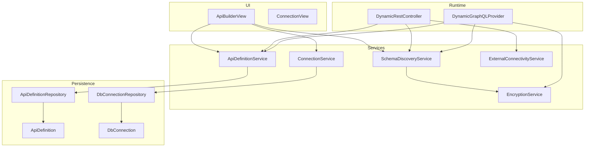
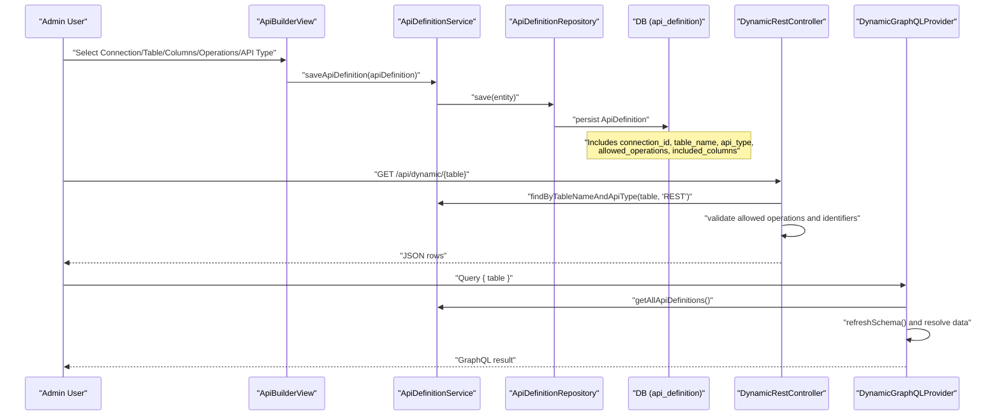
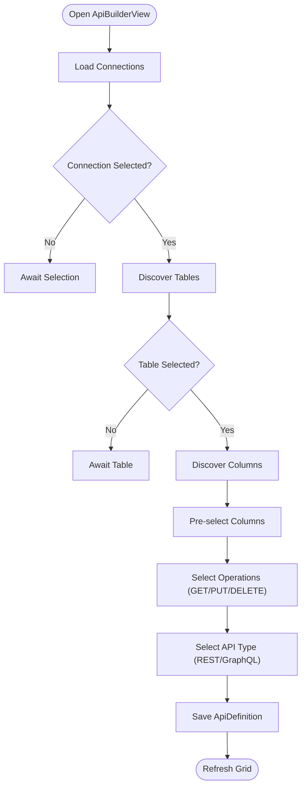
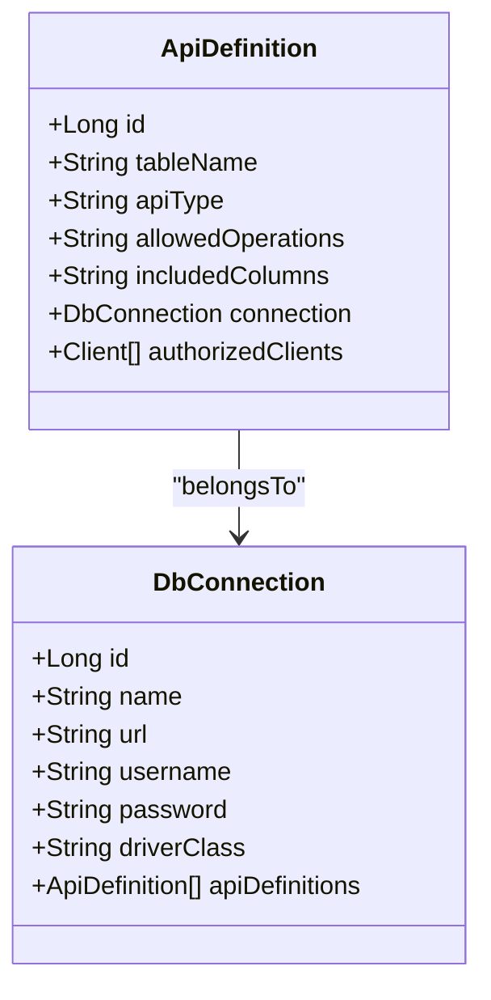
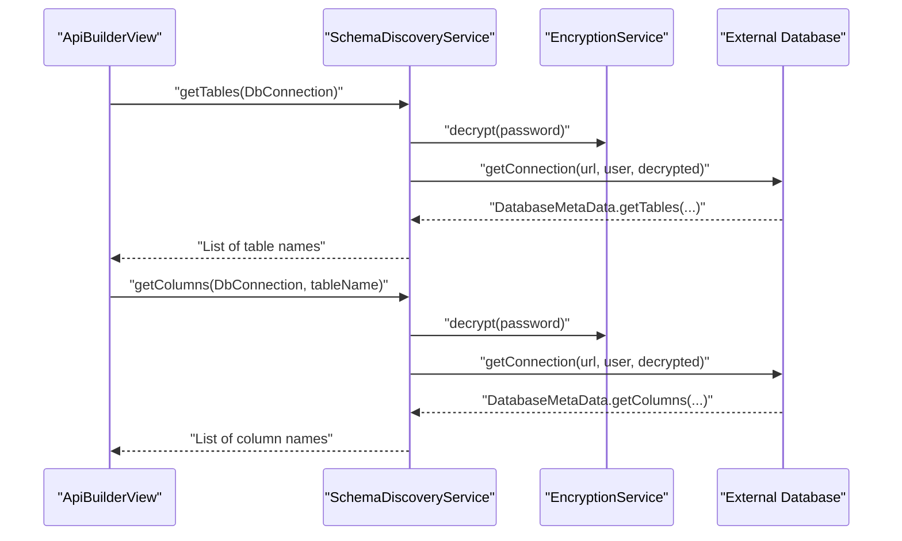
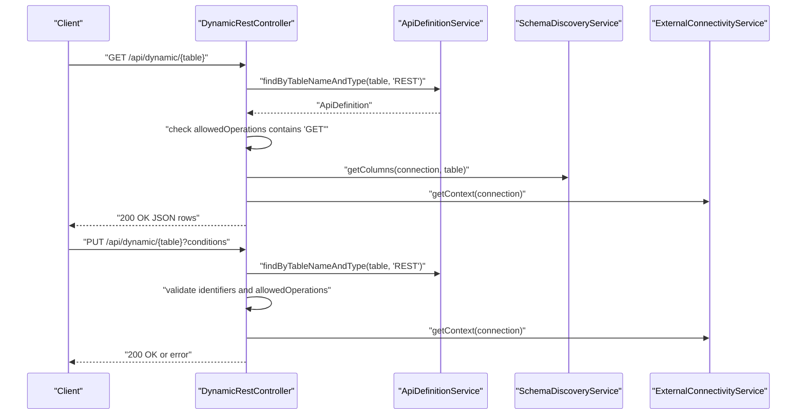
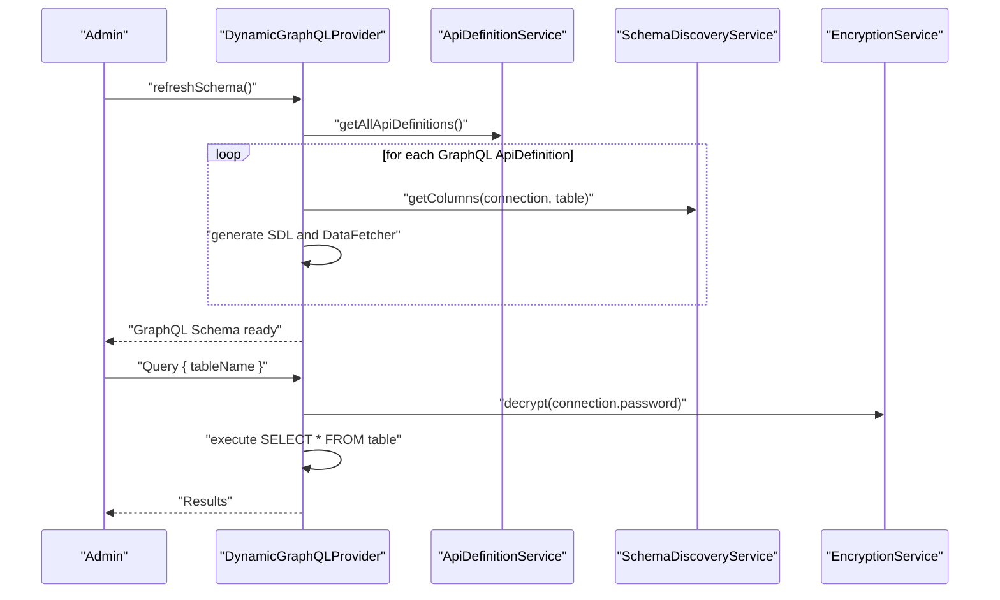
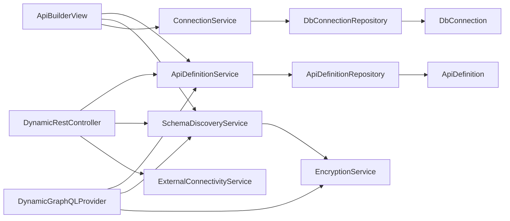
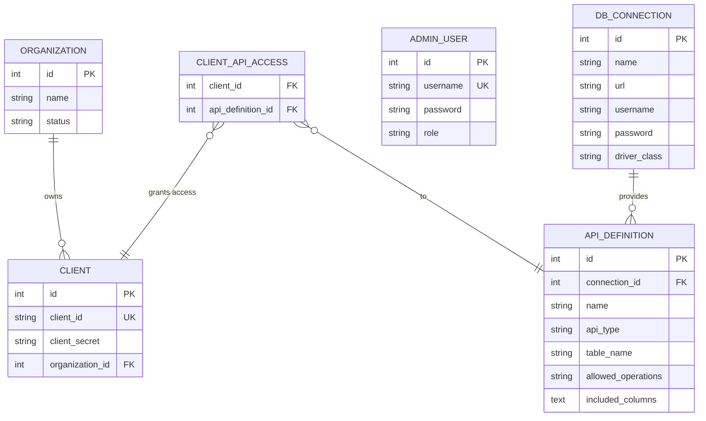

# API Builder Tools

<cite>
**Referenced Files in This Document**
- [ApiBuilderView.java](file://src/main/java/com/db2api/ui/api/ApiBuilderView.java)
- [ApiDefinitionService.java](file://src/main/java/com/db2api/service/api/ApiDefinitionService.java)
- [SchemaDiscoveryService.java](file://src/main/java/com/db2api/service/api/SchemaDiscoveryService.java)
- [ApiDefinition.java](file://src/main/java/com/db2api/persistent/api/ApiDefinition.java)
- [ApiDefinitionRepository.java](file://src/main/java/com/db2api/repository/api/ApiDefinitionRepository.java)
- [DbConnection.java](file://src/main/java/com/db2api/persistent/connection/DbConnection.java)
- [ConnectionService.java](file://src/main/java/com/db2api/service/connection/ConnectionService.java)
- [DbConnectionRepository.java](file://src/main/java/com/db2api/repository/connection/DbConnectionRepository.java)
- [DynamicRestController.java](file://src/main/java/com/db2api/controller/DynamicRestController.java)
- [DynamicGraphQLProvider.java](file://src/main/java/com/db2api/config/DynamicGraphQLProvider.java)
- [ExternalConnectivityService.java](file://src/main/java/com/db2api/service/connection/ExternalConnectivityService.java)
- [EncryptionService.java](file://src/main/java/com/db2api/service/EncryptionService.java)
- [application.properties](file://src/main/resources/application.properties)
- [schema.sql](file://src/main/resources/schema.sql)
- [ConnectionView.java](file://src/main/java/com/db2api/ui/connection/ConnectionView.java)
- [AdminUserView.java](file://src/main/java/com/db2api/ui/admin/AdminUserView.java)
- [README.md](file://README.md)
</cite>

## Table of Contents
1. [Introduction](#introduction)
2. [Project Structure](#project-structure)
3. [Core Components](#core-components)
4. [Architecture Overview](#architecture-overview)
5. [Detailed Component Analysis](#detailed-component-analysis)
6. [Dependency Analysis](#dependency-analysis)
7. [Performance Considerations](#performance-considerations)
8. [Troubleshooting Guide](#troubleshooting-guide)
9. [Conclusion](#conclusion)
10. [Appendices](#appendices)

## Introduction
This document explains the API builder tools in DB2API’s administrative interface. It covers how administrators configure dynamic REST and GraphQL APIs from database schemas, how schema discovery integrates with database connections, and how API definitions are persisted and enforced at runtime. It also documents the end-to-end workflow from selecting a database connection to exposing endpoints, including permission controls, versioning considerations, documentation generation, testing, and deployment.

## Project Structure
The API builder spans UI, persistence, services, and runtime controllers:
- UI: ApiBuilderView orchestrates the builder workflow and cascading selections for connections, tables, columns, and operations.
- Persistence: ApiDefinition and DbConnection define the schema for API definitions and database connections.
- Services: ApiDefinitionService manages API definitions; SchemaDiscoveryService introspects database schemas; ConnectionService manages connections and tests connectivity; EncryptionService protects secrets; ExternalConnectivityService provides Cayenne runtimes per connection.
- Runtime: DynamicRestController exposes dynamic REST endpoints; DynamicGraphQLProvider generates a dynamic GraphQL schema.

**Diagram sources**
- [ApiBuilderView.java:165-256](file://src/main/java/com/db2api/ui/api/ApiBuilderView.java#L165-L256)
- [ApiDefinitionService.java:10-38](file://src/main/java/com/db2api/service/api/ApiDefinitionService.java#L10-L38)
- [SchemaDiscoveryService.java:15-59](file://src/main/java/com/db2api/service/api/SchemaDiscoveryService.java#L15-L59)
- [ConnectionService.java:16-86](file://src/main/java/com/db2api/service/connection/ConnectionService.java#L16-L86)
- [ExternalConnectivityService.java:15-54](file://src/main/java/com/db2api/service/connection/ExternalConnectivityService.java#L15-L54)
- [EncryptionService.java:21-111](file://src/main/java/com/db2api/service/EncryptionService.java#L21-L111)
- [ApiDefinitionRepository.java:10-21](file://src/main/java/com/db2api/repository/api/ApiDefinitionRepository.java#L10-L21)
- [ApiDefinition.java:17-66](file://src/main/java/com/db2api/persistent/api/ApiDefinition.java#L17-L66)
- [DbConnectionRepository.java:10-12](file://src/main/java/com/db2api/repository/connection/DbConnectionRepository.java#L10-L12)
- [DbConnection.java:16-84](file://src/main/java/com/db2api/persistent/connection/DbConnection.java#L16-L84)
- [DynamicRestController.java:25-52](file://src/main/java/com/db2api/controller/DynamicRestController.java#L25-L52)
- [DynamicGraphQLProvider.java:31-53](file://src/main/java/com/db2api/config/DynamicGraphQLProvider.java#L31-L53)

**Section sources**
- [ApiBuilderView.java:31-55](file://src/main/java/com/db2api/ui/api/ApiBuilderView.java#L31-L55)
- [ApiDefinitionService.java:10-38](file://src/main/java/com/db2api/service/api/ApiDefinitionService.java#L10-L38)
- [SchemaDiscoveryService.java:15-59](file://src/main/java/com/db2api/service/api/SchemaDiscoveryService.java#L15-L59)
- [ConnectionService.java:16-86](file://src/main/java/com/db2api/service/connection/ConnectionService.java#L16-L86)
- [ExternalConnectivityService.java:15-54](file://src/main/java/com/db2api/service/connection/ExternalConnectivityService.java#L15-L54)
- [EncryptionService.java:21-111](file://src/main/java/com/db2api/service/EncryptionService.java#L21-L111)
- [ApiDefinitionRepository.java:10-21](file://src/main/java/com/db2api/repository/api/ApiDefinitionRepository.java#L10-L21)
- [ApiDefinition.java:17-66](file://src/main/java/com/db2api/persistent/api/ApiDefinition.java#L17-L66)
- [DbConnectionRepository.java:10-12](file://src/main/java/com/db2api/repository/connection/DbConnectionRepository.java#L10-L12)
- [DbConnection.java:16-84](file://src/main/java/com/db2api/persistent/connection/DbConnection.java#L16-L84)
- [DynamicRestController.java:25-52](file://src/main/java/com/db2api/controller/DynamicRestController.java#L25-L52)
- [DynamicGraphQLProvider.java:31-53](file://src/main/java/com/db2api/config/DynamicGraphQLProvider.java#L31-L53)

## Core Components
- ApiBuilderView: Admin UI for creating/editing API definitions with cascading selection of connection → table → columns and operations, and choosing REST or GraphQL.
- ApiDefinitionService: CRUD for ApiDefinition entities and lookup by table and type.
- SchemaDiscoveryService: Discovers tables and columns from a DbConnection using JDBC metadata.
- ConnectionService: Manages DbConnection lifecycle, including encryption-aware saving and connectivity testing.
- EncryptionService: AES/GCM encryption/decryption for secrets.
- ExternalConnectivityService: Builds Cayenne ServerRuntime per connection and caches them.
- DynamicRestController: Dynamic REST endpoints mapped under /api/dynamic/{table}.
- DynamicGraphQLProvider: Generates a runtime GraphQL schema from ApiDefinition entries.

**Section sources**
- [ApiBuilderView.java:35-55](file://src/main/java/com/db2api/ui/api/ApiBuilderView.java#L35-L55)
- [ApiDefinitionService.java:19-37](file://src/main/java/com/db2api/service/api/ApiDefinitionService.java#L19-L37)
- [SchemaDiscoveryService.java:24-58](file://src/main/java/com/db2api/service/api/SchemaDiscoveryService.java#L24-L58)
- [ConnectionService.java:43-85](file://src/main/java/com/db2api/service/connection/ConnectionService.java#L43-L85)
- [EncryptionService.java:59-110](file://src/main/java/com/db2api/service/EncryptionService.java#L59-L110)
- [ExternalConnectivityService.java:25-53](file://src/main/java/com/db2api/service/connection/ExternalConnectivityService.java#L25-L53)
- [DynamicRestController.java:76-113](file://src/main/java/com/db2api/controller/DynamicRestController.java#L76-L113)
- [DynamicGraphQLProvider.java:77-132](file://src/main/java/com/db2api/config/DynamicGraphQLProvider.java#L77-L132)

## Architecture Overview
The API builder workflow connects UI, persistence, and runtime:
- UI captures user choices and persists ApiDefinition.
- SchemaDiscoveryService validates and constrains selections against the database schema.
- DynamicRestController enforces allowed operations and validates identifiers against schema.
- DynamicGraphQLProvider builds a schema from ApiDefinition entries and resolves data via JDBC.

**Diagram sources**
- [ApiBuilderView.java:121-136](file://src/main/java/com/db2api/ui/api/ApiBuilderView.java#L121-L136)
- [ApiDefinitionService.java:23-29](file://src/main/java/com/db2api/service/api/ApiDefinitionService.java#L23-L29)
- [ApiDefinitionRepository.java:20](file://src/main/java/com/db2api/repository/api/ApiDefinitionRepository.java#L20)
- [DynamicRestController.java:76-113](file://src/main/java/com/db2api/controller/DynamicRestController.java#L76-L113)
- [DynamicGraphQLProvider.java:81-132](file://src/main/java/com/db2api/config/DynamicGraphQLProvider.java#L81-L132)

## Detailed Component Analysis

### API Builder UI Workflow
ApiBuilderView coordinates cascading selections and saves ApiDefinition:
- Loads connections from ConnectionService.
- On connection change, lists tables via SchemaDiscoveryService.
- On table change, selects columns and pre-checks them.
- Captures allowed operations and API type (REST or GraphQL).
- Persists via ApiDefinitionService and refreshes the grid.

**Diagram sources**
- [ApiBuilderView.java:205-222](file://src/main/java/com/db2api/ui/api/ApiBuilderView.java#L205-L222)
- [ApiBuilderView.java:121-136](file://src/main/java/com/db2api/ui/api/ApiBuilderView.java#L121-L136)

**Section sources**
- [ApiBuilderView.java:165-256](file://src/main/java/com/db2api/ui/api/ApiBuilderView.java#L165-L256)

### API Definition Model and Persistence
ApiDefinition maps a database table to a dynamic API:
- References a DbConnection.
- Stores table_name, api_type, allowed_operations, included_columns.
- Supports many-to-many with Clients via a join table.

**Diagram sources**
- [ApiDefinition.java:21-66](file://src/main/java/com/db2api/persistent/api/ApiDefinition.java#L21-L66)
- [DbConnection.java:20-84](file://src/main/java/com/db2api/persistent/connection/DbConnection.java#L20-L84)

**Section sources**
- [ApiDefinition.java:17-66](file://src/main/java/com/db2api/persistent/api/ApiDefinition.java#L17-L66)
- [DbConnection.java:16-84](file://src/main/java/com/db2api/persistent/connection/DbConnection.java#L16-L84)
- [schema.sql:23-31](file://src/main/resources/schema.sql#L23-L31)

### Schema Discovery Integration
SchemaDiscoveryService uses JDBC DatabaseMetaData to list tables and columns, and decrypts connection passwords before connecting.

**Diagram sources**
- [SchemaDiscoveryService.java:24-58](file://src/main/java/com/db2api/service/api/SchemaDiscoveryService.java#L24-L58)
- [EncryptionService.java:89-110](file://src/main/java/com/db2api/service/EncryptionService.java#L89-L110)

**Section sources**
- [SchemaDiscoveryService.java:24-58](file://src/main/java/com/db2api/service/api/SchemaDiscoveryService.java#L24-L58)
- [EncryptionService.java:59-110](file://src/main/java/com/db2api/service/EncryptionService.java#L59-L110)

### Dynamic REST API Creation
DynamicRestController exposes endpoints under /api/dynamic/{table}:
- Validates allowed operations from ApiDefinition.
- Validates identifiers against schema-derived allowed sets.
- Uses ExternalConnectivityService to obtain a Cayenne ObjectContext per connection.
- Supports GET (read), POST (create), PUT (update), DELETE (remove) with condition parameters.

**Diagram sources**
- [DynamicRestController.java:76-113](file://src/main/java/com/db2api/controller/DynamicRestController.java#L76-L113)
- [DynamicRestController.java:123-182](file://src/main/java/com/db2api/controller/DynamicRestController.java#L123-L182)
- [ApiDefinitionService.java:23-25](file://src/main/java/com/db2api/service/api/ApiDefinitionService.java#L23-L25)
- [ExternalConnectivityService.java:25-27](file://src/main/java/com/db2api/service/connection/ExternalConnectivityService.java#L25-L27)

**Section sources**
- [DynamicRestController.java:76-113](file://src/main/java/com/db2api/controller/DynamicRestController.java#L76-L113)
- [DynamicRestController.java:123-182](file://src/main/java/com/db2api/controller/DynamicRestController.java#L123-L182)
- [ApiDefinitionService.java:23-25](file://src/main/java/com/db2api/service/api/ApiDefinitionService.java#L23-L25)
- [ExternalConnectivityService.java:25-27](file://src/main/java/com/db2api/service/connection/ExternalConnectivityService.java#L25-L27)

### Dynamic GraphQL API Creation
DynamicGraphQLProvider builds a runtime schema:
- Iterates ApiDefinition entries where api_type equals GraphQL.
- Generates SDL with Query fields and type definitions derived from discovered columns.
- Wires DataFetchers that execute SQL via JDBC using decrypted credentials.

**Diagram sources**
- [DynamicGraphQLProvider.java:77-132](file://src/main/java/com/db2api/config/DynamicGraphQLProvider.java#L77-L132)
- [DynamicGraphQLProvider.java:140-164](file://src/main/java/com/db2api/config/DynamicGraphQLProvider.java#L140-L164)
- [ApiDefinitionService.java:19-21](file://src/main/java/com/db2api/service/api/ApiDefinitionService.java#L19-L21)
- [SchemaDiscoveryService.java:42-58](file://src/main/java/com/db2api/service/api/SchemaDiscoveryService.java#L42-L58)
- [EncryptionService.java:89-110](file://src/main/java/com/db2api/service/EncryptionService.java#L89-L110)

**Section sources**
- [DynamicGraphQLProvider.java:77-132](file://src/main/java/com/db2api/config/DynamicGraphQLProvider.java#L77-L132)
- [DynamicGraphQLProvider.java:140-164](file://src/main/java/com/db2api/config/DynamicGraphQLProvider.java#L140-L164)

### Practical Examples

#### Building an API from a Database Schema
- Step 1: Configure a database connection in the Connections UI and test connectivity.
- Step 2: Open the API Builder, select the connection, choose a table, and pre-selected columns.
- Step 3: Choose REST or GraphQL and pick allowed operations.
- Step 4: Save the API definition; it becomes immediately available at runtime.

**Section sources**
- [ConnectionView.java:116-127](file://src/main/java/com/db2api/ui/connection/ConnectionView.java#L116-L127)
- [ApiBuilderView.java:205-222](file://src/main/java/com/db2api/ui/api/ApiBuilderView.java#L205-L222)
- [ApiDefinitionService.java:27-29](file://src/main/java/com/db2api/service/api/ApiDefinitionService.java#L27-L29)

#### Configuring API Endpoints and Permissions
- Allowed operations are stored in the ApiDefinition.allowedOperations and enforced by DynamicRestController.
- Identifier validation ensures only schema-known columns are used.

**Section sources**
- [ApiDefinition.java:44-46](file://src/main/java/com/db2api/persistent/api/ApiDefinition.java#L44-L46)
- [DynamicRestController.java:83-85](file://src/main/java/com/db2api/controller/DynamicRestController.java#L83-L85)
- [DynamicRestController.java:62-68](file://src/main/java/com/db2api/controller/DynamicRestController.java#L62-L68)

#### Managing API Versions
- Versioning can be achieved by creating separate ApiDefinition entries for the same table with distinct names and api_type values. Clients can target different definitions to consume different “versions.”

**Section sources**
- [ApiDefinition.java:33-40](file://src/main/java/com/db2api/persistent/api/ApiDefinition.java#L33-L40)
- [ApiDefinitionRepository.java:20](file://src/main/java/com/db2api/repository/api/ApiDefinitionRepository.java#L20)

#### API Documentation Generation and Testing
- REST: The dynamic endpoints are documented implicitly by the ApiDefinition configuration. Use a client to explore GET/POST/PUT/DELETE endpoints under /api/dynamic/{table}.
- GraphQL: The schema is generated dynamically; clients can introspect the schema at the GraphQL endpoint.

**Section sources**
- [README.md:84-99](file://README.md#L84-L99)
- [DynamicRestController.java:76-113](file://src/main/java/com/db2api/controller/DynamicRestController.java#L76-L113)
- [DynamicGraphQLProvider.java:77-132](file://src/main/java/com/db2api/config/DynamicGraphQLProvider.java#L77-L132)

#### Deployment Workflows
- Build and run the Spring Boot application; the UI is served at the root path, and runtime endpoints are exposed as REST and GraphQL.
- Configure application properties for the system database and server port.

**Section sources**
- [README.md:44-63](file://README.md#L44-L63)
- [application.properties:1-20](file://src/main/resources/application.properties#L1-L20)

## Dependency Analysis
The following diagram highlights key dependencies among components involved in the API builder and runtime:

**Diagram sources**
- [ApiBuilderView.java:35-55](file://src/main/java/com/db2api/ui/api/ApiBuilderView.java#L35-L55)
- [ApiDefinitionService.java:13-17](file://src/main/java/com/db2api/service/api/ApiDefinitionService.java#L13-L17)
- [SchemaDiscoveryService.java:18-22](file://src/main/java/com/db2api/service/api/SchemaDiscoveryService.java#L18-L22)
- [ConnectionService.java:21-26](file://src/main/java/com/db2api/service/connection/ConnectionService.java#L21-L26)
- [ApiDefinitionRepository.java:11-21](file://src/main/java/com/db2api/repository/api/ApiDefinitionRepository.java#L11-L21)
- [ApiDefinition.java:57-59](file://src/main/java/com/db2api/persistent/api/ApiDefinition.java#L57-L59)
- [EncryptionService.java:21-34](file://src/main/java/com/db2api/service/EncryptionService.java#L21-L34)
- [DbConnectionRepository.java:11-12](file://src/main/java/com/db2api/repository/connection/DbConnectionRepository.java#L11-L12)
- [DbConnection.java:62-63](file://src/main/java/com/db2api/persistent/connection/DbConnection.java#L62-L63)
- [DynamicRestController.java:34-52](file://src/main/java/com/db2api/controller/DynamicRestController.java#L34-L52)
- [ExternalConnectivityService.java:19-23](file://src/main/java/com/db2api/service/connection/ExternalConnectivityService.java#L19-L23)
- [DynamicGraphQLProvider.java:34-53](file://src/main/java/com/db2api/config/DynamicGraphQLProvider.java#L34-L53)

**Section sources**
- [ApiBuilderView.java:35-55](file://src/main/java/com/db2api/ui/api/ApiBuilderView.java#L35-L55)
- [ApiDefinitionService.java:13-17](file://src/main/java/com/db2api/service/api/ApiDefinitionService.java#L13-L17)
- [SchemaDiscoveryService.java:18-22](file://src/main/java/com/db2api/service/api/SchemaDiscoveryService.java#L18-L22)
- [ConnectionService.java:21-26](file://src/main/java/com/db2api/service/connection/ConnectionService.java#L21-L26)
- [ApiDefinitionRepository.java:11-21](file://src/main/java/com/db2api/repository/api/ApiDefinitionRepository.java#L11-L21)
- [ApiDefinition.java:57-59](file://src/main/java/com/db2api/persistent/api/ApiDefinition.java#L57-L59)
- [EncryptionService.java:21-34](file://src/main/java/com/db2api/service/EncryptionService.java#L21-L34)
- [DbConnectionRepository.java:11-12](file://src/main/java/com/db2api/repository/connection/DbConnectionRepository.java#L11-L12)
- [DbConnection.java:62-63](file://src/main/java/com/db2api/persistent/connection/DbConnection.java#L62-L63)
- [DynamicRestController.java:34-52](file://src/main/java/com/db2api/controller/DynamicRestController.java#L34-L52)
- [ExternalConnectivityService.java:19-23](file://src/main/java/com/db2api/service/connection/ExternalConnectivityService.java#L19-L23)
- [DynamicGraphQLProvider.java:34-53](file://src/main/java/com/db2api/config/DynamicGraphQLProvider.java#L34-L53)

## Performance Considerations
- Connection caching: ExternalConnectivityService caches Cayenne ServerRuntime per connection ID to reduce overhead.
- Schema discovery: Reuse discovered column sets to avoid repeated JDBC metadata calls.
- Identifier validation: Enforce allowed identifiers early to prevent expensive failed queries.
- Encryption: Avoid re-encrypting passwords; use the dedicated save method that accepts a raw password.

**Section sources**
- [ExternalConnectivityService.java:18-31](file://src/main/java/com/db2api/service/connection/ExternalConnectivityService.java#L18-L31)
- [ConnectionService.java:43-47](file://src/main/java/com/db2api/service/connection/ConnectionService.java#L43-L47)

## Troubleshooting Guide
- Connection failures:
  - Use the Connections UI to test connectivity; it reports success or failure notifications.
  - Verify JDBC URL, driver class, username, and decrypted password.
- Schema discovery errors:
  - Ensure the database supports JDBC DatabaseMetaData and the connection has appropriate privileges.
  - Confirm the chosen table exists and is accessible.
- REST endpoint errors:
  - Check allowed operations in the API definition.
  - Validate column names match schema and are included in the definition.
- GraphQL schema issues:
  - Refresh the schema after creating/updating ApiDefinition entries.
  - Confirm the api_type is set to GraphQL for the target definition.

**Section sources**
- [ConnectionView.java:116-127](file://src/main/java/com/db2api/ui/connection/ConnectionView.java#L116-L127)
- [SchemaDiscoveryService.java:35-38](file://src/main/java/com/db2api/service/api/SchemaDiscoveryService.java#L35-L38)
- [DynamicRestController.java:83-85](file://src/main/java/com/db2api/controller/DynamicRestController.java#L83-L85)
- [DynamicGraphQLProvider.java:60-61](file://src/main/java/com/db2api/config/DynamicGraphQLProvider.java#L60-L61)

## Conclusion
DB2API’s API builder enables administrators to quickly generate secure REST and GraphQL APIs from existing database schemas. The UI captures user intent, persistence stores API definitions, schema discovery validates selections, and runtime controllers enforce permissions and safety checks. With encryption, connection caching, and dynamic schema generation, the system balances flexibility and security for operational use.

## Appendices

### Data Model Overview

**Diagram sources**
- [schema.sql:1-45](file://src/main/resources/schema.sql#L1-L45)