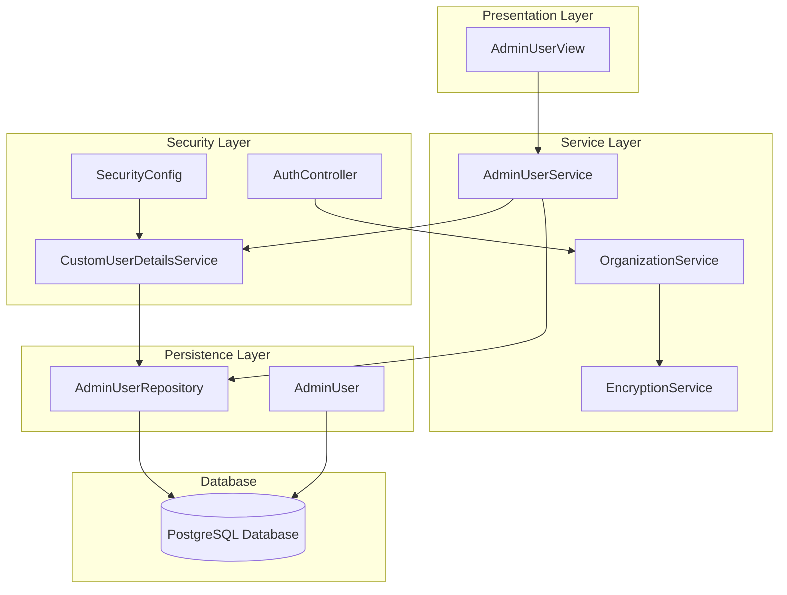
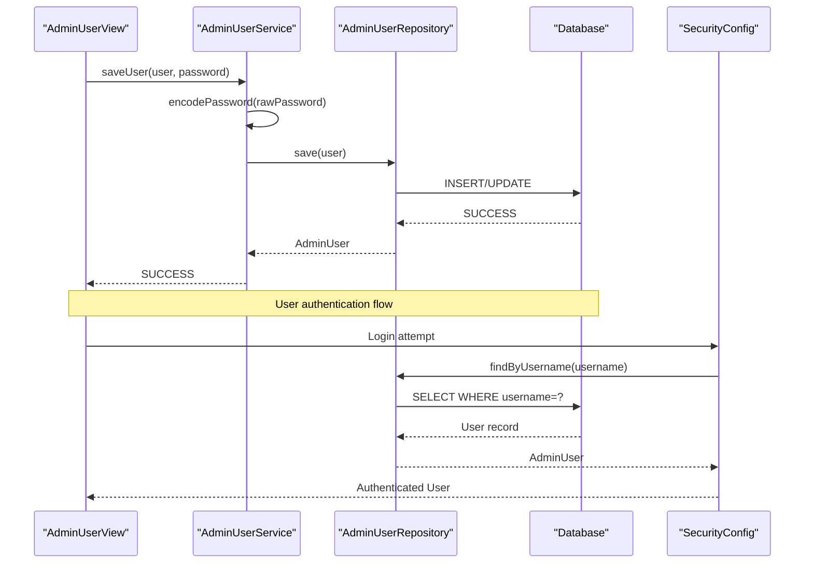
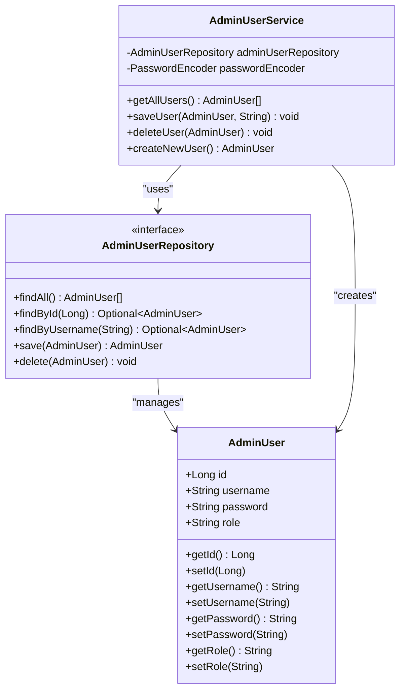
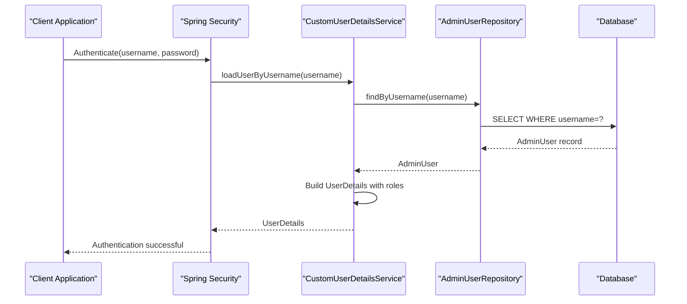
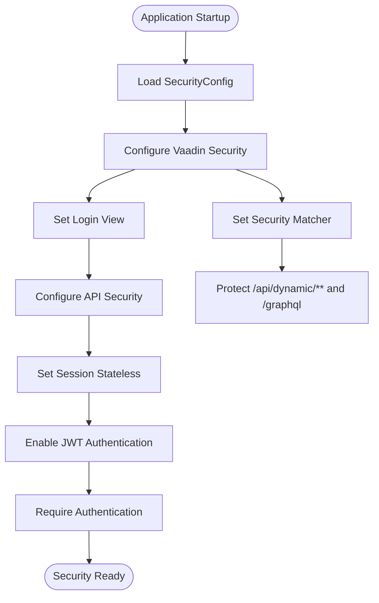
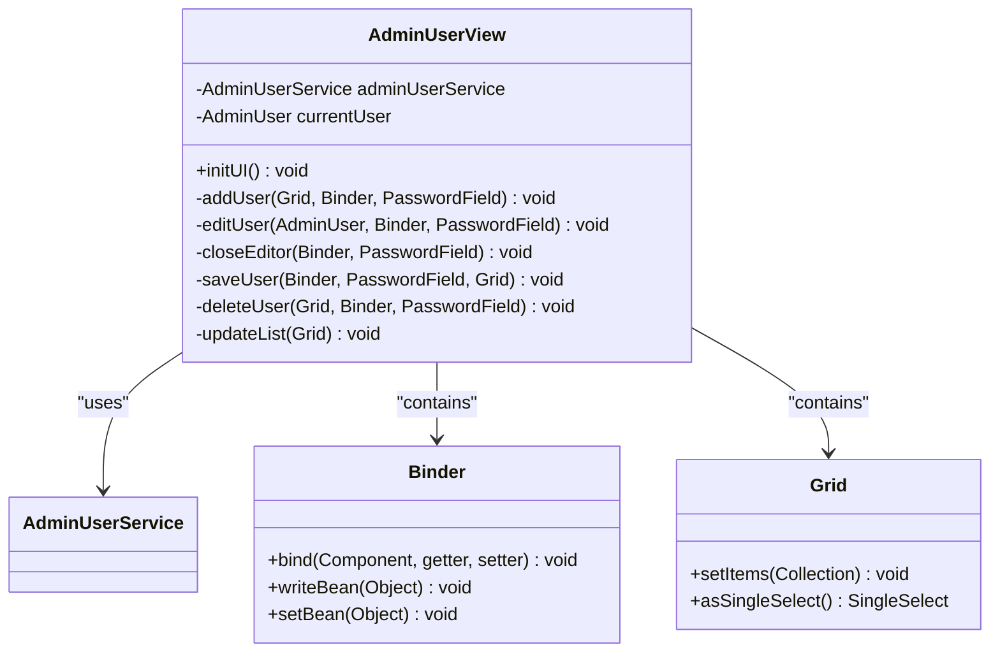
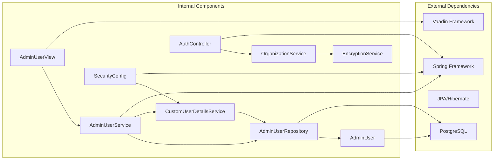

# Admin User Management

<cite>
**Referenced Files in This Document**
- [AdminUser.java](file://src/main/java/com/db2api/persistent/admin/AdminUser.java)
- [AdminUserRepository.java](file://src/main/java/com/db2api/repository/admin/AdminUserRepository.java)
- [AdminUserService.java](file://src/main/java/com/db2api/service/admin/AdminUserService.java)
- [CustomUserDetailsService.java](file://src/main/java/com/db2api/security/CustomUserDetailsService.java)
- [SecurityConfig.java](file://src/main/java/com/db2api/config/SecurityConfig.java)
- [AdminUserView.java](file://src/main/java/com/db2api/ui/admin/AdminUserView.java)
- [AuthController.java](file://src/main/java/com/db2api/controller/AuthController.java)
- [EncryptionService.java](file://src/main/java/com/db2api/service/EncryptionService.java)
- [OrganizationService.java](file://src/main/java/com/db2api/service/organization/OrganizationService.java)
- [schema.sql](file://src/main/resources/schema.sql)
- [application.properties](file://src/main/resources/application.properties)
</cite>

## Table of Contents
1. [Introduction](#introduction)
2. [Project Structure](#project-structure)
3. [Core Components](#core-components)
4. [Architecture Overview](#architecture-overview)
5. [Detailed Component Analysis](#detailed-component-analysis)
6. [Dependency Analysis](#dependency-analysis)
7. [Performance Considerations](#performance-considerations)
8. [Troubleshooting Guide](#troubleshooting-guide)
9. [Conclusion](#conclusion)

## Introduction
This document provides comprehensive documentation for the administrative user management functionality within the DB2API application. It covers the creation, modification, and deletion of administrative users, role assignment, and permission management. The documentation details user authentication integration, password management, and access control enforcement, along with practical examples and security considerations.

## Project Structure
The administrative user management functionality is organized across several key layers:

- **Persistence Layer**: Defines the AdminUser entity and repository interface
- **Service Layer**: Implements business logic for user management operations
- **Security Layer**: Handles authentication, authorization, and password encoding
- **Presentation Layer**: Provides a Vaadin UI for managing administrative users
- **Configuration Layer**: Sets up Spring Security and JWT authentication

**Diagram sources**
- [AdminUserView.java:25-42](file://src/main/java/com/db2api/ui/admin/AdminUserView.java#L25-L42)
- [AdminUserService.java:11-40](file://src/main/java/com/db2api/service/admin/AdminUserService.java#L11-L40)
- [CustomUserDetailsService.java:12-31](file://src/main/java/com/db2api/security/CustomUserDetailsService.java#L12-L31)
- [SecurityConfig.java:28-90](file://src/main/java/com/db2api/config/SecurityConfig.java#L28-L90)
- [AuthController.java:25-43](file://src/main/java/com/db2api/controller/AuthController.java#L25-L43)

**Section sources**
- [AdminUser.java:12-42](file://src/main/java/com/db2api/persistent/admin/AdminUser.java#L12-L42)
- [AdminUserRepository.java:9-22](file://src/main/java/com/db2api/repository/admin/AdminUserRepository.java#L9-L22)
- [AdminUserService.java:11-40](file://src/main/java/com/db2api/service/admin/AdminUserService.java#L11-L40)
- [AdminUserView.java:25-42](file://src/main/java/com/db2api/ui/admin/AdminUserView.java#L25-L42)

## Core Components
The administrative user management system consists of several interconnected components that work together to provide a complete user management solution.

### AdminUser Entity
The AdminUser entity represents the core data structure for administrative users in the system. It includes essential fields for authentication and authorization:

- **Primary Key**: Auto-generated Long ID
- **Username**: Unique identifier for the user
- **Password**: Encrypted password storage
- **Role**: User role for authorization (ADMIN, EDITOR, VIEWER)

### AdminUserRepository
The repository interface extends Spring Data JPA's JpaRepository, providing standard CRUD operations plus specialized queries for user management.

### AdminUserService
The service layer implements the business logic for administrative user operations, including password encoding and user lifecycle management.

### CustomUserDetailsService
Handles Spring Security's UserDetailsService interface, enabling authentication against the admin user database.

### SecurityConfig
Configures Spring Security for both the Vaadin UI and JWT-based resource server authentication.

**Section sources**
- [AdminUser.java:16-42](file://src/main/java/com/db2api/persistent/admin/AdminUser.java#L16-L42)
- [AdminUserRepository.java:13-21](file://src/main/java/com/db2api/repository/admin/AdminUserRepository.java#L13-L21)
- [AdminUserService.java:14-39](file://src/main/java/com/db2api/service/admin/AdminUserService.java#L14-L39)
- [CustomUserDetailsService.java:15-30](file://src/main/java/com/db2api/security/CustomUserDetailsService.java#L15-L30)
- [SecurityConfig.java:53-63](file://src/main/java/com/db2api/config/SecurityConfig.java#L53-L63)

## Architecture Overview
The administrative user management follows a layered architecture pattern with clear separation of concerns:

**Diagram sources**
- [AdminUserView.java:94-105](file://src/main/java/com/db2api/ui/admin/AdminUserView.java#L94-L105)
- [AdminUserService.java:26-31](file://src/main/java/com/db2api/service/admin/AdminUserService.java#L26-L31)
- [AdminUserRepository.java:21](file://src/main/java/com/db2api/repository/admin/AdminUserRepository.java#L21)
- [SecurityConfig.java:54-62](file://src/main/java/com/db2api/config/SecurityConfig.java#L54-L62)

The architecture enforces security through multiple layers:
- **UI Layer**: Role-based access control prevents unauthorized access
- **Service Layer**: Business logic validation and password encoding
- **Security Layer**: Spring Security configuration and JWT authentication
- **Persistence Layer**: Database constraints and entity relationships

## Detailed Component Analysis

### AdminUser Entity Analysis
The AdminUser entity serves as the foundation for all administrative user operations. It implements proper JPA annotations for database persistence and includes Lombok annotations for code generation.

**Diagram sources**
- [AdminUser.java:16-42](file://src/main/java/com/db2api/persistent/admin/AdminUser.java#L16-L42)
- [AdminUserRepository.java:13-21](file://src/main/java/com/db2api/repository/admin/AdminUserRepository.java#L13-L21)
- [AdminUserService.java:14-39](file://src/main/java/com/db2api/service/admin/AdminUserService.java#L14-L39)

**Section sources**
- [AdminUser.java:12-42](file://src/main/java/com/db2api/persistent/admin/AdminUser.java#L12-L42)
- [schema.sql:33-38](file://src/main/resources/schema.sql#L33-L38)

### AdminUserService Implementation
The AdminUserService provides the core business logic for administrative user management operations. It implements password encoding and user lifecycle management.

Key features:
- **Password Encoding**: Uses BCryptPasswordEncoder for secure password hashing
- **User Creation**: Creates new user instances with proper initialization
- **User Persistence**: Handles both creation and update operations
- **User Deletion**: Manages user removal from the system

**Section sources**
- [AdminUserService.java:14-39](file://src/main/java/com/db2api/service/admin/AdminUserService.java#L14-L39)

### CustomUserDetailsService Integration
The CustomUserDetailsService integrates with Spring Security's UserDetailsService interface, enabling authentication against the admin user database.

**Diagram sources**
- [CustomUserDetailsService.java:21-30](file://src/main/java/com/db2api/security/CustomUserDetailsService.java#L21-L30)
- [AdminUserRepository.java:21](file://src/main/java/com/db2api/repository/admin/AdminUserRepository.java#L21)

**Section sources**
- [CustomUserDetailsService.java:15-30](file://src/main/java/com/db2api/security/CustomUserDetailsService.java#L15-L30)

### Security Configuration
The SecurityConfig class provides comprehensive security configuration for both the Vaadin UI and JWT-based resource server authentication.

**Diagram sources**
- [SecurityConfig.java:54-62](file://src/main/java/com/db2api/config/SecurityConfig.java#L54-L62)
- [SecurityConfig.java:70-79](file://src/main/java/com/db2api/config/SecurityConfig.java#L70-L79)

**Section sources**
- [SecurityConfig.java:53-89](file://src/main/java/com/db2api/config/SecurityConfig.java#L53-L89)

### AdminUserView UI Component
The AdminUserView provides a comprehensive user interface for managing administrative users through the Vaadin framework.

**Diagram sources**
- [AdminUserView.java:28-42](file://src/main/java/com/db2api/ui/admin/AdminUserView.java#L28-L42)
- [AdminUserView.java:94-129](file://src/main/java/com/db2api/ui/admin/AdminUserView.java#L94-L129)

**Section sources**
- [AdminUserView.java:28-186](file://src/main/java/com/db2api/ui/admin/AdminUserView.java#L28-L186)

### Authentication Integration
The system integrates multiple authentication mechanisms for different use cases:

#### JWT-Based Resource Server Authentication
The AuthController implements OAuth2 client_credentials grant type for programmatic access to dynamic API endpoints.

#### Form-Based Authentication for UI
The SecurityConfig sets up form-based authentication for the Vaadin UI, protecting administrative interfaces.

**Section sources**
- [AuthController.java:54-109](file://src/main/java/com/db2api/controller/AuthController.java#L54-L109)
- [SecurityConfig.java:54-62](file://src/main/java/com/db2api/config/SecurityConfig.java#L54-L62)

## Dependency Analysis
The administrative user management system exhibits well-structured dependencies with clear separation of concerns:

**Diagram sources**
- [AdminUserView.java:39-41](file://src/main/java/com/db2api/ui/admin/AdminUserView.java#L39-L41)
- [AdminUserService.java:17-19](file://src/main/java/com/db2api/service/admin/AdminUserService.java#L17-L19)
- [AdminUserRepository.java:13](file://src/main/java/com/db2api/repository/admin/AdminUserRepository.java#L13)
- [AdminUser.java:16](file://src/main/java/com/db2api/persistent/admin/AdminUser.java#L16)
- [CustomUserDetailsService.java:17-19](file://src/main/java/com/db2api/security/CustomUserDetailsService.java#L17-L19)
- [SecurityConfig.java:42-44](file://src/main/java/com/db2api/config/SecurityConfig.java#L42-L44)
- [AuthController.java:40-43](file://src/main/java/com/db2api/controller/AuthController.java#L40-L43)
- [EncryptionService.java:22](file://src/main/java/com/db2api/service/EncryptionService.java#L22)
- [OrganizationService.java:22-27](file://src/main/java/com/db2api/service/organization/OrganizationService.java#L22-L27)

**Section sources**
- [AdminUserView.java:39-41](file://src/main/java/com/db2api/ui/admin/AdminUserView.java#L39-L41)
- [AdminUserService.java:17-19](file://src/main/java/com/db2api/service/admin/AdminUserService.java#L17-L19)
- [SecurityConfig.java:42-44](file://src/main/java/com/db2api/config/SecurityConfig.java#L42-L44)

## Performance Considerations
The administrative user management system incorporates several performance optimization strategies:

### Database Performance
- **Unique Constraints**: Username uniqueness prevents duplicate entries and enables efficient lookups
- **Indexing**: Auto-generated indexes on primary keys and unique fields
- **Connection Pooling**: Spring Boot's default connection pooling for database operations

### Memory Management
- **Lazy Loading**: JPA lazy loading reduces memory footprint for related entities
- **Pagination**: Grid component supports virtual scrolling for large datasets
- **Object Reuse**: Vaadin's component reuse patterns minimize memory allocation

### Security Performance
- **Password Hashing**: BCrypt cost factor balances security and performance
- **Token Validation**: Efficient JWT decoding without database round trips
- **Session Management**: Stateless JWT authentication eliminates session storage overhead

## Troubleshooting Guide

### Common Issues and Solutions

#### Authentication Failures
**Problem**: Users cannot log into the administrative interface
**Solution**: Verify username/password combination and ensure user role is properly assigned

#### Password Encoding Issues
**Problem**: Password changes not taking effect
**Solution**: Ensure raw password is provided to the saveUser method for encoding

#### Database Connection Problems
**Problem**: Cannot persist user changes
**Solution**: Check database connectivity and verify admin_user table exists

#### UI Access Denied
**Problem**: Cannot access admin user management interface
**Solution**: Verify user has ADMIN role assigned

**Section sources**
- [AdminUserService.java:26-31](file://src/main/java/com/db2api/service/admin/AdminUserService.java#L26-L31)
- [CustomUserDetailsService.java:21-30](file://src/main/java/com/db2api/security/CustomUserDetailsService.java#L21-L30)
- [AdminUserView.java:27](file://src/main/java/com/db2api/ui/admin/AdminUserView.java#L27)

### Debugging Strategies
1. **Enable SQL Logging**: Set `spring.jpa.show-sql=true` in application.properties
2. **Check Security Logs**: Monitor Spring Security authentication events
3. **Verify Database Schema**: Ensure admin_user table matches entity definition
4. **Test Password Encoding**: Validate BCrypt password encoding process

## Conclusion
The administrative user management functionality in DB2API provides a comprehensive, secure, and user-friendly solution for managing administrative users. The system successfully integrates multiple layers of security, including role-based access control, password encoding, and JWT authentication. The modular architecture ensures maintainability and extensibility while providing a seamless user experience through the Vaadin interface.

Key strengths of the implementation include:
- **Security First Design**: Multi-layered security approach with proper separation of concerns
- **User Experience**: Intuitive Vaadin interface with comprehensive CRUD operations
- **Scalability**: Well-structured architecture supporting future enhancements
- **Maintainability**: Clear code organization and documentation

The system provides a solid foundation for administrative user management that can be extended and customized according to specific organizational requirements while maintaining security and performance standards.