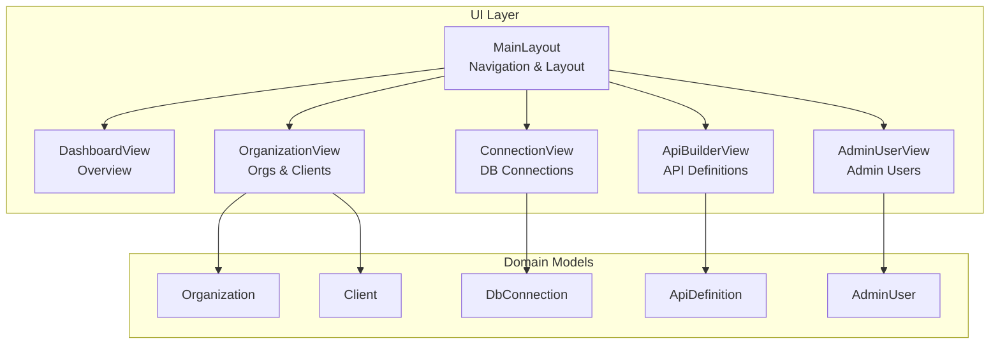
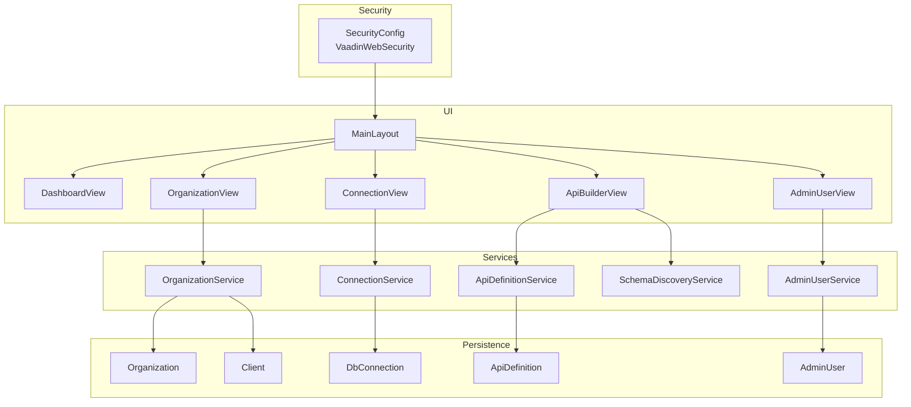
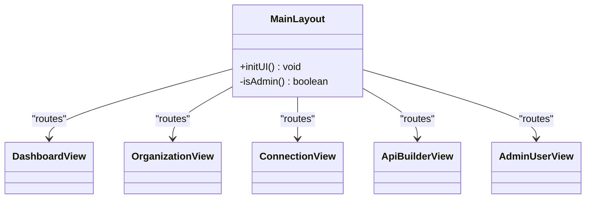
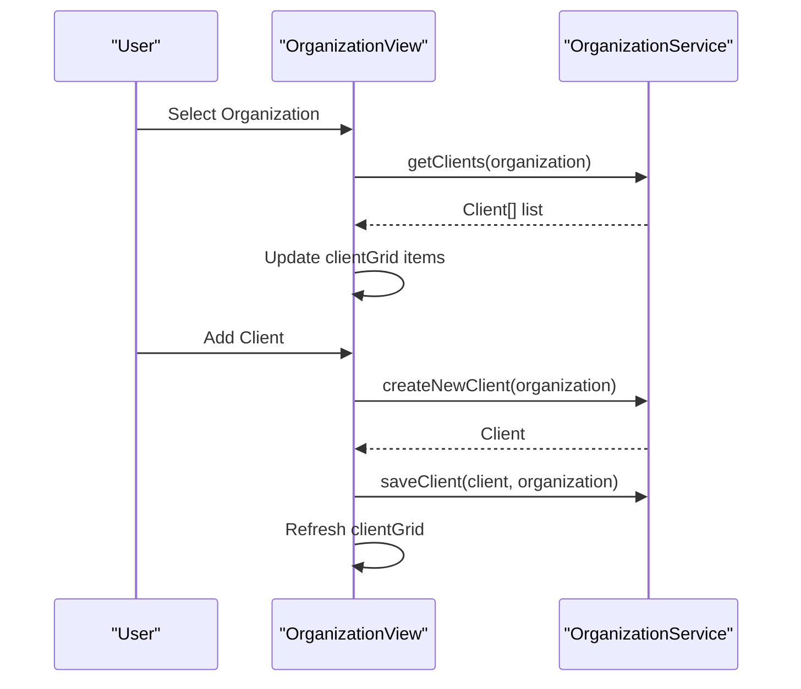
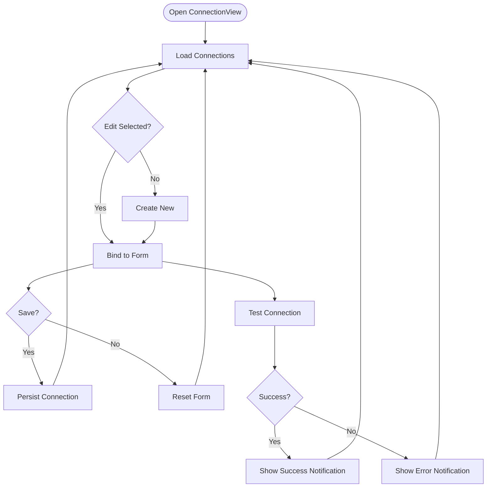
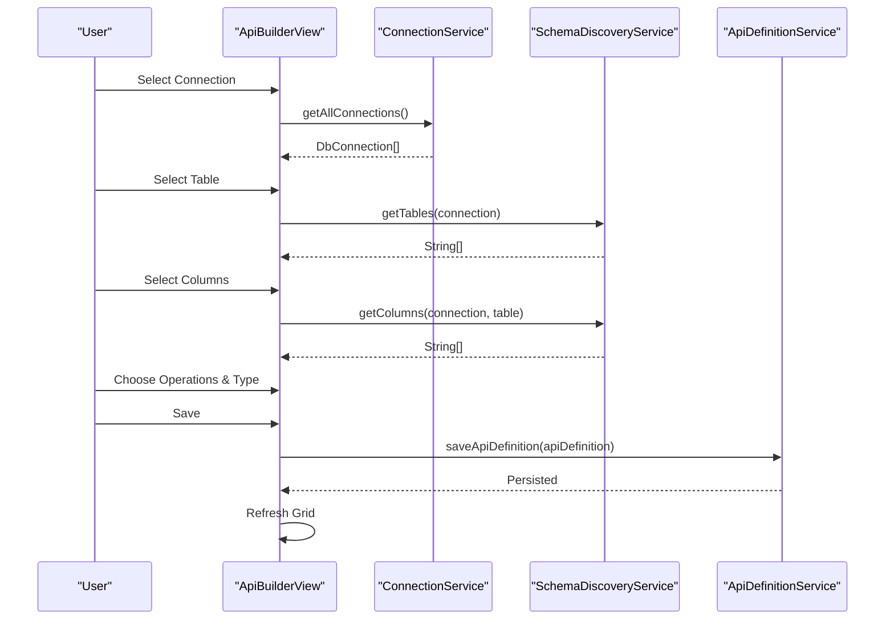
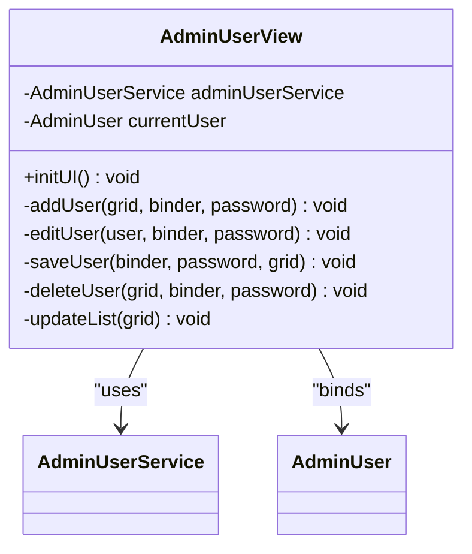
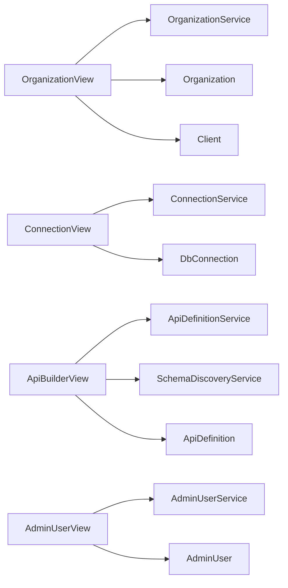

# Administrative Interface

<cite>
**Referenced Files in This Document**
- [MainLayout.java](file://src/main/java/com/db2api/ui/MainLayout.java)
- [DashboardView.java](file://src/main/java/com/db2api/ui/DashboardView.java)
- [AdminUserView.java](file://src/main/java/com/db2api/ui/admin/AdminUserView.java)
- [OrganizationView.java](file://src/main/java/com/db2api/ui/organization/OrganizationView.java)
- [ApiBuilderView.java](file://src/main/java/com/db2api/ui/api/ApiBuilderView.java)
- [ConnectionView.java](file://src/main/java/com/db2api/ui/connection/ConnectionView.java)
- [SecurityConfig.java](file://src/main/java/com/db2api/config/SecurityConfig.java)
- [AdminUser.java](file://src/main/java/com/db2api/persistent/AdminUser.java)
- [Organization.java](file://src/main/java/com/db2api/persistent/Organization.java)
- [Client.java](file://src/main/java/com/db2api/persistent/Client.java)
- [DbConnection.java](file://src/main/java/com/db2api/persistent/DbConnection.java)
- [ApiDefinition.java](file://src/main/java/com/db2api/persistent/ApiDefinition.java)
- [theme.json](file://frontend/themes/db2api/theme.json)
- [styles.css](file://frontend/themes/db2api/styles.css)
- [index.html](file://frontend/index.html)
- [application.properties](file://src/main/resources/application.properties)
</cite>

## Table of Contents
1. [Introduction](#introduction)
2. [Project Structure](#project-structure)
3. [Core Components](#core-components)
4. [Architecture Overview](#architecture-overview)
5. [Detailed Component Analysis](#detailed-component-analysis)
6. [Dependency Analysis](#dependency-analysis)
7. [Performance Considerations](#performance-considerations)
8. [Troubleshooting Guide](#troubleshooting-guide)
9. [Conclusion](#conclusion)
10. [Appendices](#appendices)

## Introduction
This document describes the administrative interface of DB2API’s Vaadin-based web application. It covers the dashboard overview, organization management, user administration, client credential management, and API builder functionality. It also documents the MainLayout component, navigation structure, role-based access control in the UI, component architecture, and practical usage examples. Theming and customization options are included for UI personalization.

## Project Structure
The administrative interface is organized around Vaadin views layered under a shared MainLayout. Views are grouped by domain:
- Dashboard overview
- Organization and client management
- Database connection management
- API definition builder
- Administrative user management (admin-only)

**Diagram sources**
- [MainLayout.java:22-75](file://src/main/java/com/db2api/ui/MainLayout.java#L22-L75)
- [DashboardView.java:13-33](file://src/main/java/com/db2api/ui/DashboardView.java#L13-L33)
- [OrganizationView.java:30-226](file://src/main/java/com/db2api/ui/organization/OrganizationView.java#L30-L226)
- [ConnectionView.java:28-204](file://src/main/java/com/db2api/ui/connection/ConnectionView.java#L28-L204)
- [ApiBuilderView.java:32-258](file://src/main/java/com/db2api/ui/api/ApiBuilderView.java#L32-L258)
- [AdminUserView.java:28-189](file://src/main/java/com/db2api/ui/admin/AdminUserView.java#L28-L189)
- [Organization.java:10-39](file://src/main/java/com/db2api/persistent/Organization.java#L10-L39)
- [Client.java:7-27](file://src/main/java/com/db2api/persistent/Client.java#L7-L27)
- [DbConnection.java:10-48](file://src/main/java/com/db2api/persistent/DbConnection.java#L10-L48)
- [ApiDefinition.java:7-33](file://src/main/java/com/db2api/persistent/ApiDefinition.java#L7-L33)
- [AdminUser.java:7-26](file://src/main/java/com/db2api/persistent/AdminUser.java#L7-L26)

**Section sources**
- [MainLayout.java:22-75](file://src/main/java/com/db2api/ui/MainLayout.java#L22-L75)
- [DashboardView.java:13-33](file://src/main/java/com/db2api/ui/DashboardView.java#L13-L33)
- [OrganizationView.java:30-226](file://src/main/java/com/db2api/ui/organization/OrganizationView.java#L30-L226)
- [ConnectionView.java:28-204](file://src/main/java/com/db2api/ui/connection/ConnectionView.java#L28-L204)
- [ApiBuilderView.java:32-258](file://src/main/java/com/db2api/ui/api/ApiBuilderView.java#L32-L258)
- [AdminUserView.java:28-189](file://src/main/java/com/db2api/ui/admin/AdminUserView.java#L28-L189)

## Core Components
- MainLayout: Central layout with a top navbar and a collapsible side navigation. Adds items conditionally based on roles.
- DashboardView: Welcome screen and overview.
- OrganizationView: Manage organizations and their client credentials; supports cascading client actions.
- ConnectionView: Manage database connections; includes connectivity testing.
- ApiBuilderView: Build API definitions from database connections and tables.
- AdminUserView: Manage administrative users and roles.

**Section sources**
- [MainLayout.java:27-75](file://src/main/java/com/db2api/ui/MainLayout.java#L27-L75)
- [DashboardView.java:19-33](file://src/main/java/com/db2api/ui/DashboardView.java#L19-L33)
- [OrganizationView.java:42-226](file://src/main/java/com/db2api/ui/organization/OrganizationView.java#L42-L226)
- [ConnectionView.java:39-204](file://src/main/java/com/db2api/ui/connection/ConnectionView.java#L39-L204)
- [ApiBuilderView.java:48-258](file://src/main/java/com/db2api/ui/api/ApiBuilderView.java#L48-L258)
- [AdminUserView.java:39-189](file://src/main/java/com/db2api/ui/admin/AdminUserView.java#L39-L189)

## Architecture Overview
The UI layer is Vaadin-based with route-annotated views. Navigation is centralized in MainLayout, which reads Spring Security authorities to show/hide items. Each view composes Vaadin components (Grid, Binder, ComboBox, CheckboxGroup, RadioButtonGroup) and interacts with domain services via injected dependencies. Domain models are JPA entities persisted to the system database.

**Diagram sources**
- [SecurityConfig.java:17-40](file://src/main/java/com/db2api/config/SecurityConfig.java#L17-L40)
- [MainLayout.java:22-75](file://src/main/java/com/db2api/ui/MainLayout.java#L22-L75)
- [DashboardView.java:13-33](file://src/main/java/com/db2api/ui/DashboardView.java#L13-L33)
- [OrganizationView.java:30-226](file://src/main/java/com/db2api/ui/organization/OrganizationView.java#L30-L226)
- [ConnectionView.java:28-204](file://src/main/java/com/db2api/ui/connection/ConnectionView.java#L28-L204)
- [ApiBuilderView.java:32-258](file://src/main/java/com/db2api/ui/api/ApiBuilderView.java#L32-L258)
- [AdminUserView.java:28-189](file://src/main/java/com/db2api/ui/admin/AdminUserView.java#L28-L189)
- [Organization.java:10-39](file://src/main/java/com/db2api/persistent/Organization.java#L10-L39)
- [Client.java:7-27](file://src/main/java/com/db2api/persistent/Client.java#L7-L27)
- [DbConnection.java:10-48](file://src/main/java/com/db2api/persistent/DbConnection.java#L10-L48)
- [ApiDefinition.java:7-33](file://src/main/java/com/db2api/persistent/ApiDefinition.java#L7-L33)
- [AdminUser.java:7-26](file://src/main/java/com/db2api/persistent/AdminUser.java#L7-L26)

## Detailed Component Analysis

### MainLayout
- Purpose: Provides the shared app shell with a top navbar and a scrollable side navigation drawer.
- Navigation items:
  - Dashboard
  - Organizations
  - Connections
  - API Builder
  - Admin Users (visible only to ADMIN)
- Role detection: Reads Spring Security authorities to decide visibility of admin-only items.

**Diagram sources**
- [MainLayout.java:27-75](file://src/main/java/com/db2api/ui/MainLayout.java#L27-L75)
- [DashboardView.java:13](file://src/main/java/com/db2api/ui/DashboardView.java#L13)
- [OrganizationView.java:30](file://src/main/java/com/db2api/ui/organization/OrganizationView.java#L30)
- [ConnectionView.java:28](file://src/main/java/com/db2api/ui/connection/ConnectionView.java#L28)
- [ApiBuilderView.java:32](file://src/main/java/com/db2api/ui/api/ApiBuilderView.java#L32)
- [AdminUserView.java:27](file://src/main/java/com/db2api/ui/admin/AdminUserView.java#L27)

**Section sources**
- [MainLayout.java:27-75](file://src/main/java/com/db2api/ui/MainLayout.java#L27-L75)

### DashboardView
- Purpose: Welcome page and high-level overview.
- Behavior: Route mapped to the root path with MainLayout as parent.

**Section sources**
- [DashboardView.java:19-33](file://src/main/java/com/db2api/ui/DashboardView.java#L19-L33)

### OrganizationView
- Purpose: Manage organizations and their associated client credentials.
- Features:
  - List organizations and edit/save/delete.
  - Client management per organization with add/delete.
  - Cascading actions: selecting an organization loads its clients.
  - Role-based visibility: VIEWER hides editing controls.
- Data model: Organization with a collection of Client entries.

**Diagram sources**
- [OrganizationView.java:72-195](file://src/main/java/com/db2api/ui/organization/OrganizationView.java#L72-L195)

**Section sources**
- [OrganizationView.java:42-226](file://src/main/java/com/db2api/ui/organization/OrganizationView.java#L42-L226)
- [Organization.java:10-39](file://src/main/java/com/db2api/persistent/Organization.java#L10-L39)
- [Client.java:7-27](file://src/main/java/com/db2api/persistent/Client.java#L7-L27)

### ConnectionView
- Purpose: Manage database connections (JDBC).
- Features:
  - CRUD for DbConnection entries.
  - Test connectivity with feedback notifications.
  - Role-based visibility: ADMIN-only editing controls.
- Data model: DbConnection entity with fields for name, URL, username, password, and driver class.

**Diagram sources**
- [ConnectionView.java:114-125](file://src/main/java/com/db2api/ui/connection/ConnectionView.java#L114-L125)

**Section sources**
- [ConnectionView.java:39-204](file://src/main/java/com/db2api/ui/connection/ConnectionView.java#L39-L204)
- [DbConnection.java:10-48](file://src/main/java/com/db2api/persistent/DbConnection.java#L10-L48)

### ApiBuilderView
- Purpose: Design dynamic APIs by selecting a database connection, table, columns, and operations; choose REST or GraphQL.
- Features:
  - Cascading selections: connection -> table -> columns.
  - Allowed operations: GET, PUT, DELETE.
  - Role-based visibility: VIEWER hides editing controls.
- Data model: ApiDefinition links to DbConnection and stores target table, API type, allowed operations, and included columns.

**Diagram sources**
- [ApiBuilderView.java:207-222](file://src/main/java/com/db2api/ui/api/ApiBuilderView.java#L207-L222)

**Section sources**
- [ApiBuilderView.java:48-258](file://src/main/java/com/db2api/ui/api/ApiBuilderView.java#L48-L258)
- [ApiDefinition.java:7-33](file://src/main/java/com/db2api/persistent/ApiDefinition.java#L7-L33)
- [DbConnection.java:10-48](file://src/main/java/com/db2api/persistent/DbConnection.java#L10-L48)

### AdminUserView
- Purpose: Manage administrative users and roles.
- Features:
  - List, add, edit, delete admin users.
  - Role assignment via combobox.
  - Uses Vaadin Binder to bind form fields to AdminUser entity.
  - Security annotation restricts access to ADMIN.
- Data model: AdminUser with username, password, and role.

**Diagram sources**
- [AdminUserView.java:39-189](file://src/main/java/com/db2api/ui/admin/AdminUserView.java#L39-L189)
- [AdminUser.java:7-26](file://src/main/java/com/db2api/persistent/AdminUser.java#L7-L26)

**Section sources**
- [AdminUserView.java:28-189](file://src/main/java/com/db2api/ui/admin/AdminUserView.java#L28-L189)
- [AdminUser.java:7-26](file://src/main/java/com/db2api/persistent/AdminUser.java#L7-L26)

## Dependency Analysis
- UI-to-service coupling:
  - OrganizationView depends on OrganizationService.
  - ConnectionView depends on ConnectionService.
  - ApiBuilderView depends on ApiDefinitionService, ConnectionService, and SchemaDiscoveryService.
  - AdminUserView depends on AdminUserService.
- UI-to-model coupling:
  - OrganizationView uses Organization and Client.
  - ConnectionView uses DbConnection.
  - ApiBuilderView uses ApiDefinition and DbConnection.
  - AdminUserView uses AdminUser.
- Security:
  - MainLayout checks authorities to render navigation items.
  - AdminUserView is annotated with @RolesAllowed("ADMIN").
  - Other views implement runtime checks for VIEWER and ADMIN.

**Diagram sources**
- [OrganizationView.java:30-226](file://src/main/java/com/db2api/ui/organization/OrganizationView.java#L30-L226)
- [ConnectionView.java:28-204](file://src/main/java/com/db2api/ui/connection/ConnectionView.java#L28-L204)
- [ApiBuilderView.java:32-258](file://src/main/java/com/db2api/ui/api/ApiBuilderView.java#L32-L258)
- [AdminUserView.java:28-189](file://src/main/java/com/db2api/ui/admin/AdminUserView.java#L28-L189)
- [Organization.java:10-39](file://src/main/java/com/db2api/persistent/Organization.java#L10-L39)
- [Client.java:7-27](file://src/main/java/com/db2api/persistent/Client.java#L7-L27)
- [DbConnection.java:10-48](file://src/main/java/com/db2api/persistent/DbConnection.java#L10-L48)
- [ApiDefinition.java:7-33](file://src/main/java/com/db2api/persistent/ApiDefinition.java#L7-L33)
- [AdminUser.java:7-26](file://src/main/java/com/db2api/persistent/AdminUser.java#L7-L26)

**Section sources**
- [MainLayout.java:36-42](file://src/main/java/com/db2api/ui/MainLayout.java#L36-L42)
- [AdminUserView.java:27](file://src/main/java/com/db2api/ui/admin/AdminUserView.java#L27)
- [OrganizationView.java:52-56](file://src/main/java/com/db2api/ui/organization/OrganizationView.java#L52-L56)
- [ConnectionView.java:50-54](file://src/main/java/com/db2api/ui/connection/ConnectionView.java#L50-L54)
- [ApiBuilderView.java:62-66](file://src/main/java/com/db2api/ui/api/ApiBuilderView.java#L62-L66)

## Performance Considerations
- Grid virtualization: Vaadin Grid renders efficiently for large datasets; keep column sets minimal and avoid heavy cell components.
- Binder validation: Use binder.validate() to prevent unnecessary service calls.
- Cascading selects: Debounce or trigger schema discovery only when selections change to reduce backend calls.
- Role checks: Keep runtime checks lightweight; cache authority checks if needed at the layout level.
- Notifications: Limit frequent notifications to avoid UI thrashing.

## Troubleshooting Guide
- Login redirection: Ensure the login view is configured to redirect to the dashboard after authentication.
- Role visibility issues:
  - ADMIN-only items appear only when the authenticated user has ROLE_ADMIN.
  - VIEWER-only items hide editing controls in OrganizationView and ApiBuilderView.
- Connection testing failures:
  - Verify JDBC URL, driver class, and credentials.
  - Confirm network access and database availability.
- API definition persistence:
  - Ensure a valid connection and table are selected before saving.
  - Confirm allowed operations and included columns are chosen appropriately.

**Section sources**
- [SecurityConfig.java:36-40](file://src/main/java/com/db2api/config/SecurityConfig.java#L36-L40)
- [MainLayout.java:36-42](file://src/main/java/com/db2api/ui/MainLayout.java#L36-L42)
- [OrganizationView.java:217-224](file://src/main/java/com/db2api/ui/organization/OrganizationView.java#L217-L224)
- [ApiBuilderView.java:250-256](file://src/main/java/com/db2api/ui/api/ApiBuilderView.java#L250-L256)
- [ConnectionView.java:114-125](file://src/main/java/com/db2api/ui/connection/ConnectionView.java#L114-L125)

## Conclusion
The administrative interface leverages Vaadin for a responsive, component-driven UI with clear separation of concerns. MainLayout centralizes navigation and role-aware visibility, while domain-specific views encapsulate CRUD and orchestration logic. Security is enforced both at the layout and view levels, ensuring appropriate access to administrative functions. The API builder streamlines dynamic API creation from database schemas, and organization/client management supports multi-tenant credential handling.

## Appendices

### Practical Examples

- Managing Organizations and Clients
  - Navigate to Organizations.
  - Create or select an organization; its clients appear in the right panel.
  - Add a client; the system persists client credentials for the selected organization.
  - Delete a client if needed.

- Managing Database Connections
  - Navigate to Connections.
  - Add a new connection with name, JDBC URL, username, password, and driver class.
  - Test the connection to validate reachability.
  - Save or delete as needed.

- Building APIs Through the Web Interface
  - Navigate to API Builder.
  - Select a database connection, then a table, then choose included columns.
  - Choose allowed operations and API type (REST or GraphQL).
  - Save the API definition.

- Administrative User Management
  - Navigate to Admin Users (requires ADMIN role).
  - Add or edit admin users and assign roles (ADMIN, EDITOR, VIEWER).
  - Delete users when necessary.

**Section sources**
- [OrganizationView.java:171-179](file://src/main/java/com/db2api/ui/organization/OrganizationView.java#L171-L179)
- [ConnectionView.java:114-125](file://src/main/java/com/db2api/ui/connection/ConnectionView.java#L114-L125)
- [ApiBuilderView.java:121-136](file://src/main/java/com/db2api/ui/api/ApiBuilderView.java#L121-L136)
- [AdminUserView.java:51-54](file://src/main/java/com/db2api/ui/admin/AdminUserView.java#L51-L54)

### UI Customization and Theming
- Theme configuration: Lumo imports are defined in the theme JSON.
- Global styles: Additional CSS can be added in the theme styles file.
- Frontend outlet: The Vaadin outlet container is defined in index HTML.

**Section sources**
- [theme.json:1-10](file://frontend/themes/db2api/theme.json#L1-L10)
- [styles.css:1-2](file://frontend/themes/db2api/styles.css#L1-L2)
- [index.html:10-22](file://frontend/index.html#L10-L22)

### Application Properties
- Server port and datasource configuration for the system database are defined in application properties.

**Section sources**
- [application.properties:4-20](file://src/main/resources/application.properties#L4-L20)