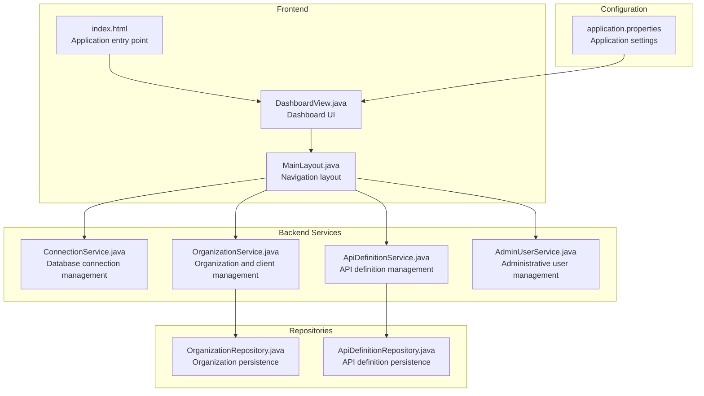
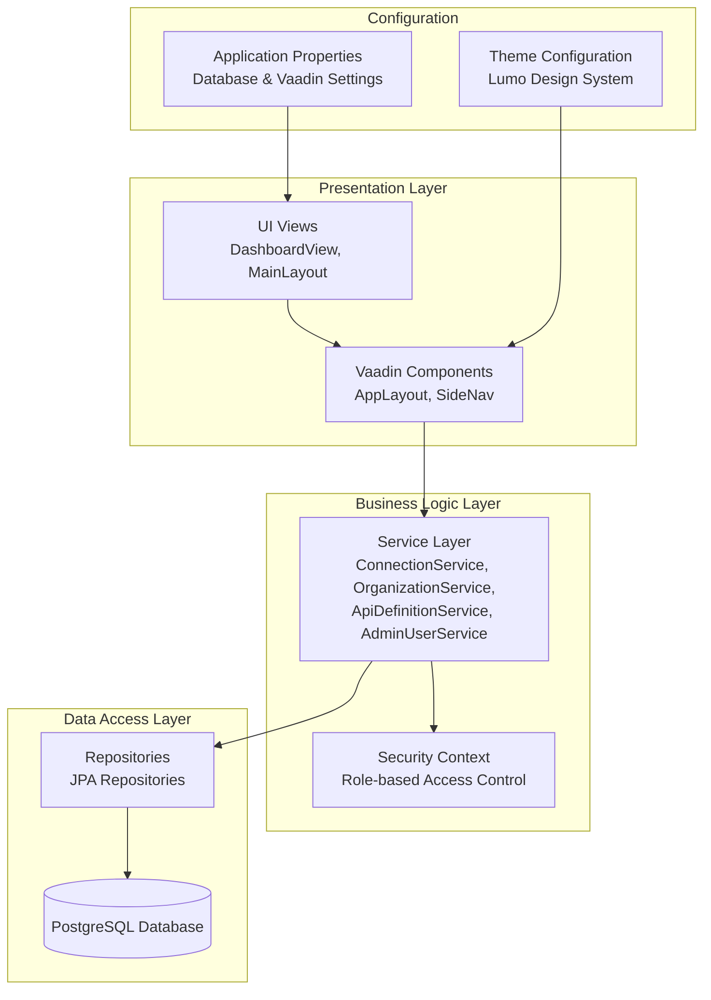
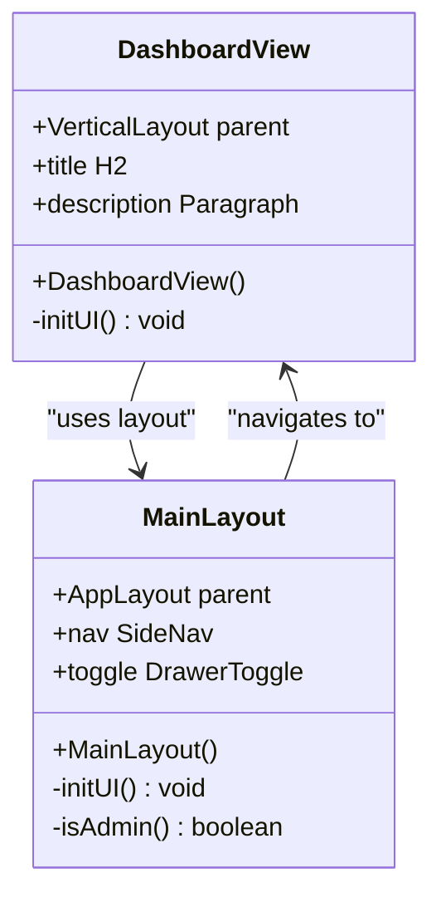
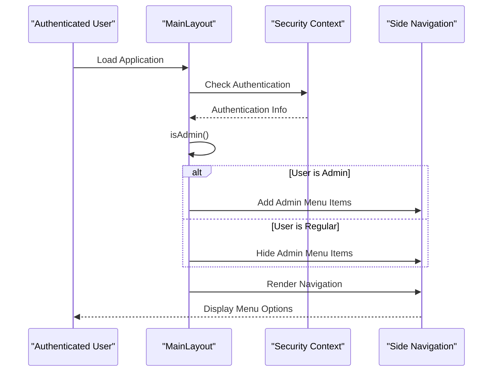
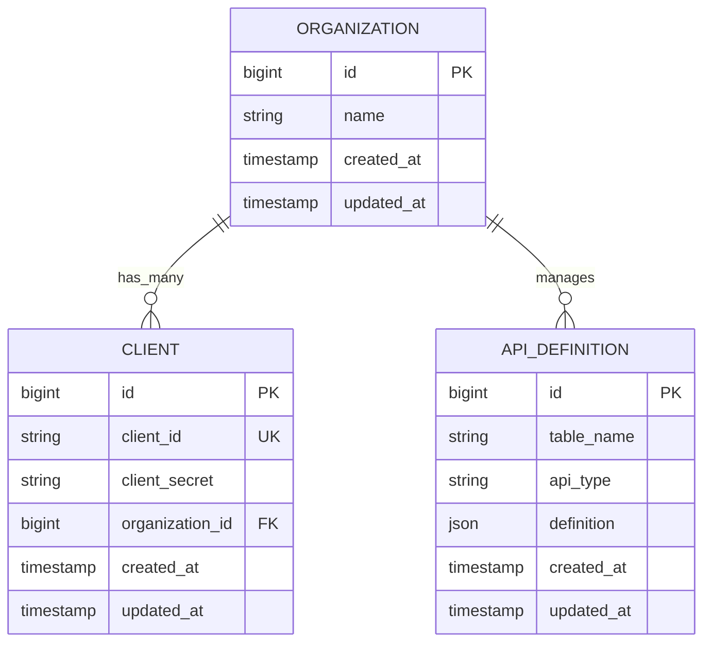
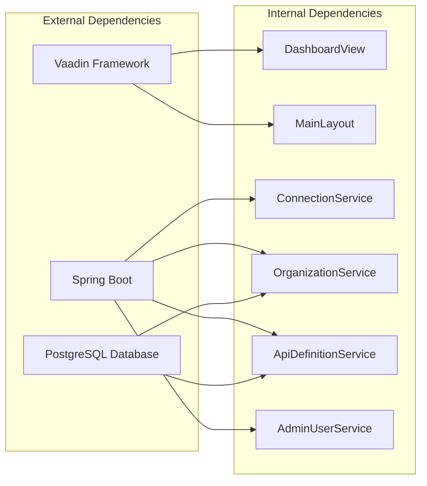

# Dashboard Overview

<cite>
**Referenced Files in This Document**
- [DashboardView.java](file://src/main/java/com/db2api/ui/DashboardView.java)
- [MainLayout.java](file://src/main/java/com/db2api/ui/MainLayout.java)
- [index.html](file://frontend/index.html)
- [application.properties](file://src/main/resources/application.properties)
- [ConnectionService.java](file://src/main/java/com/db2api/service/ConnectionService.java)
- [OrganizationService.java](file://src/main/java/com/db2api/service/organization/OrganizationService.java)
- [ApiDefinitionService.java](file://src/main/java/com/db2api/service/api/ApiDefinitionService.java)
- [AdminUserService.java](file://src/main/java/com/db2api/service/admin/AdminUserService.java)
- [OrganizationRepository.java](file://src/main/java/com/db2api/repository/organization/OrganizationRepository.java)
- [ApiDefinitionRepository.java](file://src/main/java/com/db2api/repository/api/ApiDefinitionRepository.java)
</cite>

## Table of Contents
1. [Introduction](#introduction)
2. [Project Structure](#project-structure)
3. [Core Components](#core-components)
4. [Architecture Overview](#architecture-overview)
5. [Detailed Component Analysis](#detailed-component-analysis)
6. [Dependency Analysis](#dependency-analysis)
7. [Performance Considerations](#performance-considerations)
8. [Troubleshooting Guide](#troubleshooting-guide)
9. [Conclusion](#conclusion)

## Introduction
This document provides comprehensive documentation for the DB2API dashboard overview component. The dashboard serves as the central administrative hub for managing database connections, APIs, organizations, and administrative users. It displays a welcome message and provides quick access to key functional areas through a unified navigation layout. The dashboard integrates with backend services to present system data and supports role-based navigation for administrators.

## Project Structure
The dashboard overview is implemented using a Vaadin-based frontend integrated with Spring Boot backend services. The structure follows a layered architecture with UI views, layouts, services, repositories, and persistent entities.

**Diagram sources**
- [DashboardView.java:1-34](file://src/main/java/com/db2api/ui/DashboardView.java#L1-L34)
- [MainLayout.java:1-76](file://src/main/java/com/db2api/ui/MainLayout.java#L1-L76)
- [index.html:1-24](file://frontend/index.html#L1-L24)
- [application.properties:1-20](file://src/main/resources/application.properties#L1-L20)

**Section sources**
- [DashboardView.java:1-34](file://src/main/java/com/db2api/ui/DashboardView.java#L1-L34)
- [MainLayout.java:1-76](file://src/main/java/com/db2api/ui/MainLayout.java#L1-L76)
- [index.html:1-24](file://frontend/index.html#L1-L24)
- [application.properties:1-20](file://src/main/resources/application.properties#L1-L20)

## Core Components
The dashboard overview component consists of several key elements that work together to provide a centralized administrative interface:

### Dashboard View
The DashboardView class extends VerticalLayout and serves as the primary landing page for authenticated users. It provides a welcoming interface with basic application information and acts as the entry point for administrative tasks.

### Main Layout
The MainLayout class implements the application's navigation framework using Vaadin's AppLayout. It includes:
- Top navigation bar with drawer toggle and application title
- Side navigation menu with role-based access control
- Responsive layout with scrollable navigation items

### Navigation System
The navigation system provides quick access to:
- Dashboard overview
- Organizations management
- Database connections
- API Builder
- Administrative users (admin-only)

**Section sources**
- [DashboardView.java:9-32](file://src/main/java/com/db2api/ui/DashboardView.java#L9-L32)
- [MainLayout.java:17-75](file://src/main/java/com/db2api/ui/MainLayout.java#L17-L75)

## Architecture Overview
The dashboard follows a layered architecture pattern with clear separation of concerns between presentation, business logic, and data persistence layers.

**Diagram sources**
- [DashboardView.java:1-34](file://src/main/java/com/db2api/ui/DashboardView.java#L1-L34)
- [MainLayout.java:1-76](file://src/main/java/com/db2api/ui/MainLayout.java#L1-L76)
- [ConnectionService.java:1-54](file://src/main/java/com/db2api/service/ConnectionService.java#L1-L54)
- [OrganizationService.java:1-83](file://src/main/java/com/db2api/service/organization/OrganizationService.java#L1-L83)
- [ApiDefinitionService.java:1-39](file://src/main/java/com/db2api/service/api/ApiDefinitionService.java#L1-L39)
- [AdminUserService.java:1-41](file://src/main/java/com/db2api/service/admin/AdminUserService.java#L1-L41)

## Detailed Component Analysis

### DashboardView Component
The DashboardView serves as the central hub for administrative tasks. It provides:
- Welcome messaging for authenticated users
- Basic application information
- Foundation for future metric displays

**Diagram sources**
- [DashboardView.java:14-32](file://src/main/java/com/db2api/ui/DashboardView.java#L14-L32)
- [MainLayout.java:22-75](file://src/main/java/com/db2api/ui/MainLayout.java#L22-L75)

### Navigation and Access Control
The MainLayout implements role-based navigation using Spring Security context:

**Diagram sources**
- [MainLayout.java:36-66](file://src/main/java/com/db2api/ui/MainLayout.java#L36-L66)

### Service Layer Integration
The dashboard integrates with multiple backend services for comprehensive system management:

#### Connection Management Service
Handles database connection lifecycle including:
- Connection creation and validation
- Password encryption/decryption
- Connection testing and verification

#### Organization and Client Management
Manages organizational structure with:
- Organization CRUD operations
- Client ID and secret generation
- Encryption of sensitive client credentials

#### API Definition Management
Provides API definition capabilities:
- API creation and modification
- Table-specific API type management
- Repository-based persistence

**Section sources**
- [ConnectionService.java:14-54](file://src/main/java/com/db2api/service/ConnectionService.java#L14-L54)
- [OrganizationService.java:15-83](file://src/main/java/com/db2api/service/organization/OrganizationService.java#L15-L83)
- [ApiDefinitionService.java:10-39](file://src/main/java/com/db2api/service/api/ApiDefinitionService.java#L10-L39)

### Data Persistence Layer
The repository pattern provides clean data access abstraction:

**Diagram sources**
- [OrganizationRepository.java:7-9](file://src/main/java/com/db2api/repository/organization/OrganizationRepository.java#L7-L9)
- [ApiDefinitionRepository.java:10-21](file://src/main/java/com/db2api/repository/api/ApiDefinitionRepository.java#L10-L21)

**Section sources**
- [OrganizationRepository.java:1-10](file://src/main/java/com/db2api/repository/organization/OrganizationRepository.java#L1-L10)
- [ApiDefinitionRepository.java:1-22](file://src/main/java/com/db2api/repository/api/ApiDefinitionRepository.java#L1-L22)

## Dependency Analysis
The dashboard overview component exhibits clear dependency relationships across the application layers:

**Diagram sources**
- [DashboardView.java:1-34](file://src/main/java/com/db2api/ui/DashboardView.java#L1-L34)
- [MainLayout.java:1-76](file://src/main/java/com/db2api/ui/MainLayout.java#L1-L76)
- [ConnectionService.java:1-54](file://src/main/java/com/db2api/service/ConnectionService.java#L1-L54)
- [OrganizationService.java:1-83](file://src/main/java/com/db2api/service/organization/OrganizationService.java#L1-L83)
- [ApiDefinitionService.java:1-39](file://src/main/java/com/db2api/service/api/ApiDefinitionService.java#L1-L39)
- [AdminUserService.java:1-41](file://src/main/java/com/db2api/service/admin/AdminUserService.java#L1-L41)

**Section sources**
- [DashboardView.java:1-34](file://src/main/java/com/db2api/ui/DashboardView.java#L1-L34)
- [MainLayout.java:1-76](file://src/main/java/com/db2api/ui/MainLayout.java#L1-L76)

## Performance Considerations
The current dashboard implementation focuses on simplicity and maintainability. Performance considerations include:

- **Lazy Loading**: Navigation items could benefit from lazy loading of heavy components
- **Caching Strategy**: Frequently accessed data could be cached to reduce database queries
- **Asynchronous Operations**: Long-running operations should be executed asynchronously
- **Resource Optimization**: Minimize unnecessary re-renders of dashboard components

## Troubleshooting Guide
Common issues and their resolutions:

### Navigation Issues
- **Problem**: Admin-only menu items not appearing
- **Solution**: Verify user authentication and ROLE_ADMIN authority
- **Location**: Check security context in MainLayout.isAdmin()

### Database Connectivity
- **Problem**: Connection validation failures
- **Solution**: Verify database credentials and network connectivity
- **Location**: Review ConnectionService.testConnection() implementation

### Frontend Rendering
- **Problem**: Dashboard not displaying properly
- **Solution**: Check Vaadin component initialization and CSS themes
- **Location**: Verify DashboardView.initUI() and MainLayout.initUI()

**Section sources**
- [MainLayout.java:36-42](file://src/main/java/com/db2api/ui/MainLayout.java#L36-L42)
- [ConnectionService.java:44-52](file://src/main/java/com/db2api/service/ConnectionService.java#L44-L52)
- [DashboardView.java:28-32](file://src/main/java/com/db2api/ui/DashboardView.java#L28-L32)

## Conclusion
The DB2API dashboard overview component provides a solid foundation for administrative tasks with clear navigation and role-based access control. While the current implementation focuses on basic functionality, it establishes the architectural foundation for future enhancements including real-time metrics, advanced visualizations, and customizable dashboards. The modular design allows for easy extension while maintaining separation of concerns across the application layers.