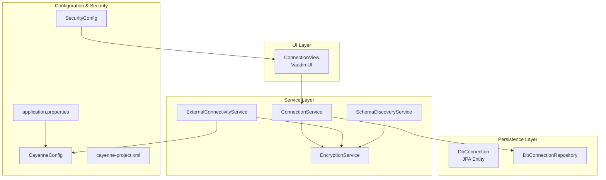
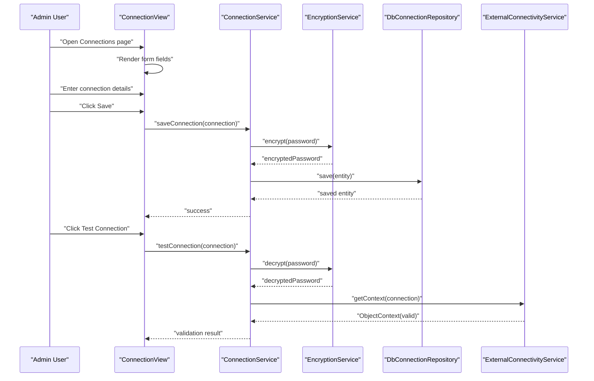
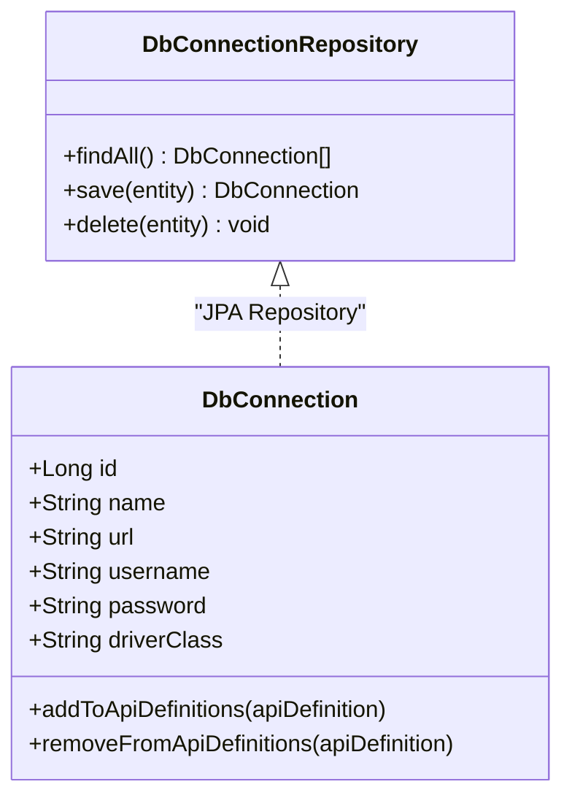
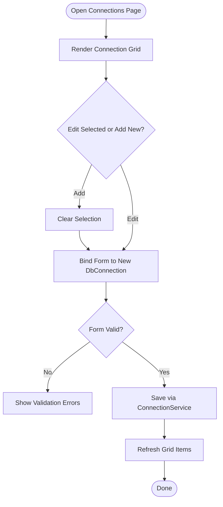
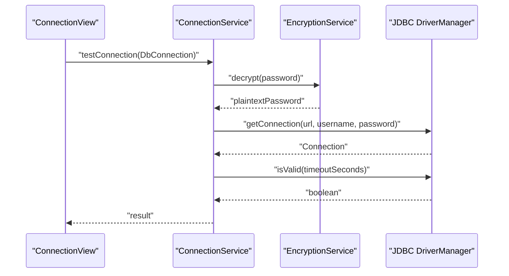
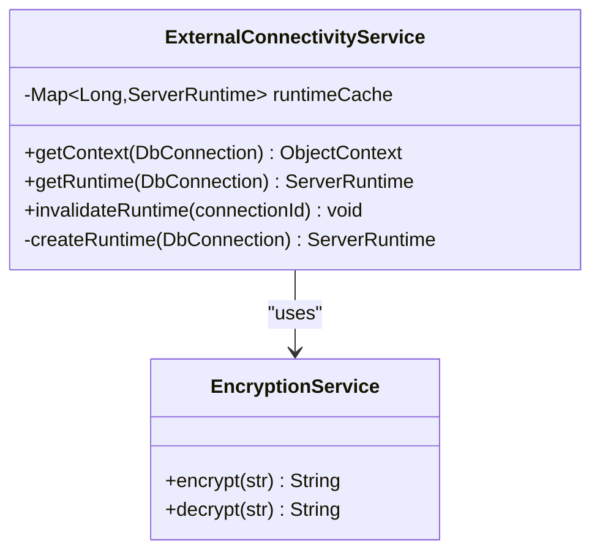
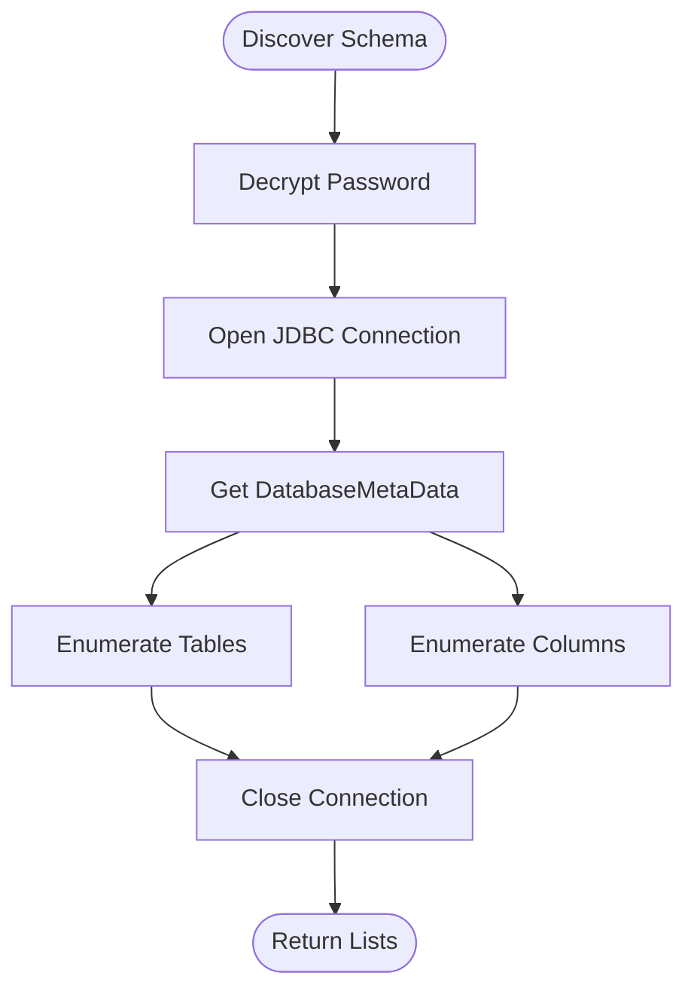
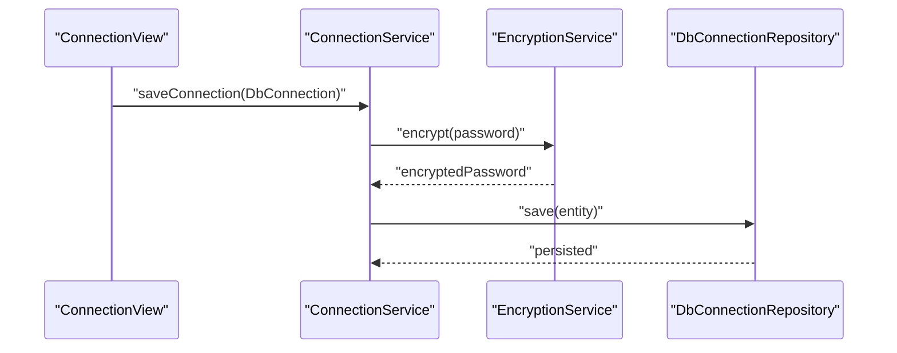
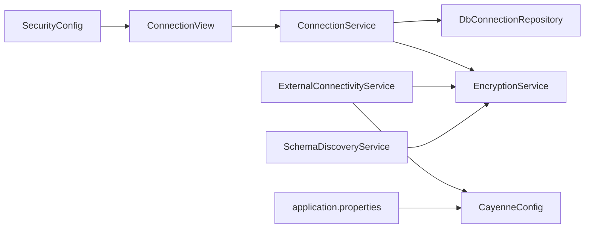

# Database Connection Management

<cite>
**Referenced Files in This Document**
- [DbConnection.java](file://src/main/java/com/db2api/persistent/connection/DbConnection.java)
- [DbConnectionRepository.java](file://src/main/java/com/db2api/repository/connection/DbConnectionRepository.java)
- [ConnectionService.java](file://src/main/java/com/db2api/service/connection/ConnectionService.java)
- [ExternalConnectivityService.java](file://src/main/java/com/db2api/service/connection/ExternalConnectivityService.java)
- [ConnectionView.java](file://src/main/java/com/db2api/ui/connection/ConnectionView.java)
- [EncryptionService.java](file://src/main/java/com/db2api/service/EncryptionService.java)
- [DynamicRestController.java](file://src/main/java/com/db2api/controller/DynamicRestController.java)
- [SchemaDiscoveryService.java](file://src/main/java/com/db2api/service/api/SchemaDiscoveryService.java)
- [application.properties](file://src/main/resources/application.properties)
- [SecurityConfig.java](file://src/main/java/com/db2api/config/SecurityConfig.java)
- [CayenneConfig.java](file://src/main/java/com/db2api/config/CayenneConfig.java)
- [schema.sql](file://src/main/resources/schema.sql)
- [cayenne-project.xml](file://src/main/resources/cayenne-project.xml)
- [datamap.map.xml](file://src/main/java/com/db2api/persistent/datamap.map.xml)
- [README.md](file://README.md)
</cite>

## Table of Contents
1. [Introduction](#introduction)
2. [Project Structure](#project-structure)
3. [Core Components](#core-components)
4. [Architecture Overview](#architecture-overview)
5. [Detailed Component Analysis](#detailed-component-analysis)
6. [Dependency Analysis](#dependency-analysis)
7. [Performance Considerations](#performance-considerations)
8. [Troubleshooting Guide](#troubleshooting-guide)
9. [Conclusion](#conclusion)
10. [Appendices](#appendices)

## Introduction
This document explains how database connections are managed through the administrative interface. It covers the connection configuration wizard, connection testing procedures, and validation processes. It documents supported database types, connection parameters, security settings, and connection pooling configuration. Practical examples demonstrate adding new database connections, configuring connection properties, testing connectivity, and troubleshooting connection issues. It also addresses connection security, encryption, and best practices for production environments.

## Project Structure
The database connection management feature spans UI, persistence, services, and configuration layers:
- UI: Connection management view with form controls and actions
- Persistence: JPA entity and repository for storing connection configurations
- Services: Business logic for saving/testing connections and building external data contexts
- Security: Encryption service and security configuration for protecting secrets
- Configuration: Application properties and Cayenne setup for runtime data sources

**Diagram sources**
- [ConnectionView.java:132-202](file://src/main/java/com/db2api/ui/connection/ConnectionView.java#L132-L202)
- [ConnectionService.java:15-57](file://src/main/java/com/db2api/service/connection/ConnectionService.java#L15-L57)
- [ExternalConnectivityService.java:15-54](file://src/main/java/com/db2api/service/connection/ExternalConnectivityService.java#L15-L54)
- [SchemaDiscoveryService.java:15-59](file://src/main/java/com/db2api/service/api/SchemaDiscoveryService.java#L15-L59)
- [EncryptionService.java:13-58](file://src/main/java/com/db2api/service/EncryptionService.java#L13-L58)
- [DbConnection.java:16-84](file://src/main/java/com/db2api/persistent/connection/DbConnection.java#L16-L84)
- [DbConnectionRepository.java:7-12](file://src/main/java/com/db2api/repository/connection/DbConnectionRepository.java#L7-L12)
- [application.properties:1-20](file://src/main/resources/application.properties#L1-L20)
- [SecurityConfig.java:28-90](file://src/main/java/com/db2api/config/SecurityConfig.java#L28-L90)
- [CayenneConfig.java:8-28](file://src/main/java/com/db2api/config/CayenneConfig.java#L8-L28)
- [cayenne-project.xml:1-5](file://src/main/resources/cayenne-project.xml#L1-L5)

**Section sources**
- [README.md:1-99](file://README.md#L1-L99)
- [application.properties:1-20](file://src/main/resources/application.properties#L1-L20)
- [schema.sql:14-21](file://src/main/resources/schema.sql#L14-L21)

## Core Components
- DbConnection entity stores connection metadata and credentials
- DbConnectionRepository provides CRUD operations
- ConnectionService manages saving, testing, and lifecycle of connections
- ExternalConnectivityService builds Cayenne ServerRuntime instances per connection
- SchemaDiscoveryService discovers tables/columns via JDBC metadata
- EncryptionService protects sensitive credentials at rest and during transport
- ConnectionView UI provides the configuration wizard and testing actions
- SecurityConfig enforces role-based access and JWT protection for dynamic endpoints
- CayenneConfig wires the primary data source into Cayenne runtime

**Section sources**
- [DbConnection.java:16-84](file://src/main/java/com/db2api/persistent/connection/DbConnection.java#L16-L84)
- [DbConnectionRepository.java:7-12](file://src/main/java/com/db2api/repository/connection/DbConnectionRepository.java#L7-L12)
- [ConnectionService.java:15-57](file://src/main/java/com/db2api/service/connection/ConnectionService.java#L15-L57)
- [ExternalConnectivityService.java:15-54](file://src/main/java/com/db2api/service/connection/ExternalConnectivityService.java#L15-L54)
- [SchemaDiscoveryService.java:15-59](file://src/main/java/com/db2api/service/api/SchemaDiscoveryService.java#L15-L59)
- [EncryptionService.java:13-58](file://src/main/java/com/db2api/service/EncryptionService.java#L13-L58)
- [ConnectionView.java:27-203](file://src/main/java/com/db2api/ui/connection/ConnectionView.java#L27-L203)
- [SecurityConfig.java:28-90](file://src/main/java/com/db2api/config/SecurityConfig.java#L28-L90)
- [CayenneConfig.java:8-28](file://src/main/java/com/db2api/config/CayenneConfig.java#L8-L28)

## Architecture Overview
The connection management architecture integrates UI, persistence, security, and external connectivity:
- UI captures connection parameters and triggers save/test actions
- ConnectionService persists encrypted credentials and validates inputs
- ExternalConnectivityService creates per-connection data sources and Cayenne runtimes
- SchemaDiscoveryService performs schema discovery using decrypted credentials
- SecurityConfig restricts administrative actions and secures dynamic endpoints

**Diagram sources**
- [ConnectionView.java:86-125](file://src/main/java/com/db2api/ui/connection/ConnectionView.java#L86-L125)
- [ConnectionService.java:30-56](file://src/main/java/com/db2api/service/connection/ConnectionService.java#L30-L56)
- [EncryptionService.java:35-57](file://src/main/java/com/db2api/service/EncryptionService.java#L35-L57)
- [DbConnectionRepository.java:10-12](file://src/main/java/com/db2api/repository/connection/DbConnectionRepository.java#L10-L12)
- [ExternalConnectivityService.java:25-31](file://src/main/java/com/db2api/service/connection/ExternalConnectivityService.java#L25-L31)

## Detailed Component Analysis

### Connection Entity and Repository
- DbConnection holds name, JDBC URL, username, encrypted password, and driver class
- Repository supports standard JPA operations for listing/saving/deleting connections
- Entity relationships link connections to API definitions

**Diagram sources**
- [DbConnection.java:16-84](file://src/main/java/com/db2api/persistent/connection/DbConnection.java#L16-L84)
- [DbConnectionRepository.java:7-12](file://src/main/java/com/db2api/repository/connection/DbConnectionRepository.java#L7-L12)

**Section sources**
- [DbConnection.java:16-84](file://src/main/java/com/db2api/persistent/connection/DbConnection.java#L16-L84)
- [DbConnectionRepository.java:7-12](file://src/main/java/com/db2api/repository/connection/DbConnectionRepository.java#L7-L12)
- [schema.sql:14-21](file://src/main/resources/schema.sql#L14-L21)

### Connection Wizard (UI)
- The ConnectionView provides a split layout with a grid and form editor
- Fields include Name, JDBC URL, Username, Password, and Driver Class
- Actions: Add Connection, Save, Delete, Cancel, and Test Connection
- Role-based visibility: only ADMIN users see edit controls

**Diagram sources**
- [ConnectionView.java:132-195](file://src/main/java/com/db2api/ui/connection/ConnectionView.java#L132-L195)

**Section sources**
- [ConnectionView.java:27-203](file://src/main/java/com/db2api/ui/connection/ConnectionView.java#L27-L203)

### Connection Testing and Validation
- ConnectionService.testConnection decrypts the stored password and attempts a JDBC connection
- Uses a 5-second timeout for isValid to validate connectivity
- UI displays success/error notifications based on test outcome

**Diagram sources**
- [ConnectionService.java:47-56](file://src/main/java/com/db2api/service/connection/ConnectionService.java#L47-L56)
- [EncryptionService.java:47-57](file://src/main/java/com/db2api/service/EncryptionService.java#L47-L57)

**Section sources**
- [ConnectionService.java:47-56](file://src/main/java/com/db2api/service/connection/ConnectionService.java#L47-L56)

### External Connectivity and Connection Pooling
- ExternalConnectivityService builds a DataSource per connection using decrypted credentials
- Creates a ServerRuntime per connection and caches them in memory
- Provides ObjectContext for Cayenne operations against external databases
- No explicit external pool configuration is present; caching acts as an internal pool per connection

**Diagram sources**
- [ExternalConnectivityService.java:15-54](file://src/main/java/com/db2api/service/connection/ExternalConnectivityService.java#L15-L54)
- [EncryptionService.java:13-58](file://src/main/java/com/db2api/service/EncryptionService.java#L13-L58)

**Section sources**
- [ExternalConnectivityService.java:15-54](file://src/main/java/com/db2api/service/connection/ExternalConnectivityService.java#L15-L54)

### Schema Discovery and Validation
- SchemaDiscoveryService lists tables and columns using JDBC DatabaseMetaData
- Uses decrypted credentials to connect and enumerate schema objects
- Supports safe column selection for dynamic API generation

**Diagram sources**
- [SchemaDiscoveryService.java:24-58](file://src/main/java/com/db2api/service/api/SchemaDiscoveryService.java#L24-L58)

**Section sources**
- [SchemaDiscoveryService.java:15-59](file://src/main/java/com/db2api/service/api/SchemaDiscoveryService.java#L15-L59)

### Security Settings and Encryption
- EncryptionService implements AES-based encryption/decryption using a derived key from a configurable secret
- ConnectionService encrypts passwords before persisting and decrypts for testing/connectivity
- SecurityConfig enforces role-based access for administrative UI actions and JWT-based protection for dynamic endpoints

**Diagram sources**
- [ConnectionService.java:30-37](file://src/main/java/com/db2api/service/connection/ConnectionService.java#L30-L37)
- [EncryptionService.java:35-44](file://src/main/java/com/db2api/service/EncryptionService.java#L35-L44)

**Section sources**
- [EncryptionService.java:13-58](file://src/main/java/com/db2api/service/EncryptionService.java#L13-L58)
- [SecurityConfig.java:28-90](file://src/main/java/com/db2api/config/SecurityConfig.java#L28-L90)

## Dependency Analysis
The following diagram shows key dependencies among connection management components:

**Diagram sources**
- [ConnectionView.java:27-43](file://src/main/java/com/db2api/ui/connection/ConnectionView.java#L27-L43)
- [ConnectionService.java:15-24](file://src/main/java/com/db2api/service/connection/ConnectionService.java#L15-L24)
- [ExternalConnectivityService.java:15-23](file://src/main/java/com/db2api/service/connection/ExternalConnectivityService.java#L15-L23)
- [SchemaDiscoveryService.java:15-22](file://src/main/java/com/db2api/service/api/SchemaDiscoveryService.java#L15-L22)
- [CayenneConfig.java:12-27](file://src/main/java/com/db2api/config/CayenneConfig.java#L12-L27)
- [application.properties:1-20](file://src/main/resources/application.properties#L1-L20)
- [SecurityConfig.java:28-63](file://src/main/java/com/db2api/config/SecurityConfig.java#L28-L63)

**Section sources**
- [ConnectionView.java:27-43](file://src/main/java/com/db2api/ui/connection/ConnectionView.java#L27-L43)
- [ConnectionService.java:15-24](file://src/main/java/com/db2api/service/connection/ConnectionService.java#L15-L24)
- [ExternalConnectivityService.java:15-23](file://src/main/java/com/db2api/service/connection/ExternalConnectivityService.java#L15-L23)
- [SchemaDiscoveryService.java:15-22](file://src/main/java/com/db2api/service/api/SchemaDiscoveryService.java#L15-L22)
- [CayenneConfig.java:12-27](file://src/main/java/com/db2api/config/CayenneConfig.java#L12-L27)
- [application.properties:1-20](file://src/main/resources/application.properties#L1-L20)
- [SecurityConfig.java:28-63](file://src/main/java/com/db2api/config/SecurityConfig.java#L28-L63)

## Performance Considerations
- Connection testing uses a short timeout to avoid blocking; adjust as needed for network latency
- ExternalConnectivityService caches ServerRuntime per connection; consider invalidation when connection parameters change
- Schema discovery opens temporary connections; cache results at the application level if frequently accessed
- For high concurrency, integrate an external connection pool (e.g., HikariCP) and replace DataSourceBuilder with a pooled DataSource bean

[No sources needed since this section provides general guidance]

## Troubleshooting Guide
Common issues and resolutions:
- Authentication failures: Verify JDBC URL, username, and decrypted password; re-test connection
- Driver class errors: Ensure the driver class matches the database vendor and is on the classpath
- Network timeouts: Increase test timeout or improve network connectivity
- Permission errors: Confirm user has privileges to access target tables/views
- Schema discovery failures: Check that the database is reachable and credentials are correct

Operational checks:
- Use the Test Connection action in the UI to validate connectivity
- Review logs for exceptions thrown during decryption or JDBC connection attempts
- Confirm that only ADMIN users can modify connections

**Section sources**
- [ConnectionService.java:47-56](file://src/main/java/com/db2api/service/connection/ConnectionService.java#L47-L56)
- [EncryptionService.java:35-57](file://src/main/java/com/db2api/service/EncryptionService.java#L35-L57)
- [ConnectionView.java:114-125](file://src/main/java/com/db2api/ui/connection/ConnectionView.java#L114-L125)

## Conclusion
The database connection management system provides a secure, role-protected interface for registering and validating external database connections. It leverages encryption for credential storage, supports schema discovery, and integrates with Cayenne for dynamic API generation. Administrators can add connections, configure parameters, test connectivity, and troubleshoot issues efficiently. For production, consider integrating a robust connection pool and hardening secrets management.

[No sources needed since this section summarizes without analyzing specific files]

## Appendices

### Supported Database Types and Connection Parameters
- Supported databases: PostgreSQL, MySQL, DB2 (extensible to other SQL databases)
- Required parameters: JDBC URL, username, password, driver class
- Optional parameters: Connection name for identification

**Section sources**
- [README.md:31-34](file://README.md#L31-L34)
- [DbConnection.java:32-57](file://src/main/java/com/db2api/persistent/connection/DbConnection.java#L32-L57)

### Adding a New Database Connection (Step-by-Step)
- Navigate to the Connections page in the admin UI
- Click Add Connection to open the editor
- Fill in Name, JDBC URL, Username, Password, and Driver Class
- Click Save to persist the encrypted credentials
- Click Test Connection to validate connectivity

**Section sources**
- [ConnectionView.java:132-195](file://src/main/java/com/db2api/ui/connection/ConnectionView.java#L132-L195)
- [ConnectionService.java:30-37](file://src/main/java/com/db2api/service/connection/ConnectionService.java#L30-L37)

### Connection Security and Best Practices
- Store only encrypted passwords; never plaintext
- Use strong secrets for encryption; rotate periodically
- Limit administrative access to trusted users with ADMIN role
- Enforce HTTPS and secure transport for API endpoints
- Regularly audit connection configurations and access logs

**Section sources**
- [EncryptionService.java:18-19](file://src/main/java/com/db2api/service/EncryptionService.java#L18-L19)
- [SecurityConfig.java:54-63](file://src/main/java/com/db2api/config/SecurityConfig.java#L54-L63)
- [ConnectionView.java:196-201](file://src/main/java/com/db2api/ui/connection/ConnectionView.java#L196-L201)

### Connection Pooling Configuration
- Current implementation caches ServerRuntime per connection
- For production, integrate a pooled DataSource (e.g., HikariCP) and configure it as a Spring bean
- Replace DataSourceBuilder with the pooled DataSource in ExternalConnectivityService

[No sources needed since this section provides general guidance]