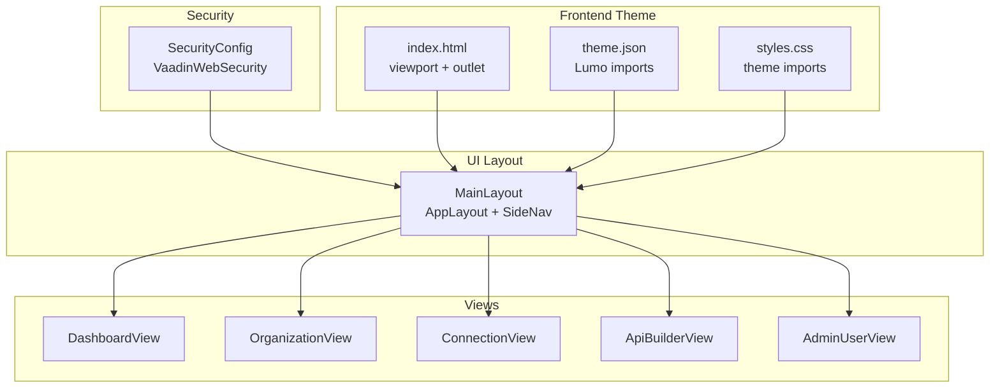
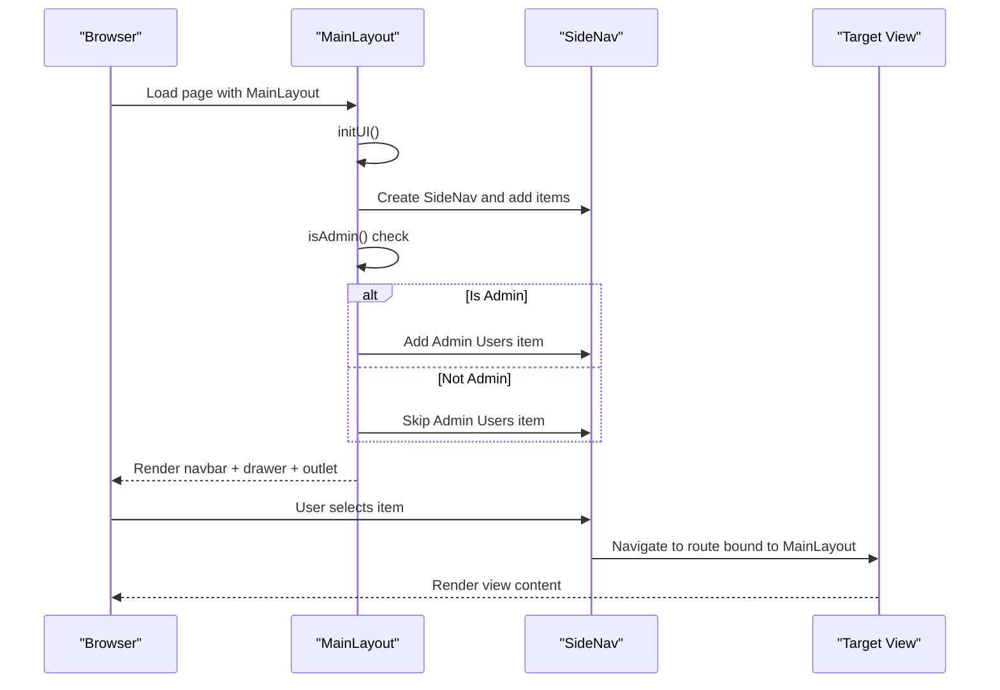
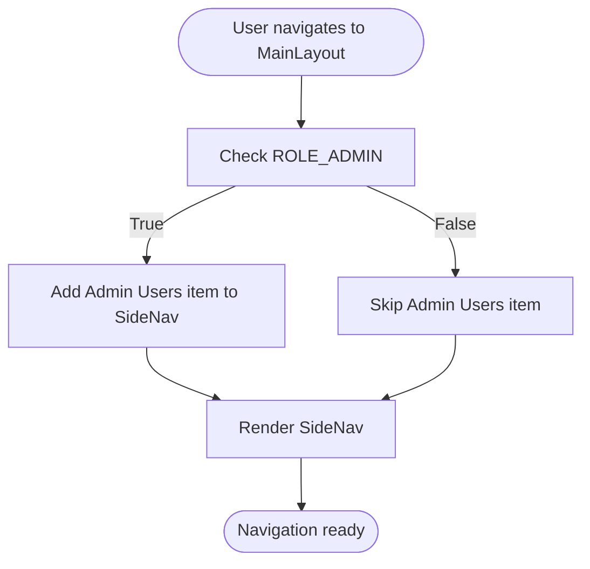
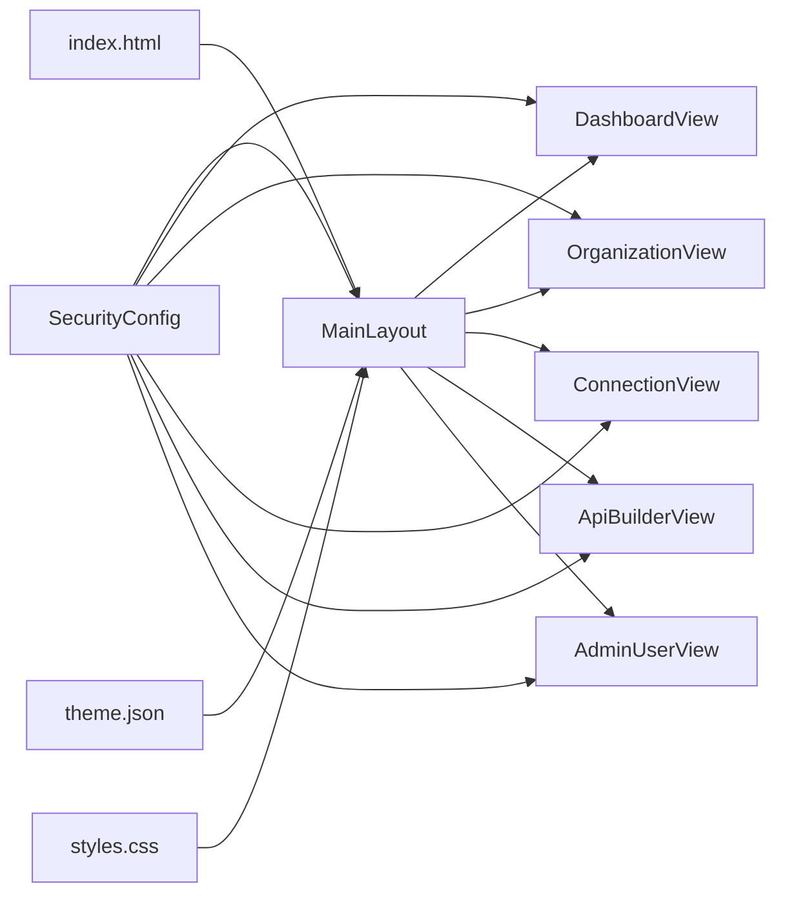

# Navigation & Layout System

<cite>
**Referenced Files in This Document**
- [MainLayout.java](file://src/main/java/com/db2api/ui/MainLayout.java)
- [DashboardView.java](file://src/main/java/com/db2api/ui/DashboardView.java)
- [OrganizationView.java](file://src/main/java/com/db2api/ui/organization/OrganizationView.java)
- [ConnectionView.java](file://src/main/java/com/db2api/ui/connection/ConnectionView.java)
- [ApiBuilderView.java](file://src/main/java/com/db2api/ui/api/ApiBuilderView.java)
- [AdminUserView.java](file://src/main/java/com/db2api/ui/admin/AdminUserView.java)
- [SecurityConfig.java](file://src/main/java/com/db2api/config/SecurityConfig.java)
- [index.html](file://frontend/index.html)
- [theme.json](file://frontend/themes/db2api/theme.json)
- [styles.css](file://frontend/themes/db2api/styles.css)
</cite>

## Table of Contents
1. [Introduction](#introduction)
2. [Project Structure](#project-structure)
3. [Core Components](#core-components)
4. [Architecture Overview](#architecture-overview)
5. [Detailed Component Analysis](#detailed-component-analysis)
6. [Dependency Analysis](#dependency-analysis)
7. [Performance Considerations](#performance-considerations)
8. [Troubleshooting Guide](#troubleshooting-guide)
9. [Conclusion](#conclusion)
10. [Appendices](#appendices)

## Introduction
This document describes the navigation and layout system built with Vaadin Flow. It focuses on the MainLayout component, role-based navigation rendering, responsive design, side navigation menu, drawer toggle functionality, and navigation item management. It also covers theme integration with Lumo, accessibility considerations, and practical examples for customization and extension.

## Project Structure
The layout system centers around a single shared layout that all views inherit from. Views are organized under dedicated packages and registered in the side navigation. The frontend theme integrates Lumo utilities and typography.

**Diagram sources**
- [MainLayout.java:22-76](file://src/main/java/com/db2api/ui/MainLayout.java#L22-L76)
- [DashboardView.java:12-14](file://src/main/java/com/db2api/ui/DashboardView.java#L12-L14)
- [OrganizationView.java:29-31](file://src/main/java/com/db2api/ui/organization/OrganizationView.java#L29-L31)
- [ConnectionView.java:27-29](file://src/main/java/com/db2api/ui/connection/ConnectionView.java#L27-L29)
- [ApiBuilderView.java:31-33](file://src/main/java/com/db2api/ui/api/ApiBuilderView.java#L31-L33)
- [AdminUserView.java:25-27](file://src/main/java/com/db2api/ui/admin/AdminUserView.java#L25-L27)
- [SecurityConfig.java:28-61](file://src/main/java/com/db2api/config/SecurityConfig.java#L28-L61)
- [index.html:9-16](file://frontend/index.html#L9-L16)
- [theme.json:1-10](file://frontend/themes/db2api/theme.json#L1-L10)
- [styles.css:1-2](file://frontend/themes/db2api/styles.css#L1-L2)

**Section sources**
- [MainLayout.java:22-76](file://src/main/java/com/db2api/ui/MainLayout.java#L22-L76)
- [DashboardView.java:12-14](file://src/main/java/com/db2api/ui/DashboardView.java#L12-L14)
- [OrganizationView.java:29-31](file://src/main/java/com/db2api/ui/organization/OrganizationView.java#L29-L31)
- [ConnectionView.java:27-29](file://src/main/java/com/db2api/ui/connection/ConnectionView.java#L27-L29)
- [ApiBuilderView.java:31-33](file://src/main/java/com/db2api/ui/api/ApiBuilderView.java#L31-L33)
- [AdminUserView.java:25-27](file://src/main/java/com/db2api/ui/admin/AdminUserView.java#L25-L27)
- [SecurityConfig.java:28-61](file://src/main/java/com/db2api/config/SecurityConfig.java#L28-L61)
- [index.html:9-16](file://frontend/index.html#L9-L16)
- [theme.json:1-10](file://frontend/themes/db2api/theme.json#L1-L10)
- [styles.css:1-2](file://frontend/themes/db2api/styles.css#L1-L2)

## Core Components
- MainLayout: Central layout using Vaadin AppLayout with a drawer toggle in the navbar and a scrollable SideNav in the drawer. It programmatically builds navigation items and conditionally adds admin-only items based on roles.
- Views: Each view is a route annotated class inheriting from MainLayout. They define their own UI composition and may apply role-based visibility controls internally.
- SecurityConfig: Extends VaadinWebSecurity to set the login view and protect dynamic API endpoints via JWT resource server configuration.
- Frontend Theme: Lumo-based theme configuration with imports for typography, color, spacing, badge, and utility. The index.html sets viewport and outlet container sizing for responsive rendering.

Key implementation references:
- MainLayout initialization and role-based navigation: [MainLayout.java:49-74](file://src/main/java/com/db2api/ui/MainLayout.java#L49-L74)
- Admin-only navigation item: [MainLayout.java:64-66](file://src/main/java/com/db2api/ui/MainLayout.java#L64-L66)
- View routing and layout binding: [DashboardView.java:12-14](file://src/main/java/com/db2api/ui/DashboardView.java#L12-L14), [OrganizationView.java:29-31](file://src/main/java/com/db2api/ui/organization/OrganizationView.java#L29-L31), [ConnectionView.java:27-29](file://src/main/java/com/db2api/ui/connection/ConnectionView.java#L27-L29), [ApiBuilderView.java:31-33](file://src/main/java/com/db2api/ui/api/ApiBuilderView.java#L31-L33), [AdminUserView.java:25-27](file://src/main/java/com/db2api/ui/admin/AdminUserView.java#L25-L27)
- Security configuration: [SecurityConfig.java:54-61](file://src/main/java/com/db2api/config/SecurityConfig.java#L54-L61)
- Theme and viewport: [theme.json:1-10](file://frontend/themes/db2api/theme.json#L1-L10), [index.html:9-16](file://frontend/index.html#L9-L16)

**Section sources**
- [MainLayout.java:22-76](file://src/main/java/com/db2api/ui/MainLayout.java#L22-L76)
- [DashboardView.java:12-14](file://src/main/java/com/db2api/ui/DashboardView.java#L12-L14)
- [OrganizationView.java:29-31](file://src/main/java/com/db2api/ui/organization/OrganizationView.java#L29-L31)
- [ConnectionView.java:27-29](file://src/main/java/com/db2api/ui/connection/ConnectionView.java#L27-L29)
- [ApiBuilderView.java:31-33](file://src/main/java/com/db2api/ui/api/ApiBuilderView.java#L31-L33)
- [AdminUserView.java:25-27](file://src/main/java/com/db2api/ui/admin/AdminUserView.java#L25-L27)
- [SecurityConfig.java:54-61](file://src/main/java/com/db2api/config/SecurityConfig.java#L54-L61)
- [index.html:9-16](file://frontend/index.html#L9-L16)
- [theme.json:1-10](file://frontend/themes/db2api/theme.json#L1-L10)

## Architecture Overview
The layout system follows a central layout pattern with route-bound views. The MainLayout composes the navbar (toggle + title) and drawer (scrollable SideNav). Views are registered as SideNav items and can be further restricted by roles either in the layout or within individual views.

**Diagram sources**
- [MainLayout.java:49-74](file://src/main/java/com/db2api/ui/MainLayout.java#L49-L74)
- [DashboardView.java:12-14](file://src/main/java/com/db2api/ui/DashboardView.java#L12-L14)
- [OrganizationView.java:29-31](file://src/main/java/com/db2api/ui/organization/OrganizationView.java#L29-L31)
- [ConnectionView.java:27-29](file://src/main/java/com/db2api/ui/connection/ConnectionView.java#L27-L29)
- [ApiBuilderView.java:31-33](file://src/main/java/com/db2api/ui/api/ApiBuilderView.java#L31-L33)
- [AdminUserView.java:25-27](file://src/main/java/com/db2api/ui/admin/AdminUserView.java#L25-L27)

## Detailed Component Analysis

### MainLayout Component
Responsibilities:
- Compose navbar with drawer toggle and title.
- Build SideNav with static items (Dashboard, Organizations, Connections, API Builder).
- Conditionally add Admin Users item based on ROLE_ADMIN.
- Wrap SideNav in a Scroller and add to the drawer area.
- Apply Lumo padding utility to the drawer content.

Implementation highlights:
- Drawer toggle and title assembly: [MainLayout.java:50-55](file://src/main/java/com/db2api/ui/MainLayout.java#L50-L55)
- Static navigation items: [MainLayout.java:57-61](file://src/main/java/com/db2api/ui/MainLayout.java#L57-L61)
- Role-based item addition: [MainLayout.java:63-66](file://src/main/java/com/db2api/ui/MainLayout.java#L63-L66)
- Drawer assembly with padding utility: [MainLayout.java:69-71](file://src/main/java/com/db2api/ui/MainLayout.java#L69-L71)
- Navbar and drawer registration: [MainLayout.java:72-73](file://src/main/java/com/db2api/ui/MainLayout.java#L72-L73)

Accessibility and responsiveness:
- DrawerToggle provides keyboard-accessible toggle behavior.
- Lumo padding utility improves readability and spacing within the drawer.
- index.html viewport ensures mobile-friendly scaling.

**Section sources**
- [MainLayout.java:22-76](file://src/main/java/com/db2api/ui/MainLayout.java#L22-L76)
- [index.html:9-16](file://frontend/index.html#L9-L16)
- [theme.json:1-10](file://frontend/themes/db2api/theme.json#L1-L10)

### Role-Based Navigation Rendering
Two complementary mechanisms exist:
- Layout-level: MainLayout checks for ROLE_ADMIN and conditionally adds the Admin Users item.
- View-level: Individual views check roles and adjust UI controls (visibility of actions/forms).

Examples:
- Layout-level admin item: [MainLayout.java:64-66](file://src/main/java/com/db2api/ui/MainLayout.java#L64-L66)
- View-level viewer restriction (OrganizationView): [OrganizationView.java:217-223](file://src/main/java/com/db2api/ui/organization/OrganizationView.java#L217-L223)
- View-level admin restriction (ConnectionView): [ConnectionView.java:197-202](file://src/main/java/com/db2api/ui/connection/ConnectionView.java#L197-L202)
- Annotation-based admin requirement (AdminUserView): [AdminUserView.java](file://src/main/java/com/db2api/ui/admin/AdminUserView.java#L27)

**Diagram sources**
- [MainLayout.java:36-42](file://src/main/java/com/db2api/ui/MainLayout.java#L36-L42)
- [MainLayout.java:64-66](file://src/main/java/com/db2api/ui/MainLayout.java#L64-L66)

**Section sources**
- [MainLayout.java:36-42](file://src/main/java/com/db2api/ui/MainLayout.java#L36-L42)
- [OrganizationView.java:217-223](file://src/main/java/com/db2api/ui/organization/OrganizationView.java#L217-L223)
- [ConnectionView.java:197-202](file://src/main/java/com/db2api/ui/connection/ConnectionView.java#L197-L202)
- [AdminUserView.java](file://src/main/java/com/db2api/ui/admin/AdminUserView.java#L27)

### Responsive Design Implementation
Responsive behavior relies on:
- index.html viewport meta tag for device-width scaling.
- Full-height outlet container to fill the browser viewport.
- Lumo utilities applied in MainLayout for consistent spacing.
- SideNav inside a Scroller to enable scrolling on small screens.

References:
- Viewport and outlet sizing: [index.html:9-16](file://frontend/index.html#L9-L16)
- Drawer padding utility: [MainLayout.java](file://src/main/java/com/db2api/ui/MainLayout.java#L70)

**Section sources**
- [index.html:9-16](file://frontend/index.html#L9-L16)
- [MainLayout.java](file://src/main/java/com/db2api/ui/MainLayout.java#L70)

### Side Navigation Menu and Drawer Toggle
- DrawerToggle toggles the drawer open/closed state.
- SideNav holds navigation items; each item binds to a route class.
- Scroller wraps SideNav to support overflow on smaller screens.

References:
- Drawer toggle and title: [MainLayout.java:51-54](file://src/main/java/com/db2api/ui/MainLayout.java#L51-L54)
- SideNav construction and items: [MainLayout.java:57-61](file://src/main/java/com/db2api/ui/MainLayout.java#L57-L61)
- Drawer assembly: [MainLayout.java:69-73](file://src/main/java/com/db2api/ui/MainLayout.java#L69-L73)

**Section sources**
- [MainLayout.java:50-74](file://src/main/java/com/db2api/ui/MainLayout.java#L50-L74)

### Navigation Item Management
- Static items are defined in MainLayout.initUI().
- Admin-only item is added conditionally based on role.
- Views are route-annotated and automatically discoverable by SideNav when constructed with view classes.

References:
- Static items: [MainLayout.java:58-61](file://src/main/java/com/db2api/ui/MainLayout.java#L58-L61)
- Conditional item: [MainLayout.java:64-66](file://src/main/java/com/db2api/ui/MainLayout.java#L64-L66)
- Route bindings: [DashboardView.java:12-14](file://src/main/java/com/db2api/ui/DashboardView.java#L12-L14), [OrganizationView.java:29-31](file://src/main/java/com/db2api/ui/organization/OrganizationView.java#L29-L31), [ConnectionView.java:27-29](file://src/main/java/com/db2api/ui/connection/ConnectionView.java#L27-L29), [ApiBuilderView.java:31-33](file://src/main/java/com/db2api/ui/api/ApiBuilderView.java#L31-L33), [AdminUserView.java:25-27](file://src/main/java/com/db2api/ui/admin/AdminUserView.java#L25-L27)

**Section sources**
- [MainLayout.java:57-66](file://src/main/java/com/db2api/ui/MainLayout.java#L57-L66)
- [DashboardView.java:12-14](file://src/main/java/com/db2api/ui/DashboardView.java#L12-L14)
- [OrganizationView.java:29-31](file://src/main/java/com/db2api/ui/organization/OrganizationView.java#L29-L31)
- [ConnectionView.java:27-29](file://src/main/java/com/db2api/ui/connection/ConnectionView.java#L27-L29)
- [ApiBuilderView.java:31-33](file://src/main/java/com/db2api/ui/api/ApiBuilderView.java#L31-L33)
- [AdminUserView.java:25-27](file://src/main/java/com/db2api/ui/admin/AdminUserView.java#L25-L27)

### Practical Examples

#### Customizing Navigation Items
- Add a new item: Instantiate a SideNavItem with a label, target view class, and icon; add it to SideNav in MainLayout.initUI().
- Remove an existing item: Comment out or remove the corresponding addItem call.
- Change order: Reorder addItem invocations in initUI.

Reference:
- [MainLayout.java:57-61](file://src/main/java/com/db2api/ui/MainLayout.java#L57-L61)

#### Implementing Role-Based Access Control in UI
- Layout-level: Use isAdmin() to decide whether to render admin-only items.
- View-level: Check roles and hide or disable controls. Examples:
  - OrganizationView hides editing controls for VIEWER: [OrganizationView.java:217-223](file://src/main/java/com/db2api/ui/organization/OrganizationView.java#L217-L223)
  - ConnectionView hides editing controls for non-ADMIN: [ConnectionView.java:197-202](file://src/main/java/com/db2api/ui/connection/ConnectionView.java#L197-L202)
  - AdminUserView restricts access via @RolesAllowed("ADMIN"): [AdminUserView.java](file://src/main/java/com/db2api/ui/admin/AdminUserView.java#L27)

Reference:
- [MainLayout.java:36-42](file://src/main/java/com/db2api/ui/MainLayout.java#L36-L42)

#### Extending the Layout System
- Create a new view class annotated with @Route and layout = MainLayout.class.
- Optionally add a corresponding SideNavItem in MainLayout.initUI().
- Apply Lumo variants and utilities for consistent styling across components.

References:
- New view route binding: [DashboardView.java:12-14](file://src/main/java/com/db2api/ui/DashboardView.java#L12-L14)
- SideNav item creation: [MainLayout.java:57-61](file://src/main/java/com/db2api/ui/MainLayout.java#L57-L61)

**Section sources**
- [MainLayout.java:36-42](file://src/main/java/com/db2api/ui/MainLayout.java#L36-L42)
- [MainLayout.java:57-61](file://src/main/java/com/db2api/ui/MainLayout.java#L57-L61)
- [OrganizationView.java:217-223](file://src/main/java/com/db2api/ui/organization/OrganizationView.java#L217-L223)
- [ConnectionView.java:197-202](file://src/main/java/com/db2api/ui/connection/ConnectionView.java#L197-L202)
- [AdminUserView.java](file://src/main/java/com/db2api/ui/admin/AdminUserView.java#L27)
- [DashboardView.java:12-14](file://src/main/java/com/db2api/ui/DashboardView.java#L12-L14)

### Theme Integration and Lumo Design System
- Lumo imports are configured in theme.json to enable typography, color, spacing, badge, and utility tokens.
- MainLayout applies LumoUtility padding to the drawer content.
- Views leverage Lumo button variants and notification variants for consistent UX.

References:
- Lumo imports: [theme.json:1-10](file://frontend/themes/db2api/theme.json#L1-L10)
- Drawer padding utility: [MainLayout.java](file://src/main/java/com/db2api/ui/MainLayout.java#L70)
- Lumo button variants: [OrganizationView.java:160-163](file://src/main/java/com/db2api/ui/organization/OrganizationView.java#L160-L163), [ConnectionView.java:165-168](file://src/main/java/com/db2api/ui/connection/ConnectionView.java#L165-L168), [ApiBuilderView.java:190-197](file://src/main/java/com/db2api/ui/api/ApiBuilderView.java#L190-L197)
- Lumo notification variants: [ConnectionView.java:120-125](file://src/main/java/com/db2api/ui/connection/ConnectionView.java#L120-L125)

**Section sources**
- [theme.json:1-10](file://frontend/themes/db2api/theme.json#L1-L10)
- [MainLayout.java](file://src/main/java/com/db2api/ui/MainLayout.java#L70)
- [OrganizationView.java:160-163](file://src/main/java/com/db2api/ui/organization/OrganizationView.java#L160-L163)
- [ConnectionView.java:120-125](file://src/main/java/com/db2api/ui/connection/ConnectionView.java#L120-L125)
- [ApiBuilderView.java:190-197](file://src/main/java/com/db2api/ui/api/ApiBuilderView.java#L190-L197)

### Accessibility Considerations
- DrawerToggle provides keyboard-accessible toggle behavior for the drawer.
- SideNav items are standard Vaadin components that integrate with screen readers.
- Ensure icons have appropriate contrast and consider aria-labels for icon-only items if needed.
- Maintain focus order and visible focus indicators through Lumo defaults.

References:
- DrawerToggle usage: [MainLayout.java](file://src/main/java/com/db2api/ui/MainLayout.java#L51)
- SideNav usage: [MainLayout.java](file://src/main/java/com/db2api/ui/MainLayout.java#L57)

**Section sources**
- [MainLayout.java:51-57](file://src/main/java/com/db2api/ui/MainLayout.java#L51-L57)

## Dependency Analysis
The layout system exhibits clear separation of concerns:
- MainLayout depends on view classes for SideNav items.
- Views depend on MainLayout for shared layout.
- SecurityConfig influences navigation indirectly by protecting routes and setting the login view.
- Frontend theme files influence visual consistency and spacing.

**Diagram sources**
- [MainLayout.java:57-61](file://src/main/java/com/db2api/ui/MainLayout.java#L57-L61)
- [DashboardView.java:12-14](file://src/main/java/com/db2api/ui/DashboardView.java#L12-L14)
- [OrganizationView.java:29-31](file://src/main/java/com/db2api/ui/organization/OrganizationView.java#L29-L31)
- [ConnectionView.java:27-29](file://src/main/java/com/db2api/ui/connection/ConnectionView.java#L27-L29)
- [ApiBuilderView.java:31-33](file://src/main/java/com/db2api/ui/api/ApiBuilderView.java#L31-L33)
- [AdminUserView.java:25-27](file://src/main/java/com/db2api/ui/admin/AdminUserView.java#L25-L27)
- [SecurityConfig.java:54-61](file://src/main/java/com/db2api/config/SecurityConfig.java#L54-L61)
- [index.html:9-16](file://frontend/index.html#L9-L16)
- [theme.json:1-10](file://frontend/themes/db2api/theme.json#L1-L10)
- [styles.css:1-2](file://frontend/themes/db2api/styles.css#L1-L2)

**Section sources**
- [MainLayout.java:57-61](file://src/main/java/com/db2api/ui/MainLayout.java#L57-L61)
- [SecurityConfig.java:54-61](file://src/main/java/com/db2api/config/SecurityConfig.java#L54-L61)
- [index.html:9-16](file://frontend/index.html#L9-L16)
- [theme.json:1-10](file://frontend/themes/db2api/theme.json#L1-L10)
- [styles.css:1-2](file://frontend/themes/db2api/styles.css#L1-L2)

## Performance Considerations
- Keep SideNav lightweight by avoiding heavy initialization in MainLayout; defer view-specific logic to individual views.
- Use Lumo utilities judiciously to minimize custom CSS overhead.
- Ensure responsive viewport settings prevent unnecessary reflows on mobile devices.
- Consider lazy-loading view content to improve initial render performance.

## Troubleshooting Guide
Common issues and resolutions:
- Admin-only item missing: Verify isAdmin() returns true for admin users and that the conditional block executes. Reference: [MainLayout.java:64-66](file://src/main/java/com/db2api/ui/MainLayout.java#L64-L66)
- View not appearing in navigation: Confirm the view is annotated with @Route and layout = MainLayout.class. Reference: [DashboardView.java:12-14](file://src/main/java/com/db2api/ui/DashboardView.java#L12-L14)
- Role-based UI controls not hiding: Ensure role checks are performed and visibility is adjusted accordingly. References: [OrganizationView.java:217-223](file://src/main/java/com/db2api/ui/organization/OrganizationView.java#L217-L223), [ConnectionView.java:197-202](file://src/main/java/com/db2api/ui/connection/ConnectionView.java#L197-L202)
- Security exceptions on protected routes: Confirm SecurityConfig is properly configured and login view is set. Reference: [SecurityConfig.java:54-61](file://src/main/java/com/db2api/config/SecurityConfig.java#L54-L61)
- Layout not responsive: Check viewport meta tag and outlet sizing. References: [index.html:9-16](file://frontend/index.html#L9-L16)

**Section sources**
- [MainLayout.java:64-66](file://src/main/java/com/db2api/ui/MainLayout.java#L64-L66)
- [DashboardView.java:12-14](file://src/main/java/com/db2api/ui/DashboardView.java#L12-L14)
- [OrganizationView.java:217-223](file://src/main/java/com/db2api/ui/organization/OrganizationView.java#L217-L223)
- [ConnectionView.java:197-202](file://src/main/java/com/db2api/ui/connection/ConnectionView.java#L197-L202)
- [SecurityConfig.java:54-61](file://src/main/java/com/db2api/config/SecurityConfig.java#L54-L61)
- [index.html:9-16](file://frontend/index.html#L9-L16)

## Conclusion
The navigation and layout system leverages Vaadin’s AppLayout and SideNav to deliver a consistent, role-aware UI. MainLayout centralizes navigation while allowing per-view customization. Lumo integration ensures visual coherence, and responsive viewport settings support cross-device usability. Role-based rendering occurs both at the layout level and within views, providing flexible access control. The architecture supports straightforward extension and maintenance.

## Appendices

### Appendix A: Theme and Utilities
- Lumo imports configuration: [theme.json:1-10](file://frontend/themes/db2api/theme.json#L1-L10)
- Theme import reference: [styles.css:1-2](file://frontend/themes/db2api/styles.css#L1-L2)
- Drawer padding utility usage: [MainLayout.java](file://src/main/java/com/db2api/ui/MainLayout.java#L70)

**Section sources**
- [theme.json:1-10](file://frontend/themes/db2api/theme.json#L1-L10)
- [styles.css:1-2](file://frontend/themes/db2api/styles.css#L1-L2)
- [MainLayout.java](file://src/main/java/com/db2api/ui/MainLayout.java#L70)