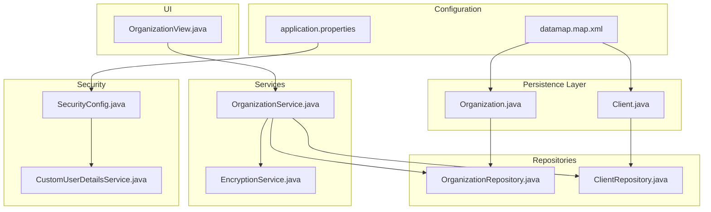
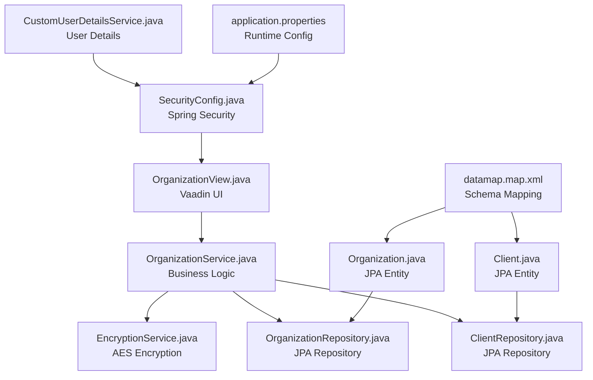
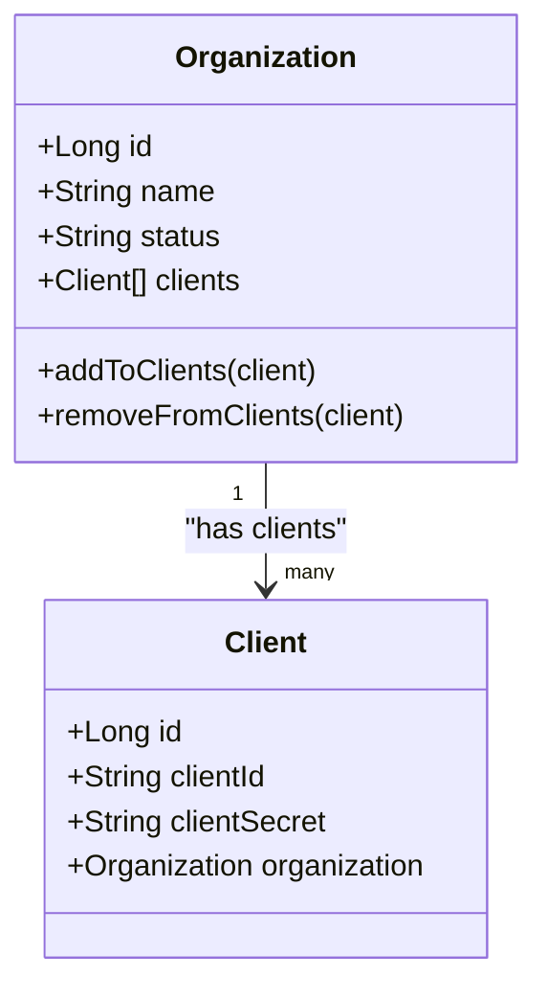
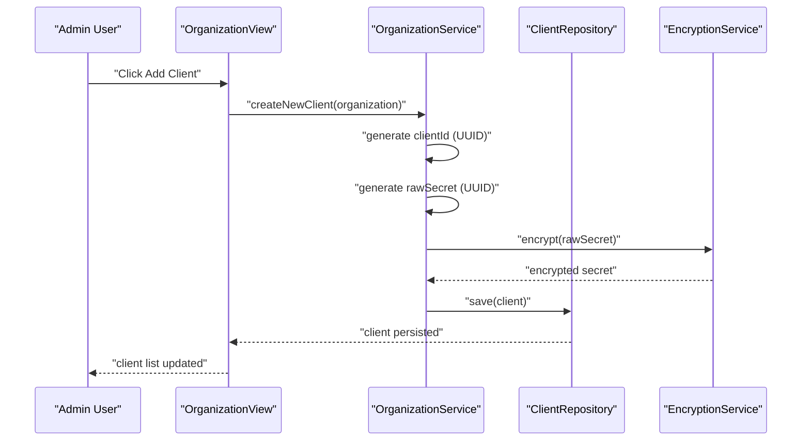
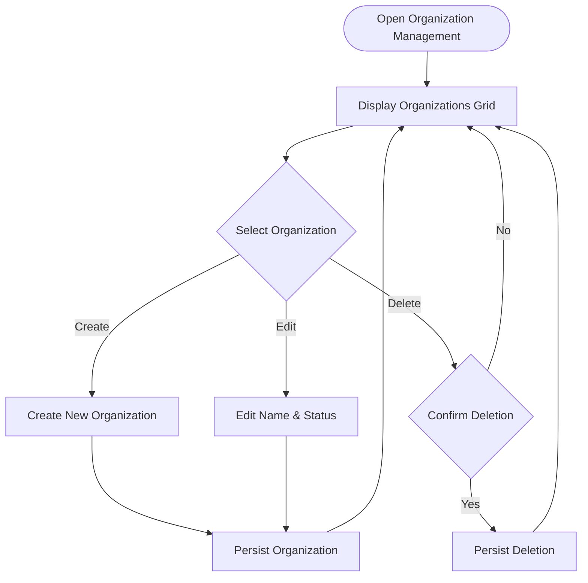
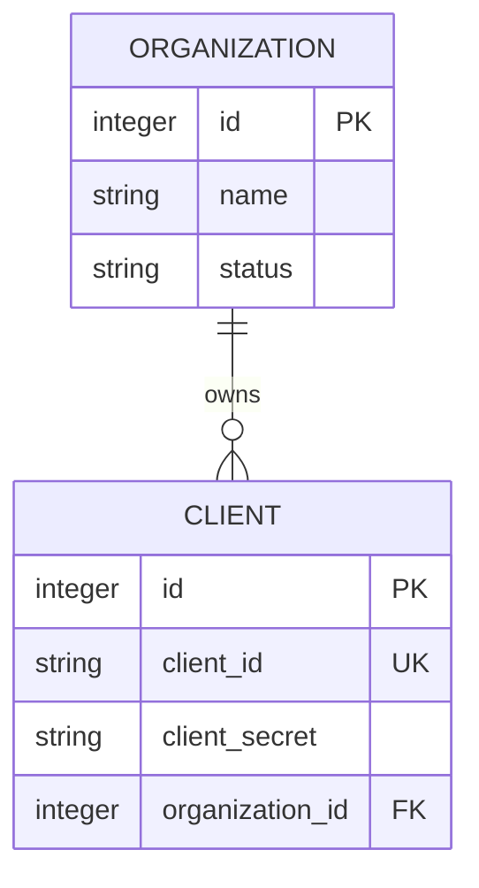
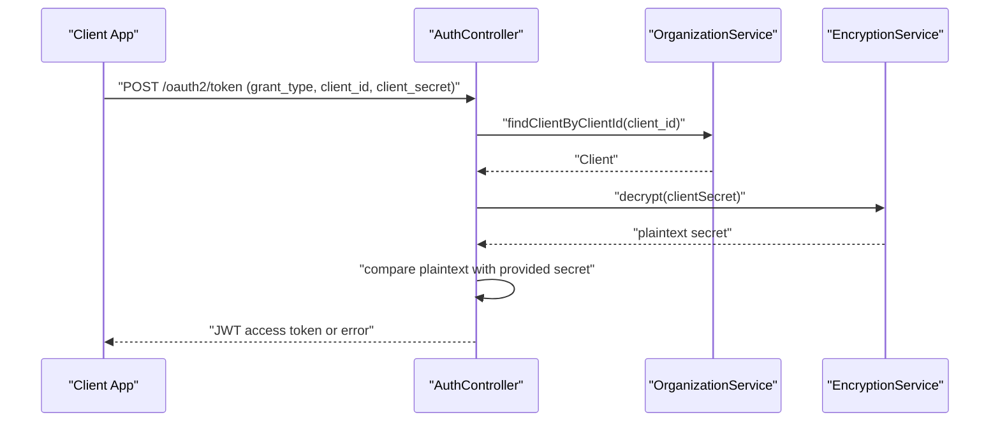
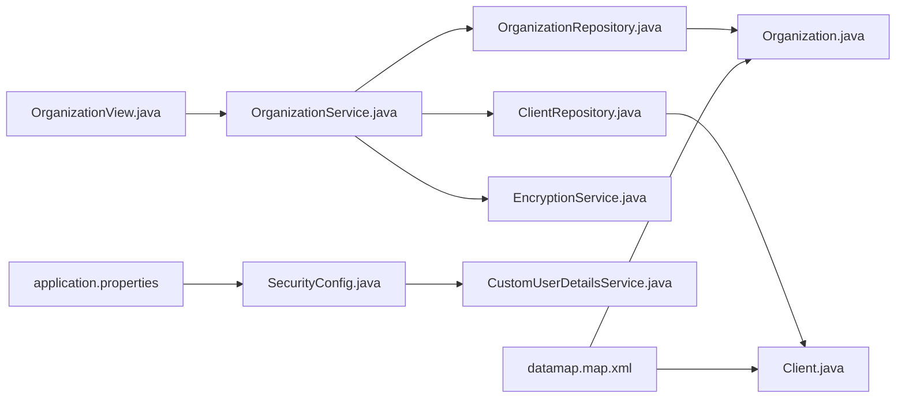

# Organization Management

<cite>
**Referenced Files in This Document**
- [Organization.java](file://src/main/java/com/db2api/persistent/organization/Organization.java)
- [Client.java](file://src/main/java/com/db2api/persistent/organization/Client.java)
- [OrganizationRepository.java](file://src/main/java/com/db2api/repository/organization/OrganizationRepository.java)
- [ClientRepository.java](file://src/main/java/com/db2api/repository/organization/ClientRepository.java)
- [OrganizationService.java](file://src/main/java/com/db2api/service/organization/OrganizationService.java)
- [OrganizationView.java](file://src/main/java/com/db2api/ui/organization/OrganizationView.java)
- [AuthController.java](file://src/main/java/com/db2api/controller/AuthController.java)
- [SecurityConfig.java](file://src/main/java/com/db2api/config/SecurityConfig.java)
- [CustomUserDetailsService.java](file://src/main/java/com/db2api/security/CustomUserDetailsService.java)
- [EncryptionService.java](file://src/main/java/com/db2api/service/EncryptionService.java)
- [application.properties](file://src/main/resources/application.properties)
- [datamap.map.xml](file://src/main/resources/datamap.map.xml)
- [AdminUser.java](file://src/main/java/com/db2api/persistent/admin/AdminUser.java)
- [AdminUserView.java](file://src/main/java/com/db2api/ui/admin/AdminUserView.java)
- [AdminUserService.java](file://src/main/java/com/db2api/service/admin/AdminUserService.java)
- [AdminUserRepository.java](file://src/main/java/com/db2api/repository/admin/AdminUserRepository.java)
</cite>

## Table of Contents
1. [Introduction](#introduction)
2. [Project Structure](#project-structure)
3. [Core Components](#core-components)
4. [Architecture Overview](#architecture-overview)
5. [Detailed Component Analysis](#detailed-component-analysis)
6. [Dependency Analysis](#dependency-analysis)
7. [Performance Considerations](#performance-considerations)
8. [Troubleshooting Guide](#troubleshooting-guide)
9. [Conclusion](#conclusion)

## Introduction
This document explains the organization management functionality in DB2API's administrative interface. It covers how organizations are created, modified, and deleted; how the organization hierarchy works; how client credentials are managed; and how multi-tenancy and data segregation are achieved. Practical examples demonstrate setting up organizations, managing client credentials, configuring organization-specific settings, and handling lifecycle operations. The document also addresses permissions, access control, and data isolation mechanisms.

## Project Structure
The organization management feature spans persistence, repositories, services, UI, and security layers:
- Persistence: Entities define the organization and client models with relationships.
- Repositories: Data access for organizations and clients.
- Services: Business logic for organization and client operations, including credential generation and encryption.
- UI: Administrative view for creating, editing, and deleting organizations and managing client credentials.
- Security: Role-based access control and authentication for administrative operations.
- Configuration: Application properties and Cayenne mapping define runtime behavior and database schema.

**Diagram sources**
- [Organization.java:14-64](file://src/main/java/com/db2api/persistent/organization/Organization.java#L14-L64)
- [Client.java:11-42](file://src/main/java/com/db2api/persistent/organization/Client.java#L11-L42)
- [OrganizationRepository.java:7-9](file://src/main/java/com/db2api/repository/organization/OrganizationRepository.java#L7-L9)
- [ClientRepository.java:9-13](file://src/main/java/com/db2api/repository/organization/ClientRepository.java#L9-L13)
- [OrganizationService.java:15-82](file://src/main/java/com/db2api/service/organization/OrganizationService.java#L15-L82)
- [EncryptionService.java:13-58](file://src/main/java/com/db2api/service/EncryptionService.java#L13-L58)
- [OrganizationView.java:29-225](file://src/main/java/com/db2api/ui/organization/OrganizationView.java#L29-L225)
- [SecurityConfig.java:15-51](file://src/main/java/com/db2api/config/SecurityConfig.java#L15-L51)
- [CustomUserDetailsService.java:12-31](file://src/main/java/com/db2api/security/CustomUserDetailsService.java#L12-L31)
- [application.properties:1-20](file://src/main/resources/application.properties#L1-L20)
- [datamap.map.xml:21-82](file://src/main/resources/datamap.map.xml#L21-L82)

**Section sources**
- [Organization.java:14-64](file://src/main/java/com/db2api/persistent/organization/Organization.java#L14-L64)
- [Client.java:11-42](file://src/main/java/com/db2api/persistent/organization/Client.java#L11-L42)
- [OrganizationRepository.java:7-9](file://src/main/java/com/db2api/repository/organization/OrganizationRepository.java#L7-L9)
- [ClientRepository.java:9-13](file://src/main/java/com/db2api/repository/organization/ClientRepository.java#L9-L13)
- [OrganizationService.java:15-82](file://src/main/java/com/db2api/service/organization/OrganizationService.java#L15-L82)
- [OrganizationView.java:29-225](file://src/main/java/com/db2api/ui/organization/OrganizationView.java#L29-L225)
- [SecurityConfig.java:15-51](file://src/main/java/com/db2api/config/SecurityConfig.java#L15-L51)
- [CustomUserDetailsService.java:12-31](file://src/main/java/com/db2api/security/CustomUserDetailsService.java#L12-L31)
- [application.properties:1-20](file://src/main/resources/application.properties#L1-L20)
- [datamap.map.xml:21-82](file://src/main/resources/datamap.map.xml#L21-L82)

## Core Components
- Organization entity: Represents a tenant with a name and status, and maintains a collection of associated clients.
- Client entity: Represents an OAuth2 client with a unique client ID and encrypted client secret, linked to an organization.
- OrganizationService: Orchestrates organization and client operations, including generating client credentials and encrypting secrets.
- OrganizationView: Administrative UI for listing, creating, updating, and deleting organizations and managing client credentials.
- SecurityConfig and CustomUserDetailsService: Configure authentication and authorization for the admin UI.
- EncryptionService: Provides symmetric encryption/decryption for client secrets.
- Repositories: Data access for organizations and clients.
- AuthController: Validates client credentials and issues JWT tokens for programmatic API access.

**Section sources**
- [Organization.java:14-64](file://src/main/java/com/db2api/persistent/organization/Organization.java#L14-L64)
- [Client.java:11-42](file://src/main/java/com/db2api/persistent/organization/Client.java#L11-L42)
- [OrganizationService.java:15-82](file://src/main/java/com/db2api/service/organization/OrganizationService.java#L15-L82)
- [OrganizationView.java:29-225](file://src/main/java/com/db2api/ui/organization/OrganizationView.java#L29-L225)
- [SecurityConfig.java:15-51](file://src/main/java/com/db2api/config/SecurityConfig.java#L15-L51)
- [CustomUserDetailsService.java:12-31](file://src/main/java/com/db2api/security/CustomUserDetailsService.java#L12-L31)
- [EncryptionService.java:13-58](file://src/main/java/com/db2api/service/EncryptionService.java#L13-L58)
- [OrganizationRepository.java:7-9](file://src/main/java/com/db2api/repository/organization/OrganizationRepository.java#L7-L9)
- [ClientRepository.java:9-13](file://src/main/java/com/db2api/repository/organization/ClientRepository.java#L9-L13)
- [AuthController.java:25-90](file://src/main/java/com/db2api/controller/AuthController.java#L25-L90)

## Architecture Overview
The organization management architecture follows a layered pattern:
- UI layer (Vaadin): Presents forms and grids for organizations and clients.
- Service layer: Implements business logic, including client credential generation and encryption.
- Persistence layer: Uses JPA entities mapped by Cayenne for database schema.
- Security layer: Spring Security with Vaadin integration and role-based access control.
- Configuration layer: Application properties and Cayenne datamap define runtime behavior.

**Diagram sources**
- [OrganizationView.java:29-225](file://src/main/java/com/db2api/ui/organization/OrganizationView.java#L29-L225)
- [OrganizationService.java:15-82](file://src/main/java/com/db2api/service/organization/OrganizationService.java#L15-L82)
- [EncryptionService.java:13-58](file://src/main/java/com/db2api/service/EncryptionService.java#L13-L58)
- [OrganizationRepository.java:7-9](file://src/main/java/com/db2api/repository/organization/OrganizationRepository.java#L7-L9)
- [ClientRepository.java:9-13](file://src/main/java/com/db2api/repository/organization/ClientRepository.java#L9-L13)
- [Organization.java:14-64](file://src/main/java/com/db2api/persistent/organization/Organization.java#L14-L64)
- [Client.java:11-42](file://src/main/java/com/db2api/persistent/organization/Client.java#L11-L42)
- [SecurityConfig.java:15-51](file://src/main/java/com/db2api/config/SecurityConfig.java#L15-L51)
- [CustomUserDetailsService.java:12-31](file://src/main/java/com/db2api/security/CustomUserDetailsService.java#L12-L31)
- [application.properties:1-20](file://src/main/resources/application.properties#L1-L20)
- [datamap.map.xml:21-82](file://src/main/resources/datamap.map.xml#L21-L82)

## Detailed Component Analysis

### Organization Entity and Hierarchy
The Organization entity defines a tenant with a unique identity and status, and maintains a collection of associated Client entities. The relationship is bidirectional: each Client belongs to one Organization, and an Organization can have many Clients. Utility methods support adding and removing clients, ensuring referential integrity.

**Diagram sources**
- [Organization.java:14-64](file://src/main/java/com/db2api/persistent/organization/Organization.java#L14-L64)
- [Client.java:11-42](file://src/main/java/com/db2api/persistent/organization/Client.java#L11-L42)

**Section sources**
- [Organization.java:14-64](file://src/main/java/com/db2api/persistent/organization/Organization.java#L14-L64)
- [Client.java:11-42](file://src/main/java/com/db2api/persistent/organization/Client.java#L11-L42)

### Client Credential Management
Client credentials are generated and stored securely:
- New clients receive a unique client ID and a randomly generated client secret.
- The raw secret is encrypted before storage using the EncryptionService.
- Decryption is performed during token validation to compare with the provided secret.

**Diagram sources**
- [OrganizationView.java:171-179](file://src/main/java/com/db2api/ui/organization/OrganizationView.java#L171-L179)
- [OrganizationService.java:73-81](file://src/main/java/com/db2api/service/organization/OrganizationService.java#L73-L81)
- [EncryptionService.java:35-45](file://src/main/java/com/db2api/service/EncryptionService.java#L35-L45)
- [ClientRepository.java:9-13](file://src/main/java/com/db2api/repository/organization/ClientRepository.java#L9-L13)

**Section sources**
- [OrganizationService.java:48-67](file://src/main/java/com/db2api/service/organization/OrganizationService.java#L48-L67)
- [EncryptionService.java:13-58](file://src/main/java/com/db2api/service/EncryptionService.java#L13-L58)
- [ClientRepository.java:9-13](file://src/main/java/com/db2api/repository/organization/ClientRepository.java#L9-L13)

### Organization Lifecycle Operations
Administrators can manage organizations through the UI:
- Create: Instantiate a new organization and persist it.
- Edit: Update organization name and status.
- Delete: Remove an organization and cascade related client deletions.

**Diagram sources**
- [OrganizationView.java:103-125](file://src/main/java/com/db2api/ui/organization/OrganizationView.java#L103-L125)
- [OrganizationService.java:29-39](file://src/main/java/com/db2api/service/organization/OrganizationService.java#L29-L39)

**Section sources**
- [OrganizationView.java:87-125](file://src/main/java/com/db2api/ui/organization/OrganizationView.java#L87-L125)
- [OrganizationService.java:29-39](file://src/main/java/com/db2api/service/organization/OrganizationService.java#L29-L39)

### Multi-Tenant Isolation and Data Segregation
Multi-tenancy is enforced by:
- Organization ownership: Each client belongs to a single organization via foreign key.
- Client lookup: Queries filter by organization context when retrieving clients.
- Access control: Role-based UI controls prevent unauthorized modifications.

**Diagram sources**
- [datamap.map.xml:35-77](file://src/main/resources/datamap.map.xml#L35-L77)
- [Client.java:11-42](file://src/main/java/com/db2api/persistent/organization/Client.java#L11-L42)
- [Organization.java:14-64](file://src/main/java/com/db2api/persistent/organization/Organization.java#L14-L64)

**Section sources**
- [Client.java:39-41](file://src/main/java/com/db2api/persistent/organization/Client.java#L39-L41)
- [Organization.java:42-43](file://src/main/java/com/db2api/persistent/organization/Organization.java#L42-L43)
- [datamap.map.xml:69-77](file://src/main/resources/datamap.map.xml#L69-L77)

### Authentication and Authorization for Organizations
- OAuth2 token endpoint validates client credentials against stored encrypted secrets.
- UI roles restrict administrative actions (e.g., VIEWER role hides edit/delete/new buttons).
- Admin user management supports assigning roles (ADMIN, EDITOR, VIEWER).

**Diagram sources**
- [AuthController.java:54-90](file://src/main/java/com/db2api/controller/AuthController.java#L54-L90)
- [OrganizationService.java:79-81](file://src/main/java/com/db2api/service/organization/OrganizationService.java#L79-L81)
- [EncryptionService.java:47-57](file://src/main/java/com/db2api/service/EncryptionService.java#L47-L57)

**Section sources**
- [AuthController.java:25-90](file://src/main/java/com/db2api/controller/AuthController.java#L25-L90)
- [OrganizationView.java:217-224](file://src/main/java/com/db2api/ui/organization/OrganizationView.java#L217-L224)
- [AdminUserView.java:25-28](file://src/main/java/com/db2api/ui/admin/AdminUserView.java#L25-L28)
- [AdminUserService.java:26-30](file://src/main/java/com/db2api/service/admin/AdminUserService.java#L26-L30)
- [AdminUser.java:28-41](file://src/main/java/com/db2api/persistent/admin/AdminUser.java#L28-L41)

## Dependency Analysis
The organization management feature exhibits clear separation of concerns:
- UI depends on OrganizationService for data operations.
- OrganizationService depends on repositories and EncryptionService.
- Entities depend on Cayenne mapping for persistence.
- Security configuration integrates with Vaadin and Spring Security.

**Diagram sources**
- [OrganizationView.java:29-225](file://src/main/java/com/db2api/ui/organization/OrganizationView.java#L29-L225)
- [OrganizationService.java:15-82](file://src/main/java/com/db2api/service/organization/OrganizationService.java#L15-L82)
- [OrganizationRepository.java:7-9](file://src/main/java/com/db2api/repository/organization/OrganizationRepository.java#L7-L9)
- [ClientRepository.java:9-13](file://src/main/java/com/db2api/repository/organization/ClientRepository.java#L9-L13)
- [EncryptionService.java:13-58](file://src/main/java/com/db2api/service/EncryptionService.java#L13-L58)
- [Organization.java:14-64](file://src/main/java/com/db2api/persistent/organization/Organization.java#L14-L64)
- [Client.java:11-42](file://src/main/java/com/db2api/persistent/organization/Client.java#L11-L42)
- [SecurityConfig.java:15-51](file://src/main/java/com/db2api/config/SecurityConfig.java#L15-L51)
- [CustomUserDetailsService.java:12-31](file://src/main/java/com/db2api/security/CustomUserDetailsService.java#L12-L31)
- [application.properties:1-20](file://src/main/resources/application.properties#L1-L20)
- [datamap.map.xml:21-82](file://src/main/resources/datamap.map.xml#L21-L82)

**Section sources**
- [OrganizationService.java:15-27](file://src/main/java/com/db2api/service/organization/OrganizationService.java#L15-L27)
- [OrganizationView.java:31-44](file://src/main/java/com/db2api/ui/organization/OrganizationView.java#L31-L44)
- [SecurityConfig.java:15-51](file://src/main/java/com/db2api/config/SecurityConfig.java#L15-L51)
- [CustomUserDetailsService.java:12-31](file://src/main/java/com/db2api/security/CustomUserDetailsService.java#L12-L31)
- [application.properties:1-20](file://src/main/resources/application.properties#L1-L20)
- [datamap.map.xml:21-82](file://src/main/resources/datamap.map.xml#L21-L82)

## Performance Considerations
- Client secret encryption/decryption adds CPU overhead; consider caching decrypted secrets per request scope if throughput demands.
- Use pagination for large organization/client lists in the UI to reduce rendering overhead.
- Leverage lazy loading for organization-client relationships to avoid unnecessary joins.
- Ensure proper indexing on client_id for fast credential lookups.

## Troubleshooting Guide
Common issues and resolutions:
- Invalid client credentials during token issuance:
  - Verify the client ID exists and the provided secret matches the decrypted stored secret.
  - Confirm encryption service configuration and secret key alignment.
- UI actions disabled for viewers:
  - Roles are evaluated at runtime; ensure the logged-in user has appropriate role assignment.
- Organization deletion appears ineffective:
  - Confirm the organization has no clients; cascading deletes require client removal before organization deletion.

**Section sources**
- [AuthController.java:80-87](file://src/main/java/com/db2api/controller/AuthController.java#L80-L87)
- [EncryptionService.java:18-19](file://src/main/java/com/db2api/service/EncryptionService.java#L18-L19)
- [OrganizationView.java:217-224](file://src/main/java/com/db2api/ui/organization/OrganizationView.java#L217-L224)
- [OrganizationService.java:37-39](file://src/main/java/com/db2api/service/organization/OrganizationService.java#L37-L39)

## Conclusion
DB2API’s organization management provides a secure, role-aware administrative interface for multi-tenant operations. Organizations and clients are modeled with clear relationships, client credentials are generated and encrypted, and UI-driven lifecycle operations enable efficient administration. Security configuration and role checks ensure access control, while the underlying persistence layer enforces data segregation through organization ownership.