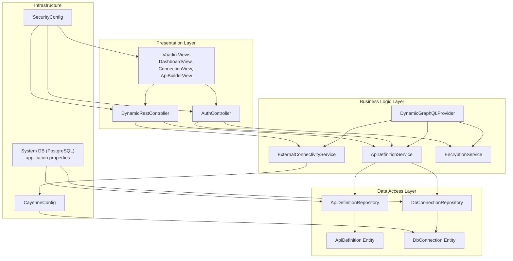
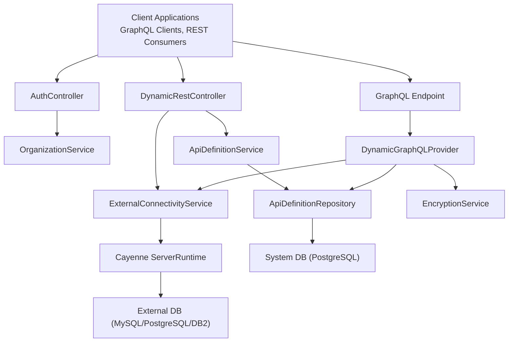
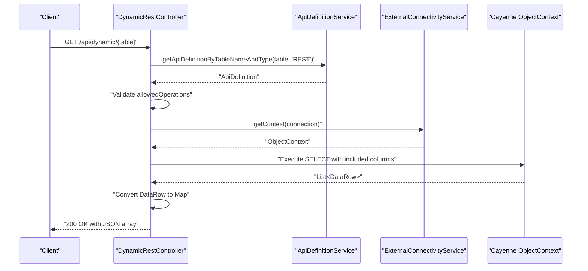
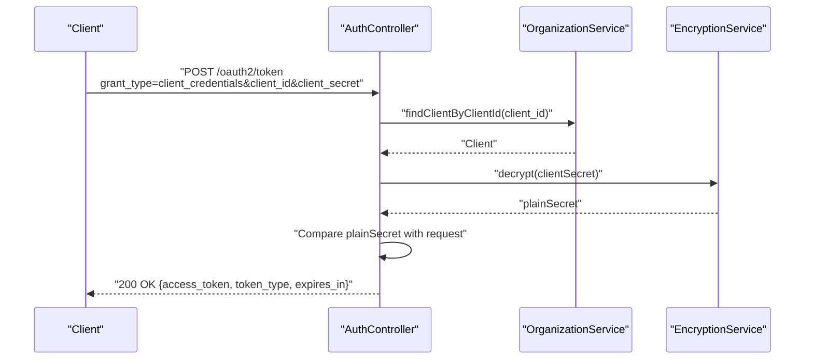
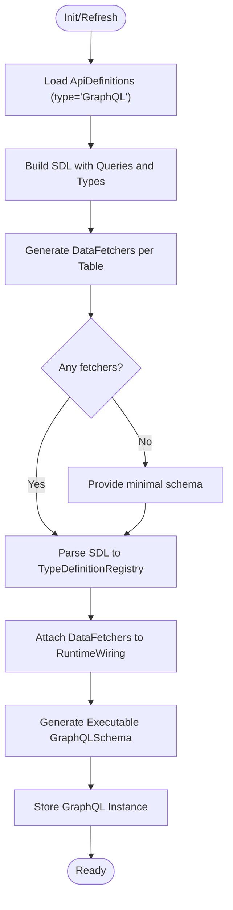
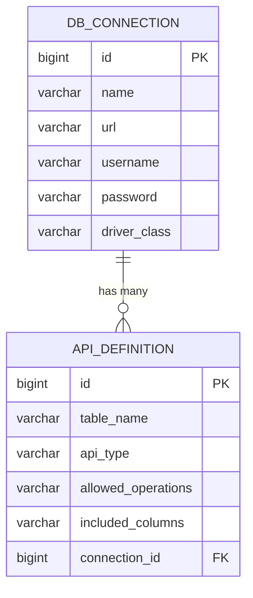
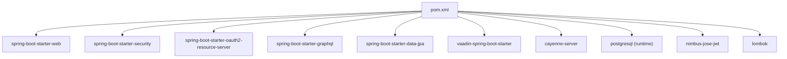

# Architecture & Design

<cite>
**Referenced Files in This Document**
- [DB2APIApplication.java](file://src/main/java/com/db2api/DB2APIApplication.java)
- [pom.xml](file://pom.xml)
- [application.properties](file://src/main/resources/application.properties)
- [README.md](file://README.md)
- [CayenneConfig.java](file://src/main/java/com/db2api/config/CayenneConfig.java)
- [SecurityConfig.java](file://src/main/java/com/db2api/config/SecurityConfig.java)
- [DynamicGraphQLProvider.java](file://src/main/java/com/db2api/config/DynamicGraphQLProvider.java)
- [AuthController.java](file://src/main/java/com/db2api/controller/AuthController.java)
- [DynamicRestController.java](file://src/main/java/com/db2api/controller/DynamicRestController.java)
- [ApiDefinitionService.java](file://src/main/java/com/db2api/service/api/ApiDefinitionService.java)
- [ExternalConnectivityService.java](file://src/main/java/com/db2api/service/connection/ExternalConnectivityService.java)
- [EncryptionService.java](file://src/main/java/com/db2api/service/EncryptionService.java)
- [ApiDefinition.java](file://src/main/java/com/db2api/persistent/api/ApiDefinition.java)
- [DbConnection.java](file://src/main/java/com/db2api/persistent/connection/DbConnection.java)
</cite>

## Table of Contents
1. [Introduction](#introduction)
2. [Project Structure](#project-structure)
3. [Core Components](#core-components)
4. [Architecture Overview](#architecture-overview)
5. [Detailed Component Analysis](#detailed-component-analysis)
6. [Dependency Analysis](#dependency-analysis)
7. [Performance Considerations](#performance-considerations)
8. [Security Architecture](#security-architecture)
9. [Deployment Topology](#deployment-topology)
10. [Troubleshooting Guide](#troubleshooting-guide)
11. [Conclusion](#conclusion)

## Introduction
DB2API is a Spring Boot-based web application that generates dynamic REST and GraphQL APIs from arbitrary relational databases. It provides a Vaadin-based administration UI for managing database connections, API definitions, and users, while leveraging Apache Cayenne for ORM and dynamic database connectivity. The system supports JWT-based authentication and exposes both REST and GraphQL endpoints for consuming the generated APIs.

## Project Structure
The project follows a layered architecture with clear separation of concerns:
- Presentation Layer: Vaadin UI views and Spring MVC controllers
- Business Logic Layer: Services orchestrating domain operations
- Data Access Layer: JPA repositories and Apache Cayenne for external database connectivity
- Configuration Layer: Spring Boot auto-configuration, security, and GraphQL wiring

**Diagram sources**
- [DB2APIApplication.java:13-26](file://src/main/java/com/db2api/DB2APIApplication.java#L13-L26)
- [CayenneConfig.java:21-27](file://src/main/java/com/db2api/config/CayenneConfig.java#L21-L27)
- [SecurityConfig.java:37-40](file://src/main/java/com/db2api/config/SecurityConfig.java#L37-L40)
- [DynamicGraphQLProvider.java:32-53](file://src/main/java/com/db2api/config/DynamicGraphQLProvider.java#L32-L53)
- [AuthController.java:26-43](file://src/main/java/com/db2api/controller/AuthController.java#L26-L43)
- [DynamicRestController.java:21-39](file://src/main/java/com/db2api/controller/DynamicRestController.java#L21-L39)
- [ApiDefinitionService.java:10-38](file://src/main/java/com/db2api/service/api/ApiDefinitionService.java#L10-L38)
- [ExternalConnectivityService.java:15-54](file://src/main/java/com/db2api/service/connection/ExternalConnectivityService.java#L15-L54)
- [EncryptionService.java:13-58](file://src/main/java/com/db2api/service/EncryptionService.java#L13-L58)
- [ApiDefinition.java:13-56](file://src/main/java/com/db2api/persistent/api/ApiDefinition.java#L13-L56)
- [DbConnection.java:16-84](file://src/main/java/com/db2api/persistent/connection/DbConnection.java#L16-L84)
- [application.properties:7-16](file://src/main/resources/application.properties#L7-L16)

**Section sources**
- [README.md:65-82](file://README.md#L65-L82)
- [DB2APIApplication.java:13-26](file://src/main/java/com/db2api/DB2APIApplication.java#L13-L26)
- [application.properties:1-20](file://src/main/resources/application.properties#L1-L20)

## Core Components
- DB2APIApplication: Spring Boot entry point implementing Vaadin AppShellConfigurator for global UI theming and shell configuration.
- Controllers: DynamicRestController for dynamic REST API routing and AuthController for OAuth2 client_credentials token issuance.
- Services: ApiDefinitionService for CRUD on API definitions, ExternalConnectivityService for Cayenne runtime and context management, EncryptionService for AES encryption/decryption of secrets.
- Persistence: Entities ApiDefinition and DbConnection mapped to JPA tables with relationships.
- Configuration: CayenneConfig for ServerRuntime initialization, SecurityConfig extending VaadinWebSecurity, DynamicGraphQLProvider for runtime GraphQL schema generation.

**Section sources**
- [DB2APIApplication.java:13-26](file://src/main/java/com/db2api/DB2APIApplication.java#L13-L26)
- [DynamicRestController.java:21-39](file://src/main/java/com/db2api/controller/DynamicRestController.java#L21-L39)
- [AuthController.java:26-43](file://src/main/java/com/db2api/controller/AuthController.java#L26-L43)
- [ApiDefinitionService.java:10-38](file://src/main/java/com/db2api/service/api/ApiDefinitionService.java#L10-L38)
- [ExternalConnectivityService.java:15-54](file://src/main/java/com/db2api/service/connection/ExternalConnectivityService.java#L15-L54)
- [EncryptionService.java:13-58](file://src/main/java/com/db2api/service/EncryptionService.java#L13-L58)
- [ApiDefinition.java:13-56](file://src/main/java/com/db2api/persistent/api/ApiDefinition.java#L13-L56)
- [DbConnection.java:16-84](file://src/main/java/com/db2api/persistent/connection/DbConnection.java#L16-L84)
- [CayenneConfig.java:12-27](file://src/main/java/com/db2api/config/CayenneConfig.java#L12-L27)
- [SecurityConfig.java:15-51](file://src/main/java/com/db2api/config/SecurityConfig.java#L15-L51)
- [DynamicGraphQLProvider.java:32-132](file://src/main/java/com/db2api/config/DynamicGraphQLProvider.java#L32-L132)

## Architecture Overview
The system employs a layered architecture:
- Presentation: Vaadin UI for administration and Spring MVC controllers for programmatic access.
- Business Logic: Services encapsulate orchestration, validation, and integration with persistence and external databases.
- Data Access: JPA repositories for system DB entities and Apache Cayenne for dynamic external database connectivity.
- Integration: OAuth2 client_credentials flow for JWT issuance, dynamic GraphQL schema generation, and dynamic REST endpoint routing.

**Diagram sources**
- [AuthController.java:54-109](file://src/main/java/com/db2api/controller/AuthController.java#L54-L109)
- [DynamicRestController.java:47-166](file://src/main/java/com/db2api/controller/DynamicRestController.java#L47-L166)
- [DynamicGraphQLProvider.java:77-132](file://src/main/java/com/db2api/config/DynamicGraphQLProvider.java#L77-L132)
- [ApiDefinitionService.java:19-25](file://src/main/java/com/db2api/service/api/ApiDefinitionService.java#L19-L25)
- [ExternalConnectivityService.java:25-53](file://src/main/java/com/db2api/service/connection/ExternalConnectivityService.java#L25-L53)
- [EncryptionService.java:35-57](file://src/main/java/com/db2api/service/EncryptionService.java#L35-L57)
- [application.properties:7-16](file://src/main/resources/application.properties#L7-L16)

## Detailed Component Analysis

### Dynamic REST Controller
The DynamicRestController translates HTTP requests into SQL executed against external databases via Cayenne. It validates allowed operations per ApiDefinition, constructs parameterized queries, and returns normalized results.

**Diagram sources**
- [DynamicRestController.java:47-81](file://src/main/java/com/db2api/controller/DynamicRestController.java#L47-L81)
- [ApiDefinitionService.java:23-25](file://src/main/java/com/db2api/service/api/ApiDefinitionService.java#L23-L25)
- [ExternalConnectivityService.java:25-27](file://src/main/java/com/db2api/service/connection/ExternalConnectivityService.java#L25-L27)

**Section sources**
- [DynamicRestController.java:21-168](file://src/main/java/com/db2api/controller/DynamicRestController.java#L21-L168)
- [ApiDefinitionService.java:10-38](file://src/main/java/com/db2api/service/api/ApiDefinitionService.java#L10-L38)
- [ExternalConnectivityService.java:15-54](file://src/main/java/com/db2api/service/connection/ExternalConnectivityService.java#L15-L54)

### OAuth2 Token Issuance
The AuthController implements an OAuth2 token endpoint supporting client_credentials grant. It validates client credentials using encrypted secrets and issues a signed JWT.

**Diagram sources**
- [AuthController.java:54-109](file://src/main/java/com/db2api/controller/AuthController.java#L54-L109)
- [EncryptionService.java:47-57](file://src/main/java/com/db2api/service/EncryptionService.java#L47-L57)

**Section sources**
- [AuthController.java:26-111](file://src/main/java/com/db2api/controller/AuthController.java#L26-L111)
- [EncryptionService.java:13-58](file://src/main/java/com/db2api/service/EncryptionService.java#L13-L58)

### Dynamic GraphQL Provider
The DynamicGraphQLProvider builds an executable schema at runtime from ApiDefinition entries. It generates types and data fetchers for each configured table and connects to external databases using decrypted credentials.

**Diagram sources**
- [DynamicGraphQLProvider.java:77-132](file://src/main/java/com/db2api/config/DynamicGraphQLProvider.java#L77-L132)

**Section sources**
- [DynamicGraphQLProvider.java:32-178](file://src/main/java/com/db2api/config/DynamicGraphQLProvider.java#L32-L178)

### Data Model
The persistence layer defines the relationship between database connections and API definitions.

**Diagram sources**
- [DbConnection.java:16-84](file://src/main/java/com/db2api/persistent/connection/DbConnection.java#L16-L84)
- [ApiDefinition.java:13-56](file://src/main/java/com/db2api/persistent/api/ApiDefinition.java#L13-L56)

**Section sources**
- [DbConnection.java:16-84](file://src/main/java/com/db2api/persistent/connection/DbConnection.java#L16-L84)
- [ApiDefinition.java:13-56](file://src/main/java/com/db2api/persistent/api/ApiDefinition.java#L13-L56)

## Dependency Analysis
The application leverages a modern stack with explicit versioning and dependency management.

**Diagram sources**
- [pom.xml:25-98](file://pom.xml#L25-L98)

**Section sources**
- [pom.xml:16-98](file://pom.xml#L16-L98)
- [application.properties:7-16](file://src/main/resources/application.properties#L7-L16)

## Performance Considerations
- Connection pooling and caching: ExternalConnectivityService caches ServerRuntime instances keyed by connection ID to minimize overhead of creating new contexts.
- Query construction: DynamicRestController constructs parameterized SQL to prevent injection and reduce parsing overhead.
- Schema generation: DynamicGraphQLProvider regenerates the schema on demand; consider caching the schema and invalidating on configuration changes.
- Encryption: EncryptionService computes keys on-demand; consider caching the SecretKeySpec if performance becomes a concern.
- Logging: Enable structured logging and metrics collection for slow queries and authentication failures.

[No sources needed since this section provides general guidance]

## Security Architecture
- Authentication: OAuth2 client_credentials grant with JWT issuance via HMAC signing.
- Authorization: VaadinWebSecurity configured login view; roles and scopes can be extended via Spring Security.
- Secrets management: EncryptionService provides AES encryption/decryption for sensitive data at rest.
- Transport: Use HTTPS in production; configure TLS termination at the reverse proxy or load balancer.

**Section sources**
- [SecurityConfig.java:37-50](file://src/main/java/com/db2api/config/SecurityConfig.java#L37-L50)
- [AuthController.java:90-104](file://src/main/java/com/db2api/controller/AuthController.java#L90-L104)
- [EncryptionService.java:35-57](file://src/main/java/com/db2api/service/EncryptionService.java#L35-L57)

## Deployment Topology
- Single JVM deployment: Spring Boot application serving Vaadin UI, REST, and GraphQL endpoints on port 8080.
- Database connectivity: System DB (PostgreSQL) for metadata and external DBs (MySQL/PostgreSQL/DB2) accessed via dynamic connections.
- Horizontal scaling: Stateless controllers and services; scale the JVM instances behind a load balancer. Persist sessions externally if needed.
- Secrets: Store encryption and database credentials in environment variables or a secrets manager.

**Section sources**
- [application.properties:4-16](file://src/main/resources/application.properties#L4-L16)
- [README.md:84-99](file://README.md#L84-L99)

## Troubleshooting Guide
- Authentication failures: Verify client credentials and encryption secret alignment; check JWT issuer and expiration claims.
- Dynamic API errors: Confirm ApiDefinition existence and allowed operations; validate included columns and table accessibility.
- External connectivity: Ensure decrypted credentials are correct and reachable; verify JDBC driver availability and URL format.
- GraphQL schema issues: Refresh schema after configuration changes; confirm SDL generation and data fetcher registration.

**Section sources**
- [AuthController.java:59-109](file://src/main/java/com/db2api/controller/AuthController.java#L59-L109)
- [DynamicRestController.java:51-81](file://src/main/java/com/db2api/controller/DynamicRestController.java#L51-L81)
- [DynamicGraphQLProvider.java:77-132](file://src/main/java/com/db2api/config/DynamicGraphQLProvider.java#L77-L132)
- [ExternalConnectivityService.java:40-53](file://src/main/java/com/db2api/service/connection/ExternalConnectivityService.java#L40-L53)

## Conclusion
DB2API integrates Vaadin, Spring Boot, Apache Cayenne, and GraphQL to deliver a flexible platform for generating dynamic APIs from relational databases. Its layered architecture, security-first design, and modular services enable extensibility and maintainability. For production, focus on connection caching, schema invalidation strategies, and robust secrets management.