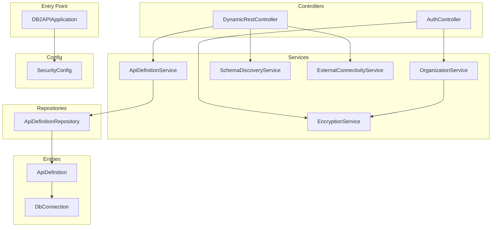
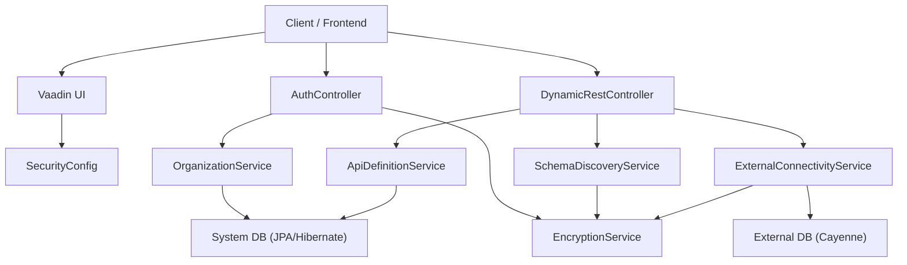
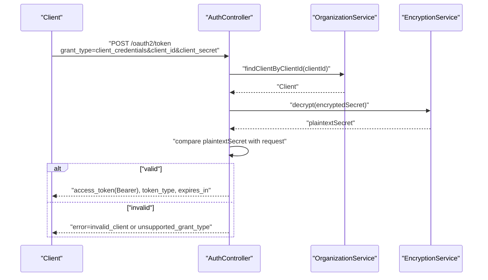
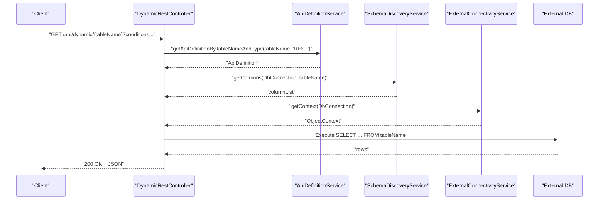
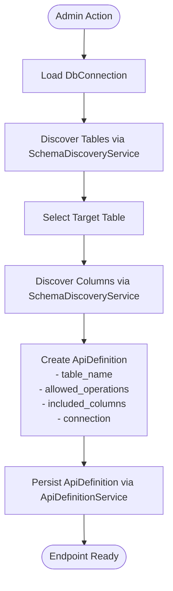
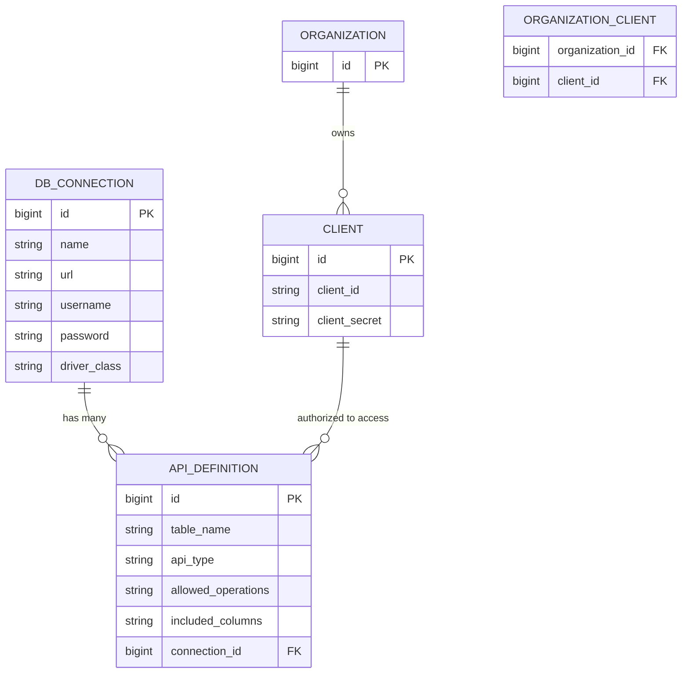
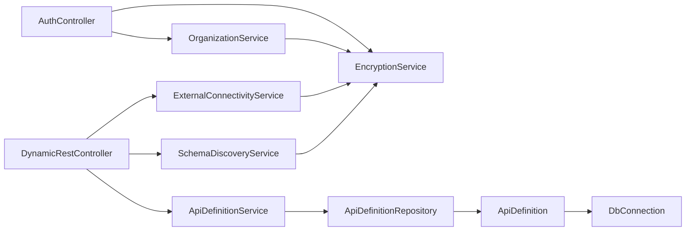

# Component Interactions

<cite>
**Referenced Files in This Document**
- [DB2APIApplication.java](file://src/main/java/com/db2api/DB2APIApplication.java)
- [application.properties](file://src/main/resources/application.properties)
- [SecurityConfig.java](file://src/main/java/com/db2api/config/SecurityConfig.java)
- [AuthController.java](file://src/main/java/com/db2api/controller/AuthController.java)
- [DynamicRestController.java](file://src/main/java/com/db2api/controller/DynamicRestController.java)
- [OrganizationService.java](file://src/main/java/com/db2api/service/organization/OrganizationService.java)
- [ApiDefinitionService.java](file://src/main/java/com/db2api/service/api/ApiDefinitionService.java)
- [SchemaDiscoveryService.java](file://src/main/java/com/db2api/service/api/SchemaDiscoveryService.java)
- [ExternalConnectivityService.java](file://src/main/java/com/db2api/service/connection/ExternalConnectivityService.java)
- [EncryptionService.java](file://src/main/java/com/db2api/service/EncryptionService.java)
- [ApiDefinition.java](file://src/main/java/com/db2api/persistent/api/ApiDefinition.java)
- [DbConnection.java](file://src/main/java/com/db2api/persistent/connection/DbConnection.java)
- [ApiDefinitionRepository.java](file://src/main/java/com/db2api/repository/api/ApiDefinitionRepository.java)
</cite>

## Table of Contents
1. [Introduction](#introduction)
2. [Project Structure](#project-structure)
3. [Core Components](#core-components)
4. [Architecture Overview](#architecture-overview)
5. [Detailed Component Analysis](#detailed-component-analysis)
6. [Dependency Analysis](#dependency-analysis)
7. [Performance Considerations](#performance-considerations)
8. [Troubleshooting Guide](#troubleshooting-guide)
9. [Conclusion](#conclusion)

## Introduction
This document explains how the DB2API platform orchestrates component interactions across authentication, dynamic API request processing, and database connectivity. It details the flow from client requests to controllers, services, repositories, and external database connections. It also documents the dynamic API generation pipeline from schema discovery to endpoint creation, and provides sequence diagrams for common workflows such as OAuth2 token acquisition and dynamic API endpoint invocation.

## Project Structure
The application is a Spring Boot + Vaadin project with layered architecture:
- Entry point initializes the application and theme.
- Controllers expose REST endpoints for authentication and dynamic API routing.
- Services encapsulate business logic and orchestrate data access and external connectivity.
- Repositories manage persistence of domain entities.
- Entities model the system’s data (API definitions, database connections, organizations, clients).
- Configuration secures the backend and integrates JWT decoding.

**Diagram sources**
- [DB2APIApplication.java:13-24](file://src/main/java/com/db2api/DB2APIApplication.java#L13-L24)
- [SecurityConfig.java:53-63](file://src/main/java/com/db2api/config/SecurityConfig.java#L53-L63)
- [AuthController.java:25-43](file://src/main/java/com/db2api/controller/AuthController.java#L25-L43)
- [DynamicRestController.java:25-52](file://src/main/java/com/db2api/controller/DynamicRestController.java#L25-L52)
- [OrganizationService.java:15-27](file://src/main/java/com/db2api/service/organization/OrganizationService.java#L15-L27)
- [ApiDefinitionService.java:10-17](file://src/main/java/com/db2api/service/api/ApiDefinitionService.java#L10-L17)
- [SchemaDiscoveryService.java:15-22](file://src/main/java/com/db2api/service/api/SchemaDiscoveryService.java#L15-L22)
- [ExternalConnectivityService.java:15-23](file://src/main/java/com/db2api/service/connection/ExternalConnectivityService.java#L15-L23)
- [EncryptionService.java:21-34](file://src/main/java/com/db2api/service/EncryptionService.java#L21-L34)
- [ApiDefinitionRepository.java:10-21](file://src/main/java/com/db2api/repository/api/ApiDefinitionRepository.java#L10-L21)
- [ApiDefinition.java:17-66](file://src/main/java/com/db2api/persistent/api/ApiDefinition.java#L17-L66)
- [DbConnection.java:16-84](file://src/main/java/com/db2api/persistent/connection/DbConnection.java#L16-L84)

**Section sources**
- [DB2APIApplication.java:13-24](file://src/main/java/com/db2api/DB2APIApplication.java#L13-L24)
- [application.properties:1-20](file://src/main/resources/application.properties#L1-L20)

## Core Components
- DB2APIApplication: Bootstraps the Spring Boot application and applies Vaadin theme configuration.
- SecurityConfig: Secures the application, defines form-based login for Vaadin UI, and configures JWT-based resource server authentication for dynamic API endpoints.
- AuthController: Implements OAuth2 client_credentials token issuance using HMAC signing and validates client credentials against stored secrets.
- DynamicRestController: Translates REST requests into SQL against external databases using admin-defined API mappings and schema validation.
- OrganizationService: Manages organizations and clients, generates client IDs/secrets, and persists them securely.
- ApiDefinitionService: Retrieves and persists API definitions used by dynamic endpoints.
- SchemaDiscoveryService: Discovers database tables/columns for schema-driven validation.
- ExternalConnectivityService: Establishes Cayenne ObjectContexts per external database connection with caching and lifecycle management.
- EncryptionService: Provides AES-GCM encryption/decryption for secrets and credentials.
- ApiDefinition and DbConnection: JPA entities modeling dynamic API mappings and external database connections.

**Section sources**
- [DB2APIApplication.java:13-24](file://src/main/java/com/db2api/DB2APIApplication.java#L13-L24)
- [SecurityConfig.java:53-63](file://src/main/java/com/db2api/config/SecurityConfig.java#L53-L63)
- [AuthController.java:25-109](file://src/main/java/com/db2api/controller/AuthController.java#L25-L109)
- [DynamicRestController.java:25-317](file://src/main/java/com/db2api/controller/DynamicRestController.java#L25-L317)
- [OrganizationService.java:15-83](file://src/main/java/com/db2api/service/organization/OrganizationService.java#L15-L83)
- [ApiDefinitionService.java:10-38](file://src/main/java/com/db2api/service/api/ApiDefinitionService.java#L10-L38)
- [SchemaDiscoveryService.java:15-60](file://src/main/java/com/db2api/service/api/SchemaDiscoveryService.java#L15-L60)
- [ExternalConnectivityService.java:15-55](file://src/main/java/com/db2api/service/connection/ExternalConnectivityService.java#L15-L55)
- [EncryptionService.java:21-112](file://src/main/java/com/db2api/service/EncryptionService.java#L21-L112)
- [ApiDefinition.java:17-66](file://src/main/java/com/db2api/persistent/api/ApiDefinition.java#L17-L66)
- [DbConnection.java:16-84](file://src/main/java/com/db2api/persistent/connection/DbConnection.java#L16-L84)

## Architecture Overview
The system separates concerns across layers:
- Presentation: Vaadin UI (secured) and REST endpoints (/oauth2/token and /api/dynamic/**).
- Application: Controllers delegate to services; services coordinate repositories and external systems.
- Persistence: JPA repositories manage system entities; Cayenne manages external database contexts.
- Security: Form login for UI; JWT bearer tokens for programmatic access to dynamic endpoints.

**Diagram sources**
- [SecurityConfig.java:53-63](file://src/main/java/com/db2api/config/SecurityConfig.java#L53-L63)
- [AuthController.java:25-109](file://src/main/java/com/db2api/controller/AuthController.java#L25-L109)
- [DynamicRestController.java:25-317](file://src/main/java/com/db2api/controller/DynamicRestController.java#L25-L317)
- [OrganizationService.java:15-83](file://src/main/java/com/db2api/service/organization/OrganizationService.java#L15-L83)
- [ApiDefinitionService.java:10-38](file://src/main/java/com/db2api/service/api/ApiDefinitionService.java#L10-L38)
- [SchemaDiscoveryService.java:15-60](file://src/main/java/com/db2api/service/api/SchemaDiscoveryService.java#L15-L60)
- [ExternalConnectivityService.java:15-55](file://src/main/java/com/db2api/service/connection/ExternalConnectivityService.java#L15-L55)
- [EncryptionService.java:21-112](file://src/main/java/com/db2api/service/EncryptionService.java#L21-L112)

## Detailed Component Analysis

### Authentication Flow (OAuth2 client_credentials)
This sequence covers token acquisition using client credentials and JWT issuance.

**Diagram sources**
- [AuthController.java:54-109](file://src/main/java/com/db2api/controller/AuthController.java#L54-L109)
- [OrganizationService.java:79-81](file://src/main/java/com/db2api/service/organization/OrganizationService.java#L79-L81)
- [EncryptionService.java:89-110](file://src/main/java/com/db2api/service/EncryptionService.java#L89-L110)

**Section sources**
- [AuthController.java:54-109](file://src/main/java/com/db2api/controller/AuthController.java#L54-L109)
- [SecurityConfig.java:70-79](file://src/main/java/com/db2api/config/SecurityConfig.java#L70-L79)

### Dynamic API Endpoint Invocation
This sequence shows how a dynamic REST endpoint is invoked, validated against schema, and executed against an external database.

**Diagram sources**
- [DynamicRestController.java:76-113](file://src/main/java/com/db2api/controller/DynamicRestController.java#L76-L113)
- [ApiDefinitionService.java:23-25](file://src/main/java/com/db2api/service/api/ApiDefinitionService.java#L23-L25)
- [SchemaDiscoveryService.java:42-58](file://src/main/java/com/db2api/service/api/SchemaDiscoveryService.java#L42-L58)
- [ExternalConnectivityService.java:25-31](file://src/main/java/com/db2api/service/connection/ExternalConnectivityService.java#L25-L31)

**Section sources**
- [DynamicRestController.java:76-291](file://src/main/java/com/db2api/controller/DynamicRestController.java#L76-L291)

### Dynamic API Generation Pipeline (Schema Discovery to Endpoint Creation)
This flow outlines how administrators define dynamic endpoints by mapping database tables to API definitions and validating schema.

**Diagram sources**
- [SchemaDiscoveryService.java:24-58](file://src/main/java/com/db2api/service/api/SchemaDiscoveryService.java#L24-L58)
- [ApiDefinitionService.java:23-37](file://src/main/java/com/db2api/service/api/ApiDefinitionService.java#L23-L37)
- [ApiDefinition.java:17-66](file://src/main/java/com/db2api/persistent/api/ApiDefinition.java#L17-L66)
- [DbConnection.java:16-84](file://src/main/java/com/db2api/persistent/connection/DbConnection.java#L16-L84)

**Section sources**
- [SchemaDiscoveryService.java:24-58](file://src/main/java/com/db2api/service/api/SchemaDiscoveryService.java#L24-L58)
- [ApiDefinitionService.java:19-37](file://src/main/java/com/db2api/service/api/ApiDefinitionService.java#L19-L37)
- [ApiDefinitionRepository.java:13-20](file://src/main/java/com/db2api/repository/api/ApiDefinitionRepository.java#L13-L20)

### Data Model Relationships
The following ER diagram shows relationships among entities involved in dynamic API generation and connectivity.

**Diagram sources**
- [DbConnection.java:16-84](file://src/main/java/com/db2api/persistent/connection/DbConnection.java#L16-L84)
- [ApiDefinition.java:17-66](file://src/main/java/com/db2api/persistent/api/ApiDefinition.java#L17-L66)
- [OrganizationService.java:41-67](file://src/main/java/com/db2api/service/organization/OrganizationService.java#L41-L67)

**Section sources**
- [DbConnection.java:16-84](file://src/main/java/com/db2api/persistent/connection/DbConnection.java#L16-L84)
- [ApiDefinition.java:17-66](file://src/main/java/com/db2api/persistent/api/ApiDefinition.java#L17-L66)
- [OrganizationService.java:41-67](file://src/main/java/com/db2api/service/organization/OrganizationService.java#L41-L67)

## Dependency Analysis
This section maps component dependencies and highlights coupling and cohesion.

**Diagram sources**
- [AuthController.java:25-43](file://src/main/java/com/db2api/controller/AuthController.java#L25-L43)
- [DynamicRestController.java:34-52](file://src/main/java/com/db2api/controller/DynamicRestController.java#L34-L52)
- [OrganizationService.java:18-26](file://src/main/java/com/db2api/service/organization/OrganizationService.java#L18-L26)
- [ApiDefinitionService.java:13-17](file://src/main/java/com/db2api/service/api/ApiDefinitionService.java#L13-L17)
- [SchemaDiscoveryService.java:18-22](file://src/main/java/com/db2api/service/api/SchemaDiscoveryService.java#L18-L22)
- [ExternalConnectivityService.java:19-23](file://src/main/java/com/db2api/service/connection/ExternalConnectivityService.java#L19-L23)
- [ApiDefinitionRepository.java:10-21](file://src/main/java/com/db2api/repository/api/ApiDefinitionRepository.java#L10-L21)
- [ApiDefinition.java:57-59](file://src/main/java/com/db2api/persistent/api/ApiDefinition.java#L57-L59)
- [DbConnection.java:62-63](file://src/main/java/com/db2api/persistent/connection/DbConnection.java#L62-L63)

**Section sources**
- [AuthController.java:25-109](file://src/main/java/com/db2api/controller/AuthController.java#L25-L109)
- [DynamicRestController.java:25-317](file://src/main/java/com/db2api/controller/DynamicRestController.java#L25-L317)
- [OrganizationService.java:15-83](file://src/main/java/com/db2api/service/organization/OrganizationService.java#L15-L83)
- [ApiDefinitionService.java:10-38](file://src/main/java/com/db2api/service/api/ApiDefinitionService.java#L10-L38)
- [SchemaDiscoveryService.java:15-60](file://src/main/java/com/db2api/service/api/SchemaDiscoveryService.java#L15-L60)
- [ExternalConnectivityService.java:15-55](file://src/main/java/com/db2api/service/connection/ExternalConnectivityService.java#L15-L55)
- [ApiDefinitionRepository.java:10-21](file://src/main/java/com/db2api/repository/api/ApiDefinitionRepository.java#L10-L21)

## Performance Considerations
- External database connectivity caching: ExternalConnectivityService caches Cayenne ServerRuntime instances keyed by connection ID to reduce overhead of repeated datasource initialization.
- Column validation: DynamicRestController validates identifiers against discovered schema to avoid expensive or unsafe SQL and to limit selected columns.
- Encryption cost: EncryptionService uses AES-GCM with IV prepending; consider batching or avoiding repeated decryption for frequently accessed secrets.
- Logging: Use structured logging for error scenarios in dynamic endpoints to minimize overhead and improve observability.

[No sources needed since this section provides general guidance]

## Troubleshooting Guide
- Authentication failures:
  - Verify client credentials and ensure the client exists and secret matches after decryption.
  - Confirm the grant type is client_credentials.
- Dynamic endpoint errors:
  - Check that ApiDefinition exists for the requested table and operation.
  - Ensure included columns are valid per schema discovery.
  - Validate that conditions are provided for UPDATE/DELETE operations.
- Connectivity issues:
  - Confirm DbConnection credentials are correct and decrypted properly.
  - Ensure the external database is reachable and the driver class is configured.
- Security configuration:
  - Ensure JWT issuer and expiration are acceptable to clients.
  - Confirm the security matcher protects /api/dynamic/** and /graphql.

**Section sources**
- [AuthController.java:77-109](file://src/main/java/com/db2api/controller/AuthController.java#L77-L109)
- [DynamicRestController.java:76-291](file://src/main/java/com/db2api/controller/DynamicRestController.java#L76-L291)
- [ExternalConnectivityService.java:25-53](file://src/main/java/com/db2api/service/connection/ExternalConnectivityService.java#L25-L53)
- [SecurityConfig.java:53-63](file://src/main/java/com/db2api/config/SecurityConfig.java#L53-L63)

## Conclusion
DB2API integrates Spring Security, Vaadin UI, and dynamic REST endpoints backed by external databases. Controllers delegate to services that orchestrate repositories and external connectivity, while schema discovery ensures safe and valid SQL generation. The documented flows and diagrams provide a blueprint for extending the platform with additional endpoints, securing new routes, and optimizing performance.