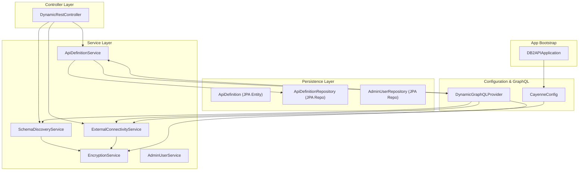
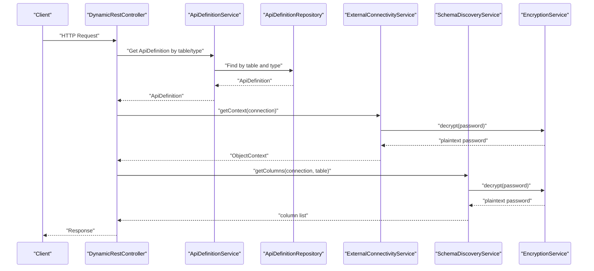
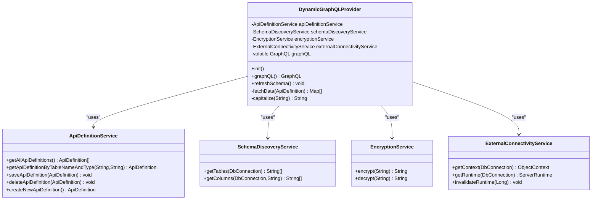
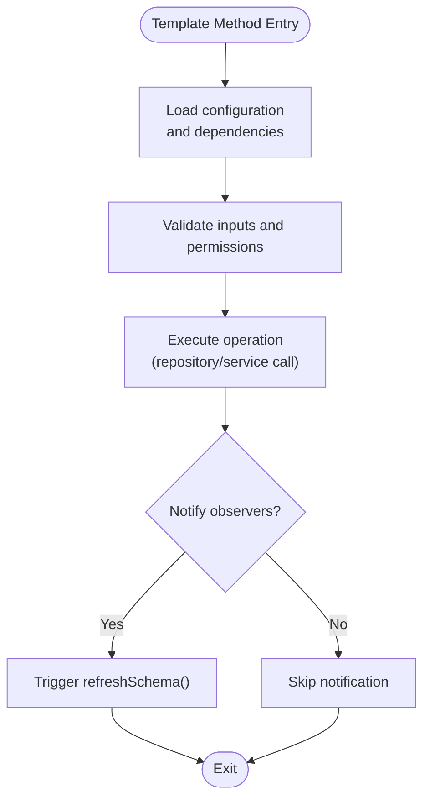
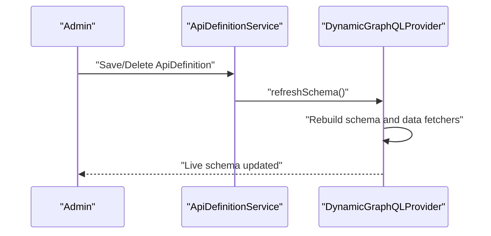
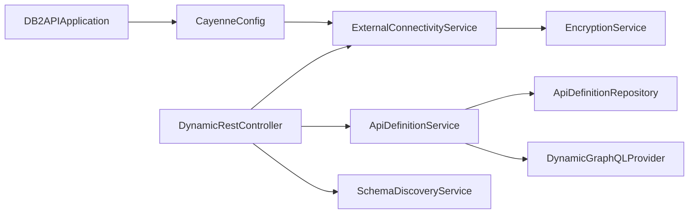

# Design Patterns

<cite>
**Referenced Files in This Document**
- [DB2APIApplication.java](file://src/main/java/com/db2api/DB2APIApplication.java)
- [CayenneConfig.java](file://src/main/java/com/db2api/config/CayenneConfig.java)
- [DynamicGraphQLProvider.java](file://src/main/java/com/db2api/config/DynamicGraphQLProvider.java)
- [AdminUserRepository.java](file://src/main/java/com/db2api/repository/admin/AdminUserRepository.java)
- [ApiDefinitionRepository.java](file://src/main/java/com/db2api/repository/api/ApiDefinitionRepository.java)
- [AdminUserService.java](file://src/main/java/com/db2api/service/admin/AdminUserService.java)
- [ApiDefinitionService.java](file://src/main/java/com/db2api/service/api/ApiDefinitionService.java)
- [SchemaDiscoveryService.java](file://src/main/java/com/db2api/service/api/SchemaDiscoveryService.java)
- [EncryptionService.java](file://src/main/java/com/db2api/service/EncryptionService.java)
- [ExternalConnectivityService.java](file://src/main/java/com/db2api/service/connection/ExternalConnectivityService.java)
- [DynamicRestController.java](file://src/main/java/com/db2api/controller/DynamicRestController.java)
- [ApiDefinition.java](file://src/main/java/com/db2api/persistent/api/ApiDefinition.java)
</cite>

## Table of Contents
1. [Introduction](#introduction)
2. [Project Structure](#project-structure)
3. [Core Components](#core-components)
4. [Architecture Overview](#architecture-overview)
5. [Detailed Component Analysis](#detailed-component-analysis)
6. [Dependency Analysis](#dependency-analysis)
7. [Performance Considerations](#performance-considerations)
8. [Troubleshooting Guide](#troubleshooting-guide)
9. [Conclusion](#conclusion)

## Introduction
This document explains the design patterns implemented in the DB2API platform. It focuses on:
- Repository pattern for data access abstraction
- Service layer pattern for business logic encapsulation
- Factory pattern usage in DynamicGraphQLProvider
- Spring Boot’s dependency injection enabling inversion of control
- Template Method pattern in service implementations
- Observer pattern in event-driven components

The goal is to help developers understand how these patterns are applied, why they are beneficial, and how to extend or maintain the system safely.

## Project Structure
The application follows a layered architecture:
- Persistence layer: JPA entities and Spring Data repositories
- Service layer: Business logic and orchestration
- Configuration layer: Spring beans, GraphQL provider, and Cayenne setup
- Controller layer: REST endpoints for dynamic API operations
- UI layer: Vaadin views (not covered in this document)

**Diagram sources**
- [DB2APIApplication.java:13-26](file://src/main/java/com/db2api/DB2APIApplication.java#L13-L26)
- [CayenneConfig.java:21-27](file://src/main/java/com/db2api/config/CayenneConfig.java#L21-L27)
- [DynamicGraphQLProvider.java:34-81](file://src/main/java/com/db2api/config/DynamicGraphQLProvider.java#L34-L81)
- [ApiDefinitionService.java:11-21](file://src/main/java/com/db2api/service/api/ApiDefinitionService.java#L11-L21)
- [SchemaDiscoveryService.java:15-22](file://src/main/java/com/db2api/service/api/SchemaDiscoveryService.java#L15-L22)
- [EncryptionService.java:21-34](file://src/main/java/com/db2api/service/EncryptionService.java#L21-L34)
- [ExternalConnectivityService.java:15-23](file://src/main/java/com/db2api/service/connection/ExternalConnectivityService.java#L15-L23)
- [DynamicRestController.java:25-52](file://src/main/java/com/db2api/controller/DynamicRestController.java#L25-L52)
- [ApiDefinitionRepository.java:10-21](file://src/main/java/com/db2api/repository/api/ApiDefinitionRepository.java#L10-L21)
- [AdminUserRepository.java:12-22](file://src/main/java/com/db2api/repository/admin/AdminUserRepository.java#L12-L22)
- [ApiDefinition.java:17-66](file://src/main/java/com/db2api/persistent/api/ApiDefinition.java#L17-L66)

**Section sources**
- [DB2APIApplication.java:13-26](file://src/main/java/com/db2api/DB2APIApplication.java#L13-L26)
- [CayenneConfig.java:12-28](file://src/main/java/com/db2api/config/CayenneConfig.java#L12-L28)

## Core Components
- Repository pattern: Abstracts persistence via Spring Data JPA repositories.
- Service layer pattern: Encapsulates business logic and coordinates repositories and external services.
- Factory pattern: DynamicGraphQLProvider constructs and updates the GraphQL schema at runtime.
- Dependency injection: Spring manages object lifecycles and wiring, enabling inversion of control.
- Template Method: Service methods follow a consistent template (load config → validate → execute → notify observers).
- Observer: ApiDefinitionService triggers DynamicGraphQLProvider.refreshSchema() after CRUD operations.

Benefits:
- Separation of concerns and testability
- Loose coupling and extensibility
- Centralized business rules and cross-cutting concerns
- Safe runtime schema generation and reactive updates

**Section sources**
- [AdminUserRepository.java:12-22](file://src/main/java/com/db2api/repository/admin/AdminUserRepository.java#L12-L22)
- [ApiDefinitionRepository.java:10-21](file://src/main/java/com/db2api/repository/api/ApiDefinitionRepository.java#L10-L21)
- [AdminUserService.java:11-40](file://src/main/java/com/db2api/service/admin/AdminUserService.java#L11-L40)
- [ApiDefinitionService.java:11-44](file://src/main/java/com/db2api/service/api/ApiDefinitionService.java#L11-L44)
- [DynamicGraphQLProvider.java:34-81](file://src/main/java/com/db2api/config/DynamicGraphQLProvider.java#L34-L81)
- [DynamicGraphQLProvider.java:87-141](file://src/main/java/com/db2api/config/DynamicGraphQLProvider.java#L87-L141)
- [ApiDefinitionService.java:31-39](file://src/main/java/com/db2api/service/api/ApiDefinitionService.java#L31-L39)

## Architecture Overview
The system integrates REST endpoints, dynamic GraphQL schema generation, and external database connectivity through Spring-managed services and repositories.

**Diagram sources**
- [DynamicRestController.java:76-113](file://src/main/java/com/db2api/controller/DynamicRestController.java#L76-L113)
- [ApiDefinitionService.java:23-29](file://src/main/java/com/db2api/service/api/ApiDefinitionService.java#L23-L29)
- [ApiDefinitionRepository.java:19-20](file://src/main/java/com/db2api/repository/api/ApiDefinitionRepository.java#L19-L20)
- [ExternalConnectivityService.java:25-31](file://src/main/java/com/db2api/service/connection/ExternalConnectivityService.java#L25-L31)
- [SchemaDiscoveryService.java:42-58](file://src/main/java/com/db2api/service/api/SchemaDiscoveryService.java#L42-L58)
- [EncryptionService.java:89-110](file://src/main/java/com/db2api/service/EncryptionService.java#L89-L110)

## Detailed Component Analysis

### Repository Pattern
- Purpose: Abstract persistence operations behind typed repositories.
- Implementation highlights:
  - JPA repositories define CRUD and derived queries.
  - Entities model domain attributes and relationships.
- Example references:
  - [AdminUserRepository:12-22](file://src/main/java/com/db2api/repository/admin/AdminUserRepository.java#L12-L22)
  - [ApiDefinitionRepository:10-21](file://src/main/java/com/db2api/repository/api/ApiDefinitionRepository.java#L10-L21)
  - [ApiDefinition entity:17-66](file://src/main/java/com/db2api/persistent/api/ApiDefinition.java#L17-L66)

Benefits:
- Clean separation between data access and business logic
- Consistent query API and pagination support
- Easy mocking for unit tests

**Section sources**
- [AdminUserRepository.java:12-22](file://src/main/java/com/db2api/repository/admin/AdminUserRepository.java#L12-L22)
- [ApiDefinitionRepository.java:10-21](file://src/main/java/com/db2api/repository/api/ApiDefinitionRepository.java#L10-L21)
- [ApiDefinition.java:17-66](file://src/main/java/com/db2api/persistent/api/ApiDefinition.java#L17-L66)

### Service Layer Pattern
- Purpose: Encapsulate business rules and coordinate repositories/services.
- Implementation highlights:
  - Services are constructor-injected singletons managed by Spring.
  - Business operations are centralized (e.g., saving API definitions triggers schema refresh).
- Example references:
  - [AdminUserService:11-40](file://src/main/java/com/db2api/service/admin/AdminUserService.java#L11-L40)
  - [ApiDefinitionService:11-44](file://src/main/java/com/db2api/service/api/ApiDefinitionService.java#L11-L44)
  - [SchemaDiscoveryService:15-59](file://src/main/java/com/db2api/service/api/SchemaDiscoveryService.java#L15-L59)
  - [EncryptionService:21-112](file://src/main/java/com/db2api/service/EncryptionService.java#L21-L112)
  - [ExternalConnectivityService:15-54](file://src/main/java/com/db2api/service/connection/ExternalConnectivityService.java#L15-L54)

Benefits:
- Single responsibility per service
- Cross-cutting concerns (encryption, caching) are isolated
- Testable business logic with injected collaborators

**Section sources**
- [AdminUserService.java:11-40](file://src/main/java/com/db2api/service/admin/AdminUserService.java#L11-L40)
- [ApiDefinitionService.java:11-44](file://src/main/java/com/db2api/service/api/ApiDefinitionService.java#L11-L44)
- [SchemaDiscoveryService.java:15-59](file://src/main/java/com/db2api/service/api/SchemaDiscoveryService.java#L15-L59)
- [EncryptionService.java:21-112](file://src/main/java/com/db2api/service/EncryptionService.java#L21-L112)
- [ExternalConnectivityService.java:15-54](file://src/main/java/com/db2api/service/connection/ExternalConnectivityService.java#L15-L54)

### Factory Pattern in DynamicGraphQLProvider
- Purpose: Dynamically construct and update the GraphQL schema at runtime.
- Implementation highlights:
  - Factory builds SDL and RuntimeWiring programmatically.
  - Data fetchers are registered per API definition.
  - refreshSchema() is thread-safe and updates the volatile GraphQL instance.
- Example references:
  - [DynamicGraphQLProvider.refreshSchema:87-141](file://src/main/java/com/db2api/config/DynamicGraphQLProvider.java#L87-L141)
  - [DynamicGraphQLProvider.graphQL bean:78-81](file://src/main/java/com/db2api/config/DynamicGraphQLProvider.java#L78-L81)

Benefits:
- Reactive schema updates without restarts
- Centralized schema generation logic
- Decoupled from static schema files

**Diagram sources**
- [DynamicGraphQLProvider.java:34-81](file://src/main/java/com/db2api/config/DynamicGraphQLProvider.java#L34-L81)
- [ApiDefinitionService.java:11-21](file://src/main/java/com/db2api/service/api/ApiDefinitionService.java#L11-L21)
- [SchemaDiscoveryService.java:15-22](file://src/main/java/com/db2api/service/api/SchemaDiscoveryService.java#L15-L22)
- [EncryptionService.java:21-34](file://src/main/java/com/db2api/service/EncryptionService.java#L21-L34)
- [ExternalConnectivityService.java:15-23](file://src/main/java/com/db2api/service/connection/ExternalConnectivityService.java#L15-L23)

**Section sources**
- [DynamicGraphQLProvider.java:34-81](file://src/main/java/com/db2api/config/DynamicGraphQLProvider.java#L34-L81)
- [DynamicGraphQLProvider.java:87-141](file://src/main/java/com/db2api/config/DynamicGraphQLProvider.java#L87-L141)

### Template Method Pattern in Service Implementations
- Purpose: Standardize business operation flows across services.
- Implementation highlights:
  - Typical steps: load configuration, validate inputs, execute operation, handle exceptions, notify observers.
  - Example: ApiDefinitionService.saveApiDefinition and deleteApiDefinition both trigger refreshSchema().
- Example references:
  - [ApiDefinitionService.saveApiDefinition:31-34](file://src/main/java/com/db2api/service/api/ApiDefinitionService.java#L31-L34)
  - [ApiDefinitionService.deleteApiDefinition:36-39](file://src/main/java/com/db2api/service/api/ApiDefinitionService.java#L36-L39)

Benefits:
- Consistent behavior across similar operations
- Reduced duplication and improved maintainability
- Clear extension points for pre/post hooks

**Diagram sources**
- [ApiDefinitionService.java:31-39](file://src/main/java/com/db2api/service/api/ApiDefinitionService.java#L31-L39)

**Section sources**
- [ApiDefinitionService.java:31-39](file://src/main/java/com/db2api/service/api/ApiDefinitionService.java#L31-L39)

### Observer Pattern in Event-Driven Components
- Purpose: React to changes in API definitions by refreshing the GraphQL schema.
- Implementation highlights:
  - ApiDefinitionService acts as publisher after save/delete.
  - DynamicGraphQLProvider acts as subscriber via refreshSchema().
- Example references:
  - [ApiDefinitionService.saveApiDefinition:31-34](file://src/main/java/com/db2api/service/api/ApiDefinitionService.java#L31-L34)
  - [ApiDefinitionService.deleteApiDefinition:36-39](file://src/main/java/com/db2api/service/api/ApiDefinitionService.java#L36-L39)
  - [DynamicGraphQLProvider.refreshSchema:87-141](file://src/main/java/com/db2api/config/DynamicGraphQLProvider.java#L87-L141)

Benefits:
- Decoupled event handling
- Automatic propagation of schema changes
- Predictable reconfiguration lifecycle

**Diagram sources**
- [ApiDefinitionService.java:31-39](file://src/main/java/com/db2api/service/api/ApiDefinitionService.java#L31-L39)
- [DynamicGraphQLProvider.java:87-141](file://src/main/java/com/db2api/config/DynamicGraphQLProvider.java#L87-L141)

**Section sources**
- [ApiDefinitionService.java:31-39](file://src/main/java/com/db2api/service/api/ApiDefinitionService.java#L31-L39)
- [DynamicGraphQLProvider.java:87-141](file://src/main/java/com/db2api/config/DynamicGraphQLProvider.java#L87-L141)

### REST Endpoint Orchestration (DynamicRestController)
- Purpose: Translate HTTP requests into SQL operations against external databases.
- Implementation highlights:
  - Validates allowed operations and column identifiers against schema.
  - Uses ExternalConnectivityService and SchemaDiscoveryService.
- Example references:
  - [DynamicRestController.getData:76-113](file://src/main/java/com/db2api/controller/DynamicRestController.java#L76-L113)
  - [DynamicRestController.updateData:123-182](file://src/main/java/com/db2api/controller/DynamicRestController.java#L123-L182)
  - [DynamicRestController.createData:191-238](file://src/main/java/com/db2api/controller/DynamicRestController.java#L191-L238)
  - [DynamicRestController.deleteData:247-291](file://src/main/java/com/db2api/controller/DynamicRestController.java#L247-L291)

Benefits:
- Safe dynamic SQL construction with allowlists
- Centralized validation and error handling
- Extensible to new operations and validations

**Section sources**
- [DynamicRestController.java:76-113](file://src/main/java/com/db2api/controller/DynamicRestController.java#L76-L113)
- [DynamicRestController.java:123-182](file://src/main/java/com/db2api/controller/DynamicRestController.java#L123-L182)
- [DynamicRestController.java:191-238](file://src/main/java/com/db2api/controller/DynamicRestController.java#L191-L238)
- [DynamicRestController.java:247-291](file://src/main/java/com/db2api/controller/DynamicRestController.java#L247-L291)

## Dependency Analysis
- Spring Boot manages dependencies and lifecycle via annotations (@Service, @Repository, @Configuration, @Bean).
- DynamicGraphQLProvider depends on services for schema discovery, encryption, and connectivity.
- ApiDefinitionService bridges repositories and the GraphQL provider.
- ExternalConnectivityService depends on EncryptionService for credentials.

**Diagram sources**
- [DB2APIApplication.java:13-26](file://src/main/java/com/db2api/DB2APIApplication.java#L13-L26)
- [CayenneConfig.java:21-27](file://src/main/java/com/db2api/config/CayenneConfig.java#L21-L27)
- [ExternalConnectivityService.java:19-23](file://src/main/java/com/db2api/service/connection/ExternalConnectivityService.java#L19-L23)
- [EncryptionService.java:30-31](file://src/main/java/com/db2api/service/EncryptionService.java#L30-L31)
- [ApiDefinitionService.java:14-21](file://src/main/java/com/db2api/service/api/ApiDefinitionService.java#L14-L21)
- [ApiDefinitionRepository.java:10-21](file://src/main/java/com/db2api/repository/api/ApiDefinitionRepository.java#L10-L21)
- [DynamicGraphQLProvider.java:39-62](file://src/main/java/com/db2api/config/DynamicGraphQLProvider.java#L39-L62)
- [DynamicRestController.java:34-52](file://src/main/java/com/db2api/controller/DynamicRestController.java#L34-L52)
- [SchemaDiscoveryService.java:18-22](file://src/main/java/com/db2api/service/api/SchemaDiscoveryService.java#L18-L22)

**Section sources**
- [CayenneConfig.java:21-27](file://src/main/java/com/db2api/config/CayenneConfig.java#L21-L27)
- [ExternalConnectivityService.java:19-23](file://src/main/java/com/db2api/service/connection/ExternalConnectivityService.java#L19-L23)
- [ApiDefinitionService.java:14-21](file://src/main/java/com/db2api/service/api/ApiDefinitionService.java#L14-L21)
- [DynamicGraphQLProvider.java:39-62](file://src/main/java/com/db2api/config/DynamicGraphQLProvider.java#L39-L62)
- [DynamicRestController.java:34-52](file://src/main/java/com/db2api/controller/DynamicRestController.java#L34-L52)

## Performance Considerations
- Caching: ExternalConnectivityService caches ServerRuntime instances keyed by connection ID to reduce overhead.
- Concurrency: DynamicGraphQLProvider.refreshSchema() is synchronized to ensure thread-safe schema updates.
- Validation: REST controller validates identifiers and operations to avoid expensive failures later.
- Encryption: EncryptionService prepares keys once per operation; consider memoization if keys are reused frequently.

Recommendations:
- Monitor cache hit rates for ServerRuntime instances.
- Consider rate-limiting or background refresh for frequent schema changes.
- Profile SQL generation and consider batching for large datasets.

**Section sources**
- [ExternalConnectivityService.java:18-38](file://src/main/java/com/db2api/service/connection/ExternalConnectivityService.java#L18-L38)
- [DynamicGraphQLProvider.java:87-81](file://src/main/java/com/db2api/config/DynamicGraphQLProvider.java#L87-L81)
- [DynamicRestController.java:62-68](file://src/main/java/com/db2api/controller/DynamicRestController.java#L62-L68)

## Troubleshooting Guide
Common issues and resolutions:
- GraphQL schema not reflecting changes:
  - Ensure ApiDefinitionService.saveApiDefinition or deleteApiDefinition is invoked, which triggers refreshSchema().
  - Verify refreshSchema() logs indicate successful rebuild.
  - Reference: [ApiDefinitionService.saveApiDefinition:31-34](file://src/main/java/com/db2api/service/api/ApiDefinitionService.java#L31-L34), [DynamicGraphQLProvider.refreshSchema:87-141](file://src/main/java/com/db2api/config/DynamicGraphQLProvider.java#L87-L141)
- REST endpoint returns method not allowed:
  - Confirm allowedOperations includes the requested HTTP verb.
  - Reference: [DynamicRestController.getData:78-85](file://src/main/java/com/db2api/controller/DynamicRestController.java#L78-L85)
- Column validation errors:
  - Ensure includedColumns match actual schema; invalid columns are rejected.
  - Reference: [DynamicRestController.buildColumnList:301-315](file://src/main/java/com/db2api/controller/DynamicRestController.java#L301-L315)
- Connectivity failures:
  - Check decrypted credentials and connection URL.
  - Reference: [ExternalConnectivityService.createRuntime:40-53](file://src/main/java/com/db2api/service/connection/ExternalConnectivityService.java#L40-L53), [EncryptionService.decrypt:89-110](file://src/main/java/com/db2api/service/EncryptionService.java#L89-L110)

**Section sources**
- [ApiDefinitionService.java:31-39](file://src/main/java/com/db2api/service/api/ApiDefinitionService.java#L31-L39)
- [DynamicGraphQLProvider.java:87-141](file://src/main/java/com/db2api/config/DynamicGraphQLProvider.java#L87-L141)
- [DynamicRestController.java:78-85](file://src/main/java/com/db2api/controller/DynamicRestController.java#L78-L85)
- [DynamicRestController.java:301-315](file://src/main/java/com/db2api/controller/DynamicRestController.java#L301-L315)
- [ExternalConnectivityService.java:40-53](file://src/main/java/com/db2api/service/connection/ExternalConnectivityService.java#L40-L53)
- [EncryptionService.java:89-110](file://src/main/java/com/db2api/service/EncryptionService.java#L89-L110)

## Conclusion
DB2API applies well-established design patterns to achieve clean separation of concerns, strong testability, and flexible runtime behavior:
- Repository and Service layers isolate persistence and business logic
- Factory pattern powers dynamic GraphQL schema generation
- Dependency injection enables inversion of control and modular composition
- Template Method and Observer patterns standardize operations and propagate changes
These patterns collectively support scalability, maintainability, and safety in dynamic API exposure and external database connectivity.