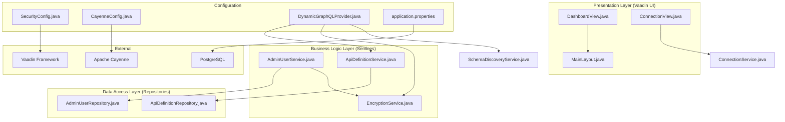
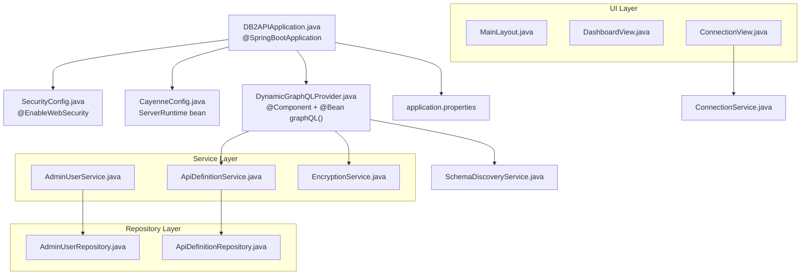
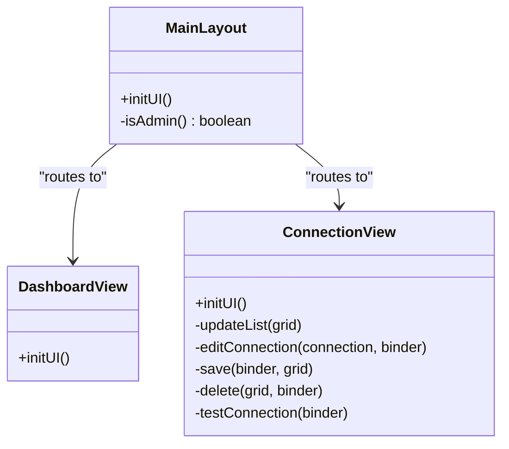
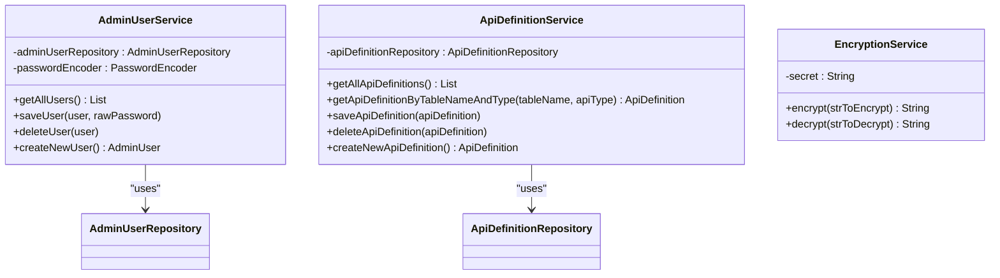
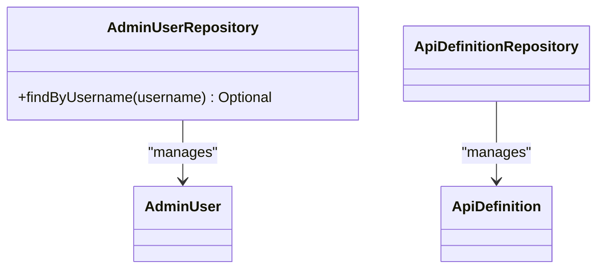
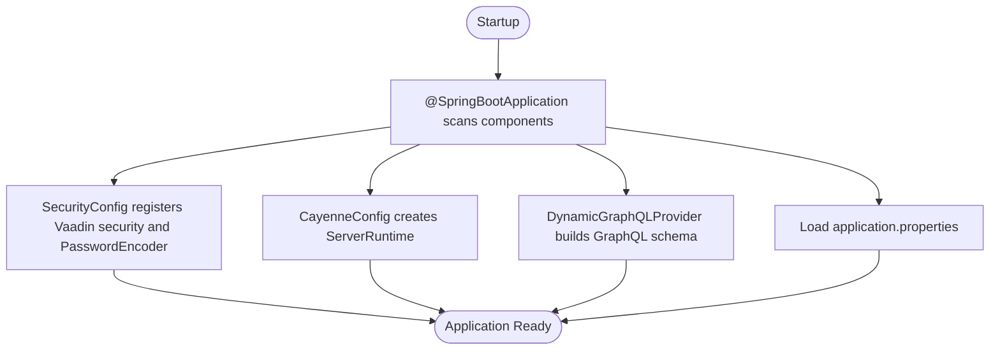
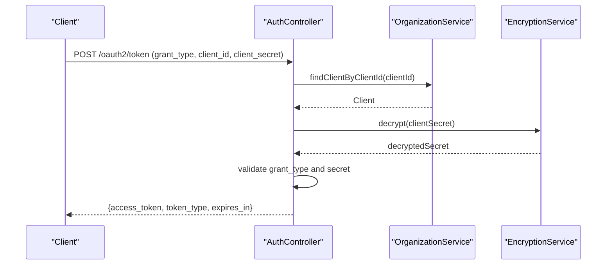
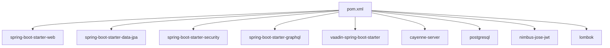

# Layered Architecture

<cite>
**Referenced Files in This Document**
- [DB2APIApplication.java](file://src/main/java/com/db2api/DB2APIApplication.java)
- [SecurityConfig.java](file://src/main/java/com/db2api/config/SecurityConfig.java)
- [CayenneConfig.java](file://src/main/java/com/db2api/config/CayenneConfig.java)
- [DynamicGraphQLProvider.java](file://src/main/java/com/db2api/config/DynamicGraphQLProvider.java)
- [application.properties](file://src/main/resources/application.properties)
- [AuthController.java](file://src/main/java/com/db2api/controller/AuthController.java)
- [AdminUserService.java](file://src/main/java/com/db2api/service/admin/AdminUserService.java)
- [AdminUserRepository.java](file://src/main/java/com/db2api/repository/admin/AdminUserRepository.java)
- [ApiDefinitionService.java](file://src/main/java/com/db2api/service/api/ApiDefinitionService.java)
- [ApiDefinition.java](file://src/main/java/com/db2api/persistent/api/ApiDefinition.java)
- [EncryptionService.java](file://src/main/java/com/db2api/service/EncryptionService.java)
- [ConnectionView.java](file://src/main/java/com/db2api/ui/connection/ConnectionView.java)
- [MainLayout.java](file://src/main/java/com/db2api/ui/MainLayout.java)
- [DashboardView.java](file://src/main/java/com/db2api/ui/DashboardView.java)
- [pom.xml](file://pom.xml)
</cite>

## Table of Contents
1. [Introduction](#introduction)
2. [Project Structure](#project-structure)
3. [Core Components](#core-components)
4. [Architecture Overview](#architecture-overview)
5. [Detailed Component Analysis](#detailed-component-analysis)
6. [Dependency Analysis](#dependency-analysis)
7. [Performance Considerations](#performance-considerations)
8. [Troubleshooting Guide](#troubleshooting-guide)
9. [Conclusion](#conclusion)

## Introduction
This document describes the layered architecture of the DB2API platform. The system follows a clean separation of concerns across three primary layers:
- Presentation layer (Vaadin UI): Provides the web-based administration interface.
- Business logic layer (Service classes): Encapsulates domain-specific workflows and orchestrates repositories and external services.
- Data access layer (Repository pattern): Abstracts persistence operations using Spring Data JPA.

Additional configuration is handled through dedicated configuration classes for security, database integration (Apache Cayenne), and dynamic GraphQL schema generation. Spring Boot’s dependency injection and component scanning enable loose coupling and modular development.

## Project Structure
The project is organized by functional layers and bounded contexts:
- config: Application configuration (security, database, GraphQL provider)
- controller: REST endpoints (OAuth2 token endpoint)
- persistent: JPA entity models
- repository: Spring Data repositories
- service: Business logic services
- ui: Vaadin views and layouts
- resources: Application properties and mapping configurations

**Diagram sources**
- [DB2APIApplication.java:13-24](file://src/main/java/com/db2api/DB2APIApplication.java#L13-L24)
- [SecurityConfig.java:15-51](file://src/main/java/com/db2api/config/SecurityConfig.java#L15-L51)
- [CayenneConfig.java:12-28](file://src/main/java/com/db2api/config/CayenneConfig.java#L12-L28)
- [DynamicGraphQLProvider.java:31-132](file://src/main/java/com/db2api/config/DynamicGraphQLProvider.java#L31-L132)
- [application.properties:1-20](file://src/main/resources/application.properties#L1-L20)
- [AdminUserService.java:11-40](file://src/main/java/com/db2api/service/admin/AdminUserService.java#L11-L40)
- [AdminUserRepository.java:12-22](file://src/main/java/com/db2api/repository/admin/AdminUserRepository.java#L12-L22)
- [ApiDefinitionService.java:10-38](file://src/main/java/com/db2api/service/api/ApiDefinitionService.java#L10-L38)
- [ApiDefinition.java:13-56](file://src/main/java/com/db2api/persistent/api/ApiDefinition.java#L13-L56)
- [EncryptionService.java:13-58](file://src/main/java/com/db2api/service/EncryptionService.java#L13-L58)
- [ConnectionView.java:27-43](file://src/main/java/com/db2api/ui/connection/ConnectionView.java#L27-L43)
- [MainLayout.java:22-75](file://src/main/java/com/db2api/ui/MainLayout.java#L22-L75)
- [DashboardView.java:12-33](file://src/main/java/com/db2api/ui/DashboardView.java#L12-L33)

**Section sources**
- [DB2APIApplication.java:13-24](file://src/main/java/com/db2api/DB2APIApplication.java#L13-L24)
- [application.properties:1-20](file://src/main/resources/application.properties#L1-L20)

## Core Components
- Presentation layer (Vaadin UI):
  - MainLayout provides navigation and role-aware visibility.
  - DashboardView displays the landing page.
  - ConnectionView manages database connection records and tests connectivity via the service layer.
- Business logic layer (Services):
  - AdminUserService coordinates admin user operations and delegates password encoding to Spring Security’s PasswordEncoder.
  - ApiDefinitionService manages API definition entities.
  - EncryptionService handles symmetric encryption/decryption for secrets.
- Data access layer (Repositories):
  - AdminUserRepository extends JpaRepository for CRUD operations.
  - ApiDefinitionRepository is used by ApiDefinitionService for persistence.
- Configuration:
  - SecurityConfig integrates Vaadin Web Security and sets the login view.
  - CayenneConfig builds a ServerRuntime for dynamic database interactions.
  - DynamicGraphQLProvider generates a runtime GraphQL schema from API definitions and exposes data fetchers.
  - application.properties defines datasource, JPA/Hibernate, and Vaadin settings.

**Section sources**
- [MainLayout.java:22-75](file://src/main/java/com/db2api/ui/MainLayout.java#L22-L75)
- [DashboardView.java:12-33](file://src/main/java/com/db2api/ui/DashboardView.java#L12-L33)
- [ConnectionView.java:27-43](file://src/main/java/com/db2api/ui/connection/ConnectionView.java#L27-L43)
- [AdminUserService.java:11-40](file://src/main/java/com/db2api/service/admin/AdminUserService.java#L11-L40)
- [AdminUserRepository.java:12-22](file://src/main/java/com/db2api/repository/admin/AdminUserRepository.java#L12-L22)
- [ApiDefinitionService.java:10-38](file://src/main/java/com/db2api/service/api/ApiDefinitionService.java#L10-L38)
- [EncryptionService.java:13-58](file://src/main/java/com/db2api/service/EncryptionService.java#L13-L58)
- [SecurityConfig.java:15-51](file://src/main/java/com/db2api/config/SecurityConfig.java#L15-L51)
- [CayenneConfig.java:12-28](file://src/main/java/com/db2api/config/CayenneConfig.java#L12-L28)
- [DynamicGraphQLProvider.java:31-132](file://src/main/java/com/db2api/config/DynamicGraphQLProvider.java#L31-L132)
- [application.properties:1-20](file://src/main/resources/application.properties#L1-L20)

## Architecture Overview
The system leverages Spring Boot’s auto-configuration and component scanning to wire beans declared in configuration classes and annotated components. The Vaadin UI interacts with services, which in turn use repositories for persistence. Security is integrated via Vaadin’s security adapter. Dynamic GraphQL schema generation is driven by API definitions and database metadata discovery.

**Diagram sources**
- [DB2APIApplication.java:13-24](file://src/main/java/com/db2api/DB2APIApplication.java#L13-L24)
- [SecurityConfig.java:15-51](file://src/main/java/com/db2api/config/SecurityConfig.java#L15-L51)
- [CayenneConfig.java:12-28](file://src/main/java/com/db2api/config/CayenneConfig.java#L12-L28)
- [DynamicGraphQLProvider.java:31-132](file://src/main/java/com/db2api/config/DynamicGraphQLProvider.java#L31-L132)
- [application.properties:1-20](file://src/main/resources/application.properties#L1-L20)
- [AdminUserService.java:11-40](file://src/main/java/com/db2api/service/admin/AdminUserService.java#L11-L40)
- [AdminUserRepository.java:12-22](file://src/main/java/com/db2api/repository/admin/AdminUserRepository.java#L12-L22)
- [ApiDefinitionService.java:10-38](file://src/main/java/com/db2api/service/api/ApiDefinitionService.java#L10-L38)
- [EncryptionService.java:13-58](file://src/main/java/com/db2api/service/EncryptionService.java#L13-L58)
- [ConnectionView.java:27-43](file://src/main/java/com/db2api/ui/connection/ConnectionView.java#L27-L43)

## Detailed Component Analysis

### Presentation Layer (Vaadin UI)
- MainLayout: Centralized navigation with role-aware items and a drawer toggle.
- DashboardView: Welcome screen under the main layout.
- ConnectionView: CRUD operations for database connections, form binding, and connectivity testing via the service layer.

**Diagram sources**
- [MainLayout.java:22-75](file://src/main/java/com/db2api/ui/MainLayout.java#L22-L75)
- [DashboardView.java:12-33](file://src/main/java/com/db2api/ui/DashboardView.java#L12-L33)
- [ConnectionView.java:27-43](file://src/main/java/com/db2api/ui/connection/ConnectionView.java#L27-L43)

**Section sources**
- [MainLayout.java:22-75](file://src/main/java/com/db2api/ui/MainLayout.java#L22-L75)
- [DashboardView.java:12-33](file://src/main/java/com/db2api/ui/DashboardView.java#L12-L33)
- [ConnectionView.java:27-43](file://src/main/java/com/db2api/ui/connection/ConnectionView.java#L27-L43)

### Business Logic Layer (Services)
- AdminUserService: Encapsulates admin user operations and delegates password encoding to a PasswordEncoder bean.
- ApiDefinitionService: Manages API definition entities and exposes creation helpers.
- EncryptionService: Provides symmetric encryption/decryption for secrets using AES.

**Diagram sources**
- [AdminUserService.java:11-40](file://src/main/java/com/db2api/service/admin/AdminUserService.java#L11-L40)
- [AdminUserRepository.java:12-22](file://src/main/java/com/db2api/repository/admin/AdminUserRepository.java#L12-L22)
- [ApiDefinitionService.java:10-38](file://src/main/java/com/db2api/service/api/ApiDefinitionService.java#L10-L38)
- [EncryptionService.java:13-58](file://src/main/java/com/db2api/service/EncryptionService.java#L13-L58)

**Section sources**
- [AdminUserService.java:11-40](file://src/main/java/com/db2api/service/admin/AdminUserService.java#L11-L40)
- [ApiDefinitionService.java:10-38](file://src/main/java/com/db2api/service/api/ApiDefinitionService.java#L10-L38)
- [EncryptionService.java:13-58](file://src/main/java/com/db2api/service/EncryptionService.java#L13-L58)

### Data Access Layer (Repositories)
- AdminUserRepository: JPA repository with a custom finder by username.
- ApiDefinitionRepository: Used by ApiDefinitionService for persistence operations.

**Diagram sources**
- [AdminUserRepository.java:12-22](file://src/main/java/com/db2api/repository/admin/AdminUserRepository.java#L12-L22)
- [ApiDefinition.java:13-56](file://src/main/java/com/db2api/persistent/api/ApiDefinition.java#L13-L56)

**Section sources**
- [AdminUserRepository.java:12-22](file://src/main/java/com/db2api/repository/admin/AdminUserRepository.java#L12-L22)
- [ApiDefinition.java:13-56](file://src/main/java/com/db2api/persistent/api/ApiDefinition.java#L13-L56)

### Configuration Layer
- SecurityConfig: Extends Vaadin Web Security, sets the login view, and provides a BCrypt password encoder bean.
- CayenneConfig: Builds an Apache Cayenne ServerRuntime using the configured DataSource.
- DynamicGraphQLProvider: Generates a runtime GraphQL schema from API definitions, wiring data fetchers and handling decryption of connection secrets.
- application.properties: Defines server port, PostgreSQL datasource, JPA/Hibernate settings, and Vaadin launch browser flag.

**Diagram sources**
- [DB2APIApplication.java:13-24](file://src/main/java/com/db2api/DB2APIApplication.java#L13-L24)
- [SecurityConfig.java:15-51](file://src/main/java/com/db2api/config/SecurityConfig.java#L15-L51)
- [CayenneConfig.java:12-28](file://src/main/java/com/db2api/config/CayenneConfig.java#L12-L28)
- [DynamicGraphQLProvider.java:31-132](file://src/main/java/com/db2api/config/DynamicGraphQLProvider.java#L31-L132)
- [application.properties:1-20](file://src/main/resources/application.properties#L1-L20)

**Section sources**
- [SecurityConfig.java:15-51](file://src/main/java/com/db2api/config/SecurityConfig.java#L15-L51)
- [CayenneConfig.java:12-28](file://src/main/java/com/db2api/config/CayenneConfig.java#L12-L28)
- [DynamicGraphQLProvider.java:31-132](file://src/main/java/com/db2api/config/DynamicGraphQLProvider.java#L31-L132)
- [application.properties:1-20](file://src/main/resources/application.properties#L1-L20)

### REST Endpoint (OAuth2 Token Issuance)
- AuthController: Implements a token endpoint supporting client_credentials grant type, validates client credentials against encrypted secrets, and issues a signed JWT.

**Diagram sources**
- [AuthController.java:25-110](file://src/main/java/com/db2api/controller/AuthController.java#L25-L110)
- [EncryptionService.java:13-58](file://src/main/java/com/db2api/service/EncryptionService.java#L13-L58)

**Section sources**
- [AuthController.java:25-110](file://src/main/java/com/db2api/controller/AuthController.java#L25-L110)
- [EncryptionService.java:13-58](file://src/main/java/com/db2api/service/EncryptionService.java#L13-L58)

### Architectural Patterns
- Repository pattern: Implemented via Spring Data JPA repositories for persistence abstraction.
- Service layer encapsulation: Services orchestrate repositories and external services, enforcing business rules and transaction boundaries.
- Factory-like behavior for GraphQL providers: DynamicGraphQLProvider dynamically constructs the schema and data fetchers at runtime based on API definitions.
- Dependency Injection and component scanning: Spring Boot auto-configures beans and injects dependencies across layers.

**Section sources**
- [AdminUserRepository.java:12-22](file://src/main/java/com/db2api/repository/admin/AdminUserRepository.java#L12-L22)
- [ApiDefinitionService.java:10-38](file://src/main/java/com/db2api/service/api/ApiDefinitionService.java#L10-L38)
- [DynamicGraphQLProvider.java:31-132](file://src/main/java/com/db2api/config/DynamicGraphQLProvider.java#L31-L132)
- [DB2APIApplication.java:13-24](file://src/main/java/com/db2api/DB2APIApplication.java#L13-L24)

## Dependency Analysis
The system relies on Spring Boot starters and third-party libraries for web, security, JPA, GraphQL, Vaadin, and JWT signing. The build configuration declares these dependencies and manages the Vaadin Bill of Materials.

**Diagram sources**
- [pom.xml:25-98](file://pom.xml#L25-L98)

**Section sources**
- [pom.xml:25-98](file://pom.xml#L25-L98)

## Performance Considerations
- GraphQL schema generation occurs at initialization and when definitions change; consider caching and incremental updates for large schemas.
- Encryption operations are lightweight but should be profiled in high-throughput scenarios.
- JPA/Hibernate DDL auto-update is convenient for development; disable in production and manage migrations explicitly.
- Vaadin view rendering and grid updates should be optimized with lazy loading and virtualization for large datasets.

## Troubleshooting Guide
- Authentication failures:
  - Verify client credentials match decrypted values and grant type is client_credentials.
  - Confirm JWT secret property is present and accessible.
- GraphQL schema errors:
  - Ensure API definitions exist and table names are valid.
  - Check that schema discovery returns column metadata for the target tables.
- Database connectivity:
  - Validate datasource URL, username, and password in application properties.
  - Confirm PostgreSQL availability and network accessibility.
- UI navigation issues:
  - Ensure MainLayout is applied to views and role authorities are correctly set for admin-only items.

**Section sources**
- [AuthController.java:54-109](file://src/main/java/com/db2api/controller/AuthController.java#L54-L109)
- [DynamicGraphQLProvider.java:77-132](file://src/main/java/com/db2api/config/DynamicGraphQLProvider.java#L77-L132)
- [application.properties:7-16](file://src/main/resources/application.properties#L7-L16)
- [MainLayout.java:36-42](file://src/main/java/com/db2api/ui/MainLayout.java#L36-L42)

## Conclusion
DB2API employs a clean layered architecture with explicit separation between presentation, business logic, and data access. Spring Boot’s dependency injection and component scanning simplify wiring, while dedicated configuration classes handle security, database integration, and dynamic GraphQL schema generation. The Repository pattern and Service layer encapsulation promote maintainability and testability, enabling future extensions such as additional API types and enhanced schema discovery.