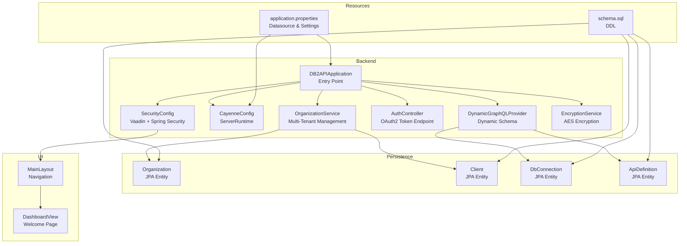
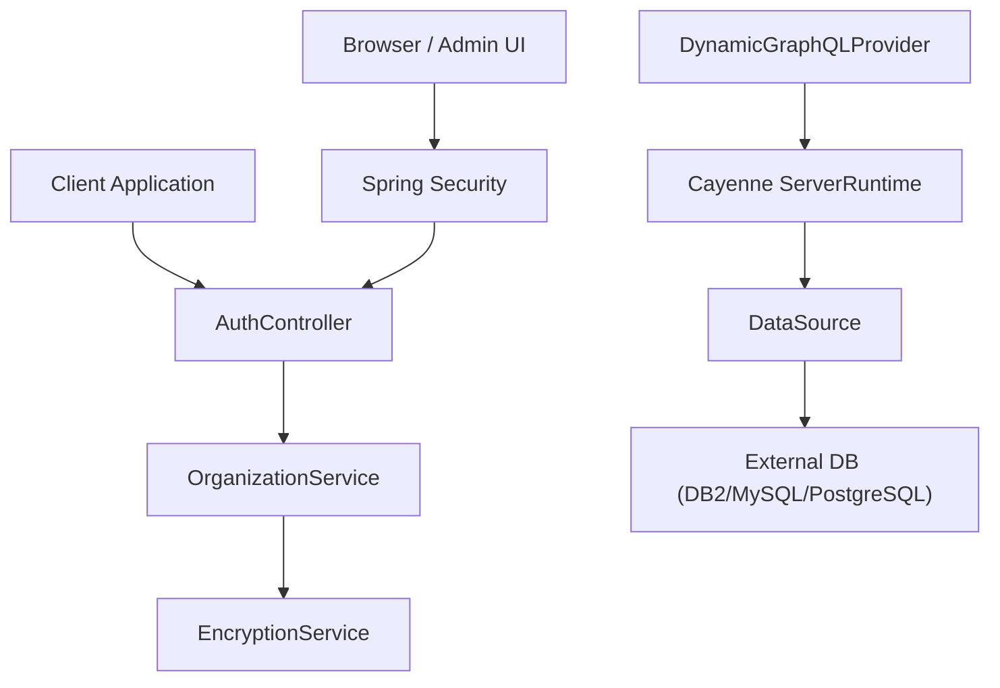
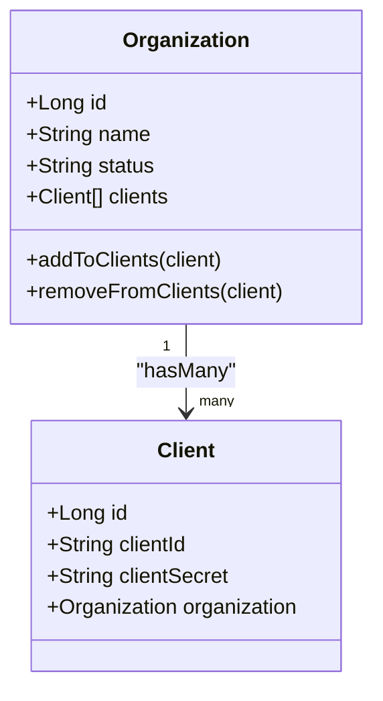
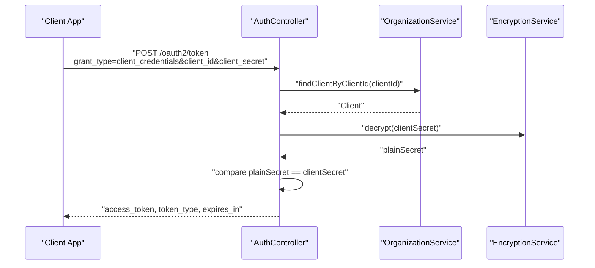
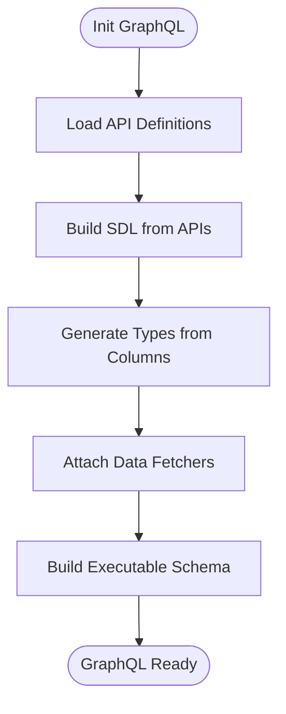
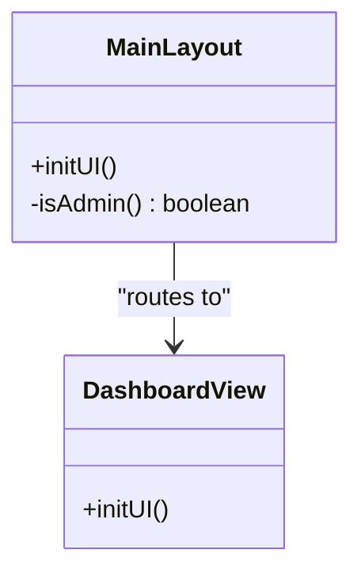
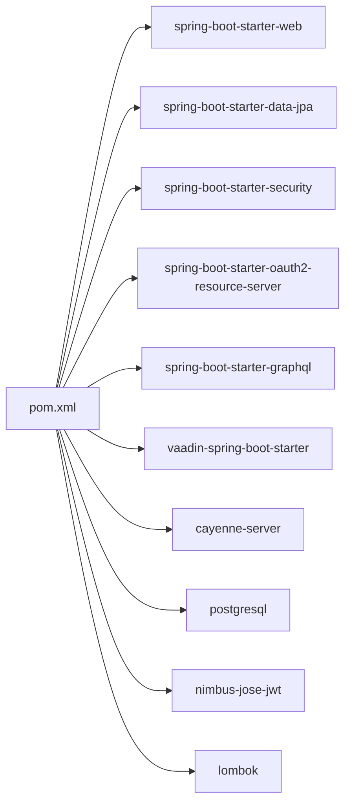

# System Overview

<cite>
**Referenced Files in This Document**
- [README.md](file://README.md)
- [DB2APIApplication.java](file://src/main/java/com/db2api/DB2APIApplication.java)
- [application.properties](file://src/main/resources/application.properties)
- [pom.xml](file://pom.xml)
- [SecurityConfig.java](file://src/main/java/com/db2api/config/SecurityConfig.java)
- [CayenneConfig.java](file://src/main/java/com/db2api/config/CayenneConfig.java)
- [DynamicGraphQLProvider.java](file://src/main/java/com/db2api/config/DynamicGraphQLProvider.java)
- [Organization.java](file://src/main/java/com/db2api/persistent/organization/Organization.java)
- [Client.java](file://src/main/java/com/db2api/persistent/organization/Client.java)
- [OrganizationService.java](file://src/main/java/com/db2api/service/organization/OrganizationService.java)
- [AuthController.java](file://src/main/java/com/db2api/controller/AuthController.java)
- [EncryptionService.java](file://src/main/java/com/db2api/service/EncryptionService.java)
- [MainLayout.java](file://src/main/java/com/db2api/ui/MainLayout.java)
- [DashboardView.java](file://src/main/java/com/db2api/ui/DashboardView.java)
- [schema.sql](file://src/main/resources/schema.sql)
</cite>

## Table of Contents
1. [Introduction](#introduction)
2. [Project Structure](#project-structure)
3. [Core Components](#core-components)
4. [Architecture Overview](#architecture-overview)
5. [Detailed Component Analysis](#detailed-component-analysis)
6. [Dependency Analysis](#dependency-analysis)
7. [Performance Considerations](#performance-considerations)
8. [Troubleshooting Guide](#troubleshooting-guide)
9. [Conclusion](#conclusion)

## Introduction
DB2API is a database connectivity and API management platform designed to automatically generate REST and GraphQL APIs from existing database schemas. It targets enterprise scenarios where rapid API provisioning, secure access control, and dynamic schema exposure are required. The platform emphasizes:
- Multi-tenancy through organizations and client credentials
- Secure by design with JWT-based authentication and role-based access control
- Intuitive administration via a Vaadin-based UI
- Dynamic API generation powered by Apache Cayenne and Spring technologies

## Project Structure
The repository follows a layered architecture with clear separation of concerns:
- Backend: Spring Boot application with Vaadin UI, Spring Security, GraphQL, and JPA
- Persistence: Apache Cayenne ORM integrated with Spring Data JPA repositories
- Frontend: Vaadin views and layouts for administration and management
- Configuration: Spring configuration for security, GraphQL, and data source wiring

**Diagram sources**
- [DB2APIApplication.java:1-27](file://src/main/java/com/db2api/DB2APIApplication.java#L1-L27)
- [SecurityConfig.java:1-52](file://src/main/java/com/db2api/config/SecurityConfig.java#L1-L52)
- [CayenneConfig.java:1-29](file://src/main/java/com/db2api/config/CayenneConfig.java#L1-L29)
- [DynamicGraphQLProvider.java:1-178](file://src/main/java/com/db2api/config/DynamicGraphQLProvider.java#L1-L178)
- [AuthController.java:1-111](file://src/main/java/com/db2api/controller/AuthController.java#L1-L111)
- [OrganizationService.java:1-83](file://src/main/java/com/db2api/service/organization/OrganizationService.java#L1-L83)
- [EncryptionService.java:1-59](file://src/main/java/com/db2api/service/EncryptionService.java#L1-L59)
- [MainLayout.java:1-76](file://src/main/java/com/db2api/ui/MainLayout.java#L1-L76)
- [DashboardView.java:1-34](file://src/main/java/com/db2api/ui/DashboardView.java#L1-L34)
- [application.properties:1-20](file://src/main/resources/application.properties#L1-L20)
- [schema.sql:1-39](file://src/main/resources/schema.sql#L1-L39)

**Section sources**
- [README.md:65-82](file://README.md#L65-L82)
- [DB2APIApplication.java:1-27](file://src/main/java/com/db2api/DB2APIApplication.java#L1-L27)
- [application.properties:1-20](file://src/main/resources/application.properties#L1-L20)
- [pom.xml:25-99](file://pom.xml#L25-L99)

## Core Components
- Application entry point and theme configuration
- Security and authentication pipeline
- Dynamic GraphQL schema provider
- Multi-tenant organization and client management
- Encryption service for secrets
- UI layout and dashboard

Key implementation references:
- Application bootstrap and theme: [DB2APIApplication.java:13-24](file://src/main/java/com/db2api/DB2APIApplication.java#L13-L24)
- Security configuration and login view: [SecurityConfig.java:36-40](file://src/main/java/com/db2api/config/SecurityConfig.java#L36-L40)
- GraphQL schema generation and data fetchers: [DynamicGraphQLProvider.java:77-132](file://src/main/java/com/db2api/config/DynamicGraphQLProvider.java#L77-L132)
- Organization and client entities: [Organization.java:14-64](file://src/main/java/com/db2api/persistent/organization/Organization.java#L14-L64), [Client.java:11-42](file://src/main/java/com/db2api/persistent/organization/Client.java#L11-L42)
- Client credential lifecycle and encryption: [OrganizationService.java:48-63](file://src/main/java/com/db2api/service/organization/OrganizationService.java#L48-L63), [EncryptionService.java:35-57](file://src/main/java/com/db2api/service/EncryptionService.java#L35-L57)
- OAuth2 token endpoint: [AuthController.java:54-109](file://src/main/java/com/db2api/controller/AuthController.java#L54-L109)
- UI navigation and dashboard: [MainLayout.java:49-74](file://src/main/java/com/db2api/ui/MainLayout.java#L49-L74), [DashboardView.java:19-32](file://src/main/java/com/db2api/ui/DashboardView.java#L19-L32)

**Section sources**
- [README.md:10-18](file://README.md#L10-L18)
- [DynamicGraphQLProvider.java:77-132](file://src/main/java/com/db2api/config/DynamicGraphQLProvider.java#L77-L132)
- [OrganizationService.java:48-63](file://src/main/java/com/db2api/service/organization/OrganizationService.java#L48-L63)
- [AuthController.java:54-109](file://src/main/java/com/db2api/controller/AuthController.java#L54-L109)

## Architecture Overview
The system is a Spring Boot application with:
- A Vaadin UI for administration and management
- Spring Security for authentication and authorization
- Apache Cayenne for ORM and dynamic database interactions
- Spring GraphQL for dynamic schema generation
- JPA repositories backed by a system database

**Diagram sources**
- [AuthController.java:54-109](file://src/main/java/com/db2api/controller/AuthController.java#L54-L109)
- [OrganizationService.java:48-63](file://src/main/java/com/db2api/service/organization/OrganizationService.java#L48-L63)
- [EncryptionService.java:35-57](file://src/main/java/com/db2api/service/EncryptionService.java#L35-L57)
- [DynamicGraphQLProvider.java:77-132](file://src/main/java/com/db2api/config/DynamicGraphQLProvider.java#L77-L132)
- [CayenneConfig.java:22-27](file://src/main/java/com/db2api/config/CayenneConfig.java#L22-L27)
- [application.properties:7-16](file://src/main/resources/application.properties#L7-L16)

## Detailed Component Analysis

### Multi-Tenant Architecture: Organizations and Clients
The platform supports multi-tenancy by organizing clients under organizations. Each client is uniquely identified by a client_id and uses a client_secret for authentication. Secrets are stored encrypted and decrypted during runtime.

**Diagram sources**
- [Organization.java:14-64](file://src/main/java/com/db2api/persistent/organization/Organization.java#L14-L64)
- [Client.java:11-42](file://src/main/java/com/db2api/persistent/organization/Client.java#L11-L42)

Implementation highlights:
- Organization entity and client relationship: [Organization.java:42-43](file://src/main/java/com/db2api/persistent/organization/Organization.java#L42-L43), [Client.java:39-41](file://src/main/java/com/db2api/persistent/organization/Client.java#L39-L41)
- Client credential generation and encryption: [OrganizationService.java:53-60](file://src/main/java/com/db2api/service/organization/OrganizationService.java#L53-L60), [EncryptionService.java:35-57](file://src/main/java/com/db2api/service/EncryptionService.java#L35-L57)

**Section sources**
- [Organization.java:14-64](file://src/main/java/com/db2api/persistent/organization/Organization.java#L14-L64)
- [Client.java:11-42](file://src/main/java/com/db2api/persistent/organization/Client.java#L11-L42)
- [OrganizationService.java:48-63](file://src/main/java/com/db2api/service/organization/OrganizationService.java#L48-L63)
- [EncryptionService.java:35-57](file://src/main/java/com/db2api/service/EncryptionService.java#L35-L57)

### Authentication and Authorization Flow
The platform uses OAuth2 client_credentials grant to issue JWT tokens. The flow validates client credentials against encrypted secrets and produces a signed JWT.

**Diagram sources**
- [AuthController.java:54-109](file://src/main/java/com/db2api/controller/AuthController.java#L54-L109)
- [OrganizationService.java:79-81](file://src/main/java/com/db2api/service/organization/OrganizationService.java#L79-L81)
- [EncryptionService.java:47-57](file://src/main/java/com/db2api/service/EncryptionService.java#L47-L57)

**Section sources**
- [AuthController.java:54-109](file://src/main/java/com/db2api/controller/AuthController.java#L54-L109)
- [OrganizationService.java:79-81](file://src/main/java/com/db2api/service/organization/OrganizationService.java#L79-L81)
- [EncryptionService.java:47-57](file://src/main/java/com/db2api/service/EncryptionService.java#L47-L57)

### Dynamic GraphQL Schema Provider
The DynamicGraphQLProvider builds a runtime executable schema from API definitions, generating query fields and types based on configured database tables and columns.

**Diagram sources**
- [DynamicGraphQLProvider.java:77-132](file://src/main/java/com/db2api/config/DynamicGraphQLProvider.java#L77-L132)

**Section sources**
- [DynamicGraphQLProvider.java:77-132](file://src/main/java/com/db2api/config/DynamicGraphQLProvider.java#L77-L132)

### UI Navigation and Access Control
The MainLayout component constructs the navigation menu and conditionally displays admin-only items based on the authenticated user’s roles. The DashboardView serves as the landing page for authenticated users.

**Diagram sources**
- [MainLayout.java:49-74](file://src/main/java/com/db2api/ui/MainLayout.java#L49-L74)
- [DashboardView.java:19-32](file://src/main/java/com/db2api/ui/DashboardView.java#L19-L32)

**Section sources**
- [MainLayout.java:36-42](file://src/main/java/com/db2api/ui/MainLayout.java#L36-L42)
- [DashboardView.java:19-32](file://src/main/java/com/db2api/ui/DashboardView.java#L19-L32)

## Dependency Analysis
The project leverages a modern stack with strong integration points:
- Spring Boot starters for web, data JPA, security, GraphQL, and Vaadin
- Apache Cayenne for ORM and dynamic runtime configuration
- Nimbus JOSE + JWT for JWT signing and claims
- PostgreSQL JDBC driver for the system database

**Diagram sources**
- [pom.xml:25-99](file://pom.xml#L25-L99)

**Section sources**
- [pom.xml:25-99](file://pom.xml#L25-L99)

## Performance Considerations
- Encryption overhead: AES encryption/decryption occurs during client secret validation and connection password retrieval. Consider caching decrypted secrets per tenant session to reduce repeated decryption costs.
- GraphQL schema refresh: Recreating the schema on demand is efficient for small to medium datasets. For large schemas, consider incremental updates and caching strategies.
- Database connectivity: External database connections are established per request. Pooling and connection reuse can improve throughput and reduce latency.
- UI rendering: Vaadin components render server-side; optimize view composition and lazy loading for large datasets.

## Troubleshooting Guide
Common issues and resolutions:
- Authentication failures:
  - Verify client credentials and ensure client_secret matches the decrypted value.
  - Confirm the client exists and belongs to the correct organization.
  - Check JWT secret configuration and signing process.
  - References: [AuthController.java:77-87](file://src/main/java/com/db2api/controller/AuthController.java#L77-L87), [EncryptionService.java:47-57](file://src/main/java/com/db2api/service/EncryptionService.java#L47-L57)
- GraphQL schema errors:
  - Ensure API definitions exist and reference valid tables.
  - Validate column discovery and type mapping.
  - References: [DynamicGraphQLProvider.java:115-119](file://src/main/java/com/db2api/config/DynamicGraphQLProvider.java#L115-L119), [DynamicGraphQLProvider.java:107](file://src/main/java/com/db2api/config/DynamicGraphQLProvider.java#L107)
- Database connectivity:
  - Confirm datasource configuration and external DB reachability.
  - Verify driver class and credentials for external connections.
  - References: [application.properties:7-16](file://src/main/resources/application.properties#L7-L16)
- UI navigation:
  - Ensure proper role assignment for admin-only views.
  - References: [MainLayout.java:36-42](file://src/main/java/com/db2api/ui/MainLayout.java#L36-L42)

**Section sources**
- [AuthController.java:77-87](file://src/main/java/com/db2api/controller/AuthController.java#L77-L87)
- [EncryptionService.java:47-57](file://src/main/java/com/db2api/service/EncryptionService.java#L47-L57)
- [DynamicGraphQLProvider.java:115-119](file://src/main/java/com/db2api/config/DynamicGraphQLProvider.java#L115-L119)
- [application.properties:7-16](file://src/main/resources/application.properties#L7-L16)
- [MainLayout.java:36-42](file://src/main/java/com/db2api/ui/MainLayout.java#L36-L42)

## Conclusion
DB2API delivers a robust, multi-tenant platform for enterprise database integration. Its combination of dynamic API generation, secure authentication, and an intuitive administration UI positions it well for rapid provisioning and management of database-driven APIs. The architecture balances flexibility with security, leveraging proven technologies to support diverse SQL databases and evolving API needs.