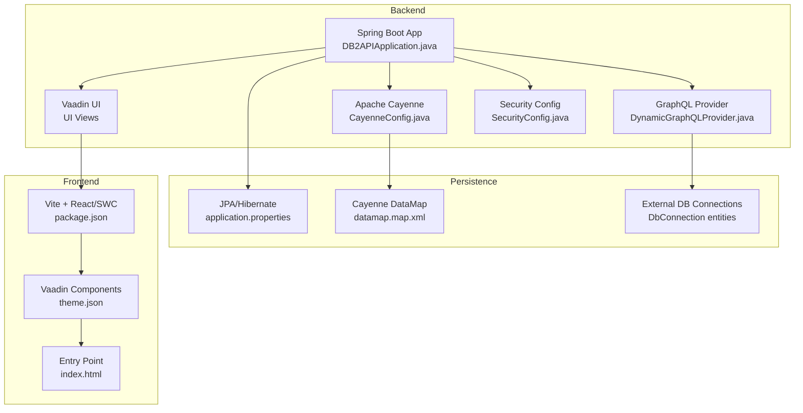
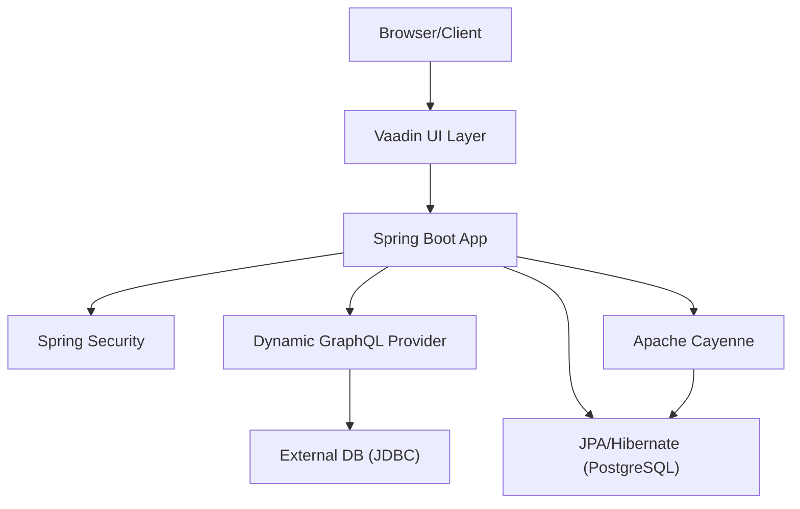
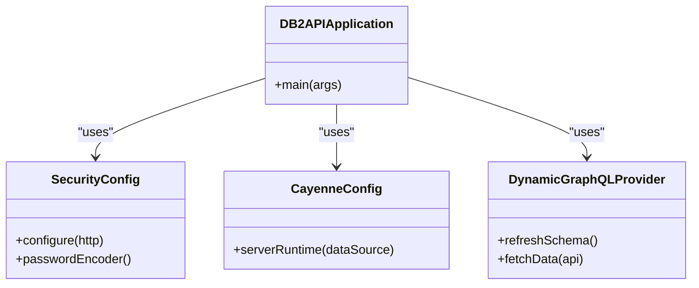
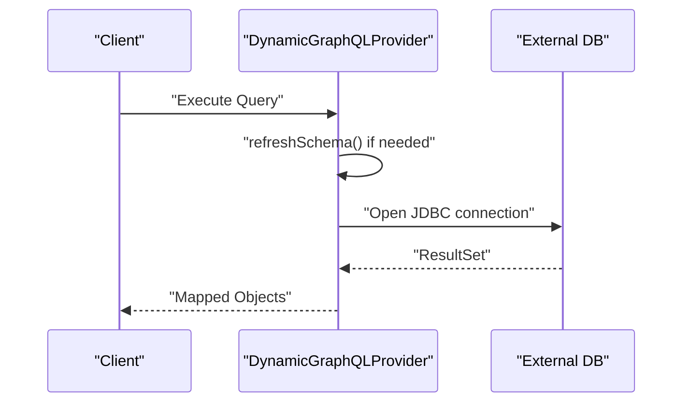
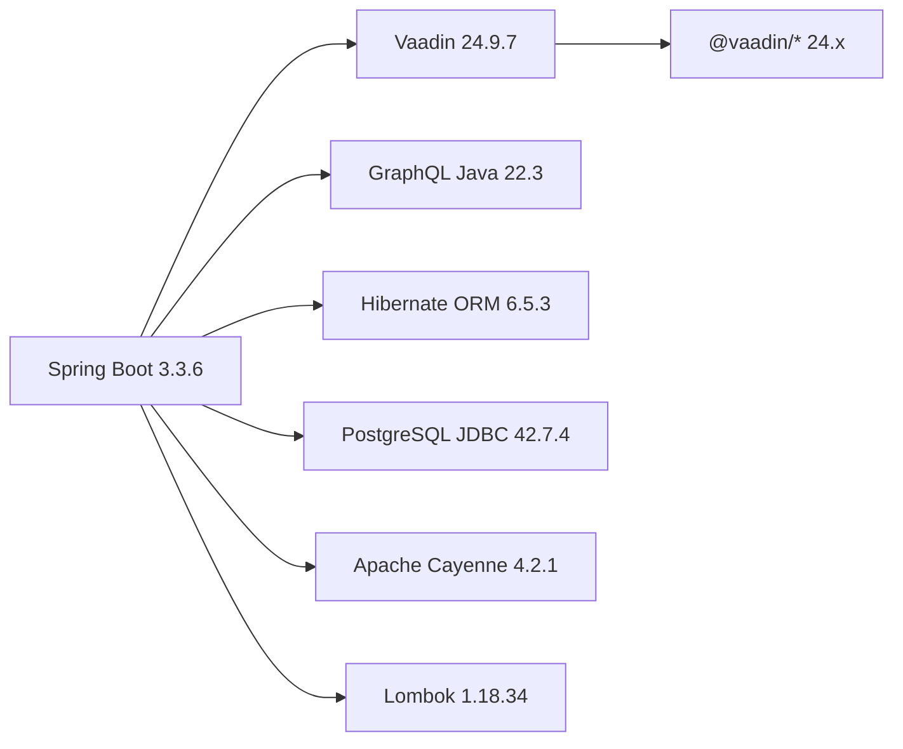

# Technology Stack

<cite>
**Referenced Files in This Document**
- [pom.xml](file://pom.xml)
- [effective-pom.xml](file://effective-pom.xml)
- [package.json](file://package.json)
- [application.properties](file://src/main/resources/application.properties)
- [cayenne-project.xml](file://src/main/resources/cayenne-project.xml)
- [datamap.map.xml](file://src/main/resources/datamap.map.xml)
- [DB2APIApplication.java](file://src/main/java/com/db2api/DB2APIApplication.java)
- [CayenneConfig.java](file://src/main/java/com/db2api/config/CayenneConfig.java)
- [DynamicGraphQLProvider.java](file://src/main/java/com/db2api/config/DynamicGraphQLProvider.java)
- [SecurityConfig.java](file://src/main/java/com/db2api/config/SecurityConfig.java)
- [README.md](file://README.md)
- [index.html](file://frontend/index.html)
- [theme.json](file://frontend/themes/db2api/theme.json)
</cite>

## Table of Contents
1. [Introduction](#introduction)
2. [Project Structure](#project-structure)
3. [Core Components](#core-components)
4. [Architecture Overview](#architecture-overview)
5. [Detailed Component Analysis](#detailed-component-analysis)
6. [Dependency Analysis](#dependency-analysis)
7. [Performance Considerations](#performance-considerations)
8. [Troubleshooting Guide](#troubleshooting-guide)
9. [Conclusion](#conclusion)
10. [Appendices](#appendices)

## Introduction
This document provides a comprehensive technology stack overview for the DB2API platform. It covers backend frameworks (Spring Boot 3.x, Vaadin 24.x, Apache Cayenne, GraphQL, JPA/Hibernate), frontend technologies (TypeScript/HTML/CSS via Vaadin), build tools (Maven and npm/Vite), and infrastructure dependencies. It also outlines version requirements, compatibility considerations, licensing, and community support aspects derived from the repository configuration.

## Project Structure
The project follows a layered, feature-based structure:
- Backend: Spring Boot application with Vaadin UI, Apache Cayenne for ORM, Spring Security, and Spring GraphQL
- Frontend: Vaadin-based UI with TypeScript and Vite tooling
- Persistence: JPA/Hibernate with PostgreSQL as the primary runtime database; Cayenne model maps to domain entities
- Build: Maven for Java, npm/Vite for frontend

**Diagram sources**
- [DB2APIApplication.java:13-24](file://src/main/java/com/db2api/DB2APIApplication.java#L13-L24)
- [CayenneConfig.java:12-27](file://src/main/java/com/db2api/config/CayenneConfig.java#L12-L27)
- [DynamicGraphQLProvider.java:32-132](file://src/main/java/com/db2api/config/DynamicGraphQLProvider.java#L32-L132)
- [SecurityConfig.java:17-50](file://src/main/java/com/db2api/config/SecurityConfig.java#L17-L50)
- [application.properties:7-16](file://src/main/resources/application.properties#L7-L16)
- [datamap.map.xml:6,40-65](file://src/main/resources/datamap.map.xml#L6,L40-L65)
- [package.json:74-91](file://package.json#L74-L91)
- [theme.json:1-9](file://frontend/themes/db2api/theme.json#L1-L9)
- [index.html:17-22](file://frontend/index.html#L17-L22)

**Section sources**
- [README.md:65-82](file://README.md#L65-L82)
- [DB2APIApplication.java:13-24](file://src/main/java/com/db2api/DB2APIApplication.java#L13-L24)
- [pom.xml:25-98](file://pom.xml#L25-L98)
- [package.json:74-91](file://package.json#L74-L91)

## Core Components
- Spring Boot 3.x: Application framework and dependency management via spring-boot-starter parent
- Vaadin 24.x: UI framework with Vaadin Spring Boot starter and BOM management
- Apache Cayenne 4.2.x: ORM for dynamic model mapping and runtime data access
- GraphQL Java: Dynamic schema generation and execution engine
- JPA/Hibernate: ORM for system database (PostgreSQL) and entity mapping
- Spring Security: Authentication and authorization (Vaadin Web Security integration)
- Frontend Toolchain: Vite, React/SWC, TypeScript, and Vaadin component libraries

**Section sources**
- [pom.xml:8,18,19,23](file://pom.xml#L8,L18,L19,L23)
- [effective-pom.xml:114,236,78,85,179](file://effective-pom.xml#L114,L236,L78,L85,L179)
- [application.properties:7-16](file://src/main/resources/application.properties#L7-L16)
- [README.md:19-35](file://README.md#L19-L35)

## Architecture Overview
The system architecture integrates a Spring Boot backend with Vaadin UI, Apache Cayenne for ORM, and a dynamic GraphQL provider. Data persistence uses JPA/Hibernate against PostgreSQL for system metadata and external JDBC connections for user-defined data sources.

**Diagram sources**
- [DB2APIApplication.java:13-24](file://src/main/java/com/db2api/DB2APIApplication.java#L13-L24)
- [SecurityConfig.java:37-40](file://src/main/java/com/db2api/config/SecurityConfig.java#L37-L40)
- [DynamicGraphQLProvider.java:58-132](file://src/main/java/com/db2api/config/DynamicGraphQLProvider.java#L58-L132)
- [CayenneConfig.java:22-27](file://src/main/java/com/db2api/config/CayenneConfig.java#L22-L27)
- [application.properties:7-16](file://src/main/resources/application.properties#L7-L16)

## Detailed Component Analysis

### Backend Framework: Spring Boot 3.x
- Version: 3.3.6 (from parent POM)
- Purpose: Application bootstrapping, auto-configuration, and dependency management
- Notable starters: web, data-jpa, security, oauth2-resource-server, graphql
- Java version: 21 (explicitly set)

**Section sources**
- [pom.xml:8,17,25-45](file://pom.xml#L8,L17,L25-L45)
- [effective-pom.xml:114,163](file://effective-pom.xml#L114,L163)

### UI Framework: Vaadin 24.x
- Version: 24.9.7 (BOM-managed)
- Integration: Vaadin Spring Boot starter and theme configuration
- Frontend toolchain: Vite, React/SWC, TypeScript
- Theme: Lumo-based custom theme

**Diagram sources**
- [DB2APIApplication.java:13-24](file://src/main/java/com/db2api/DB2APIApplication.java#L13-L24)
- [SecurityConfig.java:17-50](file://src/main/java/com/db2api/config/SecurityConfig.java#L17-L50)
- [CayenneConfig.java:12-27](file://src/main/java/com/db2api/config/CayenneConfig.java#L12-L27)
- [DynamicGraphQLProvider.java:32-132](file://src/main/java/com/db2api/config/DynamicGraphQLProvider.java#L32-L132)

**Section sources**
- [pom.xml:48,100-110](file://pom.xml#L48,L100-L110)
- [effective-pom.xml:236](file://effective-pom.xml#L236)
- [theme.json:1-9](file://frontend/themes/db2api/theme.json#L1-L9)
- [index.html:17-22](file://frontend/index.html#L17-L22)

### ORM: Apache Cayenne 4.2.x
- Version: 4.2.1 (property)
- Configuration: ServerRuntime bean wired via DataSource
- Model: XML datamap defines defaultPackage and entity/relationship mappings
- Usage: System metadata persistence and potential future use for external DB modeling

**Section sources**
- [pom.xml:19,57-58](file://pom.xml#L19,L57-L58)
- [effective-pom.xml:58](file://effective-pom.xml#L58)
- [CayenneConfig.java:22-27](file://src/main/java/com/db2api/config/CayenneConfig.java#L22-L27)
- [cayenne-project.xml:2-4](file://src/main/resources/cayenne-project.xml#L2-L4)
- [datamap.map.xml:6,40-81](file://src/main/resources/datamap.map.xml#L6,L40-L81)

### GraphQL: Dynamic Schema Provider
- Engine: graphql-java (effective POM)
- Implementation: DynamicSDL generation based on ApiDefinition records
- Data fetching: JDBC to external databases using decrypted credentials
- Wiring: RuntimeWiring with per-table DataFetchers

**Diagram sources**
- [DynamicGraphQLProvider.java:58-132](file://src/main/java/com/db2api/config/DynamicGraphQLProvider.java#L58-L132)
- [DynamicGraphQLProvider.java:140-164](file://src/main/java/com/db2api/config/DynamicGraphQLProvider.java#L140-L164)

**Section sources**
- [pom.xml:44,92](file://pom.xml#L44,L92)
- [effective-pom.xml:78](file://effective-pom.xml#L78)
- [DynamicGraphQLProvider.java:32-132](file://src/main/java/com/db2api/config/DynamicGraphQLProvider.java#L32-L132)

### Persistence: JPA/Hibernate and PostgreSQL
- Database: PostgreSQL (system DB)
- JPA/Hibernate: DDL auto-update, dialect selection, show SQL
- Driver: PostgreSQL JDBC 42.7.4
- Entity model: AdminUser, ApiDefinition, Client, DbConnection, Organization

**Section sources**
- [application.properties:7-16](file://src/main/resources/application.properties#L7-L16)
- [pom.xml:23,61-65](file://pom.xml#L23,L61-L65)
- [effective-pom.xml:179](file://effective-pom.xml#L179)
- [datamap.map.xml:40-65](file://src/main/resources/datamap.map.xml#L40-L65)

### Security: Spring Security with Vaadin
- Integration: VaadinWebSecurity base class
- Authentication: BCrypt password encoder
- Authorization: Login view configured to DashboardView

**Section sources**
- [SecurityConfig.java:17-50](file://src/main/java/com/db2api/config/SecurityConfig.java#L17-L50)
- [DB2APIApplication.java:13-24](file://src/main/java/com/db2api/DB2APIApplication.java#L13-L24)

### Frontend Technologies and Build Tools
- JavaScript/TypeScript: Supported via Vite and React/SWC plugins
- UI Components: Vaadin component suite (24.x)
- Build: Vite, Rollup plugins, TypeScript compiler
- Theme: Lumo-based with custom imports

**Section sources**
- [package.json:74-91](file://package.json#L74-L91)
- [package.json:75-90](file://package.json#L75-L90)
- [theme.json:1-9](file://frontend/themes/db2api/theme.json#L1-L9)
- [index.html:17-22](file://frontend/index.html#L17-L22)

## Dependency Analysis
Key dependency relationships and version constraints:
- Spring Boot 3.3.6 with Java 21
- Vaadin 24.9.7 via BOM
- Apache Cayenne 4.2.1
- GraphQL Java 22.3 (effective POM)
- Hibernate ORM 6.5.3 (effective POM)
- PostgreSQL JDBC 42.7.4
- Lombok 1.18.34
- Jakarta annotations 3.0.0

**Diagram sources**
- [pom.xml:8,18,19,23,57-58](file://pom.xml#L8,L18,L19,L23,L57-L58)
- [effective-pom.xml:114,236,78,85,179,143,114](file://effective-pom.xml#L114,L236,L78,L85,L179,L143,L114)

**Section sources**
- [pom.xml:8,18,19,23,57-58,92](file://pom.xml#L8,L18,L19,L23,L57-L58,L92)
- [effective-pom.xml:114,236,78,85,179,143,114](file://effective-pom.xml#L114,L236,L78,L85,L179,L143,L114)

## Performance Considerations
- GraphQL schema refresh: Recompute schema on demand; cache results where feasible to avoid repeated parsing and wiring
- JDBC connections: Reuse connections via pooling; avoid frequent DriverManager instantiation
- UI rendering: Leverage Vaadin component virtualization for large datasets
- Build optimization: Use Vite production builds and minification; enable compression

## Troubleshooting Guide
- Database connectivity: Verify PostgreSQL URL, credentials, and driver class in application properties
- External DB connections: Ensure decrypted passwords and JDBC URLs are valid for target systems
- GraphQL errors: Confirm ApiDefinition entries and table/column discovery logic
- Security: Validate login view configuration and password encoder bean registration

**Section sources**
- [application.properties:7-16](file://src/main/resources/application.properties#L7-L16)
- [DynamicGraphQLProvider.java:140-164](file://src/main/java/com/db2api/config/DynamicGraphQLProvider.java#L140-L164)
- [SecurityConfig.java:37-40](file://src/main/java/com/db2api/config/SecurityConfig.java#L37-L40)

## Conclusion
DB2API leverages a modern, cohesive stack: Spring Boot 3.x for backend, Vaadin 24.x for UI, Apache Cayenne for ORM, GraphQL Java for dynamic API generation, and JPA/Hibernate with PostgreSQL for persistence. The stack emphasizes flexibility, rapid development, and extensibility for dynamic API generation across diverse database systems.

## Appendices

### Version Requirements and Compatibility Matrix
- Java: 21 (required)
- Spring Boot: 3.3.6
- Vaadin: 24.9.7 (BOM-managed)
- Apache Cayenne: 4.2.1
- GraphQL Java: 22.3 (effective POM)
- Hibernate ORM: 6.5.3 (effective POM)
- PostgreSQL JDBC: 42.7.4
- Lombok: 1.18.34
- Jakarta Annotations: 3.0.0

**Section sources**
- [pom.xml:17,18,19,23,57-58,92](file://pom.xml#L17,L18,L19,L23,L57-L58,L92)
- [effective-pom.xml:114,236,78,85,179,143,114](file://effective-pom.xml#L114,L236,L78,L85,L179,L143,L114)

### Licensing and Community Support
- License: Apache License 2.0
- Community: Spring Boot, Vaadin, Apache Cayenne, GraphQL Java, Hibernate, PostgreSQL JDBC, and Vaadin component libraries

**Section sources**
- [pom.xml:27-31](file://pom.xml#L27-L31)
- [README.md:19-35](file://README.md#L19-L35)