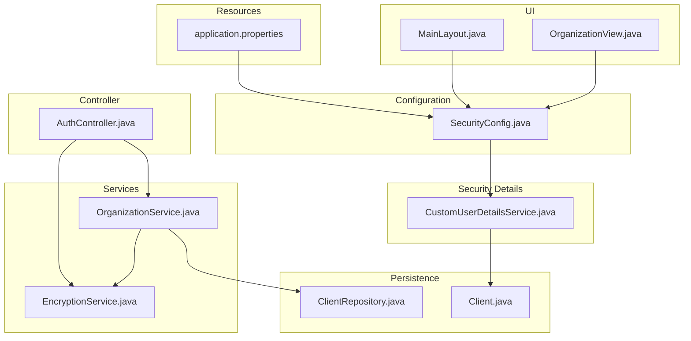
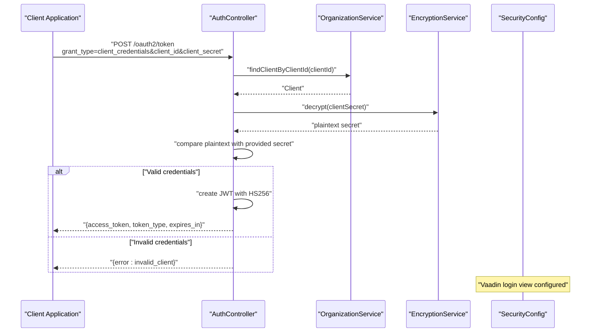
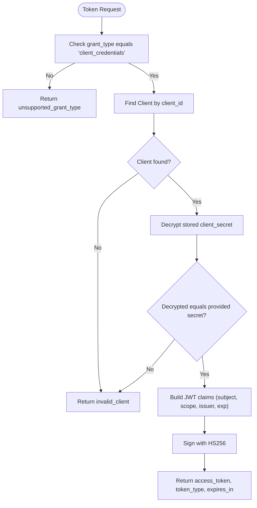
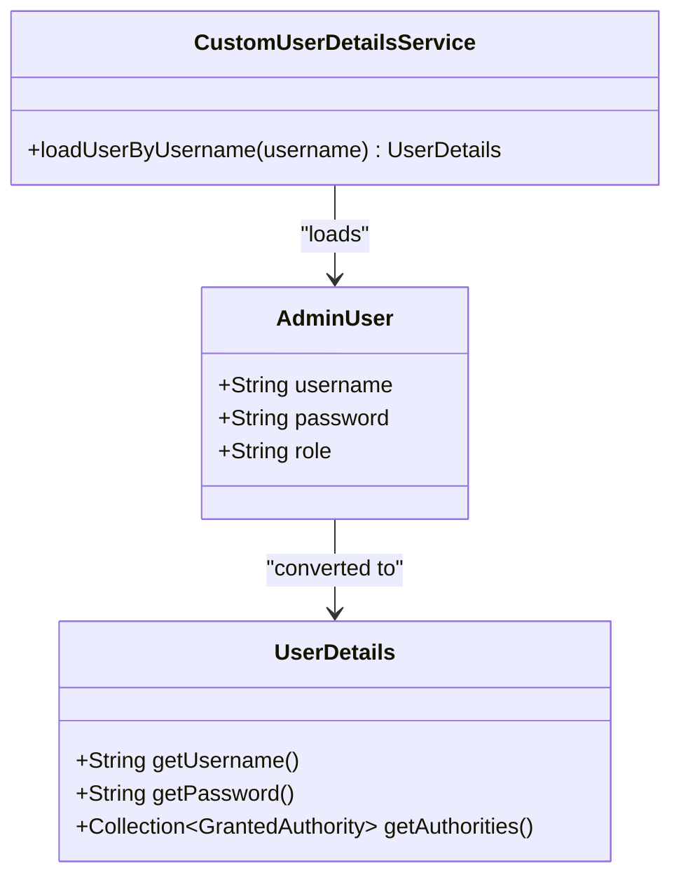
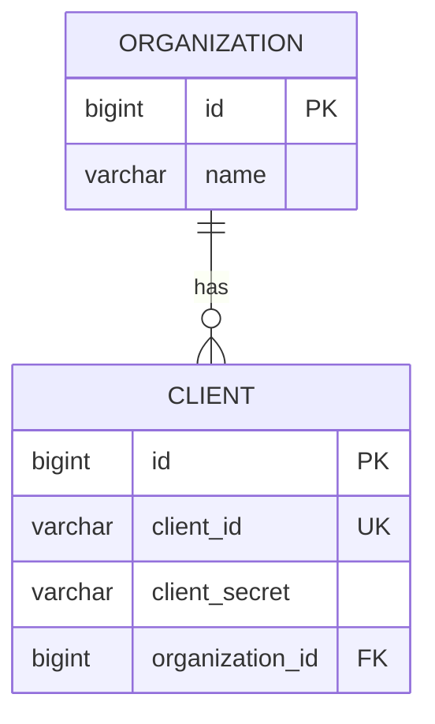
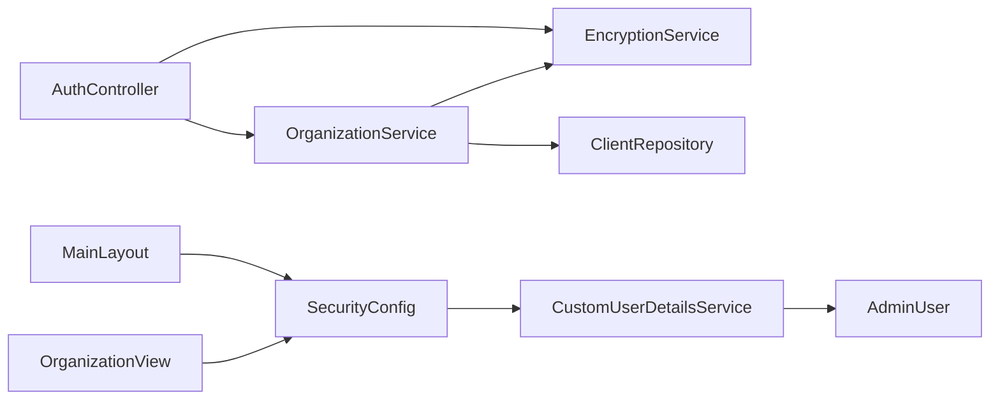

# Authentication & Security

<cite>
**Referenced Files in This Document**
- [SecurityConfig.java](file://src/main/java/com/db2api/config/SecurityConfig.java)
- [CustomUserDetailsService.java](file://src/main/java/com/db2api/security/CustomUserDetailsService.java)
- [AuthController.java](file://src/main/java/com/db2api/controller/AuthController.java)
- [EncryptionService.java](file://src/main/java/com/db2api/service/EncryptionService.java)
- [OrganizationService.java](file://src/main/java/com/db2api/service/organization/OrganizationService.java)
- [Client.java](file://src/main/java/com/db2api/persistent/organization/Client.java)
- [ClientRepository.java](file://src/main/java/com/db2api/repository/organization/ClientRepository.java)
- [application.properties](file://src/main/resources/application.properties)
- [SECURITY.md](file://SECURITY.md)
- [MainLayout.java](file://src/main/java/com/db2api/ui/MainLayout.java)
- [OrganizationView.java](file://src/main/java/com/db2api/ui/OrganizationView.java)
</cite>

## Table of Contents
1. [Introduction](#introduction)
2. [Project Structure](#project-structure)
3. [Core Components](#core-components)
4. [Architecture Overview](#architecture-overview)
5. [Detailed Component Analysis](#detailed-component-analysis)
6. [Dependency Analysis](#dependency-analysis)
7. [Performance Considerations](#performance-considerations)
8. [Troubleshooting Guide](#troubleshooting-guide)
9. [Conclusion](#conclusion)
10. [Appendices](#appendices)

## Introduction
This document provides comprehensive authentication and security documentation for DB2API. It covers the OAuth2 client credentials flow, JWT token management, role-based access control (RBAC), session management, security configuration, custom user details service, password encryption using BCrypt, and UI-driven RBAC enforcement. Practical examples demonstrate obtaining tokens, implementing authentication in clients, and securing API endpoints. Security best practices, threat mitigation, and compliance considerations are also addressed.

## Project Structure
The security-related components are organized across configuration, persistence, service, controller, and UI layers:
- Configuration: Web security setup and password encoding
- Persistence: Client entity and repository
- Services: Organization and encryption services
- Controller: OAuth2 token endpoint
- UI: RBAC enforcement in views

**Diagram sources**
- [SecurityConfig.java:17-50](file://src/main/java/com/db2api/config/SecurityConfig.java#L17-L50)
- [CustomUserDetailsService.java:13-31](file://src/main/java/com/db2api/security/CustomUserDetailsService.java#L13-L31)
- [Client.java:15-42](file://src/main/java/com/db2api/persistent/organization/Client.java#L15-L42)
- [ClientRepository.java:10-13](file://src/main/java/com/db2api/repository/organization/ClientRepository.java#L10-L13)
- [OrganizationService.java:16-82](file://src/main/java/com/db2api/service/organization/OrganizationService.java#L16-L82)
- [EncryptionService.java:14-58](file://src/main/java/com/db2api/service/EncryptionService.java#L14-L58)
- [AuthController.java:26-109](file://src/main/java/com/db2api/controller/AuthController.java#L26-L109)
- [MainLayout.java:37-42](file://src/main/java/com/db2api/ui/MainLayout.java#L37-L42)
- [OrganizationView.java:98-110](file://src/main/java/com/db2api/ui/OrganizationView.java#L98-L110)
- [application.properties:1-20](file://src/main/resources/application.properties#L1-L20)

**Section sources**
- [SecurityConfig.java:17-50](file://src/main/java/com/db2api/config/SecurityConfig.java#L17-L50)
- [application.properties:1-20](file://src/main/resources/application.properties#L1-L20)

## Core Components
- OAuth2 Token Endpoint: Issues JWT access tokens using client credentials grant type
- JWT Management: HS256-signed JWT with subject, scopes, issuer, and expiration
- RBAC: Roles enforced in UI and via Spring Security authorities
- Session Management: Vaadin-managed sessions with Spring Security context
- Password Encoding: BCrypt encoder configured for admin users
- Encryption: AES-based encryption/decryption for client secrets

**Section sources**
- [AuthController.java:54-109](file://src/main/java/com/db2api/controller/AuthController.java#L54-L109)
- [CustomUserDetailsService.java:21-30](file://src/main/java/com/db2api/security/CustomUserDetailsService.java#L21-L30)
- [SecurityConfig.java:47-50](file://src/main/java/com/db2api/config/SecurityConfig.java#L47-L50)
- [EncryptionService.java:35-57](file://src/main/java/com/db2api/service/EncryptionService.java#L35-L57)

## Architecture Overview
The authentication and authorization architecture integrates OAuth2 client credentials with Spring Security and Vaadin:
- Clients call the token endpoint to obtain a JWT
- The server validates client credentials against encrypted secrets
- On success, a signed JWT is returned with predefined scopes
- UI enforces RBAC using Spring Security authorities

**Diagram sources**
- [AuthController.java:54-109](file://src/main/java/com/db2api/controller/AuthController.java#L54-L109)
- [OrganizationService.java:79-81](file://src/main/java/com/db2api/service/organization/OrganizationService.java#L79-L81)
- [EncryptionService.java:47-57](file://src/main/java/com/db2api/service/EncryptionService.java#L47-L57)
- [SecurityConfig.java:36-40](file://src/main/java/com/db2api/config/SecurityConfig.java#L36-L40)

## Detailed Component Analysis

### OAuth2 Client Credentials Flow
- Endpoint: POST /oauth2/token
- Supported grant type: client_credentials
- Validation steps:
  - Verify grant type
  - Lookup client by client_id
  - Decrypt stored client secret and compare with provided secret
  - On success, issue HS256-signed JWT with subject, scopes, issuer, and expiration
- Error responses:
  - unsupported_grant_type
  - invalid_client
  - server_error

**Diagram sources**
- [AuthController.java:59-104](file://src/main/java/com/db2api/controller/AuthController.java#L59-L104)

**Section sources**
- [AuthController.java:54-109](file://src/main/java/com/db2api/controller/AuthController.java#L54-L109)
- [OrganizationService.java:79-81](file://src/main/java/com/db2api/service/organization/OrganizationService.java#L79-L81)
- [EncryptionService.java:47-57](file://src/main/java/com/db2api/service/EncryptionService.java#L47-L57)

### JWT Token Management
- Algorithm: HS256
- Claims:
  - subject: client_id
  - scope: api:read api:write
  - issuer: configured value
  - expiration: 1 hour from issuance
- Token serialization: SignedJWT.serialize()

Best practices:
- Use a strong, random secret for signing
- Rotate secrets periodically
- Enforce HTTPS in production
- Validate issuer and audience if applicable

**Section sources**
- [AuthController.java:91-104](file://src/main/java/com/db2api/controller/AuthController.java#L91-L104)

### Role-Based Access Control (RBAC)
- Admin users have roles stored in persistent entities
- CustomUserDetailsService loads authorities from the admin user’s role
- UI enforces RBAC using Spring Security authorities:
  - MainLayout checks ROLE_ADMIN for navigation visibility
  - OrganizationView checks ROLE_VIEWER to hide destructive actions

**Diagram sources**
- [CustomUserDetailsService.java:21-30](file://src/main/java/com/db2api/security/CustomUserDetailsService.java#L21-L30)
- [MainLayout.java:37-42](file://src/main/java/com/db2api/ui/MainLayout.java#L37-L42)
- [OrganizationView.java:98-110](file://src/main/java/com/db2api/ui/OrganizationView.java#L98-L110)

**Section sources**
- [CustomUserDetailsService.java:21-30](file://src/main/java/com/db2api/security/CustomUserDetailsService.java#L21-L30)
- [MainLayout.java:37-42](file://src/main/java/com/db2api/ui/MainLayout.java#L37-L42)
- [OrganizationView.java:98-110](file://src/main/java/com/db2api/ui/OrganizationView.java#L98-L110)

### Session Management
- VaadinWebSecurity manages login view and session lifecycle
- Authentication context is maintained via Spring Security
- UI components query SecurityContextHolder for role checks

Recommendations:
- Configure CSRF protection for state-changing requests
- Use HTTPS to protect cookies and tokens
- Set secure cookie attributes in production

**Section sources**
- [SecurityConfig.java:36-40](file://src/main/java/com/db2api/config/SecurityConfig.java#L36-L40)
- [MainLayout.java:37-42](file://src/main/java/com/db2api/ui/MainLayout.java#L37-L42)

### Security Configuration
- Password encoder: BCrypt
- Login view: DashboardView
- Vaadin integration: VaadinWebSecurity

**Section sources**
- [SecurityConfig.java:47-50](file://src/main/java/com/db2api/config/SecurityConfig.java#L47-L50)
- [SecurityConfig.java:36-40](file://src/main/java/com/db2api/config/SecurityConfig.java#L36-L40)

### Custom User Details Service
- Loads admin user by username
- Builds UserDetails with roles for Spring Security

**Section sources**
- [CustomUserDetailsService.java:21-30](file://src/main/java/com/db2api/security/CustomUserDetailsService.java#L21-L30)

### Password Encryption Using BCrypt
- BCryptPasswordEncoder bean configured
- Used for hashing admin user passwords

**Section sources**
- [SecurityConfig.java:47-50](file://src/main/java/com/db2api/config/SecurityConfig.java#L47-L50)

### Security Filters
- Request logging filter captures method, URI, status, and duration
- Consider adding security-specific filters for rate limiting, IP allowlisting, and audit logging

Note: The filter implementation logs request metadata; extend it to capture sensitive data only when necessary and ensure logs are secured.

**Section sources**
- [application.properties:1-20](file://src/main/resources/application.properties#L1-L20)

### Client Secret Storage and Retrieval
- Client entity stores encrypted client_secret
- OrganizationService generates client_id and client_secret, encrypts secret before storage
- AuthController decrypts stored secret for comparison

**Diagram sources**
- [Client.java:15-42](file://src/main/java/com/db2api/persistent/organization/Client.java#L15-L42)
- [ClientRepository.java:10-13](file://src/main/java/com/db2api/repository/organization/ClientRepository.java#L10-L13)
- [OrganizationService.java:48-63](file://src/main/java/com/db2api/service/organization/OrganizationService.java#L48-L63)

**Section sources**
- [Client.java:15-42](file://src/main/java/com/db2api/persistent/organization/Client.java#L15-L42)
- [ClientRepository.java:10-13](file://src/main/java/com/db2api/repository/organization/ClientRepository.java#L10-L13)
- [OrganizationService.java:48-63](file://src/main/java/com/db2api/service/organization/OrganizationService.java#L48-L63)
- [EncryptionService.java:35-57](file://src/main/java/com/db2api/service/EncryptionService.java#L35-L57)

## Dependency Analysis
The following diagram shows key dependencies among security components:

**Diagram sources**
- [AuthController.java:26-43](file://src/main/java/com/db2api/controller/AuthController.java#L26-L43)
- [OrganizationService.java:16-27](file://src/main/java/com/db2api/service/organization/OrganizationService.java#L16-L27)
- [EncryptionService.java:14-19](file://src/main/java/com/db2api/service/EncryptionService.java#L14-L19)
- [ClientRepository.java:10-13](file://src/main/java/com/db2api/repository/organization/ClientRepository.java#L10-L13)
- [CustomUserDetailsService.java:13-19](file://src/main/java/com/db2api/security/CustomUserDetailsService.java#L13-L19)
- [SecurityConfig.java:17-28](file://src/main/java/com/db2api/config/SecurityConfig.java#L17-L28)
- [MainLayout.java:37-42](file://src/main/java/com/db2api/ui/MainLayout.java#L37-L42)
- [OrganizationView.java:98-110](file://src/main/java/com/db2api/ui/OrganizationView.java#L98-L110)

**Section sources**
- [AuthController.java:26-43](file://src/main/java/com/db2api/controller/AuthController.java#L26-L43)
- [OrganizationService.java:16-27](file://src/main/java/com/db2api/service/organization/OrganizationService.java#L16-L27)
- [CustomUserDetailsService.java:13-19](file://src/main/java/com/db2api/security/CustomUserDetailsService.java#L13-L19)
- [SecurityConfig.java:17-28](file://src/main/java/com/db2api/config/SecurityConfig.java#L17-L28)

## Performance Considerations
- Token generation overhead: HS256 signing is lightweight but avoid excessive token creation
- Encryption/decryption: AES operations are fast; cache decrypted secrets only during validation window
- RBAC checks: Authority checks are O(n) over granted authorities; keep authority lists minimal
- Logging: Request logging is useful for monitoring; ensure log volume does not impact throughput

## Troubleshooting Guide
Common issues and resolutions:
- Invalid client credentials:
  - Ensure client_id exists and client_secret matches decrypted stored value
  - Confirm encryption secret configuration matches encryption service settings
- Unsupported grant type:
  - Verify grant_type parameter equals client_credentials
- Server errors:
  - Check JWT signing secret configuration and application logs
- RBAC not applied:
  - Confirm user roles are correctly set in admin user records
  - Ensure UI components query SecurityContextHolder for authorities

**Section sources**
- [AuthController.java:59-108](file://src/main/java/com/db2api/controller/AuthController.java#L59-L108)
- [EncryptionService.java:18-19](file://src/main/java/com/db2api/service/EncryptionService.java#L18-L19)
- [CustomUserDetailsService.java:21-30](file://src/main/java/com/db2api/security/CustomUserDetailsService.java#L21-L30)

## Conclusion
DB2API implements a pragmatic authentication and security model combining OAuth2 client credentials with Spring Security and Vaadin. The design emphasizes clear separation of concerns, robust credential handling, and UI-driven RBAC. By following the recommended best practices and addressing the outlined considerations, the system can achieve strong security posture suitable for production environments.

## Appendices

### Practical Examples

- Obtaining a token:
  - Endpoint: POST /oauth2/token
  - Parameters: grant_type=client_credentials, client_id, client_secret
  - Response: access_token, token_type=Bearer, expires_in

- Implementing authentication in clients:
  - Store the access_token received from the token endpoint
  - Include Authorization: Bearer <access_token> header on protected API requests

- Securing API endpoints:
  - Protect endpoints using Spring Security matchers
  - Validate JWT signature and claims (issuer, audience, expiration)
  - Enforce RBAC based on scopes or roles derived from the token

### Security Best Practices
- Use HTTPS/TLS for all communications
- Rotate JWT signing keys and client secrets regularly
- Enforce strong password policies and enable multi-factor authentication for admin accounts
- Apply least privilege and principle of least privilege for roles
- Monitor and audit authentication events and RBAC decisions
- Validate and sanitize all inputs; enforce CORS and Content Security Policy
- Keep dependencies updated and review security advisories

### Compliance Considerations
- Data protection: Encrypt sensitive data at rest and in transit
- Audit logging: Maintain logs for authentication and authorization events
- Access control: Enforce RBAC and separation of duties
- Vulnerability management: Follow the project’s security policy for reporting and handling vulnerabilities

**Section sources**
- [SECURITY.md:15-22](file://SECURITY.md#L15-L22)