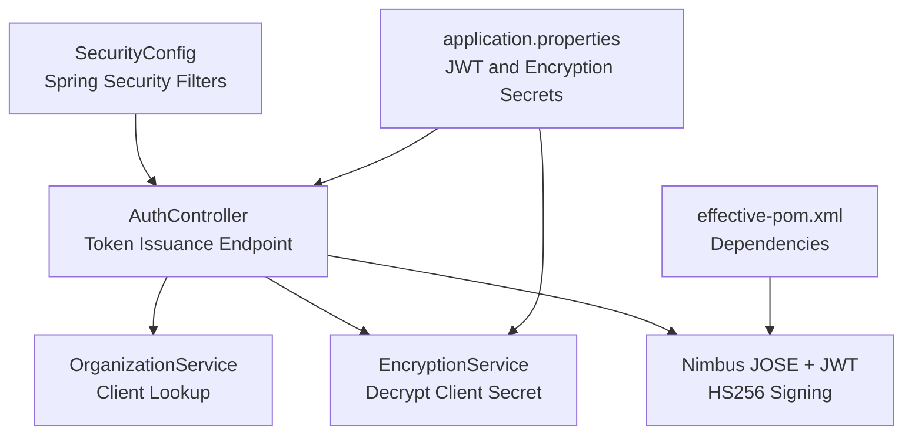
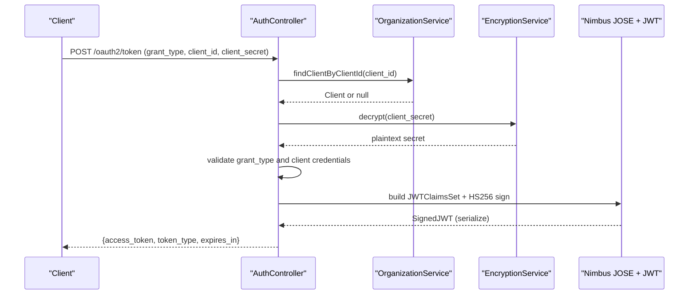
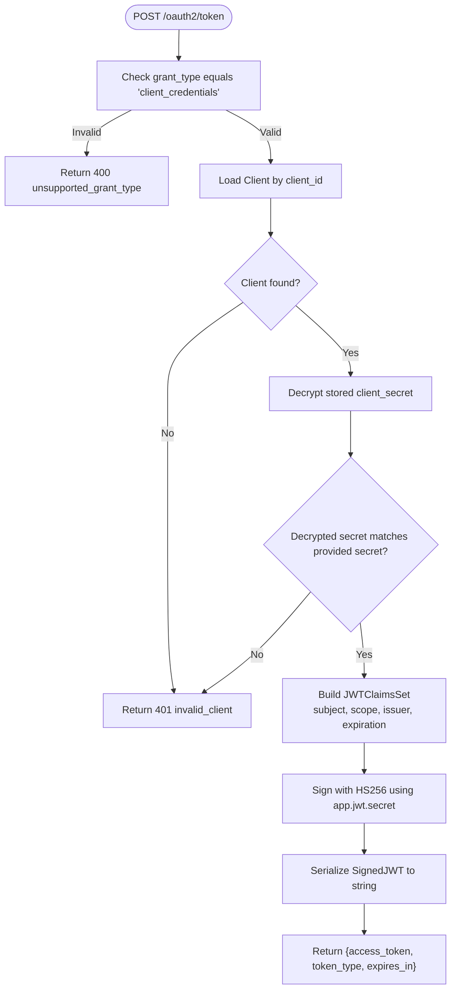
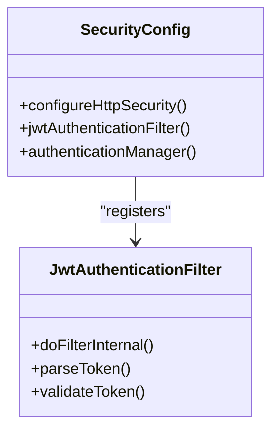
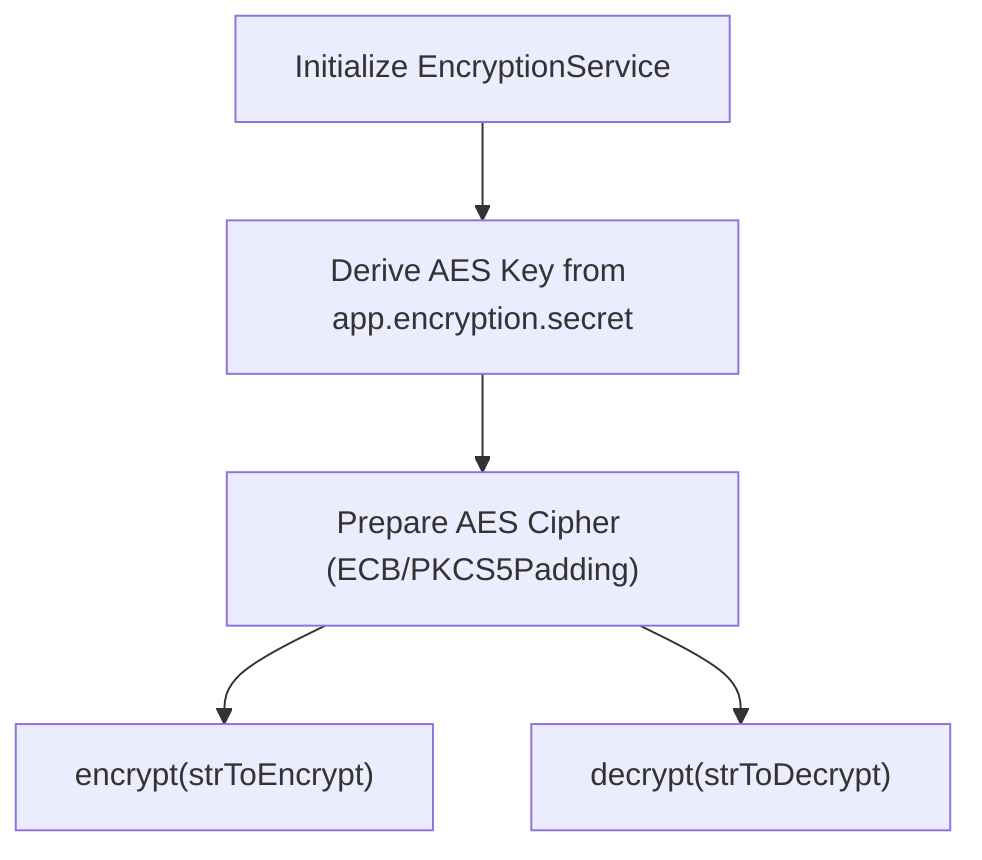
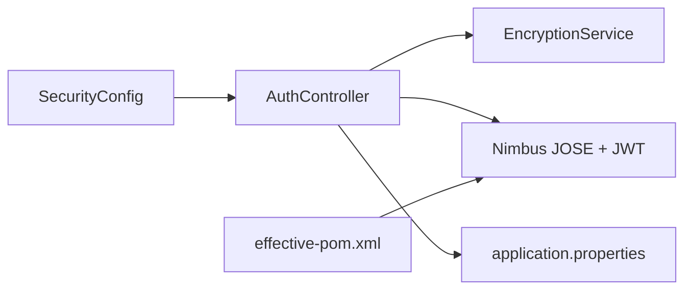

# JWT Token Management

<cite>
**Referenced Files in This Document**
- [AuthController.java](file://src/main/java/com/db2api/controller/AuthController.java)
- [SecurityConfig.java](file://src/main/java/com/db2api/config/SecurityConfig.java)
- [EncryptionService.java](file://src/main/java/com/db2api/service/EncryptionService.java)
- [application.properties](file://src/main/resources/application.properties)
- [effective-pom.xml](file://effective-pom.xml)
</cite>

## Table of Contents
1. [Introduction](#introduction)
2. [Project Structure](#project-structure)
3. [Core Components](#core-components)
4. [Architecture Overview](#architecture-overview)
5. [Detailed Component Analysis](#detailed-component-analysis)
6. [Dependency Analysis](#dependency-analysis)
7. [Performance Considerations](#performance-considerations)
8. [Troubleshooting Guide](#troubleshooting-guide)
9. [Conclusion](#conclusion)

## Introduction
This document provides comprehensive JWT token management guidance for DB2API. It covers JWT structure, HS256 signing implementation, token claims, serialization, validation mechanisms, expiration handling, refresh strategies, client-side parsing and authentication, security best practices, storage recommendations, and integration with Spring Security filters. The implementation leverages Nimbus JOSE + JWT for signing and Spring Security for protection.

## Project Structure
The JWT-related functionality spans a small set of focused components:
- Token issuance endpoint in the authentication controller
- Security configuration for protecting endpoints
- Encryption service for client secret handling
- Application configuration for secrets and properties
- Dependencies declared via Maven POM

**Diagram sources**
- [AuthController.java:54-109](file://src/main/java/com/db2api/controller/AuthController.java#L54-L109)
- [SecurityConfig.java](file://src/main/java/com/db2api/config/SecurityConfig.java)
- [EncryptionService.java:18](file://src/main/java/com/db2api/service/EncryptionService.java#L18)
- [application.properties](file://src/main/resources/application.properties)
- [effective-pom.xml:8795-8799](file://effective-pom.xml#L8795-L8799)

**Section sources**
- [AuthController.java:1-110](file://src/main/java/com/db2api/controller/AuthController.java#L1-L110)
- [SecurityConfig.java](file://src/main/java/com/db2api/config/SecurityConfig.java)
- [EncryptionService.java:1-39](file://src/main/java/com/db2api/service/EncryptionService.java#L1-L39)
- [application.properties](file://src/main/resources/application.properties)
- [effective-pom.xml:8795-8799](file://effective-pom.xml#L8795-L8799)

## Core Components
- Token Issuance Endpoint
  - Path: POST /oauth2/token
  - Grant Type: client_credentials
  - Claims: subject (client_id), scope, issuer, expiration
  - Signing: HS256 using a shared secret
  - Response: access_token, token_type, expires_in

- Security Configuration
  - Protects endpoints using Spring Security
  - Integrates with JWT-based authentication filters

- Encryption Service
  - Manages AES-based encryption/decryption for client secrets
  - Provides a configurable secret for encryption operations

- Application Properties
  - Defines app.jwt.secret and app.encryption.secret
  - Used by AuthController and EncryptionService

- Dependencies
  - nimbus-jose-jwt for JWT creation and signing
  - Spring Security for filter chain integration

**Section sources**
- [AuthController.java:54-109](file://src/main/java/com/db2api/controller/AuthController.java#L54-L109)
- [SecurityConfig.java](file://src/main/java/com/db2api/config/SecurityConfig.java)
- [EncryptionService.java:18](file://src/main/java/com/db2api/service/EncryptionService.java#L18)
- [application.properties](file://src/main/resources/application.properties)
- [effective-pom.xml:8795-8799](file://effective-pom.xml#L8795-L8799)

## Architecture Overview
The JWT lifecycle integrates authentication, signing, and protection:

**Diagram sources**
- [AuthController.java:54-109](file://src/main/java/com/db2api/controller/AuthController.java#L54-L109)
- [EncryptionService.java:35-39](file://src/main/java/com/db2api/service/EncryptionService.java#L35-L39)

## Detailed Component Analysis

### AuthController: Token Issuance and HS256 Signing
- Purpose: Issue JWT access tokens for client_credentials grants
- Claims:
  - subject: client_id
  - scope: default api:read api:write
  - issuer: configured value
  - expiration: current time + 1 hour
- Signing:
  - HS256 using a shared secret from application properties
  - Serialized to JWT string for response
- Validation:
  - Rejects unsupported grant types
  - Validates client existence and secret equality
  - Returns appropriate HTTP status codes on failure

**Diagram sources**
- [AuthController.java:59-109](file://src/main/java/com/db2api/controller/AuthController.java#L59-L109)

**Section sources**
- [AuthController.java:54-109](file://src/main/java/com/db2api/controller/AuthController.java#L54-L109)

### SecurityConfig: Spring Security Integration
- Role: Configure Spring Security filters and protected endpoints
- Integration points:
  - Add JWT-based authentication filters to intercept requests
  - Define permitAll or authenticated paths as needed
  - Wire in JWT parsing/validation logic (implementation-specific)
- Best practice: Use a dedicated JWT filter that validates HS256 signatures and extracts claims

**Diagram sources**
- [SecurityConfig.java](file://src/main/java/com/db2api/config/SecurityConfig.java)

**Section sources**
- [SecurityConfig.java](file://src/main/java/com/db2api/config/SecurityConfig.java)

### EncryptionService: Client Secret Handling
- Purpose: Manage encryption/decryption of client secrets
- Mechanism: AES-based encryption with SHA-1 derived key
- Configuration: app.encryption.secret property
- Usage: Decrypt stored secrets during token validation

**Diagram sources**
- [EncryptionService.java:23-39](file://src/main/java/com/db2api/service/EncryptionService.java#L23-L39)

**Section sources**
- [EncryptionService.java:1-39](file://src/main/java/com/db2api/service/EncryptionService.java#L1-L39)

### Application Properties: Secrets and Configuration
- app.jwt.secret: Shared secret for HS256 signing
- app.encryption.secret: Secret used by EncryptionService for AES key derivation
- Recommendation: Set strong, random secrets and rotate periodically

**Section sources**
- [application.properties](file://src/main/resources/application.properties)

### Dependencies: Nimbus JOSE + JWT and Spring Security
- nimbus-jose-jwt: JWT creation, signing, and serialization
- spring-security-test and related: Testing support for security components
- Ensure consistent versions across the project

**Section sources**
- [effective-pom.xml:8795-8799](file://effective-pom.xml#L8795-L8799)

## Dependency Analysis
JWT token management depends on:
- AuthController for issuing tokens
- EncryptionService for secret validation
- SecurityConfig for protecting endpoints
- Application properties for secrets
- Nimbus JOSE + JWT for signing and serialization

**Diagram sources**
- [AuthController.java:54-109](file://src/main/java/com/db2api/controller/AuthController.java#L54-L109)
- [EncryptionService.java:18](file://src/main/java/com/db2api/service/EncryptionService.java#L18)
- [SecurityConfig.java](file://src/main/java/com/db2api/config/SecurityConfig.java)
- [application.properties](file://src/main/resources/application.properties)
- [effective-pom.xml:8795-8799](file://effective-pom.xml#L8795-L8799)

**Section sources**
- [AuthController.java:54-109](file://src/main/java/com/db2api/controller/AuthController.java#L54-L109)
- [EncryptionService.java:1-39](file://src/main/java/com/db2api/service/EncryptionService.java#L1-L39)
- [SecurityConfig.java](file://src/main/java/com/db2api/config/SecurityConfig.java)
- [application.properties](file://src/main/resources/application.properties)
- [effective-pom.xml:8795-8799](file://effective-pom.xml#L8795-L8799)

## Performance Considerations
- Token TTL: Current implementation sets 1-hour expiration; adjust based on security and operational needs
- Signing overhead: HS256 is fast; avoid excessive claim payload sizes
- Caching: Consider caching validated tokens server-side if needed, but prefer short-lived tokens
- Network latency: Keep issuer and token endpoint close to clients

## Troubleshooting Guide
Common issues and resolutions:
- Unsupported grant type
  - Cause: grant_type not client_credentials
  - Resolution: Ensure client sends the correct grant type
  - Reference: [AuthController.java:59-61](file://src/main/java/com/db2api/controller/AuthController.java#L59-L61)

- Invalid client
  - Cause: client_id not found or secret mismatch
  - Resolution: Verify client registration and secret encryption/decryption
  - References:
    - [AuthController.java:78-87](file://src/main/java/com/db2api/controller/AuthController.java#L78-L87)
    - [EncryptionService.java:35-39](file://src/main/java/com/db2api/service/EncryptionService.java#L35-L39)

- Server error during token issuance
  - Cause: signing or serialization failure
  - Resolution: Check app.jwt.secret and Nimbus JOSE + JWT configuration
  - Reference: [AuthController.java:105-108](file://src/main/java/com/db2api/controller/AuthController.java#L105-L108)

- Spring Security filter chain issues
  - Cause: Missing or misconfigured JWT filter
  - Resolution: Implement and register a JWT filter in SecurityConfig
  - Reference: [SecurityConfig.java](file://src/main/java/com/db2api/config/SecurityConfig.java)

## Conclusion
DB2API implements a straightforward, secure JWT token management system using HS256 signing, explicit claims, and Spring Security integration. The design supports client_credentials-based access tokens with clear validation and error handling. For production, enforce strong secrets, monitor token lifetimes, and integrate robust JWT filters to validate tokens on every protected request.