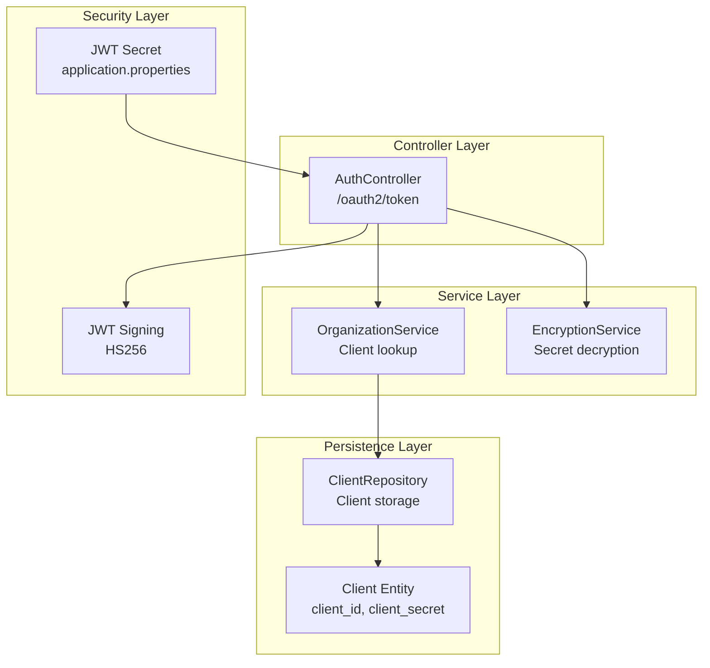
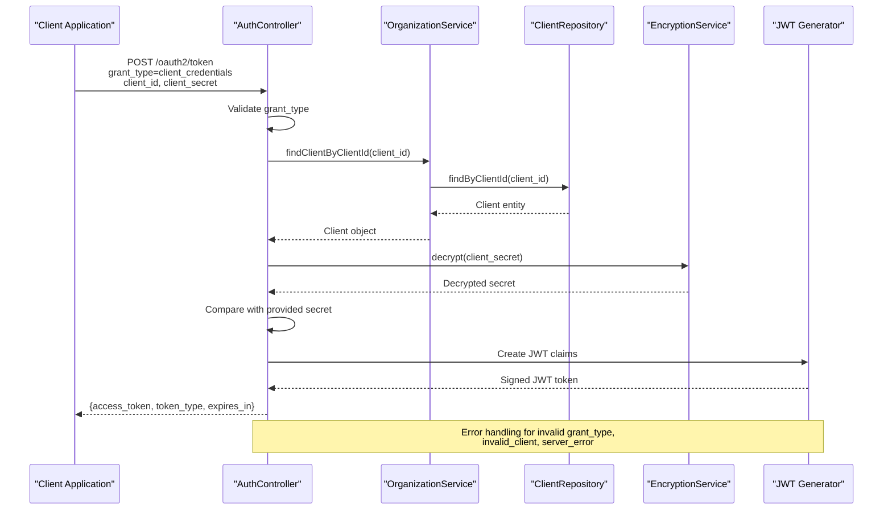
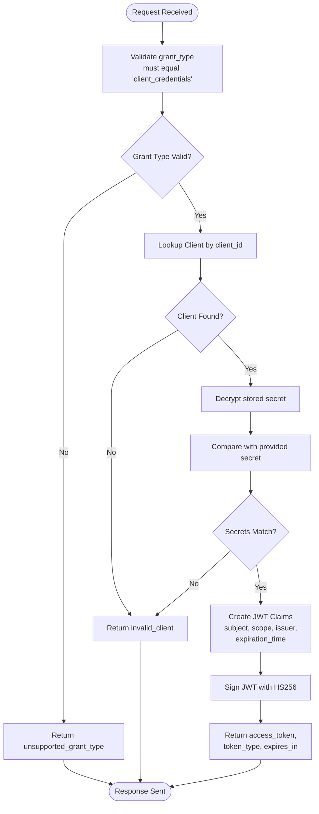
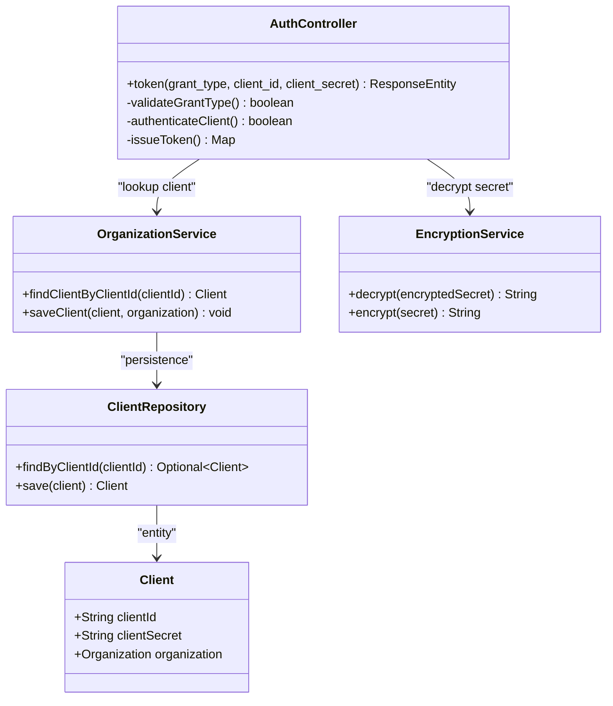
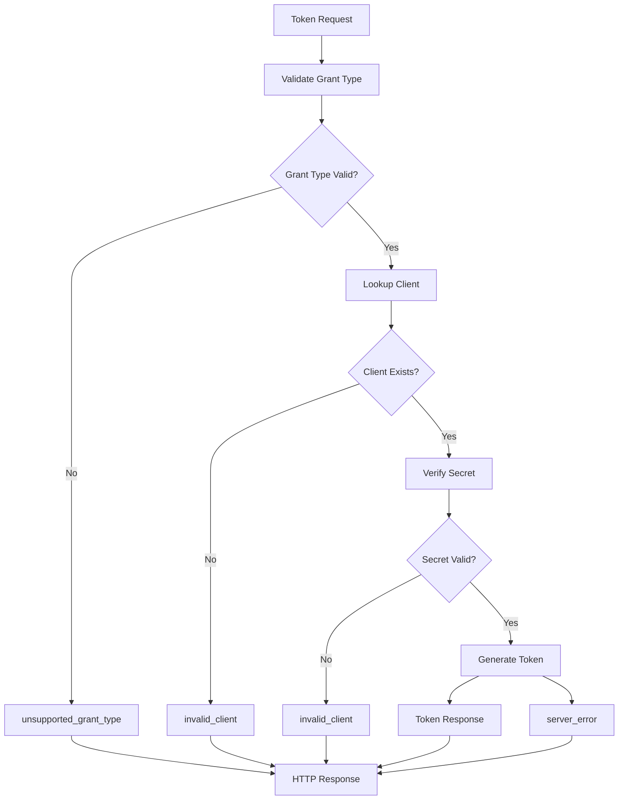
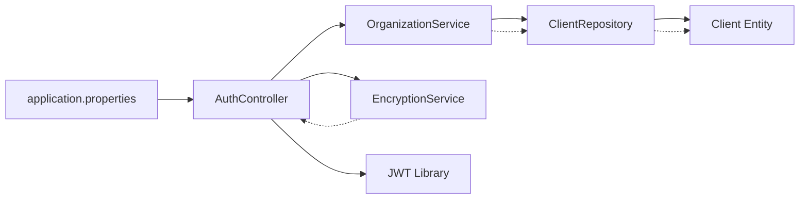

# OAuth2 Client Credentials Flow

<cite>
**Referenced Files in This Document**
- [AuthController.java](file://src/main/java/com/db2api/controller/AuthController.java)
- [OrganizationService.java](file://src/main/java/com/db2api/service/organization/OrganizationService.java)
- [EncryptionService.java](file://src/main/java/com/db2api/service/EncryptionService.java)
- [Client.java](file://src/main/java/com/db2api/persistent/organization/Client.java)
- [ClientRepository.java](file://src/main/java/com/db2api/repository/organization/ClientRepository.java)
- [application.properties](file://src/main/resources/application.properties)
</cite>

## Table of Contents
1. [Introduction](#introduction)
2. [Project Structure](#project-structure)
3. [Core Components](#core-components)
4. [Architecture Overview](#architecture-overview)
5. [Detailed Component Analysis](#detailed-component-analysis)
6. [Dependency Analysis](#dependency-analysis)
7. [Performance Considerations](#performance-considerations)
8. [Troubleshooting Guide](#troubleshooting-guide)
9. [Security Considerations](#security-considerations)
10. [Integration Examples](#integration-examples)
11. [Conclusion](#conclusion)

## Introduction
This document provides comprehensive technical documentation for the OAuth2 client credentials flow implementation in DB2API. It covers the `/oauth2/token` endpoint, client authentication process, grant type validation, token issuance workflow, encrypted secret validation, JWT claim construction, and response formatting. Practical examples demonstrate obtaining tokens using curl commands and various programming languages. The document also addresses error handling scenarios, security considerations for client credential transmission, and integration patterns with different client applications.

## Project Structure
The OAuth2 client credentials flow is implemented within the Spring Boot application under the `com.db2api` package hierarchy. Key components include:
- Controller layer: REST endpoint for token issuance
- Service layer: Client lookup and JWT signing
- Persistence layer: Client entity and repository
- Security layer: Encryption service for secret validation



**Diagram sources**
- [AuthController.java:25-110](file://src/main/java/com/db2api/controller/AuthController.java#L25-L110)
- [OrganizationService.java:79-82](file://src/main/java/com/db2api/service/organization/OrganizationService.java#L79-L82)
- [EncryptionService.java](file://src/main/java/com/db2api/service/EncryptionService.java)
- [ClientRepository.java](file://src/main/java/com/db2api/repository/organization/ClientRepository.java)
- [Client.java](file://src/main/java/com/db2api/persistent/organization/Client.java)
- [application.properties](file://src/main/resources/application.properties)

**Section sources**
- [AuthController.java:25-110](file://src/main/java/com/db2api/controller/AuthController.java#L25-L110)
- [OrganizationService.java:79-82](file://src/main/java/com/db2api/service/organization/OrganizationService.java#L79-L82)

## Core Components
The OAuth2 client credentials flow implementation consists of the following core components:

### AuthController
The primary controller responsible for handling OAuth2 token requests. It validates grant type, authenticates clients, and issues JWT access tokens.

Key responsibilities:
- Validate grant_type parameter equals "client_credentials"
- Authenticate client credentials against encrypted secrets
- Construct JWT claims with standardized fields
- Return properly formatted token responses

### OrganizationService
Provides client management functionality including client lookup by client_id.

Key capabilities:
- Client retrieval by unique identifier
- Client creation with encrypted secret generation
- Integration with persistence layer

### EncryptionService
Handles cryptographic operations for client secret validation.

Key operations:
- Decryption of stored encrypted secrets
- Comparison with provided cleartext secrets
- Secure handling of cryptographic keys

### Client Entity and Repository
Persistent representation of OAuth2 clients with encrypted secrets.

Key attributes:
- Unique client identifier
- Encrypted client secret
- Association with organization

**Section sources**
- [AuthController.java:25-110](file://src/main/java/com/db2api/controller/AuthController.java#L25-L110)
- [OrganizationService.java:79-82](file://src/main/java/com/db2api/service/organization/OrganizationService.java#L79-L82)
- [EncryptionService.java](file://src/main/java/com/db2api/service/EncryptionService.java)
- [Client.java](file://src/main/java/com/db2api/persistent/organization/Client.java)
- [ClientRepository.java](file://src/main/java/com/db2api/repository/organization/ClientRepository.java)

## Architecture Overview
The OAuth2 client credentials flow follows a layered architecture pattern with clear separation of concerns:



**Diagram sources**
- [AuthController.java:54-109](file://src/main/java/com/db2api/controller/AuthController.java#L54-L109)
- [OrganizationService.java:79-82](file://src/main/java/com/db2api/service/organization/OrganizationService.java#L79-L82)
- [EncryptionService.java](file://src/main/java/com/db2api/service/EncryptionService.java)

The architecture ensures secure credential validation through encrypted secret storage and proper JWT token generation with standardized claims.

## Detailed Component Analysis

### Token Endpoint Implementation
The `/oauth2/token` endpoint implements the OAuth2 client credentials flow with the following validation and processing logic:



**Diagram sources**
- [AuthController.java:59-108](file://src/main/java/com/db2api/controller/AuthController.java#L59-L108)

#### JWT Claim Construction
The implementation constructs standardized JWT claims for issued tokens:
- Subject: client_id value
- Scope: Default "api:read api:write" permissions
- Issuer: Configurable application URL
- Expiration: 1 hour from issuance time
- Algorithm: HS256 signature

#### Response Formatting
Successful token responses include:
- access_token: Serialized JWT string
- token_type: "Bearer" authentication scheme
- expires_in: Token lifetime in seconds (3600)

**Section sources**
- [AuthController.java:54-109](file://src/main/java/com/db2api/controller/AuthController.java#L54-L109)

### Client Authentication Process
The client authentication mechanism employs encrypted secret validation:



**Diagram sources**
- [AuthController.java:25-110](file://src/main/java/com/db2api/controller/AuthController.java#L25-L110)
- [OrganizationService.java:79-82](file://src/main/java/com/db2api/service/organization/OrganizationService.java#L79-L82)
- [EncryptionService.java](file://src/main/java/com/db2api/service/EncryptionService.java)
- [ClientRepository.java](file://src/main/java/com/db2api/repository/organization/ClientRepository.java)
- [Client.java](file://src/main/java/com/db2api/persistent/organization/Client.java)

**Section sources**
- [AuthController.java:77-87](file://src/main/java/com/db2api/controller/AuthController.java#L77-L87)
- [OrganizationService.java:79-82](file://src/main/java/com/db2api/service/organization/OrganizationService.java#L79-L82)

### Error Handling Workflow
The implementation provides comprehensive error handling for various failure scenarios:



**Diagram sources**
- [AuthController.java:59-108](file://src/main/java/com/db2api/controller/AuthController.java#L59-L108)

**Section sources**
- [AuthController.java:59-108](file://src/main/java/com/db2api/controller/AuthController.java#L59-L108)

## Dependency Analysis
The OAuth2 implementation exhibits clean dependency relationships with minimal coupling:



**Diagram sources**
- [AuthController.java:25-110](file://src/main/java/com/db2api/controller/AuthController.java#L25-L110)
- [OrganizationService.java:79-82](file://src/main/java/com/db2api/service/organization/OrganizationService.java#L79-L82)
- [ClientRepository.java](file://src/main/java/com/db2api/repository/organization/ClientRepository.java)
- [Client.java](file://src/main/java/com/db2api/persistent/organization/Client.java)
- [application.properties](file://src/main/resources/application.properties)

**Section sources**
- [AuthController.java:25-110](file://src/main/java/com/db2api/controller/AuthController.java#L25-L110)
- [OrganizationService.java:79-82](file://src/main/java/com/db2api/service/organization/OrganizationService.java#L79-L82)

## Performance Considerations
The OAuth2 implementation demonstrates efficient resource utilization:

- **Minimal Memory Footprint**: Uses lightweight JWT library for token generation
- **Single Database Query**: Client lookup performed with single repository call
- **Efficient Secret Validation**: Direct string comparison after decryption
- **Thread-Safe Operations**: Stateless controller with immutable dependencies
- **Configurable Expiration**: Token lifetime set to 1 hour for optimal security/performance balance

## Troubleshooting Guide

### Common Error Scenarios
1. **unsupported_grant_type**: Occurs when grant_type is not "client_credentials"
2. **invalid_client**: Generated when client_id is not found or secret mismatch occurs
3. **server_error**: Thrown during JWT generation failures

### Debugging Steps
1. Verify grant_type parameter equals "client_credentials"
2. Confirm client_id exists in database with encrypted secret
3. Ensure client_secret matches decrypted stored value
4. Check JWT secret configuration in application properties
5. Validate network connectivity to token endpoint

### Configuration Verification
- JWT secret must be configured in application properties
- Client credentials must be properly registered in database
- Network firewall allows outbound connections to token endpoint

**Section sources**
- [AuthController.java:59-108](file://src/main/java/com/db2api/controller/AuthController.java#L59-L108)

## Security Considerations

### Client Credential Transmission
- **HTTPS Required**: All token requests must use HTTPS to prevent credential interception
- **Basic Authentication Alternative**: Consider Basic Authentication header for enhanced security
- **Scope Limitation**: Default scopes ("api:read api:write") should be minimized per client needs
- **Token Expiration**: 1-hour expiration reduces impact of compromised tokens

### Secret Management
- **Encrypted Storage**: Client secrets stored in encrypted format using EncryptionService
- **One-Time Secret Exposure**: Raw secrets should only be shown once during client registration
- **Key Rotation**: Implement periodic secret rotation for enhanced security

### JWT Security
- **Strong Signing Key**: HS256 requires secure, randomly generated secret
- **Issuer Validation**: Verify token issuer matches expected application URL
- **Expiration Checking**: Always validate token expiration before use

## Integration Examples

### Curl Commands
Basic token acquisition using curl:
```bash
curl -X POST https://your-domain.com/oauth2/token \
  -H "Content-Type: application/x-www-form-urlencoded" \
  -d "grant_type=client_credentials&client_id=YOUR_CLIENT_ID&client_secret=YOUR_CLIENT_SECRET"
```

### Programming Language Examples

#### Python
```python
import requests
import json

def get_oauth_token():
    url = "https://your-domain.com/oauth2/token"
    payload = {
        "grant_type": "client_credentials",
        "client_id": "YOUR_CLIENT_ID",
        "client_secret": "YOUR_CLIENT_SECRET"
    }
    
    response = requests.post(url, data=payload)
    return response.json()
```

#### JavaScript (Node.js)
```javascript
const axios = require('axios');

async function getAccessToken() {
    const url = 'https://your-domain.com/oauth2/token';
    const params = new URLSearchParams({
        'grant_type': 'client_credentials',
        'client_id': 'YOUR_CLIENT_ID',
        'client_secret': 'YOUR_CLIENT_SECRET'
    });
    
    const response = await axios.post(url, params);
    return response.data;
}
```

#### Java
```java
import java.net.http.*;
import java.net.URI;
import java.net.URLEncoder;
import java.nio.charset.StandardCharsets;

public class OAuthClient {
    public static void main(String[] args) throws Exception {
        HttpClient client = HttpClient.newHttpClient();
        String url = "https://your-domain.com/oauth2/token";
        
        String params = "grant_type=client_credentials" +
                      "&client_id=YOUR_CLIENT_ID" +
                      "&client_secret=YOUR_CLIENT_SECRET";
        
        HttpRequest request = HttpRequest.newBuilder()
            .uri(URI.create(url))
            .header("Content-Type", "application/x-www-form-urlencoded")
            .POST(HttpRequest.BodyPublishers.ofString(params))
            .build();
            
        HttpResponse<String> response = client.send(request, 
            HttpResponse.BodyHandlers.ofString());
    }
}
```

#### C#
```csharp
using System;
using System.Net.Http;
using System.Threading.Tasks;

public class OAuthClient 
{
    public async Task GetAccessTokenAsync() 
    {
        using var client = new HttpClient();
        var url = "https://your-domain.com/oauth2/token";
        
        var payload = new Dictionary<string, string>
        {
            ["grant_type"] = "client_credentials",
            ["client_id"] = "YOUR_CLIENT_ID",
            ["client_secret"] = "YOUR_CLIENT_SECRET"
        };
        
        var response = await client.PostAsync(url, new FormUrlEncodedContent(payload));
        var tokenResponse = await response.Content.ReadAsStringAsync();
    }
}
```

### Client Application Integration Patterns
1. **Background Services**: Schedule token refresh before expiration
2. **API Gateway Integration**: Centralized token management for microservices
3. **Caching Strategy**: Store tokens with expiration validation
4. **Retry Logic**: Implement exponential backoff for transient failures
5. **Monitoring**: Track token issuance metrics and error rates

## Conclusion
The DB2API OAuth2 client credentials flow implementation provides a secure, efficient, and standards-compliant authentication mechanism. The implementation demonstrates clean architectural separation, robust error handling, and comprehensive security measures including encrypted secret storage and JWT token issuance. The modular design enables easy integration with diverse client applications while maintaining strong security posture through HTTPS enforcement, proper credential handling, and token lifecycle management.