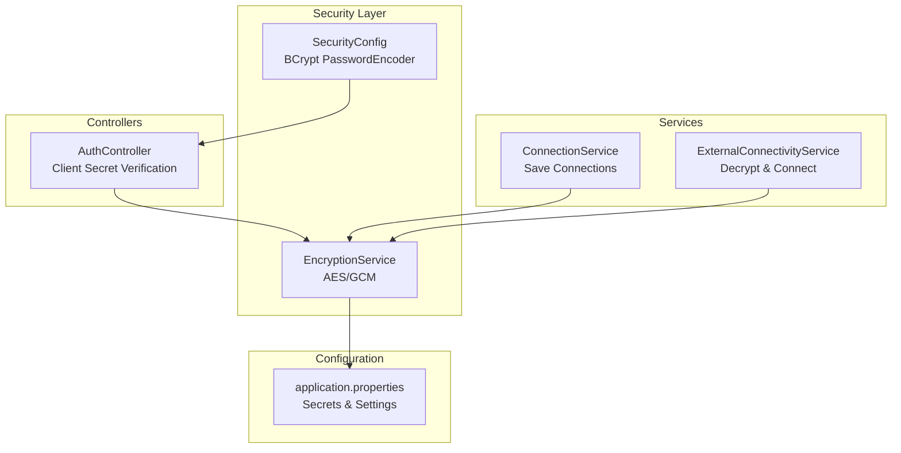
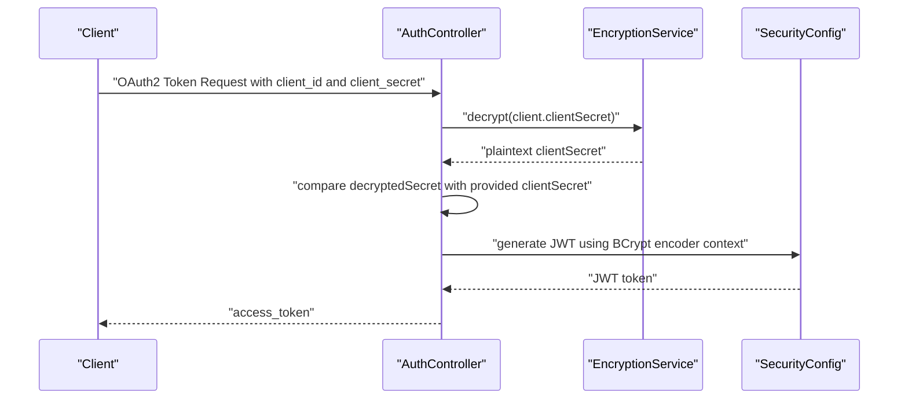
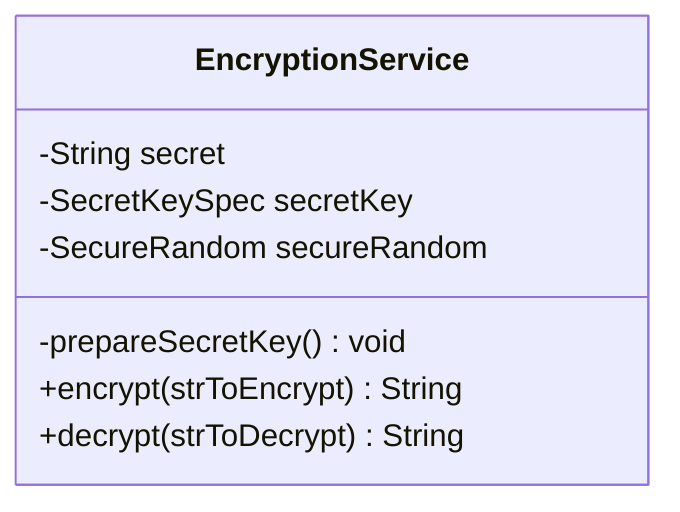
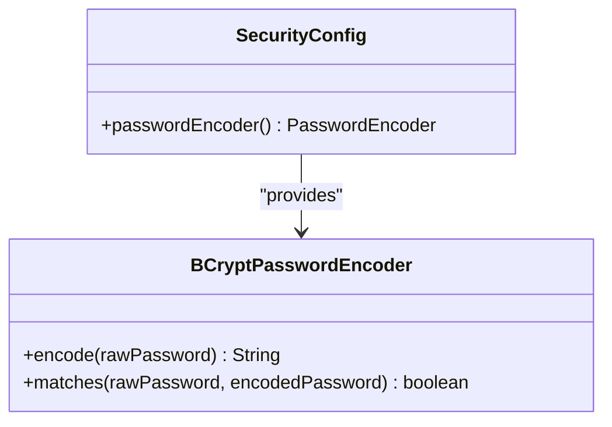
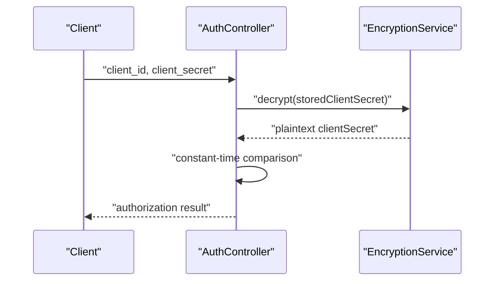
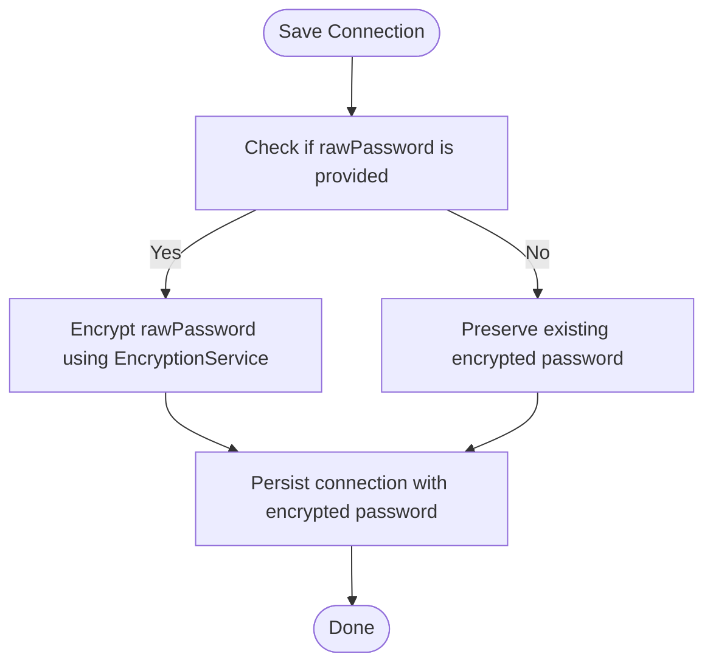
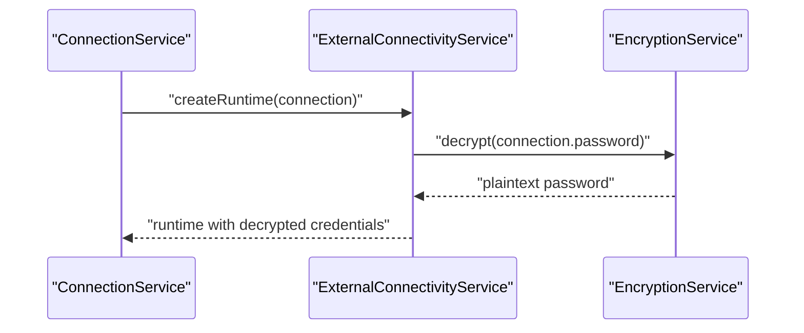
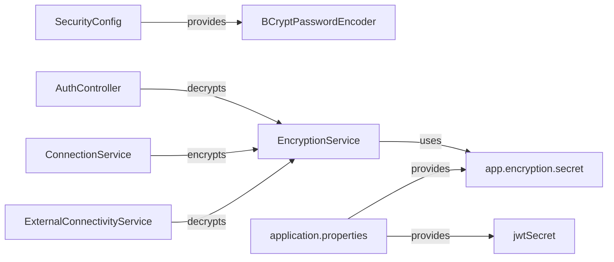

# Password Encryption & Security

<cite>
**Referenced Files in This Document**
- [EncryptionService.java](file://src/main/java/com/db2api/service/EncryptionService.java)
- [SecurityConfig.java](file://src/main/java/com/db2api/config/SecurityConfig.java)
- [AuthController.java](file://src/main/java/com/db2api/controller/AuthController.java)
- [ConnectionService.java](file://src/main/java/com/db2api/service/connection/ConnectionService.java)
- [ExternalConnectivityService.java](file://src/main/java/com/db2api/service/connection/ExternalConnectivityService.java)
- [application.properties](file://src/main/resources/application.properties)
</cite>

## Table of Contents
1. [Introduction](#introduction)
2. [Project Structure](#project-structure)
3. [Core Components](#core-components)
4. [Architecture Overview](#architecture-overview)
5. [Detailed Component Analysis](#detailed-component-analysis)
6. [Dependency Analysis](#dependency-analysis)
7. [Performance Considerations](#performance-considerations)
8. [Troubleshooting Guide](#troubleshooting-guide)
9. [Conclusion](#conclusion)

## Introduction
This document provides comprehensive guidance on password encryption and security within DB2API. It focuses on:
- BCrypt password hashing for secure credential storage
- AES/GCM symmetric encryption for sensitive data protection
- Salt generation and secure comparison practices
- Secret management for client credentials
- Cryptographic best practices and compliance considerations

The implementation leverages Spring Security's BCrypt encoder for password hashing and a custom EncryptionService for AES/GCM encryption of sensitive fields such as database passwords and client secrets.

## Project Structure
Security-relevant components are organized across service, configuration, controller, and persistence layers:
- EncryptionService: AES/GCM encryption/decryption utilities
- SecurityConfig: BCrypt password encoder and JWT configuration
- AuthController: OAuth2 client secret verification using decrypted secrets
- ConnectionService and ExternalConnectivityService: Secure handling of database credentials
- application.properties: Runtime configuration for encryption and JWT secrets

**Diagram sources**
- [SecurityConfig.java:81-89](file://src/main/java/com/db2api/config/SecurityConfig.java#L81-L89)
- [EncryptionService.java:16-21](file://src/main/java/com/db2api/service/EncryptionService.java#L16-L21)
- [AuthController.java:84-87](file://src/main/java/com/db2api/controller/AuthController.java#L84-L87)
- [ConnectionService.java:43-48](file://src/main/java/com/db2api/service/connection/ConnectionService.java#L43-L48)
- [ExternalConnectivityService.java:40-54](file://src/main/java/com/db2api/service/connection/ExternalConnectivityService.java#L40-L54)
- [application.properties](file://src/main/resources/application.properties)

**Section sources**
- [SecurityConfig.java:81-89](file://src/main/java/com/db2api/config/SecurityConfig.java#L81-L89)
- [EncryptionService.java:16-21](file://src/main/java/com/db2api/service/EncryptionService.java#L16-L21)
- [AuthController.java:84-87](file://src/main/java/com/db2api/controller/AuthController.java#L84-L87)
- [ConnectionService.java:43-48](file://src/main/java/com/db2api/service/connection/ConnectionService.java#L43-L48)
- [ExternalConnectivityService.java:40-54](file://src/main/java/com/db2api/service/connection/ExternalConnectivityService.java#L40-L54)
- [application.properties](file://src/main/resources/application.properties)

## Core Components
- BCrypt PasswordEncoder: Configured in SecurityConfig to hash and verify passwords securely.
- EncryptionService: Implements AES/GCM with a derived 256-bit key, random IV prepended to ciphertext, and Base64 encoding for transport.
- AuthController: Verifies OAuth2 client secrets by decrypting stored secrets and performing constant-time comparison.
- ConnectionService and ExternalConnectivityService: Encrypts database passwords on save and decrypts them for runtime connectivity.

**Section sources**
- [SecurityConfig.java:81-89](file://src/main/java/com/db2api/config/SecurityConfig.java#L81-L89)
- [EncryptionService.java:39-49](file://src/main/java/com/db2api/service/EncryptionService.java#L39-L49)
- [EncryptionService.java:59-81](file://src/main/java/com/db2api/service/EncryptionService.java#L59-L81)
- [EncryptionService.java:89-102](file://src/main/java/com/db2api/service/EncryptionService.java#L89-L102)
- [AuthController.java:84-87](file://src/main/java/com/db2api/controller/AuthController.java#L84-L87)
- [ConnectionService.java:43-48](file://src/main/java/com/db2api/service/connection/ConnectionService.java#L43-L48)
- [ExternalConnectivityService.java:40-54](file://src/main/java/com/db2api/service/connection/ExternalConnectivityService.java#L40-L54)

## Architecture Overview
The security architecture integrates BCrypt for password hashing and AES/GCM for encryption of sensitive data. The flow ensures that secrets are never stored in plaintext and are handled securely across the application lifecycle.

**Diagram sources**
- [AuthController.java:84-90](file://src/main/java/com/db2api/controller/AuthController.java#L84-L90)
- [EncryptionService.java:89-102](file://src/main/java/com/db2api/service/EncryptionService.java#L89-L102)
- [SecurityConfig.java:81-89](file://src/main/java/com/db2api/config/SecurityConfig.java#L81-L89)

## Detailed Component Analysis

### EncryptionService
EncryptionService provides AES/GCM encryption and decryption for sensitive data. It derives a 256-bit AES key from a configured secret using SHA-256, generates a random 96-bit IV per encryption, prepends the IV to the ciphertext, and encodes the result in Base64. Decryption reverses this process.

**Diagram sources**
- [EncryptionService.java:22-49](file://src/main/java/com/db2api/service/EncryptionService.java#L22-L49)
- [EncryptionService.java:59-81](file://src/main/java/com/db2api/service/EncryptionService.java#L59-L81)
- [EncryptionService.java:89-102](file://src/main/java/com/db2api/service/EncryptionService.java#L89-L102)

Implementation highlights:
- Key derivation: SHA-256 applied to the configured secret to produce a 256-bit AES key.
- IV handling: Random 12-byte IV generated for each encryption and prepended to ciphertext.
- Authentication: GCM tag length set to 128 bits for integrity protection.
- Encoding: Base64 encoding for transport-safe ciphertext representation.

Security considerations:
- The secret must be sufficiently random and long-lived.
- IV reuse is prevented by generating a fresh IV per encryption.
- Decryption requires the exact IV and ciphertext pairing.

**Section sources**
- [EncryptionService.java:30-31](file://src/main/java/com/db2api/service/EncryptionService.java#L30-L31)
- [EncryptionService.java:39-49](file://src/main/java/com/db2api/service/EncryptionService.java#L39-L49)
- [EncryptionService.java:62-63](file://src/main/java/com/db2api/service/EncryptionService.java#L62-L63)
- [EncryptionService.java:66-67](file://src/main/java/com/db2api/service/EncryptionService.java#L66-L67)
- [EncryptionService.java:72-74](file://src/main/java/com/db2api/service/EncryptionService.java#L72-L74)
- [EncryptionService.java:95-98](file://src/main/java/com/db2api/service/EncryptionService.java#L95-L98)
- [EncryptionService.java:101-102](file://src/main/java/com/db2api/service/EncryptionService.java#L101-L102)

### BCrypt Password Hashing
SecurityConfig defines a BCryptPasswordEncoder bean for secure password hashing and verification. BCrypt automatically handles salt generation and provides adaptive hashing cost.

**Diagram sources**
- [SecurityConfig.java:81-89](file://src/main/java/com/db2api/config/SecurityConfig.java#L81-L89)

Best practices:
- Store only hashed passwords; never store plaintext.
- Use BCrypt matches for verification to prevent timing attacks.
- Configure appropriate log rounds for your threat model and performance budget.

**Section sources**
- [SecurityConfig.java:81-89](file://src/main/java/com/db2api/config/SecurityConfig.java#L81-L89)

### Client Secret Verification Workflow
AuthController verifies OAuth2 client secrets by decrypting stored secrets and comparing them to the provided secret. This ensures that client secrets are stored encrypted but can be verified without exposing plaintext.

**Diagram sources**
- [AuthController.java:84-87](file://src/main/java/com/db2api/controller/AuthController.java#L84-L87)
- [EncryptionService.java:89-102](file://src/main/java/com/db2api/service/EncryptionService.java#L89-L102)

Operational notes:
- Ensure the stored client secret is encrypted before persistence.
- Use constant-time comparison to mitigate timing attacks.

**Section sources**
- [AuthController.java:84-87](file://src/main/java/com/db2api/controller/AuthController.java#L84-L87)

### Database Password Encryption and Decryption
ConnectionService encrypts database passwords upon saving connections, preventing plaintext storage. ExternalConnectivityService decrypts passwords at runtime to establish connections.

**Diagram sources**
- [ConnectionService.java:43-48](file://src/main/java/com/db2api/service/connection/ConnectionService.java#L43-L48)

Runtime decryption for connectivity:

**Diagram sources**
- [ExternalConnectivityService.java:40-54](file://src/main/java/com/db2api/service/connection/ExternalConnectivityService.java#L40-L54)
- [EncryptionService.java:89-102](file://src/main/java/com/db2api/service/EncryptionService.java#L89-L102)

**Section sources**
- [ConnectionService.java:43-48](file://src/main/java/com/db2api/service/connection/ConnectionService.java#L43-L48)
- [ExternalConnectivityService.java:40-54](file://src/main/java/com/db2api/service/connection/ExternalConnectivityService.java#L40-L54)

### Secret Management and Configuration
The application reads secrets from configuration. Ensure the encryption secret and JWT secret are managed securely and rotated periodically.

Configuration references:
- Encryption secret property for EncryptionService
- JWT secret property for token signing and decoding

Recommendations:
- Use environment-specific configuration files or external secret managers.
- Rotate secrets regularly and re-encrypt stored data after rotation.
- Restrict access to configuration files and deployment environments.

**Section sources**
- [EncryptionService.java:30-31](file://src/main/java/com/db2api/service/EncryptionService.java#L30-L31)
- [application.properties](file://src/main/resources/application.properties)

## Dependency Analysis
The security subsystem exhibits clear separation of concerns:
- SecurityConfig provides BCrypt encoder and JWT decoder beans.
- EncryptionService encapsulates cryptographic operations.
- Controllers and Services depend on EncryptionService for sensitive data handling.
- Configuration supplies secrets consumed by both SecurityConfig and EncryptionService.

**Diagram sources**
- [SecurityConfig.java:81-89](file://src/main/java/com/db2api/config/SecurityConfig.java#L81-L89)
- [EncryptionService.java:30-31](file://src/main/java/com/db2api/service/EncryptionService.java#L30-L31)
- [AuthController.java:84-87](file://src/main/java/com/db2api/controller/AuthController.java#L84-L87)
- [ConnectionService.java:43-48](file://src/main/java/com/db2api/service/connection/ConnectionService.java#L43-L48)
- [ExternalConnectivityService.java:40-54](file://src/main/java/com/db2api/service/connection/ExternalConnectivityService.java#L40-L54)
- [application.properties](file://src/main/resources/application.properties)

**Section sources**
- [SecurityConfig.java:81-89](file://src/main/java/com/db2api/config/SecurityConfig.java#L81-L89)
- [EncryptionService.java:30-31](file://src/main/java/com/db2api/service/EncryptionService.java#L30-L31)
- [AuthController.java:84-87](file://src/main/java/com/db2api/controller/AuthController.java#L84-L87)
- [ConnectionService.java:43-48](file://src/main/java/com/db2api/service/connection/ConnectionService.java#L43-L48)
- [ExternalConnectivityService.java:40-54](file://src/main/java/com/db2api/service/connection/ExternalConnectivityService.java#L40-L54)
- [application.properties](file://src/main/resources/application.properties)

## Performance Considerations
- BCrypt cost factor: Adjust log rounds to balance security and performance; higher rounds increase CPU/memory usage.
- AES/GCM throughput: AES-GCM is efficient; minimize unnecessary encryption/decryption cycles.
- IV generation: SecureRandom is cryptographically strong; ensure adequate entropy sources on the host.
- Constant-time comparisons: Use built-in BCrypt matches to avoid timing vulnerabilities.

## Troubleshooting Guide
Common issues and resolutions:
- Decryption failures: Verify the encryption secret matches the value used during encryption. Confirm Base64 encoding/decoding integrity and IV/ciphertext pairing.
- Client authentication errors: Ensure stored client secrets are encrypted and decrypted consistently. Validate constant-time comparison logic.
- Database connectivity failures: Confirm decrypted password matches the target system's expectations. Re-encrypt if secrets were rotated.
- Logging and observability: EncryptionService logs errors during key preparation and encryption/decryption operations; review logs for exceptions.

**Section sources**
- [EncryptionService.java:47-48](file://src/main/java/com/db2api/service/EncryptionService.java#L47-L48)
- [EncryptionService.java:78-79](file://src/main/java/com/db2api/service/EncryptionService.java#L78-L79)
- [EncryptionService.java:90-91](file://src/main/java/com/db2api/service/EncryptionService.java#L90-L91)
- [AuthController.java:84-87](file://src/main/java/com/db2api/controller/AuthController.java#L84-L87)

## Conclusion
DB2API employs robust cryptographic practices:
- BCrypt for secure password hashing and verification
- AES/GCM for confidentiality and integrity of sensitive data
- Centralized secret management via configuration
- Secure workflows for client secret verification and database connectivity

Adhering to the recommended practices and operational guidelines will help maintain a strong security posture aligned with industry standards.