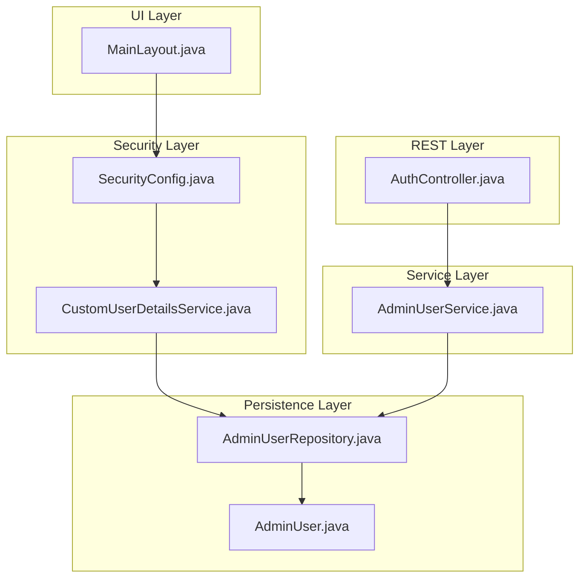
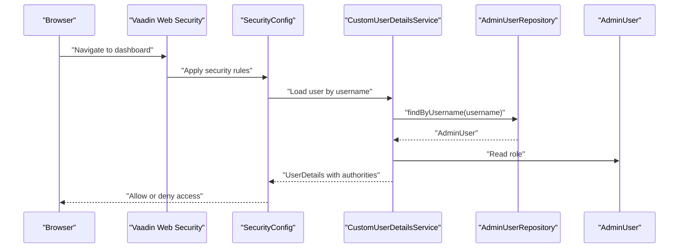
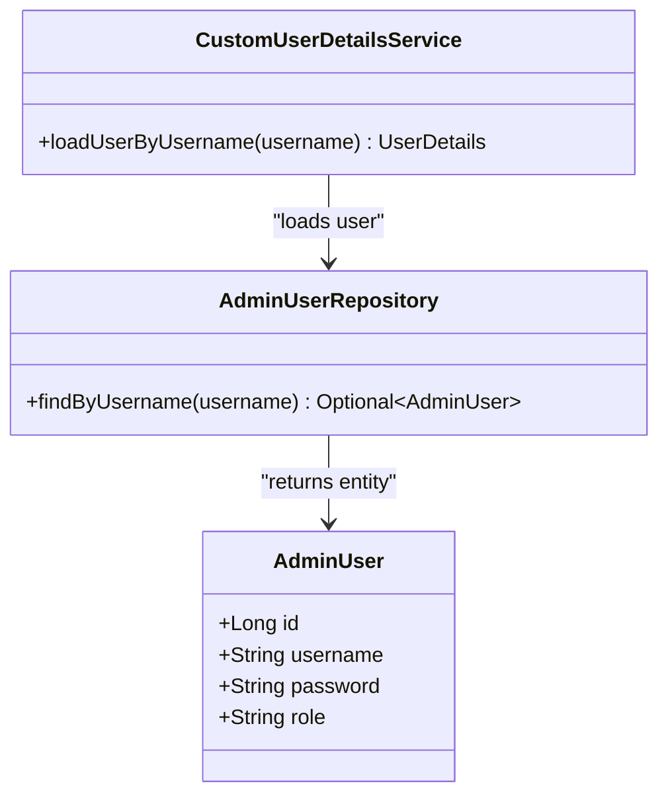
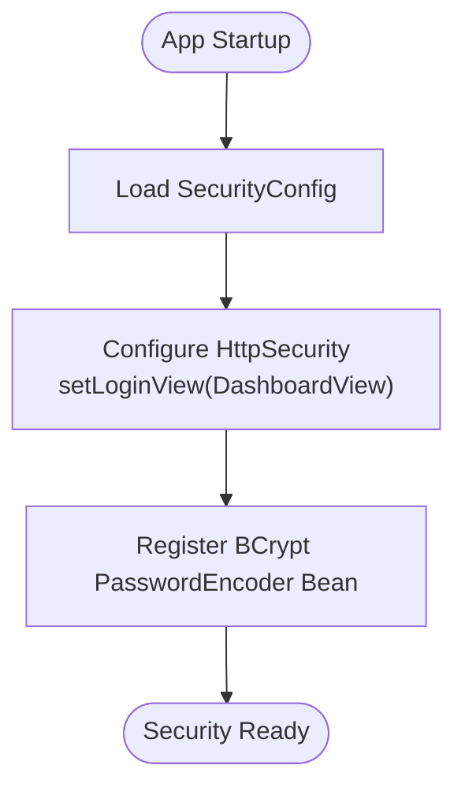
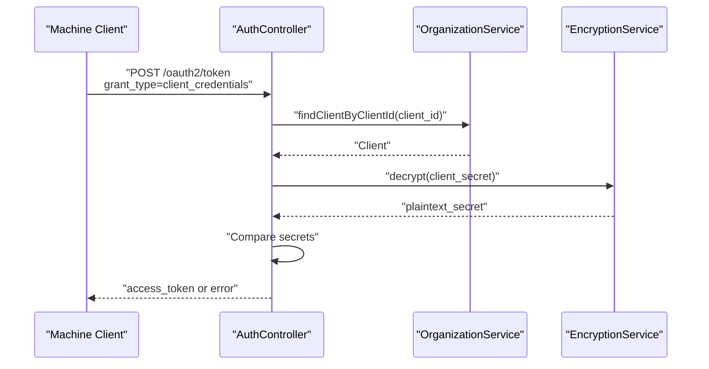
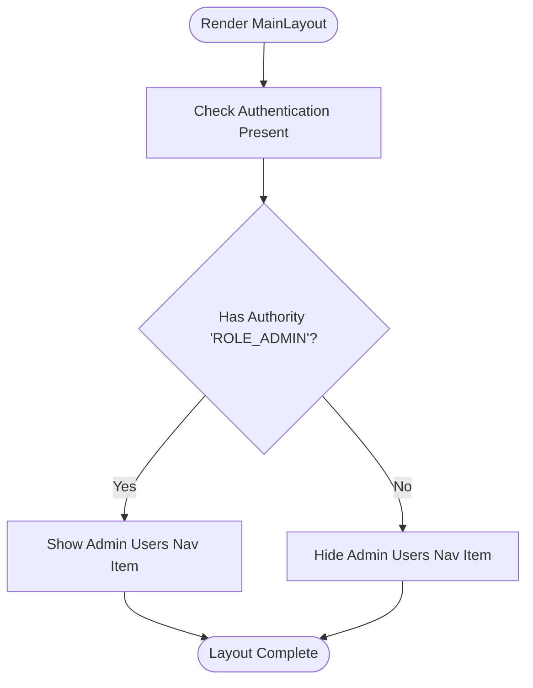
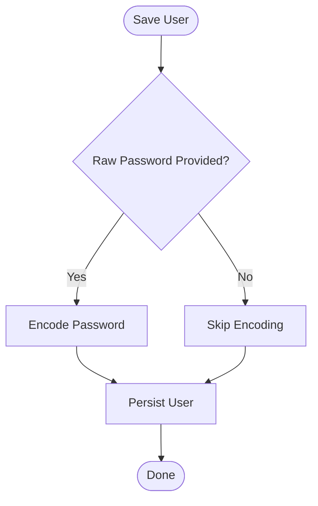
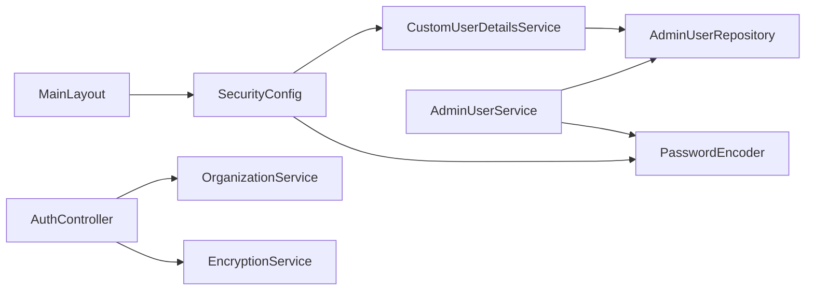

# Role-Based Access Control

<cite>
**Referenced Files in This Document**
- [SecurityConfig.java](file://src/main/java/com/db2api/config/SecurityConfig.java)
- [CustomUserDetailsService.java](file://src/main/java/com/db2api/security/CustomUserDetailsService.java)
- [AdminUserRepository.java](file://src/main/java/com/db2api/repository/admin/AdminUserRepository.java)
- [AdminUser.java](file://src/main/java/com/db2api/persistent/admin/AdminUser.java)
- [AdminUserService.java](file://src/main/java/com/db2api/service/admin/AdminUserService.java)
- [AuthController.java](file://src/main/java/com/db2api/controller/AuthController.java)
- [application.properties](file://src/main/resources/application.properties)
- [MainLayout.java](file://src/main/java/com/db2api/ui/MainLayout.java)
</cite>

## Table of Contents
1. [Introduction](#introduction)
2. [Project Structure](#project-structure)
3. [Core Components](#core-components)
4. [Architecture Overview](#architecture-overview)
5. [Detailed Component Analysis](#detailed-component-analysis)
6. [Dependency Analysis](#dependency-analysis)
7. [Performance Considerations](#performance-considerations)
8. [Troubleshooting Guide](#troubleshooting-guide)
9. [Conclusion](#conclusion)

## Introduction
This document describes the Role-Based Access Control (RBAC) implementation in DB2API. It explains how roles are defined and enforced, how permissions are mapped to users, and how Spring Security integrates with the application’s UI and REST endpoints. It also covers the current role model, limitations, and recommended enhancements for dynamic permissions, role inheritance, and tenant isolation aligned with organizational structures.

## Project Structure
The RBAC-related components are organized across configuration, persistence, service, repository, security, controller, and UI layers:
- Security configuration and user details service define authentication and authorization beans.
- Persistent entities and repositories model admin users and their roles.
- Services handle user lifecycle and password encoding.
- Controllers expose OAuth2 token endpoints for machine-to-machine authentication.
- UI components check authorities for navigation visibility.

**Diagram sources**
- [SecurityConfig.java:17-50](file://src/main/java/com/db2api/config/SecurityConfig.java#L17-L50)
- [CustomUserDetailsService.java:13-31](file://src/main/java/com/db2api/security/CustomUserDetailsService.java#L13-L31)
- [AdminUserRepository.java:13-22](file://src/main/java/com/db2api/repository/admin/AdminUserRepository.java#L13-L22)
- [AdminUser.java:16-42](file://src/main/java/com/db2api/persistent/admin/AdminUser.java#L16-L42)
- [AdminUserService.java:12-40](file://src/main/java/com/db2api/service/admin/AdminUserService.java#L12-L40)
- [AuthController.java:26-110](file://src/main/java/com/db2api/controller/AuthController.java#L26-L110)
- [MainLayout.java:37-75](file://src/main/java/com/db2api/ui/MainLayout.java#L37-L75)

**Section sources**
- [SecurityConfig.java:17-50](file://src/main/java/com/db2api/config/SecurityConfig.java#L17-L50)
- [CustomUserDetailsService.java:13-31](file://src/main/java/com/db2api/security/CustomUserDetailsService.java#L13-L31)
- [AdminUserRepository.java:13-22](file://src/main/java/com/db2api/repository/admin/AdminUserRepository.java#L13-L22)
- [AdminUser.java:16-42](file://src/main/java/com/db2api/persistent/admin/AdminUser.java#L16-L42)
- [AdminUserService.java:12-40](file://src/main/java/com/db2api/service/admin/AdminUserService.java#L12-L40)
- [AuthController.java:26-110](file://src/main/java/com/db2api/controller/AuthController.java#L26-L110)
- [MainLayout.java:37-75](file://src/main/java/com/db2api/ui/MainLayout.java#L37-L75)

## Core Components
- Role definition and storage: Roles are stored as a single string field on the admin user entity and mapped to authorities during authentication.
- User authority mapping: The custom user details service loads a user by username and builds authorities from the stored role.
- Spring Security configuration: The configuration sets up Vaadin web security and a BCrypt password encoder.
- OAuth2 token endpoint: Issues JWT tokens for client credentials, enabling programmatic access to APIs.

Key implementation references:
- Role field and entity mapping: [AdminUser.java:37-42](file://src/main/java/com/db2api/persistent/admin/AdminUser.java#L37-L42)
- Authority building from role: [CustomUserDetailsService.java:21-30](file://src/main/java/com/db2api/security/CustomUserDetailsService.java#L21-L30)
- Security configuration and login view: [SecurityConfig.java:36-40](file://src/main/java/com/db2api/config/SecurityConfig.java#L36-L40)
- Password encoder bean: [SecurityConfig.java:47-50](file://src/main/java/com/db2api/config/SecurityConfig.java#L47-L50)
- OAuth2 token endpoint: [AuthController.java:54-109](file://src/main/java/com/db2api/controller/AuthController.java#L54-L109)

**Section sources**
- [AdminUser.java:37-42](file://src/main/java/com/db2api/persistent/admin/AdminUser.java#L37-L42)
- [CustomUserDetailsService.java:21-30](file://src/main/java/com/db2api/security/CustomUserDetailsService.java#L21-L30)
- [SecurityConfig.java:36-50](file://src/main/java/com/db2api/config/SecurityConfig.java#L36-L50)
- [AuthController.java:54-109](file://src/main/java/com/db2api/controller/AuthController.java#L54-L109)

## Architecture Overview
The RBAC architecture follows a layered design:
- Authentication: Vaadin web security with a custom user details service.
- Authorization: Authorities derived from the user’s role string.
- UI enforcement: Navigation items shown conditionally based on authorities.
- API enforcement: OAuth2 token endpoint for machine clients; endpoint-level protections are configured via Spring Security.

**Diagram sources**
- [SecurityConfig.java:36-40](file://src/main/java/com/db2api/config/SecurityConfig.java#L36-L40)
- [CustomUserDetailsService.java:21-30](file://src/main/java/com/db2api/security/CustomUserDetailsService.java#L21-L30)
- [AdminUserRepository.java:21-21](file://src/main/java/com/db2api/repository/admin/AdminUserRepository.java#L21-L21)
- [AdminUser.java:37-42](file://src/main/java/com/db2api/persistent/admin/AdminUser.java#L37-L42)

## Detailed Component Analysis

### Role Model and Authority Mapping
- Role storage: The admin user entity stores a single role value as a string.
- Authority creation: The user details service constructs authorities from the role string.
- Authority naming convention: Authorities are expected to use the ROLE_ prefix (per Spring Security conventions).

**Diagram sources**
- [AdminUser.java:16-42](file://src/main/java/com/db2api/persistent/admin/AdminUser.java#L16-L42)
- [CustomUserDetailsService.java:13-31](file://src/main/java/com/db2api/security/CustomUserDetailsService.java#L13-L31)
- [AdminUserRepository.java:13-22](file://src/main/java/com/db2api/repository/admin/AdminUserRepository.java#L13-L22)

**Section sources**
- [AdminUser.java:37-42](file://src/main/java/com/db2api/persistent/admin/AdminUser.java#L37-L42)
- [CustomUserDetailsService.java:21-30](file://src/main/java/com/db2api/security/CustomUserDetailsService.java#L21-L30)
- [AdminUserRepository.java:21-21](file://src/main/java/com/db2api/repository/admin/AdminUserRepository.java#L21-L21)

### Spring Security Configuration
- Extends Vaadin web security to integrate with the UI framework.
- Sets the login view to the dashboard.
- Provides a BCrypt password encoder bean for secure password hashing.

**Diagram sources**
- [SecurityConfig.java:36-50](file://src/main/java/com/db2api/config/SecurityConfig.java#L36-L50)

**Section sources**
- [SecurityConfig.java:36-50](file://src/main/java/com/db2api/config/SecurityConfig.java#L36-L50)

### OAuth2 Token Endpoint (Client Credentials)
- Exposes a token endpoint supporting the client credentials grant.
- Validates client credentials against encrypted secrets.
- Issues a signed JWT with default scopes and expiration.

**Diagram sources**
- [AuthController.java:54-109](file://src/main/java/com/db2api/controller/AuthController.java#L54-L109)

**Section sources**
- [AuthController.java:54-109](file://src/main/java/com/db2api/controller/AuthController.java#L54-L109)

### UI-Based Role Enforcement
- The main layout checks the authenticated user’s authorities to decide whether to show administrative navigation items.
- Authority comparison uses the standard authority string form.

**Diagram sources**
- [MainLayout.java:37-66](file://src/main/java/com/db2api/ui/MainLayout.java#L37-L66)

**Section sources**
- [MainLayout.java:37-66](file://src/main/java/com/db2api/ui/MainLayout.java#L37-L66)

### User Lifecycle and Password Management
- Admin users are persisted with a role and password.
- Passwords are encoded before saving.
- User CRUD operations are exposed via the admin service.

**Diagram sources**
- [AdminUserService.java:26-31](file://src/main/java/com/db2api/service/admin/AdminUserService.java#L26-L31)
- [AdminUser.java:33-35](file://src/main/java/com/db2api/persistent/admin/AdminUser.java#L33-L35)

**Section sources**
- [AdminUserService.java:26-31](file://src/main/java/com/db2api/service/admin/AdminUserService.java#L26-L31)
- [AdminUser.java:33-35](file://src/main/java/com/db2api/persistent/admin/AdminUser.java#L33-L35)

## Dependency Analysis
- CustomUserDetailsService depends on AdminUserRepository to load users by username.
- AdminUserService depends on AdminUserRepository and a PasswordEncoder to manage users.
- SecurityConfig depends on CustomUserDetailsService and registers a PasswordEncoder bean.
- AuthController depends on OrganizationService and EncryptionService to validate clients and issue tokens.
- MainLayout depends on Spring Security’s SecurityContextHolder to evaluate authorities.

**Diagram sources**
- [CustomUserDetailsService.java:15-19](file://src/main/java/com/db2api/security/CustomUserDetailsService.java#L15-L19)
- [AdminUserRepository.java:13-22](file://src/main/java/com/db2api/repository/admin/AdminUserRepository.java#L13-L22)
- [AdminUserService.java:14-20](file://src/main/java/com/db2api/service/admin/AdminUserService.java#L14-L20)
- [SecurityConfig.java:19-28](file://src/main/java/com/db2api/config/SecurityConfig.java#L19-L28)
- [AuthController.java:28-43](file://src/main/java/com/db2api/controller/AuthController.java#L28-L43)
- [MainLayout.java:37-42](file://src/main/java/com/db2api/ui/MainLayout.java#L37-L42)

**Section sources**
- [CustomUserDetailsService.java:15-19](file://src/main/java/com/db2api/security/CustomUserDetailsService.java#L15-L19)
- [AdminUserRepository.java:13-22](file://src/main/java/com/db2api/repository/admin/AdminUserRepository.java#L13-L22)
- [AdminUserService.java:14-20](file://src/main/java/com/db2api/service/admin/AdminUserService.java#L14-L20)
- [SecurityConfig.java:19-28](file://src/main/java/com/db2api/config/SecurityConfig.java#L19-L28)
- [AuthController.java:28-43](file://src/main/java/com/db2api/controller/AuthController.java#L28-L43)
- [MainLayout.java:37-42](file://src/main/java/com/db2api/ui/MainLayout.java#L37-L42)

## Performance Considerations
- Password hashing: Using BCrypt ensures secure password storage; consider tuning work factor for deployment needs.
- Authority resolution: Single-role mapping is efficient; avoid heavy computations in user details loading.
- Token generation: JWT signing is lightweight; ensure secret rotation and secure storage in production.

[No sources needed since this section provides general guidance]

## Troubleshooting Guide
- Authentication failures:
  - Verify the user exists and the username matches the stored value.
  - Confirm the role field is populated and authority mapping is applied.
  - Check the password encoder configuration and stored hash compatibility.
- UI navigation not appearing:
  - Ensure the authority string matches the expected form and the role value is correctly mapped.
- OAuth2 token errors:
  - Validate the grant type and client credentials.
  - Confirm the decrypted secret matches the provided secret.
  - Check JWT signing configuration and secret availability.

**Section sources**
- [CustomUserDetailsService.java:21-30](file://src/main/java/com/db2api/security/CustomUserDetailsService.java#L21-L30)
- [AdminUserRepository.java:21-21](file://src/main/java/com/db2api/repository/admin/AdminUserRepository.java#L21-L21)
- [MainLayout.java:37-42](file://src/main/java/com/db2api/ui/MainLayout.java#L37-L42)
- [AuthController.java:59-87](file://src/main/java/com/db2api/controller/AuthController.java#L59-L87)
- [application.properties:31-32](file://src/main/resources/application.properties#L31-L32)

## Conclusion
DB2API implements a straightforward RBAC model centered on a single role per admin user, authority derivation from that role, and enforcement at the UI level. The system integrates Vaadin web security, a custom user details service, and a dedicated OAuth2 token endpoint for machine clients. To evolve toward enterprise-grade RBAC, consider expanding to multiple roles, role inheritance, dynamic permission evaluation, and tenant isolation aligned with organizational structures.