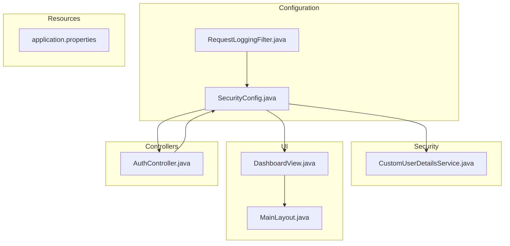
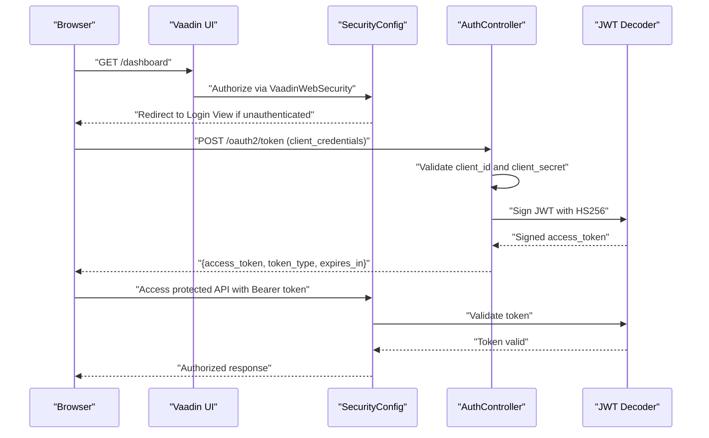
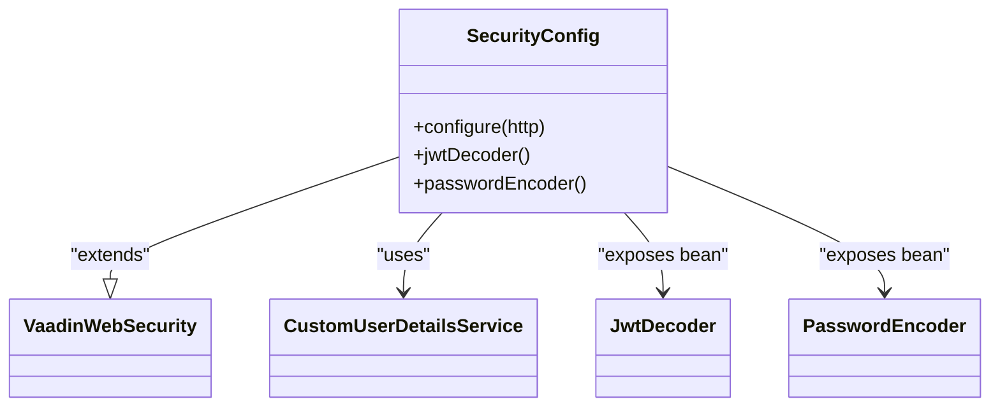
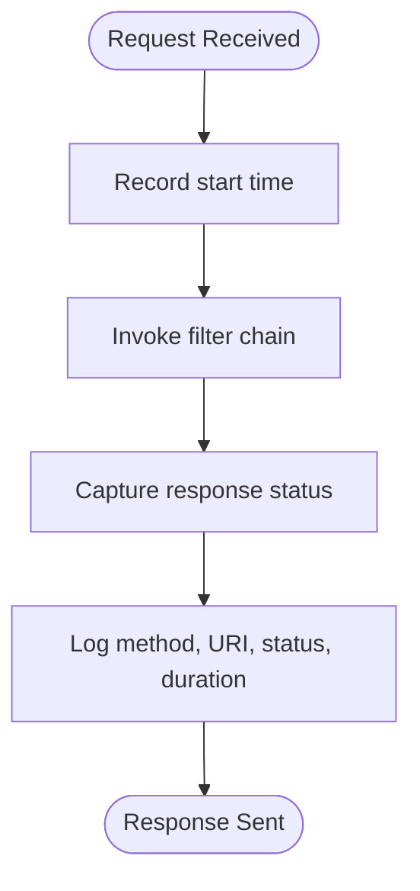
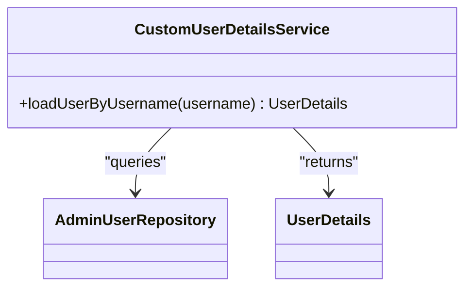
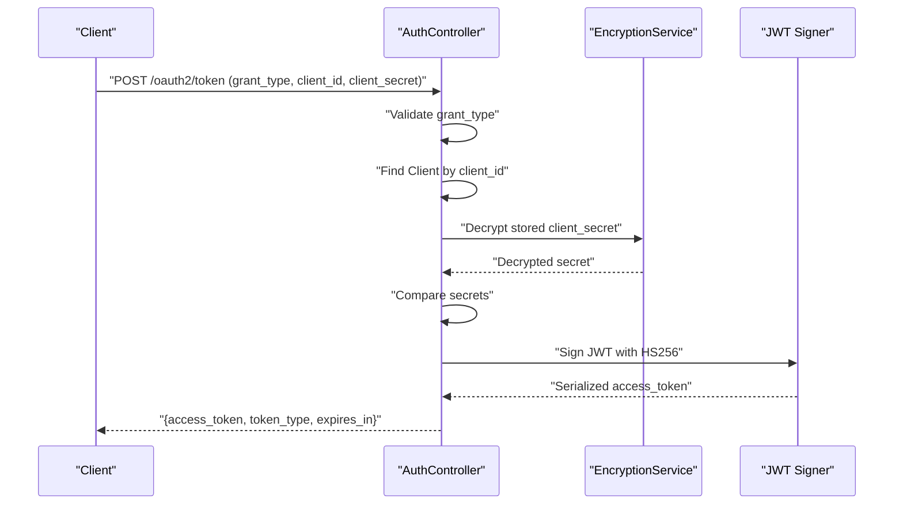
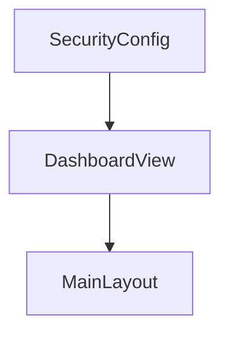
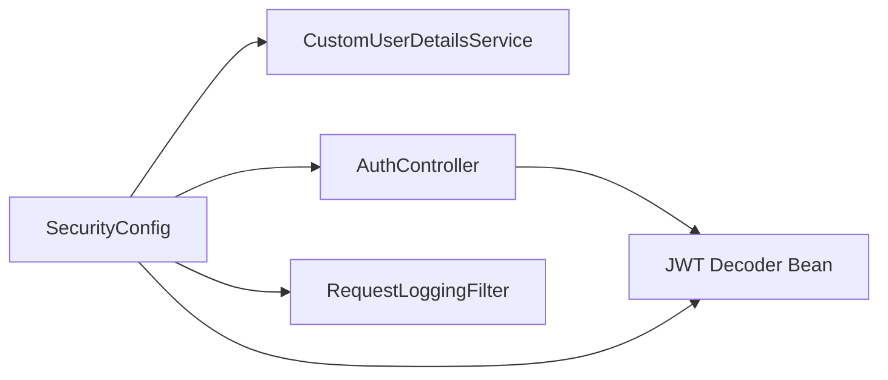

# Security Configuration & Filters

<cite>
**Referenced Files in This Document**
- [SecurityConfig.java](file://src/main/java/com/db2api/config/SecurityConfig.java)
- [RequestLoggingFilter.java](file://src/main/java/com/db2api/config/RequestLoggingFilter.java)
- [CustomUserDetailsService.java](file://src/main/java/com/db2api/security/CustomUserDetailsService.java)
- [application.properties](file://src/main/resources/application.properties)
- [AuthController.java](file://src/main/java/com/db2api/controller/AuthController.java)
- [DashboardView.java](file://src/main/java/com/db2api/ui/DashboardView.java)
- [MainLayout.java](file://src/main/java/com/db2api/ui/MainLayout.java)
</cite>

## Table of Contents
1. [Introduction](#introduction)
2. [Project Structure](#project-structure)
3. [Core Components](#core-components)
4. [Architecture Overview](#architecture-overview)
5. [Detailed Component Analysis](#detailed-component-analysis)
6. [Dependency Analysis](#dependency-analysis)
7. [Performance Considerations](#performance-considerations)
8. [Troubleshooting Guide](#troubleshooting-guide)
9. [Conclusion](#conclusion)

## Introduction
This document explains the security configuration and filters used by DB2API. It focuses on Spring Security setup, Vaadin-specific security integration, JWT-based resource server protection for dynamic API endpoints, request logging, and administrative web interface considerations. It also outlines how to configure authentication providers, CSRF protection, session management, and security headers, along with practical guidance for integrating filters and interceptors.

## Project Structure
Security-related components are organized under dedicated packages:
- Configuration: Spring Security configuration and request logging filter
- Security: Authentication provider and user details service
- UI: Vaadin views used for the administrative web interface
- Controllers: OAuth2 token endpoint for issuing JWT access tokens

**Diagram sources**
- [SecurityConfig.java:28-63](file://src/main/java/com/db2api/config/SecurityConfig.java#L28-L63)
- [RequestLoggingFilter.java:17-49](file://src/main/java/com/db2api/config/RequestLoggingFilter.java#L17-L49)
- [CustomUserDetailsService.java:12-31](file://src/main/java/com/db2api/security/CustomUserDetailsService.java#L12-L31)
- [AuthController.java:54-109](file://src/main/java/com/db2api/controller/AuthController.java#L54-L109)
- [DashboardView.java](file://src/main/java/com/db2api/ui/DashboardView.java)
- [MainLayout.java](file://src/main/java/com/db2api/ui/MainLayout.java)
- [application.properties:1-20](file://src/main/resources/application.properties#L1-L20)

**Section sources**
- [SecurityConfig.java:28-63](file://src/main/java/com/db2api/config/SecurityConfig.java#L28-L63)
- [application.properties:1-20](file://src/main/resources/application.properties#L1-L20)

## Core Components
- SecurityConfig: Extends VaadinWebSecurity to configure form-based login for the Vaadin UI and JWT-based resource server protection for dynamic API endpoints.
- RequestLoggingFilter: A OncePerRequestFilter that logs request method, URI, response status, and processing duration.
- CustomUserDetailsService: Loads admin user details for form-based authentication.
- AuthController: Implements an OAuth2 token endpoint that issues JWT access tokens for client credentials.

Key capabilities:
- Vaadin login view configured and integrated with Spring Security.
- Stateless JWT resource server protection for dynamic API endpoints.
- BCrypt password encoding and JWT decoding beans.
- Centralized request logging with timing metrics.

**Section sources**
- [SecurityConfig.java:28-89](file://src/main/java/com/db2api/config/SecurityConfig.java#L28-L89)
- [RequestLoggingFilter.java:17-49](file://src/main/java/com/db2api/config/RequestLoggingFilter.java#L17-L49)
- [CustomUserDetailsService.java:12-31](file://src/main/java/com/db2api/security/CustomUserDetailsService.java#L12-L31)
- [AuthController.java:54-109](file://src/main/java/com/db2api/controller/AuthController.java#L54-L109)

## Architecture Overview
The security architecture separates UI and API concerns:
- Vaadin UI secured via form-based login backed by a custom UserDetailsService.
- Dynamic API endpoints (/api/dynamic/** and /graphql) protected by a JWT resource server using HS256.
- RequestLoggingFilter intercepts all requests to capture timing and status information.

**Diagram sources**
- [SecurityConfig.java:54-62](file://src/main/java/com/db2api/config/SecurityConfig.java#L54-L62)
- [AuthController.java:54-109](file://src/main/java/com/db2api/controller/AuthController.java#L54-L109)
- [SecurityConfig.java:70-79](file://src/main/java/com/db2api/config/SecurityConfig.java#L70-L79)

## Detailed Component Analysis

### Spring Security Configuration (SecurityConfig)
- Extends VaadinWebSecurity to integrate Vaadin’s security model with Spring Security.
- Sets a Vaadin login view for the administrative UI.
- Applies securityMatcher to protect dynamic API endpoints and GraphQL with JWT resource server authentication.
- Enforces stateless session management for API endpoints.
- Provides a JWT decoder bean using HS256 with a configurable base64-encoded secret.
- Provides a BCrypt password encoder bean.

**Diagram sources**
- [SecurityConfig.java:30-89](file://src/main/java/com/db2api/config/SecurityConfig.java#L30-L89)
- [CustomUserDetailsService.java:12-31](file://src/main/java/com/db2api/security/CustomUserDetailsService.java#L12-L31)

**Section sources**
- [SecurityConfig.java:54-62](file://src/main/java/com/db2api/config/SecurityConfig.java#L54-L62)
- [SecurityConfig.java:70-79](file://src/main/java/com/db2api/config/SecurityConfig.java#L70-L79)
- [SecurityConfig.java:86-89](file://src/main/java/com/db2api/config/SecurityConfig.java#L86-L89)

### Request Logging Filter (RequestLoggingFilter)
- Implements OncePerRequestFilter to log request method, URI, response status, and duration.
- Captures start time before invoking the filter chain and logs after completion.
- Suitable for monitoring and diagnostics; includes a note to persist logs to the database for the Admin Dashboard.

**Diagram sources**
- [RequestLoggingFilter.java:31-48](file://src/main/java/com/db2api/config/RequestLoggingFilter.java#L31-L48)

**Section sources**
- [RequestLoggingFilter.java:17-49](file://src/main/java/com/db2api/config/RequestLoggingFilter.java#L17-L49)

### Custom Authentication Provider (CustomUserDetailsService)
- Implements UserDetailsService to load admin user details by username.
- Builds a UserDetails object with username, password, and roles for form-based authentication.

**Diagram sources**
- [CustomUserDetailsService.java:12-31](file://src/main/java/com/db2api/security/CustomUserDetailsService.java#L12-L31)

**Section sources**
- [CustomUserDetailsService.java:21-30](file://src/main/java/com/db2api/security/CustomUserDetailsService.java#L21-L30)

### OAuth2 Token Endpoint (AuthController)
- Exposes a token endpoint supporting client_credentials grant.
- Validates client credentials against stored secrets (decrypted via EncryptionService).
- Issues a signed JWT with HS256, including subject, scopes, issuer, and expiration.

**Diagram sources**
- [AuthController.java:54-109](file://src/main/java/com/db2api/controller/AuthController.java#L54-L109)

**Section sources**
- [AuthController.java:54-109](file://src/main/java/com/db2api/controller/AuthController.java#L54-L109)

### Vaadin Administrative Web Interface
- SecurityConfig sets a Vaadin login view for the administrative UI.
- The MainLayout and DashboardView are part of the Vaadin UI hierarchy; SecurityConfig integrates with Vaadin’s security model to protect navigation and views.

**Diagram sources**
- [SecurityConfig.java:56](file://src/main/java/com/db2api/config/SecurityConfig.java#L56)
- [DashboardView.java](file://src/main/java/com/db2api/ui/DashboardView.java)
- [MainLayout.java](file://src/main/java/com/db2api/ui/MainLayout.java)

**Section sources**
- [SecurityConfig.java:56](file://src/main/java/com/db2api/config/SecurityConfig.java#L56)

## Dependency Analysis
- SecurityConfig depends on CustomUserDetailsService for form-based authentication and exposes JWT decoder and password encoder beans.
- AuthController depends on OrganizationService and EncryptionService to validate clients and issue JWTs.
- RequestLoggingFilter is a standalone filter that integrates with the servlet filter chain.

**Diagram sources**
- [SecurityConfig.java:32-35](file://src/main/java/com/db2api/config/SecurityConfig.java#L32-L35)
- [SecurityConfig.java:70-79](file://src/main/java/com/db2api/config/SecurityConfig.java#L70-L79)
- [AuthController.java:54-109](file://src/main/java/com/db2api/controller/AuthController.java#L54-L109)
- [RequestLoggingFilter.java:17-18](file://src/main/java/com/db2api/config/RequestLoggingFilter.java#L17-L18)

**Section sources**
- [SecurityConfig.java:32-35](file://src/main/java/com/db2api/config/SecurityConfig.java#L32-L35)
- [AuthController.java:54-109](file://src/main/java/com/db2api/controller/AuthController.java#L54-L109)
- [RequestLoggingFilter.java:17-18](file://src/main/java/com/db2api/config/RequestLoggingFilter.java#L17-L18)

## Performance Considerations
- RequestLoggingFilter captures timing per request; ensure logging volume is controlled in production environments to avoid I/O overhead.
- JWT decoding uses HS256 with a symmetric key; keep the secret secure and rotate periodically.
- Stateful sessions are disabled for API endpoints; ensure clients handle token refresh appropriately.

[No sources needed since this section provides general guidance]

## Troubleshooting Guide
Common issues and resolutions:
- Unauthorized access to dynamic API endpoints: Verify the Authorization header contains a valid Bearer token issued by the token endpoint.
- Form-based login failures: Confirm the username exists and the password matches the stored hash; check CustomUserDetailsService behavior.
- JWT validation errors: Ensure the app.jwt.secret property is correctly set and matches the signing key used by the token endpoint.
- Missing request logs: Confirm RequestLoggingFilter is registered in the filter chain and logging level is enabled.

**Section sources**
- [SecurityConfig.java:58-62](file://src/main/java/com/db2api/config/SecurityConfig.java#L58-L62)
- [CustomUserDetailsService.java:21-30](file://src/main/java/com/db2api/security/CustomUserDetailsService.java#L21-L30)
- [application.properties:1-20](file://src/main/resources/application.properties#L1-L20)

## Conclusion
DB2API employs a layered security model: Vaadin UI secured via form-based authentication and a custom UserDetailsService, and dynamic API endpoints protected by a JWT resource server with stateless session management. A request logging filter provides operational visibility, while the OAuth2 token endpoint enables programmatic access with client credentials. The configuration is modular and extensible, allowing straightforward addition of CSRF protection, advanced session management, and security headers as needed.