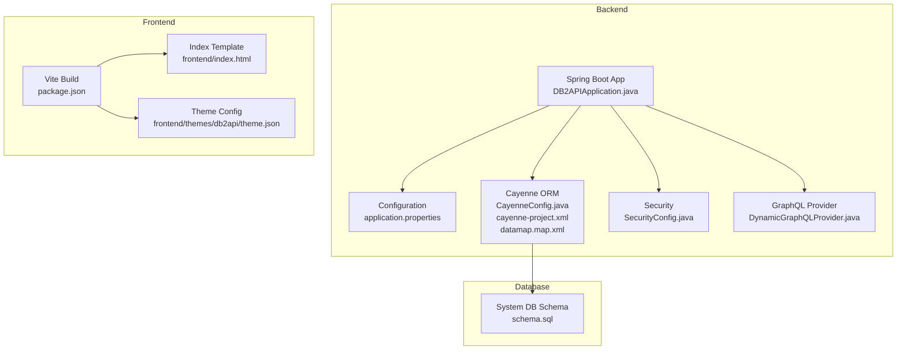
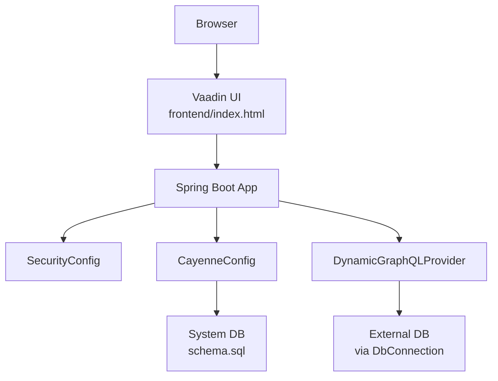
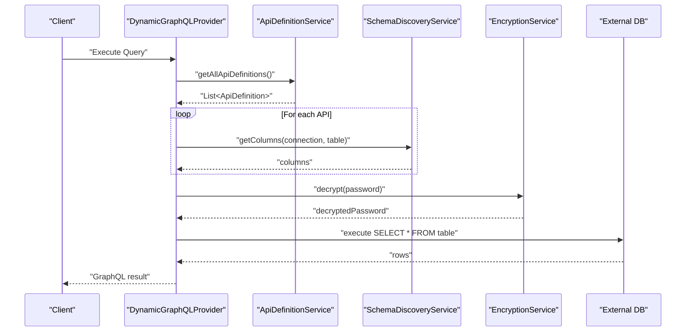
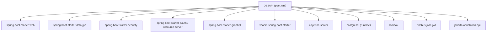

# Configuration & Deployment

<cite>
**Referenced Files in This Document**
- [application.properties](file://src/main/resources/application.properties)
- [pom.xml](file://pom.xml)
- [CayenneConfig.java](file://src/main/java/com/db2api/config/CayenneConfig.java)
- [cayenne-project.xml](file://src/main/resources/cayenne-project.xml)
- [datamap.map.xml](file://src/main/resources/datamap.map.xml)
- [schema.sql](file://src/main/resources/schema.sql)
- [SecurityConfig.java](file://src/main/java/com/db2api/config/SecurityConfig.java)
- [DynamicGraphQLProvider.java](file://src/main/java/com/db2api/config/DynamicGraphQLProvider.java)
- [package.json](file://package.json)
- [index.html](file://frontend/index.html)
- [theme.json](file://frontend/themes/db2api/theme.json)
- [README.md](file://README.md)
- [SECURITY.md](file://SECURITY.md)
- [effective-pom.xml](file://effective-pom.xml)
</cite>

## Table of Contents
1. [Introduction](#introduction)
2. [Project Structure](#project-structure)
3. [Core Components](#core-components)
4. [Architecture Overview](#architecture-overview)
5. [Detailed Component Analysis](#detailed-component-analysis)
6. [Dependency Analysis](#dependency-analysis)
7. [Performance Considerations](#performance-considerations)
8. [Troubleshooting Guide](#troubleshooting-guide)
9. [Conclusion](#conclusion)
10. [Appendices](#appendices)

## Introduction
This document provides comprehensive configuration and deployment guidance for DB2API. It covers application configuration, database setup, build and deployment processes, environment management, production deployment strategies, security considerations, and operational maintenance. It also documents the application.properties configuration, Cayenne ORM setup, Maven build configuration, and the frontend build process.

## Project Structure
DB2API is a Spring Boot application with a Vaadin UI and Apache Cayenne ORM. The backend exposes REST and GraphQL endpoints and manages database connections and API definitions. The frontend is a Vaadin-based single-page application built via Vite and TypeScript.

**Diagram sources**
- [application.properties:1-20](file://src/main/resources/application.properties#L1-L20)
- [CayenneConfig.java:1-29](file://src/main/java/com/db2api/config/CayenneConfig.java#L1-L29)
- [cayenne-project.xml:1-5](file://src/main/resources/cayenne-project.xml#L1-L5)
- [datamap.map.xml:1-83](file://src/main/resources/datamap.map.xml#L1-L83)
- [schema.sql:1-39](file://src/main/resources/schema.sql#L1-L39)
- [SecurityConfig.java:1-52](file://src/main/java/com/db2api/config/SecurityConfig.java#L1-L52)
- [DynamicGraphQLProvider.java:1-178](file://src/main/java/com/db2api/config/DynamicGraphQLProvider.java#L1-L178)
- [package.json:1-251](file://package.json#L1-L251)
- [index.html:1-24](file://frontend/index.html#L1-L24)
- [theme.json:1-10](file://frontend/themes/db2api/theme.json#L1-L10)

**Section sources**
- [README.md:65-82](file://README.md#L65-L82)

## Core Components
- Application configuration: Defines server port, datasource, JPA/Hibernate, and Vaadin launch settings.
- Cayenne ORM: Centralizes dynamic database interactions and integrates with Spring’s DataSource.
- Security: Vaadin and Spring Security configuration with BCrypt password encoding.
- GraphQL provider: Dynamically generates a GraphQL schema from API definitions and external database discovery.
- Frontend build: Vite-based build pipeline with Vaadin dependencies and TypeScript.

**Section sources**
- [application.properties:1-20](file://src/main/resources/application.properties#L1-L20)
- [CayenneConfig.java:1-29](file://src/main/java/com/db2api/config/CayenneConfig.java#L1-L29)
- [SecurityConfig.java:1-52](file://src/main/java/com/db2api/config/SecurityConfig.java#L1-L52)
- [DynamicGraphQLProvider.java:1-178](file://src/main/java/com/db2api/config/DynamicGraphQLProvider.java#L1-L178)
- [package.json:1-251](file://package.json#L1-L251)

## Architecture Overview
The system architecture integrates Spring Boot, Vaadin UI, Apache Cayenne ORM, and external database connectivity. The backend exposes REST and GraphQL endpoints. The frontend is served by the backend and interacts with the backend APIs.

**Diagram sources**
- [application.properties:1-20](file://src/main/resources/application.properties#L1-L20)
- [CayenneConfig.java:1-29](file://src/main/java/com/db2api/config/CayenneConfig.java#L1-L29)
- [schema.sql:1-39](file://src/main/resources/schema.sql#L1-L39)
- [DynamicGraphQLProvider.java:1-178](file://src/main/java/com/db2api/config/DynamicGraphQLProvider.java#L1-L178)

## Detailed Component Analysis

### Application Configuration (application.properties)
Key areas:
- Server port and Vaadin browser launch behavior.
- Datasource configuration for the system database.
- JPA/Hibernate settings including dialect and DDL strategy.
- OAuth2 resource server starter is present; authentication and authorization are configured elsewhere.

Operational guidance:
- Override sensitive properties via environment variables or externalized configuration profiles.
- For production, externalize credentials and enable SSL/TLS.
- Keep show-sql disabled and set ddl-auto to validate or none in production.

**Section sources**
- [application.properties:1-20](file://src/main/resources/application.properties#L1-L20)

### Cayenne ORM Setup
- ServerRuntime bean is created and configured with cayenne-project.xml and the primary DataSource.
- The datamap defines defaultPackage and entity mappings for AdminUser, ApiDefinition, Client, DbConnection, and Organization, including relationships.
- The domain configuration references the datamap.

Operational guidance:
- Ensure the datamap matches the actual system DB schema.
- Use the system DB to persist API definitions and connections; external DB credentials are stored encrypted and decrypted at runtime.

**Section sources**
- [CayenneConfig.java:1-29](file://src/main/java/com/db2api/config/CayenneConfig.java#L1-L29)
- [cayenne-project.xml:1-5](file://src/main/resources/cayenne-project.xml#L1-L5)
- [datamap.map.xml:1-83](file://src/main/resources/datamap.map.xml#L1-L83)

### Security Configuration
- Extends VaadinWebSecurity and sets the login view to the dashboard.
- Uses BCryptPasswordEncoder for password encoding.
- Includes OAuth2 Resource Server starter; further resource server configuration is implied by the starter presence.

Operational guidance:
- Enforce HTTPS in production.
- Configure proper CORS and CSRF policies for Vaadin.
- Align roles and permissions with organizational needs.

**Section sources**
- [SecurityConfig.java:1-52](file://src/main/java/com/db2api/config/SecurityConfig.java#L1-L52)

### Dynamic GraphQL Provider
- Builds a runtime GraphQL schema from API definitions.
- Discovers columns from external databases using SchemaDiscoveryService.
- Decrypts external DB passwords via EncryptionService before connecting.
- Generates executable schema and wires data fetchers per API definition.

Operational guidance:
- Ensure EncryptionService is properly configured for decryption.
- Monitor external DB connectivity and handle exceptions gracefully.
- Consider caching discovered schemas to reduce repeated reflection work.

**Diagram sources**
- [DynamicGraphQLProvider.java:1-178](file://src/main/java/com/db2api/config/DynamicGraphQLProvider.java#L1-L178)

**Section sources**
- [DynamicGraphQLProvider.java:1-178](file://src/main/java/com/db2api/config/DynamicGraphQLProvider.java#L1-L178)

### Frontend Build Process
- Dependencies managed via package.json with Vaadin components and Vite toolchain.
- Index template and theme configuration define the UI shell and Lumo theme imports.
- The build produces a static frontend bundle integrated with the Spring Boot backend.

Operational guidance:
- Use production builds for deployment.
- Ensure Node.js and npm/yarn are available in CI/CD pipelines.
- Consider pre-rendering or SSR if needed for SEO or performance.

**Section sources**
- [package.json:1-251](file://package.json#L1-L251)
- [index.html:1-24](file://frontend/index.html#L1-L24)
- [theme.json:1-10](file://frontend/themes/db2api/theme.json#L1-L10)

## Dependency Analysis
- Backend dependencies include Spring Web, Data JPA, Security, OAuth2 Resource Server, GraphQL, Vaadin, and PostgreSQL JDBC.
- Effective POM shows managed versions for Cayenne, GraphQL Java, Vaadin, and others.
- DB2 JDBC driver is present in the effective POM, enabling DB2 connectivity.

**Diagram sources**
- [pom.xml:25-99](file://pom.xml#L25-L99)
- [effective-pom.xml:46-243](file://effective-pom.xml#L46-L243)

**Section sources**
- [pom.xml:1-130](file://pom.xml#L1-L130)
- [effective-pom.xml:1-800](file://effective-pom.xml#L1-L800)

## Performance Considerations
- Disable SQL logging in production to reduce overhead.
- Set Hibernate ddl-auto to validate or none to avoid schema alteration overhead.
- Use connection pooling (HikariCP is managed by Spring Boot) and tune pool sizes according to workload.
- Cache discovered GraphQL schemas and column metadata where feasible.
- Minimize frontend bundle size and enable compression/gzip.
- Use asynchronous processing for long-running tasks.

## Troubleshooting Guide
Common issues and resolutions:
- Database connectivity failures:
  - Verify datasource URL, username, and password in application.properties or environment overrides.
  - Confirm the system DB is initialized using schema.sql.
- GraphQL schema generation errors:
  - Ensure API definitions exist and external DB credentials are correct.
  - Check that EncryptionService can decrypt stored passwords.
- Frontend not rendering:
  - Confirm the frontend is built and assets are served by the backend.
  - Validate index.html and theme.json integrity.
- Security-related issues:
  - Ensure HTTPS is enabled and cookies are marked secure.
  - Review Vaadin login view configuration and session management.

**Section sources**
- [application.properties:1-20](file://src/main/resources/application.properties#L1-L20)
- [schema.sql:1-39](file://src/main/resources/schema.sql#L1-L39)
- [DynamicGraphQLProvider.java:1-178](file://src/main/java/com/db2api/config/DynamicGraphQLProvider.java#L1-L178)
- [index.html:1-24](file://frontend/index.html#L1-L24)
- [theme.json:1-10](file://frontend/themes/db2api/theme.json#L1-L10)
- [SecurityConfig.java:1-52](file://src/main/java/com/db2api/config/SecurityConfig.java#L1-L52)

## Conclusion
DB2API combines a Spring Boot backend, Vaadin UI, and Apache Cayenne ORM to deliver dynamic API generation capabilities. Proper configuration of application properties, Cayenne ORM, and security is essential for reliable operation. The Maven and frontend build processes support streamlined development and deployment. Adopt the production deployment strategies and security recommendations outlined here to ensure a secure, scalable, and maintainable platform.

## Appendices

### Environment Management and Profiles
- Use Spring profiles (e.g., dev, prod) to manage environment-specific settings.
- Externalize configuration using environment variables or mounted secrets in containers.
- Example keys to externalize:
  - server.port
  - spring.datasource.* (URL, username, password)
  - vaadin.* (browser launch behavior)
  - Security-related properties (e.g., OAuth2 issuer, signing keys)

**Section sources**
- [application.properties:1-20](file://src/main/resources/application.properties#L1-L20)
- [README.md:36-64](file://README.md#L36-L64)

### Database Setup Procedures
- Initialize the system database using schema.sql.
- Ensure the system DB is reachable by the application.
- For external DB connections, store connection details in the system DB and encrypt passwords using EncryptionService.

**Section sources**
- [schema.sql:1-39](file://src/main/resources/schema.sql#L1-L39)
- [datamap.map.xml:1-83](file://src/main/resources/datamap.map.xml#L1-L83)
- [DynamicGraphQLProvider.java:1-178](file://src/main/java/com/db2api/config/DynamicGraphQLProvider.java#L1-L178)

### Build and Deployment Processes
- Backend build:
  - Use Maven with Spring Boot plugin.
  - Run tests and package as a Spring Boot executable jar.
- Frontend build:
  - Install dependencies via npm/yarn.
  - Build the frontend bundle and integrate with the backend.
- Containerization:
  - Package the Spring Boot jar and serve the frontend statically.
  - Expose server.port and configure health checks.

**Section sources**
- [pom.xml:112-127](file://pom.xml#L112-L127)
- [package.json:1-251](file://package.json#L1-L251)
- [README.md:36-64](file://README.md#L36-L64)

### Production Deployment Strategies
- Platform-agnostic steps:
  - Provision a system database and external databases.
  - Deploy the Spring Boot application with environment-specific configuration.
  - Serve the frontend from the backend or a CDN.
- Security hardening:
  - Enforce HTTPS and secure cookies.
  - Restrict exposed endpoints and apply rate limiting.
  - Rotate secrets and review dependency licenses regularly.
- Monitoring and observability:
  - Enable health endpoints and metrics.
  - Integrate logs and traces.
  - Set up alerts for critical failures.

**Section sources**
- [SecurityConfig.java:1-52](file://src/main/java/com/db2api/config/SecurityConfig.java#L1-L52)
- [SECURITY.md:1-22](file://SECURITY.md#L1-L22)

### Security Considerations for Production
- Secrets management:
  - Store database credentials and encryption keys in a secret manager.
  - Avoid committing secrets to version control.
- Network and transport:
  - Enforce TLS termination at the edge or load balancer.
  - Restrict inbound traffic to necessary ports.
- Access control:
  - Configure RBAC and enforce least privilege.
  - Audit authentication and authorization events.
- Vulnerability management:
  - Regularly scan dependencies and apply security patches.
  - Follow the project’s security policy for reporting vulnerabilities.

**Section sources**
- [SECURITY.md:1-22](file://SECURITY.md#L1-L22)
- [pom.xml:25-99](file://pom.xml#L25-L99)
- [effective-pom.xml:1-800](file://effective-pom.xml#L1-L800)