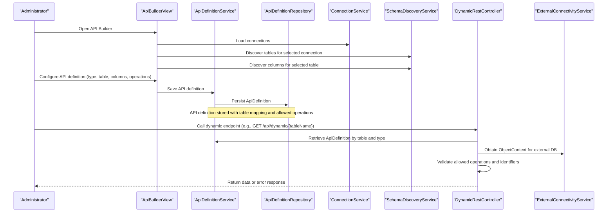
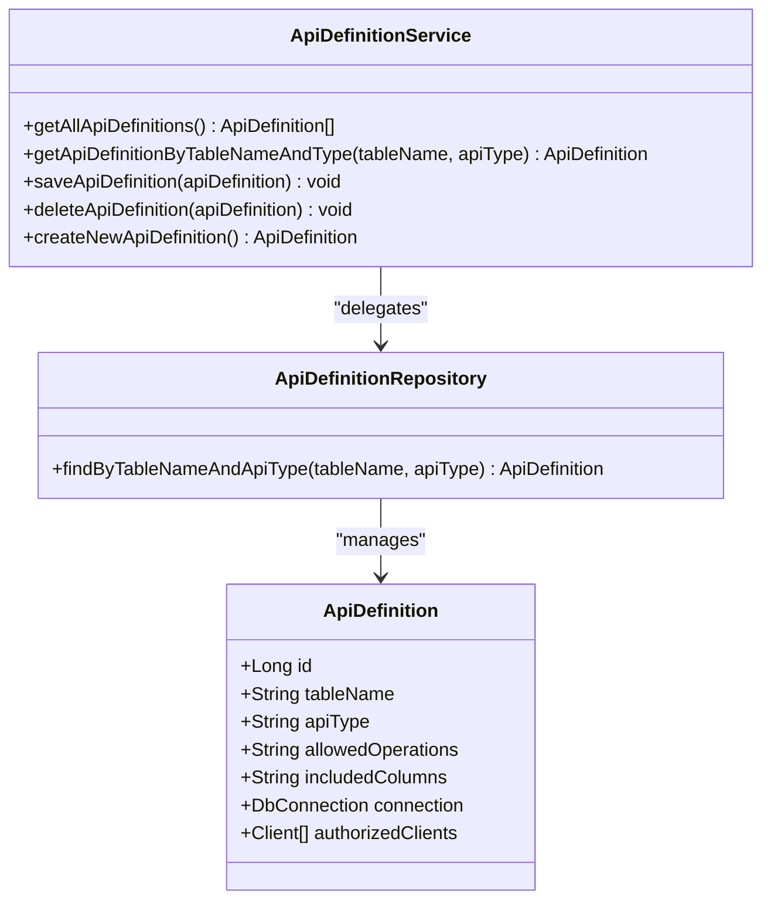
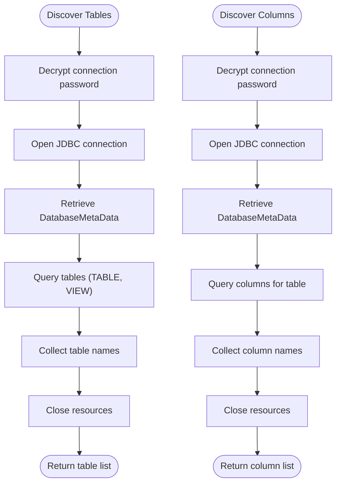
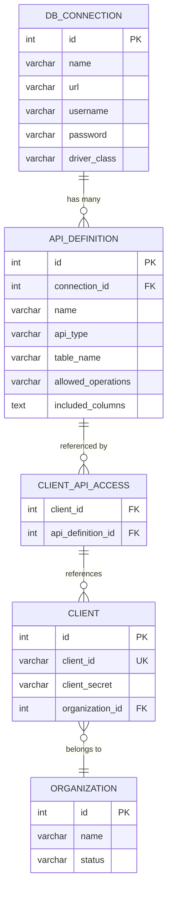
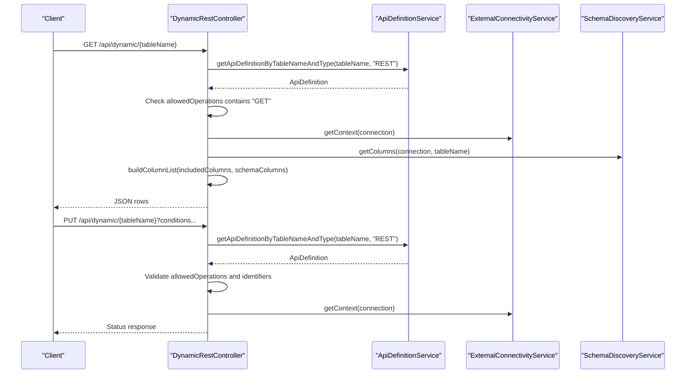
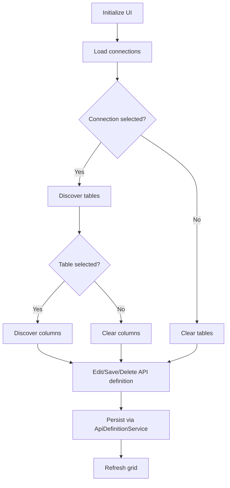

# API Definition Service

<cite>
**Referenced Files in This Document**
- [ApiDefinitionService.java](file://src/main/java/com/db2api/service/api/ApiDefinitionService.java)
- [SchemaDiscoveryService.java](file://src/main/java/com/db2api/service/api/SchemaDiscoveryService.java)
- [ApiDefinition.java](file://src/main/java/com/db2api/persistent/api/ApiDefinition.java)
- [ApiDefinitionRepository.java](file://src/main/java/com/db2api/repository/api/ApiDefinitionRepository.java)
- [ApiBuilderView.java](file://src/main/java/com/db2api/ui/api/ApiBuilderView.java)
- [DynamicRestController.java](file://src/main/java/com/db2api/controller/DynamicRestController.java)
- [EncryptionService.java](file://src/main/java/com/db2api/service/EncryptionService.java)
- [ExternalConnectivityService.java](file://src/main/java/com/db2api/service/connection/ExternalConnectivityService.java)
- [ConnectionService.java](file://src/main/java/com/db2api/service/connection/ConnectionService.java)
- [DbConnection.java](file://src/main/java/com/db2api/persistent/connection/DbConnection.java)
- [Client.java](file://src/main/java/com/db2api/persistent/organization/Client.java)
- [application.properties](file://src/main/resources/application.properties)
- [schema.sql](file://src/main/resources/schema.sql)
- [cayenne-project.xml](file://src/main/resources/cayenne-project.xml)
- [datamap.map.xml](file://src/main/resources/datamap.map.xml)
</cite>

## Table of Contents
1. [Introduction](#introduction)
2. [Project Structure](#project-structure)
3. [Core Components](#core-components)
4. [Architecture Overview](#architecture-overview)
5. [Detailed Component Analysis](#detailed-component-analysis)
6. [Dependency Analysis](#dependency-analysis)
7. [Performance Considerations](#performance-considerations)
8. [Troubleshooting Guide](#troubleshooting-guide)
9. [Conclusion](#conclusion)
10. [Appendices](#appendices)

## Introduction
This document describes the ApiDefinitionService implementation and its ecosystem for dynamic API definition creation, management, and lifecycle. It explains how administrators define dynamic REST and GraphQL endpoints by mapping database tables to API configurations, how the system integrates with SchemaDiscoveryService for automatic schema introspection, and how the runtime controller enforces security and validates dynamic SQL generation. Practical examples illustrate creating API definitions, mapping endpoints, and configuring dynamic API behavior. The document also covers the ApiDefinition entity structure, its relationships to database schemas and clients, repository operations, API versioning considerations, endpoint security, and dynamic API generation patterns.

## Project Structure
The API definition service spans several layers:
- Persistent entities define the data model for API definitions, database connections, and client access.
- Services encapsulate business logic for managing API definitions, discovering database schemas, and connecting to external databases.
- Repositories provide data access for persistence.
- Controllers expose dynamic REST endpoints based on configured API definitions.
- UI components enable administrators to build and manage API definitions.

```mermaid
graph TB
subgraph "UI Layer"
ABV["ApiBuilderView"]
end
subgraph "Service Layer"
ADS["ApiDefinitionService"]
SDS["SchemaDiscoveryService"]
ECS["ExternalConnectivityService"]
CS["ConnectionService"]
ENC["EncryptionService"]
end
subgraph "Persistence Layer"
ADR["ApiDefinitionRepository"]
AD["ApiDefinition"]
DC["DbConnection"]
CL["Client"]
end
subgraph "Runtime Layer"
DRC["DynamicRestController"]
end
ABV --> ADS
ABV --> CS
ABV --> SDS
ADS --> ADR
ADS --> AD
CS --> DC
ECS --> DC
ECS --> ENC
SDS --> DC
DRC --> ADS
DRC --> ECS
DRC --> SDS
AD --> DC
CL <- --> AD
```

**Diagram sources**
- [ApiBuilderView.java:31-55](file://src/main/java/com/db2api/ui/api/ApiBuilderView.java#L31-L55)
- [ApiDefinitionService.java:10-17](file://src/main/java/com/db2api/service/api/ApiDefinitionService.java#L10-L17)
- [SchemaDiscoveryService.java:15-22](file://src/main/java/com/db2api/service/api/SchemaDiscoveryService.java#L15-L22)
- [ExternalConnectivityService.java:15-23](file://src/main/java/com/db2api/service/connection/ExternalConnectivityService.java#L15-L23)
- [ConnectionService.java:16-27](file://src/main/java/com/db2api/service/connection/ConnectionService.java#L16-L27)
- [EncryptionService.java:21-34](file://src/main/java/com/db2api/service/EncryptionService.java#L21-L34)
- [ApiDefinitionRepository.java:10-21](file://src/main/java/com/db2api/repository/api/ApiDefinitionRepository.java#L10-L21)
- [ApiDefinition.java:17-66](file://src/main/java/com/db2api/persistent/api/ApiDefinition.java#L17-L66)
- [DbConnection.java:16-84](file://src/main/java/com/db2api/persistent/connection/DbConnection.java#L16-L84)
- [Client.java:15-57](file://src/main/java/com/db2api/persistent/organization/Client.java#L15-L57)
- [DynamicRestController.java:25-52](file://src/main/java/com/db2api/controller/DynamicRestController.java#L25-L52)

**Section sources**
- [ApiDefinitionService.java:10-38](file://src/main/java/com/db2api/service/api/ApiDefinitionService.java#L10-L38)
- [ApiDefinitionRepository.java:10-21](file://src/main/java/com/db2api/repository/api/ApiDefinitionRepository.java#L10-L21)
- [ApiDefinition.java:17-66](file://src/main/java/com/db2api/persistent/api/ApiDefinition.java#L17-L66)
- [DbConnection.java:16-84](file://src/main/java/com/db2api/persistent/connection/DbConnection.java#L16-L84)
- [Client.java:15-57](file://src/main/java/com/db2api/persistent/organization/Client.java#L15-L57)
- [DynamicRestController.java:25-52](file://src/main/java/com/db2api/controller/DynamicRestController.java#L25-L52)
- [ApiBuilderView.java:31-55](file://src/main/java/com/db2api/ui/api/ApiBuilderView.java#L31-L55)

## Core Components
- ApiDefinitionService: Manages CRUD operations for ApiDefinition entities, exposes convenience methods for retrieval and creation, and delegates persistence to ApiDefinitionRepository.
- SchemaDiscoveryService: Discovers database tables and columns for a given DbConnection by connecting to the external database and querying metadata.
- ApiDefinition entity: Represents a dynamic API definition with attributes for table mapping, API type, allowed operations, included columns, associated connection, and authorized clients.
- ApiDefinitionRepository: Provides JPA repository access for ApiDefinition, including a finder by table name and API type.
- DynamicRestController: Translates HTTP requests into SQL operations against external databases based on ApiDefinition configurations, enforcing allowed operations and validating identifiers.
- UI ApiBuilderView: Enables administrators to create and edit ApiDefinition entries by selecting a database connection, choosing a table, specifying columns and operations, and persisting the definition.
- Supporting services: EncryptionService for secure credential handling, ExternalConnectivityService for Cayenne runtime management, and ConnectionService for managing DbConnection entities.

**Section sources**
- [ApiDefinitionService.java:10-38](file://src/main/java/com/db2api/service/api/ApiDefinitionService.java#L10-L38)
- [SchemaDiscoveryService.java:15-59](file://src/main/java/com/db2api/service/api/SchemaDiscoveryService.java#L15-L59)
- [ApiDefinition.java:17-66](file://src/main/java/com/db2api/persistent/api/ApiDefinition.java#L17-L66)
- [ApiDefinitionRepository.java:10-21](file://src/main/java/com/db2api/repository/api/ApiDefinitionRepository.java#L10-L21)
- [DynamicRestController.java:25-317](file://src/main/java/com/db2api/controller/DynamicRestController.java#L25-L317)
- [ApiBuilderView.java:31-258](file://src/main/java/com/db2api/ui/api/ApiBuilderView.java#L31-L258)
- [EncryptionService.java:21-112](file://src/main/java/com/db2api/service/EncryptionService.java#L21-L112)
- [ExternalConnectivityService.java:15-55](file://src/main/java/com/db2api/service/connection/ExternalConnectivityService.java#L15-L55)
- [ConnectionService.java:16-87](file://src/main/java/com/db2api/service/connection/ConnectionService.java#L16-L87)

## Architecture Overview
The system orchestrates API definition management and dynamic endpoint execution:
- Administrators configure API definitions via ApiBuilderView, which persists them through ApiDefinitionService and ApiDefinitionRepository.
- SchemaDiscoveryService introspects external database schemas to populate selectable tables and columns.
- DynamicRestController retrieves ApiDefinition configurations and executes validated SQL against external databases using ExternalConnectivityService and Cayenne.
- EncryptionService secures sensitive credentials stored in DbConnection and Client entities.



**Diagram sources**
- [ApiBuilderView.java:165-256](file://src/main/java/com/db2api/ui/api/ApiBuilderView.java#L165-L256)
- [ApiDefinitionService.java:19-37](file://src/main/java/com/db2api/service/api/ApiDefinitionService.java#L19-L37)
- [ApiDefinitionRepository.java:13-20](file://src/main/java/com/db2api/repository/api/ApiDefinitionRepository.java#L13-L20)
- [ConnectionService.java:29-31](file://src/main/java/com/db2api/service/connection/ConnectionService.java#L29-L31)
- [SchemaDiscoveryService.java:24-58](file://src/main/java/com/db2api/service/api/SchemaDiscoveryService.java#L24-L58)
- [DynamicRestController.java:76-113](file://src/main/java/com/db2api/controller/DynamicRestController.java#L76-L113)
- [ExternalConnectivityService.java:25-31](file://src/main/java/com/db2api/service/connection/ExternalConnectivityService.java#L25-L31)

## Detailed Component Analysis

### ApiDefinitionService
Responsibilities:
- Retrieve all API definitions.
- Find an API definition by table name and API type.
- Save and delete API definitions.
- Create new API definition instances for editing.

Integration points:
- Depends on ApiDefinitionRepository for persistence.
- Used by UI (ApiBuilderView) for CRUD operations.
- Consumed by DynamicRestController for runtime enforcement.



**Diagram sources**
- [ApiDefinitionService.java:10-38](file://src/main/java/com/db2api/service/api/ApiDefinitionService.java#L10-L38)
- [ApiDefinitionRepository.java:10-21](file://src/main/java/com/db2api/repository/api/ApiDefinitionRepository.java#L10-L21)
- [ApiDefinition.java:17-66](file://src/main/java/com/db2api/persistent/api/ApiDefinition.java#L17-L66)

**Section sources**
- [ApiDefinitionService.java:10-38](file://src/main/java/com/db2api/service/api/ApiDefinitionService.java#L10-L38)
- [ApiDefinitionRepository.java:10-21](file://src/main/java/com/db2api/repository/api/ApiDefinitionRepository.java#L10-L21)
- [ApiDefinition.java:17-66](file://src/main/java/com/db2api/persistent/api/ApiDefinition.java#L17-L66)

### SchemaDiscoveryService
Responsibilities:
- Enumerate database tables for a given DbConnection.
- Enumerate columns for a given table under a DbConnection.
- Decrypt stored credentials before connecting to external databases.

Security and validation:
- Uses EncryptionService to decrypt passwords prior to JDBC connections.
- Returns empty lists on errors to prevent leaking internal failures.



**Diagram sources**
- [SchemaDiscoveryService.java:24-58](file://src/main/java/com/db2api/service/api/SchemaDiscoveryService.java#L24-L58)
- [EncryptionService.java:89-110](file://src/main/java/com/db2api/service/EncryptionService.java#L89-L110)

**Section sources**
- [SchemaDiscoveryService.java:15-59](file://src/main/java/com/db2api/service/api/SchemaDiscoveryService.java#L15-L59)
- [EncryptionService.java:21-112](file://src/main/java/com/db2api/service/EncryptionService.java#L21-L112)

### ApiDefinition Entity and Relationships
Structure:
- Identifiers: id, tableName, apiType.
- Constraints: allowedOperations (comma-separated), includedColumns (comma-separated).
- Associations: belongs to DbConnection; many-to-many with Client via client_api_access.

Relationships:
- ApiDefinition to DbConnection: ManyToOne via connection_id.
- ApiDefinition to Client: ManyToMany via client_api_access table.



**Diagram sources**
- [schema.sql:14-44](file://src/main/resources/schema.sql#L14-L44)
- [datamap.map.xml:13-82](file://src/main/resources/datamap.map.xml#L13-L82)
- [ApiDefinition.java:57-65](file://src/main/java/com/db2api/persistent/api/ApiDefinition.java#L57-L65)
- [DbConnection.java:62-63](file://src/main/java/com/db2api/persistent/connection/DbConnection.java#L62-L63)
- [Client.java:50-56](file://src/main/java/com/db2api/persistent/organization/Client.java#L50-L56)

**Section sources**
- [ApiDefinition.java:17-66](file://src/main/java/com/db2api/persistent/api/ApiDefinition.java#L17-L66)
- [DbConnection.java:16-84](file://src/main/java/com/db2api/persistent/connection/DbConnection.java#L16-L84)
- [Client.java:15-57](file://src/main/java/com/db2api/persistent/organization/Client.java#L15-L57)
- [schema.sql:14-44](file://src/main/resources/schema.sql#L14-L44)
- [datamap.map.xml:13-82](file://src/main/resources/datamap.map.xml#L13-L82)

### Dynamic Endpoint Execution (DynamicRestController)
Responsibilities:
- Translate HTTP requests into SQL operations against external databases.
- Enforce allowed operations per ApiDefinition.
- Validate identifiers against discovered schema to prevent SQL injection.
- Build safe column lists and WHERE clauses.

Key flows:
- GET: Selects validated columns from the configured table.
- POST/PUT/DELETE: Apply insert/update/delete with validated column names and conditions.



**Diagram sources**
- [DynamicRestController.java:76-113](file://src/main/java/com/db2api/controller/DynamicRestController.java#L76-L113)
- [DynamicRestController.java:123-182](file://src/main/java/com/db2api/controller/DynamicRestController.java#L123-L182)
- [DynamicRestController.java:191-238](file://src/main/java/com/db2api/controller/DynamicRestController.java#L191-L238)
- [DynamicRestController.java:247-291](file://src/main/java/com/db2api/controller/DynamicRestController.java#L247-L291)
- [ApiDefinitionService.java:23-25](file://src/main/java/com/db2api/service/api/ApiDefinitionService.java#L23-L25)
- [ExternalConnectivityService.java:25-31](file://src/main/java/com/db2api/service/connection/ExternalConnectivityService.java#L25-L31)
- [SchemaDiscoveryService.java:42-58](file://src/main/java/com/db2api/service/api/SchemaDiscoveryService.java#L42-L58)

**Section sources**
- [DynamicRestController.java:25-317](file://src/main/java/com/db2api/controller/DynamicRestController.java#L25-L317)
- [ApiDefinitionService.java:19-37](file://src/main/java/com/db2api/service/api/ApiDefinitionService.java#L19-L37)
- [ExternalConnectivityService.java:15-55](file://src/main/java/com/db2api/service/connection/ExternalConnectivityService.java#L15-L55)
- [SchemaDiscoveryService.java:15-59](file://src/main/java/com/db2api/service/api/SchemaDiscoveryService.java#L15-L59)

### UI API Builder (ApiBuilderView)
Responsibilities:
- Present a cascading selection UI for database connections, tables, columns, and operations.
- Persist ApiDefinition edits via ApiDefinitionService.
- Integrate with SchemaDiscoveryService for dynamic table/column discovery.

Workflow highlights:
- Load connections from ConnectionService.
- On connection/table change, populate columns via SchemaDiscoveryService.
- Serialize selections into comma-separated strings for allowedOperations and includedColumns.
- Save/Delete API definitions and refresh the grid.



**Diagram sources**
- [ApiBuilderView.java:165-256](file://src/main/java/com/db2api/ui/api/ApiBuilderView.java#L165-L256)
- [ConnectionService.java:29-31](file://src/main/java/com/db2api/service/connection/ConnectionService.java#L29-L31)
- [SchemaDiscoveryService.java:24-58](file://src/main/java/com/db2api/service/api/SchemaDiscoveryService.java#L24-L58)
- [ApiDefinitionService.java:27-37](file://src/main/java/com/db2api/service/api/ApiDefinitionService.java#L27-L37)

**Section sources**
- [ApiBuilderView.java:31-258](file://src/main/java/com/db2api/ui/api/ApiBuilderView.java#L31-L258)
- [ConnectionService.java:16-87](file://src/main/java/com/db2api/service/connection/ConnectionService.java#L16-L87)
- [SchemaDiscoveryService.java:15-59](file://src/main/java/com/db2api/service/api/SchemaDiscoveryService.java#L15-L59)
- [ApiDefinitionService.java:19-37](file://src/main/java/com/db2api/service/api/ApiDefinitionService.java#L19-L37)

## Dependency Analysis
- ApiDefinitionService depends on ApiDefinitionRepository for persistence.
- ApiBuilderView depends on ApiDefinitionService, ConnectionService, and SchemaDiscoveryService for UI orchestration.
- DynamicRestController depends on ApiDefinitionService, ExternalConnectivityService, and SchemaDiscoveryService for runtime execution.
- EncryptionService is injected into SchemaDiscoveryService, ExternalConnectivityService, and ConnectionService to handle credential encryption/decryption.
- ApiDefinition entity links to DbConnection and Client, forming many-to-one and many-to-many relationships respectively.

```mermaid
graph LR
ADS["ApiDefinitionService"] --> ADR["ApiDefinitionRepository"]
ABV["ApiBuilderView"] --> ADS
ABV --> CS["ConnectionService"]
ABV --> SDS["SchemaDiscoveryService"]
DRC["DynamicRestController"] --> ADS
DRC --> ECS["ExternalConnectivityService"]
DRC --> SDS
ECS --> ENC["EncryptionService"]
SDS --> ENC
CS --> ENC
AD["ApiDefinition"] --> DC["DbConnection"]
CL["Client"] <- --> AD
```

**Diagram sources**
- [ApiDefinitionService.java:10-17](file://src/main/java/com/db2api/service/api/ApiDefinitionService.java#L10-L17)
- [ApiDefinitionRepository.java:10-21](file://src/main/java/com/db2api/repository/api/ApiDefinitionRepository.java#L10-L21)
- [ApiBuilderView.java:35-53](file://src/main/java/com/db2api/ui/api/ApiBuilderView.java#L35-L53)
- [DynamicRestController.java:34-51](file://src/main/java/com/db2api/controller/DynamicRestController.java#L34-L51)
- [ExternalConnectivityService.java:19-23](file://src/main/java/com/db2api/service/connection/ExternalConnectivityService.java#L19-L23)
- [SchemaDiscoveryService.java:18-22](file://src/main/java/com/db2api/service/api/SchemaDiscoveryService.java#L18-L22)
- [ConnectionService.java:21-26](file://src/main/java/com/db2api/service/connection/ConnectionService.java#L21-L26)
- [EncryptionService.java:21-34](file://src/main/java/com/db2api/service/EncryptionService.java#L21-L34)
- [ApiDefinition.java:57-65](file://src/main/java/com/db2api/persistent/api/ApiDefinition.java#L57-L65)
- [Client.java:50-56](file://src/main/java/com/db2api/persistent/organization/Client.java#L50-L56)

**Section sources**
- [ApiDefinitionService.java:10-17](file://src/main/java/com/db2api/service/api/ApiDefinitionService.java#L10-L17)
- [ApiDefinitionRepository.java:10-21](file://src/main/java/com/db2api/repository/api/ApiDefinitionRepository.java#L10-L21)
- [ApiBuilderView.java:35-53](file://src/main/java/com/db2api/ui/api/ApiBuilderView.java#L35-L53)
- [DynamicRestController.java:34-51](file://src/main/java/com/db2api/controller/DynamicRestController.java#L34-L51)
- [ExternalConnectivityService.java:19-23](file://src/main/java/com/db2api/service/connection/ExternalConnectivityService.java#L19-L23)
- [SchemaDiscoveryService.java:18-22](file://src/main/java/com/db2api/service/api/SchemaDiscoveryService.java#L18-L22)
- [ConnectionService.java:21-26](file://src/main/java/com/db2api/service/connection/ConnectionService.java#L21-L26)
- [EncryptionService.java:21-34](file://src/main/java/com/db2api/service/EncryptionService.java#L21-L34)
- [ApiDefinition.java:57-65](file://src/main/java/com/db2api/persistent/api/ApiDefinition.java#L57-L65)
- [Client.java:50-56](file://src/main/java/com/db2api/persistent/organization/Client.java#L50-L56)

## Performance Considerations
- Schema discovery calls open JDBC connections and fetch metadata; cache results where appropriate to reduce repeated network calls.
- External database connectivity is managed via Cayenne ServerRuntime caching keyed by connection ID; invalidation is supported when connection parameters change.
- SQL generation uses validated identifiers and comma-separated lists; ensure includedColumns and allowedOperations are kept minimal to reduce payload sizes.
- Encryption/decryption overhead is acceptable for administrative tasks but should be avoided in hot paths.

[No sources needed since this section provides general guidance]

## Troubleshooting Guide
Common issues and resolutions:
- API definition not found: Verify table name and API type match the stored ApiDefinition record.
- Method not allowed: Confirm allowedOperations includes the requested HTTP verb.
- Invalid column name: Ensure column names are present in the discovered schema for the selected table.
- Connection failures: Test database connectivity using ConnectionService.testConnection and confirm credentials are properly encrypted.
- Runtime errors: Check logs for SQL exceptions and review the generated SQL construction in DynamicRestController.

**Section sources**
- [DynamicRestController.java:78-85](file://src/main/java/com/db2api/controller/DynamicRestController.java#L78-L85)
- [DynamicRestController.java:127-130](file://src/main/java/com/db2api/controller/DynamicRestController.java#L127-L130)
- [DynamicRestController.java:150-153](file://src/main/java/com/db2api/controller/DynamicRestController.java#L150-L153)
- [ConnectionService.java:76-85](file://src/main/java/com/db2api/service/connection/ConnectionService.java#L76-L85)
- [EncryptionService.java:89-110](file://src/main/java/com/db2api/service/EncryptionService.java#L89-L110)

## Conclusion
The ApiDefinitionService provides a robust foundation for dynamic API definition management, integrating UI-driven configuration, schema introspection, and secure runtime execution. By leveraging ApiDefinition entities, repositories, and supporting services, administrators can safely expose external database tables as REST or GraphQL endpoints with fine-grained control over operations and column exposure. The system’s design emphasizes security through credential encryption, identifier validation, and explicit operation allowances, ensuring safe dynamic SQL generation against external databases.

[No sources needed since this section summarizes without analyzing specific files]

## Appendices

### Practical Examples

- Creating an API definition:
  - Select a database connection, choose a table, pick columns, and specify allowed operations.
  - Persist the definition via the UI; the backend stores tableName, apiType, allowedOperations, includedColumns, and connection association.

- Endpoint mapping:
  - Define a REST API for a table by setting apiType to REST and allowedOperations to desired verbs.
  - The controller resolves the ApiDefinition and executes validated SQL against the external database.

- Dynamic API configuration:
  - Use SchemaDiscoveryService to discover tables and columns for a given DbConnection.
  - Adjust includedColumns to limit response payloads and enhance performance.

- API versioning:
  - Versioning can be achieved by creating separate ApiDefinition entries for the same table with distinct names or by introducing a version attribute in ApiDefinition and extending lookups accordingly.

- Endpoint security:
  - Allowed operations are enforced per ApiDefinition.
  - Column names are validated against the discovered schema to prevent injection.
  - Credentials are encrypted at rest and decrypted only for runtime connectivity.

**Section sources**
- [ApiBuilderView.java:121-136](file://src/main/java/com/db2api/ui/api/ApiBuilderView.java#L121-L136)
- [ApiDefinitionService.java:23-25](file://src/main/java/com/db2api/service/api/ApiDefinitionService.java#L23-L25)
- [DynamicRestController.java:76-113](file://src/main/java/com/db2api/controller/DynamicRestController.java#L76-L113)
- [SchemaDiscoveryService.java:24-58](file://src/main/java/com/db2api/service/api/SchemaDiscoveryService.java#L24-L58)
- [EncryptionService.java:59-81](file://src/main/java/com/db2api/service/EncryptionService.java#L59-L81)