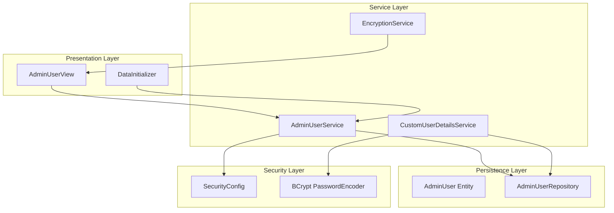
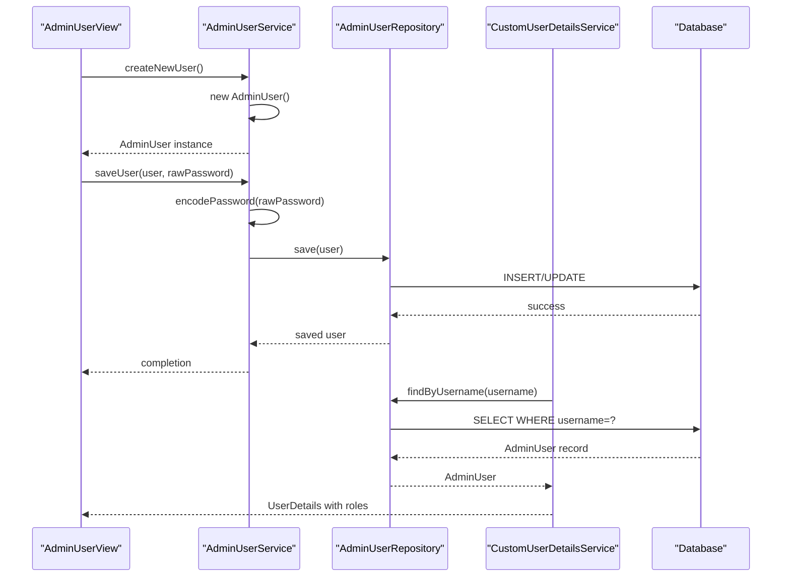
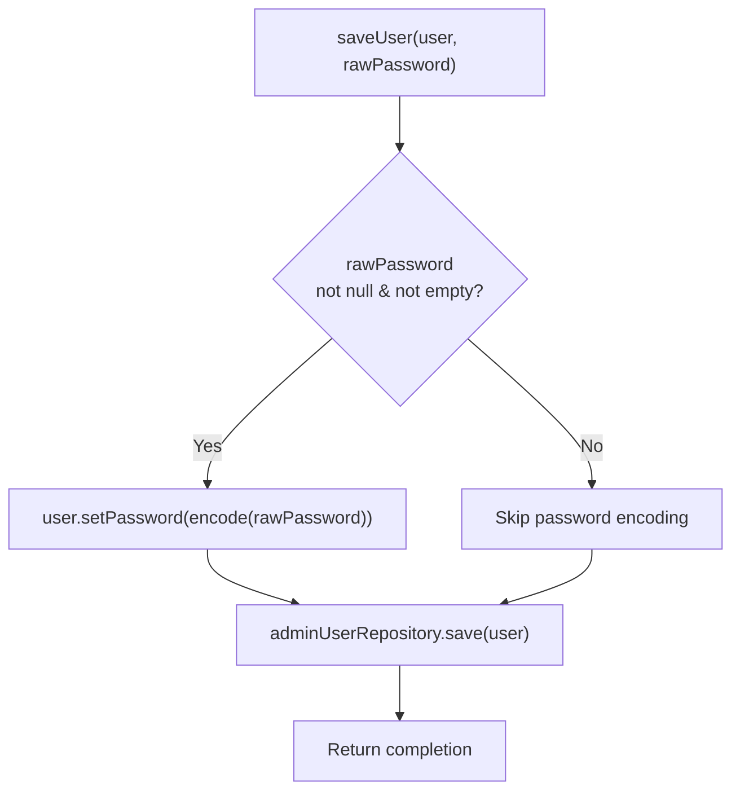
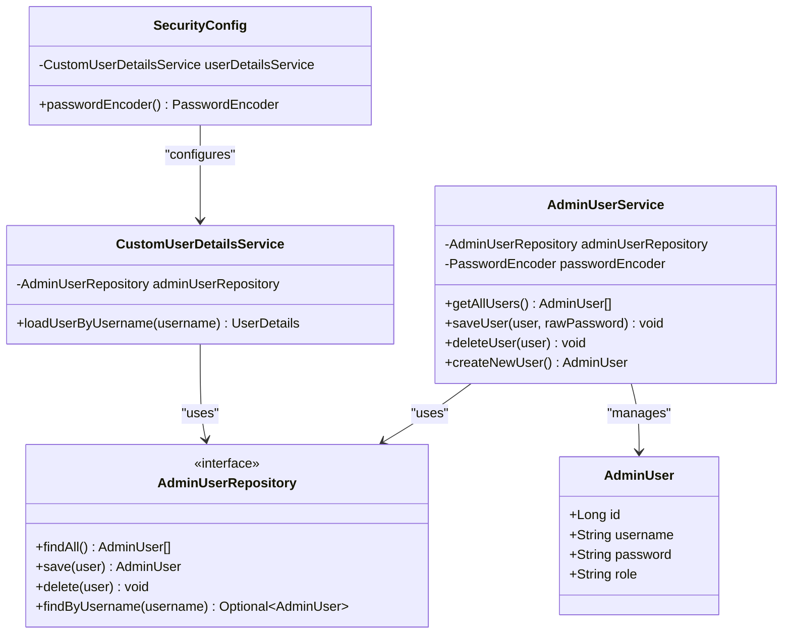

# Admin User Service

<cite>
**Referenced Files in This Document**
- [AdminUserService.java](file://src/main/java/com/db2api/service/admin/AdminUserService.java)
- [AdminUser.java](file://src/main/java/com/db2api/persistent/admin/AdminUser.java)
- [AdminUserRepository.java](file://src/main/java/com/db2api/repository/admin/AdminUserRepository.java)
- [CustomUserDetailsService.java](file://src/main/java/com/db2api/security/CustomUserDetailsService.java)
- [SecurityConfig.java](file://src/main/java/com/db2api/config/SecurityConfig.java)
- [EncryptionService.java](file://src/main/java/com/db2api/service/EncryptionService.java)
- [DataInitializer.java](file://src/main/java/com/db2api/config/DataInitializer.java)
- [AdminUserView.java](file://src/main/java/com/db2api/ui/admin/AdminUserView.java)
- [application.properties](file://src/main/resources/application.properties)
</cite>

## Table of Contents
1. [Introduction](#introduction)
2. [Project Structure](#project-structure)
3. [Core Components](#core-components)
4. [Architecture Overview](#architecture-overview)
5. [Detailed Component Analysis](#detailed-component-analysis)
6. [Dependency Analysis](#dependency-analysis)
7. [Performance Considerations](#performance-considerations)
8. [Troubleshooting Guide](#troubleshooting-guide)
9. [Conclusion](#conclusion)

## Introduction
This document provides comprehensive technical documentation for the AdminUserService implementation, focusing on administrative user management functionality within the DB2API security framework. The AdminUserService handles user lifecycle operations including creation, authentication, authorization, and management of administrative users who access the Vaadin-based management UI.

The service integrates with Spring Security's authentication and authorization mechanisms, manages password encryption using BCrypt, and provides role-based access control through the CustomUserDetailsService. It serves as the central coordinator for admin user operations while maintaining separation of concerns between persistence, security, and presentation layers.

## Project Structure
The admin user management functionality is organized across several key packages within the DB2API application:

**Diagram sources**
- [AdminUserService.java:1-41](file://src/main/java/com/db2api/service/admin/AdminUserService.java#L1-L41)
- [AdminUser.java:1-43](file://src/main/java/com/db2api/persistent/admin/AdminUser.java#L1-L43)
- [AdminUserRepository.java:1-23](file://src/main/java/com/db2api/repository/admin/AdminUserRepository.java#L1-L23)
- [CustomUserDetailsService.java:1-32](file://src/main/java/com/db2api/security/CustomUserDetailsService.java#L1-L32)
- [SecurityConfig.java:1-52](file://src/main/java/com/db2api/config/SecurityConfig.java#L1-L52)
- [EncryptionService.java:1-59](file://src/main/java/com/db2api/service/EncryptionService.java#L1-L59)
- [AdminUserView.java:1-189](file://src/main/java/com/db2api/ui/admin/AdminUserView.java#L1-L189)
- [DataInitializer.java:1-60](file://src/main/java/com/db2api/config/DataInitializer.java#L1-L60)

**Section sources**
- [AdminUserService.java:1-41](file://src/main/java/com/db2api/service/admin/AdminUserService.java#L1-L41)
- [AdminUser.java:1-43](file://src/main/java/com/db2api/persistent/admin/AdminUser.java#L1-L43)
- [AdminUserRepository.java:1-23](file://src/main/java/com/db2api/repository/admin/AdminUserRepository.java#L1-L23)
- [CustomUserDetailsService.java:1-32](file://src/main/java/com/db2api/security/CustomUserDetailsService.java#L1-L32)
- [SecurityConfig.java:1-52](file://src/main/java/com/db2api/config/SecurityConfig.java#L1-L52)
- [EncryptionService.java:1-59](file://src/main/java/com/db2api/service/EncryptionService.java#L1-L59)
- [AdminUserView.java:1-189](file://src/main/java/com/db2api/ui/admin/AdminUserView.java#L1-L189)
- [DataInitializer.java:1-60](file://src/main/java/com/db2api/config/DataInitializer.java#L1-L60)

## Core Components
The AdminUserService implementation consists of several interconnected components that work together to provide comprehensive administrative user management capabilities:

### AdminUserService
The primary service class responsible for managing administrative users. It provides methods for retrieving all users, creating new users, saving users with encrypted passwords, and deleting users. The service uses dependency injection to access the AdminUserRepository and PasswordEncoder beans.

### AdminUser Entity
The persistent model representing administrative users in the database. The entity includes fields for unique identification, username, encrypted password, and role assignment. It uses JPA annotations for database mapping and Lombok annotations for getter/setter generation.

### AdminUserRepository
The data access layer interface extending Spring Data JPA's JpaRepository. It provides standard CRUD operations plus a specialized method for finding users by username, enabling efficient authentication lookups.

### CustomUserDetailsService
Implements Spring Security's UserDetailsService interface to integrate with the authentication system. It loads admin users from the database and converts them to Spring Security's UserDetails format, including role-based authorization information.

**Section sources**
- [AdminUserService.java:11-40](file://src/main/java/com/db2api/service/admin/AdminUserService.java#L11-L40)
- [AdminUser.java:12-42](file://src/main/java/com/db2api/persistent/admin/AdminUser.java#L12-L42)
- [AdminUserRepository.java:12-22](file://src/main/java/com/db2api/repository/admin/AdminUserRepository.java#L12-L22)
- [CustomUserDetailsService.java:12-31](file://src/main/java/com/db2api/security/CustomUserDetailsService.java#L12-L31)

## Architecture Overview
The AdminUserService operates within a layered architecture that separates concerns across persistence, service, security, and presentation layers:

**Diagram sources**
- [AdminUserService.java:22-31](file://src/main/java/com/db2api/service/admin/AdminUserService.java#L22-L31)
- [AdminUserRepository.java:21](file://src/main/java/com/db2api/repository/admin/AdminUserRepository.java#L21)
- [CustomUserDetailsService.java:21-30](file://src/main/java/com/db2api/security/CustomUserDetailsService.java#L21-L30)

The architecture follows these key principles:
- **Separation of Concerns**: Each layer has distinct responsibilities
- **Dependency Injection**: Services receive dependencies through constructors
- **Interface Segregation**: Clear boundaries between repositories and services
- **Security Integration**: Seamless integration with Spring Security framework

## Detailed Component Analysis

### AdminUserService Implementation
The AdminUserService provides essential administrative user management operations:

#### Core Methods and Responsibilities
- **getAllUsers()**: Retrieves all administrative users from the database
- **saveUser(user, rawPassword)**: Saves a user with automatic password encryption
- **deleteUser(user)**: Removes a user from the system
- **createNewUser()**: Factory method for creating new user instances

#### Password Management Strategy
The service implements secure password handling through automatic encryption during the save operation. When a raw password is provided, it is automatically encoded using the configured BCryptPasswordEncoder before persistence.

#### Method Signatures and Behavior

**Diagram sources**
- [AdminUserService.java:26-31](file://src/main/java/com/db2api/service/admin/AdminUserService.java#L26-L31)

**Section sources**
- [AdminUserService.java:22-39](file://src/main/java/com/db2api/service/admin/AdminUserService.java#L22-L39)

### AdminUser Entity Structure
The AdminUser entity defines the persistent representation of administrative users:

#### Data Model Specifications
- **Primary Key**: Auto-generated Long ID
- **Username**: Unique, non-null field for user identification
- **Password**: Encrypted password storage
- **Role**: String-based role assignment (ADMIN, EDITOR, VIEWER)

#### Database Mapping Details
The entity uses JPA annotations for:
- Table mapping to "admin_user" table
- Identity generation strategy for primary keys
- Unique constraint enforcement on username field

#### Role-Based Access Control Integration
The role field directly maps to Spring Security's role-based authorization system, enabling fine-grained access control within the Vaadin UI.

**Section sources**
- [AdminUser.java:16-42](file://src/main/java/com/db2api/persistent/admin/AdminUser.java#L16-L42)

### AdminUserRepository Interface
The repository provides data access capabilities for admin users:

#### Repository Capabilities
- **Standard CRUD Operations**: Through JpaRepository inheritance
- **Username Lookup**: Specialized method for authentication purposes
- **Optional Return Types**: Safe handling of missing users

#### Authentication Integration
The findByUsername method enables efficient user lookup during the authentication process, reducing database round trips and improving performance.

**Section sources**
- [AdminUserRepository.java:13-22](file://src/main/java/com/db2api/repository/admin/AdminUserRepository.java#L13-L22)

### CustomUserDetailsService Integration
The CustomUserDetailsService bridges the admin user domain with Spring Security:

#### Authentication Flow
1. **User Lookup**: Searches for user by username in the database
2. **User Details Creation**: Converts AdminUser to Spring Security UserDetails
3. **Role Assignment**: Extracts role information for authorization
4. **Exception Handling**: Throws UsernameNotFoundException for invalid users

#### Security Integration Benefits
- **Consistent Authentication**: Standard Spring Security user details format
- **Role-Based Authorization**: Direct mapping from role field to security roles
- **Exception Handling**: Proper error propagation for authentication failures

**Section sources**
- [CustomUserDetailsService.java:21-30](file://src/main/java/com/db2api/security/CustomUserDetailsService.java#L21-L30)

### Security Configuration
The SecurityConfig establishes the foundation for admin user authentication:

#### Password Encoding Configuration
- **BCrypt Encoder**: Strong password hashing with salt generation
- **Bean Definition**: Centralized configuration for password encoding
- **Security Best Practices**: Industry-standard encryption algorithm

#### Login Configuration
- **Vaadin Integration**: Custom login view configuration
- **Dashboard Access**: Default redirect after successful authentication
- **Security Filters**: Automatic application of security constraints

**Section sources**
- [SecurityConfig.java:47-50](file://src/main/java/com/db2api/config/SecurityConfig.java#L47-L50)
- [SecurityConfig.java:36-40](file://src/main/java/com/db2api/config/SecurityConfig.java#L36-L40)

### UI Integration and Permissions
The AdminUserView provides the user interface for administrative user management:

#### Role-Based UI Controls
- **@RolesAllowed("ADMIN")**: Restricts access to administrative users only
- **Dynamic Form Fields**: Role selection with predefined options
- **Conditional Actions**: Save, delete, and cancel button availability

#### User Experience Features
- **Grid Display**: Tabular view of all administrative users
- **Form Binding**: Two-way binding between UI and entity data
- **Validation Integration**: Automatic form validation through Binder

**Section sources**
- [AdminUserView.java:27](file://src/main/java/com/db2api/ui/admin/AdminUserView.java#L27)
- [AdminUserView.java:160-162](file://src/main/java/com/db2api/ui/admin/AdminUserView.java#L160-L162)

### Data Initialization and Lifecycle Management
The DataInitializer ensures proper system startup with default administrative users:

#### Startup Behavior
- **First-Time Setup**: Creates default admin user when none exists
- **Default Credentials**: Sets up initial administrative access
- **Logging Integration**: Provides clear startup messages

#### Security Implications
- **Initial Access**: Enables first-time system administration
- **Credential Rotation**: Encourages immediate password change
- **Audit Trail**: Logs initialization activities

**Section sources**
- [DataInitializer.java:46-58](file://src/main/java/com/db2api/config/DataInitializer.java#L46-L58)

## Dependency Analysis
The AdminUserService maintains clean dependencies that support maintainability and testability:

**Diagram sources**
- [AdminUserService.java:14-19](file://src/main/java/com/db2api/service/admin/AdminUserService.java#L14-L19)
- [AdminUserRepository.java:13](file://src/main/java/com/db2api/repository/admin/AdminUserRepository.java#L13)
- [AdminUser.java:16](file://src/main/java/com/db2api/persistent/admin/AdminUser.java#L16)
- [CustomUserDetailsService.java:15](file://src/main/java/com/db2api/security/CustomUserDetailsService.java#L15)
- [SecurityConfig.java:26](file://src/main/java/com/db2api/config/SecurityConfig.java#L26)

### External Dependencies
The service relies on several external frameworks and libraries:

#### Spring Security Integration
- **PasswordEncoder**: BCrypt-based password encoding
- **UserDetailsService**: Authentication provider interface
- **Role-Based Access Control**: Built-in authorization support

#### Database Persistence
- **JPA/Hibernate**: Object-relational mapping
- **Spring Data JPA**: Simplified data access patterns
- **PostgreSQL**: Database backend

#### UI Framework Integration
- **Vaadin**: Web UI framework with security integration
- **Lombok**: Code generation for entity classes

**Section sources**
- [SecurityConfig.java:9](file://src/main/java/com/db2api/config/SecurityConfig.java#L9)
- [AdminUser.java:3](file://src/main/java/com/db2api/persistent/admin/AdminUser.java#L3)
- [application.properties:7-16](file://src/main/resources/application.properties#L7-L16)

## Performance Considerations
The AdminUserService implementation incorporates several performance optimization strategies:

### Database Access Patterns
- **Efficient Queries**: Single-table operations with minimal joins
- **Index Utilization**: Username uniqueness constraint enables fast lookups
- **Batch Operations**: Repository methods optimized for common patterns

### Memory Management
- **Lazy Loading**: JPA lazy loading reduces memory footprint
- **Entity State Management**: Proper entity lifecycle handling
- **Connection Pooling**: Spring Boot auto-configured connection pooling

### Security Performance
- **Password Hashing Cost**: BCrypt provides secure but efficient hashing
- **Caching Opportunities**: Potential for user details caching
- **Authentication Optimization**: Minimal overhead in user lookup

## Troubleshooting Guide

### Common Authentication Issues
**Problem**: Users cannot log in despite correct credentials
**Diagnosis Steps**:
1. Verify password encoding matches BCrypt expectations
2. Check username uniqueness constraints
3. Confirm role field contains valid values
4. Review SecurityConfig password encoder configuration

**Solution**: Ensure passwords are encoded using the configured BCryptPasswordEncoder and verify role values match expected security roles.

### Database Connectivity Problems
**Problem**: AdminUserService methods throw data access exceptions
**Diagnosis Steps**:
1. Verify PostgreSQL server connectivity
2. Check database credentials in application.properties
3. Confirm admin_user table exists and is accessible
4. Review JPA configuration settings

**Solution**: Validate database connection parameters and ensure the database schema matches entity definitions.

### UI Permission Issues
**Problem**: Administrative users cannot access admin user management interface
**Diagnosis Steps**:
1. Verify @RolesAllowed annotation presence
2. Check role field values in database
3. Confirm SecurityConfig role-based access configuration
4. Review Vaadin security integration

**Solution**: Ensure user roles are properly set to "ADMIN" and verify security configuration allows ADMIN role access.

### Password Management Errors
**Problem**: Password changes not taking effect or causing authentication failures
**Diagnosis Steps**:
1. Verify raw password is provided during save operations
2. Check password encoding process
3. Confirm database column length accommodates encoded passwords
4. Review BCrypt encoder configuration

**Solution**: Ensure raw passwords are passed to saveUser method and verify database schema supports BCrypt-encoded passwords.

**Section sources**
- [AdminUserService.java:26-31](file://src/main/java/com/db2api/service/admin/AdminUserService.java#L26-L31)
- [SecurityConfig.java:47-50](file://src/main/java/com/db2api/config/SecurityConfig.java#L47-L50)
- [application.properties:7-16](file://src/main/resources/application.properties#L7-L16)

## Conclusion
The AdminUserService implementation provides a robust foundation for administrative user management within the DB2API security framework. The service demonstrates excellent separation of concerns, leveraging Spring Security's authentication and authorization mechanisms while maintaining clean data access patterns through JPA repositories.

Key strengths of the implementation include:
- **Security-First Design**: BCrypt password encoding and role-based access control
- **Clean Architecture**: Well-defined layers with clear responsibilities
- **Integration Excellence**: Seamless integration with Vaadin UI and Spring Security
- **Maintainability**: Dependency injection and interface-based design

The service successfully addresses the core requirements for admin user lifecycle management while providing extensibility for future enhancements such as audit logging, enhanced error handling, and additional security features.