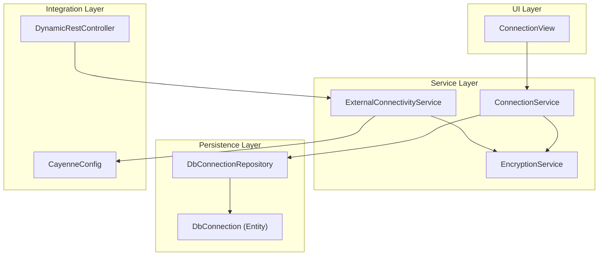
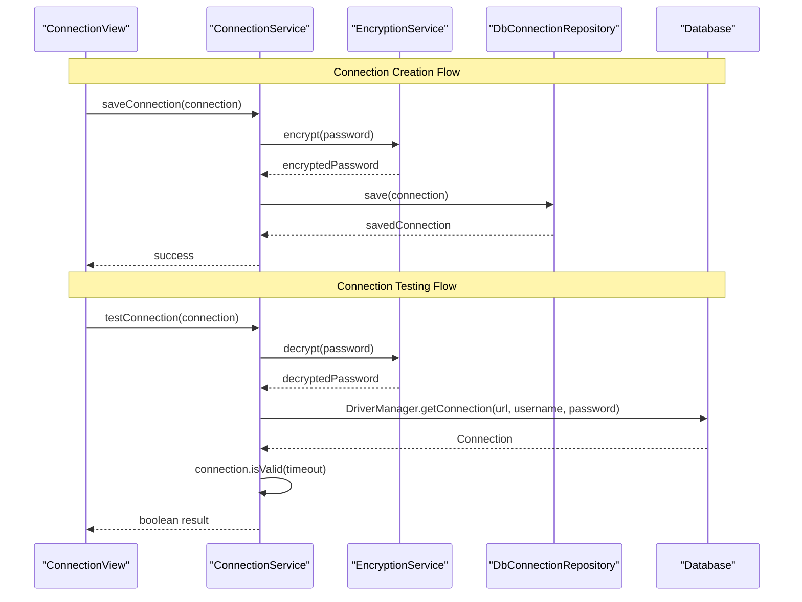
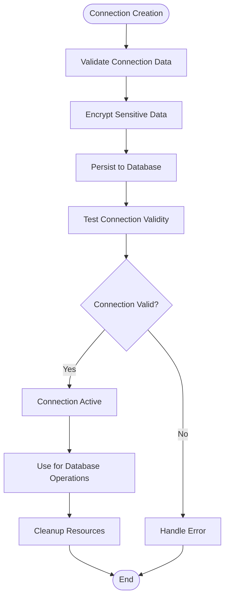
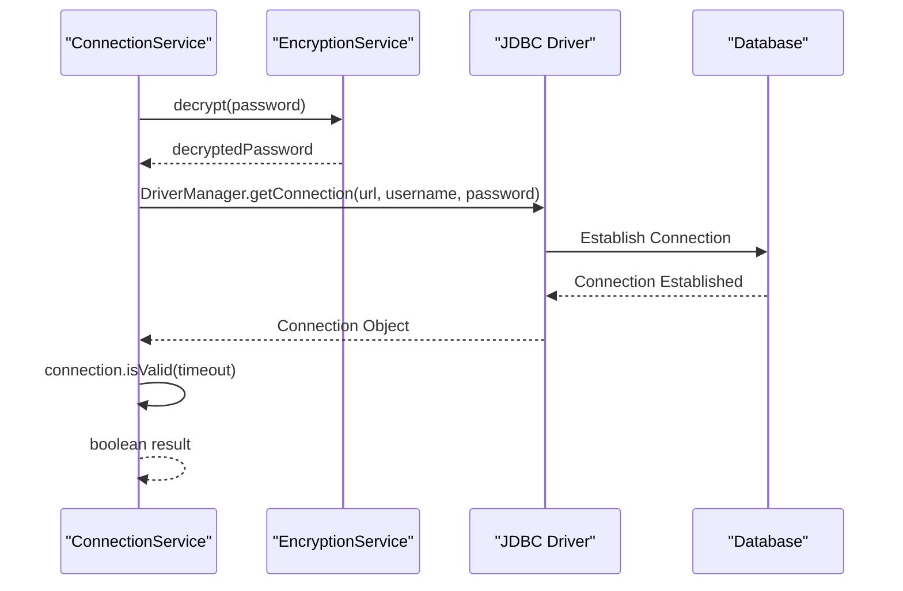
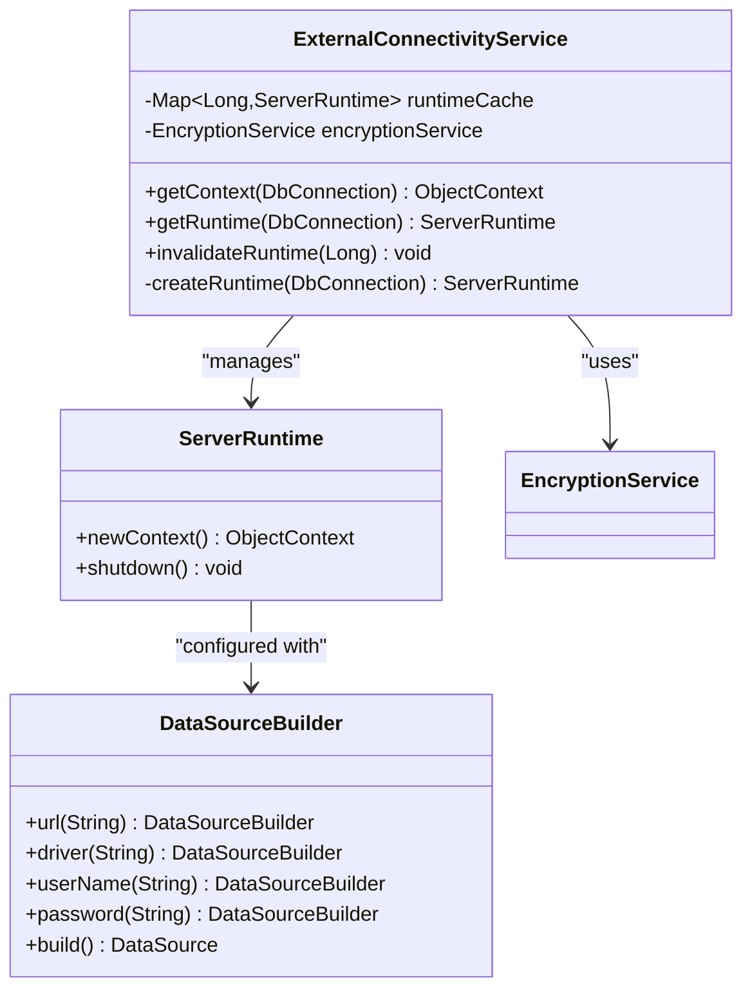
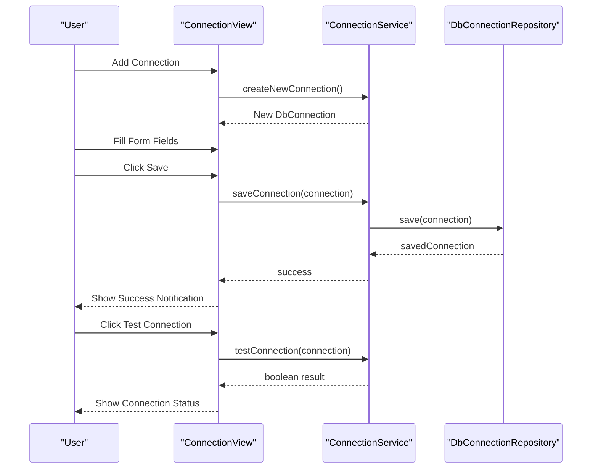
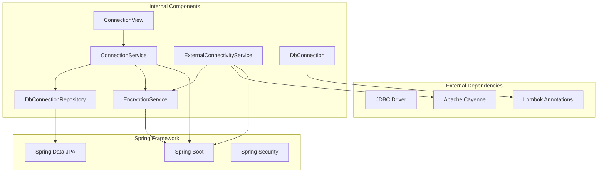

# Connection Service

<cite>
**Referenced Files in This Document**
- [ConnectionService.java](file://src/main/java/com/db2api/service/connection/ConnectionService.java)
- [ExternalConnectivityService.java](file://src/main/java/com/db2api/service/connection/ExternalConnectivityService.java)
- [DbConnection.java](file://src/main/java/com/db2api/persistent/connection/DbConnection.java)
- [DbConnectionRepository.java](file://src/main/java/com/db2api/repository/connection/DbConnectionRepository.java)
- [EncryptionService.java](file://src/main/java/com/db2api/service/EncryptionService.java)
- [ConnectionView.java](file://src/main/java/com/db2api/ui/connection/ConnectionView.java)
- [DynamicRestController.java](file://src/main/java/com/db2api/controller/DynamicRestController.java)
- [CayenneConfig.java](file://src/main/java/com/db2api/config/CayenneConfig.java)
- [application.properties](file://src/main/resources/application.properties)
</cite>

## Table of Contents
1. [Introduction](#introduction)
2. [Project Structure](#project-structure)
3. [Core Components](#core-components)
4. [Architecture Overview](#architecture-overview)
5. [Detailed Component Analysis](#detailed-component-analysis)
6. [Dependency Analysis](#dependency-analysis)
7. [Performance Considerations](#performance-considerations)
8. [Troubleshooting Guide](#troubleshooting-guide)
9. [Conclusion](#conclusion)

## Introduction
This document provides comprehensive technical documentation for the ConnectionService implementation and related components responsible for managing database connections in the application. It covers the database connection lifecycle including creation, validation, testing, and cleanup. It explains how ConnectionService integrates with ExternalConnectivityService for actual database connectivity, connection pooling, and JDBC driver management. Practical examples of connection configuration, validation procedures, and error handling for connectivity issues are included. The document also documents the DbConnection entity structure, connection properties, and repository operations. Security considerations, encryption of sensitive data, and performance optimization strategies are addressed.

## Project Structure
The connection management functionality spans several layers:
- Persistent model: DbConnection entity representing connection configurations
- Repository: DbConnectionRepository for persistence operations
- Services:
  - ConnectionService: Handles connection CRUD operations and validation
  - ExternalConnectivityService: Manages runtime instances and connection pooling
  - EncryptionService: Provides encryption/decryption for sensitive data
- UI: ConnectionView for user interaction and testing
- Controllers: DynamicRestController for dynamic API execution
- Configuration: CayenneConfig for Apache Cayenne setup

**Diagram sources**
- [ConnectionView.java:27-43](file://src/main/java/com/db2api/ui/connection/ConnectionView.java#L27-L43)
- [ConnectionService.java:15-24](file://src/main/java/com/db2api/service/connection/ConnectionService.java#L15-L24)
- [ExternalConnectivityService.java:15-23](file://src/main/java/com/db2api/service/connection/ExternalConnectivityService.java#L15-L23)
- [EncryptionService.java:13-19](file://src/main/java/com/db2api/service/EncryptionService.java#L13-L19)
- [DbConnectionRepository.java:7-12](file://src/main/java/com/db2api/repository/connection/DbConnectionRepository.java#L7-L12)
- [DbConnection.java:16-27](file://src/main/java/com/db2api/persistent/connection/DbConnection.java#L16-L27)
- [DynamicRestController.java:25-52](file://src/main/java/com/db2api/controller/DynamicRestController.java#L25-L52)
- [CayenneConfig.java:12-27](file://src/main/java/com/db2api/config/CayenneConfig.java#L12-L27)

**Section sources**
- [ConnectionService.java:15-57](file://src/main/java/com/db2api/service/connection/ConnectionService.java#L15-L57)
- [ExternalConnectivityService.java:15-54](file://src/main/java/com/db2api/service/connection/ExternalConnectivityService.java#L15-L54)
- [DbConnection.java:16-84](file://src/main/java/com/db2api/persistent/connection/DbConnection.java#L16-L84)
- [DbConnectionRepository.java:7-12](file://src/main/java/com/db2api/repository/connection/DbConnectionRepository.java#L7-L12)
- [EncryptionService.java:13-58](file://src/main/java/com/db2api/service/EncryptionService.java#L13-L58)
- [ConnectionView.java:27-203](file://src/main/java/com/db2api/ui/connection/ConnectionView.java#L27-L203)
- [DynamicRestController.java:25-316](file://src/main/java/com/db2api/controller/DynamicRestController.java#L25-L316)
- [CayenneConfig.java:12-27](file://src/main/java/com/db2api/config/CayenneConfig.java#L12-L27)

## Core Components
This section documents the primary components involved in connection lifecycle management.

### ConnectionService
The ConnectionService manages database connection configurations and provides validation capabilities:
- **Primary Responsibilities**:
  - Retrieve all connections from the repository
  - Save connections with encrypted passwords
  - Delete connections
  - Create new connection instances
  - Test connection validity using JDBC

- **Security Implementation**:
  - Password encryption during save operations
  - Decryption during connection testing
  - Uses EncryptionService for cryptographic operations

- **Validation Mechanism**:
  - Tests connectivity using DriverManager.getConnection
  - Validates connection with connection.isValid(timeout)
  - Handles exceptions gracefully and returns boolean status

**Section sources**
- [ConnectionService.java:15-57](file://src/main/java/com/db2api/service/connection/ConnectionService.java#L15-L57)

### ExternalConnectivityService
Manages runtime instances and connection pooling for external databases:
- **Primary Responsibilities**:
  - Creates and caches ServerRuntime instances per connection
  - Provides ObjectContext for database operations
  - Manages runtime lifecycle and invalidation
  - Builds DataSource with decrypted credentials

- **Connection Pooling Strategy**:
  - Uses ConcurrentHashMap for runtime caching
  - Creates runtime instances on-demand
  - Supports manual invalidation for cache updates

- **Integration Points**:
  - Works with Apache Cayenne for ORM operations
  - Uses EncryptionService for credential decryption
  - Leverages DataSourceBuilder for connection configuration

**Section sources**
- [ExternalConnectivityService.java:15-54](file://src/main/java/com/db2api/service/connection/ExternalConnectivityService.java#L15-L54)

### DbConnection Entity
Represents database connection configurations stored in the system:
- **Primary Properties**:
  - id: Primary key for connection identification
  - name: Human-readable connection name
  - url: JDBC URL for database connection
  - username: Database username
  - password: Encrypted database password
  - driverClass: Fully qualified JDBC driver class name

- **Relationships**:
  - Bidirectional relationship with ApiDefinition
  - Supports cascading operations for API definitions
  - Provides utility methods for managing API definitions

- **Utility Methods**:
  - addToApiDefinitions: Adds API definition with proper bidirectional linking
  - removeFromApiDefinitions: Removes API definition with proper cleanup

**Section sources**
- [DbConnection.java:16-84](file://src/main/java/com/db2api/persistent/connection/DbConnection.java#L16-L84)

### DbConnectionRepository
Provides persistence operations for DbConnection entities:
- **Interface Type**: JpaRepository for DbConnection with Long ID
- **Capabilities**: Standard CRUD operations inherited from JpaRepository
- **Usage**: Used by ConnectionService for data persistence

**Section sources**
- [DbConnectionRepository.java:7-12](file://src/main/java/com/db2api/repository/connection/DbConnectionRepository.java#L7-L12)

### EncryptionService
Handles encryption and decryption of sensitive connection data:
- **Algorithm**: AES encryption with ECB mode and PKCS5 padding
- **Key Management**: SHA-1 hash of configured secret key
- **Configuration**: Secret key loaded from application.properties
- **Operations**: Encrypt and decrypt methods for secure data handling

**Section sources**
- [EncryptionService.java:13-58](file://src/main/java/com/db2api/service/EncryptionService.java#L13-L58)

## Architecture Overview
The connection management system follows a layered architecture with clear separation of concerns:

**Diagram sources**
- [ConnectionView.java:86-125](file://src/main/java/com/db2api/ui/connection/ConnectionView.java#L86-L125)
- [ConnectionService.java:30-56](file://src/main/java/com/db2api/service/connection/ConnectionService.java#L30-L56)
- [EncryptionService.java:35-57](file://src/main/java/com/db2api/service/EncryptionService.java#L35-L57)

The system integrates with Apache Cayenne for ORM operations and uses a caching mechanism for runtime instances to optimize performance.

## Detailed Component Analysis

### Connection Lifecycle Management
The connection lifecycle encompasses creation, validation, testing, and cleanup phases:

**Diagram sources**
- [ConnectionService.java:30-56](file://src/main/java/com/db2api/service/connection/ConnectionService.java#L30-L56)
- [DbConnectionRepository.java:10-12](file://src/main/java/com/db2api/repository/connection/DbConnectionRepository.java#L10-L12)

### Connection Testing Procedure
The testing procedure validates database connectivity using JDBC:

**Diagram sources**
- [ConnectionService.java:47-56](file://src/main/java/com/db2api/service/connection/ConnectionService.java#L47-L56)
- [EncryptionService.java:47-57](file://src/main/java/com/db2api/service/EncryptionService.java#L47-L57)

### External Connectivity Integration
ExternalConnectivityService manages runtime instances and connection pooling:

**Diagram sources**
- [ExternalConnectivityService.java:15-54](file://src/main/java/com/db2api/service/connection/ExternalConnectivityService.java#L15-L54)
- [CayenneConfig.java:21-27](file://src/main/java/com/db2api/config/CayenneConfig.java#L21-L27)

**Section sources**
- [ExternalConnectivityService.java:15-54](file://src/main/java/com/db2api/service/connection/ExternalConnectivityService.java#L15-L54)
- [CayenneConfig.java:12-27](file://src/main/java/com/db2api/config/CayenneConfig.java#L12-L27)

### UI Integration and User Experience
The ConnectionView provides comprehensive user interaction for connection management:

**Diagram sources**
- [ConnectionView.java:71-125](file://src/main/java/com/db2api/ui/connection/ConnectionView.java#L71-L125)
- [ConnectionService.java:43-56](file://src/main/java/com/db2api/service/connection/ConnectionService.java#L43-L56)

**Section sources**
- [ConnectionView.java:27-203](file://src/main/java/com/db2api/ui/connection/ConnectionView.java#L27-L203)

## Dependency Analysis
The connection management system exhibits clear dependency relationships:

**Diagram sources**
- [ConnectionService.java:4-13](file://src/main/java/com/db2api/service/connection/ConnectionService.java#L4-L13)
- [ExternalConnectivityService.java:3-9](file://src/main/java/com/db2api/service/connection/ExternalConnectivityService.java#L3-L9)
- [DbConnection.java:3-10](file://src/main/java/com/db2api/persistent/connection/DbConnection.java#L3-L10)
- [DbConnectionRepository.java:3-5](file://src/main/java/com/db2api/repository/connection/DbConnectionRepository.java#L3-L5)

**Section sources**
- [ConnectionService.java:4-13](file://src/main/java/com/db2api/service/connection/ConnectionService.java#L4-L13)
- [ExternalConnectivityService.java:3-9](file://src/main/java/com/db2api/service/connection/ExternalConnectivityService.java#L3-L9)
- [DbConnection.java:3-10](file://src/main/java/com/db2api/persistent/connection/DbConnection.java#L3-L10)
- [DbConnectionRepository.java:3-5](file://src/main/java/com/db2api/repository/connection/DbConnectionRepository.java#L3-L5)

## Performance Considerations
Several optimization strategies are implemented to ensure efficient connection management:

### Connection Pooling Strategy
- **Runtime Caching**: ExternalConnectivityService maintains a ConcurrentHashMap of ServerRuntime instances keyed by connection ID
- **Lazy Initialization**: Runtime instances are created on-demand when first accessed
- **Manual Invalidation**: Supports explicit cache invalidation for runtime updates

### Memory Management
- **Resource Cleanup**: Proper use of try-with-resources in connection testing
- **Cache Expiration**: Manual cache removal allows for memory cleanup when connections are deleted
- **Object Reuse**: Reused ServerRuntime instances reduce overhead

### Security Considerations
- **Encrypted Storage**: Passwords are encrypted before persistence
- **Decryption on Demand**: Credentials are decrypted only when needed for connection attempts
- **Secure Algorithm**: AES encryption with proper padding scheme

**Section sources**
- [ExternalConnectivityService.java:18-38](file://src/main/java/com/db2api/service/connection/ExternalConnectivityService.java#L18-L38)
- [ConnectionService.java:47-56](file://src/main/java/com/db2api/service/connection/ConnectionService.java#L47-L56)
- [EncryptionService.java:35-57](file://src/main/java/com/db2api/service/EncryptionService.java#L35-L57)

## Troubleshooting Guide

### Common Connection Issues
1. **Connection Validation Failures**:
   - Verify JDBC URL format and accessibility
   - Check username/password credentials
   - Ensure JDBC driver class is correctly specified
   - Confirm network connectivity to database server

2. **Encryption/Decryption Errors**:
   - Verify encryption secret key configuration
   - Check for corrupted encrypted data in database
   - Ensure consistent encryption algorithm usage

3. **Runtime Cache Issues**:
   - Clear cache using invalidateRuntime method
   - Check for memory leaks in cached ServerRuntime instances
   - Monitor cache size and eviction policies

### Error Handling Patterns
The system implements graceful error handling:
- **Connection Testing**: Returns boolean false on exceptions instead of propagating errors
- **Encryption Operations**: Logs errors and returns null for failed operations
- **UI Feedback**: Provides user notifications for connection status

### Debugging Procedures
1. Enable detailed logging for connection attempts
2. Verify database connectivity using standalone JDBC client
3. Check encryption service configuration and keys
4. Monitor cache statistics and memory usage

**Section sources**
- [ConnectionService.java:47-56](file://src/main/java/com/db2api/service/connection/ConnectionService.java#L47-L56)
- [EncryptionService.java:31-32](file://src/main/java/com/db2api/service/EncryptionService.java#L31-L32)
- [ExternalConnectivityService.java:33-38](file://src/main/java/com/db2api/service/connection/ExternalConnectivityService.java#L33-L38)

## Conclusion
The ConnectionService implementation provides a robust foundation for managing database connections in the application. The system successfully separates concerns between connection management, encryption, and external connectivity while maintaining security and performance. Key strengths include:

- **Security**: Comprehensive encryption of sensitive data with proper key management
- **Performance**: Efficient caching and lazy initialization of runtime instances
- **Usability**: Intuitive UI for connection management and testing
- **Maintainability**: Clear separation of concerns and modular design

The integration with Apache Cayenne enables powerful ORM capabilities while the JDBC-based validation ensures reliable connection testing. Future enhancements could include configurable connection pooling, advanced monitoring capabilities, and support for connection health checks.