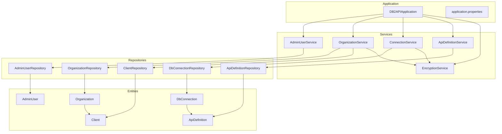
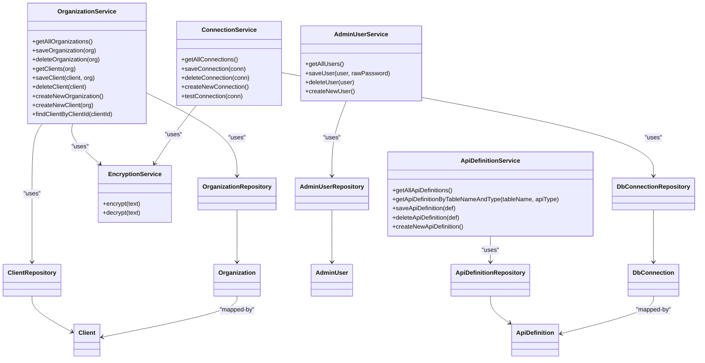
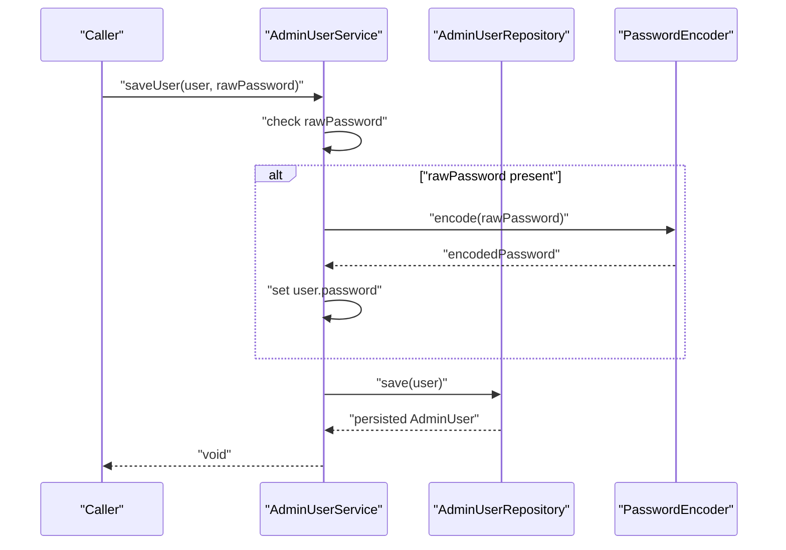
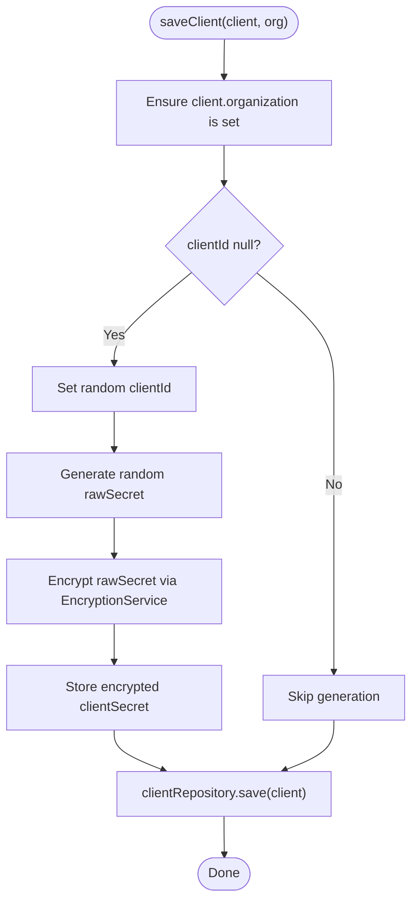
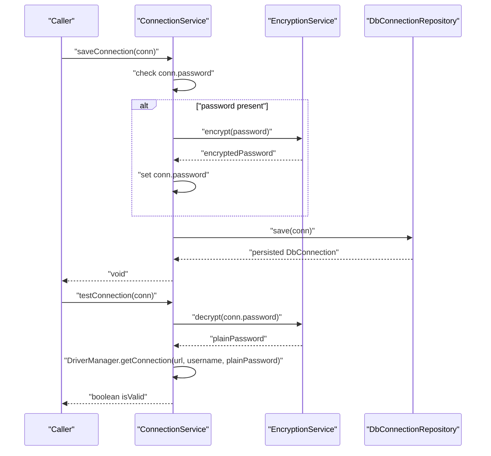
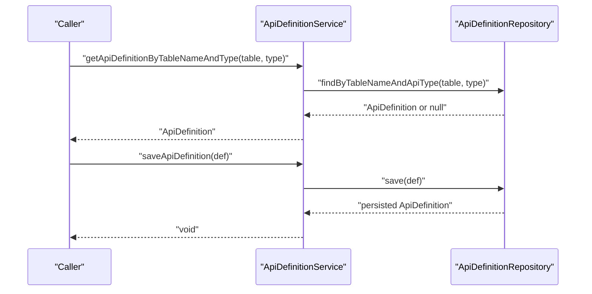
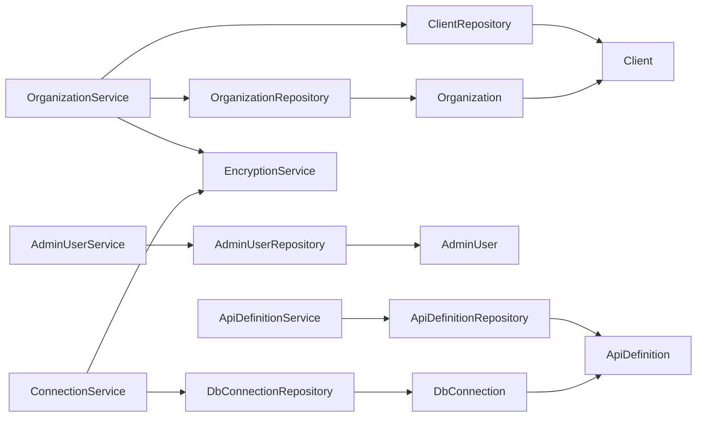

# Core Services

<cite>
**Referenced Files in This Document**
- [AdminUserService.java](file://src/main/java/com/db2api/service/admin/AdminUserService.java)
- [OrganizationService.java](file://src/main/java/com/db2api/service/organization/OrganizationService.java)
- [ConnectionService.java](file://src/main/java/com/db2api/service/connection/ConnectionService.java)
- [ApiDefinitionService.java](file://src/main/java/com/db2api/service/api/ApiDefinitionService.java)
- [EncryptionService.java](file://src/main/java/com/db2api/service/EncryptionService.java)
- [AdminUserRepository.java](file://src/main/java/com/db2api/repository/admin/AdminUserRepository.java)
- [OrganizationRepository.java](file://src/main/java/com/db2api/repository/organization/OrganizationRepository.java)
- [DbConnectionRepository.java](file://src/main/java/com/db2api/repository/connection/DbConnectionRepository.java)
- [ApiDefinitionRepository.java](file://src/main/java/com/db2api/repository/api/ApiDefinitionRepository.java)
- [AdminUser.java](file://src/main/java/com/db2api/persistent/admin/AdminUser.java)
- [Organization.java](file://src/main/java/com/db2api/persistent/organization/Organization.java)
- [Client.java](file://src/main/java/com/db2api/persistent/organization/Client.java)
- [DbConnection.java](file://src/main/java/com/db2api/persistent/connection/DbConnection.java)
- [ApiDefinition.java](file://src/main/java/com/db2api/persistent/api/ApiDefinition.java)
- [application.properties](file://src/main/resources/application.properties)
- [DB2APIApplication.java](file://src/main/java/com/db2api/DB2APIApplication.java)
</cite>

## Table of Contents
1. [Introduction](#introduction)
2. [Project Structure](#project-structure)
3. [Core Components](#core-components)
4. [Architecture Overview](#architecture-overview)
5. [Detailed Component Analysis](#detailed-component-analysis)
6. [Dependency Analysis](#dependency-analysis)
7. [Performance Considerations](#performance-considerations)
8. [Troubleshooting Guide](#troubleshooting-guide)
9. [Conclusion](#conclusion)
10. [Appendices](#appendices)

## Introduction
This document describes the core services that implement DB2API’s business logic layer. It focuses on four primary services:
- AdminUserService: Administrative user management with password encoding and CRUD operations.
- OrganizationService: Multi-tenant organization handling, client lifecycle, and credential generation.
- ConnectionService: Database connection lifecycle management and connectivity testing.
- ApiDefinitionService: API definition management for dynamic REST/GraphQL endpoints.

It documents service layer patterns, dependency injection via constructor injection, service interactions, practical usage examples, error handling, testing and mocking strategies, and extension points.

## Project Structure
The core services reside under the service package, each delegating persistence to dedicated repositories. Persistence entities are located under persistent packages, and repositories extend Spring Data JPA interfaces. Application configuration is centralized in application properties.

**Diagram sources**
- [DB2APIApplication.java:1-27](file://src/main/java/com/db2api/DB2APIApplication.java#L1-L27)
- [application.properties:1-20](file://src/main/resources/application.properties#L1-L20)
- [AdminUserService.java:1-41](file://src/main/java/com/db2api/service/admin/AdminUserService.java#L1-L41)
- [OrganizationService.java:1-83](file://src/main/java/com/db2api/service/organization/OrganizationService.java#L1-L83)
- [ConnectionService.java:1-58](file://src/main/java/com/db2api/service/connection/ConnectionService.java#L1-L58)
- [ApiDefinitionService.java:1-39](file://src/main/java/com/db2api/service/api/ApiDefinitionService.java#L1-L39)
- [EncryptionService.java:1-59](file://src/main/java/com/db2api/service/EncryptionService.java#L1-L59)
- [AdminUserRepository.java:1-23](file://src/main/java/com/db2api/repository/admin/AdminUserRepository.java#L1-L23)
- [OrganizationRepository.java:1-10](file://src/main/java/com/db2api/repository/organization/OrganizationRepository.java#L1-L10)
- [DbConnectionRepository.java:1-13](file://src/main/java/com/db2api/repository/connection/DbConnectionRepository.java#L1-L13)
- [ApiDefinitionRepository.java:1-22](file://src/main/java/com/db2api/repository/api/ApiDefinitionRepository.java#L1-L22)
- [AdminUser.java:1-43](file://src/main/java/com/db2api/persistent/admin/AdminUser.java#L1-L43)
- [Organization.java:1-65](file://src/main/java/com/db2api/persistent/organization/Organization.java#L1-L65)
- [Client.java:1-43](file://src/main/java/com/db2api/persistent/organization/Client.java#L1-L43)
- [DbConnection.java:1-85](file://src/main/java/com/db2api/persistent/connection/DbConnection.java#L1-L85)
- [ApiDefinition.java:1-57](file://src/main/java/com/db2api/persistent/api/ApiDefinition.java#L1-L57)

**Section sources**
- [DB2APIApplication.java:1-27](file://src/main/java/com/db2api/DB2APIApplication.java#L1-L27)
- [application.properties:1-20](file://src/main/resources/application.properties#L1-L20)

## Core Components
This section outlines the responsibilities and interactions of each core service.

- AdminUserService
  - Responsibilities: Retrieve all admin users, create new admin user instances, persist admin users with encoded passwords, and delete admin users.
  - Dependencies: AdminUserRepository, PasswordEncoder (constructor-injected).
  - Key operations: getAllUsers, saveUser, deleteUser, createNewUser.

- OrganizationService
  - Responsibilities: Manage organizations and their clients, including creation, persistence, deletion, and client credential lifecycle.
  - Dependencies: OrganizationRepository, ClientRepository, EncryptionService.
  - Key operations: getAllOrganizations, saveOrganization, deleteOrganization, getClients, saveClient, deleteClient, createNewOrganization, createNewClient, findClientByClientId.

- ConnectionService
  - Responsibilities: Persist database connections with encrypted credentials and test connectivity against the target database.
  - Dependencies: DbConnectionRepository, EncryptionService.
  - Key operations: getAllConnections, saveConnection, deleteConnection, createNewConnection, testConnection.

- ApiDefinitionService
  - Responsibilities: Manage API definitions for dynamic endpoints mapped to database tables.
  - Dependencies: ApiDefinitionRepository.
  - Key operations: getAllApiDefinitions, getApiDefinitionByTableNameAndType, saveApiDefinition, deleteApiDefinition, createNewApiDefinition.

**Section sources**
- [AdminUserService.java:1-41](file://src/main/java/com/db2api/service/admin/AdminUserService.java#L1-L41)
- [OrganizationService.java:1-83](file://src/main/java/com/db2api/service/organization/OrganizationService.java#L1-L83)
- [ConnectionService.java:1-58](file://src/main/java/com/db2api/service/connection/ConnectionService.java#L1-L58)
- [ApiDefinitionService.java:1-39](file://src/main/java/com/db2api/service/api/ApiDefinitionService.java#L1-L39)

## Architecture Overview
The services follow a layered architecture:
- Controllers orchestrate requests and delegate to services.
- Services encapsulate business logic and coordinate repositories.
- Repositories abstract persistence using Spring Data JPA.
- Entities define domain models and relationships.
- EncryptionService centralizes cryptographic operations.

**Diagram sources**
- [AdminUserService.java:1-41](file://src/main/java/com/db2api/service/admin/AdminUserService.java#L1-L41)
- [OrganizationService.java:1-83](file://src/main/java/com/db2api/service/organization/OrganizationService.java#L1-L83)
- [ConnectionService.java:1-58](file://src/main/java/com/db2api/service/connection/ConnectionService.java#L1-L58)
- [ApiDefinitionService.java:1-39](file://src/main/java/com/db2api/service/api/ApiDefinitionService.java#L1-L39)
- [EncryptionService.java:1-59](file://src/main/java/com/db2api/service/EncryptionService.java#L1-L59)
- [AdminUserRepository.java:1-23](file://src/main/java/com/db2api/repository/admin/AdminUserRepository.java#L1-L23)
- [OrganizationRepository.java:1-10](file://src/main/java/com/db2api/repository/organization/OrganizationRepository.java#L1-L10)
- [DbConnectionRepository.java:1-13](file://src/main/java/com/db2api/repository/connection/DbConnectionRepository.java#L1-L13)
- [ApiDefinitionRepository.java:1-22](file://src/main/java/com/db2api/repository/api/ApiDefinitionRepository.java#L1-L22)
- [AdminUser.java:1-43](file://src/main/java/com/db2api/persistent/admin/AdminUser.java#L1-L43)
- [Organization.java:1-65](file://src/main/java/com/db2api/persistent/organization/Organization.java#L1-L65)
- [Client.java:1-43](file://src/main/java/com/db2api/persistent/organization/Client.java#L1-L43)
- [DbConnection.java:1-85](file://src/main/java/com/db2api/persistent/connection/DbConnection.java#L1-L85)
- [ApiDefinition.java:1-57](file://src/main/java/com/db2api/persistent/api/ApiDefinition.java#L1-L57)

## Detailed Component Analysis

### AdminUserService
- Purpose: Centralizes administrative user management with secure password handling.
- Business logic:
  - Fetch all admin users via repository.
  - Save user with optional password encoding before persisting.
  - Delete user and create new user instances.
- Dependency injection: Uses constructor injection for AdminUserRepository and PasswordEncoder.
- Error handling: Delegates persistence exceptions to Spring Data and framework layers.
- Extension points: Can integrate with custom roles, auditing, or additional validation hooks.

**Diagram sources**
- [AdminUserService.java:26-31](file://src/main/java/com/db2api/service/admin/AdminUserService.java#L26-L31)
- [AdminUserRepository.java:12-22](file://src/main/java/com/db2api/repository/admin/AdminUserRepository.java#L12-L22)

**Section sources**
- [AdminUserService.java:1-41](file://src/main/java/com/db2api/service/admin/AdminUserService.java#L1-L41)
- [AdminUserRepository.java:1-23](file://src/main/java/com/db2api/repository/admin/AdminUserRepository.java#L1-L23)

### OrganizationService
- Purpose: Manages multi-tenant organizations and client applications with OAuth2 credentials.
- Business logic:
  - Retrieve organizations and clients.
  - Create and persist organizations and clients.
  - Generate client identifiers and secrets; encrypt secrets before storage.
  - Resolve client by clientId.
- Dependency injection: Constructor injection for OrganizationRepository, ClientRepository, and EncryptionService.
- Error handling: Guard clauses for missing identifiers; repository exceptions bubble up.
- Extension points: Add client scopes, additional OAuth2 fields, or client lifecycle hooks.

**Diagram sources**
- [OrganizationService.java:48-63](file://src/main/java/com/db2api/service/organization/OrganizationService.java#L48-L63)
- [EncryptionService.java:35-57](file://src/main/java/com/db2api/service/EncryptionService.java#L35-L57)

**Section sources**
- [OrganizationService.java:1-83](file://src/main/java/com/db2api/service/organization/OrganizationService.java#L1-L83)
- [Client.java:1-43](file://src/main/java/com/db2api/persistent/organization/Client.java#L1-L43)

### ConnectionService
- Purpose: Manages database connection configurations and validates connectivity.
- Business logic:
  - Persist connections with encrypted passwords.
  - Test connectivity by decrypting password and attempting a JDBC connection.
- Dependency injection: Constructor injection for DbConnectionRepository and EncryptionService.
- Error handling: Catches exceptions during test and logs stack traces; returns false on failure.
- Extension points: Integrate with connection pooling, SSL/TLS configuration, or async validation.

**Diagram sources**
- [ConnectionService.java:30-56](file://src/main/java/com/db2api/service/connection/ConnectionService.java#L30-L56)
- [EncryptionService.java:35-57](file://src/main/java/com/db2api/service/EncryptionService.java#L35-L57)
- [DbConnectionRepository.java:10-12](file://src/main/java/com/db2api/repository/connection/DbConnectionRepository.java#L10-L12)

**Section sources**
- [ConnectionService.java:1-58](file://src/main/java/com/db2api/service/connection/ConnectionService.java#L1-L58)
- [DbConnection.java:1-85](file://src/main/java/com/db2api/persistent/connection/DbConnection.java#L1-L85)

### ApiDefinitionService
- Purpose: Manages API definitions that map database tables to dynamic endpoints.
- Business logic:
  - Retrieve all API definitions.
  - Find definitions by table name and API type.
  - Persist and delete definitions.
- Dependency injection: Constructor injection for ApiDefinitionRepository.
- Error handling: Delegates persistence exceptions to Spring Data.
- Extension points: Add validation rules, normalization of table names, or cascading updates.

**Diagram sources**
- [ApiDefinitionService.java:23-29](file://src/main/java/com/db2api/service/api/ApiDefinitionService.java#L23-L29)
- [ApiDefinitionRepository.java:13-21](file://src/main/java/com/db2api/repository/api/ApiDefinitionRepository.java#L13-L21)

**Section sources**
- [ApiDefinitionService.java:1-39](file://src/main/java/com/db2api/service/api/ApiDefinitionService.java#L1-L39)
- [ApiDefinition.java:1-57](file://src/main/java/com/db2api/persistent/api/ApiDefinition.java#L1-L57)

## Dependency Analysis
- Cohesion: Each service encapsulates a cohesive business domain with minimal cross-service coupling.
- Coupling: Services depend on repositories and shared EncryptionService; repositories depend on JPA.
- External dependencies: Spring Data JPA, JDBC, and Vaadin UI (application bootstrap).
- Configuration: Database and JPA settings are defined in application properties.

**Diagram sources**
- [AdminUserService.java:14-20](file://src/main/java/com/db2api/service/admin/AdminUserService.java#L14-L20)
- [OrganizationService.java:18-27](file://src/main/java/com/db2api/service/organization/OrganizationService.java#L18-L27)
- [ConnectionService.java:18-24](file://src/main/java/com/db2api/service/connection/ConnectionService.java#L18-L24)
- [ApiDefinitionService.java:13-17](file://src/main/java/com/db2api/service/api/ApiDefinitionService.java#L13-L17)
- [EncryptionService.java:13-19](file://src/main/java/com/db2api/service/EncryptionService.java#L13-L19)
- [AdminUserRepository.java:12-22](file://src/main/java/com/db2api/repository/admin/AdminUserRepository.java#L12-L22)
- [OrganizationRepository.java:7-9](file://src/main/java/com/db2api/repository/organization/OrganizationRepository.java#L7-L9)
- [DbConnectionRepository.java:10-12](file://src/main/java/com/db2api/repository/connection/DbConnectionRepository.java#L10-L12)
- [ApiDefinitionRepository.java:10-21](file://src/main/java/com/db2api/repository/api/ApiDefinitionRepository.java#L10-L21)
- [AdminUser.java:16-42](file://src/main/java/com/db2api/persistent/admin/AdminUser.java#L16-L42)
- [Organization.java:18-63](file://src/main/java/com/db2api/persistent/organization/Organization.java#L18-L63)
- [Client.java:15-42](file://src/main/java/com/db2api/persistent/organization/Client.java#L15-L42)
- [DbConnection.java:20-83](file://src/main/java/com/db2api/persistent/connection/DbConnection.java#L20-L83)
- [ApiDefinition.java:17-56](file://src/main/java/com/db2api/persistent/api/ApiDefinition.java#L17-L56)

**Section sources**
- [application.properties:1-20](file://src/main/resources/application.properties#L1-L20)

## Performance Considerations
- Avoid unnecessary encryption/decryption cycles: Only encrypt when a raw password is provided; reuse persisted encrypted values.
- Minimize round-trips: Batch operations where feasible; leverage repository methods for filtering and retrieval.
- Connection testing: Keep timeout reasonable; avoid frequent tests in hot paths; cache validation results when safe.
- Pagination: For large datasets, consider paginated queries in repositories and services.

## Troubleshooting Guide
Common issues and resolutions:
- Connection failures during test:
  - Verify JDBC URL, username, and decrypted password.
  - Confirm driver class availability and network connectivity.
  - Review logs for SQL exceptions and stack traces.
- Client secret not generated:
  - Ensure client is new (clientId null) so generation triggers.
  - Confirm EncryptionService bean is configured and accessible.
- API definition lookup returns null:
  - Validate table name and API type parameters match stored values.
  - Check repository query correctness and indexing if applicable.

**Section sources**
- [ConnectionService.java:47-56](file://src/main/java/com/db2api/service/connection/ConnectionService.java#L47-L56)
- [OrganizationService.java:53-60](file://src/main/java/com/db2api/service/organization/OrganizationService.java#L53-L60)
- [ApiDefinitionRepository.java:13-21](file://src/main/java/com/db2api/repository/api/ApiDefinitionRepository.java#L13-L21)

## Conclusion
The core services implement a clean separation of concerns with strong dependency injection and repository-driven persistence. AdminUserService, OrganizationService, ConnectionService, and ApiDefinitionService collectively support administration, multi-tenancy, connectivity, and dynamic API definition management. Extensibility is achieved through modular design, shared encryption, and repository abstractions.

## Appendices

### Practical Usage Examples
- AdminUserService
  - Create and save a new admin user with a raw password; the service encodes it before persisting.
  - Retrieve all admin users for display in the admin UI.
- OrganizationService
  - Create a new organization and attach a new client; the service generates credentials and stores encrypted secrets.
  - List clients for a given organization and resolve a client by its unique identifier.
- ConnectionService
  - Persist a new database connection with a plaintext password; the service encrypts it before saving.
  - Test connectivity to validate configuration before exposing the connection.
- ApiDefinitionService
  - Save a new API definition mapping a table to a REST/GraphQL endpoint.
  - Retrieve an existing definition by table name and type for editing or regeneration.

### Testing, Mocking, and Extension Points
- Testing
  - Unit test services with Mockito to mock repositories and EncryptionService.
  - Use @MockBean for repository mocks and assert repository interactions.
  - For ConnectionService, mock EncryptionService to isolate JDBC connectivity tests.
- Mocking
  - Replace EncryptionService with a deterministic mock for predictable encrypted/decrypted values.
  - Stub repository methods to simulate success/failure scenarios.
- Extension Points
  - Add validation interceptors or auditors around save operations.
  - Introduce asynchronous validation for ConnectionService testConnection.
  - Extend OrganizationService to support client scopes or additional OAuth2 fields.