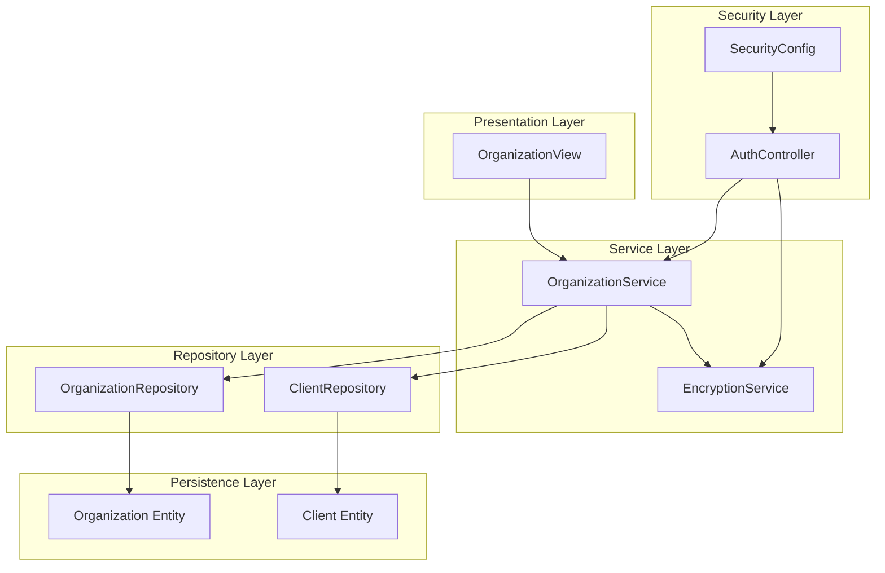
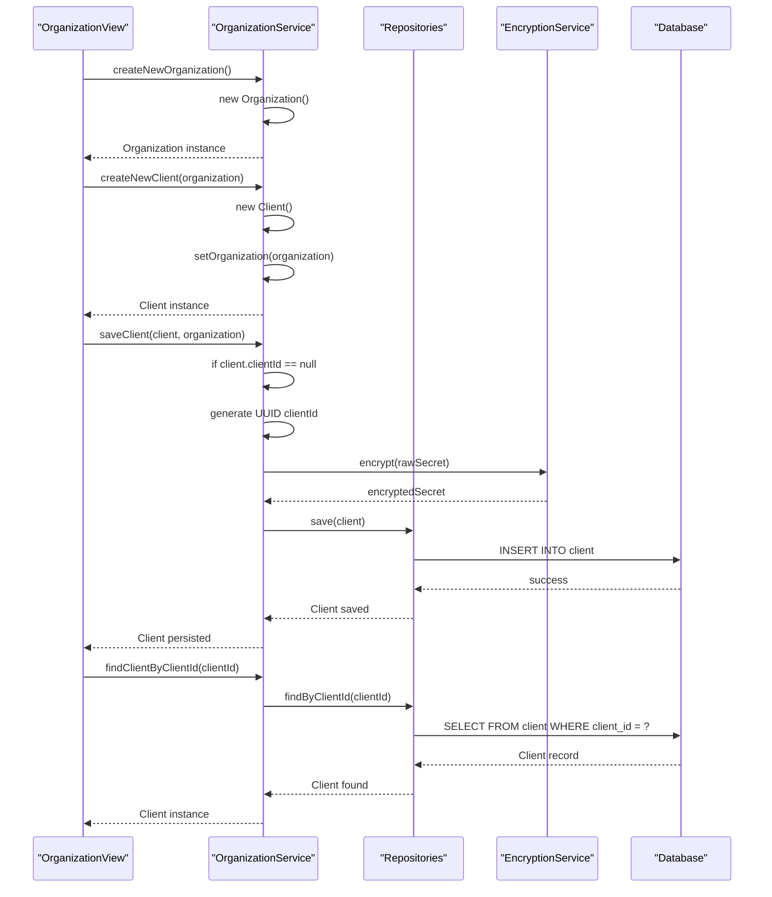
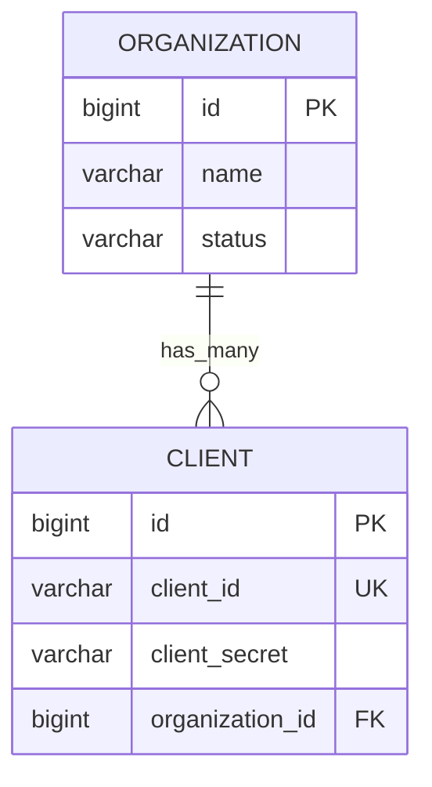
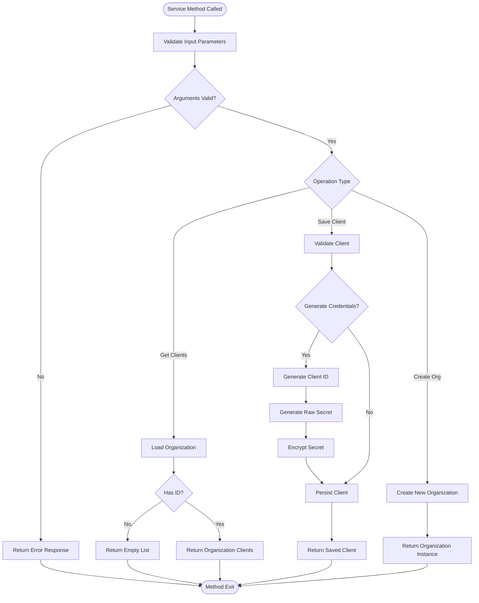
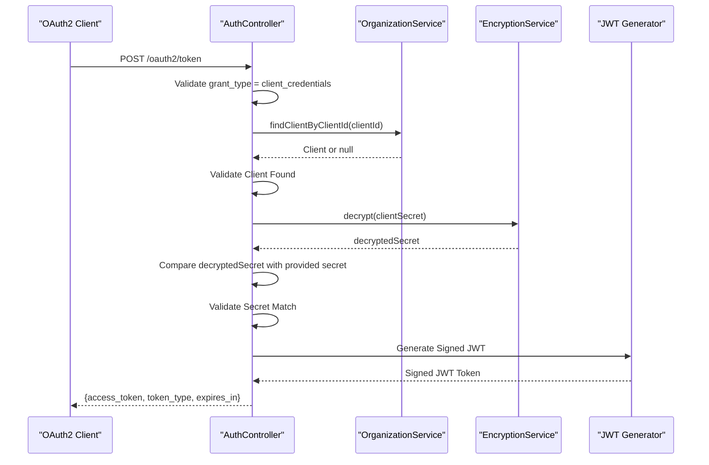
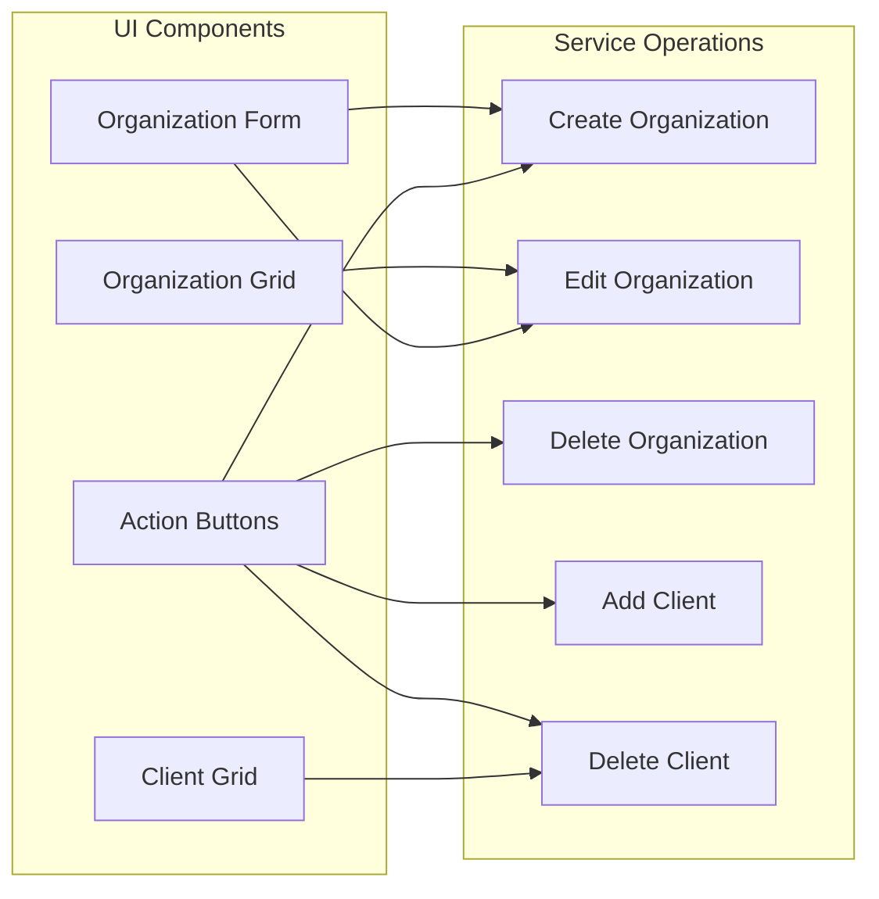
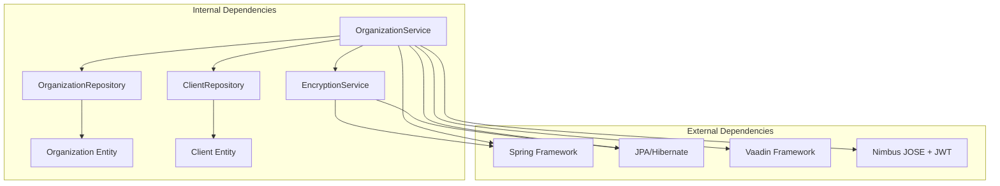

# Organization Service

<cite>
**Referenced Files in This Document**
- [OrganizationService.java](file://src/main/java/com/db2api/service/organization/OrganizationService.java)
- [Organization.java](file://src/main/java/com/db2api/persistent/organization/Organization.java)
- [Client.java](file://src/main/java/com/db2api/persistent/organization/Client.java)
- [OrganizationRepository.java](file://src/main/java/com/db2api/repository/organization/OrganizationRepository.java)
- [ClientRepository.java](file://src/main/java/com/db2api/repository/organization/ClientRepository.java)
- [EncryptionService.java](file://src/main/java/com/db2api/service/EncryptionService.java)
- [AuthController.java](file://src/main/java/com/db2api/controller/AuthController.java)
- [OrganizationView.java](file://src/main/java/com/db2api/ui/organization/OrganizationView.java)
- [datamap.map.xml](file://src/main/resources/datamap.map.xml)
- [schema.sql](file://src/main/resources/schema.sql)
- [SecurityConfig.java](file://src/main/java/com/db2api/config/SecurityConfig.java)
</cite>

## Table of Contents
1. [Introduction](#introduction)
2. [Project Structure](#project-structure)
3. [Core Components](#core-components)
4. [Architecture Overview](#architecture-overview)
5. [Detailed Component Analysis](#detailed-component-analysis)
6. [Dependency Analysis](#dependency-analysis)
7. [Performance Considerations](#performance-considerations)
8. [Troubleshooting Guide](#troubleshooting-guide)
9. [Conclusion](#conclusion)
10. [Appendices](#appendices)

## Introduction
This document provides comprehensive technical documentation for the OrganizationService implementation, focusing on multi-tenant organization management within the DB2API platform. The service orchestrates organization creation, client credential management, and tenant isolation through OAuth2 client registration. It establishes secure boundaries between organizations, enabling resource allocation and data segregation across tenants.

The OrganizationService integrates with:
- Organization and Client entities for multi-tenancy modeling
- Repository layer for persistence operations
- EncryptionService for secure credential storage
- AuthController for OAuth2 token issuance
- OrganizationView for administrative UI operations

## Project Structure
The organization management functionality is organized across service, persistence, repository, and presentation layers:

**Diagram sources**
- [OrganizationView.java:31-45](file://src/main/java/com/db2api/ui/organization/OrganizationView.java#L31-L45)
- [OrganizationService.java:15-27](file://src/main/java/com/db2api/service/organization/OrganizationService.java#L15-L27)
- [EncryptionService.java:13-19](file://src/main/java/com/db2api/service/EncryptionService.java#L13-L19)
- [AuthController.java:25-43](file://src/main/java/com/db2api/controller/AuthController.java#L25-L43)
- [SecurityConfig.java:15-28](file://src/main/java/com/db2api/config/SecurityConfig.java#L15-L28)

**Section sources**
- [OrganizationService.java:15-83](file://src/main/java/com/db2api/service/organization/OrganizationService.java#L15-L83)
- [Organization.java:14-64](file://src/main/java/com/db2api/persistent/organization/Organization.java#L14-L64)
- [Client.java:11-42](file://src/main/java/com/db2api/persistent/organization/Client.java#L11-L42)

## Core Components
The OrganizationService serves as the central coordinator for multi-tenant operations:

### Organization Management
- **Creation**: Creates new organization instances with empty state
- **Listing**: Retrieves all organizations for administrative views
- **Persistence**: Saves and deletes organizations through repository abstraction
- **Hierarchy**: Manages organization-client relationships with cascade operations

### Client Credential Management
- **Registration**: Generates OAuth2 client credentials (clientId, clientSecret)
- **Encryption**: Uses EncryptionService to securely store secrets
- **Lookup**: Provides client discovery by clientId for authentication flows
- **Lifecycle**: Supports CRUD operations for client credentials

### Tenant Isolation
- **Data Segregation**: Clients are bound to specific organizations via foreign keys
- **Access Control**: UI enforces role-based permissions (ADMIN, EDITOR, VIEWER)
- **Security Boundaries**: Clear separation between tenant data and operations

**Section sources**
- [OrganizationService.java:29-81](file://src/main/java/com/db2api/service/organization/OrganizationService.java#L29-L81)
- [OrganizationView.java:87-125](file://src/main/java/com/db2api/ui/organization/OrganizationView.java#L87-L125)

## Architecture Overview
The OrganizationService implements a layered architecture with clear separation of concerns:

**Diagram sources**
- [OrganizationService.java:69-81](file://src/main/java/com/db2api/service/organization/OrganizationService.java#L69-L81)
- [ClientRepository.java:10-13](file://src/main/java/com/db2api/repository/organization/ClientRepository.java#L10-L13)
- [EncryptionService.java:35-45](file://src/main/java/com/db2api/service/EncryptionService.java#L35-L45)

**Section sources**
- [OrganizationService.java:48-67](file://src/main/java/com/db2api/service/organization/OrganizationService.java#L48-L67)
- [AuthController.java:54-109](file://src/main/java/com/db2api/controller/AuthController.java#L54-L109)

## Detailed Component Analysis

### Organization Entity
The Organization entity represents a tenant boundary with comprehensive attributes and relationships:

```mermaid
classDiagram
class Organization {
+Long id
+String name
+String status
+Client[] clients
+addToClients(client) void
+removeFromClients(client) void
}
class Client {
+Long id
+String clientId
+String clientSecret
+Organization organization
}
class OrganizationRepository {
+findAll() Organization[]
+save(entity) Organization
+delete(entity) void
}
class ClientRepository {
+findByClientId(clientId) Optional~Client~
+save(entity) Client
+delete(entity) void
}
Organization "1" --> "many" Client : "hasMany"
OrganizationRepository --> Organization : "manages"
ClientRepository --> Client : "manages"
```

**Diagram sources**
- [Organization.java:18-64](file://src/main/java/com/db2api/persistent/organization/Organization.java#L18-L64)
- [Client.java:15-42](file://src/main/java/com/db2api/persistent/organization/Client.java#L15-L42)
- [OrganizationRepository.java:7-9](file://src/main/java/com/db2api/repository/organization/OrganizationRepository.java#L7-L9)
- [ClientRepository.java:9-13](file://src/main/java/com/db2api/repository/organization/ClientRepository.java#L9-L13)

#### Key Characteristics
- **Primary Key**: Auto-generated Long identifier
- **Tenant Attributes**: Name and status fields define organizational metadata
- **Cascade Operations**: All client operations cascade with orphan removal
- **Bidirectional Relationship**: Client maintains organization reference

**Section sources**
- [Organization.java:23-43](file://src/main/java/com/db2api/persistent/organization/Organization.java#L23-L43)
- [Organization.java:50-63](file://src/main/java/com/db2api/persistent/organization/Organization.java#L50-L63)

### Client Entity
The Client entity stores OAuth2 credentials with security-focused design:

**Diagram sources**
- [datamap.map.xml:35-42](file://src/main/resources/datamap.map.xml#L35-L42)
- [schema.sql:1-12](file://src/main/resources/schema.sql#L1-L12)

#### Security Features
- **Unique Client Identifier**: client_id enforced as unique constraint
- **Encrypted Secrets**: client_secret stored in encrypted format
- **Foreign Key Binding**: organization_id ensures tenant isolation
- **Lazy Loading**: Organization association loaded on demand

**Section sources**
- [Client.java:27-41](file://src/main/java/com/db2api/persistent/organization/Client.java#L27-L41)
- [schema.sql:7-12](file://src/main/resources/schema.sql#L7-L12)

### OrganizationService Implementation
The service coordinates all organization-related operations with robust error handling:

**Diagram sources**
- [OrganizationService.java:41-81](file://src/main/java/com/db2api/service/organization/OrganizationService.java#L41-L81)

#### Core Methods Analysis
- **getAllOrganizations()**: Returns complete organization list for administrative views
- **saveOrganization()**: Persists organization changes with transactional safety
- **deleteOrganization()**: Removes organizations with cascade to child clients
- **getClients()**: Loads organization clients with null-safe validation
- **saveClient()**: Generates OAuth2 credentials and persists with encryption
- **createNewClient()**: Factory method for client creation with organization binding
- **findClientByClientId()**: Secure client lookup for authentication flows

**Section sources**
- [OrganizationService.java:29-81](file://src/main/java/com/db2api/service/organization/OrganizationService.java#L29-L81)

### OAuth2 Authentication Flow
The AuthController integrates with OrganizationService for client credential validation:

**Diagram sources**
- [AuthController.java:54-109](file://src/main/java/com/db2api/controller/AuthController.java#L54-L109)
- [OrganizationService.java:79-81](file://src/main/java/com/db2api/service/organization/OrganizationService.java#L79-L81)
- [EncryptionService.java:47-57](file://src/main/java/com/db2api/service/EncryptionService.java#L47-L57)

**Section sources**
- [AuthController.java:54-109](file://src/main/java/com/db2api/controller/AuthController.java#L54-L109)

### Administrative UI Integration
The OrganizationView provides comprehensive management capabilities:

**Diagram sources**
- [OrganizationView.java:132-224](file://src/main/java/com/db2api/ui/organization/OrganizationView.java#L132-L224)

#### UI Features
- **Role-Based Access**: Differentiates ADMIN, EDITOR, and VIEWER capabilities
- **Real-time Updates**: Grid refreshes after persistence operations
- **Validation Feedback**: Notifications for successful operations
- **Client Management**: Inline client creation and deletion within organization context

**Section sources**
- [OrganizationView.java:52-224](file://src/main/java/com/db2api/ui/organization/OrganizationView.java#L52-L224)

## Dependency Analysis
The OrganizationService exhibits clean dependency relationships with clear inversion of control:

**Diagram sources**
- [OrganizationService.java:15-27](file://src/main/java/com/db2api/service/organization/OrganizationService.java#L15-L27)
- [EncryptionService.java:13-19](file://src/main/java/com/db2api/service/EncryptionService.java#L13-L19)
- [AuthController.java:25-43](file://src/main/java/com/db2api/controller/AuthController.java#L25-L43)

### Coupling and Cohesion
- **High Cohesion**: OrganizationService focuses exclusively on organization and client management
- **Low Coupling**: Dependencies injected via constructor, enabling testability
- **Repository Pattern**: Clean separation between persistence logic and business logic
- **Service Layer**: Centralized business rules and validation

**Section sources**
- [OrganizationService.java:18-27](file://src/main/java/com/db2api/service/organization/OrganizationService.java#L18-L27)
- [OrganizationRepository.java:7-9](file://src/main/java/com/db2api/repository/organization/OrganizationRepository.java#L7-L9)
- [ClientRepository.java:9-13](file://src/main/java/com/db2api/repository/organization/ClientRepository.java#L9-L13)

## Performance Considerations
The OrganizationService implementation incorporates several performance optimizations:

### Lazy Loading Strategy
- **Fetch Type**: Organization clients use LAZY loading to minimize unnecessary queries
- **Eager vs Lazy**: Client organization relationship configured as lazy to prevent N+1 queries
- **Batch Operations**: Cascade operations handle bulk updates efficiently

### Caching Opportunities
- **Client Lookup**: Consider caching frequently accessed client credentials
- **Organization Lists**: Cache organization lists for administrative views
- **Role-Based UI**: Cache permission checks to reduce repeated authority evaluations

### Database Optimization
- **Unique Constraints**: client_id uniqueness prevents duplicate lookups
- **Foreign Keys**: Proper indexing on organization_id for efficient joins
- **Pagination**: Consider pagination for large organization lists

## Troubleshooting Guide

### Common Issues and Solutions

#### Client Credential Generation Problems
**Symptoms**: Client secrets not being generated during save
**Causes**: 
- Client already has clientId assigned
- EncryptionService configuration issues
- Repository persistence failures

**Solutions**:
- Verify client clientId is null before save
- Check encryption service secret configuration
- Validate database connectivity and permissions

#### Authentication Failures
**Symptoms**: OAuth2 token requests failing with invalid_client
**Causes**:
- Incorrect client credentials
- Database encryption/decryption errors
- Client not properly registered

**Solutions**:
- Verify client exists in database
- Check client secret encryption format
- Confirm client_id uniqueness constraint

#### Multi-Tenant Data Isolation Issues
**Symptoms**: Cross-tenant data access or modification
**Causes**:
- Missing tenant filters in queries
- Improper organization binding
- UI role bypass vulnerabilities

**Solutions**:
- Implement tenant-aware repository methods
- Validate organization ownership in service layer
- Review UI role-based visibility controls

**Section sources**
- [OrganizationService.java:48-67](file://src/main/java/com/db2api/service/organization/OrganizationService.java#L48-L67)
- [AuthController.java:77-87](file://src/main/java/com/db2api/controller/AuthController.java#L77-L87)
- [EncryptionService.java:35-57](file://src/main/java/com/db2api/service/EncryptionService.java#L35-L57)

## Conclusion
The OrganizationService provides a robust foundation for multi-tenant organization management in the DB2API platform. Its design emphasizes clear tenant boundaries, secure credential management, and seamless integration with the broader authentication ecosystem.

Key strengths include:
- **Secure Multi-Tenancy**: Clear data segregation through organization-client relationships
- **OAuth2 Integration**: Seamless client credential management for API authentication
- **Administrative UI**: Comprehensive management interface with role-based access control
- **Extensible Design**: Clean service layer enabling future enhancements

Recommended enhancements for production deployment:
- Implement tenant-aware repository methods for automatic filtering
- Add comprehensive logging and audit trails for compliance
- Introduce rate limiting and monitoring for client credentials
- Consider distributed caching for improved performance
- Implement backup and disaster recovery for organization data

## Appendices

### Practical Usage Examples

#### Organization Setup Workflow
1. Create new organization instance
2. Configure organization metadata (name, status)
3. Persist organization to database
4. Assign organization to administrative user
5. Monitor organization status and client count

#### Client Credential Generation
1. Create client instance bound to organization
2. Call saveClient to generate credentials
3. Store client_id and client_secret securely
4. Use credentials for OAuth2 authentication
5. Rotate credentials periodically

#### Tenant-Specific Operations
1. Filter operations by organization context
2. Enforce role-based access controls
3. Implement tenant-specific quotas and limits
4. Monitor cross-tenant data access attempts
5. Audit all administrative actions per tenant

### Security Best Practices
- **Secret Rotation**: Regularly rotate client secrets with notification
- **Access Logging**: Log all authentication attempts and failures
- **Rate Limiting**: Implement rate limits for token requests
- **Audit Trails**: Maintain comprehensive logs for compliance
- **Data Validation**: Validate all input parameters rigorously
- **Error Handling**: Avoid leaking sensitive information in error messages