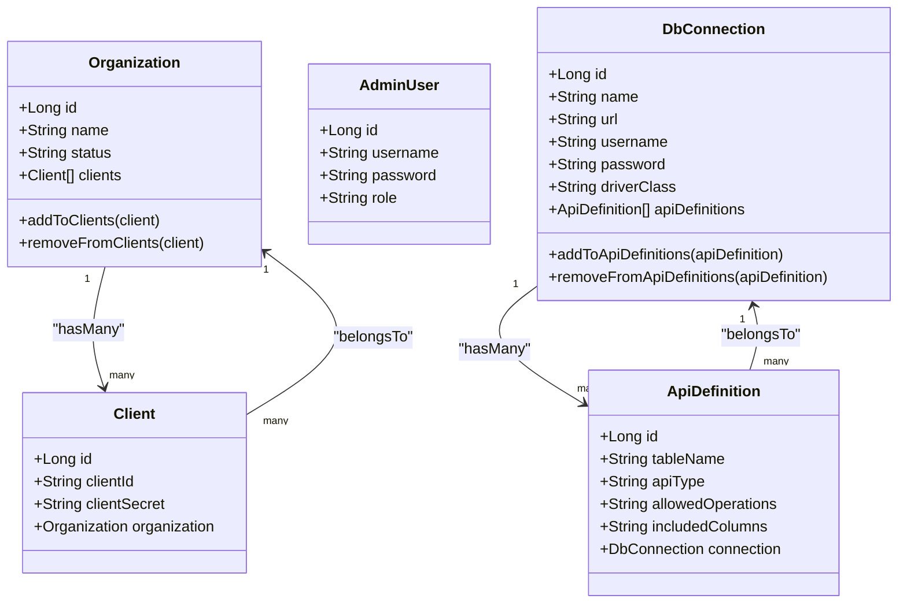
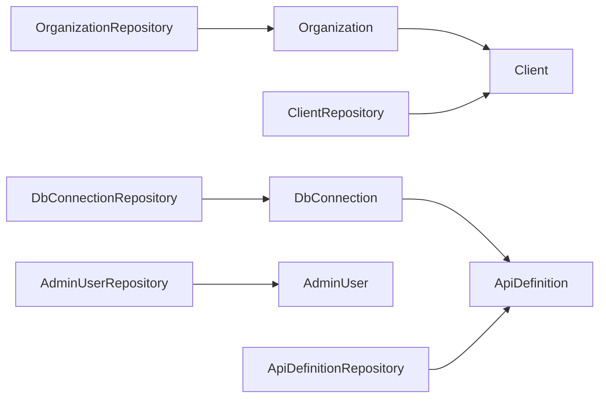
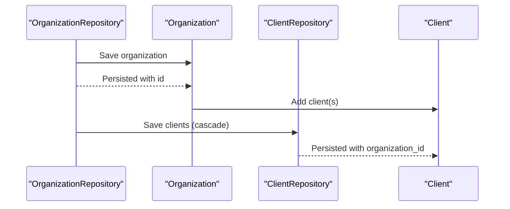

# Data Models & Persistence

<cite>
**Referenced Files in This Document**
- [Organization.java](file://src/main/java/com/db2api/persistent/organization/Organization.java)
- [Client.java](file://src/main/java/com/db2api/persistent/organization/Client.java)
- [AdminUser.java](file://src/main/java/com/db2api/persistent/admin/AdminUser.java)
- [ApiDefinition.java](file://src/main/java/com/db2api/persistent/api/ApiDefinition.java)
- [DbConnection.java](file://src/main/java/com/db2api/persistent/connection/DbConnection.java)
- [OrganizationRepository.java](file://src/main/java/com/db2api/repository/organization/OrganizationRepository.java)
- [ClientRepository.java](file://src/main/java/com/db2api/repository/organization/ClientRepository.java)
- [AdminUserRepository.java](file://src/main/java/com/db2api/repository/admin/AdminUserRepository.java)
- [ApiDefinitionRepository.java](file://src/main/java/com/db2api/repository/api/ApiDefinitionRepository.java)
- [DbConnectionRepository.java](file://src/main/java/com/db2api/repository/connection/DbConnectionRepository.java)
- [application.properties](file://src/main/resources/application.properties)
- [cayenne-project.xml](file://src/main/resources/cayenne-project.xml)
- [datamap.map.xml](file://src/main/resources/datamap.map.xml)
- [schema.sql](file://src/main/resources/schema.sql)
</cite>

## Table of Contents
1. [Introduction](#introduction)
2. [Project Structure](#project-structure)
3. [Core Components](#core-components)
4. [Architecture Overview](#architecture-overview)
5. [Detailed Component Analysis](#detailed-component-analysis)
6. [Dependency Analysis](#dependency-analysis)
7. [Performance Considerations](#performance-considerations)
8. [Troubleshooting Guide](#troubleshooting-guide)
9. [Conclusion](#conclusion)
10. [Appendices](#appendices)

## Introduction
This document describes the data models and persistence layer for DB2API. It focuses on the database schema design, entity relationships among Organization, Client, AdminUser, and ApiDefinition, the repository layer implementation, and JPA/Hibernate configuration. It also documents primary/foreign key relationships, indexes, constraints, validation rules, and practical usage patterns for data access and persistence optimization.

## Project Structure
The persistence layer is organized around JPA entities under the persistent package, Spring Data JPA repositories under repository packages, and configuration under resources. The entities are mapped via both JPA annotations and Apache Cayenne’s datamap.

```mermaid
graph TB
subgraph "Entities"
ORG["Organization"]
CLI["Client"]
ADU["AdminUser"]
CONN["DbConnection"]
API["ApiDefinition"]
end
subgraph "Repositories"
ORGR["OrganizationRepository"]
CLIR["ClientRepository"]
ADUR["AdminUserRepository"]
CONNR["DbConnectionRepository"]
APIR["ApiDefinitionRepository"]
end
subgraph "Config"
APP["application.properties"]
MAP["datamap.map.xml"]
CP["cayenne-project.xml"]
SQL["schema.sql"]
end
ORG --> CLI
ORG <- --> ORGR
CLI --> ORG
CLI <- --> CLIR
CONN --> API
CONN <- --> CONNR
API --> CONN
API <- --> APIR
ADU <- --> ADUR
APP --> MAP
CP --> MAP
MAP --> SQL
```

**Diagram sources**
- [Organization.java:14-65](file://src/main/java/com/db2api/persistent/organization/Organization.java#L14-L65)
- [Client.java:11-43](file://src/main/java/com/db2api/persistent/organization/Client.java#L11-L43)
- [AdminUser.java:12-43](file://src/main/java/com/db2api/persistent/admin/AdminUser.java#L12-L43)
- [DbConnection.java:16-85](file://src/main/java/com/db2api/persistent/connection/DbConnection.java#L16-L85)
- [ApiDefinition.java:13-57](file://src/main/java/com/db2api/persistent/api/ApiDefinition.java#L13-L57)
- [OrganizationRepository.java:12-23](file://src/main/java/com/db2api/repository/organization/OrganizationRepository.java#L12-L23)
- [ClientRepository.java:9-14](file://src/main/java/com/db2api/repository/organization/ClientRepository.java#L9-L14)
- [AdminUserRepository.java:12-23](file://src/main/java/com/db2api/repository/admin/AdminUserRepository.java#L12-L23)
- [DbConnectionRepository.java:10-13](file://src/main/java/com/db2api/repository/connection/DbConnectionRepository.java#L10-L13)
- [ApiDefinitionRepository.java:10-22](file://src/main/java/com/db2api/repository/api/ApiDefinitionRepository.java#L10-L22)
- [application.properties:6-16](file://src/main/resources/application.properties#L6-L16)
- [datamap.map.xml:6-82](file://src/main/resources/datamap.map.xml#L6-L82)
- [cayenne-project.xml:1-5](file://src/main/resources/cayenne-project.xml#L1-L5)
- [schema.sql:1-39](file://src/main/resources/schema.sql#L1-L39)

**Section sources**
- [application.properties:1-20](file://src/main/resources/application.properties#L1-L20)
- [datamap.map.xml:1-83](file://src/main/resources/datamap.map.xml#L1-L83)
- [cayenne-project.xml:1-5](file://src/main/resources/cayenne-project.xml#L1-L5)
- [schema.sql:1-39](file://src/main/resources/schema.sql#L1-L39)

## Core Components
This section outlines the core entities and their roles in the persistence layer.

- Organization
  - Purpose: Grouping for API access management; owns multiple Clients.
  - Key attributes: id, name, status.
  - Relationships: One-to-many with Client via organization_id.
  - Utility methods: addToClients, removeFromClients.

- Client
  - Purpose: OAuth2 client credentials holder; belongs to an Organization.
  - Key attributes: id, clientId (unique), clientSecret.
  - Relationships: Many-to-one with Organization via organization_id.
  - Validation: clientId uniqueness enforced at DB level.

- AdminUser
  - Purpose: Authentication and role-based access control for management UI.
  - Key attributes: id, username (unique), password, role.
  - Validation: username uniqueness enforced at DB level.

- DbConnection
  - Purpose: Database connection configuration; stores credentials and driver info.
  - Key attributes: id, name, url, username, password, driverClass.
  - Relationships: One-to-many with ApiDefinition via connection_id.
  - Utility methods: addToApiDefinitions, removeFromApiDefinitions.

- ApiDefinition
  - Purpose: Maps a database table to dynamic REST or GraphQL endpoints.
  - Key attributes: id, tableName, apiType, allowedOperations, includedColumns.
  - Relationships: Many-to-one with DbConnection via connection_id.

**Section sources**
- [Organization.java:14-65](file://src/main/java/com/db2api/persistent/organization/Organization.java#L14-L65)
- [Client.java:11-43](file://src/main/java/com/db2api/persistent/organization/Client.java#L11-L43)
- [AdminUser.java:12-43](file://src/main/java/com/db2api/persistent/admin/AdminUser.java#L12-L43)
- [DbConnection.java:16-85](file://src/main/java/com/db2api/persistent/connection/DbConnection.java#L16-L85)
- [ApiDefinition.java:13-57](file://src/main/java/com/db2api/persistent/api/ApiDefinition.java#L13-L57)

## Architecture Overview
The persistence architecture combines JPA/Hibernate with Spring Data JPA repositories and Apache Cayenne for model mapping. Entities are annotated for JPA, while Cayenne’s datamap defines object-to-database mappings and relationships. DDL is managed by Hibernate (update) and supplemented by schema.sql.



**Diagram sources**
- [Organization.java:18-65](file://src/main/java/com/db2api/persistent/organization/Organization.java#L18-L65)
- [Client.java:15-43](file://src/main/java/com/db2api/persistent/organization/Client.java#L15-L43)
- [DbConnection.java:20-85](file://src/main/java/com/db2api/persistent/connection/DbConnection.java#L20-L85)
- [ApiDefinition.java:17-57](file://src/main/java/com/db2api/persistent/api/ApiDefinition.java#L17-L57)
- [AdminUser.java:16-43](file://src/main/java/com/db2api/persistent/admin/AdminUser.java#L16-L43)

## Detailed Component Analysis

### Database Schema Design and Constraints
- organization
  - Columns: id (SERIAL primary key), name (VARCHAR 255, NOT NULL), status (VARCHAR 50, NOT NULL).
  - Indexes/constraints: Primary key on id; no explicit indexes defined in schema.sql.

- client
  - Columns: id (SERIAL primary key), client_id (VARCHAR 255, NOT NULL, UNIQUE), client_secret (VARCHAR 255, NOT NULL), organization_id (INTEGER, REFERENCES organization.id).
  - Indexes/constraints: Primary key on id; UNIQUE on client_id; foreign key on organization_id.

- db_connection
  - Columns: id (SERIAL primary key), name (VARCHAR 255, NOT NULL), url (VARCHAR 500, NOT NULL), username (VARCHAR 255, NOT NULL), password (VARCHAR 255, NOT NULL), driver_class (VARCHAR 255, NOT NULL).
  - Indexes/constraints: Primary key on id.

- api_definition
  - Columns: id (SERIAL primary key), connection_id (INTEGER, REFERENCES db_connection.id), name (VARCHAR 255, NOT NULL), api_type (VARCHAR 50, NOT NULL), table_name (VARCHAR 255, NOT NULL), allowed_operations (VARCHAR 255), included_columns (TEXT).
  - Indexes/constraints: Primary key on id; foreign key on connection_id.

- admin_user
  - Columns: id (SERIAL primary key), username (VARCHAR 255, NOT NULL, UNIQUE), password (VARCHAR 255, NOT NULL), role (VARCHAR 50, NOT NULL).
  - Indexes/constraints: Primary key on id; UNIQUE on username.

Validation rules observed:
- NOT NULL constraints on required fields.
- UNIQUE constraints on username and client_id.
- Foreign key constraints linking client.organization_id to organization.id and api_definition.connection_id to db_connection.id.

**Section sources**
- [schema.sql:1-39](file://src/main/resources/schema.sql#L1-L39)

### Entity Relationships and Mappings
- JPA/Hibernate mappings
  - Organization.clients: OneToMany(mappedBy = "organization")
  - Client.organization: ManyToOne(joinColumn = "organization_id")
  - DbConnection.apiDefinitions: OneToMany(mappedBy = "connection")
  - ApiDefinition.connection: ManyToOne(joinColumn = "connection_id")

- Apache Cayenne mappings
  - Datamap defines db-entity and obj-entity pairs and relationships.
  - Relationships:
    - db-relationship "clients": organization → client (toMany)
    - db-relationship "api_definitions": db_connection → api_definition (toMany)
    - db-relationship "organization": client → organization (toMany=false)
    - db-relationship "connection": api_definition → db_connection (toMany=false)
  - Delete rules:
    - Obj-relationship "clients" and "apiDefinitions" configured with deleteRule "Deny".
    - Obj-relationships "connection" and "organization" configured with deleteRule "Nullify".

**Section sources**
- [datamap.map.xml:66-82](file://src/main/resources/datamap.map.xml#L66-L82)
- [Organization.java:42-43](file://src/main/java/com/db2api/persistent/organization/Organization.java#L42-L43)
- [Client.java:39-41](file://src/main/java/com/db2api/persistent/organization/Client.java#L39-L41)
- [DbConnection.java:62-63](file://src/main/java/com/db2api/persistent/connection/DbConnection.java#L62-L63)
- [ApiDefinition.java:53-55](file://src/main/java/com/db2api/persistent/api/ApiDefinition.java#L53-L55)

### Repository Layer Implementation
- OrganizationRepository
  - Extends JpaRepository<Organization, Long>.
  - Provides standard CRUD operations.

- ClientRepository
  - Extends JpaRepository<Client, Long>.
  - Provides standard CRUD operations plus findByClientId(clientId).

- AdminUserRepository
  - Extends JpaRepository<AdminUser, Long>.
  - Provides standard CRUD operations plus findByUsername(username).

- ApiDefinitionRepository
  - Extends JpaRepository<ApiDefinition, Long>.
  - Provides standard CRUD operations plus findByTableNameAndApiType(tableName, apiType).

- DbConnectionRepository
  - Extends JpaRepository<DbConnection, Long>.
  - Provides standard CRUD operations.

Usage patterns:
- Load an Organization with its Clients using fetch joins or repository methods.
- Find a Client by clientId for OAuth2 flows.
- Retrieve an AdminUser by username for authentication.
- Look up ApiDefinition by table and API type for dynamic endpoint resolution.

**Section sources**
- [OrganizationRepository.java:12-23](file://src/main/java/com/db2api/repository/organization/OrganizationRepository.java#L12-L23)
- [ClientRepository.java:9-14](file://src/main/java/com/db2api/repository/organization/ClientRepository.java#L9-L14)
- [AdminUserRepository.java:12-23](file://src/main/java/com/db2api/repository/admin/AdminUserRepository.java#L12-L23)
- [ApiDefinitionRepository.java:10-22](file://src/main/java/com/db2api/repository/api/ApiDefinitionRepository.java#L10-L22)
- [DbConnectionRepository.java:10-13](file://src/main/java/com/db2api/repository/connection/DbConnectionRepository.java#L10-L13)

### JPA/Hibernate Configuration
- Datasource
  - PostgreSQL JDBC URL, username, password, driver class configured.
- JPA/Hibernate
  - Database dialect set to PostgreSQL.
  - DDL auto mode set to update.
  - SQL logging enabled.

Cayenne configuration
- cayenne-project.xml references datamap.map.xml.
- datamap.map.xml sets defaultPackage and maps object entities to database entities, including relationships and delete rules.

**Section sources**
- [application.properties:6-16](file://src/main/resources/application.properties#L6-L16)
- [cayenne-project.xml:1-5](file://src/main/resources/cayenne-project.xml#L1-L5)
- [datamap.map.xml:6-65](file://src/main/resources/datamap.map.xml#L6-L65)

### Practical Examples of Entity Usage
- Create and persist an Organization and associated Clients
  - Steps: instantiate Organization, populate name/status, instantiate Clients, set organization on each client, save Organization (cascade persists Clients).
  - Reference: [Organization.java:42-63](file://src/main/java/com/db2api/persistent/organization/Organization.java#L42-L63)

- Manage ApiDefinition for a DbConnection
  - Steps: instantiate DbConnection, save it, instantiate ApiDefinition, set connection on ApiDefinition, add to DbConnection.apiDefinitions, save DbConnection.
  - Reference: [DbConnection.java:62-83](file://src/main/java/com/db2api/persistent/connection/DbConnection.java#L62-L83), [ApiDefinition.java:53-55](file://src/main/java/com/db2api/persistent/api/ApiDefinition.java#L53-L55)

- Authenticate AdminUser
  - Steps: load AdminUser by username via AdminUserRepository, compare credentials.
  - Reference: [AdminUserRepository.java:15-21](file://src/main/java/com/db2api/repository/admin/AdminUserRepository.java#L15-L21), [AdminUser.java:28-29](file://src/main/java/com/db2api/persistent/admin/AdminUser.java#L28-L29)

- Resolve Client for OAuth2
  - Steps: load Client by clientId via ClientRepository, use credentials for token exchange.
  - Reference: [ClientRepository.java](file://src/main/java/com/db2api/repository/organization/ClientRepository.java#L12), [Client.java:27-28](file://src/main/java/com/db2api/persistent/organization/Client.java#L27-L28)

- Dynamic API lookup
  - Steps: load ApiDefinition by tableName and apiType via ApiDefinitionRepository.
  - Reference: [ApiDefinitionRepository.java:13-20](file://src/main/java/com/db2api/repository/api/ApiDefinitionRepository.java#L13-L20), [ApiDefinition.java:29-36](file://src/main/java/com/db2api/persistent/api/ApiDefinition.java#L29-L36)

### Data Lifecycle and Validation Rules
- Creation
  - Entities are persisted via repositories; cascading persists dependent entities where configured (e.g., Organization to Client, DbConnection to ApiDefinition).
- Updates
  - Entities are modified in memory and saved; relationships are maintained using helper methods (e.g., addToClients, removeFromClients, addToApiDefinitions, removeFromApiDefinitions).
- Deletion
  - Delete rules:
    - Deny for organization.clients and db_connection.api_definitions: prevents deletion if children exist.
    - Nullify for api_definition.connection and client.organization: removes foreign key reference on delete.
- Validation
  - DB-level constraints enforce NOT NULL, UNIQUE, and FOREIGN KEY.
  - JPA annotations define column mappings; Cayenne enforces object relationships and delete rules.

**Section sources**
- [datamap.map.xml:66-82](file://src/main/resources/datamap.map.xml#L66-L82)
- [schema.sql:1-39](file://src/main/resources/schema.sql#L1-L39)

## Dependency Analysis
The following diagram shows the primary dependencies among entities and repositories.



**Diagram sources**
- [Organization.java:18-65](file://src/main/java/com/db2api/persistent/organization/Organization.java#L18-L65)
- [Client.java:15-43](file://src/main/java/com/db2api/persistent/organization/Client.java#L15-L43)
- [DbConnection.java:20-85](file://src/main/java/com/db2api/persistent/connection/DbConnection.java#L20-L85)
- [ApiDefinition.java:17-57](file://src/main/java/com/db2api/persistent/api/ApiDefinition.java#L17-L57)
- [OrganizationRepository.java:12-23](file://src/main/java/com/db2api/repository/organization/OrganizationRepository.java#L12-L23)
- [ClientRepository.java:9-14](file://src/main/java/com/db2api/repository/organization/ClientRepository.java#L9-L14)
- [AdminUserRepository.java:12-23](file://src/main/java/com/db2api/repository/admin/AdminUserRepository.java#L12-L23)
- [DbConnectionRepository.java:10-13](file://src/main/java/com/db2api/repository/connection/DbConnectionRepository.java#L10-L13)
- [ApiDefinitionRepository.java:10-22](file://src/main/java/com/db2api/repository/api/ApiDefinitionRepository.java#L10-L22)

**Section sources**
- [datamap.map.xml:66-82](file://src/main/resources/datamap.map.xml#L66-L82)

## Performance Considerations
- Fetch strategies
  - Lazy loading is used for many-to-one relationships (e.g., Client.organization, ApiDefinition.connection) to avoid unnecessary joins.
- Cascading
  - Cascade persist on Organization.clients and DbConnection.apiDefinitions reduces round-trips during parent-child creation.
- Indexing
  - Consider adding indexes on frequently queried columns:
    - client.client_id
    - admin_user.username
    - api_definition.table_name and api_definition.api_type for fast dynamic endpoint resolution.
- DDL auto mode
  - DDL auto update is convenient for development; in production, manage schema migrations explicitly to prevent unexpected alterations.
- SQL logging
  - Keep SQL logging enabled during development for diagnostics; disable in production to reduce overhead.

[No sources needed since this section provides general guidance]

## Troubleshooting Guide
- Duplicate key violations
  - Symptoms: UNIQUE constraint violation on username or client_id.
  - Resolution: Ensure unique values before persisting; check existing records via repositories.
  - References: [AdminUserRepository.java:15-21](file://src/main/java/com/db2api/repository/admin/AdminUserRepository.java#L15-L21), [ClientRepository.java](file://src/main/java/com/db2api/repository/organization/ClientRepository.java#L12)
- Foreign key constraint errors
  - Symptoms: Cannot insert or update due to missing parent record.
  - Resolution: Persist parent entities first; verify relationships before saving child entities.
  - References: [Organization.java:42-63](file://src/main/java/com/db2api/persistent/organization/Organization.java#L42-L63), [DbConnection.java:62-83](file://src/main/java/com/db2api/persistent/connection/DbConnection.java#L62-L83)
- Orphan removal and cascade behavior
  - Symptoms: Unexpected deletion of child entities.
  - Resolution: Understand delete rules (Deny vs Nullify) and manage relationships carefully.
  - References: [datamap.map.xml:78-81](file://src/main/resources/datamap.map.xml#L78-L81)
- Schema drift
  - Symptoms: Application fails due to missing tables/columns.
  - Resolution: Review schema.sql and application.properties; align DDL strategy with environment needs.
  - References: [schema.sql:1-39](file://src/main/resources/schema.sql#L1-L39), [application.properties:12-16](file://src/main/resources/application.properties#L12-L16)

**Section sources**
- [AdminUserRepository.java:15-21](file://src/main/java/com/db2api/repository/admin/AdminUserRepository.java#L15-L21)
- [ClientRepository.java](file://src/main/java/com/db2api/repository/organization/ClientRepository.java#L12)
- [datamap.map.xml:78-81](file://src/main/resources/datamap.map.xml#L78-L81)
- [schema.sql:1-39](file://src/main/resources/schema.sql#L1-L39)
- [application.properties:12-16](file://src/main/resources/application.properties#L12-L16)

## Conclusion
The DB2API persistence layer integrates JPA/Hibernate with Spring Data JPA and Apache Cayenne to model core business entities and their relationships. The schema enforces strong constraints for data integrity, while repositories provide straightforward access patterns. Proper use of lazy loading, cascades, and delete rules ensures efficient and safe data lifecycle management. Production deployments should refine indexing, migration strategy, and logging for optimal performance and reliability.

[No sources needed since this section summarizes without analyzing specific files]

## Appendices

### Entity Relationship Flow


**Diagram sources**
- [OrganizationRepository.java:12-23](file://src/main/java/com/db2api/repository/organization/OrganizationRepository.java#L12-L23)
- [Organization.java:42-63](file://src/main/java/com/db2api/persistent/organization/Organization.java#L42-L63)
- [ClientRepository.java:9-14](file://src/main/java/com/db2api/repository/organization/ClientRepository.java#L9-L14)
- [Client.java:39-41](file://src/main/java/com/db2api/persistent/organization/Client.java#L39-L41)