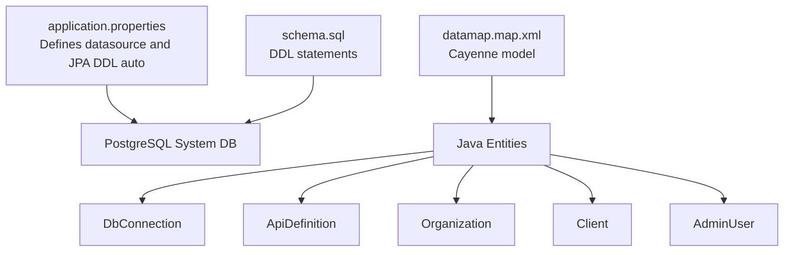
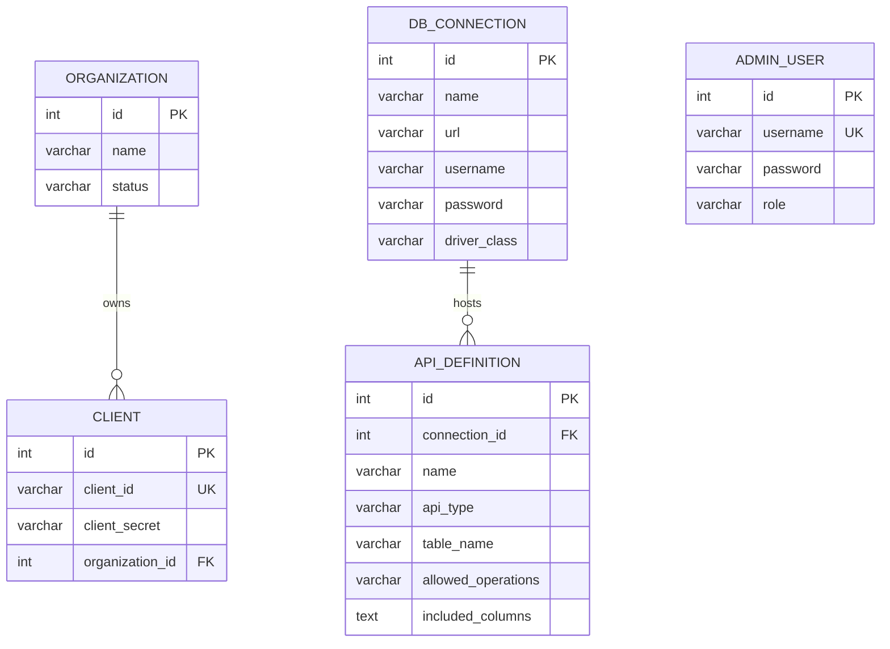
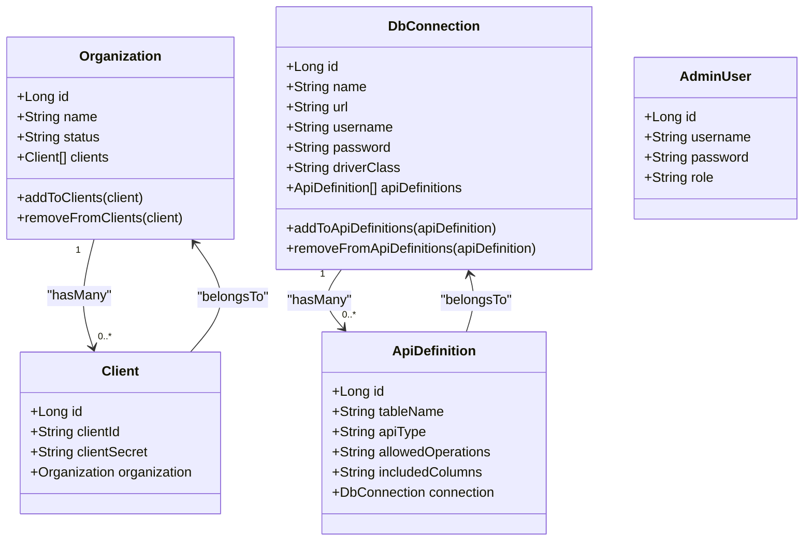
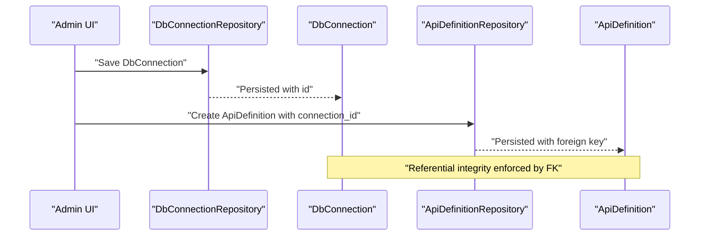
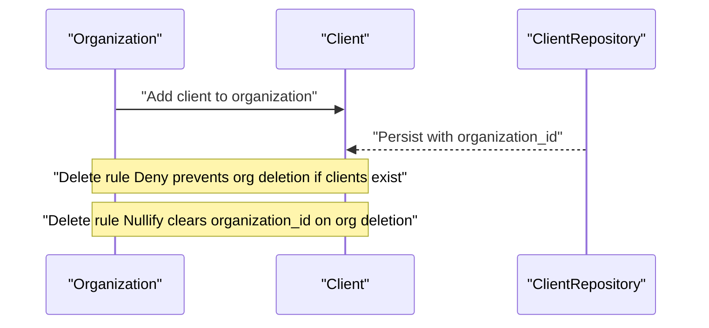
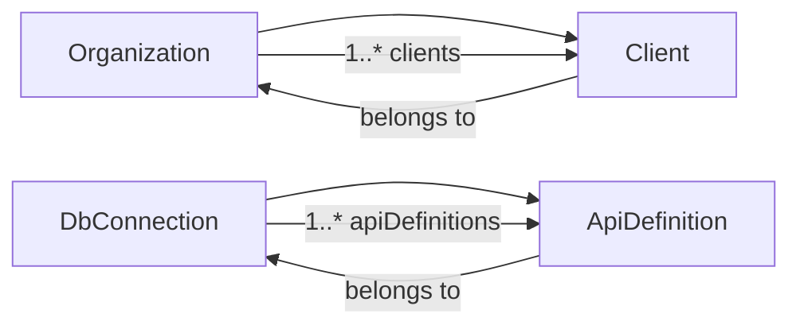

# Database Schema Design

<cite>
**Referenced Files in This Document**
- [schema.sql](file://src/main/resources/schema.sql)
- [datamap.map.xml](file://src/main/resources/datamap.map.xml)
- [application.properties](file://src/main/resources/application.properties)
- [CayenneConfig.java](file://src/main/java/com/db2api/config/CayenneConfig.java)
- [DataInitializer.java](file://src/main/java/com/db2api/config/DataInitializer.java)
- [AdminUser.java](file://src/main/java/com/db2api/persistent/admin/AdminUser.java)
- [ApiDefinition.java](file://src/main/java/com/db2api/persistent/api/ApiDefinition.java)
- [DbConnection.java](file://src/main/java/com/db2api/persistent/connection/DbConnection.java)
- [Client.java](file://src/main/java/com/db2api/persistent/organization/Client.java)
- [Organization.java](file://src/main/java/com/db2api/persistent/organization/Organization.java)
- [JpaMigrationTest.java](file://src/test/java/com/db2api/migration/JpaMigrationTest.java)
</cite>

## Table of Contents
1. [Introduction](#introduction)
2. [Project Structure](#project-structure)
3. [Core Components](#core-components)
4. [Architecture Overview](#architecture-overview)
5. [Detailed Component Analysis](#detailed-component-analysis)
6. [Dependency Analysis](#dependency-analysis)
7. [Performance Considerations](#performance-considerations)
8. [Troubleshooting Guide](#troubleshooting-guide)
9. [Conclusion](#conclusion)
10. [Appendices](#appendices)

## Introduction
This document provides comprehensive database schema documentation for DB2API. It details the design and relationships among the organization, client, db_connection, api_definition, and admin_user tables. It explains column definitions, data types, constraints, primary and foreign keys, referential integrity enforcement, and the rationale behind each design choice. Practical examples of table creation, modifications, and schema evolution patterns are included, along with normalization and denormalization considerations.

## Project Structure
The database schema is defined via SQL DDL and mapped to Java entities using Apache Cayenne. The application uses Spring Boot with JPA/Hibernate and connects to a PostgreSQL system database. The schema is initialized and evolved through JPA’s DDL auto mode.

**Diagram sources**
- [application.properties:1-20](file://src/main/resources/application.properties#L1-L20)
- [schema.sql:1-39](file://src/main/resources/schema.sql#L1-L39)
- [datamap.map.xml:1-83](file://src/main/resources/datamap.map.xml#L1-L83)

**Section sources**
- [application.properties:1-20](file://src/main/resources/application.properties#L1-L20)
- [schema.sql:1-39](file://src/main/resources/schema.sql#L1-L39)
- [datamap.map.xml:1-83](file://src/main/resources/datamap.map.xml#L1-L83)

## Core Components
This section documents each table, its columns, data types, constraints, and relationships.

- organization
  - Purpose: Groups clients and controls access scope.
  - Columns:
    - id: integer, serial, primary key, generated identity.
    - name: varchar(255), not null.
    - status: varchar(50), not null.
  - Constraints:
    - Primary key on id.
    - Not-null constraints on name and status.
  - Indexing and uniqueness: No explicit indexes; consider adding an index on status for filtering.
  - Referential integrity: No incoming foreign keys; acts as a parent entity.

- client
  - Purpose: OAuth2 client credentials holder; belongs to an organization.
  - Columns:
    - id: integer, serial, primary key, generated identity.
    - client_id: varchar(255), not null, unique.
    - client_secret: varchar(255), not null.
    - organization_id: integer, references organization.id.
  - Constraints:
    - Primary key on id.
    - Unique constraint on client_id.
    - Not-null constraints on client_id and client_secret.
    - Foreign key on organization_id referencing organization.id.
  - Indexing and uniqueness: client_id is unique; consider an index on organization_id for join performance.
  - Referential integrity: ON DELETE SET NULL enforced by Cayenne relationship mapping.

- db_connection
  - Purpose: Stores external database connection metadata and credentials.
  - Columns:
    - id: integer, serial, primary key, generated identity.
    - name: varchar(255), not null.
    - url: varchar(500), not null.
    - username: varchar(255), not null.
    - password: varchar(255), not null.
    - driver_class: varchar(255), not null.
  - Constraints:
    - Primary key on id.
    - Not-null constraints on name, url, username, password, driver_class.
  - Indexing and uniqueness: None explicitly defined.
  - Referential integrity: Referenced by api_definition.connection_id; deletion behavior controlled by relationship mapping.

- api_definition
  - Purpose: Defines how a database table is exposed as a REST or GraphQL API.
  - Columns:
    - id: integer, serial, primary key, generated identity.
    - connection_id: integer, references db_connection.id.
    - name: varchar(255), not null.
    - api_type: varchar(50), not null (values include REST, GraphQL).
    - table_name: varchar(255), not null.
    - allowed_operations: varchar(255) (comma-separated values like GET, PUT, POST, DELETE).
    - included_columns: text (comma-separated list of columns).
  - Constraints:
    - Primary key on id.
    - Not-null constraints on name, api_type, table_name.
    - Foreign key on connection_id referencing db_connection.id.
  - Indexing and uniqueness: None explicitly defined.
  - Referential integrity: ON DELETE SET NULL enforced by Cayenne relationship mapping.

- admin_user
  - Purpose: Administrative user for the management UI with role-based access control.
  - Columns:
    - id: integer, serial, primary key, generated identity.
    - username: varchar(255), not null, unique.
    - password: varchar(255), not null.
    - role: varchar(50), not null (values include ADMIN, EDITOR, VIEWER).
  - Constraints:
    - Primary key on id.
    - Unique constraint on username.
    - Not-null constraints on username, password, role.
  - Indexing and uniqueness: username is unique; consider an index on role for role-based queries.
  - Referential integrity: No foreign keys; standalone administrative account table.

Practical examples of table creation and modification:
- Creation: See [schema.sql:1-39](file://src/main/resources/schema.sql#L1-L39).
- Modification scenarios:
  - Add an index on organization.status for filtering: CREATE INDEX idx_org_status ON organization(status);.
  - Add an index on client.organization_id for joins: CREATE INDEX idx_client_org ON client(organization_id);.
  - Add a comment column to api_definition: ALTER TABLE api_definition ADD COLUMN comment TEXT;.
  - Rename allowed_operations to allowed_methods: ALTER TABLE api_definition RENAME COLUMN allowed_operations TO allowed_methods;.
- Schema evolution patterns:
  - Use JPA DDL auto mode (update) for development; switch to explicit migrations for production.
  - Example repository usage for testing persistence operations: [JpaMigrationTest.java:19-49](file://src/test/java/com/db2api/migration/JpaMigrationTest.java#L19-L49).

Normalization and denormalization:
- Normalization:
  - organization-client-api_definition forms a normalized hierarchy with clear parent-child relationships.
  - Credentials are stored separately in db_connection and client tables, avoiding duplication.
- Denormalization considerations:
  - No significant denormalization observed; data is kept in separate, specialized tables to maintain integrity and reduce redundancy.

**Section sources**
- [schema.sql:1-39](file://src/main/resources/schema.sql#L1-L39)
- [datamap.map.xml:7-39](file://src/main/resources/datamap.map.xml#L7-L39)
- [JpaMigrationTest.java:19-49](file://src/test/java/com/db2api/migration/JpaMigrationTest.java#L19-L49)

## Architecture Overview
The database architecture centers around five tables with clear referential integrity enforced by foreign keys and Cayenne mappings. The system uses a PostgreSQL system database for application metadata and relies on JPA/Hibernate for schema evolution and Apache Cayenne for dynamic database interactions.

**Diagram sources**
- [schema.sql:1-39](file://src/main/resources/schema.sql#L1-L39)
- [datamap.map.xml:66-77](file://src/main/resources/datamap.map.xml#L66-L77)

**Section sources**
- [application.properties:6-16](file://src/main/resources/application.properties#L6-L16)
- [CayenneConfig.java:22-27](file://src/main/java/com/db2api/config/CayenneConfig.java#L22-L27)

## Detailed Component Analysis

### Entity Model Mapping
The Cayenne model maps database entities to Java classes, defining attributes, relationships, and delete rules.

**Diagram sources**
- [datamap.map.xml:40-82](file://src/main/resources/datamap.map.xml#L40-L82)
- [Organization.java:42-63](file://src/main/java/com/db2api/persistent/organization/Organization.java#L42-L63)
- [Client.java:39-41](file://src/main/java/com/db2api/persistent/organization/Client.java#L39-L41)
- [DbConnection.java:62-83](file://src/main/java/com/db2api/persistent/connection/DbConnection.java#L62-L83)
- [ApiDefinition.java:53-55](file://src/main/java/com/db2api/persistent/api/ApiDefinition.java#L53-L55)
- [AdminUser.java:21-41](file://src/main/java/com/db2api/persistent/admin/AdminUser.java#L21-L41)

**Section sources**
- [datamap.map.xml:40-82](file://src/main/resources/datamap.map.xml#L40-L82)
- [Organization.java:42-63](file://src/main/java/com/db2api/persistent/organization/Organization.java#L42-L63)
- [Client.java:39-41](file://src/main/java/com/db2api/persistent/organization/Client.java#L39-L41)
- [DbConnection.java:62-83](file://src/main/java/com/db2api/persistent/connection/DbConnection.java#L62-L83)
- [ApiDefinition.java:53-55](file://src/main/java/com/db2api/persistent/api/ApiDefinition.java#L53-L55)
- [AdminUser.java:21-41](file://src/main/java/com/db2api/persistent/admin/AdminUser.java#L21-L41)

### Relationship Enforcement and Delete Rules
Cayenne defines delete rules that influence referential integrity behavior:
- clients relationship under organization: deleteRule Deny prevents deletion of an organization if clients exist.
- api_definitions relationship under db_connection: deleteRule Deny prevents deletion of a connection if API definitions exist.
- connection relationship under api_definition: deleteRule Nullify sets connection_id to null when a connection is deleted.
- organization relationship under client: deleteRule Nullify sets organization_id to null when an organization is deleted.

These rules are defined in the Cayenne datamap and reflected in the Java relationships.

**Section sources**
- [datamap.map.xml:66-81](file://src/main/resources/datamap.map.xml#L66-L81)

### API Definition Workflow
The following sequence illustrates how an API definition references a database connection and is exposed via the dynamic API layer.

**Diagram sources**
- [DbConnection.java:62-83](file://src/main/java/com/db2api/persistent/connection/DbConnection.java#L62-L83)
- [ApiDefinition.java:53-55](file://src/main/java/com/db2api/persistent/api/ApiDefinition.java#L53-L55)
- [schema.sql:23-31](file://src/main/resources/schema.sql#L23-L31)

**Section sources**
- [DbConnection.java:62-83](file://src/main/java/com/db2api/persistent/connection/DbConnection.java#L62-L83)
- [ApiDefinition.java:53-55](file://src/main/java/com/db2api/persistent/api/ApiDefinition.java#L53-L55)
- [schema.sql:23-31](file://src/main/resources/schema.sql#L23-L31)

### Client and Organization Flow
This flow demonstrates how a client belongs to an organization and how deletions behave according to delete rules.

**Diagram sources**
- [Organization.java:42-63](file://src/main/java/com/db2api/persistent/organization/Organization.java#L42-L63)
- [Client.java:39-41](file://src/main/java/com/db2api/persistent/organization/Client.java#L39-L41)
- [datamap.map.xml:69-81](file://src/main/resources/datamap.map.xml#L69-L81)

**Section sources**
- [Organization.java:42-63](file://src/main/java/com/db2api/persistent/organization/Organization.java#L42-L63)
- [Client.java:39-41](file://src/main/java/com/db2api/persistent/organization/Client.java#L39-L41)
- [datamap.map.xml:69-81](file://src/main/resources/datamap.map.xml#L69-L81)

### Schema Evolution Patterns
- Development vs Production:
  - Development: JPA DDL auto mode updates schema automatically.
  - Production: Prefer explicit migrations and controlled rollouts.
- Example repository-driven lifecycle:
  - Create -> Save -> Retrieve -> Update -> Delete, as demonstrated in tests.

**Section sources**
- [application.properties:15](file://src/main/resources/application.properties#L15)
- [JpaMigrationTest.java:19-49](file://src/test/java/com/db2api/migration/JpaMigrationTest.java#L19-L49)

## Dependency Analysis
The following diagram shows dependencies among entities and their relationships.

**Diagram sources**
- [datamap.map.xml:66-77](file://src/main/resources/datamap.map.xml#L66-L77)

**Section sources**
- [datamap.map.xml:66-77](file://src/main/resources/datamap.map.xml#L66-L77)

## Performance Considerations
- Indexes:
  - Consider adding indexes on frequently filtered or joined columns:
    - organization(status)
    - client(organization_id)
    - admin_user(role)
- Data types:
  - included_columns uses text; ensure appropriate indexing or partitioning if large volumes are expected.
- Cascading and delete rules:
  - Deny rules prevent accidental data loss but may require careful cascade handling during bulk operations.
- Credential storage:
  - Password and secret fields are stored as plain text in the schema; encryption is handled at the application level via services.

[No sources needed since this section provides general guidance]

## Troubleshooting Guide
- Initialization:
  - On startup, the system checks for existing admin users and creates a default admin if none exist.
  - Default credentials are logged for initial access.
- Common issues:
  - Missing admin user after reset: Run the application to trigger default user creation.
  - Schema drift in development: Ensure JPA DDL auto is set appropriately; for production, use migrations.
- References:
  - Default admin creation flow: [DataInitializer.java:46-58](file://src/main/java/com/db2api/config/DataInitializer.java#L46-L58)
  - Application database configuration: [application.properties:6-16](file://src/main/resources/application.properties#L6-L16)

**Section sources**
- [DataInitializer.java:46-58](file://src/main/java/com/db2api/config/DataInitializer.java#L46-L58)
- [application.properties:6-16](file://src/main/resources/application.properties#L6-L16)

## Conclusion
The DB2API schema is designed with clear normalization, explicit foreign keys, and Cayenne-enforced delete rules. The five-table structure supports organization-scoped clients, secure credential storage, dynamic database connections, and flexible API exposure. For production, adopt explicit migrations and add targeted indexes to optimize query performance while maintaining referential integrity.

[No sources needed since this section summarizes without analyzing specific files]

## Appendices

### Appendix A: Table Creation Script Reference
- Complete DDL script: [schema.sql:1-39](file://src/main/resources/schema.sql#L1-L39)

**Section sources**
- [schema.sql:1-39](file://src/main/resources/schema.sql#L1-L39)

### Appendix B: Entity and Relationship Reference
- Cayenne datamap: [datamap.map.xml:40-82](file://src/main/resources/datamap.map.xml#L40-L82)
- Java entities:
  - [AdminUser.java:16-42](file://src/main/java/com/db2api/persistent/admin/AdminUser.java#L16-L42)
  - [ApiDefinition.java:17-56](file://src/main/java/com/db2api/persistent/api/ApiDefinition.java#L17-L56)
  - [DbConnection.java:20-84](file://src/main/java/com/db2api/persistent/connection/DbConnection.java#L20-L84)
  - [Client.java:15-42](file://src/main/java/com/db2api/persistent/organization/Client.java#L15-L42)
  - [Organization.java:18-64](file://src/main/java/com/db2api/persistent/organization/Organization.java#L18-L64)

**Section sources**
- [datamap.map.xml:40-82](file://src/main/resources/datamap.map.xml#L40-L82)
- [AdminUser.java:16-42](file://src/main/java/com/db2api/persistent/admin/AdminUser.java#L16-L42)
- [ApiDefinition.java:17-56](file://src/main/java/com/db2api/persistent/api/ApiDefinition.java#L17-L56)
- [DbConnection.java:20-84](file://src/main/java/com/db2api/persistent/connection/DbConnection.java#L20-L84)
- [Client.java:15-42](file://src/main/java/com/db2api/persistent/organization/Client.java#L15-L42)
- [Organization.java:18-64](file://src/main/java/com/db2api/persistent/organization/Organization.java#L18-L64)