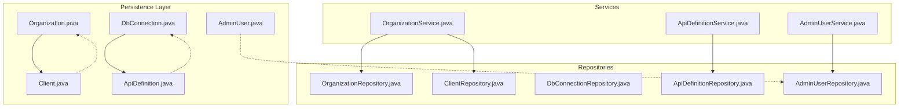
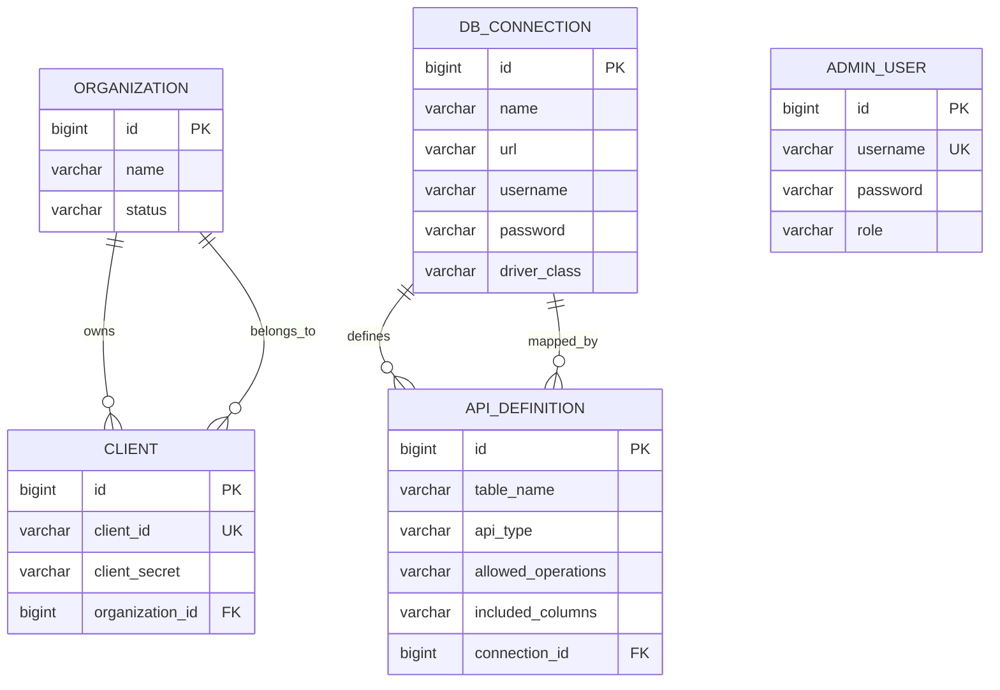
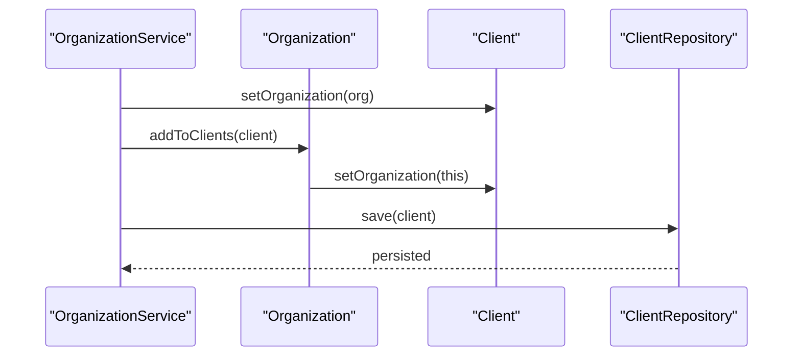
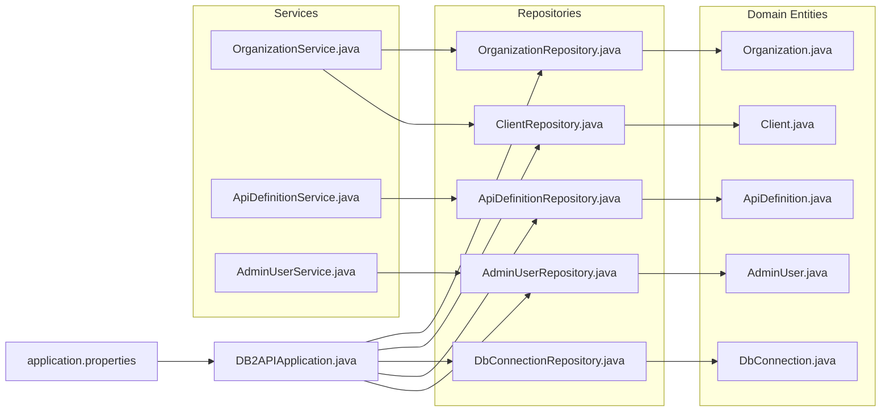

# Entity Relationships

<cite>
**Referenced Files in This Document**
- [Organization.java](file://src/main/java/com/db2api/persistent/organization/Organization.java)
- [Client.java](file://src/main/java/com/db2api/persistent/organization/Client.java)
- [DbConnection.java](file://src/main/java/com/db2api/persistent/connection/DbConnection.java)
- [ApiDefinition.java](file://src/main/java/com/db2api/persistent/api/ApiDefinition.java)
- [AdminUser.java](file://src/main/java/com/db2api/persistent/admin/AdminUser.java)
- [OrganizationRepository.java](file://src/main/java/com/db2api/repository/organization/OrganizationRepository.java)
- [ClientRepository.java](file://src/main/java/com/db2api/repository/organization/ClientRepository.java)
- [DbConnectionRepository.java](file://src/main/java/com/db2api/repository/connection/DbConnectionRepository.java)
- [ApiDefinitionRepository.java](file://src/main/java/com/db2api/repository/api/ApiDefinitionRepository.java)
- [AdminUserRepository.java](file://src/main/java/com/db2api/repository/admin/AdminUserRepository.java)
- [OrganizationService.java](file://src/main/java/com/db2api/service/organization/OrganizationService.java)
- [ApiDefinitionService.java](file://src/main/java/com/db2api/service/api/ApiDefinitionService.java)
- [AdminUserService.java](file://src/main/java/com/db2api/service/admin/AdminUserService.java)
- [DB2APIApplication.java](file://src/main/java/com/db2api/DB2APIApplication.java)
- [application.properties](file://src/main/resources/application.properties)
</cite>

## Table of Contents
1. [Introduction](#introduction)
2. [Project Structure](#project-structure)
3. [Core Components](#core-components)
4. [Architecture Overview](#architecture-overview)
5. [Detailed Component Analysis](#detailed-component-analysis)
6. [Dependency Analysis](#dependency-analysis)
7. [Performance Considerations](#performance-considerations)
8. [Troubleshooting Guide](#troubleshooting-guide)
9. [Conclusion](#conclusion)

## Introduction
This document provides comprehensive entity relationship documentation for DB2API’s JPA entities. It focuses on the domain model centered around Organization, Client, DbConnection, ApiDefinition, and AdminUser. The analysis covers entity annotations, relationship mappings (OneToMany, ManyToOne, OneToOne), cascade types, fetch strategies, multi-tenancy via Organization-Client relationships, and practical usage patterns. Guidance on lazy versus eager loading, lifecycle management, and persistence contexts is included to help developers integrate and extend the model effectively.

## Project Structure
The persistence layer is organized by feature domains:
- organization: Organization and Client entities and repositories/services
- connection: DbConnection entity and repository
- api: ApiDefinition entity and repository
- admin: AdminUser entity and repository

Repositories extend Spring Data JPA’s JpaRepository, enabling declarative CRUD and query methods. Services orchestrate business operations and coordinate persistence.

**Diagram sources**
- [Organization.java:1-65](file://src/main/java/com/db2api/persistent/organization/Organization.java#L1-L65)
- [Client.java:1-43](file://src/main/java/com/db2api/persistent/organization/Client.java#L1-L43)
- [DbConnection.java:1-85](file://src/main/java/com/db2api/persistent/connection/DbConnection.java#L1-L85)
- [ApiDefinition.java:1-57](file://src/main/java/com/db2api/persistent/api/ApiDefinition.java#L1-L57)
- [AdminUser.java:1-43](file://src/main/java/com/db2api/persistent/admin/AdminUser.java#L1-L43)
- [OrganizationRepository.java:1-10](file://src/main/java/com/db2api/repository/organization/OrganizationRepository.java#L1-L10)
- [ClientRepository.java:1-14](file://src/main/java/com/db2api/repository/organization/ClientRepository.java#L1-L14)
- [DbConnectionRepository.java:1-13](file://src/main/java/com/db2api/repository/connection/DbConnectionRepository.java#L1-L13)
- [ApiDefinitionRepository.java:1-22](file://src/main/java/com/db2api/repository/api/ApiDefinitionRepository.java#L1-L22)
- [AdminUserRepository.java:1-23](file://src/main/java/com/db2api/repository/admin/AdminUserRepository.java#L1-L23)
- [OrganizationService.java:1-83](file://src/main/java/com/db2api/service/organization/OrganizationService.java#L1-L83)
- [ApiDefinitionService.java:1-39](file://src/main/java/com/db2api/service/api/ApiDefinitionService.java#L1-L39)
- [AdminUserService.java:1-41](file://src/main/java/com/db2api/service/admin/AdminUserService.java#L1-L41)

**Section sources**
- [DB2APIApplication.java:1-27](file://src/main/java/com/db2api/DB2APIApplication.java#L1-L27)
- [application.properties:1-20](file://src/main/resources/application.properties#L1-L20)

## Core Components
This section documents each entity’s purpose, primary keys, columns, and relationships.

- Organization
  - Purpose: Root tenant container for Client entities and grouping for API access management.
  - Primary key: id (auto-generated identity).
  - Attributes: name, status.
  - Relationships:
    - OneToMany Client: mapped by Client.organization; cascade ALL; orphanRemoval enabled; bidirectional helper methods addToClients/removeFromClients maintain referential integrity.
  - Fetch strategy: Clients collection uses default lazy initialization via JPA/Hibernate.

- Client
  - Purpose: Represents a consuming client application with OAuth2 credentials (clientId, clientSecret).
  - Primary key: id (auto-generated identity).
  - Attributes: clientId (unique), clientSecret.
  - Relationships:
    - ManyToOne Organization: join column organization_id; fetch LAZY; unidirectional from Client perspective; maintained by Organization.clients.
  - Notes: Utility methods in Organization manage bidirectional association.

- DbConnection
  - Purpose: Stores database connection metadata and credentials for external systems.
  - Primary key: id (auto-generated identity).
  - Attributes: name, url, username, password, driverClass.
  - Relationships:
    - OneToMany ApiDefinition: mapped by ApiDefinition.connection; cascade ALL; orphanRemoval enabled; bidirectional helper methods addToApiDefinitions/removeFromApiDefinitions.
  - Fetch strategy: ApiDefinitions collection uses default lazy initialization.

- ApiDefinition
  - Purpose: Maps a database table to dynamic REST or GraphQL endpoints with operation and column inclusion rules.
  - Primary key: id (auto-generated identity).
  - Attributes: tableName, apiType, allowedOperations, includedColumns.
  - Relationships:
    - ManyToOne DbConnection: join column connection_id; fetch LAZY; unidirectional from ApiDefinition perspective; maintained by DbConnection.apiDefinitions.

- AdminUser
  - Purpose: Administrative user for the management UI with role-based access control.
  - Primary key: id (auto-generated identity).
  - Attributes: username (unique), password, role.
  - Relationships: None; standalone administrative account.

**Section sources**
- [Organization.java:1-65](file://src/main/java/com/db2api/persistent/organization/Organization.java#L1-L65)
- [Client.java:1-43](file://src/main/java/com/db2api/persistent/organization/Client.java#L1-L43)
- [DbConnection.java:1-85](file://src/main/java/com/db2api/persistent/connection/DbConnection.java#L1-L85)
- [ApiDefinition.java:1-57](file://src/main/java/com/db2api/persistent/api/ApiDefinition.java#L1-L57)
- [AdminUser.java:1-43](file://src/main/java/com/db2api/persistent/admin/AdminUser.java#L1-L43)

## Architecture Overview
The domain model enforces a multi-tenant structure through Organization and Client. DbConnection encapsulates connectivity and is consumed by ApiDefinition. AdminUser is independent and supports administrative access.

**Diagram sources**
- [Organization.java:1-65](file://src/main/java/com/db2api/persistent/organization/Organization.java#L1-L65)
- [Client.java:1-43](file://src/main/java/com/db2api/persistent/organization/Client.java#L1-L43)
- [DbConnection.java:1-85](file://src/main/java/com/db2api/persistent/connection/DbConnection.java#L1-L85)
- [ApiDefinition.java:1-57](file://src/main/java/com/db2api/persistent/api/ApiDefinition.java#L1-L57)
- [AdminUser.java:1-43](file://src/main/java/com/db2api/persistent/admin/AdminUser.java#L1-L43)

## Detailed Component Analysis

### Multi-Tenancy Pattern via Organization-Client
- Tenancy boundary: Organization acts as the tenant root.
- Client belongs to exactly one Organization (Many-to-One).
- Organization aggregates multiple Clients (One-to-Many).
- Bidirectional maintenance:
  - Organization.addToClients/RemoveFromClients set Client.organization and vice versa.
  - Cascade.ALL ensures saving/removing organizations propagates to clients.
  - Orphan removal keeps collections synchronized.

**Diagram sources**
- [OrganizationService.java:48-63](file://src/main/java/com/db2api/service/organization/OrganizationService.java#L48-L63)
- [Organization.java:50-63](file://src/main/java/com/db2api/persistent/organization/Organization.java#L50-L63)
- [Client.java:39-41](file://src/main/java/com/db2api/persistent/organization/Client.java#L39-L41)

**Section sources**
- [Organization.java:42-63](file://src/main/java/com/db2api/persistent/organization/Organization.java#L42-L63)
- [Client.java:39-41](file://src/main/java/com/db2api/persistent/organization/Client.java#L39-L41)
- [OrganizationService.java:48-63](file://src/main/java/com/db2api/service/organization/OrganizationService.java#L48-L63)

### Relationship Traversal Patterns
- From Organization to Clients:
  - Access via Organization.getClients() when Organization is loaded.
  - Lazy loading: accessing clients outside a transaction may trigger initialization exceptions; load with fetch joins or in a transactional context.
- From Client to Organization:
  - Access via Client.getOrganization() using LAZY fetch; initialize explicitly if needed.
- From DbConnection to ApiDefinition:
  - Access via DbConnection.getApiDefinitions() with cascade and orphan removal managed by helpers.
- From ApiDefinition to DbConnection:
  - Access via ApiDefinition.getConnection() using LAZY fetch.

Practical usage examples (paths):
- Load organization with clients: use a repository method that fetches eagerly or initialize clients within a transactional method.
- Save a new client under an organization: call OrganizationService.saveClient(client, organization) to ensure clientId/clientSecret generation and persistence.
- Find API definition by table and type: use ApiDefinitionService.getApiDefinitionByTableNameAndType(tableName, apiType).

**Section sources**
- [OrganizationService.java:48-63](file://src/main/java/com/db2api/service/organization/OrganizationService.java#L48-L63)
- [ApiDefinitionService.java:23-25](file://src/main/java/com/db2api/service/api/ApiDefinitionService.java#L23-L25)
- [ClientRepository.java:12-12](file://src/main/java/com/db2api/repository/organization/ClientRepository.java#L12-L12)
- [ApiDefinitionRepository.java:20-20](file://src/main/java/com/db2api/repository/api/ApiDefinitionRepository.java#L20-L20)

### Lazy vs Eager Loading Considerations
- Organization.clients: default lazy; traverse inside a persistence context or use fetch joins to avoid LazyInitializationException.
- Client.organization: LAZY fetch; initialize when needed.
- DbConnection.apiDefinitions: default lazy; use helpers addToApiDefinitions/removeFromApiDefinitions to keep state consistent.
- ApiDefinition.connection: LAZY fetch; initialize when serializing or validating.

Recommendations:
- For read-heavy UIs, fetch joins in queries or DTO projections to minimize N+1 selects.
- For write operations, ensure bidirectional setters are invoked (as in Organization.addToClients) to maintain referential integrity.

**Section sources**
- [Organization.java:42-43](file://src/main/java/com/db2api/persistent/organization/Organization.java#L42-L43)
- [Client.java:39-41](file://src/main/java/com/db2api/persistent/organization/Client.java#L39-L41)
- [DbConnection.java:62-63](file://src/main/java/com/db2api/persistent/connection/DbConnection.java#L62-L63)
- [ApiDefinition.java:53-55](file://src/main/java/com/db2api/persistent/api/ApiDefinition.java#L53-L55)

### Entity Lifecycle Management and Persistence Context
- Creation:
  - OrganizationService.createNewOrganization() and createNewClient() instantiate entities.
  - OrganizationService.saveClient generates clientId and encrypted clientSecret when absent.
  - ApiDefinitionService.createNewApiDefinition() and AdminUserService.createNewUser() instantiate entities.
- Persistence:
  - Repositories persist entities via save(); cascades propagate deletes/updates per configured cascade types.
  - Deletion:
    - OrganizationService.deleteOrganization and deleteClient remove entities.
    - ApiDefinitionService.deleteApiDefinition removes definitions.
    - AdminUserService.deleteUser removes admin users.
- Validation and retrieval:
  - ClientRepository.findByClientId and AdminUserRepository.findByUsername provide lookup by unique identifiers.
  - ApiDefinitionRepository.findByTableNameAndApiType enables discovery by table and API type.

Best practices:
- Always set bidirectional associations when creating new relationships (e.g., setOrganization on Client).
- Use services to encapsulate lifecycle operations and ensure consistent state transitions.
- Keep sensitive fields encrypted at rest (e.g., clientSecret, password).

**Section sources**
- [OrganizationService.java:69-81](file://src/main/java/com/db2api/service/organization/OrganizationService.java#L69-L81)
- [ApiDefinitionService.java:35-37](file://src/main/java/com/db2api/service/api/ApiDefinitionService.java#L35-L37)
- [AdminUserService.java:37-40](file://src/main/java/com/db2api/service/admin/AdminUserService.java#L37-L40)
- [ClientRepository.java:12-12](file://src/main/java/com/db2api/repository/organization/ClientRepository.java#L12-L12)
- [AdminUserRepository.java:21-21](file://src/main/java/com/db2api/repository/admin/AdminUserRepository.java#L21-L21)
- [ApiDefinitionRepository.java:20-20](file://src/main/java/com/db2api/repository/api/ApiDefinitionRepository.java#L20-L20)

## Dependency Analysis
Repositories depend on JPA for persistence; services depend on repositories and encryption/security utilities. The application is bootstrapped by Spring Boot.

**Diagram sources**
- [DB2APIApplication.java:1-27](file://src/main/java/com/db2api/DB2APIApplication.java#L1-L27)
- [application.properties:1-20](file://src/main/resources/application.properties#L1-L20)
- [OrganizationRepository.java:1-10](file://src/main/java/com/db2api/repository/organization/OrganizationRepository.java#L1-L10)
- [ClientRepository.java:1-14](file://src/main/java/com/db2api/repository/organization/ClientRepository.java#L1-L14)
- [DbConnectionRepository.java:1-13](file://src/main/java/com/db2api/repository/connection/DbConnectionRepository.java#L1-L13)
- [ApiDefinitionRepository.java:1-22](file://src/main/java/com/db2api/repository/api/ApiDefinitionRepository.java#L1-L22)
- [AdminUserRepository.java:1-23](file://src/main/java/com/db2api/repository/admin/AdminUserRepository.java#L1-L23)
- [OrganizationService.java:1-83](file://src/main/java/com/db2api/service/organization/OrganizationService.java#L1-L83)
- [ApiDefinitionService.java:1-39](file://src/main/java/com/db2api/service/api/ApiDefinitionService.java#L1-L39)
- [AdminUserService.java:1-41](file://src/main/java/com/db2api/service/admin/AdminUserService.java#L1-L41)
- [Organization.java:1-65](file://src/main/java/com/db2api/persistent/organization/Organization.java#L1-L65)
- [Client.java:1-43](file://src/main/java/com/db2api/persistent/organization/Client.java#L1-L43)
- [DbConnection.java:1-85](file://src/main/java/com/db2api/persistent/connection/DbConnection.java#L1-L85)
- [ApiDefinition.java:1-57](file://src/main/java/com/db2api/persistent/api/ApiDefinition.java#L1-L57)
- [AdminUser.java:1-43](file://src/main/java/com/db2api/persistent/admin/AdminUser.java#L1-L43)

**Section sources**
- [DB2APIApplication.java:1-27](file://src/main/java/com/db2api/DB2APIApplication.java#L1-L27)
- [application.properties:1-20](file://src/main/resources/application.properties#L1-L20)

## Performance Considerations
- Fetch strategies:
  - LAZY fetching reduces initial payload but requires careful handling to avoid N+1 selects and LazyInitializationException.
  - Consider fetch joins or batch fetching for read-heavy flows.
- Cascading:
  - Cascade.ALL on OneToMany relationships simplifies persistence but can increase the scope of updates/deletes; use judiciously.
- Indexing:
  - Unique constraints on clientId and username improve lookup performance.
- Encryption overhead:
  - Client secret and admin password encryption adds CPU cost; cache decrypted values only during short-lived operations.

[No sources needed since this section provides general guidance]

## Troubleshooting Guide
Common issues and resolutions:
- LazyInitializationException when traversing Organization.clients or DbConnection.apiDefinitions:
  - Ensure traversal occurs within an active persistence context or use fetch joins.
- Unidirectional ManyToOne without bidirectional setter:
  - Always set the parent reference (e.g., client.setOrganization(org)) to maintain referential integrity.
- Duplicate clientId or username:
  - Unique constraints prevent duplicates; handle optimistic uniqueness violations in service layer.
- Deleting parent without cascade:
  - Confirm cascade types are configured on OneToMany sides to propagate deletions.

**Section sources**
- [Organization.java:42-43](file://src/main/java/com/db2api/persistent/organization/Organization.java#L42-L43)
- [DbConnection.java:62-63](file://src/main/java/com/db2api/persistent/connection/DbConnection.java#L62-L63)
- [ClientRepository.java:12-12](file://src/main/java/com/db2api/repository/organization/ClientRepository.java#L12-L12)
- [AdminUserRepository.java:21-21](file://src/main/java/com/db2api/repository/admin/AdminUserRepository.java#L21-L21)

## Conclusion
The DB2API entity model establishes a clean, multi-tenant domain with explicit relationships among Organization, Client, DbConnection, ApiDefinition, and AdminUser. Bidirectional associations and cascade configurations streamline persistence while maintaining referential integrity. Services encapsulate lifecycle operations and enforce best practices such as credential encryption and consistent association management. By leveraging appropriate fetch strategies and fetch joins, applications can achieve predictable performance and robust behavior across read and write scenarios.