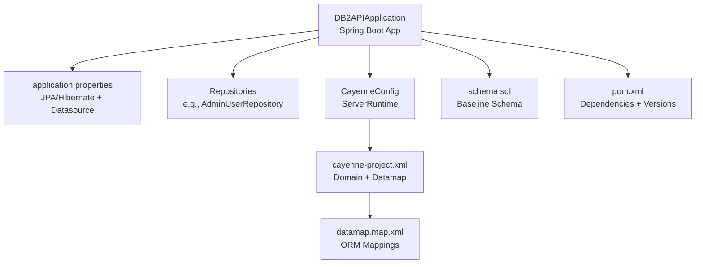
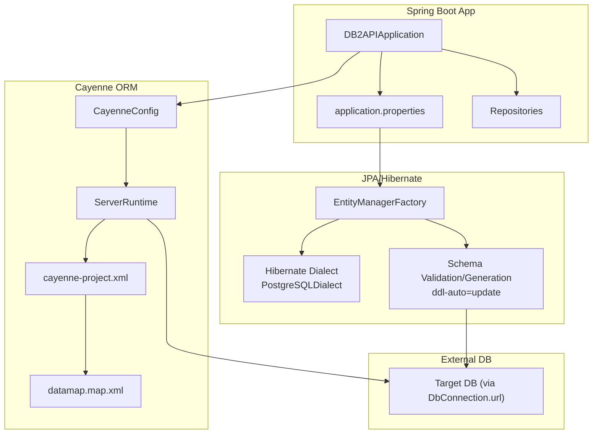
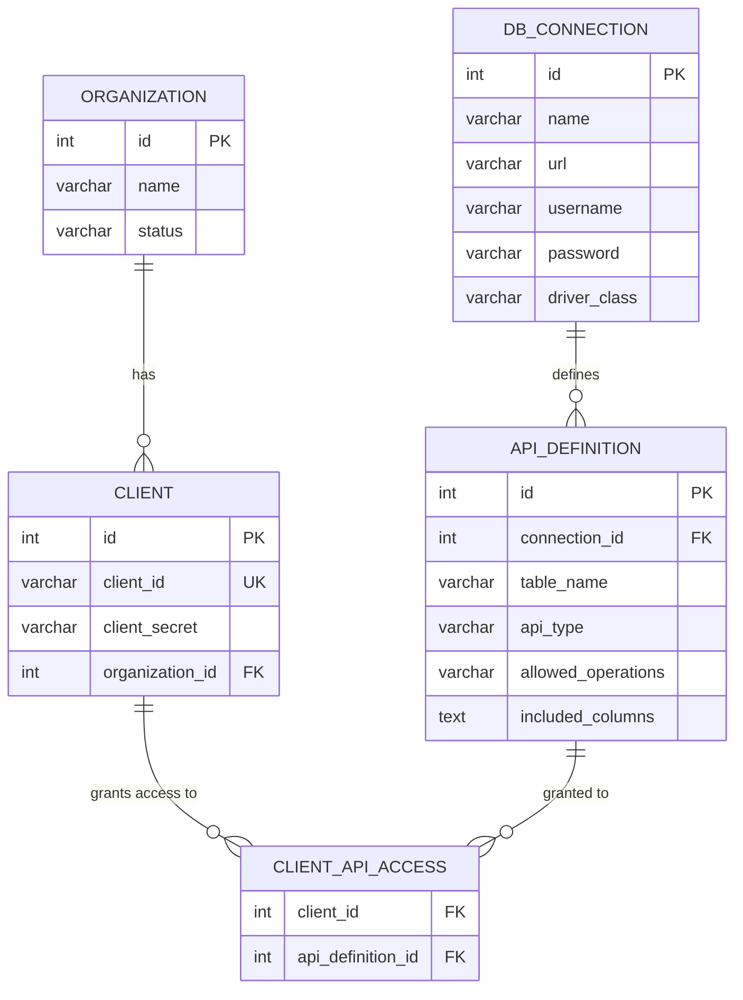
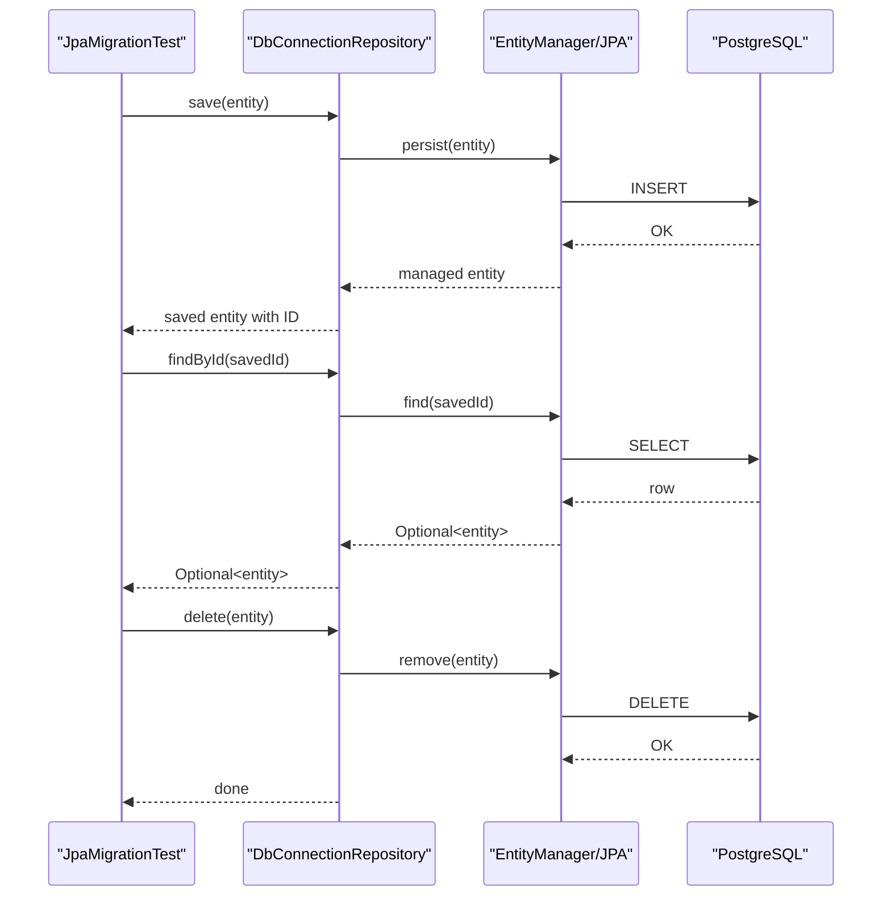
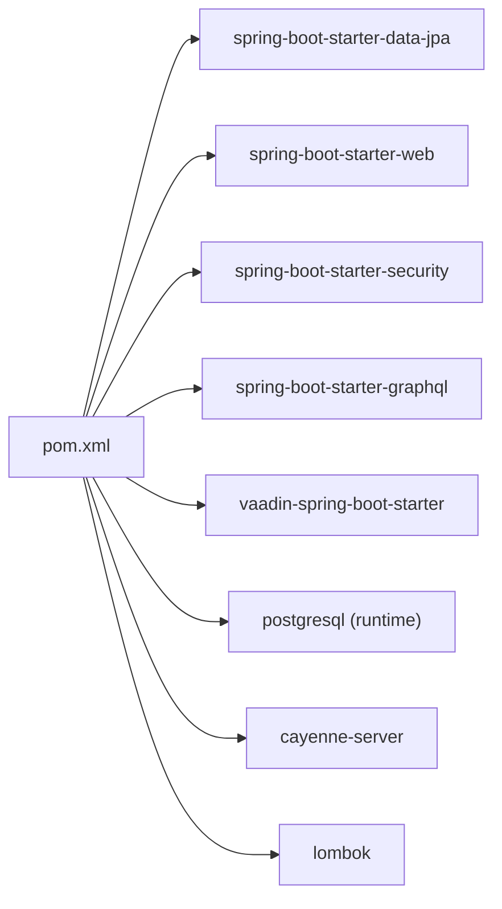

# JPA & Hibernate Configuration

<cite>
**Referenced Files in This Document**
- [application.properties](file://src/main/resources/application.properties)
- [CayenneConfig.java](file://src/main/java/com/db2api/config/CayenneConfig.java)
- [cayenne-project.xml](file://src/main/resources/cayenne-project.xml)
- [datamap.map.xml](file://src/main/resources/datamap.map.xml)
- [pom.xml](file://pom.xml)
- [DB2APIApplication.java](file://src/main/java/com/db2api/DB2APIApplication.java)
- [AdminUser.java](file://src/main/java/com/db2api/persistent/admin/AdminUser.java)
- [ApiDefinition.java](file://src/main/java/com/db2api/persistent/api/ApiDefinition.java)
- [DbConnection.java](file://src/main/java/com/db2api/persistent/connection/DbConnection.java)
- [Client.java](file://src/main/java/com/db2api/persistent/organization/Client.java)
- [AdminUserRepository.java](file://src/main/java/com/db2api/repository/admin/AdminUserRepository.java)
- [schema.sql](file://src/main/resources/schema.sql)
- [JpaMigrationTest.java](file://src/test/java/com/db2api/migration/JpaMigrationTest.java)
</cite>

## Table of Contents
1. [Introduction](#introduction)
2. [Project Structure](#project-structure)
3. [Core Components](#core-components)
4. [Architecture Overview](#architecture-overview)
5. [Detailed Component Analysis](#detailed-component-analysis)
6. [Dependency Analysis](#dependency-analysis)
7. [Performance Considerations](#performance-considerations)
8. [Troubleshooting Guide](#troubleshooting-guide)
9. [Conclusion](#conclusion)
10. [Appendices](#appendices)

## Introduction
This document explains the JPA and Hibernate configuration used by DB2API, including database connection settings, JPA/Hibernate properties, dialect selection, and connection pooling. It also documents the integration with Apache Cayenne ORM, object-relational mapping, entity scanning, caching strategies, performance tuning, schema generation and validation, and migration strategies. Practical customization examples and environment-specific guidance are included, along with troubleshooting tips.

## Project Structure
DB2API is a Spring Boot application that integrates:
- Spring Data JPA for ORM and persistence
- PostgreSQL as the primary database for system metadata
- Apache Cayenne for dynamic runtime interactions against external databases
- Vaadin UI and Spring Security for the web layer

Key configuration locations:
- Application properties for JPA/Hibernate and datasource settings
- Maven POM for dependency management and versions
- Cayenne configuration XMLs for mapping and runtime setup
- SQL schema for baseline database structure
- Entities and repositories under the persistent package

**Diagram sources**
- [DB2APIApplication.java:13-24](file://src/main/java/com/db2api/DB2APIApplication.java#L13-L24)
- [application.properties:6-16](file://src/main/resources/application.properties#L6-L16)
- [CayenneConfig.java:21-27](file://src/main/java/com/db2api/config/CayenneConfig.java#L21-L27)
- [cayenne-project.xml:1-5](file://src/main/resources/cayenne-project.xml#L1-L5)
- [datamap.map.xml:1-83](file://src/main/resources/datamap.map.xml#L1-L83)
- [schema.sql:1-45](file://src/main/resources/schema.sql#L1-L45)
- [pom.xml:25-98](file://pom.xml#L25-L98)

**Section sources**
- [DB2APIApplication.java:13-24](file://src/main/java/com/db2api/DB2APIApplication.java#L13-L24)
- [application.properties:6-16](file://src/main/resources/application.properties#L6-L16)
- [pom.xml:25-98](file://pom.xml#L25-L98)

## Core Components
- Database connection and driver: configured via datasource properties for PostgreSQL
- JPA/Hibernate: enabled via Spring Boot starter, with Hibernate dialect set to PostgreSQL
- Entity scanning: automatic via Spring Boot’s @SpringBootApplication; entities under com.db2api.persistent
- Apache Cayenne: configured via a dedicated configuration class and XML datamap
- Schema baseline: provided by schema.sql for initial setup

Key configuration anchors:
- Datasource URL, username, password, driver class
- JPA database, show-sql, ddl-auto, Hibernate dialect
- Cayenne ServerRuntime bean and datamap configuration

**Section sources**
- [application.properties:6-16](file://src/main/resources/application.properties#L6-L16)
- [DB2APIApplication.java:13-24](file://src/main/java/com/db2api/DB2APIApplication.java#L13-L24)
- [CayenneConfig.java:21-27](file://src/main/java/com/db2api/config/CayenneConfig.java#L21-L27)
- [cayenne-project.xml:1-5](file://src/main/resources/cayenne-project.xml#L1-L5)
- [datamap.map.xml:6](file://src/main/resources/datamap.map.xml#L6)
- [schema.sql:1-45](file://src/main/resources/schema.sql#L1-L45)

## Architecture Overview
The persistence stack combines Spring Data JPA for system metadata with Apache Cayenne for dynamic runtime interactions against external databases. The application scans entities automatically and applies schema generation/validation according to JPA properties.

**Diagram sources**
- [application.properties:6-16](file://src/main/resources/application.properties#L6-L16)
- [CayenneConfig.java:21-27](file://src/main/java/com/db2api/config/CayenneConfig.java#L21-L27)
- [cayenne-project.xml:1-5](file://src/main/resources/cayenne-project.xml#L1-L5)
- [datamap.map.xml:1-83](file://src/main/resources/datamap.map.xml#L1-L83)

## Detailed Component Analysis

### JPA and Hibernate Configuration
- Datasource: PostgreSQL configured with URL, username, password, and driver class
- JPA: database property set to POSTGRESQL; show-sql enabled; ddl-auto set to update
- Hibernate: dialect explicitly set to PostgreSQLDialect
- Entity scanning: automatic under the default package scanned by Spring Boot

Practical customization examples:
- To switch to another database, change the datasource URL and driver class, and set spring.jpa.database accordingly. Also update the Hibernate dialect property to match the target database.
- To disable DDL auto-generation in production, set ddl-auto to none and manage schema via migrations.
- To enable SQL logging in development, keep show-sql enabled; for production, disable it to reduce overhead.

Environment-specific settings:
- Use Spring profiles to externalize environment-specific properties (e.g., dev vs prod). Keep sensitive credentials in environment variables or secrets managers and reference them in application.properties.

Validation and schema generation:
- With ddl-auto=update, Hibernate will attempt to alter existing schema to match entity definitions. Use none in production and rely on explicit migrations.
- The baseline schema is provided by schema.sql for initial setup.

**Section sources**
- [application.properties:6-16](file://src/main/resources/application.properties#L6-L16)
- [DB2APIApplication.java:13-24](file://src/main/java/com/db2api/DB2APIApplication.java#L13-L24)
- [schema.sql:1-45](file://src/main/resources/schema.sql#L1-L45)

### Apache Cayenne ORM Integration
- ServerRuntime bean is created programmatically and wired with the primary DataSource
- Domain configuration references a datamap
- Datamap defines defaultPackage and maps database entities to Java classes, including relationships

Object-relational mapping:
- Default package for generated classes is set in the datamap
- Each db-entity maps to an obj-entity with attribute paths
- Relationships are defined at both db and obj levels

Entity scanning patterns:
- Entities are located under com.db2api.persistent; Cayenne datamap targets this package for generated classes

Connection pooling:
- The current configuration relies on Spring-managed DataSource; no explicit HikariCP or other pool settings are present in the repository. Consider adding pool settings in application.properties if needed.

**Section sources**
- [CayenneConfig.java:21-27](file://src/main/java/com/db2api/config/CayenneConfig.java#L21-L27)
- [cayenne-project.xml:1-5](file://src/main/resources/cayenne-project.xml#L1-L5)
- [datamap.map.xml:6-82](file://src/main/resources/datamap.map.xml#L6-L82)

### Entities and Repositories
- Entities define JPA annotations (@Entity, @Table, @Id, @GeneratedValue, @Column, @ManyToOne, @ManyToMany) and Lombok getters/setters
- Repositories extend Spring Data JPA interfaces to provide CRUD and derived query capabilities

Example entity relationships:
- ApiDefinition belongs to DbConnection (many-to-one)
- Client belongs to Organization (many-to-one)
- Many-to-many relationship between Client and ApiDefinition via join table

**Diagram sources**
- [schema.sql:1-45](file://src/main/resources/schema.sql#L1-L45)
- [AdminUser.java:12-42](file://src/main/java/com/db2api/persistent/admin/AdminUser.java#L12-L42)
- [ApiDefinition.java:17-66](file://src/main/java/com/db2api/persistent/api/ApiDefinition.java#L17-L66)
- [DbConnection.java:16-84](file://src/main/java/com/db2api/persistent/connection/DbConnection.java#L16-L84)
- [Client.java:15-57](file://src/main/java/com/db2api/persistent/organization/Client.java#L15-L57)

**Section sources**
- [AdminUser.java:12-42](file://src/main/java/com/db2api/persistent/admin/AdminUser.java#L12-L42)
- [ApiDefinition.java:17-66](file://src/main/java/com/db2api/persistent/api/ApiDefinition.java#L17-L66)
- [DbConnection.java:16-84](file://src/main/java/com/db2api/persistent/connection/DbConnection.java#L16-L84)
- [Client.java:15-57](file://src/main/java/com/db2api/persistent/organization/Client.java#L15-L57)
- [AdminUserRepository.java:12-22](file://src/main/java/com/db2api/repository/admin/AdminUserRepository.java#L12-L22)

### Sequence: Repository CRUD Flow

**Diagram sources**
- [JpaMigrationTest.java:19-49](file://src/test/java/com/db2api/migration/JpaMigrationTest.java#L19-L49)
- [DbConnection.java:16-84](file://src/main/java/com/db2api/persistent/connection/DbConnection.java#L16-L84)

## Dependency Analysis
- Spring Boot starters provide JPA/Hibernate and web/security stacks
- PostgreSQL JDBC driver is included for runtime
- Apache Cayenne server is included for ORM
- Lombok is used for boilerplate reduction

**Diagram sources**
- [pom.xml:25-98](file://pom.xml#L25-L98)

**Section sources**
- [pom.xml:25-98](file://pom.xml#L25-L98)

## Performance Considerations
- Logging: keep show-sql disabled in production to avoid SQL logging overhead
- DDL: use none and manage schema via migrations; update can cause downtime and data risks
- Fetch strategies: entities use lazy loading by default; review fetch types for performance-sensitive queries
- Indexes: add database indexes for frequently filtered columns (e.g., usernames, client_id)
- Connection pooling: consider configuring HikariCP pool size and timeouts in application.properties if experiencing connection bottlenecks
- Caching: enable second-level cache and query cache judiciously; monitor hit rates and tune regions

[No sources needed since this section provides general guidance]

## Troubleshooting Guide
Common configuration issues and resolutions:
- Wrong dialect or database mismatch: Ensure spring.jpa.database matches the actual database and the Hibernate dialect is correct
- Schema drift: With ddl-auto=update, unexpected schema changes can occur; switch to none and use migrations
- Missing driver: Ensure the JDBC driver is on the classpath and the driver class name matches the actual driver
- Entity scan failures: Confirm entities are under the package scanned by Spring Boot or explicitly specify base packages
- Cayenne mapping errors: Verify datamap.defaultPackage and db-entity/object-entity mappings align with actual table/column names
- Repository tests failing: Ensure test database is initialized and schema.sql is applied before running tests

**Section sources**
- [application.properties:6-16](file://src/main/resources/application.properties#L6-L16)
- [schema.sql:1-45](file://src/main/resources/schema.sql#L1-L45)
- [datamap.map.xml:6-82](file://src/main/resources/datamap.map.xml#L6-L82)
- [JpaMigrationTest.java:19-49](file://src/test/java/com/db2api/migration/JpaMigrationTest.java#L19-L49)

## Conclusion
DB2API uses Spring Data JPA with PostgreSQL for system metadata and Apache Cayenne for dynamic runtime interactions. The configuration is straightforward: datasource and JPA/Hibernate properties are defined in application.properties, entities are auto-scanned, and schema generation is controlled via ddl-auto. For production, disable DDL auto-generation, externalize environment-specific settings, and manage schema via migrations. Consider enabling connection pooling and cautious caching strategies to optimize performance.

[No sources needed since this section summarizes without analyzing specific files]

## Appendices

### Appendix A: Environment-Specific Settings
- Use Spring profiles to separate dev/prod configurations
- Externalize secrets and URLs via environment variables or a secrets manager
- Example placeholders:
  - spring.datasource.url=${DB_URL}
  - spring.datasource.username=${DB_USER}
  - spring.datasource.password=${DB_PASS}

[No sources needed since this section provides general guidance]

### Appendix B: Migration Strategies
- Baseline schema: apply schema.sql during initial deployment
- Subsequent changes: use a migration tool (e.g., Flyway or Liquibase) with ddl-auto=none
- Testing: run repository tests against an embedded database or a dedicated test schema

**Section sources**
- [schema.sql:1-45](file://src/main/resources/schema.sql#L1-L45)
- [JpaMigrationTest.java:19-49](file://src/test/java/com/db2api/migration/JpaMigrationTest.java#L19-L49)