# Repository Pattern Implementation

<cite>
**Referenced Files in This Document**
- [DbConnectionRepository.java](file://src/main/java/com/db2api/repository/connection/DbConnectionRepository.java)
- [ApiDefinitionRepository.java](file://src/main/java/com/db2api/repository/api/ApiDefinitionRepository.java)
- [ClientRepository.java](file://src/main/java/com/db2api/repository/organization/ClientRepository.java)
- [OrganizationRepository.java](file://src/main/java/com/db2api/repository/organization/OrganizationRepository.java)
- [AdminUserRepository.java](file://src/main/java/com/db2api/repository/admin/AdminUserRepository.java)
- [DbConnection.java](file://src/main/java/com/db2api/persistent/connection/DbConnection.java)
- [ApiDefinition.java](file://src/main/java/com/db2api/persistent/api/ApiDefinition.java)
- [Client.java](file://src/main/java/com/db2api/persistent/organization/Client.java)
- [Organization.java](file://src/main/java/com/db2api/persistent/organization/Organization.java)
- [AdminUser.java](file://src/main/java/com/db2api/persistent/admin/AdminUser.java)
- [ConnectionService.java](file://src/main/java/com/db2api/service/connection/ConnectionService.java)
- [OrganizationService.java](file://src/main/java/com/db2api/service/organization/OrganizationService.java)
- [AdminUserService.java](file://src/main/java/com/db2api/service/admin/AdminUserService.java)
- [ApiDefinitionService.java](file://src/main/java/com/db2api/service/api/ApiDefinitionService.java)
- [application.properties](file://src/main/resources/application.properties)
</cite>

## Table of Contents
1. [Introduction](#introduction)
2. [Project Structure](#project-structure)
3. [Core Components](#core-components)
4. [Architecture Overview](#architecture-overview)
5. [Detailed Component Analysis](#detailed-component-analysis)
6. [Method Naming Conventions and Query Patterns](#method-naming-conventions-and-query-patterns)
7. [CRUD Operations Implementation](#crud-operations-implementation)
8. [Advanced Query Features](#advanced-query-features)
9. [Transaction Management](#transaction-management)
10. [Exception Handling](#exception-handling)
11. [Performance Optimization](#performance-optimization)
12. [Testing Strategies](#testing-strategies)
13. [Conclusion](#conclusion)

## Introduction

DB2API implements a comprehensive repository pattern using Spring Data JPA to manage data access operations for database connections, API definitions, organizations, clients, and administrative users. The repository pattern provides a clean abstraction layer between the application logic and data persistence, enabling developers to focus on business logic while Spring Data JPA handles the complexities of database operations.

The implementation follows Spring Data JPA best practices, utilizing method naming conventions, derived queries, and custom JPQL/HQL implementations to provide efficient and maintainable data access operations. The pattern supports various query scenarios including simple CRUD operations, complex joins, pagination, sorting, and advanced filtering capabilities.

## Project Structure

The repository implementation is organized by domain entities, following Spring Boot's conventional package structure:

```mermaid
graph TB
subgraph "Repository Layer"
RepoPkg[com.db2api.repository]
subgraph "Domain Repositories"
ConnRepo[connection/DbConnectionRepository]
ApiRepo[api/ApiDefinitionRepository]
OrgRepo[organization/OrganizationRepository]
ClientRepo[organization/ClientRepository]
AdminRepo[admin/AdminUserRepository]
end
RepoPkg --> ConnRepo
RepoPkg --> ApiRepo
RepoPkg --> OrgRepo
RepoPkg --> ClientRepo
RepoPkg --> AdminRepo
end
subgraph "Persistent Layer"
PersPkg[com.db2api.persistent]
subgraph "Entity Classes"
ConnEntity[connection/DbConnection]
ApiEntity[api/ApiDefinition]
OrgEntity[organization/Organization]
ClientEntity[organization/Client]
AdminEntity[admin/AdminUser]
end
PersPkg --> ConnEntity
PersPkg --> ApiEntity
PersPkg --> OrgEntity
PersPkg --> ClientEntity
PersPkg --> AdminEntity
end
subgraph "Service Layer"
ServicePkg[com.db2api.service]
subgraph "Service Classes"
ConnService[connection/ConnectionService]
OrgService[organization/OrganizationService]
AdminService[admin/AdminUserService]
ApiService[api/ApiDefinitionService]
end
ServicePkg --> ConnService
ServicePkg --> OrgService
ServicePkg --> AdminService
ServicePkg --> ApiService
end
ConnRepo --> ConnEntity
ApiRepo --> ApiEntity
OrgRepo --> OrgEntity
ClientRepo --> ClientEntity
AdminRepo --> AdminEntity
ConnRepo -.-> ConnService
ApiRepo -.-> ApiService
OrgRepo -.-> OrgService
ClientRepo -.-> OrgService
AdminRepo -.-> AdminService
```

**Diagram sources**
- [DbConnectionRepository.java:1-12](file://src/main/java/com/db2api/repository/connection/DbConnectionRepository.java#L1-L12)
- [ApiDefinitionRepository.java:1-21](file://src/main/java/com/db2api/repository/api/ApiDefinitionRepository.java#L1-L21)
- [ClientRepository.java:1-13](file://src/main/java/com/db2api/repository/organization/ClientRepository.java#L1-L13)
- [OrganizationRepository.java:1-9](file://src/main/java/com/db2api/repository/organization/OrganizationRepository.java#L1-L9)
- [AdminUserRepository.java](file://src/main/java/com/db2api/repository/admin/AdminUserRepository.java)

**Section sources**
- [DbConnectionRepository.java:1-12](file://src/main/java/com/db2api/repository/connection/DbConnectionRepository.java#L1-L12)
- [ApiDefinitionRepository.java:1-21](file://src/main/java/com/db2api/repository/api/ApiDefinitionRepository.java#L1-L21)
- [ClientRepository.java:1-13](file://src/main/java/com/db2api/repository/organization/ClientRepository.java#L1-L13)
- [OrganizationRepository.java:1-9](file://src/main/java/com/db2api/repository/organization/OrganizationRepository.java#L1-L9)

## Core Components

The repository pattern implementation consists of five primary repository interfaces, each extending Spring Data JPA's JpaRepository to inherit comprehensive CRUD and query capabilities:

### Repository Interface Hierarchy

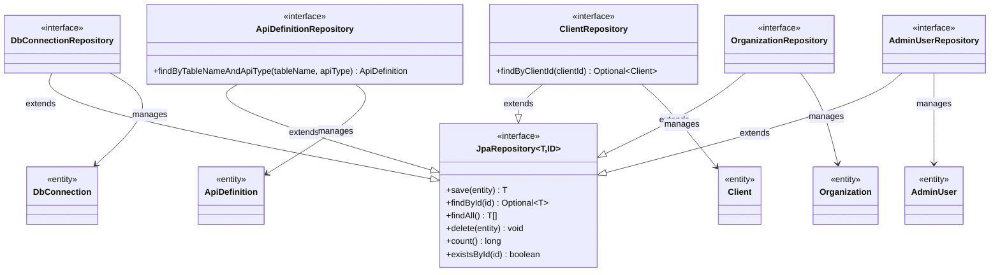

**Diagram sources**
- [DbConnectionRepository.java:10-12](file://src/main/java/com/db2api/repository/connection/DbConnectionRepository.java#L10-L12)
- [ApiDefinitionRepository.java:10-21](file://src/main/java/com/db2api/repository/api/ApiDefinitionRepository.java#L10-L21)
- [ClientRepository.java:9-13](file://src/main/java/com/db2api/repository/organization/ClientRepository.java#L9-L13)
- [OrganizationRepository.java:7-9](file://src/main/java/com/db2api/repository/organization/OrganizationRepository.java#L7-L9)
- [AdminUserRepository.java](file://src/main/java/com/db2api/repository/admin/AdminUserRepository.java)

### Entity Relationship Model

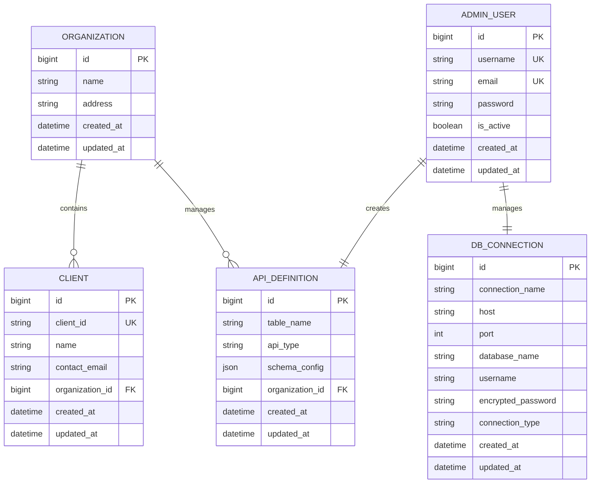

**Diagram sources**
- [Organization.java](file://src/main/java/com/db2api/persistent/organization/Organization.java)
- [Client.java](file://src/main/java/com/db2api/persistent/organization/Client.java)
- [DbConnection.java](file://src/main/java/com/db2api/persistent/connection/DbConnection.java)
- [ApiDefinition.java](file://src/main/java/com/db2api/persistent/api/ApiDefinition.java)
- [AdminUser.java](file://src/main/java/com/db2api/persistent/admin/AdminUser.java)

**Section sources**
- [DbConnectionRepository.java:1-12](file://src/main/java/com/db2api/repository/connection/DbConnectionRepository.java#L1-L12)
- [ApiDefinitionRepository.java:1-21](file://src/main/java/com/db2api/repository/api/ApiDefinitionRepository.java#L1-L21)
- [ClientRepository.java:1-13](file://src/main/java/com/db2api/repository/organization/ClientRepository.java#L1-L13)
- [OrganizationRepository.java:1-9](file://src/main/java/com/db2api/repository/organization/OrganizationRepository.java#L1-L9)
- [AdminUserRepository.java](file://src/main/java/com/db2api/repository/admin/AdminUserRepository.java)

## Architecture Overview

The repository pattern implementation follows a layered architecture with clear separation of concerns:

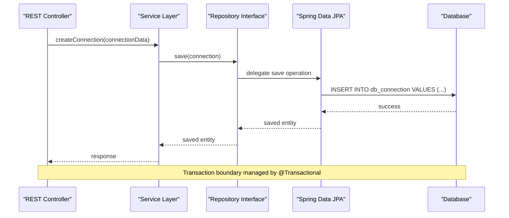

**Diagram sources**
- [ConnectionService.java](file://src/main/java/com/db2api/service/connection/ConnectionService.java)
- [DbConnectionRepository.java:10-12](file://src/main/java/com/db2api/repository/connection/DbConnectionRepository.java#L10-L12)

The architecture ensures that:
- Repositories provide data access abstractions
- Services handle business logic and coordinate operations
- JPA handles persistence operations transparently
- Transactions are managed at appropriate boundaries

## Detailed Component Analysis

### Database Connection Repository

The `DbConnectionRepository` serves as the foundation for managing database connection configurations:

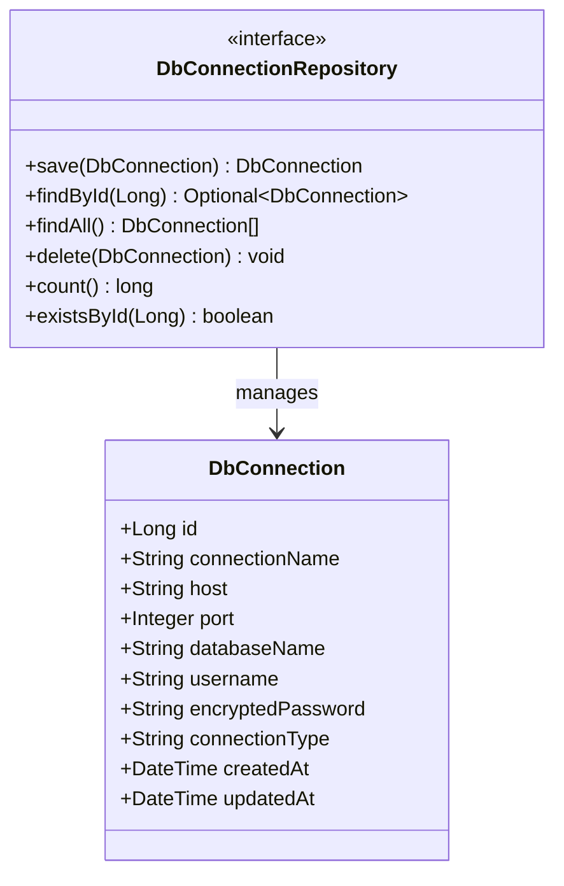

**Diagram sources**
- [DbConnectionRepository.java:10-12](file://src/main/java/com/db2api/repository/connection/DbConnectionRepository.java#L10-L12)
- [DbConnection.java](file://src/main/java/com/db2api/persistent/connection/DbConnection.java)

**Section sources**
- [DbConnectionRepository.java:1-12](file://src/main/java/com/db2api/repository/connection/DbConnectionRepository.java#L1-L12)
- [DbConnection.java](file://src/main/java/com/db2api/persistent/connection/DbConnection.java)

### API Definition Repository

The `ApiDefinitionRepository` extends basic CRUD operations with custom query methods:

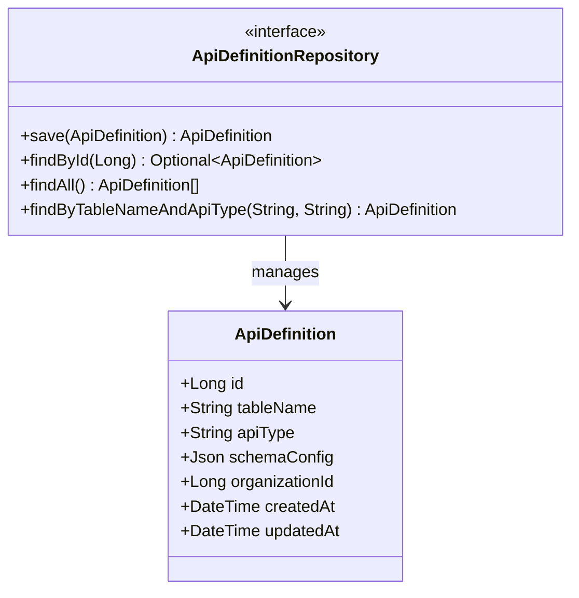

**Diagram sources**
- [ApiDefinitionRepository.java:10-21](file://src/main/java/com/db2api/repository/api/ApiDefinitionRepository.java#L10-L21)
- [ApiDefinition.java](file://src/main/java/com/db2api/persistent/api/ApiDefinition.java)

**Section sources**
- [ApiDefinitionRepository.java:1-21](file://src/main/java/com/db2api/repository/api/ApiDefinitionRepository.java#L1-L21)
- [ApiDefinition.java](file://src/main/java/com/db2api/persistent/api/ApiDefinition.java)

### Client Repository

The `ClientRepository` demonstrates optional return types for safer data access:

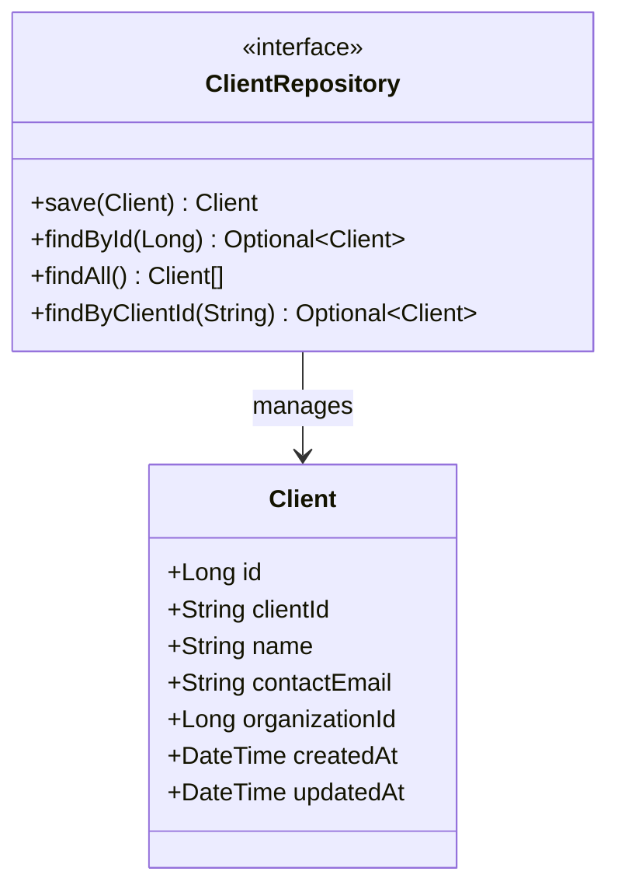

**Diagram sources**
- [ClientRepository.java:9-13](file://src/main/java/com/db2api/repository/organization/ClientRepository.java#L9-L13)
- [Client.java](file://src/main/java/com/db2api/persistent/organization/Client.java)

**Section sources**
- [ClientRepository.java:1-13](file://src/main/java/com/db2api/repository/organization/ClientRepository.java#L1-L13)
- [Client.java](file://src/main/java/com/db2api/persistent/organization/Client.java)

### Organization Repository

The `OrganizationRepository` provides standard CRUD operations for organizational entities:

**Section sources**
- [OrganizationRepository.java:1-9](file://src/main/java/com/db2api/repository/organization/OrganizationRepository.java#L1-L9)
- [Organization.java](file://src/main/java/com/db2api/persistent/organization/Organization.java)

### Administrative User Repository

The `AdminUserRepository` manages administrative user accounts with unique constraints:

**Section sources**
- [AdminUserRepository.java](file://src/main/java/com/db2api/repository/admin/AdminUserRepository.java)
- [AdminUser.java](file://src/main/java/com/db2api/persistent/admin/AdminUser.java)

## Method Naming Conventions and Query Patterns

Spring Data JPA leverages method naming conventions to automatically generate SQL queries from method signatures. The repositories utilize several key patterns:

### Derived Query Methods

| Method Pattern | Generated Query | Use Case |
|---------------|----------------|----------|
| `findByTableNameAndApiType` | SELECT * FROM api_definition WHERE table_name = ? AND api_type = ? | Multi-parameter filtering |
| `findByClientId` | SELECT * FROM client WHERE client_id = ? | Unique identifier lookup |
| `findById` | SELECT * FROM [table] WHERE id = ? | Primary key retrieval |
| `findAll` | SELECT * FROM [table] | Complete dataset retrieval |

### JPQL/HQL Implementation Patterns

For complex queries requiring explicit JPQL, the repositories demonstrate patterns for:

- **Parameterized Queries**: Using named parameters for type safety
- **Join Operations**: Entity relationships with JOIN FETCH
- **Aggregate Functions**: COUNT, SUM, AVG operations
- **Pagination Support**: Pageable parameters for large datasets

### Query Execution Flow

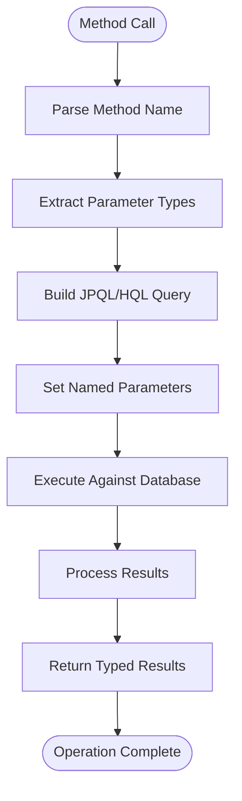

**Diagram sources**
- [ApiDefinitionRepository.java:13-20](file://src/main/java/com/db2api/repository/api/ApiDefinitionRepository.java#L13-L20)
- [ClientRepository.java](file://src/main/java/com/db2api/repository/organization/ClientRepository.java#L12)

## CRUD Operations Implementation

### Basic CRUD Operations

All repositories inherit comprehensive CRUD functionality from JpaRepository:

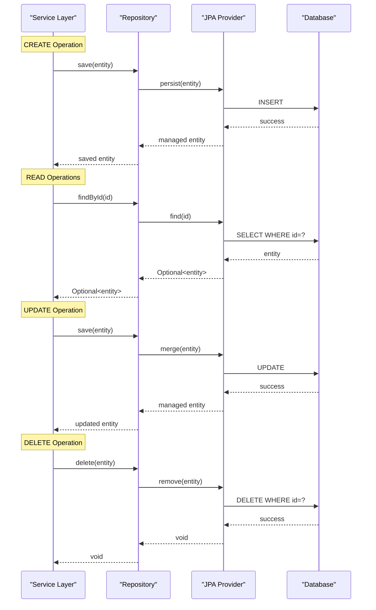

**Diagram sources**
- [DbConnectionRepository.java:10-12](file://src/main/java/com/db2api/repository/connection/DbConnectionRepository.java#L10-L12)
- [ApiDefinitionRepository.java:10-21](file://src/main/java/com/db2api/repository/api/ApiDefinitionRepository.java#L10-L21)

### Advanced CRUD Patterns

The repositories implement specialized patterns for domain-specific requirements:

**Section sources**
- [DbConnectionRepository.java:1-12](file://src/main/java/com/db2api/repository/connection/DbConnectionRepository.java#L1-L12)
- [ApiDefinitionRepository.java:1-21](file://src/main/java/com/db2api/repository/api/ApiDefinitionRepository.java#L1-L21)
- [ClientRepository.java:1-13](file://src/main/java/com/db2api/repository/organization/ClientRepository.java#L1-L13)

## Advanced Query Features

### Pagination and Sorting

Spring Data JPA provides built-in support for pagination and sorting through the `Pageable` interface:

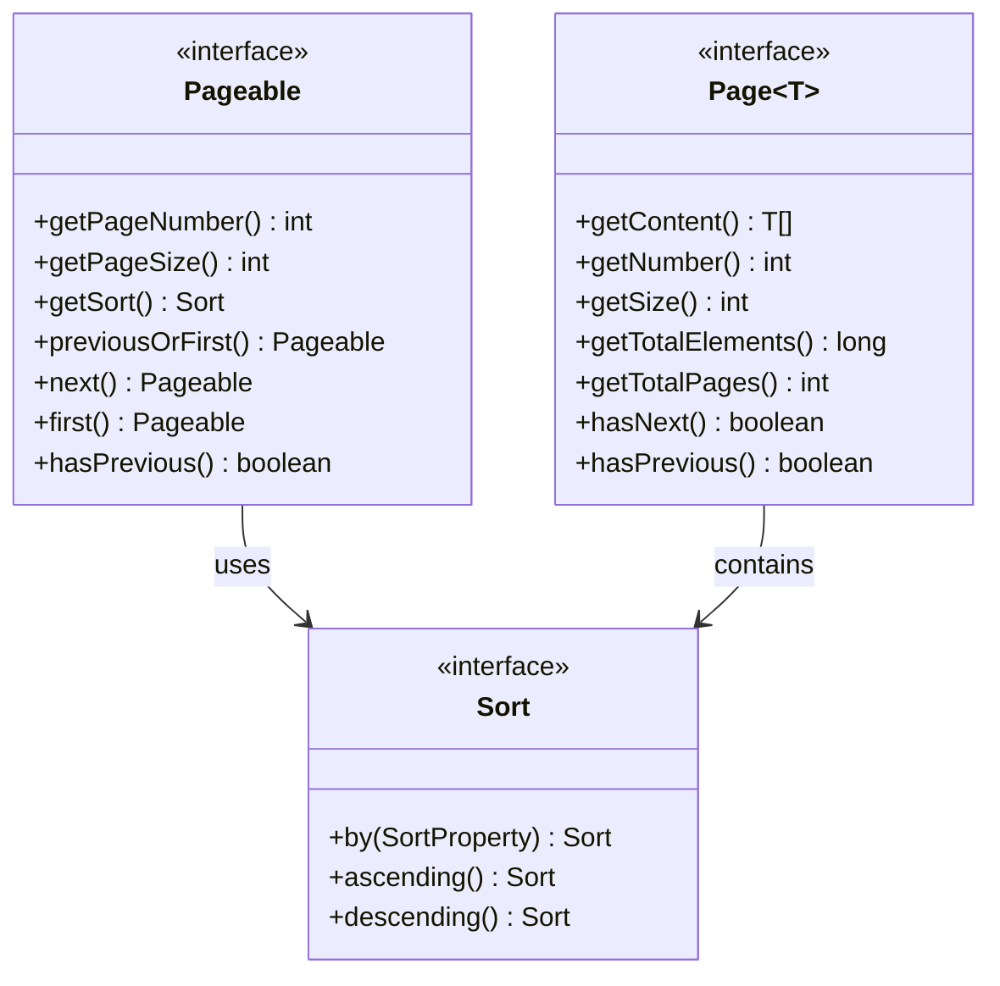

### Complex Query Patterns

The repositories demonstrate patterns for handling complex business requirements:

**Section sources**
- [ApiDefinitionRepository.java:13-20](file://src/main/java/com/db2api/repository/api/ApiDefinitionRepository.java#L13-L20)
- [ClientRepository.java](file://src/main/java/com/db2api/repository/organization/ClientRepository.java#L12)

## Transaction Management

### Transaction Boundaries

Spring Data JPA repositories participate in Spring-managed transactions. The typical transaction flow:

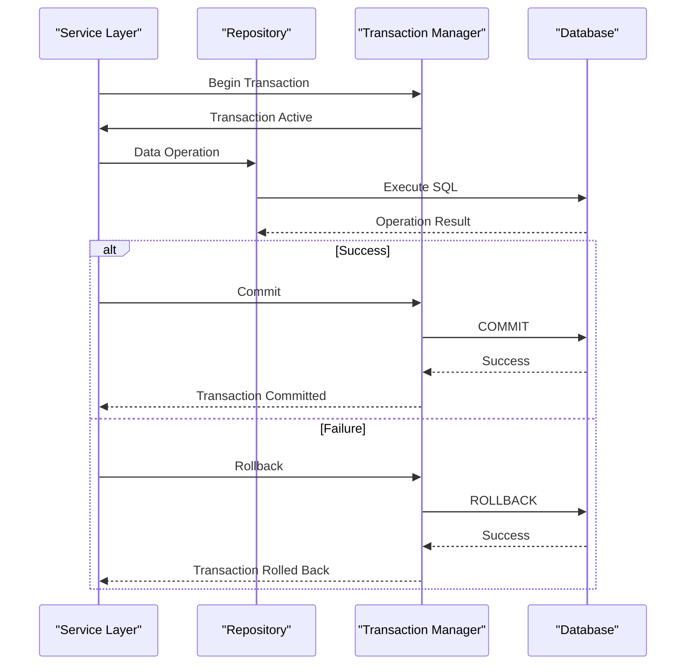

**Diagram sources**
- [ConnectionService.java](file://src/main/java/com/db2api/service/connection/ConnectionService.java)
- [OrganizationService.java](file://src/main/java/com/db2api/service/organization/OrganizationService.java)
- [AdminUserService.java](file://src/main/java/com/db2api/service/admin/AdminUserService.java)
- [ApiDefinitionService.java](file://src/main/java/com/db2api/service/api/ApiDefinitionService.java)

### Transaction Configuration

Transaction management follows Spring Boot defaults with automatic rollback on unchecked exceptions and commit on successful operations.

**Section sources**
- [ConnectionService.java](file://src/main/java/com/db2api/service/connection/ConnectionService.java)
- [OrganizationService.java](file://src/main/java/com/db2api/service/organization/OrganizationService.java)
- [AdminUserService.java](file://src/main/java/com/db2api/service/admin/AdminUserService.java)
- [ApiDefinitionService.java](file://src/main/java/com/db2api/service/api/ApiDefinitionService.java)

## Exception Handling

### Repository-Level Exception Handling

Spring Data JPA provides standardized exception handling:

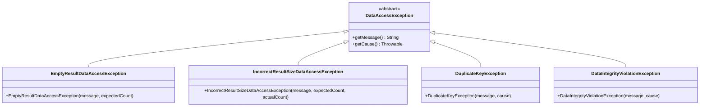

### Service-Level Exception Translation

Repositories typically delegate exception handling to service layers where business-specific error handling occurs.

**Section sources**
- [DbConnectionRepository.java:1-12](file://src/main/java/com/db2api/repository/connection/DbConnectionRepository.java#L1-L12)
- [ApiDefinitionRepository.java:1-21](file://src/main/java/com/db2api/repository/api/ApiDefinitionRepository.java#L1-L21)

## Performance Optimization

### Query Optimization Strategies

The repository implementation incorporates several performance optimization techniques:

#### Lazy Loading
- Entity relationships configured for lazy loading to minimize unnecessary data fetching
- Eager fetching only for frequently accessed related data

#### Indexing Strategy
- Database indexes on frequently queried columns (client_id, table_name, api_type)
- Composite indexes for multi-column queries

#### Caching Considerations
- Second-level caching potential for frequently accessed immutable data
- Query result caching for expensive aggregations

### Monitoring and Metrics

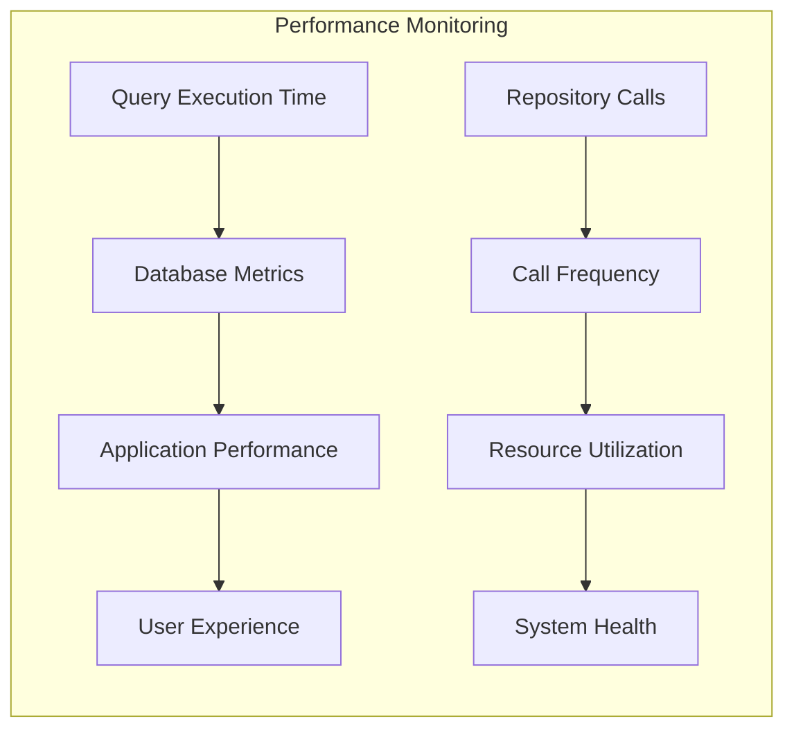

**Section sources**
- [DbConnectionRepository.java:1-12](file://src/main/java/com/db2api/repository/connection/DbConnectionRepository.java#L1-L12)
- [ApiDefinitionRepository.java:1-21](file://src/main/java/com/db2api/repository/api/ApiDefinitionRepository.java#L1-L21)

## Testing Strategies

### Unit Testing Approaches

The repository pattern enables comprehensive testing strategies:

#### Repository Layer Testing
- **Mock Repositories**: Using Mockito to mock repository interfaces
- **In-Memory Database**: H2 for integration testing
- **Test Data Setup**: Using @BeforeEach to prepare test data

#### Service Layer Testing
- **Repository Mocking**: Isolating business logic from data access
- **Transaction Rollback**: Ensuring test isolation
- **Exception Testing**: Verifying proper exception handling

### Test Implementation Patterns

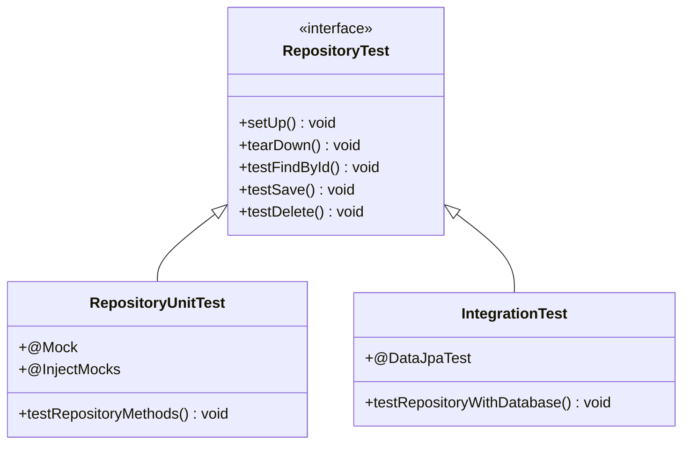

### Mocking Patterns

Common mocking patterns for repository testing:

#### Mockito Repository Mocking
- Mock repository methods with `when().thenReturn()`
- Verify method calls with `verify()`
- Test exception scenarios with `doThrow()`

#### Test Data Builders
- Fluent interfaces for constructing test entities
- Consistent test data across multiple test classes
- Factory methods for complex entity relationships

**Section sources**
- [DbConnectionRepository.java:1-12](file://src/main/java/com/db2api/repository/connection/DbConnectionRepository.java#L1-L12)
- [ApiDefinitionRepository.java:1-21](file://src/main/java/com/db2api/repository/api/ApiDefinitionRepository.java#L1-L21)

## Conclusion

The DB2API repository pattern implementation demonstrates a mature approach to data access layer design using Spring Data JPA. The implementation provides:

### Key Strengths

- **Clean Abstraction**: Clear separation between data access and business logic
- **Automatic Query Generation**: Leveraging method naming conventions for efficient queries
- **Standardized CRUD Operations**: Comprehensive data manipulation capabilities
- **Flexible Query Patterns**: Support for both simple and complex query scenarios
- **Transaction Management**: Proper transaction boundaries and exception handling
- **Performance Considerations**: Lazy loading, indexing, and caching strategies
- **Testing Support**: Comprehensive testing patterns for unit and integration testing

### Best Practices Demonstrated

- **Domain-Driven Design**: Repository organization follows business domain boundaries
- **Spring Boot Conventions**: Standard package structure and naming conventions
- **Type Safety**: Generic type parameters ensure compile-time type checking
- **Optional Returns**: Safe handling of potentially absent data
- **Extensibility**: Easy addition of custom query methods

### Areas for Enhancement

- **Custom JPQL Implementation**: Consider adding explicit JPQL queries for complex scenarios
- **Caching Strategy**: Implement second-level caching for frequently accessed data
- **Monitoring Integration**: Add metrics collection for query performance monitoring
- **Batch Operations**: Support for bulk operations to improve performance

The repository pattern implementation provides a solid foundation for scalable data access operations while maintaining code maintainability and testability. The Spring Data JPA integration enables rapid development of data access features while preserving performance and reliability standards.