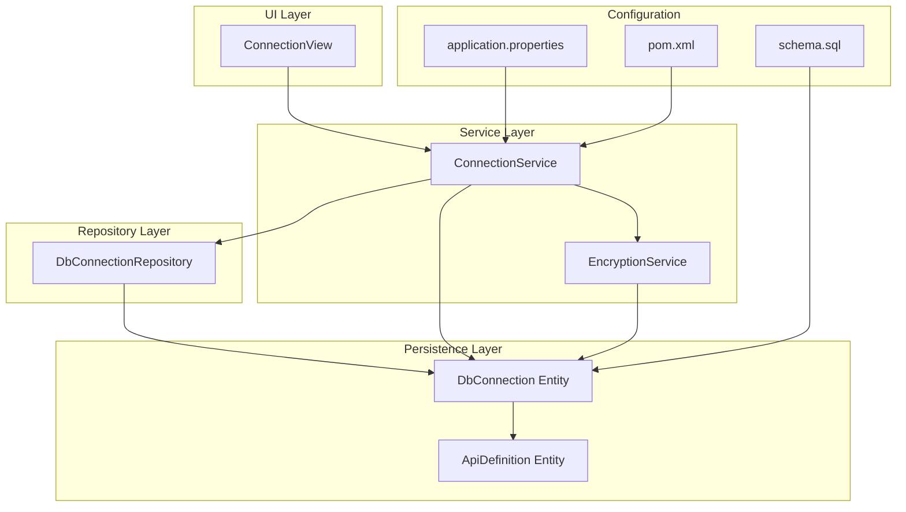
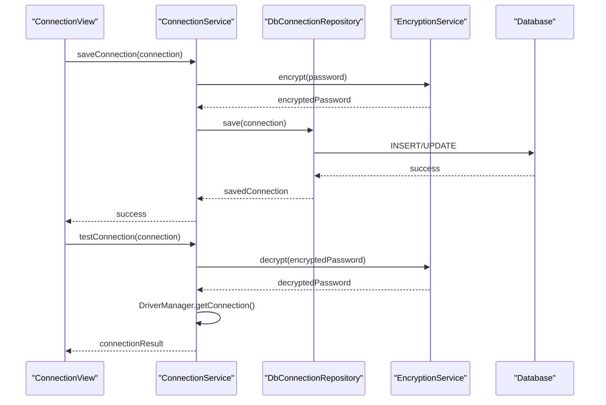
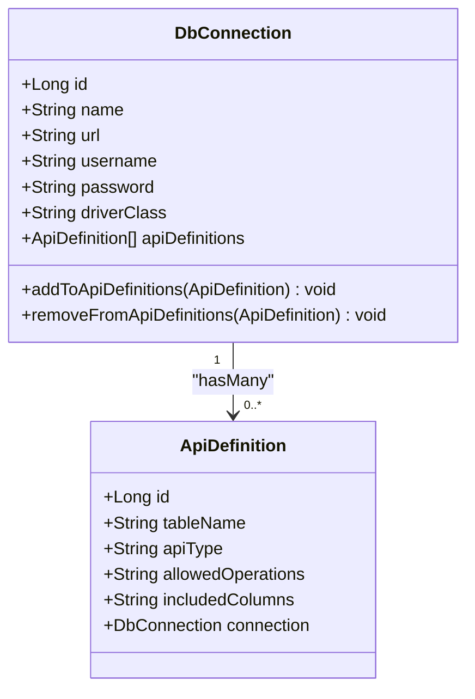
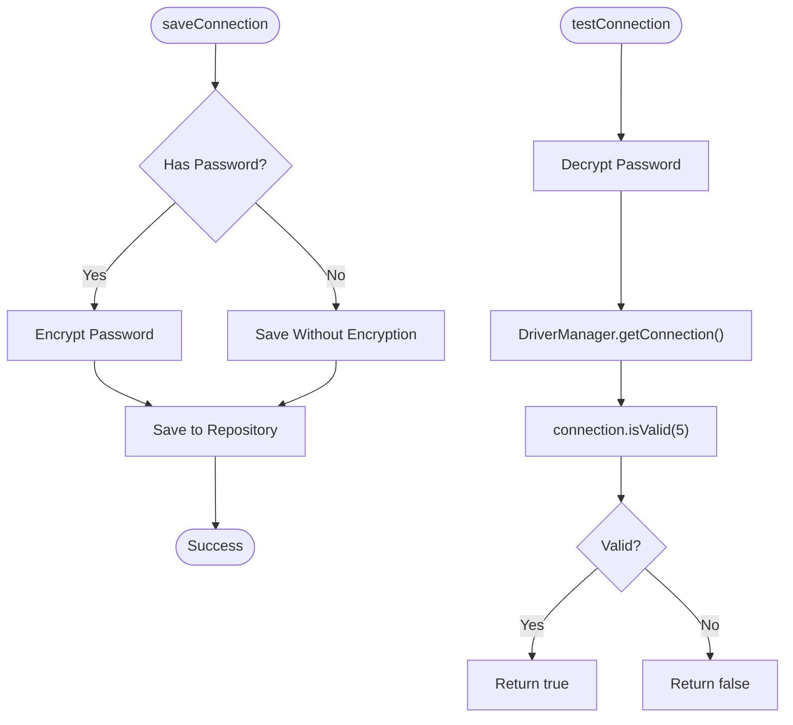
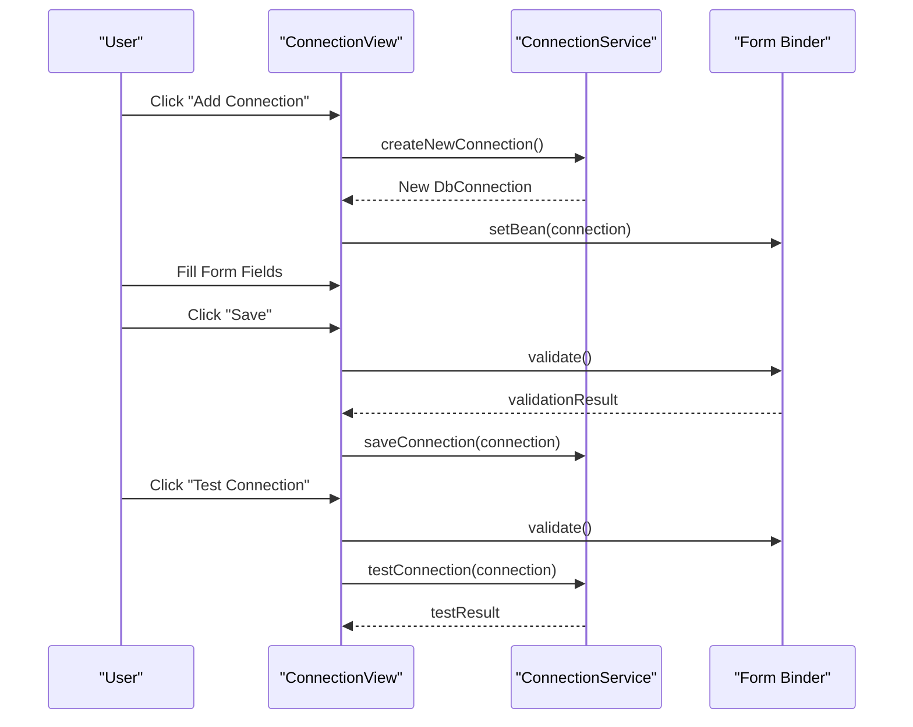
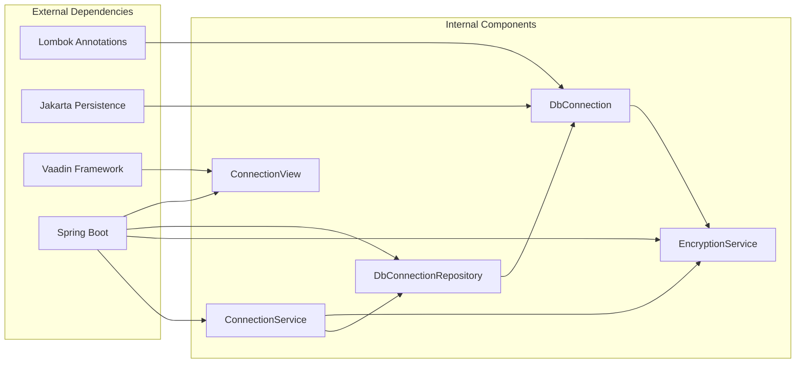

# Connection Configuration

<cite>
**Referenced Files in This Document**
- [DbConnection.java](file://src/main/java/com/db2api/persistent/connection/DbConnection.java)
- [DbConnectionRepository.java](file://src/main/java/com/db2api/repository/connection/DbConnectionRepository.java)
- [ConnectionService.java](file://src/main/java/com/db2api/service/connection/ConnectionService.java)
- [ApiDefinition.java](file://src/main/java/com/db2api/persistent/api/ApiDefinition.java)
- [EncryptionService.java](file://src/main/java/com/db2api/service/EncryptionService.java)
- [ConnectionView.java](file://src/main/java/com/db2api/ui/connection/ConnectionView.java)
- [application.properties](file://src/main/resources/application.properties)
- [schema.sql](file://src/main/resources/schema.sql)
- [pom.xml](file://pom.xml)
</cite>

## Table of Contents
1. [Introduction](#introduction)
2. [Project Structure](#project-structure)
3. [Core Components](#core-components)
4. [Architecture Overview](#architecture-overview)
5. [Detailed Component Analysis](#detailed-component-analysis)
6. [Dependency Analysis](#dependency-analysis)
7. [Performance Considerations](#performance-considerations)
8. [Security Considerations](#security-considerations)
9. [Best Practices](#best-practices)
10. [Troubleshooting Guide](#troubleshooting-guide)
11. [Practical Examples](#practical-examples)
12. [Conclusion](#conclusion)

## Introduction
This document provides comprehensive documentation for database connection configuration in DB2API. It details the DbConnection entity structure, connection metadata management, entity relationships with ApiDefinition, and utility methods for managing API definitions. The document also covers connection configuration best practices, field validation rules, and security considerations for storing encrypted credentials, along with practical examples of creating, updating, and retrieving connection configurations through the repository layer.

## Project Structure
The connection configuration functionality is organized across several layers in the DB2API application:

**Diagram sources**
- [ConnectionView.java:27-43](file://src/main/java/com/db2api/ui/connection/ConnectionView.java#L27-L43)
- [ConnectionService.java:15-24](file://src/main/java/com/db2api/service/connection/ConnectionService.java#L15-L24)
- [DbConnectionRepository.java:10-12](file://src/main/java/com/db2api/repository/connection/DbConnectionRepository.java#L10-L12)
- [DbConnection.java:16-27](file://src/main/java/com/db2api/persistent/connection/DbConnection.java#L16-L27)
- [ApiDefinition.java:13-24](file://src/main/java/com/db2api/persistent/api/ApiDefinition.java#L13-L24)

**Section sources**
- [ConnectionView.java:27-43](file://src/main/java/com/db2api/ui/connection/ConnectionView.java#L27-L43)
- [ConnectionService.java:15-24](file://src/main/java/com/db2api/service/connection/ConnectionService.java#L15-L24)
- [DbConnectionRepository.java:10-12](file://src/main/java/com/db2api/repository/connection/DbConnectionRepository.java#L10-L12)
- [DbConnection.java:16-27](file://src/main/java/com/db2api/persistent/connection/DbConnection.java#L16-L27)
- [ApiDefinition.java:13-24](file://src/main/java/com/db2api/persistent/api/ApiDefinition.java#L13-L24)

## Core Components
The connection configuration system consists of four primary components:

### DbConnection Entity
The DbConnection entity represents a database connection configuration with the following properties:
- **id**: Primary key identifier
- **name**: Human-readable connection name
- **url**: JDBC URL for database connection
- **username**: Database username
- **password**: Encrypted database password
- **driverClass**: Fully qualified JDBC driver class name
- **apiDefinitions**: Bidirectional relationship with API definitions

### ConnectionService
Provides business logic for connection management including encryption, testing, and persistence operations.

### DbConnectionRepository
Spring Data JPA repository interface extending JpaRepository for CRUD operations.

### EncryptionService
Handles AES encryption and decryption of sensitive credential data.

**Section sources**
- [DbConnection.java:20-84](file://src/main/java/com/db2api/persistent/connection/DbConnection.java#L20-L84)
- [ConnectionService.java:16-57](file://src/main/java/com/db2api/service/connection/ConnectionService.java#L16-L57)
- [DbConnectionRepository.java:11](file://src/main/java/com/db2api/repository/connection/DbConnectionRepository.java#L11)
- [EncryptionService.java:14-58](file://src/main/java/com/db2api/service/EncryptionService.java#L14-L58)

## Architecture Overview
The connection configuration follows a layered architecture pattern with clear separation of concerns:

**Diagram sources**
- [ConnectionView.java:86-125](file://src/main/java/com/db2api/ui/connection/ConnectionView.java#L86-L125)
- [ConnectionService.java:30-56](file://src/main/java/com/db2api/service/connection/ConnectionService.java#L30-L56)
- [EncryptionService.java:35-57](file://src/main/java/com/db2api/service/EncryptionService.java#L35-L57)

## Detailed Component Analysis

### DbConnection Entity Analysis
The DbConnection entity serves as the central data model for database connection configurations:

**Diagram sources**
- [DbConnection.java:20-84](file://src/main/java/com/db2api/persistent/connection/DbConnection.java#L20-L84)
- [ApiDefinition.java:17-56](file://src/main/java/com/db2api/persistent/api/ApiDefinition.java#L17-56)

**Section sources**
- [DbConnection.java:20-84](file://src/main/java/com/db2api/persistent/connection/DbConnection.java#L20-L84)
- [ApiDefinition.java:17-56](file://src/main/java/com/db2api/persistent/api/ApiDefinition.java#L17-56)

### ConnectionService Implementation
The ConnectionService handles all business logic for connection management:

**Diagram sources**
- [ConnectionService.java:30-56](file://src/main/java/com/db2api/service/connection/ConnectionService.java#L30-L56)

**Section sources**
- [ConnectionService.java:16-57](file://src/main/java/com/db2api/service/connection/ConnectionService.java#L16-L57)

### UI Integration
The ConnectionView provides a comprehensive interface for managing database connections:

**Diagram sources**
- [ConnectionView.java:71-125](file://src/main/java/com/db2api/ui/connection/ConnectionView.java#L71-L125)

**Section sources**
- [ConnectionView.java:29-203](file://src/main/java/com/db2api/ui/connection/ConnectionView.java#L29-L203)

## Dependency Analysis
The connection configuration system has the following dependencies:

**Diagram sources**
- [pom.xml:25-99](file://pom.xml#L25-L99)
- [DbConnection.java:3-7](file://src/main/java/com/db2api/persistent/connection/DbConnection.java#L3-L7)
- [ConnectionService.java:4-7](file://src/main/java/com/db2api/service/connection/ConnectionService.java#L4-L7)

**Section sources**
- [pom.xml:25-99](file://pom.xml#L25-L99)
- [DbConnection.java:3-7](file://src/main/java/com/db2api/persistent/connection/DbConnection.java#L3-L7)
- [ConnectionService.java:4-7](file://src/main/java/com/db2api/service/connection/ConnectionService.java#L4-L7)

## Performance Considerations
- **Connection Testing**: The testConnection method uses a 5-second timeout for validation
- **Memory Management**: Passwords are decrypted only during connection testing
- **Lazy Loading**: ApiDefinition relationships use lazy loading to optimize performance
- **Batch Operations**: Consider implementing batch operations for bulk connection management

## Security Considerations
The system implements several security measures for connection configuration:

### Encryption Implementation
- Uses AES encryption with ECB mode and PKCS5 padding
- Secret key derived from application property using SHA-1 hashing
- Passwords are encrypted before storage and decrypted only during testing

### Credential Storage
- Passwords are stored in encrypted form in the database
- UI password fields use masked input
- No plaintext passwords are transmitted or logged

### Field Validation
- Database schema enforces NOT NULL constraints
- UI validation ensures required fields are present
- Driver class validation prevents invalid JDBC drivers

**Section sources**
- [EncryptionService.java:18-57](file://src/main/java/com/db2api/service/EncryptionService.java#L18-L57)
- [schema.sql:14-21](file://src/main/resources/schema.sql#L14-L21)
- [ConnectionView.java:137-161](file://src/main/java/com/db2api/ui/connection/ConnectionView.java#L137-L161)

## Best Practices
### Connection Configuration Best Practices
1. **Use Descriptive Names**: Choose meaningful connection names that identify the target database
2. **Validate JDBC URLs**: Ensure JDBC URLs match the target database type and version
3. **Driver Compatibility**: Verify JDBC driver classes match the database vendor
4. **Credential Management**: Store only encrypted passwords in the system
5. **Connection Testing**: Always test connections before deployment

### Field Validation Rules
- **Name**: Required, unique, max 255 characters
- **URL**: Required, max 500 characters, valid JDBC URL format
- **Username**: Required, max 255 characters
- **Password**: Required, encrypted before storage
- **Driver Class**: Required, fully qualified class name

### Security Best Practices
- **Environment Variables**: Store encryption secrets in environment variables
- **Access Control**: Restrict connection management to administrative users
- **Audit Logging**: Log connection creation, modification, and deletion events
- **Regular Rotation**: Periodically rotate database credentials

## Troubleshooting Guide
Common issues and solutions for connection configuration:

### Connection Testing Failures
- **Invalid Credentials**: Verify username and encrypted password
- **Network Issues**: Check firewall and network connectivity
- **Driver Problems**: Confirm JDBC driver availability and compatibility
- **Database Unavailable**: Verify database server status and port accessibility

### Encryption Issues
- **Decryption Failures**: Check encryption secret configuration
- **Corrupted Data**: Verify encrypted password integrity
- **Key Mismatch**: Ensure consistent encryption secret across deployments

### UI Issues
- **Form Validation**: Check required fields and data types
- **Permission Denied**: Verify administrative privileges
- **Browser Compatibility**: Test with supported browser versions

**Section sources**
- [ConnectionService.java:47-56](file://src/main/java/com/db2api/service/connection/ConnectionService.java#L47-L56)
- [EncryptionService.java:35-57](file://src/main/java/com/db2api/service/EncryptionService.java#L35-L57)
- [ConnectionView.java:114-125](file://src/main/java/com/db2api/ui/connection/ConnectionView.java#L114-L125)

## Practical Examples
This section demonstrates practical usage patterns for connection configuration management:

### Creating a New Connection
1. Instantiate a new DbConnection object
2. Set connection properties (name, URL, username, password, driver class)
3. Call ConnectionService.saveConnection()
4. Validate with ConnectionService.testConnection()

### Updating an Existing Connection
1. Retrieve connection from repository
2. Modify desired properties
3. Call ConnectionService.saveConnection()
5. Test updated connection

### Retrieving Connections
1. Use ConnectionService.getAllConnections() for listing
2. Use repository.findById() for individual retrieval
3. Filter connections by name or other criteria

### Deleting Connections
1. Retrieve connection to delete
2. Remove associated API definitions first
3. Call ConnectionService.deleteConnection()

**Section sources**
- [ConnectionService.java:26-45](file://src/main/java/com/db2api/service/connection/ConnectionService.java#L26-L45)
- [DbConnectionRepository.java:11](file://src/main/java/com/db2api/repository/connection/DbConnectionRepository.java#L11)
- [ConnectionView.java:86-107](file://src/main/java/com/db2api/ui/connection/ConnectionView.java#L86-L107)

## Conclusion
The DB2API connection configuration system provides a robust, secure, and user-friendly mechanism for managing database connections. The layered architecture ensures clear separation of concerns, while the encryption service protects sensitive credential data. The comprehensive UI enables administrators to easily create, test, and manage database connections. Following the best practices outlined in this document will help ensure reliable and secure connection management throughout the application lifecycle.