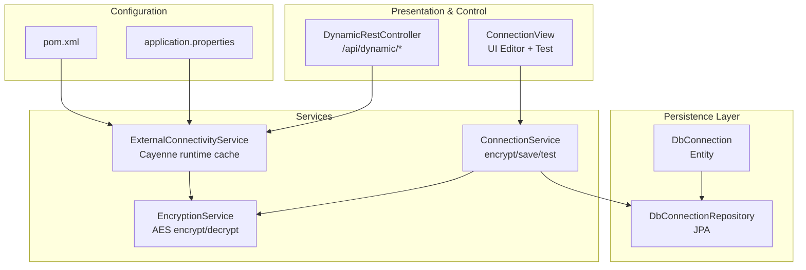
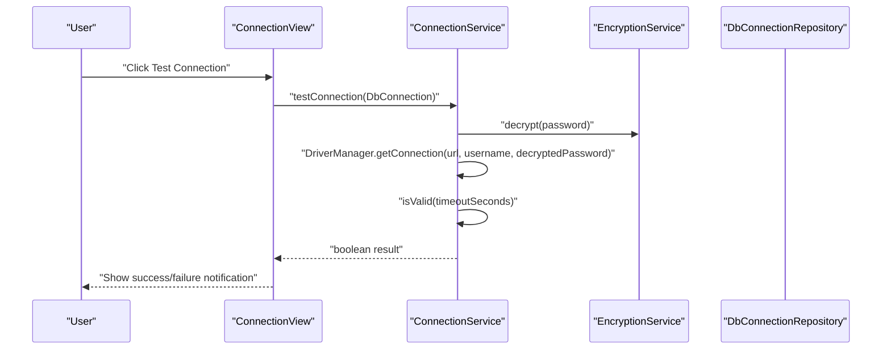
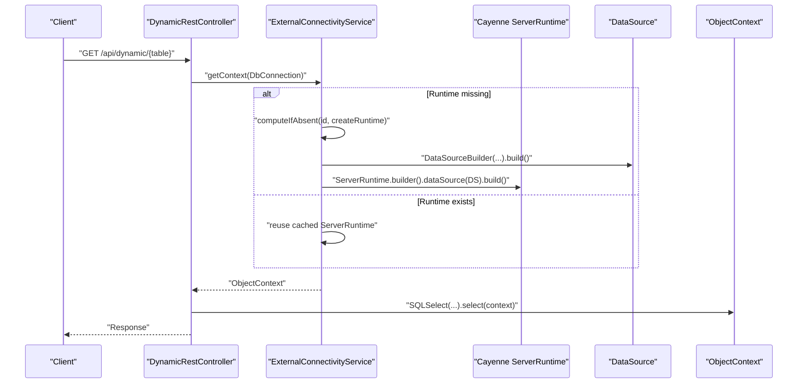
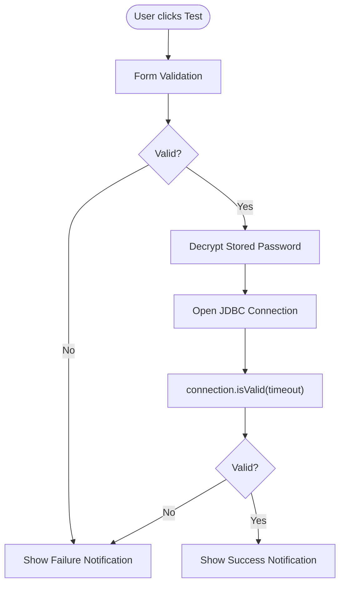
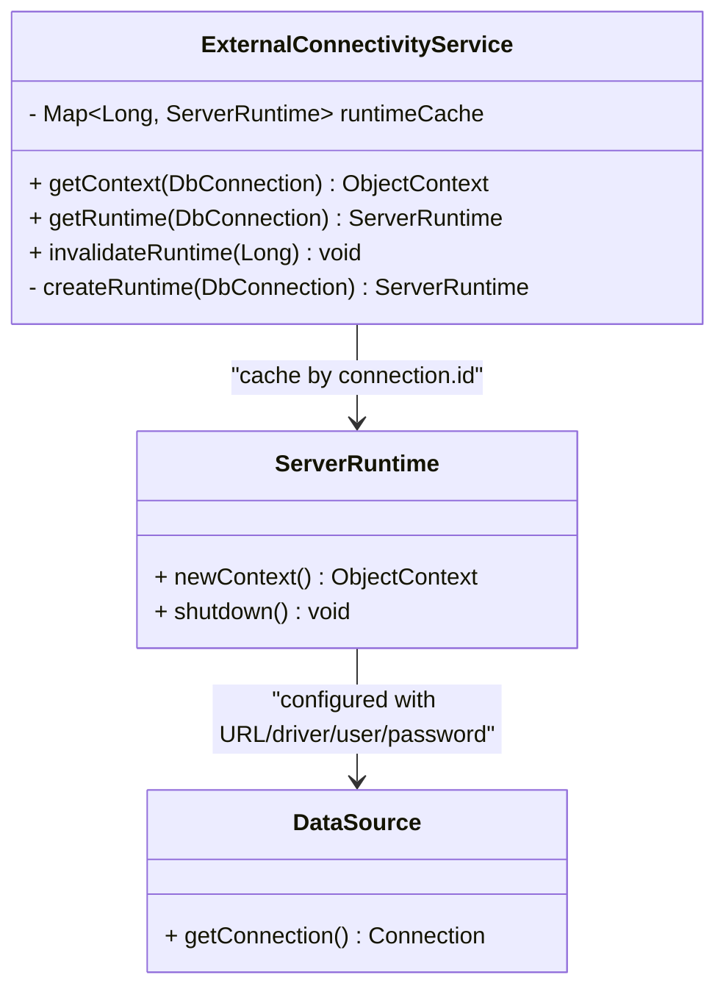
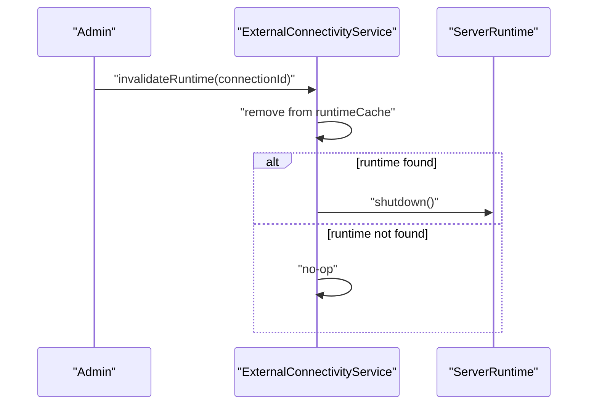
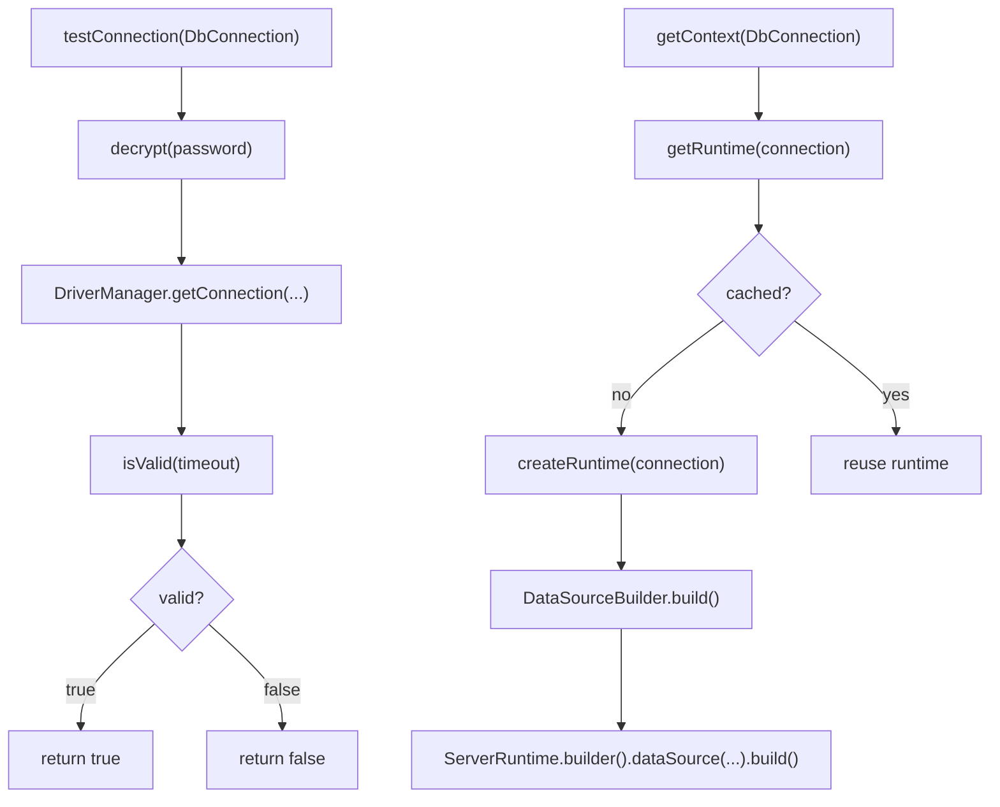
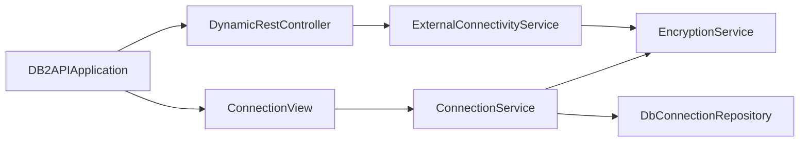

# Connection Lifecycle Management

<cite>
**Referenced Files in This Document**
- [DbConnection.java](file://src/main/java/com/db2api/persistent/connection/DbConnection.java)
- [DbConnectionRepository.java](file://src/main/java/com/db2api/repository/connection/DbConnectionRepository.java)
- [ConnectionService.java](file://src/main/java/com/db2api/service/connection/ConnectionService.java)
- [ExternalConnectivityService.java](file://src/main/java/com/db2api/service/connection/ExternalConnectivityService.java)
- [EncryptionService.java](file://src/main/java/com/db2api/service/EncryptionService.java)
- [ConnectionView.java](file://src/main/java/com/db2api/ui/connection/ConnectionView.java)
- [DynamicRestController.java](file://src/main/java/com/db2api/controller/DynamicRestController.java)
- [application.properties](file://src/main/resources/application.properties)
- [DB2APIApplication.java](file://src/main/java/com/db2api/DB2APIApplication.java)
- [pom.xml](file://pom.xml)
</cite>

## Table of Contents
1. [Introduction](#introduction)
2. [Project Structure](#project-structure)
3. [Core Components](#core-components)
4. [Architecture Overview](#architecture-overview)
5. [Detailed Component Analysis](#detailed-component-analysis)
6. [Dependency Analysis](#dependency-analysis)
7. [Performance Considerations](#performance-considerations)
8. [Troubleshooting Guide](#troubleshooting-guide)
9. [Conclusion](#conclusion)

## Introduction
This document explains how DB2API manages database connections to external systems. It covers connection establishment, validation, testing, and termination; describes connection pooling and reuse via Cayenne ServerRuntime caching; documents state management, error handling, and graceful shutdown. Practical examples show lifecycle hooks, health monitoring, timeouts, and leak prevention strategies.

## Project Structure
The connection lifecycle spans persistence, services, UI, and controllers:
- Persistence: entity and repository for storing connection configurations
- Services: connection creation/validation and external connectivity with Cayenne
- UI: connection registration and testing
- Controllers: dynamic SQL execution against external databases
- Configuration: application properties and build dependencies

**Diagram sources**
- [DbConnection.java:16-84](file://src/main/java/com/db2api/persistent/connection/DbConnection.java#L16-L84)
- [DbConnectionRepository.java:10-12](file://src/main/java/com/db2api/repository/connection/DbConnectionRepository.java#L10-L12)
- [ConnectionService.java:15-57](file://src/main/java/com/db2api/service/connection/ConnectionService.java#L15-L57)
- [ExternalConnectivityService.java:15-54](file://src/main/java/com/db2api/service/connection/ExternalConnectivityService.java#L15-L54)
- [EncryptionService.java:13-58](file://src/main/java/com/db2api/service/EncryptionService.java#L13-L58)
- [ConnectionView.java:27-203](file://src/main/java/com/db2api/ui/connection/ConnectionView.java#L27-L203)
- [DynamicRestController.java:21-167](file://src/main/java/com/db2api/controller/DynamicRestController.java#L21-L167)
- [application.properties:1-20](file://src/main/resources/application.properties#L1-L20)
- [pom.xml:25-99](file://pom.xml#L25-L99)

**Section sources**
- [DbConnection.java:16-84](file://src/main/java/com/db2api/persistent/connection/DbConnection.java#L16-L84)
- [DbConnectionRepository.java:10-12](file://src/main/java/com/db2api/repository/connection/DbConnectionRepository.java#L10-L12)
- [ConnectionService.java:15-57](file://src/main/java/com/db2api/service/connection/ConnectionService.java#L15-L57)
- [ExternalConnectivityService.java:15-54](file://src/main/java/com/db2api/service/connection/ExternalConnectivityService.java#L15-L54)
- [EncryptionService.java:13-58](file://src/main/java/com/db2api/service/EncryptionService.java#L13-L58)
- [ConnectionView.java:27-203](file://src/main/java/com/db2api/ui/connection/ConnectionView.java#L27-L203)
- [DynamicRestController.java:21-167](file://src/main/java/com/db2api/controller/DynamicRestController.java#L21-L167)
- [application.properties:1-20](file://src/main/resources/application.properties#L1-L20)
- [pom.xml:25-99](file://pom.xml#L25-L99)

## Core Components
- DbConnection: stores connection metadata (name, JDBC URL, username, encrypted password, driver class) and maintains associations with API definitions.
- DbConnectionRepository: JPA repository for CRUD operations on DbConnection.
- ConnectionService: encrypts passwords before saving, validates connections via JDBC, and persists/deletes connections.
- ExternalConnectivityService: builds Cayenne DataSource per connection, caches ServerRuntime instances keyed by connection ID, and provides ObjectContext for queries.
- EncryptionService: AES-based encryption/decryption for secure storage and runtime retrieval of secrets.
- ConnectionView: UI for registering/editing connections and testing connectivity.
- DynamicRestController: executes dynamic SQL against external databases using Cayenne contexts.

**Section sources**
- [DbConnection.java:16-84](file://src/main/java/com/db2api/persistent/connection/DbConnection.java#L16-L84)
- [DbConnectionRepository.java:10-12](file://src/main/java/com/db2api/repository/connection/DbConnectionRepository.java#L10-L12)
- [ConnectionService.java:15-57](file://src/main/java/com/db2api/service/connection/ConnectionService.java#L15-L57)
- [ExternalConnectivityService.java:15-54](file://src/main/java/com/db2api/service/connection/ExternalConnectivityService.java#L15-L54)
- [EncryptionService.java:13-58](file://src/main/java/com/db2api/service/EncryptionService.java#L13-L58)
- [ConnectionView.java:27-203](file://src/main/java/com/db2api/ui/connection/ConnectionView.java#L27-L203)
- [DynamicRestController.java:21-167](file://src/main/java/com/db2api/controller/DynamicRestController.java#L21-L167)

## Architecture Overview
The system separates concerns:
- UI triggers connection tests and saves configurations
- ConnectionService handles encryption and validation
- ExternalConnectivityService manages Cayenne runtime and context creation
- DynamicRestController executes SQL against external databases using cached runtimes

**Diagram sources**
- [ConnectionView.java:114-125](file://src/main/java/com/db2api/ui/connection/ConnectionView.java#L114-L125)
- [ConnectionService.java:47-56](file://src/main/java/com/db2api/service/connection/ConnectionService.java#L47-L56)
- [EncryptionService.java:47-57](file://src/main/java/com/db2api/service/EncryptionService.java#L47-L57)

**Diagram sources**
- [DynamicRestController.java:47-81](file://src/main/java/com/db2api/controller/DynamicRestController.java#L47-L81)
- [ExternalConnectivityService.java:25-31](file://src/main/java/com/db2api/service/connection/ExternalConnectivityService.java#L25-L31)
- [ExternalConnectivityService.java:40-53](file://src/main/java/com/db2api/service/connection/ExternalConnectivityService.java#L40-L53)

## Detailed Component Analysis

### Connection Establishment and Validation
- UI initiates a connectivity test by invoking ConnectionService.testConnection.
- The service decrypts the stored password, opens a JDBC connection using the provided URL, username, and decrypted password, and checks validity with a short timeout.
- On success, the UI displays a success notification; otherwise, a failure notification is shown.

**Diagram sources**
- [ConnectionView.java:114-125](file://src/main/java/com/db2api/ui/connection/ConnectionView.java#L114-L125)
- [ConnectionService.java:47-56](file://src/main/java/com/db2api/service/connection/ConnectionService.java#L47-L56)
- [EncryptionService.java:47-57](file://src/main/java/com/db2api/service/EncryptionService.java#L47-L57)

**Section sources**
- [ConnectionView.java:114-125](file://src/main/java/com/db2api/ui/connection/ConnectionView.java#L114-L125)
- [ConnectionService.java:47-56](file://src/main/java/com/db2api/service/connection/ConnectionService.java#L47-L56)
- [EncryptionService.java:47-57](file://src/main/java/com/db2api/service/EncryptionService.java#L47-L57)

### Connection Pooling and Reuse
- ExternalConnectivityService caches a Cayenne ServerRuntime per connection ID using a concurrent map.
- Each ServerRuntime encapsulates a DataSource built from the connection’s URL, driver class, username, and decrypted password.
- getContext(DbConnection) creates a new ObjectContext from the cached runtime, enabling efficient reuse of underlying connection pools managed by Cayenne.

**Diagram sources**
- [ExternalConnectivityService.java:15-54](file://src/main/java/com/db2api/service/connection/ExternalConnectivityService.java#L15-L54)

**Section sources**
- [ExternalConnectivityService.java:15-54](file://src/main/java/com/db2api/service/connection/ExternalConnectivityService.java#L15-L54)

### Resource Cleanup and Graceful Shutdown
- ExternalConnectivityService exposes invalidateRuntime(Long) to remove a cached runtime and call shutdown, releasing underlying resources.
- Application startup is handled by DB2APIApplication.main, which launches the Spring Boot application context.

**Diagram sources**
- [ExternalConnectivityService.java:33-38](file://src/main/java/com/db2api/service/connection/ExternalConnectivityService.java#L33-L38)
- [DB2APIApplication.java:22-24](file://src/main/java/com/db2api/DB2APIApplication.java#L22-L24)

**Section sources**
- [ExternalConnectivityService.java:33-38](file://src/main/java/com/db2api/service/connection/ExternalConnectivityService.java#L33-L38)
- [DB2APIApplication.java:22-24](file://src/main/java/com/db2api/DB2APIApplication.java#L22-L24)

### Connection State Management and Error Handling
- ConnectionService.testConnection wraps JDBC operations in a try-with-resources block and uses isValid(timeout) to validate connectivity, returning false on exceptions.
- ExternalConnectivityService.createRuntime decrypts the password and constructs a DataSource; exceptions propagate to callers.
- DynamicRestController catches exceptions during SQL execution and returns appropriate HTTP responses.

**Diagram sources**
- [ConnectionService.java:47-56](file://src/main/java/com/db2api/service/connection/ConnectionService.java#L47-L56)
- [ExternalConnectivityService.java:29-31](file://src/main/java/com/db2api/service/connection/ExternalConnectivityService.java#L29-L31)
- [ExternalConnectivityService.java:40-53](file://src/main/java/com/db2api/service/connection/ExternalConnectivityService.java#L40-L53)

**Section sources**
- [ConnectionService.java:47-56](file://src/main/java/com/db2api/service/connection/ConnectionService.java#L47-L56)
- [ExternalConnectivityService.java:29-31](file://src/main/java/com/db2api/service/connection/ExternalConnectivityService.java#L29-L31)
- [ExternalConnectivityService.java:40-53](file://src/main/java/com/db2api/service/connection/ExternalConnectivityService.java#L40-L53)
- [DynamicRestController.java:77-80](file://src/main/java/com/db2api/controller/DynamicRestController.java#L77-L80)

### Automatic Reconnection Logic
- There is no explicit automatic reconnection retry loop in the current implementation.
- To implement robustness, consider wrapping ExternalConnectivityService.getRuntime with a retry-and-backoff strategy and adding circuit-breaker semantics around DataSource creation.

[No sources needed since this section provides general guidance]

### Monitoring Connection Health
- Use ConnectionService.testConnection to periodically validate connections and surface failures to administrators.
- Track runtime cache size and eviction patterns to detect stale or leaking runtimes.

[No sources needed since this section provides general guidance]

### Practical Examples

#### Connection Lifecycle Hooks
- Save hook: ConnectionService.saveConnection encrypts the password before persisting.
- Test hook: ConnectionView delegates to ConnectionService.testConnection and shows notifications.
- Termination hook: ExternalConnectivityService.invalidateRuntime removes and shuts down a runtime.

**Section sources**
- [ConnectionService.java:30-37](file://src/main/java/com/db2api/service/connection/ConnectionService.java#L30-L37)
- [ConnectionView.java:114-125](file://src/main/java/com/db2api/ui/connection/ConnectionView.java#L114-L125)
- [ExternalConnectivityService.java:33-38](file://src/main/java/com/db2api/service/connection/ExternalConnectivityService.java#L33-L38)

#### Timeout Handling
- JDBC validation uses a short timeout via isValid(timeoutSeconds) to prevent blocking.
- Consider configuring JDBC driver-specific timeouts (e.g., socket timeout, connection timeout) via the JDBC URL or driver properties.

**Section sources**
- [ConnectionService.java:51](file://src/main/java/com/db2api/service/connection/ConnectionService.java#L51)

#### Connection Leak Prevention
- Ensure ExternalConnectivityService.invalidateRuntime is called when a connection is deleted or modified.
- Avoid holding onto ObjectContext instances longer than necessary; use short-lived contexts per request.
- Monitor cache growth and evictions to detect leaks.

**Section sources**
- [ExternalConnectivityService.java:33-38](file://src/main/java/com/db2api/service/connection/ExternalConnectivityService.java#L33-L38)
- [DynamicRestController.java:61](file://src/main/java/com/db2api/controller/DynamicRestController.java#L61)

## Dependency Analysis
- ExternalConnectivityService depends on EncryptionService for decrypting passwords and building DataSource.
- ConnectionService depends on DbConnectionRepository for persistence and EncryptionService for encrypting passwords.
- DynamicRestController depends on ExternalConnectivityService for obtaining contexts and on ApiDefinitionService for mapping endpoints.
- UI depends on ConnectionService for listing, saving, deleting, and testing connections.

**Diagram sources**
- [ConnectionView.java:31-42](file://src/main/java/com/db2api/ui/connection/ConnectionView.java#L31-L42)
- [ConnectionService.java:18-24](file://src/main/java/com/db2api/service/connection/ConnectionService.java#L18-L24)
- [ExternalConnectivityService.java:19-23](file://src/main/java/com/db2api/service/connection/ExternalConnectivityService.java#L19-L23)
- [DynamicRestController.java:25-39](file://src/main/java/com/db2api/controller/DynamicRestController.java#L25-L39)
- [DB2APIApplication.java:22-24](file://src/main/java/com/db2api/DB2APIApplication.java#L22-L24)

**Section sources**
- [ConnectionView.java:31-42](file://src/main/java/com/db2api/ui/connection/ConnectionView.java#L31-L42)
- [ConnectionService.java:18-24](file://src/main/java/com/db2api/service/connection/ConnectionService.java#L18-L24)
- [ExternalConnectivityService.java:19-23](file://src/main/java/com/db2api/service/connection/ExternalConnectivityService.java#L19-L23)
- [DynamicRestController.java:25-39](file://src/main/java/com/db2api/controller/DynamicRestController.java#L25-L39)
- [DB2APIApplication.java:22-24](file://src/main/java/com/db2api/DB2APIApplication.java#L22-L24)

## Performance Considerations
- Prefer caching ServerRuntime per connection ID to avoid repeated DataSource construction and initialization overhead.
- Use short validation timeouts for health checks to keep UI responsive.
- Limit concurrent dynamic queries and tune Cayenne/ObjectContext usage to reduce contention.
- Consider driver-level connection pool tuning via JDBC URL parameters or driver-specific properties.

[No sources needed since this section provides general guidance]

## Troubleshooting Guide
- Validation fails: Confirm the JDBC URL, driver class, username, and decrypted password are correct; verify network connectivity and firewall rules.
- Connection not reused: Ensure the connection ID remains stable and ExternalConnectivityService.getRuntime is invoked with the same ID.
- Memory/CPU spikes: Investigate runtime cache growth and ensure invalidateRuntime is called on deletions/modifications.
- Exceptions during SQL execution: Inspect DynamicRestController error handling and log stack traces for deeper diagnostics.

**Section sources**
- [ConnectionService.java:52-55](file://src/main/java/com/db2api/service/connection/ConnectionService.java#L52-L55)
- [DynamicRestController.java:77-80](file://src/main/java/com/db2api/controller/DynamicRestController.java#L77-L80)

## Conclusion
DB2API implements a clean separation of concerns for connection lifecycle management: secure credential handling, connection validation, and efficient reuse via Cayenne runtime caching. By leveraging the existing hooks and applying the recommended practices for timeouts, monitoring, and graceful shutdown, teams can operate reliable and maintainable external database integrations.