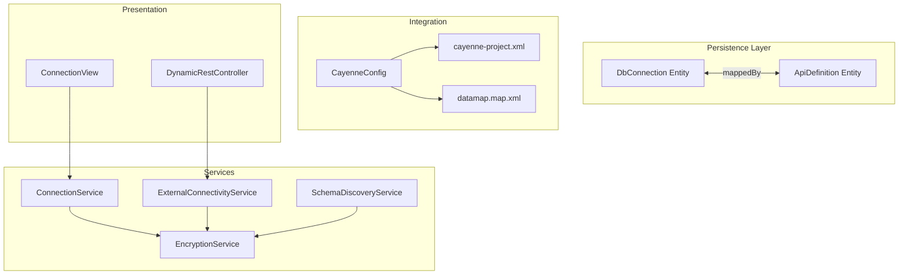
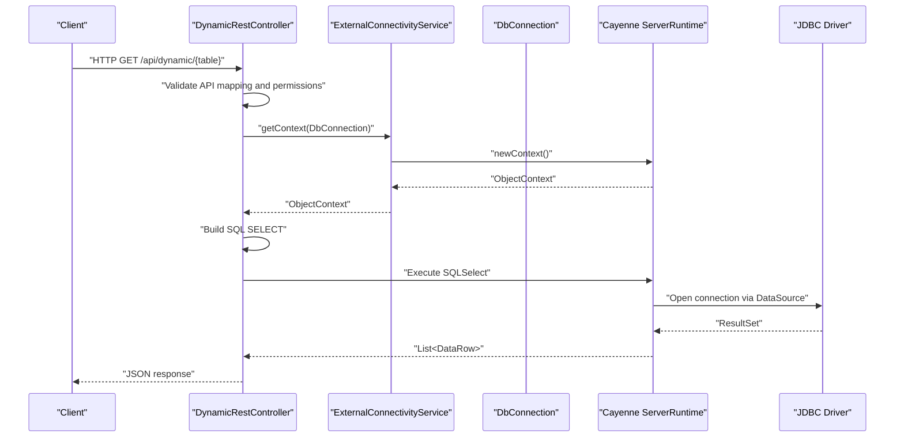
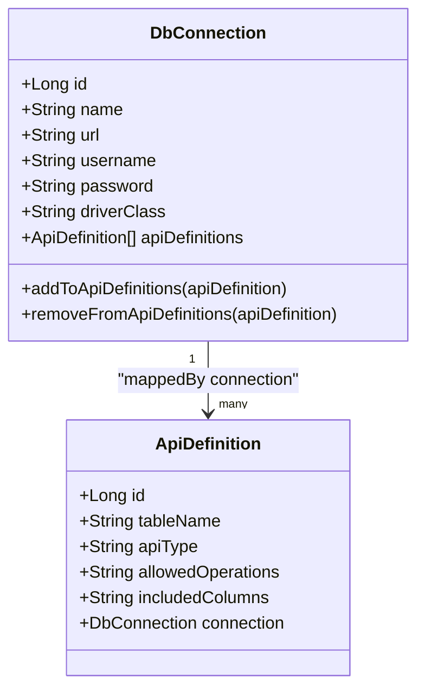
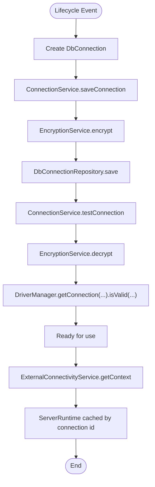
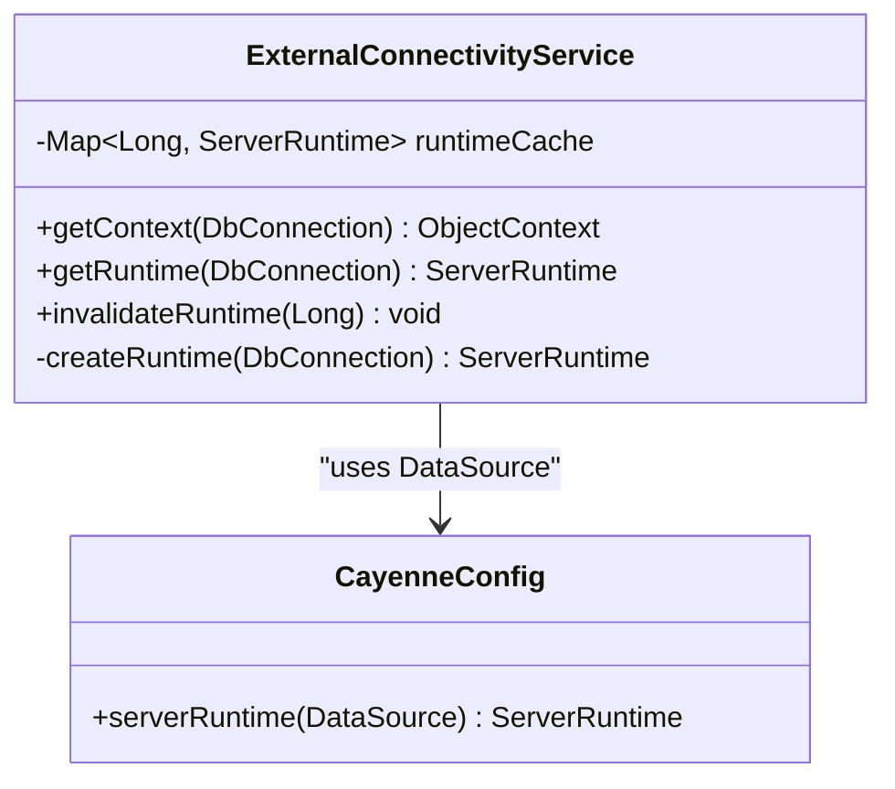
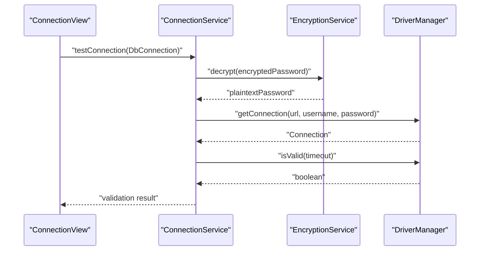
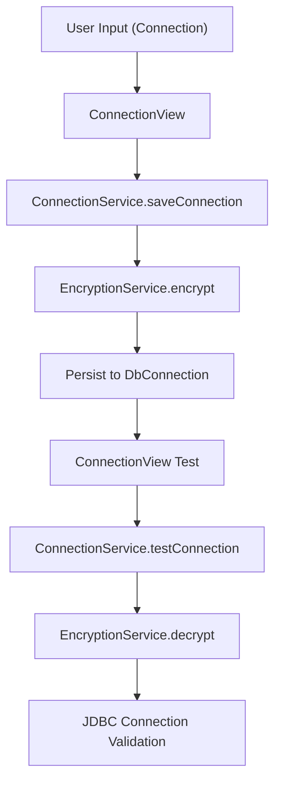
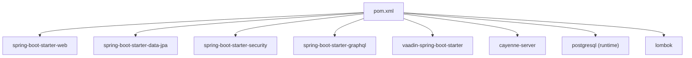
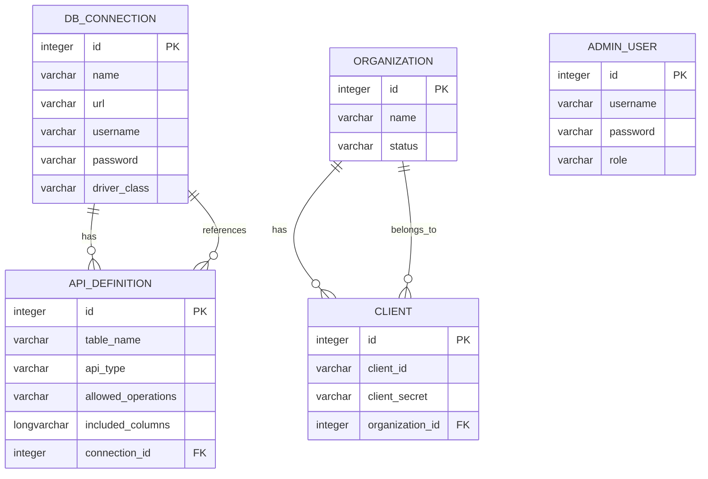

# Database Management

<cite>
**Referenced Files in This Document**
- [DbConnection.java](file://src/main/java/com/db2api/persistent/connection/DbConnection.java)
- [DbConnection.java](file://src/main/java/com/db2api/persistent/DbConnection.java)
- [DbConnectionRepository.java](file://src/main/java/com/db2api/repository/connection/DbConnectionRepository.java)
- [ConnectionService.java](file://src/main/java/com/db2api/service/connection/ConnectionService.java)
- [ExternalConnectivityService.java](file://src/main/java/com/db2api/service/connection/ExternalConnectivityService.java)
- [CayenneConfig.java](file://src/main/java/com/db2api/config/CayenneConfig.java)
- [EncryptionService.java](file://src/main/java/com/db2api/service/EncryptionService.java)
- [application.properties](file://src/main/resources/application.properties)
- [DynamicRestController.java](file://src/main/java/com/db2api/controller/DynamicRestController.java)
- [SchemaDiscoveryService.java](file://src/main/java/com/db2api/service/api/SchemaDiscoveryService.java)
- [ConnectionView.java](file://src/main/java/com/db2api/ui/connection/ConnectionView.java)
- [SecurityConfig.java](file://src/main/java/com/db2api/config/SecurityConfig.java)
- [cayenne-project.xml](file://src/main/resources/cayenne-project.xml)
- [datamap.map.xml](file://src/main/resources/datamap.map.xml)
- [pom.xml](file://pom.xml)
</cite>

## Table of Contents
1. [Introduction](#introduction)
2. [Project Structure](#project-structure)
3. [Core Components](#core-components)
4. [Architecture Overview](#architecture-overview)
5. [Detailed Component Analysis](#detailed-component-analysis)
6. [Dependency Analysis](#dependency-analysis)
7. [Performance Considerations](#performance-considerations)
8. [Troubleshooting Guide](#troubleshooting-guide)
9. [Conclusion](#conclusion)
10. [Appendices](#appendices)

## Introduction
This document provides comprehensive database management guidance for DB2API. It covers connection configuration, multi-database support via JDBC drivers, connection validation and testing, connection lifecycle management, security measures, and integration with Apache Cayenne for dynamic database interactions. Practical examples demonstrate configuring MySQL, PostgreSQL, and DB2 connections, along with troubleshooting and performance optimization strategies.

## Project Structure
The database management subsystem centers around:
- Entities for storing connection metadata and API mappings
- Services for encryption, connectivity, and schema discovery
- Controllers for dynamic REST endpoints
- UI for connection registration and testing
- Configuration for Cayenne and application properties

**Diagram sources**
- [DbConnection.java:16-84](file://src/main/java/com/db2api/persistent/connection/DbConnection.java#L16-L84)
- [ApiDefinition.java:13-56](file://src/main/java/com/db2api/persistent/api/ApiDefinition.java#L13-L56)
- [EncryptionService.java:14-58](file://src/main/java/com/db2api/service/EncryptionService.java#L14-L58)
- [ConnectionService.java:15-57](file://src/main/java/com/db2api/service/connection/ConnectionService.java#L15-L57)
- [ExternalConnectivityService.java:15-54](file://src/main/java/com/db2api/service/connection/ExternalConnectivityService.java#L15-L54)
- [SchemaDiscoveryService.java:15-59](file://src/main/java/com/db2api/service/api/SchemaDiscoveryService.java#L15-L59)
- [CayenneConfig.java:12-28](file://src/main/java/com/db2api/config/CayenneConfig.java#L12-L28)
- [cayenne-project.xml:1-5](file://src/main/resources/cayenne-project.xml#L1-L5)
- [datamap.map.xml:1-83](file://src/main/resources/datamap.map.xml#L1-L83)
- [DynamicRestController.java:21-168](file://src/main/java/com/db2api/controller/DynamicRestController.java#L21-L168)
- [ConnectionView.java:27-204](file://src/main/java/com/db2api/ui/connection/ConnectionView.java#L27-L204)

**Section sources**
- [DbConnection.java:12-84](file://src/main/java/com/db2api/persistent/connection/DbConnection.java#L12-L84)
- [ApiDefinition.java:9-56](file://src/main/java/com/db2api/persistent/api/ApiDefinition.java#L9-L56)
- [ConnectionService.java:15-57](file://src/main/java/com/db2api/service/connection/ConnectionService.java#L15-L57)
- [ExternalConnectivityService.java:15-54](file://src/main/java/com/db2api/service/connection/ExternalConnectivityService.java#L15-L54)
- [CayenneConfig.java:12-28](file://src/main/java/com/db2api/config/CayenneConfig.java#L12-L28)
- [application.properties:6-16](file://src/main/resources/application.properties#L6-L16)
- [DynamicRestController.java:21-168](file://src/main/java/com/db2api/controller/DynamicRestController.java#L21-L168)
- [ConnectionView.java:27-204](file://src/main/java/com/db2api/ui/connection/ConnectionView.java#L27-L204)

## Core Components
- DbConnection entity stores connection metadata (name, JDBC URL, username, encrypted password, driver class) and maintains a relationship to ApiDefinition instances.
- ConnectionService manages CRUD operations for DbConnection and performs connection tests by decrypting the stored password and validating connectivity via JDBC.
- ExternalConnectivityService builds Apache Cayenne ServerRuntime per DbConnection (cached) and provides ObjectContext for dynamic queries.
- EncryptionService provides AES-based encryption/decryption for sensitive connection passwords.
- SchemaDiscoveryService lists tables/columns from external databases using JDBC metadata.
- DynamicRestController exposes dynamic REST endpoints backed by external databases via Cayenne.
- UI (ConnectionView) allows administrators to register, test, and manage connections.

**Section sources**
- [DbConnection.java:16-84](file://src/main/java/com/db2api/persistent/connection/DbConnection.java#L16-L84)
- [DbConnectionRepository.java:7-12](file://src/main/java/com/db2api/repository/connection/DbConnectionRepository.java#L7-L12)
- [ConnectionService.java:15-57](file://src/main/java/com/db2api/service/connection/ConnectionService.java#L15-L57)
- [ExternalConnectivityService.java:15-54](file://src/main/java/com/db2api/service/connection/ExternalConnectivityService.java#L15-L54)
- [EncryptionService.java:14-58](file://src/main/java/com/db2api/service/EncryptionService.java#L14-L58)
- [SchemaDiscoveryService.java:15-59](file://src/main/java/com/db2api/service/api/SchemaDiscoveryService.java#L15-L59)
- [DynamicRestController.java:21-168](file://src/main/java/com/db2api/controller/DynamicRestController.java#L21-L168)
- [ConnectionView.java:27-204](file://src/main/java/com/db2api/ui/connection/ConnectionView.java#L27-L204)

## Architecture Overview
The system integrates Spring Boot, Apache Cayenne, and JDBC to enable dynamic API generation from external databases. The flow below illustrates how a request to a dynamic endpoint is routed through the controller to the external database via Cayenne.

**Diagram sources**
- [DynamicRestController.java:47-81](file://src/main/java/com/db2api/controller/DynamicRestController.java#L47-L81)
- [ExternalConnectivityService.java:25-31](file://src/main/java/com/db2api/service/connection/ExternalConnectivityService.java#L25-L31)
- [DbConnection.java:16-57](file://src/main/java/com/db2api/persistent/connection/DbConnection.java#L16-L57)

## Detailed Component Analysis

### DbConnection Entity
DbConnection persists connection configurations and enforces referential integrity with ApiDefinition. It stores:
- Name: human-readable label
- JDBC URL: target database endpoint
- Username: authentication identifier
- Password: encrypted credential
- Driver class: fully qualified JDBC driver name
- Bidirectional relationship with ApiDefinition via connection_id

**Diagram sources**
- [DbConnection.java:16-84](file://src/main/java/com/db2api/persistent/connection/DbConnection.java#L16-L84)
- [ApiDefinition.java:13-56](file://src/main/java/com/db2api/persistent/api/ApiDefinition.java#L13-L56)

**Section sources**
- [DbConnection.java:16-84](file://src/main/java/com/db2api/persistent/connection/DbConnection.java#L16-L84)
- [datamap.map.xml:27-34](file://src/main/resources/datamap.map.xml#L27-L34)
- [datamap.map.xml:72-74](file://src/main/resources/datamap.map.xml#L72-L74)

### Connection Lifecycle Management
- Creation and persistence: ConnectionService saves DbConnection instances, encrypting the password prior to storage.
- Validation: ConnectionService.testConnection decrypts the password and attempts a JDBC connection validity check.
- Runtime caching: ExternalConnectivityService caches a ServerRuntime per DbConnection id and invalidates it when needed.

**Diagram sources**
- [ConnectionService.java:30-56](file://src/main/java/com/db2api/service/connection/ConnectionService.java#L30-L56)
- [EncryptionService.java:35-57](file://src/main/java/com/db2api/service/EncryptionService.java#L35-L57)
- [ExternalConnectivityService.java:25-38](file://src/main/java/com/db2api/service/connection/ExternalConnectivityService.java#L25-L38)

**Section sources**
- [ConnectionService.java:15-57](file://src/main/java/com/db2api/service/connection/ConnectionService.java#L15-L57)
- [ExternalConnectivityService.java:15-54](file://src/main/java/com/db2api/service/connection/ExternalConnectivityService.java#L15-L54)
- [EncryptionService.java:14-58](file://src/main/java/com/db2api/service/EncryptionService.java#L14-L58)

### External Connectivity Service and Apache Cayenne Integration
- ExternalConnectivityService builds a DataSource from DbConnection fields and creates a ServerRuntime per connection id.
- It caches ServerRuntime instances in a concurrent map to avoid repeated initialization overhead.
- getContext returns a fresh ObjectContext for executing queries.

**Diagram sources**
- [ExternalConnectivityService.java:15-54](file://src/main/java/com/db2api/service/connection/ExternalConnectivityService.java#L15-L54)
- [CayenneConfig.java:12-28](file://src/main/java/com/db2api/config/CayenneConfig.java#L12-L28)

**Section sources**
- [ExternalConnectivityService.java:15-54](file://src/main/java/com/db2api/service/connection/ExternalConnectivityService.java#L15-L54)
- [CayenneConfig.java:12-28](file://src/main/java/com/db2api/config/CayenneConfig.java#L12-L28)
- [cayenne-project.xml:1-5](file://src/main/resources/cayenne-project.xml#L1-L5)
- [datamap.map.xml:1-83](file://src/main/resources/datamap.map.xml#L1-L83)

### Connection Validation and Testing
- ConnectionService.testConnection decrypts the stored password and validates connectivity using JDBC’s isValid(timeout).
- SchemaDiscoveryService demonstrates live metadata retrieval by connecting to the external database and enumerating tables and columns.

**Diagram sources**
- [ConnectionView.java:114-125](file://src/main/java/com/db2api/ui/connection/ConnectionView.java#L114-L125)
- [ConnectionService.java:47-56](file://src/main/java/com/db2api/service/connection/ConnectionService.java#L47-L56)
- [EncryptionService.java:47-57](file://src/main/java/com/db2api/service/EncryptionService.java#L47-L57)

**Section sources**
- [ConnectionService.java:47-56](file://src/main/java/com/db2api/service/connection/ConnectionService.java#L47-L56)
- [SchemaDiscoveryService.java:24-40](file://src/main/java/com/db2api/service/api/SchemaDiscoveryService.java#L24-L40)
- [ConnectionView.java:114-125](file://src/main/java/com/db2api/ui/connection/ConnectionView.java#L114-L125)

### Multi-Database Support (MySQL, PostgreSQL, DB2)
- The system supports multiple databases by specifying the appropriate JDBC URL and driver class in DbConnection.
- Supported drivers present in the project include PostgreSQL; MySQL and DB2 drivers can be added similarly.

Practical configuration examples (described):
- PostgreSQL: Use the existing system database configuration as a template and adjust the JDBC URL and driver class accordingly.
- MySQL: Set the JDBC URL to the MySQL endpoint and the driver class to the MySQL JDBC driver.
- DB2: Set the JDBC URL to the DB2 endpoint and the driver class to the DB2 JDBC driver.

Note: Ensure the corresponding JDBC driver artifact is available in the build dependencies.

**Section sources**
- [application.properties:6-16](file://src/main/resources/application.properties#L6-L16)
- [pom.xml:60-65](file://pom.xml#L60-L65)

### Security Measures
- EncryptionService: AES-based encryption/decryption of connection passwords using a configurable secret key.
- UI Role-based Access: Only users with ADMIN role can create, edit, or delete connections.
- Authentication: SecurityConfig configures Vaadin login and BCrypt password encoding.

**Diagram sources**
- [ConnectionView.java:86-125](file://src/main/java/com/db2api/ui/connection/ConnectionView.java#L86-L125)
- [ConnectionService.java:30-37](file://src/main/java/com/db2api/service/connection/ConnectionService.java#L30-L37)
- [EncryptionService.java:35-57](file://src/main/java/com/db2api/service/EncryptionService.java#L35-L57)

**Section sources**
- [EncryptionService.java:14-58](file://src/main/java/com/db2api/service/EncryptionService.java#L14-L58)
- [SecurityConfig.java:15-51](file://src/main/java/com/db2api/config/SecurityConfig.java#L15-L51)
- [ConnectionView.java:46-54](file://src/main/java/com/db2api/ui/connection/ConnectionView.java#L46-L54)

## Dependency Analysis
The database management stack relies on:
- Spring Boot starters for web, data JPA, security, and GraphQL
- Apache Cayenne for ORM and dynamic query execution
- PostgreSQL JDBC driver included; MySQL/DB2 drivers can be added via Maven
- Lombok for concise entity definitions

**Diagram sources**
- [pom.xml:25-99](file://pom.xml#L25-L99)

**Section sources**
- [pom.xml:16-99](file://pom.xml#L16-L99)

## Performance Considerations
- Connection pooling: ExternalConnectivityService caches ServerRuntime per connection id. For high concurrency, integrate a production-grade DataSource provider (e.g., HikariCP) via Cayenne’s DataSource builder to enable pooling.
- Query optimization: Limit returned columns using ApiDefinition.includedColumns and restrict tables/views via ApiDefinition.tableName.
- Encryption overhead: EncryptionService prepares keys per operation; consider caching the SecretKeySpec if acceptable for your threat model.
- Metadata discovery: SchemaDiscoveryService performs live JDBC metadata queries; cache discovered schemas at the application level to reduce repeated round-trips.

[No sources needed since this section provides general guidance]

## Troubleshooting Guide
Common issues and resolutions:
- Connection test fails:
  - Verify JDBC URL, username, and driver class in DbConnection.
  - Confirm the external database is reachable and accepts connections.
  - Ensure the stored password is encrypted and decryptions succeed.
- Dynamic endpoint returns errors:
  - Check ApiDefinition.allowedOperations and ApiDefinition.tableName.
  - Validate that the external database contains the specified table.
  - Inspect logs for SQL exceptions during query execution.
- UI actions disabled:
  - Ensure the authenticated user has ADMIN role.

**Section sources**
- [ConnectionService.java:47-56](file://src/main/java/com/db2api/service/connection/ConnectionService.java#L47-L56)
- [DynamicRestController.java:47-81](file://src/main/java/com/db2api/controller/DynamicRestController.java#L47-L81)
- [ConnectionView.java:46-54](file://src/main/java/com/db2api/ui/connection/ConnectionView.java#L46-L54)

## Conclusion
DB2API provides a flexible foundation for dynamic database-driven APIs. By leveraging DbConnection entities, ConnectionService, ExternalConnectivityService, and EncryptionService, the system supports multi-database environments, secure credential handling, and scalable connectivity through Cayenne. For production deployments, integrate connection pooling, enforce stricter encryption policies, and monitor connectivity and query performance.

[No sources needed since this section summarizes without analyzing specific files]

## Appendices

### Appendix A: Connection Configuration Examples
- PostgreSQL (system DB): See application properties for URL, username, password, and driver class.
- MySQL/DB2: Add the respective JDBC driver dependency and configure DbConnection with the matching JDBC URL and driver class.

**Section sources**
- [application.properties:6-16](file://src/main/resources/application.properties#L6-L16)
- [pom.xml:60-65](file://pom.xml#L60-L65)

### Appendix B: Data Model Overview

**Diagram sources**
- [datamap.map.xml:27-39](file://src/main/resources/datamap.map.xml#L27-L39)
- [datamap.map.xml:45-50](file://src/main/resources/datamap.map.xml#L45-L50)
- [datamap.map.xml:51-54](file://src/main/resources/datamap.map.xml#L51-L54)
- [datamap.map.xml:55-65](file://src/main/resources/datamap.map.xml#L55-L65)
- [datamap.map.xml:66-77](file://src/main/resources/datamap.map.xml#L66-L77)