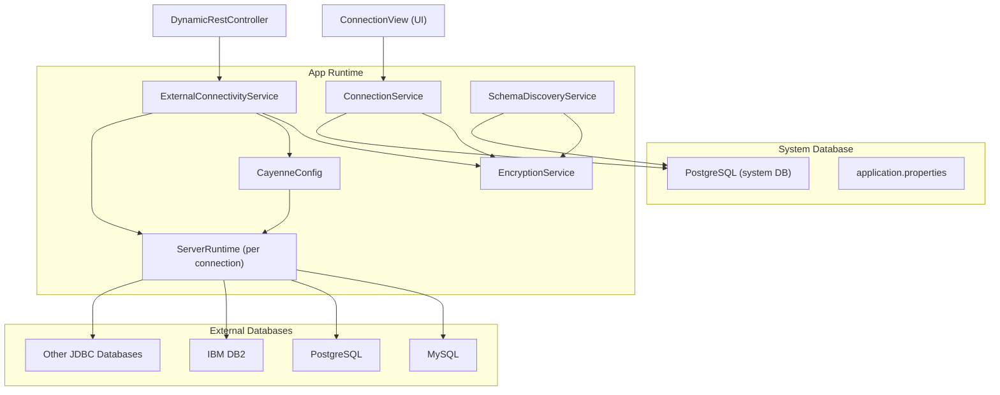
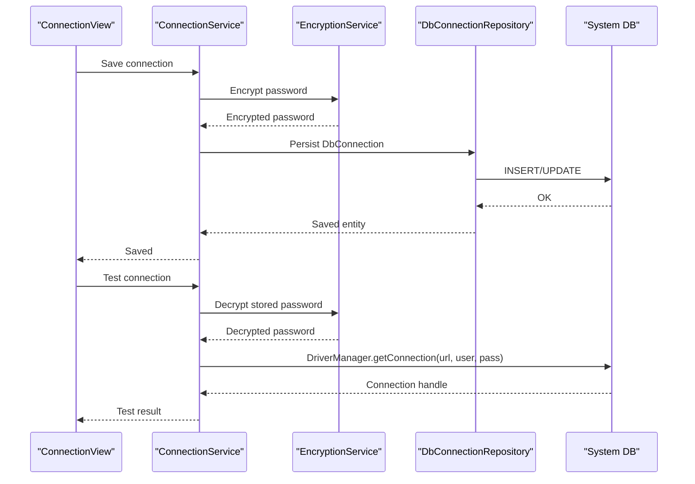
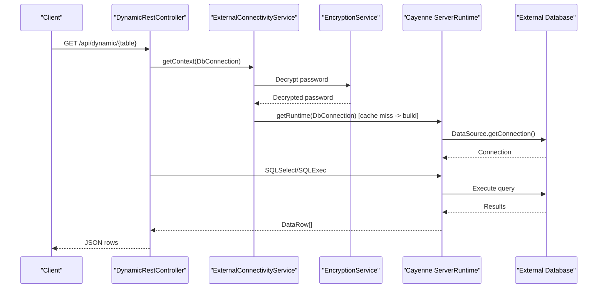
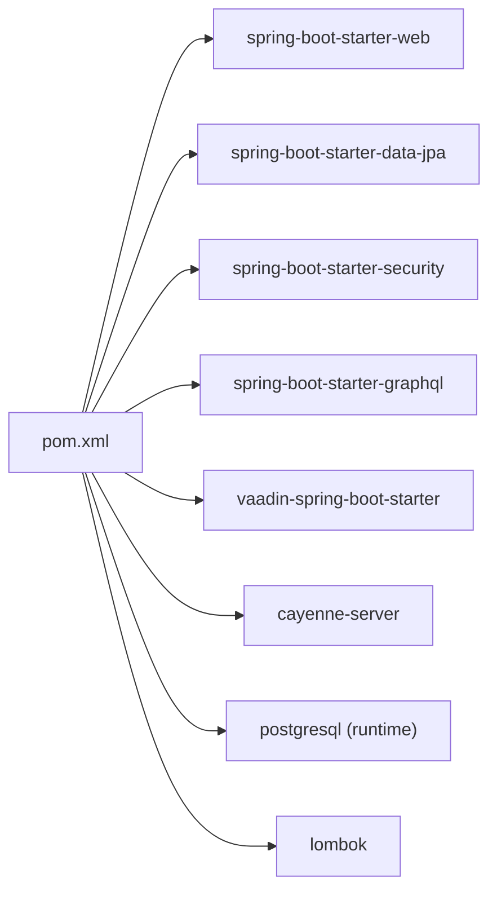

# Multi-Database Support

<cite>
**Referenced Files in This Document**
- [DbConnection.java](file://src/main/java/com/db2api/persistent/connection/DbConnection.java)
- [DbConnectionRepository.java](file://src/main/java/com/db2api/repository/connection/DbConnectionRepository.java)
- [ConnectionService.java](file://src/main/java/com/db2api/service/connection/ConnectionService.java)
- [ExternalConnectivityService.java](file://src/main/java/com/db2api/service/connection/ExternalConnectivityService.java)
- [SchemaDiscoveryService.java](file://src/main/java/com/db2api/service/api/SchemaDiscoveryService.java)
- [CayenneConfig.java](file://src/main/java/com/db2api/config/CayenneConfig.java)
- [EncryptionService.java](file://src/main/java/com/db2api/service/EncryptionService.java)
- [application.properties](file://src/main/resources/application.properties)
- [cayenne-project.xml](file://src/main/resources/cayenne-project.xml)
- [datamap.map.xml](file://src/main/resources/datamap.map.xml)
- [DynamicRestController.java](file://src/main/java/com/db2api/controller/DynamicRestController.java)
- [ConnectionView.java](file://src/main/java/com/db2api/ui/connection/ConnectionView.java)
- [pom.xml](file://pom.xml)
</cite>

## Table of Contents
1. [Introduction](#introduction)
2. [Project Structure](#project-structure)
3. [Core Components](#core-components)
4. [Architecture Overview](#architecture-overview)
5. [Detailed Component Analysis](#detailed-component-analysis)
6. [Dependency Analysis](#dependency-analysis)
7. [Performance Considerations](#performance-considerations)
8. [Troubleshooting Guide](#troubleshooting-guide)
9. [Conclusion](#conclusion)
10. [Appendices](#appendices)

## Introduction
This document explains how DB2API supports multiple database backends through JDBC. It covers how the application stores connection metadata, loads drivers dynamically via JDBC URLs and driver classes, and executes queries against external databases using Apache Cayenne. It also documents configuration, security, and operational guidance for MySQL, PostgreSQL, DB2, and other JDBC-compatible databases.

## Project Structure
The multi-database capability centers around:
- Persistent entity for storing connection metadata
- Services for encryption, connectivity, schema discovery, and runtime caching
- Spring Boot configuration for the system database
- Apache Cayenne configuration for dynamic external database access
- UI for managing connections and testing connectivity

**Diagram sources**
- [application.properties:1-20](file://src/main/resources/application.properties#L1-L20)
- [EncryptionService.java:1-59](file://src/main/java/com/db2api/service/EncryptionService.java#L1-L59)
- [ConnectionService.java:1-58](file://src/main/java/com/db2api/service/connection/ConnectionService.java#L1-L58)
- [ExternalConnectivityService.java:1-55](file://src/main/java/com/db2api/service/connection/ExternalConnectivityService.java#L1-L55)
- [SchemaDiscoveryService.java:1-60](file://src/main/java/com/db2api/service/api/SchemaDiscoveryService.java#L1-L60)
- [CayenneConfig.java:1-29](file://src/main/java/com/db2api/config/CayenneConfig.java#L1-L29)
- [DynamicRestController.java:1-168](file://src/main/java/com/db2api/controller/DynamicRestController.java#L1-L168)
- [ConnectionView.java:1-204](file://src/main/java/com/db2api/ui/connection/ConnectionView.java#L1-L204)

**Section sources**
- [application.properties:1-20](file://src/main/resources/application.properties#L1-L20)
- [pom.xml:1-130](file://pom.xml#L1-L130)

## Core Components
- DbConnection entity: stores JDBC URL, username, encrypted password, and driver class for external databases.
- ConnectionService: CRUD for DbConnection, encryption before persisting, and connectivity tests via DriverManager.
- ExternalConnectivityService: builds DataSource per DbConnection and caches ServerRuntime instances keyed by connection ID.
- SchemaDiscoveryService: introspects external databases for tables/columns using JDBC DatabaseMetaData.
- EncryptionService: AES-based encryption/decryption of secrets.
- CayenneConfig: registers a primary ServerRuntime bound to the system database.
- DynamicRestController: translates REST requests into SQL executed against external databases via Cayenne.

**Section sources**
- [DbConnection.java:1-85](file://src/main/java/com/db2api/persistent/connection/DbConnection.java#L1-L85)
- [DbConnectionRepository.java:1-13](file://src/main/java/com/db2api/repository/connection/DbConnectionRepository.java#L1-L13)
- [ConnectionService.java:1-58](file://src/main/java/com/db2api/service/connection/ConnectionService.java#L1-L58)
- [ExternalConnectivityService.java:1-55](file://src/main/java/com/db2api/service/connection/ExternalConnectivityService.java#L1-L55)
- [SchemaDiscoveryService.java:1-60](file://src/main/java/com/db2api/service/api/SchemaDiscoveryService.java#L1-L60)
- [EncryptionService.java:1-59](file://src/main/java/com/db2api/service/EncryptionService.java#L1-L59)
- [CayenneConfig.java:1-29](file://src/main/java/com/db2api/config/CayenneConfig.java#L1-L29)
- [DynamicRestController.java:1-168](file://src/main/java/com/db2api/controller/DynamicRestController.java#L1-L168)

## Architecture Overview
DB2API separates concerns:
- System database: managed by Spring Boot JPA/Hibernate for app metadata (including DbConnection).
- External databases: accessed via JDBC through Apache Cayenne, with per-connection runtime caching.

**Diagram sources**
- [ConnectionView.java:80-125](file://src/main/java/com/db2api/ui/connection/ConnectionView.java#L80-L125)
- [ConnectionService.java:30-56](file://src/main/java/com/db2api/service/connection/ConnectionService.java#L30-L56)
- [EncryptionService.java:35-57](file://src/main/java/com/db2api/service/EncryptionService.java#L35-L57)
- [DbConnectionRepository.java:10-12](file://src/main/java/com/db2api/repository/connection/DbConnectionRepository.java#L10-L12)

**Diagram sources**
- [DynamicRestController.java:47-81](file://src/main/java/com/db2api/controller/DynamicRestController.java#L47-L81)
- [ExternalConnectivityService.java:25-53](file://src/main/java/com/db2api/service/connection/ExternalConnectivityService.java#L25-L53)
- [EncryptionService.java:47-52](file://src/main/java/com/db2api/service/EncryptionService.java#L47-L52)

## Detailed Component Analysis

### JDBC Driver Integration and Loading
- Driver loading: The application relies on the JDBC driver being resolvable by the JDBC URL and driver class. The DataSource is built using the driver class name and URL, delegating driver resolution to the JDBC driver present in the runtime classpath.
- Supported databases: Any JDBC-compliant database can be used as long as the correct driver is included in the runtime classpath and the driver class name is set accordingly.

Practical guidance:
- Ensure the appropriate JDBC driver dependency is present in the build configuration.
- Set the driver class property to the fully qualified JDBC driver class name.
- Provide a JDBC URL that matches the target database’s format.

**Section sources**
- [ExternalConnectivityService.java:40-48](file://src/main/java/com/db2api/service/connection/ExternalConnectivityService.java#L40-L48)
- [DbConnection.java:54-57](file://src/main/java/com/db2api/persistent/connection/DbConnection.java#L54-L57)
- [pom.xml:25-99](file://pom.xml#L25-L99)

### Connection URL Formatting and Parameters
- JDBC URL: Stored in the DbConnection entity and used to establish connections.
- Connection parameters: username, password (encrypted at rest), and driver class are stored alongside the URL.
- Additional driver-specific parameters: Can be appended to the JDBC URL as needed (for example, SSL, timeouts, or vendor-specific options).

Note: The application does not parse or modify URLs; it passes them directly to the JDBC driver.

**Section sources**
- [DbConnection.java:36-57](file://src/main/java/com/db2api/persistent/connection/DbConnection.java#L36-L57)
- [ExternalConnectivityService.java:43-47](file://src/main/java/com/db2api/service/connection/ExternalConnectivityService.java#L43-L47)

### Database Type Detection and Compatibility
- No explicit database type detection is implemented in the codebase. The system relies on the provided driver class and JDBC URL to connect.
- Compatibility depends on the JDBC driver availability and adherence to standard SQL/DDL for schema discovery and query execution.

Recommendation:
- Choose a JDBC driver that supports the target database version and set the driver class accordingly.
- Validate connectivity using the built-in test action in the UI.

**Section sources**
- [ConnectionService.java:47-56](file://src/main/java/com/db2api/service/connection/ConnectionService.java#L47-L56)
- [ConnectionView.java:114-125](file://src/main/java/com/db2api/ui/connection/ConnectionView.java#L114-L125)

### Driver Class Configuration
- The driver class is stored as part of the DbConnection entity and is used when building the DataSource.
- Ensure the driver class corresponds to the selected JDBC driver dependency.

**Section sources**
- [DbConnection.java:54-57](file://src/main/java/com/db2api/persistent/connection/DbConnection.java#L54-L57)
- [ExternalConnectivityService.java:45](file://src/main/java/com/db2api/service/connection/ExternalConnectivityService.java#L45)

### Security and Secrets Management
- Passwords are encrypted before persistence and decrypted at runtime for connection attempts.
- Encryption uses a symmetric key derived from a configurable secret.

Operational note:
- Configure the encryption secret appropriately for your deployment environment.

**Section sources**
- [ConnectionService.java:30-36](file://src/main/java/com/db2api/service/connection/ConnectionService.java#L30-L36)
- [EncryptionService.java:18-33](file://src/main/java/com/db2api/service/EncryptionService.java#L18-L33)
- [EncryptionService.java:47-57](file://src/main/java/com/db2api/service/EncryptionService.java#L47-L57)

### Schema Discovery and Dynamic Queries
- SchemaDiscoveryService uses JDBC DatabaseMetaData to list tables and columns for a given connection.
- DynamicRestController executes SQL against external databases via Cayenne, selecting columns as configured.

**Section sources**
- [SchemaDiscoveryService.java:24-40](file://src/main/java/com/db2api/service/api/SchemaDiscoveryService.java#L24-L40)
- [SchemaDiscoveryService.java:42-58](file://src/main/java/com/db2api/service/api/SchemaDiscoveryService.java#L42-L58)
- [DynamicRestController.java:60-81](file://src/main/java/com/db2api/controller/DynamicRestController.java#L60-L81)

### System Database Configuration
- The system database (for app metadata) is configured via Spring Boot properties, including dialect and driver class.
- This is separate from external database connections.

**Section sources**
- [application.properties:6-16](file://src/main/resources/application.properties#L6-L16)

### UI and Operational Workflows
- ConnectionView provides forms to create, edit, save, delete, and test connections.
- Test action validates connectivity using the stored credentials and URL.

**Section sources**
- [ConnectionView.java:132-202](file://src/main/java/com/db2api/ui/connection/ConnectionView.java#L132-L202)
- [ConnectionService.java:47-56](file://src/main/java/com/db2api/service/connection/ConnectionService.java#L47-L56)

## Dependency Analysis
The runtime depends on:
- Spring Boot starters for web, data JPA, security, GraphQL, and Vaadin
- Apache Cayenne for ORM and runtime binding
- Database drivers as declared dependencies (e.g., PostgreSQL)
- Lombok for concise entity definitions

**Diagram sources**
- [pom.xml:25-99](file://pom.xml#L25-L99)

**Section sources**
- [pom.xml:1-130](file://pom.xml#L1-L130)

## Performance Considerations
- Per-connection runtime caching: ExternalConnectivityService caches ServerRuntime instances keyed by connection ID to avoid repeated DataSource and runtime construction overhead.
- Connection validity checks: ConnectionService uses connection.isValid to quickly validate live connections during tests.
- Query execution: DynamicRestController constructs simple SQL statements; consider pagination and column selection limits for large datasets.

Recommendations:
- Reuse connections where possible; leverage the existing cache.
- Limit included columns and apply filters to reduce payload sizes.
- Monitor external database performance and adjust driver/network settings as needed.

**Section sources**
- [ExternalConnectivityService.java:18-38](file://src/main/java/com/db2api/service/connection/ExternalConnectivityService.java#L18-L38)
- [ConnectionService.java:47-56](file://src/main/java/com/db2api/service/connection/ConnectionService.java#L47-L56)
- [DynamicRestController.java:63-76](file://src/main/java/com/db2api/controller/DynamicRestController.java#L63-L76)

## Troubleshooting Guide
Common issues and resolutions:
- Driver class not found
  - Cause: Incorrect driver class name or missing driver dependency.
  - Resolution: Verify the driver class in DbConnection and ensure the corresponding JDBC driver is included in the runtime classpath.
- Connection fails during test/save
  - Cause: Wrong URL, username, or password; network/firewall issues; driver mismatch.
  - Resolution: Confirm the JDBC URL format and driver class; test connectivity externally; check logs for SQLException details.
- Schema discovery returns empty lists
  - Cause: Insufficient privileges or incorrect catalog/schema pattern.
  - Resolution: Ensure the user has permissions to query metadata; adjust client-side filtering if needed.
- Runtime errors when executing dynamic queries
  - Cause: SQL syntax differences across databases; missing columns; permission issues.
  - Resolution: Validate SQL against the target database; confirm column inclusion and permissions.

Operational tips:
- Use the UI “Test Connection” action to validate connectivity before enabling APIs.
- Review server logs for stack traces when connectivity or query execution fails.

**Section sources**
- [ConnectionView.java:114-125](file://src/main/java/com/db2api/ui/connection/ConnectionView.java#L114-L125)
- [ConnectionService.java:47-56](file://src/main/java/com/db2api/service/connection/ConnectionService.java#L47-L56)
- [SchemaDiscoveryService.java:24-40](file://src/main/java/com/db2api/service/api/SchemaDiscoveryService.java#L24-L40)
- [DynamicRestController.java:77-81](file://src/main/java/com/db2api/controller/DynamicRestController.java#L77-L81)

## Conclusion
DB2API enables multi-database connectivity by storing connection metadata and leveraging JDBC with Apache Cayenne. The design allows pluggable drivers and external databases by configuring the JDBC URL, driver class, and credentials. Security is addressed through encryption at rest and decryption at runtime. The UI simplifies connection management and testing, while runtime caching improves performance for repeated operations.

## Appendices

### Practical Examples: Connection Configuration
- PostgreSQL
  - JDBC URL: jdbc:postgresql://host:port/dbname
  - Driver class: org.postgresql.Driver
  - Notes: Ensure the PostgreSQL JDBC driver is available in the runtime classpath.
- MySQL
  - JDBC URL: jdbc:mysql://host:port/dbname?useSSL=false&serverTimezone=UTC
  - Driver class: com.mysql.cj.jdbc.Driver
  - Notes: Add the MySQL Connector/J dependency and configure SSL/timezone as needed.
- IBM DB2
  - JDBC URL: jdbc:db2://host:port/dbname
  - Driver class: com.ibm.db2.jcc.DB2Driver
  - Notes: Include the IBM Data Server Driver for JDBC and SQLJ.
- Other JDBC Databases
  - Steps: Add the appropriate JDBC driver dependency, set the driver class, and provide a compatible JDBC URL.

[No sources needed since this section provides general guidance]