# Security Measures

<cite>
**Referenced Files in This Document**
- [SecurityConfig.java](file://src/main/java/com/db2api/config/SecurityConfig.java)
- [EncryptionService.java](file://src/main/java/com/db2api/service/EncryptionService.java)
- [DbConnection.java](file://src/main/java/com/db2api/persistent/connection/DbConnection.java)
- [DbConnectionRepository.java](file://src/main/java/com/db2api/repository/connection/DbConnectionRepository.java)
- [ConnectionService.java](file://src/main/java/com/db2api/service/connection/ConnectionService.java)
- [SchemaDiscoveryService.java](file://src/main/java/com/db2api/service/api/SchemaDiscoveryService.java)
- [ExternalConnectivityService.java](file://src/main/java/com/db2api/service/connection/ExternalConnectivityService.java)
- [AuthController.java](file://src/main/java/com/db2api/controller/AuthController.java)
- [RequestLoggingFilter.java](file://src/main/java/com/db2api/config/RequestLoggingFilter.java)
- [application.properties](file://src/main/resources/application.properties)
- [SECURITY.md](file://SECURITY.md)
</cite>

## Table of Contents
1. [Introduction](#introduction)
2. [Project Structure](#project-structure)
3. [Core Components](#core-components)
4. [Architecture Overview](#architecture-overview)
5. [Detailed Component Analysis](#detailed-component-analysis)
6. [Dependency Analysis](#dependency-analysis)
7. [Performance Considerations](#performance-considerations)
8. [Troubleshooting Guide](#troubleshooting-guide)
9. [Conclusion](#conclusion)
10. [Appendices](#appendices)

## Introduction
This document details the database connection security measures implemented in DB2API. It focuses on encryption of database credentials, secure storage mechanisms, and password protection strategies. It also explains the encryption service integration, cryptographic algorithms used, and key management practices. Guidance is provided for secure connection configuration, credential rotation procedures, access control, audit logging, and security monitoring. Finally, it outlines common vulnerabilities and mitigation strategies for database connection management.

## Project Structure
Security-relevant components are organized across configuration, persistence, service, controller, and filter layers:
- Configuration: Security policies, JWT decoding, and request logging
- Persistence: Database connection entity storing encrypted credentials
- Services: Encryption, connection lifecycle, schema discovery, and external connectivity
- Controllers: OAuth2 token issuance using encrypted client secrets
- Filters: Request logging for monitoring

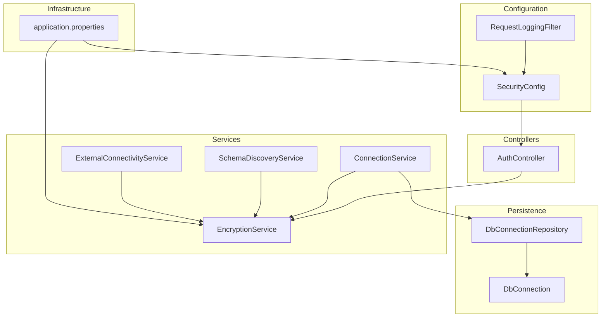

**Diagram sources**
- [SecurityConfig.java:53-62](file://src/main/java/com/db2api/config/SecurityConfig.java#L53-L62)
- [RequestLoggingFilter.java:31-48](file://src/main/java/com/db2api/config/RequestLoggingFilter.java#L31-L48)
- [EncryptionService.java:21-112](file://src/main/java/com/db2api/service/EncryptionService.java#L21-L112)
- [DbConnection.java:16-84](file://src/main/java/com/db2api/persistent/connection/DbConnection.java#L16-L84)
- [DbConnectionRepository.java:10-12](file://src/main/java/com/db2api/repository/connection/DbConnectionRepository.java#L10-L12)
- [ConnectionService.java:15-57](file://src/main/java/com/db2api/service/connection/ConnectionService.java#L15-L57)
- [SchemaDiscoveryService.java:15-59](file://src/main/java/com/db2api/service/api/SchemaDiscoveryService.java#L15-L59)
- [ExternalConnectivityService.java:15-54](file://src/main/java/com/db2api/service/connection/ExternalConnectivityService.java#L15-L54)
- [AuthController.java:25-111](file://src/main/java/com/db2api/controller/AuthController.java#L25-L111)
- [application.properties:1-20](file://src/main/resources/application.properties#L1-L20)

**Section sources**
- [SecurityConfig.java:28-91](file://src/main/java/com/db2api/config/SecurityConfig.java#L28-L91)
- [EncryptionService.java:16-112](file://src/main/java/com/db2api/service/EncryptionService.java#L16-L112)
- [DbConnection.java:12-84](file://src/main/java/com/db2api/persistent/connection/DbConnection.java#L12-L84)
- [DbConnectionRepository.java:7-12](file://src/main/java/com/db2api/repository/connection/DbConnectionRepository.java#L7-L12)
- [ConnectionService.java:15-57](file://src/main/java/com/db2api/service/connection/ConnectionService.java#L15-L57)
- [SchemaDiscoveryService.java:15-59](file://src/main/java/com/db2api/service/api/SchemaDiscoveryService.java#L15-L59)
- [ExternalConnectivityService.java:15-54](file://src/main/java/com/db2api/service/connection/ExternalConnectivityService.java#L15-L54)
- [AuthController.java:25-111](file://src/main/java/com/db2api/controller/AuthController.java#L25-L111)
- [RequestLoggingFilter.java:14-50](file://src/main/java/com/db2api/config/RequestLoggingFilter.java#L14-L50)
- [application.properties:1-20](file://src/main/resources/application.properties#L1-L20)

## Core Components
- EncryptionService: Implements AES/GCM authenticated encryption for sensitive data such as database and client secrets. It derives a 256-bit AES key from a configured secret using SHA-256, generates a random 96-bit IV per encryption, and prepends the IV to the ciphertext for decryption.
- DbConnection: JPA entity that stores connection metadata and the encrypted password. It maintains associations with API definitions.
- ConnectionService: Orchestrates saving and testing connections. It encrypts passwords before persisting and decrypts them for validation/testing.
- SchemaDiscoveryService and ExternalConnectivityService: Decrypt stored credentials to establish JDBC connections for schema discovery and Cayenne runtime creation.
- AuthController: Validates client credentials by decrypting stored secrets and issuing JWT tokens for authorized clients.
- SecurityConfig: Configures stateless JWT authentication for dynamic API endpoints and sets up the JWT decoder using a base64-encoded secret.
- RequestLoggingFilter: Logs request method, URI, status, and duration; includes a placeholder for persisting logs to the database for monitoring.

**Section sources**
- [EncryptionService.java:21-112](file://src/main/java/com/db2api/service/EncryptionService.java#L21-L112)
- [DbConnection.java:16-84](file://src/main/java/com/db2api/persistent/connection/DbConnection.java#L16-L84)
- [ConnectionService.java:15-57](file://src/main/java/com/db2api/service/connection/ConnectionService.java#L15-L57)
- [SchemaDiscoveryService.java:15-59](file://src/main/java/com/db2api/service/api/SchemaDiscoveryService.java#L15-L59)
- [ExternalConnectivityService.java:15-54](file://src/main/java/com/db2api/service/connection/ExternalConnectivityService.java#L15-L54)
- [AuthController.java:25-111](file://src/main/java/com/db2api/controller/AuthController.java#L25-L111)
- [SecurityConfig.java:53-89](file://src/main/java/com/db2api/config/SecurityConfig.java#L53-L89)
- [RequestLoggingFilter.java:18-48](file://src/main/java/com/db2api/config/RequestLoggingFilter.java#L18-L48)

## Architecture Overview
The security architecture integrates encryption at rest for credentials, authenticated access for dynamic APIs, and controlled decryption for operational tasks.

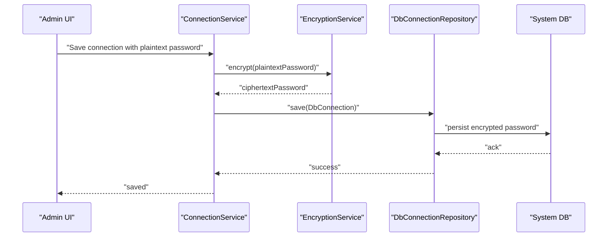

**Diagram sources**
- [ConnectionService.java:30-37](file://src/main/java/com/db2api/service/connection/ConnectionService.java#L30-L37)
- [EncryptionService.java:59-81](file://src/main/java/com/db2api/service/EncryptionService.java#L59-L81)
- [DbConnectionRepository.java:10-12](file://src/main/java/com/db2api/repository/connection/DbConnectionRepository.java#L10-L12)

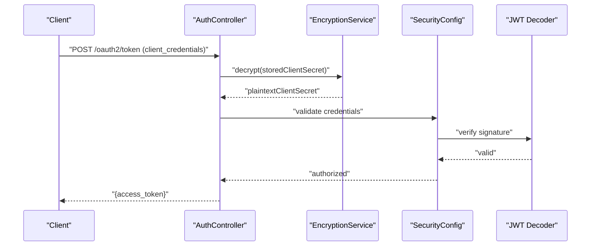

**Diagram sources**
- [AuthController.java:54-109](file://src/main/java/com/db2api/controller/AuthController.java#L54-L109)
- [EncryptionService.java:89-110](file://src/main/java/com/db2api/service/EncryptionService.java#L89-L110)
- [SecurityConfig.java:70-79](file://src/main/java/com/db2api/config/SecurityConfig.java#L70-L79)

## Detailed Component Analysis

### EncryptionService
- Cryptographic algorithm: AES/GCM with NoPadding
- Key derivation: SHA-256 hash of the configured secret material, truncated to 32 bytes for AES-256
- Initialization vector: Random 12-byte IV generated per encryption and prepended to the ciphertext
- Authentication tag: 128-bit tag included by GCM for integrity verification
- Decryption: Extracts IV from the beginning of the ciphertext, initializes cipher with GCM spec, and verifies authenticity

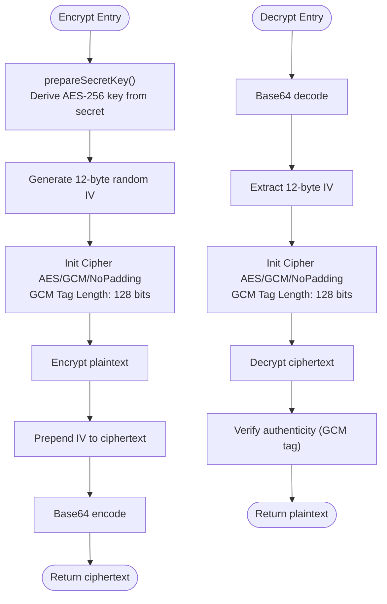

**Diagram sources**
- [EncryptionService.java:39-49](file://src/main/java/com/db2api/service/EncryptionService.java#L39-L49)
- [EncryptionService.java:60-81](file://src/main/java/com/db2api/service/EncryptionService.java#L60-L81)
- [EncryptionService.java:89-110](file://src/main/java/com/db2api/service/EncryptionService.java#L89-L110)

**Section sources**
- [EncryptionService.java:21-112](file://src/main/java/com/db2api/service/EncryptionService.java#L21-L112)

### DbConnection and DbConnectionRepository
- Stores connection metadata and the encrypted password
- Maintains bidirectional association with API definitions
- Repository provides standard persistence operations

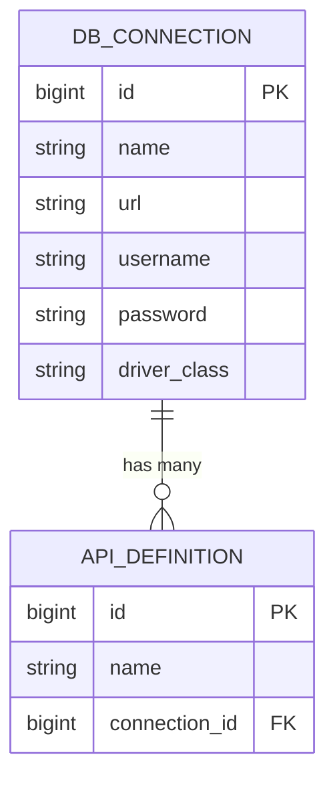

**Diagram sources**
- [DbConnection.java:16-84](file://src/main/java/com/db2api/persistent/connection/DbConnection.java#L16-L84)
- [DbConnectionRepository.java:10-12](file://src/main/java/com/db2api/repository/connection/DbConnectionRepository.java#L10-L12)

**Section sources**
- [DbConnection.java:16-84](file://src/main/java/com/db2api/persistent/connection/DbConnection.java#L16-L84)
- [DbConnectionRepository.java:10-12](file://src/main/java/com/db2api/repository/connection/DbConnectionRepository.java#L10-L12)

### ConnectionService
- Encrypts passwords before saving connections
- Decrypts passwords for connection testing and validation
- Returns boolean results for connectivity checks

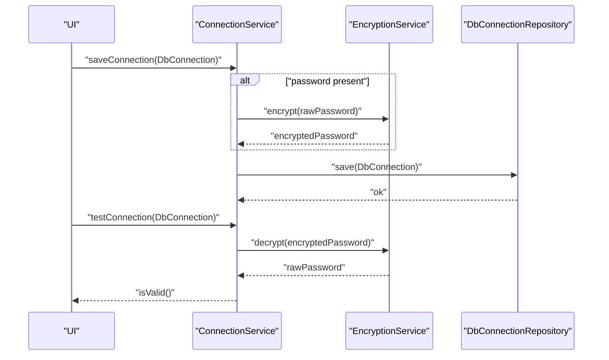

**Diagram sources**
- [ConnectionService.java:30-37](file://src/main/java/com/db2api/service/connection/ConnectionService.java#L30-L37)
- [ConnectionService.java:47-56](file://src/main/java/com/db2api/service/connection/ConnectionService.java#L47-L56)
- [EncryptionService.java:59-81](file://src/main/java/com/db2api/service/EncryptionService.java#L59-L81)
- [EncryptionService.java:89-110](file://src/main/java/com/db2api/service/EncryptionService.java#L89-L110)

**Section sources**
- [ConnectionService.java:15-57](file://src/main/java/com/db2api/service/connection/ConnectionService.java#L15-L57)

### SchemaDiscoveryService and ExternalConnectivityService
- Both decrypt stored credentials to establish JDBC connections for schema discovery and Cayenne runtime creation
- ExternalConnectivityService caches ServerRuntime instances keyed by connection ID

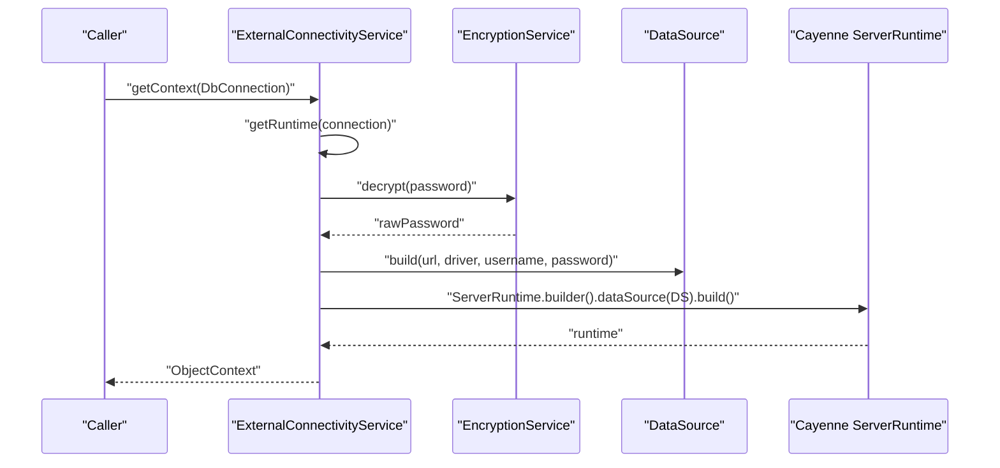

**Diagram sources**
- [ExternalConnectivityService.java:25-53](file://src/main/java/com/db2api/service/connection/ExternalConnectivityService.java#L25-L53)
- [EncryptionService.java:89-110](file://src/main/java/com/db2api/service/EncryptionService.java#L89-L110)

**Section sources**
- [SchemaDiscoveryService.java:15-59](file://src/main/java/com/db2api/service/api/SchemaDiscoveryService.java#L15-L59)
- [ExternalConnectivityService.java:15-54](file://src/main/java/com/db2api/service/connection/ExternalConnectivityService.java#L15-L54)

### AuthController
- Validates client credentials by decrypting stored secrets and comparing with provided secret
- Issues JWT tokens with HS256 signing using a configured secret

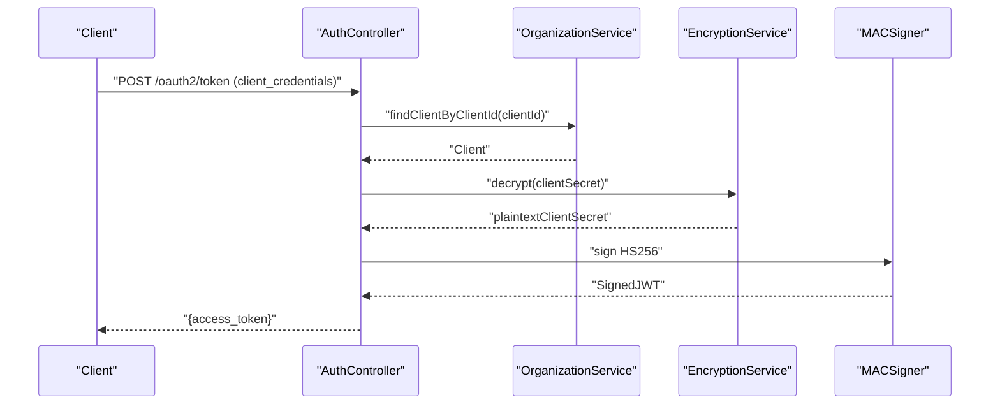

**Diagram sources**
- [AuthController.java:54-109](file://src/main/java/com/db2api/controller/AuthController.java#L54-L109)
- [EncryptionService.java:89-110](file://src/main/java/com/db2api/service/EncryptionService.java#L89-L110)

**Section sources**
- [AuthController.java:25-111](file://src/main/java/com/db2api/controller/AuthController.java#L25-L111)

### SecurityConfig
- Enables stateless JWT authentication for dynamic API endpoints
- Configures JWT decoder using a base64-encoded secret key material
- Sets up form-based login for the Vaadin UI

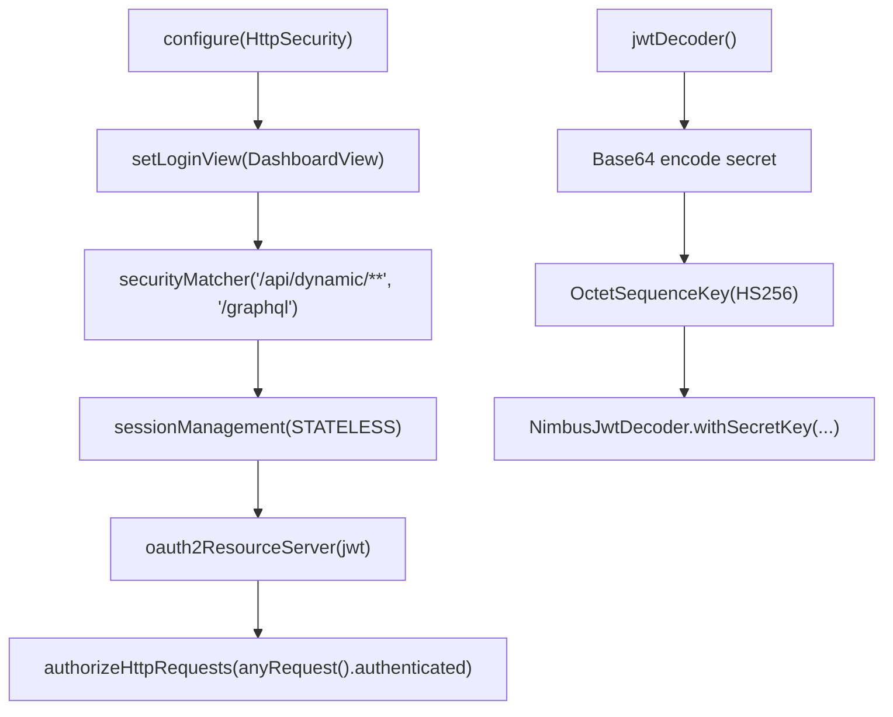

**Diagram sources**
- [SecurityConfig.java:53-62](file://src/main/java/com/db2api/config/SecurityConfig.java#L53-L62)
- [SecurityConfig.java:70-79](file://src/main/java/com/db2api/config/SecurityConfig.java#L70-L79)

**Section sources**
- [SecurityConfig.java:28-91](file://src/main/java/com/db2api/config/SecurityConfig.java#L28-L91)

### RequestLoggingFilter
- Logs request method, URI, status, and duration
- Includes a note to persist logs to the database for administrative monitoring

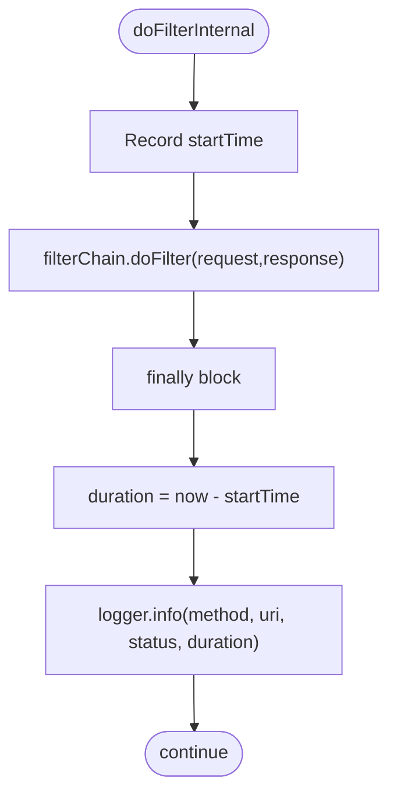

**Diagram sources**
- [RequestLoggingFilter.java:31-48](file://src/main/java/com/db2api/config/RequestLoggingFilter.java#L31-L48)

**Section sources**
- [RequestLoggingFilter.java:14-50](file://src/main/java/com/db2api/config/RequestLoggingFilter.java#L14-L50)

## Dependency Analysis
- EncryptionService is injected into ConnectionService, SchemaDiscoveryService, ExternalConnectivityService, and AuthController
- DbConnectionRepository persists DbConnection entities that store encrypted passwords
- SecurityConfig depends on JWT decoder beans and user details services
- RequestLoggingFilter is registered globally to capture request telemetry

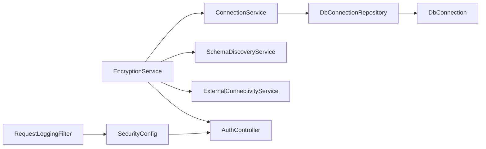

**Diagram sources**
- [EncryptionService.java:21-112](file://src/main/java/com/db2api/service/EncryptionService.java#L21-L112)
- [ConnectionService.java:18-24](file://src/main/java/com/db2api/service/connection/ConnectionService.java#L18-L24)
- [SchemaDiscoveryService.java:18-22](file://src/main/java/com/db2api/service/api/SchemaDiscoveryService.java#L18-L22)
- [ExternalConnectivityService.java:19-23](file://src/main/java/com/db2api/service/connection/ExternalConnectivityService.java#L19-L23)
- [AuthController.java:28-43](file://src/main/java/com/db2api/controller/AuthController.java#L28-L43)
- [DbConnectionRepository.java:10-12](file://src/main/java/com/db2api/repository/connection/DbConnectionRepository.java#L10-L12)
- [DbConnection.java:16-84](file://src/main/java/com/db2api/persistent/connection/DbConnection.java#L16-L84)
- [SecurityConfig.java:53-62](file://src/main/java/com/db2api/config/SecurityConfig.java#L53-L62)
- [RequestLoggingFilter.java:31-48](file://src/main/java/com/db2api/config/RequestLoggingFilter.java#L31-L48)

**Section sources**
- [EncryptionService.java:21-112](file://src/main/java/com/db2api/service/EncryptionService.java#L21-L112)
- [ConnectionService.java:18-24](file://src/main/java/com/db2api/service/connection/ConnectionService.java#L18-L24)
- [SchemaDiscoveryService.java:18-22](file://src/main/java/com/db2api/service/api/SchemaDiscoveryService.java#L18-L22)
- [ExternalConnectivityService.java:19-23](file://src/main/java/com/db2api/service/connection/ExternalConnectivityService.java#L19-L23)
- [AuthController.java:28-43](file://src/main/java/com/db2api/controller/AuthController.java#L28-L43)
- [DbConnectionRepository.java:10-12](file://src/main/java/com/db2api/repository/connection/DbConnectionRepository.java#L10-L12)
- [DbConnection.java:16-84](file://src/main/java/com/db2api/persistent/connection/DbConnection.java#L16-L84)
- [SecurityConfig.java:53-62](file://src/main/java/com/db2api/config/SecurityConfig.java#L53-L62)
- [RequestLoggingFilter.java:31-48](file://src/main/java/com/db2api/config/RequestLoggingFilter.java#L31-L48)

## Performance Considerations
- AES/GCM encryption/decryption overhead is minimal compared to network latency for database connections
- Storing IVs with ciphertext avoids additional storage but adds ~12 bytes per record
- Caching ServerRuntime instances reduces repeated DataSource construction and connection initialization costs
- Logging request durations helps identify slow endpoints; consider sampling or structured logging for high-volume environments

[No sources needed since this section provides general guidance]

## Troubleshooting Guide
- Encryption failures: Check the configured secret value and ensure it is properly base64-encoded for JWT and sufficiently strong for AES key derivation
- Decryption errors: Verify that ciphertext includes a prepended IV and that the secret has not changed between encryption and decryption
- Connection tests fail: Confirm decrypted password matches the target database and that JDBC URL, driver class, and credentials are correct
- JWT validation errors: Ensure the JWT issuer, expiration, and signing secret match the configured values
- Audit logging: Enable request logging and consider persisting logs to the system database for monitoring dashboards

**Section sources**
- [EncryptionService.java:39-49](file://src/main/java/com/db2api/service/EncryptionService.java#L39-L49)
- [EncryptionService.java:89-110](file://src/main/java/com/db2api/service/EncryptionService.java#L89-L110)
- [ConnectionService.java:47-56](file://src/main/java/com/db2api/service/connection/ConnectionService.java#L47-L56)
- [SecurityConfig.java:70-79](file://src/main/java/com/db2api/config/SecurityConfig.java#L70-L79)
- [RequestLoggingFilter.java:31-48](file://src/main/java/com/db2api/config/RequestLoggingFilter.java#L31-L48)

## Conclusion
DB2API employs AES/GCM encryption for at-rest credentials, authenticated JWT-based access for dynamic endpoints, and controlled decryption for operational tasks. The design centralizes cryptographic operations in a dedicated service, persists encrypted secrets, and integrates logging for monitoring. Adhering to secure configuration practices, credential rotation procedures, and access control ensures robust protection for database connections.

[No sources needed since this section summarizes without analyzing specific files]

## Appendices

### Security Best Practices for Connection Configuration
- Use strong, randomly generated secrets for both encryption and JWT signing
- Store secrets in environment variables or secure secret managers; avoid committing to version control
- Limit JWT token lifetimes and refresh token usage where applicable
- Restrict access to administrative endpoints and monitor unauthorized attempts
- Regularly rotate secrets and re-encrypt stored credentials

[No sources needed since this section provides general guidance]

### Credential Rotation Procedures
- Update the configured secret and re-encrypt stored credentials
- Validate decryption and connectivity after rotation
- Reissue tokens to clients if necessary and communicate changes to stakeholders

[No sources needed since this section provides general guidance]

### Access Control for Database Connections
- Enforce role-based access for administrative actions
- Restrict who can create, modify, or delete database connection records
- Use least privilege principles for database users managed via connections

[No sources needed since this section provides general guidance]

### Practical Examples of Secure Connection Setup
- Configure the encryption secret and JWT secret in environment variables
- Save a connection with a plaintext password; the system will encrypt it before persisting
- Test the connection to validate URL, credentials, and driver class
- Use the OAuth2 token endpoint to obtain a JWT for authorized access

**Section sources**
- [application.properties:3-16](file://src/main/resources/application.properties#L3-L16)
- [ConnectionService.java:30-37](file://src/main/java/com/db2api/service/connection/ConnectionService.java#L30-L37)
- [ConnectionService.java:47-56](file://src/main/java/com/db2api/service/connection/ConnectionService.java#L47-L56)
- [AuthController.java:54-109](file://src/main/java/com/db2api/controller/AuthController.java#L54-L109)

### Audit Logging for Connection Attempts
- Enable request logging to capture method, URI, status, and duration
- Persist logs to the system database for dashboard monitoring
- Monitor for failed authentication, invalid credentials, and unusual request patterns

**Section sources**
- [RequestLoggingFilter.java:31-48](file://src/main/java/com/db2api/config/RequestLoggingFilter.java#L31-L48)

### Security Monitoring Approaches
- Track authentication failures and token validation errors
- Observe connection test outcomes and schema discovery operations
- Alert on repeated failures or anomalies in request volumes and durations

[No sources needed since this section provides general guidance]

### Common Security Vulnerabilities and Mitigations
- Insecure storage of secrets: Mitigate by using encrypted-at-rest and secure secret management
- Weak cryptographic algorithms: Mitigate by using AES/GCM and strong key derivation
- Exposed credentials in transit: Mitigate by enforcing HTTPS and secure transport
- Insufficient access control: Mitigate by applying RBAC and restricting administrative endpoints
- Lack of audit trails: Mitigate by enabling comprehensive logging and monitoring

[No sources needed since this section provides general guidance]