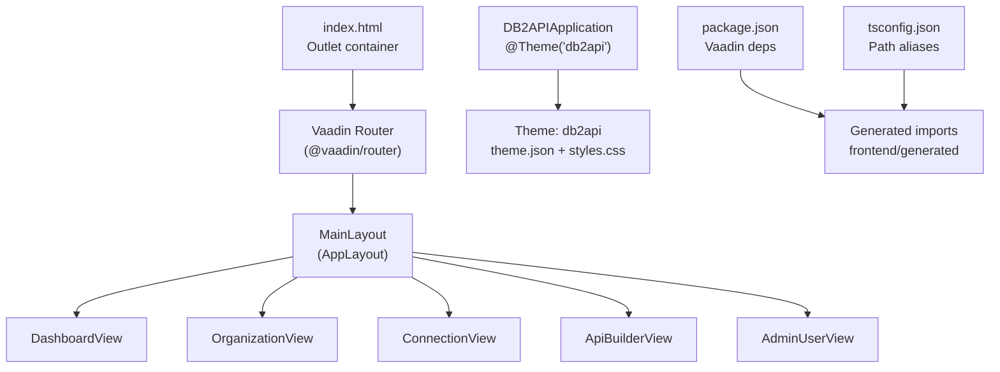
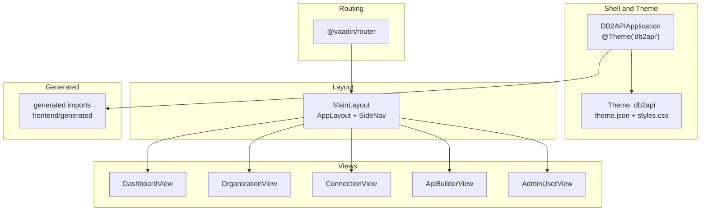
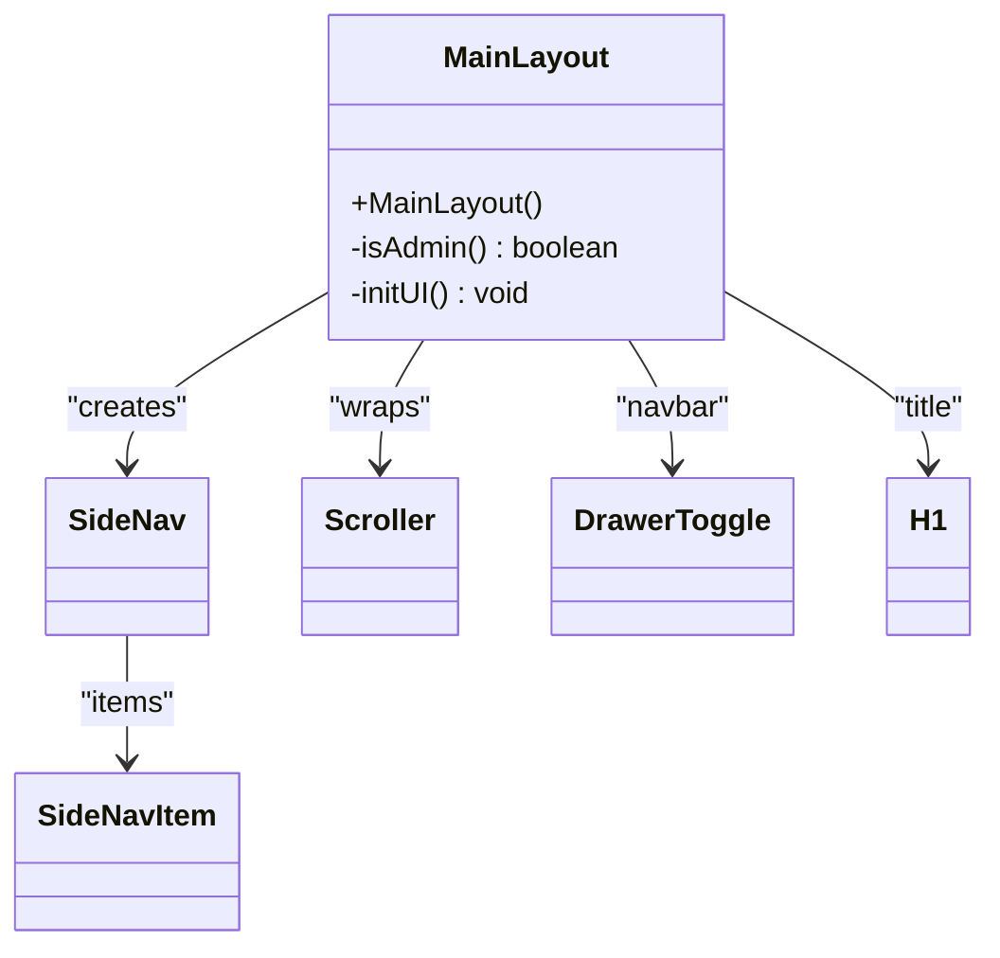
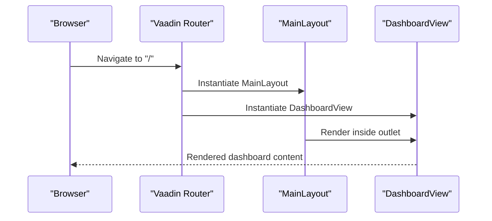
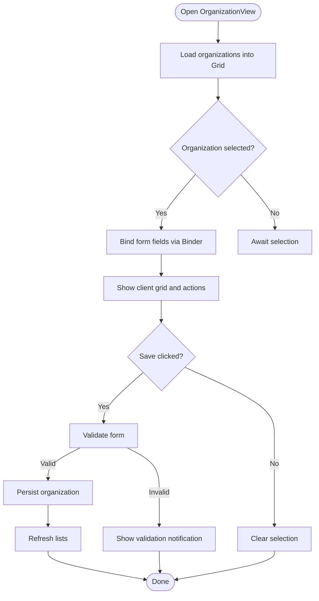
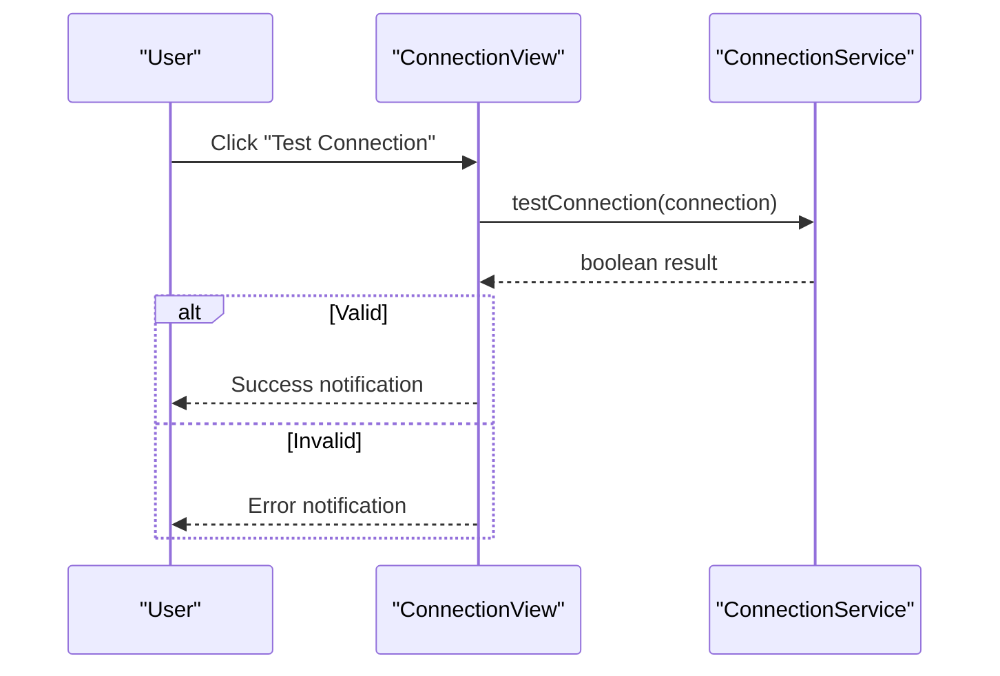
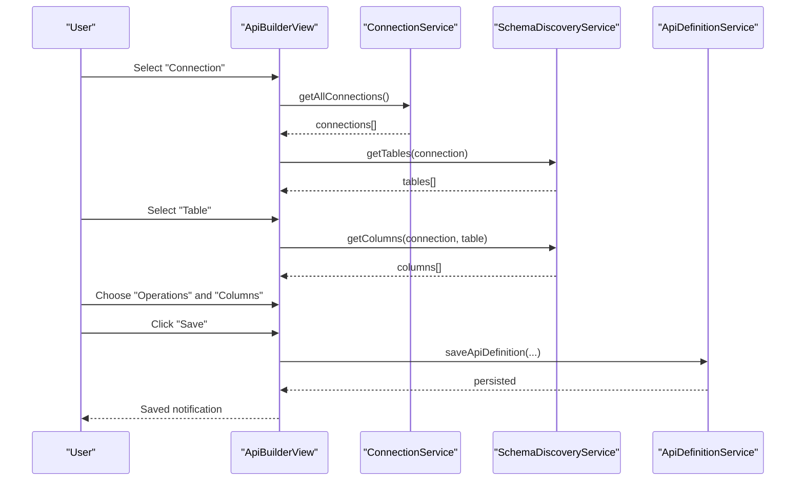
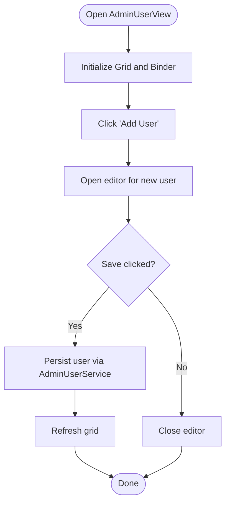
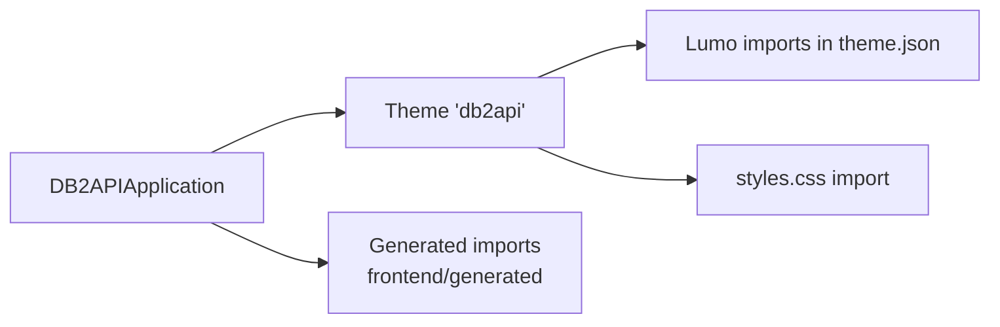
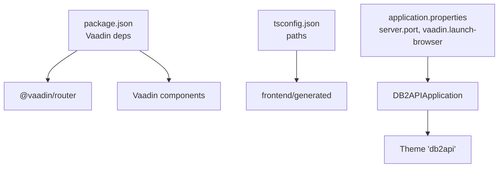

# Frontend Architecture

<cite>
**Referenced Files in This Document**
- [DB2APIApplication.java](file://src/main/java/com/db2api/DB2APIApplication.java)
- [MainLayout.java](file://src/main/java/com/db2api/ui/MainLayout.java)
- [DashboardView.java](file://src/main/java/com/db2api/ui/DashboardView.java)
- [OrganizationView.java](file://src/main/java/com/db2api/ui/OrganizationView.java)
- [ConnectionView.java](file://src/main/java/com/db2api/ui/ConnectionView.java)
- [ApiBuilderView.java](file://src/main/java/com/db2api/ui/api/ApiBuilderView.java)
- [AdminUserView.java](file://src/main/java/com/db2api/ui/admin/AdminUserView.java)
- [SecurityConfig.java](file://src/main/java/com/db2api/config/SecurityConfig.java)
- [application.properties](file://src/main/resources/application.properties)
- [index.html](file://frontend/index.html)
- [theme.json](file://frontend/themes/db2api/theme.json)
- [styles.css](file://frontend/themes/db2api/styles.css)
- [package.json](file://package.json)
- [tsconfig.json](file://tsconfig.json)
</cite>

## Table of Contents
1. [Introduction](#introduction)
2. [Project Structure](#project-structure)
3. [Core Components](#core-components)
4. [Architecture Overview](#architecture-overview)
5. [Detailed Component Analysis](#detailed-component-analysis)
6. [Dependency Analysis](#dependency-analysis)
7. [Performance Considerations](#performance-considerations)
8. [Troubleshooting Guide](#troubleshooting-guide)
9. [Conclusion](#conclusion)
10. [Appendices](#appendices)

## Introduction
This document describes the frontend architecture of DB2API’s Vaadin-based web interface. It covers the Vaadin framework setup, component architecture, UI navigation and routing, theme and styling system, and generated component structure. It also documents the MainLayout component, view components organization, responsive design implementation, and accessibility features. Practical examples demonstrate customizing the UI, creating new views, and integrating frontend with backend services. Finally, it addresses performance optimization and browser compatibility.

## Project Structure
The frontend is organized around Vaadin components and a Lumo-based theme. The runtime entry point is an HTML outlet where Vaadin renders views. Views are annotated with routing metadata and rendered inside a shared MainLayout. The theme is defined under a custom theme folder and configured globally via the application entry point.

**Diagram sources**
- [index.html:1-24](file://frontend/index.html#L1-L24)
- [MainLayout.java:22-76](file://src/main/java/com/db2api/ui/MainLayout.java#L22-L76)
- [DashboardView.java:12-34](file://src/main/java/com/db2api/ui/DashboardView.java#L12-L34)
- [OrganizationView.java:23-183](file://src/main/java/com/db2api/ui/OrganizationView.java#L23-L183)
- [ConnectionView.java:21-158](file://src/main/java/com/db2api/ui/ConnectionView.java#L21-L158)
- [ApiBuilderView.java:32-258](file://src/main/java/com/db2api/ui/api/ApiBuilderView.java#L32-L258)
- [AdminUserView.java:27-189](file://src/main/java/com/db2api/ui/admin/AdminUserView.java#L27-L189)
- [DB2APIApplication.java:14-26](file://src/main/java/com/db2api/DB2APIApplication.java#L14-L26)
- [theme.json:1-10](file://frontend/themes/db2api/theme.json#L1-L10)
- [styles.css:1-2](file://frontend/themes/db2api/styles.css#L1-L2)
- [package.json:51-150](file://package.json#L51-L150)
- [tsconfig.json:26-30](file://tsconfig.json#L26-L30)

**Section sources**
- [index.html:1-24](file://frontend/index.html#L1-L24)
- [DB2APIApplication.java:14-26](file://src/main/java/com/db2api/DB2APIApplication.java#L14-L26)
- [theme.json:1-10](file://frontend/themes/db2api/theme.json#L1-L10)
- [styles.css:1-2](file://frontend/themes/db2api/styles.css#L1-L2)
- [package.json:51-150](file://package.json#L51-L150)
- [tsconfig.json:26-30](file://tsconfig.json#L26-L30)

## Core Components
- Application shell and theme
  - The application sets the active theme globally and implements the Vaadin app shell configuration.
  - The theme “db2api” is configured and references Lumo utilities.
- Main layout
  - A shared AppLayout with a drawer toggle and a side navigation menu. Navigation items are added programmatically and filtered by roles.
- Views
  - Dashboard, Organizations, Connections, API Builder, and Admin Users views. Each view is a Vaadin component annotated with routing metadata and rendered within MainLayout.
- Routing
  - Vaadin Router is used for client-side navigation. Routes are declared via annotations on views.
- Styling and theme
  - Lumo imports are configured in the theme JSON. Additional CSS is imported via the theme stylesheet.
- Accessibility
  - Vaadin components provide built-in accessibility features. Role-based visibility and keyboard navigation are applied in views.

**Section sources**
- [DB2APIApplication.java:14-26](file://src/main/java/com/db2api/DB2APIApplication.java#L14-L26)
- [MainLayout.java:22-76](file://src/main/java/com/db2api/ui/MainLayout.java#L22-L76)
- [DashboardView.java:12-34](file://src/main/java/com/db2api/ui/DashboardView.java#L12-L34)
- [OrganizationView.java:23-183](file://src/main/java/com/db2api/ui/OrganizationView.java#L23-L183)
- [ConnectionView.java:21-158](file://src/main/java/com/db2api/ui/ConnectionView.java#L21-L158)
- [ApiBuilderView.java:32-258](file://src/main/java/com/db2api/ui/api/ApiBuilderView.java#L32-L258)
- [AdminUserView.java:27-189](file://src/main/java/com/db2api/ui/admin/AdminUserView.java#L27-L189)
- [theme.json:1-10](file://frontend/themes/db2api/theme.json#L1-L10)
- [styles.css:1-2](file://frontend/themes/db2api/styles.css#L1-L2)

## Architecture Overview
The frontend architecture follows a layered pattern:
- Shell and theme layer: application entry point and theme configuration.
- Layout layer: MainLayout provides a consistent header and navigation.
- View layer: individual views encapsulate UI logic and integrate with backend services.
- Routing layer: Vaadin Router manages navigation and view rendering.
- Generated layer: Vaadin generates imports and connectors for seamless Java–frontend integration.

**Diagram sources**
- [DB2APIApplication.java:14-26](file://src/main/java/com/db2api/DB2APIApplication.java#L14-L26)
- [theme.json:1-10](file://frontend/themes/db2api/theme.json#L1-L10)
- [styles.css:1-2](file://frontend/themes/db2api/styles.css#L1-L2)
- [MainLayout.java:22-76](file://src/main/java/com/db2api/ui/MainLayout.java#L22-L76)
- [DashboardView.java:12-34](file://src/main/java/com/db2api/ui/DashboardView.java#L12-L34)
- [OrganizationView.java:23-183](file://src/main/java/com/db2api/ui/OrganizationView.java#L23-L183)
- [ConnectionView.java:21-158](file://src/main/java/com/db2api/ui/ConnectionView.java#L21-L158)
- [ApiBuilderView.java:32-258](file://src/main/java/com/db2api/ui/api/ApiBuilderView.java#L32-L258)
- [AdminUserView.java:27-189](file://src/main/java/com/db2api/ui/admin/AdminUserView.java#L27-L189)
- [package.json:51-150](file://package.json#L51-L150)

## Detailed Component Analysis

### MainLayout
MainLayout extends Vaadin’s AppLayout and builds the top navigation bar and side drawer. It programmatically constructs the SideNav, adds items for dashboard, organizations, connections, API builder, and admin users (conditional on role). It also applies Lumo padding to the scroller and adds the title and drawer toggle to the navbar.

**Diagram sources**
- [MainLayout.java:22-76](file://src/main/java/com/db2api/ui/MainLayout.java#L22-L76)

**Section sources**
- [MainLayout.java:22-76](file://src/main/java/com/db2api/ui/MainLayout.java#L22-L76)

### DashboardView
DashboardView is the default route and displays a welcome message. It uses a vertical layout and page title annotation for SEO and browser tab labeling.

**Diagram sources**
- [DashboardView.java:12-34](file://src/main/java/com/db2api/ui/DashboardView.java#L12-L34)
- [MainLayout.java:22-76](file://src/main/java/com/db2api/ui/MainLayout.java#L22-L76)

**Section sources**
- [DashboardView.java:12-34](file://src/main/java/com/db2api/ui/DashboardView.java#L12-L34)

### OrganizationView
OrganizationView manages organizations and clients with a split layout. It uses a Grid for listing, a Binder for editing, and cascading selections for clients. Role-based access control hides editing controls for viewers.

**Diagram sources**
- [OrganizationView.java:24-183](file://src/main/java/com/db2api/ui/OrganizationView.java#L24-L183)

**Section sources**
- [OrganizationView.java:24-183](file://src/main/java/com/db2api/ui/OrganizationView.java#L24-L183)

### ConnectionView
ConnectionView manages database connections with a Grid and a form. It supports testing connectivity and role-based editing controls.

**Diagram sources**
- [ConnectionView.java:21-158](file://src/main/java/com/db2api/ui/ConnectionView.java#L21-L158)

**Section sources**
- [ConnectionView.java:21-158](file://src/main/java/com/db2api/ui/ConnectionView.java#L21-L158)

### ApiBuilderView
ApiBuilderView enables building dynamic REST/GraphQL APIs by selecting a connection, table, columns, and operations. It uses cascading combo boxes and checkbox/radio groups.

**Diagram sources**
- [ApiBuilderView.java:32-258](file://src/main/java/com/db2api/ui/api/ApiBuilderView.java#L32-L258)

**Section sources**
- [ApiBuilderView.java:32-258](file://src/main/java/com/db2api/ui/api/ApiBuilderView.java#L32-L258)

### AdminUserView
AdminUserView manages administrative users with role assignment. It enforces role-based access via annotations and provides CRUD actions.

**Diagram sources**
- [AdminUserView.java:27-189](file://src/main/java/com/db2api/ui/admin/AdminUserView.java#L27-L189)

**Section sources**
- [AdminUserView.java:27-189](file://src/main/java/com/db2api/ui/admin/AdminUserView.java#L27-L189)

### Theme and Styling System
- Theme configuration
  - The application theme is set to “db2api” at the application level.
  - The theme defines Lumo imports such as typography, color, spacing, badge, and utility.
- CSS import
  - The theme stylesheet imports additional CSS resources.
- Generated imports
  - Vaadin generates JavaScript and TypeScript assets under the generated folder, enabling seamless component rendering and updates.

**Diagram sources**
- [DB2APIApplication.java:14-26](file://src/main/java/com/db2api/DB2APIApplication.java#L14-L26)
- [theme.json:1-10](file://frontend/themes/db2api/theme.json#L1-L10)
- [styles.css:1-2](file://frontend/themes/db2api/styles.css#L1-L2)
- [package.json:51-150](file://package.json#L51-L150)

**Section sources**
- [DB2APIApplication.java:14-26](file://src/main/java/com/db2api/DB2APIApplication.java#L14-L26)
- [theme.json:1-10](file://frontend/themes/db2api/theme.json#L1-L10)
- [styles.css:1-2](file://frontend/themes/db2api/styles.css#L1-L2)
- [package.json:51-150](file://package.json#L51-L150)

### Responsive Design Implementation
- Layout primitives
  - Views commonly use VerticalLayout, HorizontalLayout, SplitLayout, and Scroller to arrange content responsively.
- Component sizing
  - Components such as grids and editors set full size to adapt to container dimensions.
- Theme utilities
  - Lumo utilities are applied to paddings and spacing to maintain consistent layouts across breakpoints.

**Section sources**
- [OrganizationView.java:44-59](file://src/main/java/com/db2api/ui/OrganizationView.java#L44-L59)
- [ConnectionView.java:42-57](file://src/main/java/com/db2api/ui/ConnectionView.java#L42-L57)
- [ApiBuilderView.java:180-188](file://src/main/java/com/db2api/ui/api/ApiBuilderView.java#L180-L188)
- [AdminUserView.java:149-150](file://src/main/java/com/db2api/ui/admin/AdminUserView.java#L149-L150)
- [MainLayout.java:69-74](file://src/main/java/com/db2api/ui/MainLayout.java#L69-L74)
- [theme.json:2-8](file://frontend/themes/db2api/theme.json#L2-L8)

### Accessibility Features
- Built-in accessibility
  - Vaadin components provide keyboard navigation, ARIA attributes, and focus management out of the box.
- Role-based visibility
  - Views hide editing controls for non-admin or non-editor roles to prevent invalid interactions.
- Notifications
  - Success and error notifications are presented with appropriate variants to improve feedback.

**Section sources**
- [ConnectionView.java:145-156](file://src/main/java/com/db2api/ui/ConnectionView.java#L145-L156)
- [OrganizationView.java:98-110](file://src/main/java/com/db2api/ui/OrganizationView.java#L98-L110)
- [ApiBuilderView.java:250-256](file://src/main/java/com/db2api/ui/api/ApiBuilderView.java#L250-L256)
- [AdminUserView.java:27-28](file://src/main/java/com/db2api/ui/admin/AdminUserView.java#L27-L28)

### Practical Examples

- Customizing the UI
  - Adjust theme imports in the theme JSON to enable or disable Lumo features.
  - Apply Lumo utilities to containers and components to control spacing and padding.
  - Reference generated imports via path aliases in TypeScript configuration to ensure correct module resolution.

- Creating a new view
  - Annotate a new view class with a route and layout, similar to existing views.
  - Use Grid, Binder, and forms to manage data entry and validation.
  - Integrate with backend services via constructor injection and service methods.

- Integrating frontend with backend services
  - Views depend on service classes injected via constructors. Use service methods to load, save, and delete domain entities.
  - For API-related flows, leverage schema discovery services to populate selectable options dynamically.

**Section sources**
- [theme.json:1-10](file://frontend/themes/db2api/theme.json#L1-L10)
- [tsconfig.json:26-30](file://tsconfig.json#L26-L30)
- [DashboardView.java:12-34](file://src/main/java/com/db2api/ui/DashboardView.java#L12-L34)
- [OrganizationView.java:26-59](file://src/main/java/com/db2api/ui/OrganizationView.java#L26-L59)
- [ConnectionView.java:24-57](file://src/main/java/com/db2api/ui/ConnectionView.java#L24-L57)
- [ApiBuilderView.java:35-55](file://src/main/java/com/db2api/ui/api/ApiBuilderView.java#L35-L55)
- [AdminUserView.java:39-42](file://src/main/java/com/db2api/ui/admin/AdminUserView.java#L39-L42)

## Dependency Analysis
The frontend depends on Vaadin components and router for UI and navigation. TypeScript configuration maps frontend paths to generated resources. The application property file configures the server port and Vaadin launch behavior.

**Diagram sources**
- [package.json:51-150](file://package.json#L51-L150)
- [tsconfig.json:26-30](file://tsconfig.json#L26-L30)
- [application.properties:4-19](file://src/main/resources/application.properties#L4-L19)
- [DB2APIApplication.java:14-26](file://src/main/java/com/db2api/DB2APIApplication.java#L14-L26)

**Section sources**
- [package.json:51-150](file://package.json#L51-L150)
- [tsconfig.json:26-30](file://tsconfig.json#L26-L30)
- [application.properties:4-19](file://src/main/resources/application.properties#L4-L19)
- [DB2APIApplication.java:14-26](file://src/main/java/com/db2api/DB2APIApplication.java#L14-L26)

## Performance Considerations
- Lazy loading and virtualization
  - Use Grid with virtual scrolling for large datasets to minimize DOM nodes.
- Minimize reflows
  - Prefer setting sizes and alignments declaratively to avoid layout thrashing.
- Theme and CSS
  - Keep theme imports minimal to reduce CSS bundle size.
- Build and bundling
  - Leverage Vite and modern bundlers configured in the project for efficient asset handling.
- Network requests
  - Batch service calls and debounce user interactions where appropriate.

[No sources needed since this section provides general guidance]

## Troubleshooting Guide
- Routing issues
  - Ensure routes are properly annotated and views are placed under the correct layout.
- Theme not applying
  - Verify the theme name matches the configured value and that theme JSON and CSS are present.
- Generated imports missing
  - Confirm TypeScript path aliases point to the generated resources and the build process runs successfully.
- Security restrictions
  - Role-based views require proper authorities; verify authentication and roles are correctly set up.

**Section sources**
- [DB2APIApplication.java:14-26](file://src/main/java/com/db2api/DB2APIApplication.java#L14-L26)
- [theme.json:1-10](file://frontend/themes/db2api/theme.json#L1-L10)
- [tsconfig.json:26-30](file://tsconfig.json#L26-L30)
- [SecurityConfig.java:17-36](file://src/main/java/com/db2api/config/SecurityConfig.java#L17-L36)

## Conclusion
DB2API’s frontend leverages Vaadin’s component model, AppLayout, and Router to deliver a structured, role-aware, and accessible user interface. The architecture cleanly separates shell, layout, views, and generated assets, while the theme system and Lumo utilities support consistent styling. By following the patterns demonstrated in the views and adhering to performance and accessibility guidelines, developers can extend the UI effectively and integrate with backend services seamlessly.

[No sources needed since this section summarizes without analyzing specific files]

## Appendices
- Backend integration overview
  - Views depend on service classes for persistence and data retrieval. Use dependency injection to wire services into views.
- Security integration
  - Vaadin Web Security is configured to protect routes and enforce role-based access.

**Section sources**
- [OrganizationView.java:26-59](file://src/main/java/com/db2api/ui/OrganizationView.java#L26-L59)
- [ConnectionView.java:24-57](file://src/main/java/com/db2api/ui/ConnectionView.java#L24-L57)
- [ApiBuilderView.java:35-55](file://src/main/java/com/db2api/ui/api/ApiBuilderView.java#L35-L55)
- [AdminUserView.java:39-42](file://src/main/java/com/db2api/ui/admin/AdminUserView.java#L39-L42)
- [SecurityConfig.java:17-36](file://src/main/java/com/db2api/config/SecurityConfig.java#L17-L36)