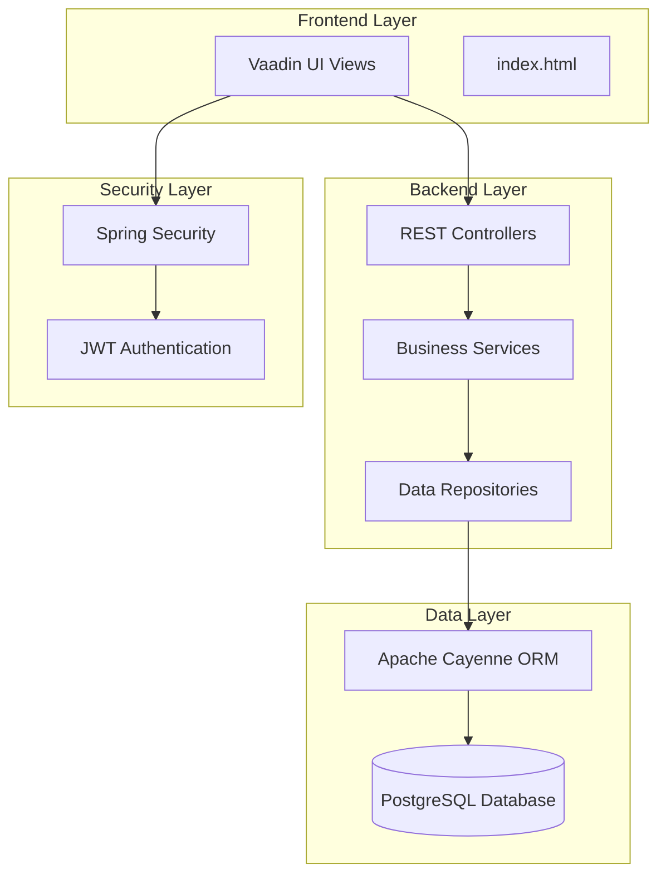
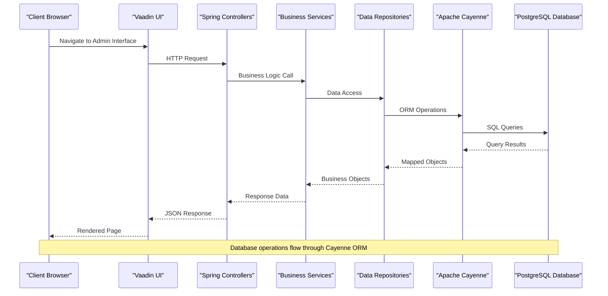
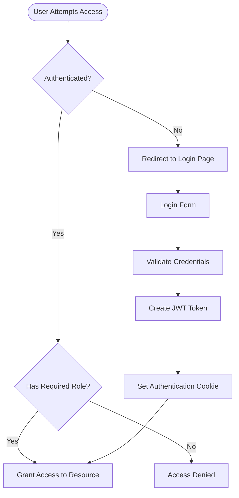
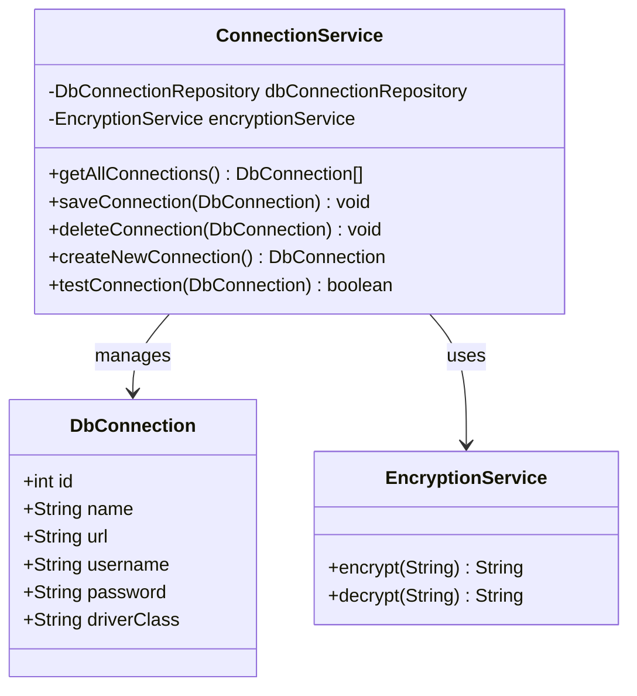
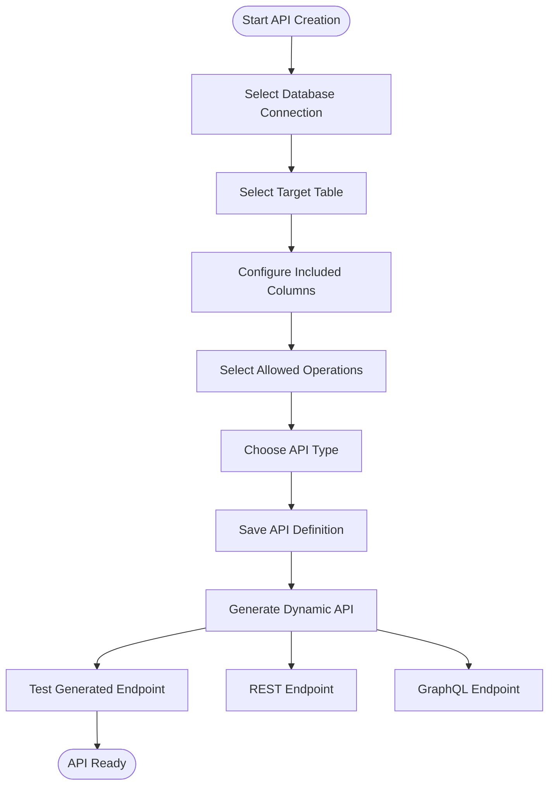
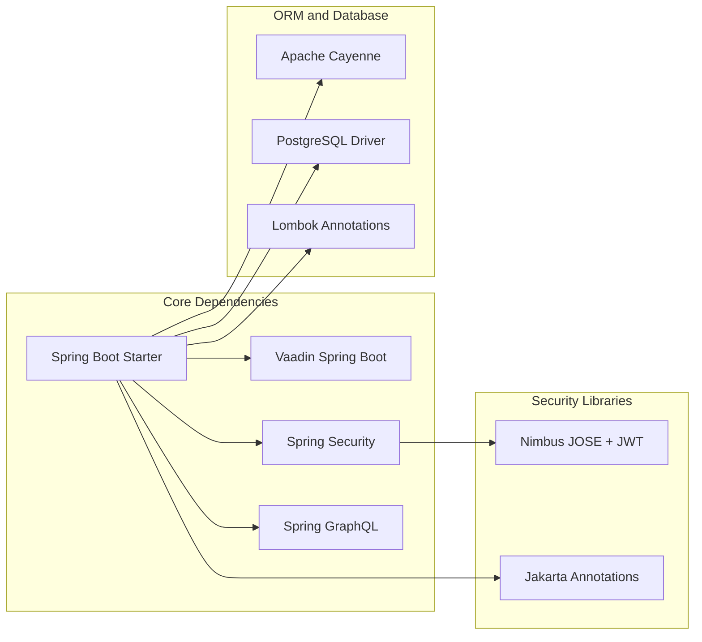

# Getting Started

<cite>
**Referenced Files in This Document**
- [README.md](file://README.md)
- [pom.xml](file://pom.xml)
- [application.properties](file://src/main/resources/application.properties)
- [DB2APIApplication.java](file://src/main/java/com/db2api/DB2APIApplication.java)
- [CayenneConfig.java](file://src/main/java/com/db2api/config/CayenneConfig.java)
- [cayenne-project.xml](file://src/main/resources/cayenne-project.xml)
- [datamap.map.xml](file://src/main/resources/datamap.map.xml)
- [schema.sql](file://src/main/resources/schema.sql)
- [DataInitializer.java](file://src/main/java/com/db2api/config/DataInitializer.java)
- [ConnectionService.java](file://src/main/java/com/db2api/service/connection/ConnectionService.java)
- [AuthController.java](file://src/main/java/com/db2api/controller/AuthController.java)
- [SecurityConfig.java](file://src/main/java/com/db2api/config/SecurityConfig.java)
- [CustomUserDetailsService.java](file://src/main/java/com/db2api/security/CustomUserDetailsService.java)
- [ConnectionView.java](file://src/main/java/com/db2api/ui/connection/ConnectionView.java)
- [ApiBuilderView.java](file://src/main/java/com/db2api/ui/api/ApiBuilderView.java)
- [DashboardView.java](file://src/main/java/com/db2api/ui/DashboardView.java)
- [index.html](file://frontend/index.html)
</cite>

## Table of Contents
1. [Introduction](#introduction)
2. [Project Structure](#project-structure)
3. [Prerequisites](#prerequisites)
4. [Installation and Setup](#installation-and-setup)
5. [Initial Configuration](#initial-configuration)
6. [Running the Application](#running-the-application)
7. [Basic Usage Examples](#basic-usage-examples)
8. [Architecture Overview](#architecture-overview)
9. [Detailed Component Analysis](#detailed-component-analysis)
10. [Dependency Analysis](#dependency-analysis)
11. [Performance Considerations](#performance-considerations)
12. [Troubleshooting Guide](#troubleshooting-guide)
13. [Conclusion](#conclusion)

## Introduction
DB2API is a web application that generates REST and GraphQL APIs from existing databases. It provides a modern UI for managing database connections, defining API schemas, and exposing secure endpoints. The platform uses Spring Boot, Vaadin for the UI, Apache Cayenne for ORM, and Spring Security for authentication and authorization.

## Project Structure
The project follows a layered architecture with clear separation of concerns:
- Backend: Spring Boot application with Vaadin UI framework
- Data Layer: Apache Cayenne ORM with PostgreSQL as the system database
- Frontend: Vaadin-based single-page application
- Security: Spring Security with JWT authentication



**Diagram sources**
- [DB2APIApplication.java:13-24](file://src/main/java/com/db2api/DB2APIApplication.java#L13-L24)
- [CayenneConfig.java:21-27](file://src/main/java/com/db2api/config/CayenneConfig.java#L21-L27)
- [SecurityConfig.java:37-40](file://src/main/java/com/db2api/config/SecurityConfig.java#L37-L40)

**Section sources**
- [README.md:65-82](file://README.md#L65-L82)
- [pom.xml:25-99](file://pom.xml#L25-L99)

## Prerequisites
Before setting up DB2API, ensure you have the following components installed:

### Required Software
- **Java Development Kit (JDK) 21**: The application requires Java 21 for compilation and execution
- **Apache Maven**: Build tool for dependency management and project lifecycle
- **Database Instance**: PostgreSQL database for system metadata storage

### Database Requirements
The application uses PostgreSQL as its system database. You can use:
- Local PostgreSQL instance
- Docker container with PostgreSQL
- Cloud PostgreSQL service

**Section sources**
- [README.md:38-42](file://README.md#L38-L42)
- [pom.xml:16-24](file://pom.xml#L16-L24)
- [application.properties:7-16](file://src/main/resources/application.properties#L7-L16)

## Installation and Setup

### Step 1: Clone the Repository
```bash
git clone <repository-url>
cd <repository-directory>
```

### Step 2: Verify Prerequisites
Ensure JDK 21 and Maven are properly installed:
```bash
java -version
mvn -version
```

### Step 3: Database Setup
Create a PostgreSQL database for the system metadata. The default configuration expects:
- Database name: `db2api_system`
- Host: `localhost`
- Port: `5432`
- Username: `postgres`
- Password: `techworld7526`

### Step 4: Initial Database Schema
The application will automatically create the required tables using the schema defined in `schema.sql`. The schema includes:
- `organization`: Organization management
- `client`: OAuth2 client credentials
- `db_connection`: Database connection configurations
- `api_definition`: API definition templates
- `admin_user`: Administrative user accounts

**Section sources**
- [schema.sql:1-39](file://src/main/resources/schema.sql#L1-L39)
- [application.properties:7-16](file://src/main/resources/application.properties#L7-L16)

## Initial Configuration

### Database Connection Configuration
Configure the system database connection in `application.properties`:

```properties
# Database Configuration (System DB)
spring.datasource.url=jdbc:postgresql://localhost:5432/db2api_system
spring.datasource.username=postgres
spring.datasource.password=techworld7526
spring.datasource.driver-class-name=org.postgresql.Driver
```

### Application Properties
Key configuration options include:
- **Server Port**: Default port 8080
- **Database Dialect**: PostgreSQL dialect for Hibernate
- **Auto Schema Update**: Automatic schema migration enabled
- **Vaadin Settings**: Browser launch configuration

### Cayenne ORM Configuration
The application uses Apache Cayenne for object-relational mapping:
- Data map configuration in `datamap.map.xml`
- Domain configuration in `cayenne-project.xml`
- Entity relationships defined for all tables

**Section sources**
- [application.properties:1-20](file://src/main/resources/application.properties#L1-L20)
- [cayenne-project.xml:1-5](file://src/main/resources/cayenne-project.xml#L1-L5)
- [datamap.map.xml:1-83](file://src/main/resources/datamap.map.xml#L1-L83)

## Running the Application

### Method 1: Using Maven (Recommended)
```bash
mvn spring-boot:run
```

### Method 2: Build and Run
```bash
mvn clean install
java -jar target/DB2API-0.0.1-SNAPSHOT.jar
```

### Method 3: IDE Execution
Import the project into your IDE and run the `DB2APIApplication.main()` method.

### Application Startup
Upon successful startup, the application will:
1. Initialize the database schema automatically
2. Create a default admin user (username: admin, password: admin)
3. Launch the Vaadin UI at `http://localhost:8080`

**Section sources**
- [README.md:57-63](file://README.md#L57-L63)
- [DB2APIApplication.java:22-24](file://src/main/java/com/db2api/DB2APIApplication.java#L22-L24)
- [DataInitializer.java:46-58](file://src/main/java/com/db2api/config/DataInitializer.java#L46-L58)

## Basic Usage Examples

### Example 1: Connecting to a Database
1. Navigate to the Connections page in the admin interface
2. Click "Add Connection"
3. Fill in the database connection details:
   - Name: Human-readable connection name
   - JDBC URL: Complete JDBC connection string
   - Username: Database username
   - Password: Database password
   - Driver Class: Appropriate JDBC driver class
4. Click "Test Connection" to verify connectivity
5. Click "Save" to persist the connection

### Example 2: Generating a REST API
1. Go to the API Builder page
2. Select a database connection from the dropdown
3. Choose a table from the available tables
4. Select the columns to include in the API
5. Choose API type (REST or GraphQL)
6. Select allowed operations (GET, PUT, DELETE)
7. Save the API definition

### Example 3: Accessing the Administrative Interface
1. Open `http://localhost:8080` in your browser
2. Login with the default credentials:
   - Username: admin
   - Password: admin
3. Use the navigation menu to access different sections:
   - Dashboard: Overview and statistics
   - Connections: Manage database connections
   - API Builder: Create and manage APIs
   - Admin Users: Manage administrative users

**Section sources**
- [ConnectionView.java:132-202](file://src/main/java/com/db2api/ui/connection/ConnectionView.java#L132-L202)
- [ApiBuilderView.java:165-257](file://src/main/java/com/db2api/ui/api/ApiBuilderView.java#L165-L257)
- [DashboardView.java:19-32](file://src/main/java/com/db2api/ui/DashboardView.java#L19-L32)

## Architecture Overview



**Diagram sources**
- [ConnectionService.java:15-57](file://src/main/java/com/db2api/service/connection/ConnectionService.java#L15-L57)
- [CayenneConfig.java:21-27](file://src/main/java/com/db2api/config/CayenneConfig.java#L21-L27)
- [DB2APIApplication.java:13-24](file://src/main/java/com/db2api/DB2APIApplication.java#L13-L24)

## Detailed Component Analysis

### Authentication and Authorization System
The application implements a dual-layer security approach:



**Diagram sources**
- [SecurityConfig.java:37-50](file://src/main/java/com/db2api/config/SecurityConfig.java#L37-L50)
- [CustomUserDetailsService.java:21-30](file://src/main/java/com/db2api/security/CustomUserDetailsService.java#L21-L30)
- [AuthController.java:54-109](file://src/main/java/com/db2api/controller/AuthController.java#L54-L109)

### Database Connection Management
The connection service handles secure database connectivity:



**Diagram sources**
- [ConnectionService.java:15-57](file://src/main/java/com/db2api/service/connection/ConnectionService.java#L15-L57)
- [datamap.map.xml:55-61](file://src/main/resources/datamap.map.xml#L55-L61)

**Section sources**
- [ConnectionService.java:15-57](file://src/main/java/com/db2api/service/connection/ConnectionService.java#L15-L57)
- [datamap.map.xml:27-34](file://src/main/resources/datamap.map.xml#L27-L34)

### API Definition and Generation
The API builder enables dynamic API creation:



**Diagram sources**
- [ApiBuilderView.java:88-159](file://src/main/java/com/db2api/ui/api/ApiBuilderView.java#L88-L159)
- [datamap.map.xml:13-20](file://src/main/resources/datamap.map.xml#L13-L20)

**Section sources**
- [ApiBuilderView.java:88-159](file://src/main/java/com/db2api/ui/api/ApiBuilderView.java#L88-L159)
- [datamap.map.xml:13-20](file://src/main/resources/datamap.map.xml#L13-L20)

## Dependency Analysis



**Diagram sources**
- [pom.xml:25-99](file://pom.xml#L25-L99)

**Section sources**
- [pom.xml:25-99](file://pom.xml#L25-L99)

## Performance Considerations
- **Connection Pooling**: Configure appropriate connection pool settings for production deployments
- **Caching**: Implement caching strategies for frequently accessed API definitions
- **Database Indexing**: Ensure proper indexing on frequently queried columns
- **Memory Management**: Monitor heap usage and tune JVM parameters as needed
- **Static Resources**: Optimize frontend assets for production deployment

## Troubleshooting Guide

### Common Setup Issues

#### Issue 1: Database Connection Failures
**Symptoms**: Application fails to start or shows database connection errors
**Solutions**:
1. Verify PostgreSQL service is running
2. Check database credentials in `application.properties`
3. Ensure the database name exists and is accessible
4. Confirm PostgreSQL JDBC driver is available

#### Issue 2: Port Already in Use
**Symptoms**: Application fails to start on port 8080
**Solutions**:
1. Change the server port in `application.properties`
2. Stop the process using port 8080
3. Use a different port number

#### Issue 3: Vaadin UI Not Loading
**Symptoms**: Blank page or UI not rendering
**Solutions**:
1. Ensure Node.js is installed for frontend compilation
2. Run `mvn clean install` to rebuild frontend resources
3. Check browser console for JavaScript errors

#### Issue 4: Authentication Problems
**Symptoms**: Cannot login to admin interface
**Solutions**:
1. Verify default admin credentials were created
2. Check application logs for authentication errors
3. Ensure Spring Security configuration is correct

#### Issue 5: API Generation Failures
**Symptoms**: Cannot generate APIs from database tables
**Solutions**:
1. Verify database connection is working
2. Check table permissions for the database user
3. Ensure the selected database supports the required operations

**Section sources**
- [application.properties:4](file://src/main/resources/application.properties#L4)
- [DataInitializer.java:46-58](file://src/main/java/com/db2api/config/DataInitializer.java#L46-L58)
- [ConnectionService.java:47-56](file://src/main/java/com/db2api/service/connection/ConnectionService.java#L47-L56)

## Conclusion
DB2API provides a comprehensive solution for rapidly generating REST and GraphQL APIs from existing databases. The platform offers a modern UI for administration, secure authentication, and flexible API generation capabilities. By following the setup instructions and configuration guidelines provided, you can quickly deploy and start using DB2API for your database API needs.

The application's modular architecture ensures maintainability and extensibility, while the Vaadin-based UI provides an intuitive experience for both developers and administrators. Whether you're prototyping new features or deploying production APIs, DB2API offers the tools and flexibility needed for efficient API development.