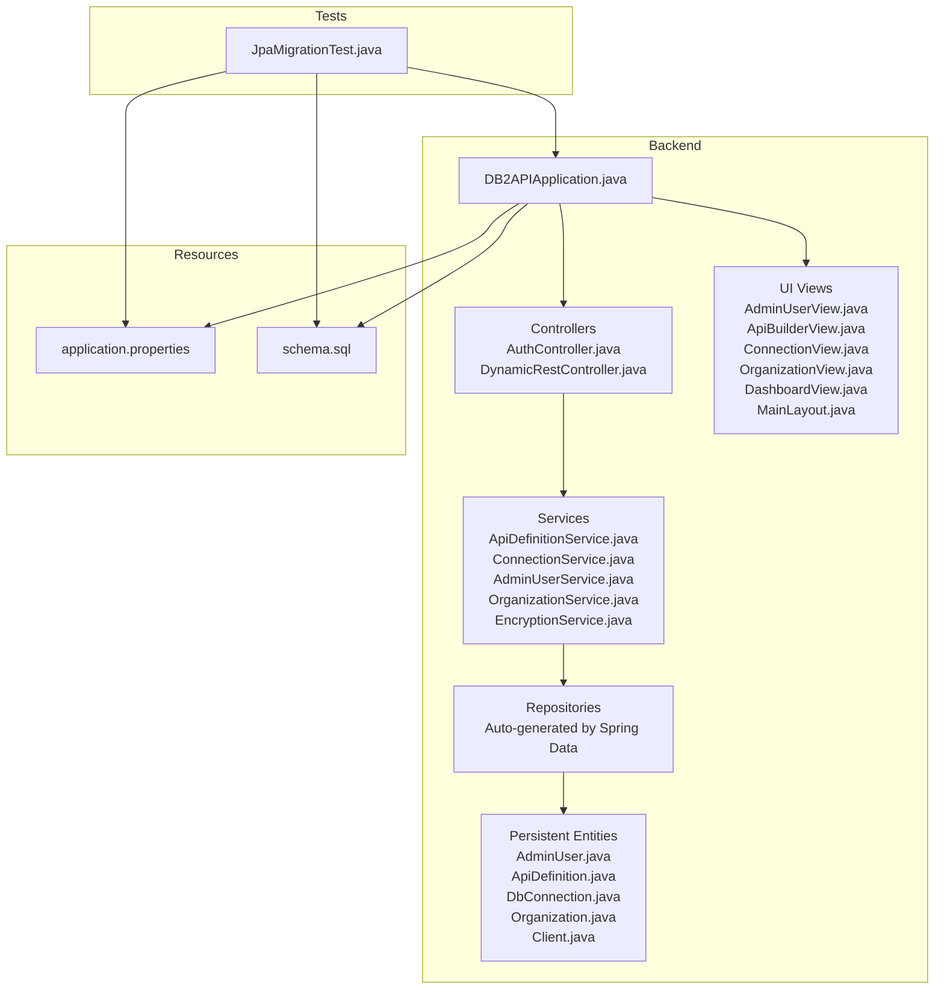
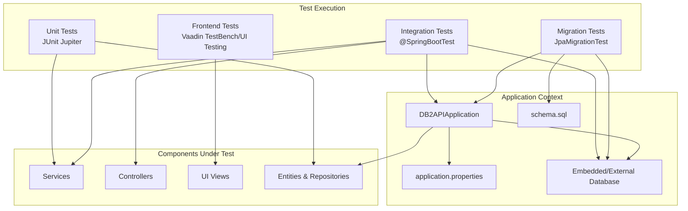
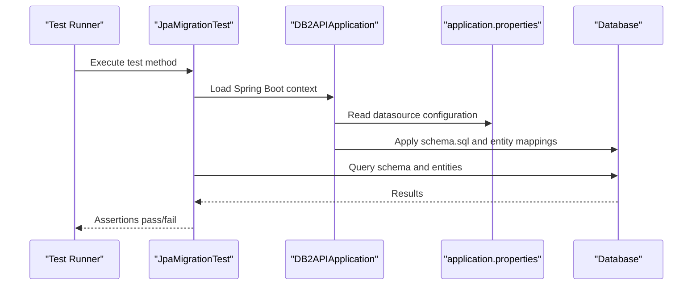
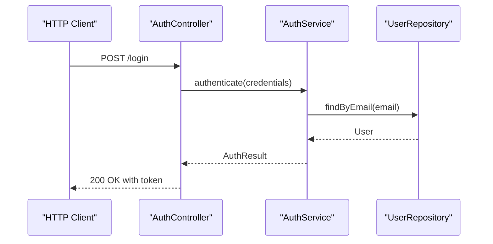
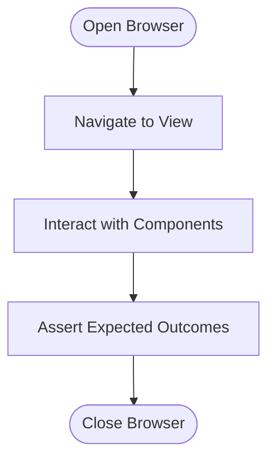
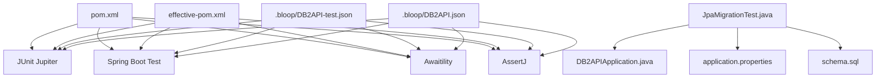

# Testing Strategy

<cite>
**Referenced Files in This Document**
- [JpaMigrationTest.java](file://src/test/java/com/db2api/migration/JpaMigrationTest.java)
- [pom.xml](file://pom.xml)
- [effective-pom.xml](file://effective-pom.xml)
- [DB2APIApplication.java](file://src/main/java/com/db2api/DB2APIApplication.java)
- [AuthController.java](file://src/main/java/com/db2api/controller/AuthController.java)
- [DynamicRestController.java](file://src/main/java/com/db2api/controller/DynamicRestController.java)
- [ApiDefinitionService.java](file://src/main/java/com/db2api/service/api/ApiDefinitionService.java)
- [ConnectionService.java](file://src/main/java/com/db2api/service/connection/ConnectionService.java)
- [AdminUserService.java](file://src/main/java/com/db2api/service/admin/AdminUserService.java)
- [OrganizationService.java](file://src/main/java/com/db2api/service/organization/OrganizationService.java)
- [EncryptionService.java](file://src/main/java/com/db2api/service/EncryptionService.java)
- [AdminUserView.java](file://src/main/java/com/db2api/ui/admin/AdminUserView.java)
- [ApiBuilderView.java](file://src/main/java/com/db2api/ui/api/ApiBuilderView.java)
- [ConnectionView.java](file://src/main/java/com/db2api/ui/connection/ConnectionView.java)
- [OrganizationView.java](file://src/main/java/com/db2api/ui/organization/OrganizationView.java)
- [DashboardView.java](file://src/main/java/com/db2api/ui/DashboardView.java)
- [MainLayout.java](file://src/main/java/com/db2api/ui/MainLayout.java)
- [application.properties](file://src/main/resources/application.properties)
- [schema.sql](file://src/main/resources/schema.sql)
- [.bloop\DB2API-test.json](file://.bloop/DB2API-test.json)
- [.bloop\DB2API.json](file://.bloop/DB2API.json)
</cite>

## Table of Contents
1. [Introduction](#introduction)
2. [Project Structure](#project-structure)
3. [Core Components](#core-components)
4. [Architecture Overview](#architecture-overview)
5. [Detailed Component Analysis](#detailed-component-analysis)
6. [Dependency Analysis](#dependency-analysis)
7. [Performance Considerations](#performance-considerations)
8. [Troubleshooting Guide](#troubleshooting-guide)
9. [Conclusion](#conclusion)
10. [Appendices](#appendices)

## Introduction
This document defines a comprehensive testing strategy for DB2API, covering unit testing, integration testing, migration testing, and frontend testing. It documents the existing JpaMigrationTest implementation, identifies the testing frameworks in use, outlines test data management practices, and proposes continuous integration patterns. Practical examples demonstrate how to write tests for services, controllers, and UI components, while best practices and automation guidelines support quality assurance.

## Project Structure
The repository follows a Spring Boot application layout with a clear separation between backend services/controllers and Vaadin UI components. Testing is primarily located under the standard Maven test directory, with a dedicated migration test module.

**Diagram sources**
- [DB2APIApplication.java](file://src/main/java/com/db2api/DB2APIApplication.java)
- [AuthController.java](file://src/main/java/com/db2api/controller/AuthController.java)
- [DynamicRestController.java](file://src/main/java/com/db2api/controller/DynamicRestController.java)
- [ApiDefinitionService.java](file://src/main/java/com/db2api/service/api/ApiDefinitionService.java)
- [ConnectionService.java](file://src/main/java/com/db2api/service/connection/ConnectionService.java)
- [AdminUserService.java](file://src/main/java/com/db2api/service/admin/AdminUserService.java)
- [OrganizationService.java](file://src/main/java/com/db2api/service/organization/OrganizationService.java)
- [EncryptionService.java](file://src/main/java/com/db2api/service/EncryptionService.java)
- [AdminUserView.java](file://src/main/java/com/db2api/ui/admin/AdminUserView.java)
- [ApiBuilderView.java](file://src/main/java/com/db2api/ui/api/ApiBuilderView.java)
- [ConnectionView.java](file://src/main/java/com/db2api/ui/connection/ConnectionView.java)
- [OrganizationView.java](file://src/main/java/com/db2api/ui/organization/OrganizationView.java)
- [DashboardView.java](file://src/main/java/com/db2api/ui/DashboardView.java)
- [MainLayout.java](file://src/main/java/com/db2api/ui/MainLayout.java)
- [application.properties](file://src/main/resources/application.properties)
- [schema.sql](file://src/main/resources/schema.sql)
- [JpaMigrationTest.java](file://src/test/java/com/db2api/migration/JpaMigrationTest.java)

**Section sources**
- [DB2APIApplication.java](file://src/main/java/com/db2api/DB2APIApplication.java)
- [application.properties](file://src/main/resources/application.properties)
- [schema.sql](file://src/main/resources/schema.sql)
- [JpaMigrationTest.java](file://src/test/java/com/db2api/migration/JpaMigrationTest.java)

## Core Components
- Migration Testing: JpaMigrationTest validates database schema and entity mappings during application startup.
- Backend Services: Core business logic resides in service classes (e.g., ApiDefinitionService, ConnectionService, AdminUserService, OrganizationService, EncryptionService).
- Controllers: REST endpoints are exposed via controllers (AuthController, DynamicRestController).
- UI Components: Vaadin views implement the frontend (AdminUserView, ApiBuilderView, ConnectionView, OrganizationView, DashboardView, MainLayout).
- Test Infrastructure: Spring Boot Test, JUnit Jupiter, and Awaitility are present in the build configuration.

Key testing capabilities:
- Unit tests for services and repositories using Spring Boot Test and JUnit Jupiter.
- Integration tests leveraging @SpringBootTest and embedded database configurations.
- Migration tests ensuring schema alignment with JPA entities.
- Frontend tests using Vaadin TestBench or similar UI testing frameworks.

**Section sources**
- [JpaMigrationTest.java](file://src/test/java/com/db2api/migration/JpaMigrationTest.java)
- [ApiDefinitionService.java](file://src/main/java/com/db2api/service/api/ApiDefinitionService.java)
- [ConnectionService.java](file://src/main/java/com/db2api/service/connection/ConnectionService.java)
- [AdminUserService.java](file://src/main/java/com/db2api/service/admin/AdminUserService.java)
- [OrganizationService.java](file://src/main/java/com/db2api/service/organization/OrganizationService.java)
- [EncryptionService.java](file://src/main/java/com/db2api/service/EncryptionService.java)
- [AuthController.java](file://src/main/java/com/db2api/controller/AuthController.java)
- [DynamicRestController.java](file://src/main/java/com/db2api/controller/DynamicRestController.java)
- [AdminUserView.java](file://src/main/java/com/db2api/ui/admin/AdminUserView.java)
- [ApiBuilderView.java](file://src/main/java/com/db2api/ui/api/ApiBuilderView.java)
- [ConnectionView.java](file://src/main/java/com/db2api/ui/connection/ConnectionView.java)
- [OrganizationView.java](file://src/main/java/com/db2api/ui/organization/OrganizationView.java)
- [DashboardView.java](file://src/main/java/com/db2api/ui/DashboardView.java)
- [MainLayout.java](file://src/main/java/com/db2api/ui/MainLayout.java)

## Architecture Overview
The testing architecture integrates unit, integration, and migration testing around the Spring Boot application lifecycle. Tests utilize the application context, embedded databases, and UI testing frameworks to validate behavior across layers.

**Diagram sources**
- [DB2APIApplication.java](file://src/main/java/com/db2api/DB2APIApplication.java)
- [application.properties](file://src/main/resources/application.properties)
- [schema.sql](file://src/main/resources/schema.sql)
- [JpaMigrationTest.java](file://src/test/java/com/db2api/migration/JpaMigrationTest.java)
- [AuthController.java](file://src/main/java/com/db2api/controller/AuthController.java)
- [DynamicRestController.java](file://src/main/java/com/db2api/controller/DynamicRestController.java)
- [ApiDefinitionService.java](file://src/main/java/com/db2api/service/api/ApiDefinitionService.java)
- [AdminUserView.java](file://src/main/java/com/db2api/ui/admin/AdminUserView.java)

## Detailed Component Analysis

### Migration Testing: JpaMigrationTest
JpaMigrationTest validates that the database schema aligns with JPA entities and that migrations execute successfully during application startup. Typical scenarios include:
- Ensuring all entities are mapped and schema is up-to-date.
- Verifying that seed data or initial records are created as configured.
- Confirming that schema.sql scripts are applied and consistent with entity definitions.

Recommended practices:
- Use @SpringBootTest to load the full application context.
- Configure an embedded database profile for deterministic runs.
- Assert schema existence and key constraints.
- Validate entity counts or specific records post-migration.

**Diagram sources**
- [JpaMigrationTest.java](file://src/test/java/com/db2api/migration/JpaMigrationTest.java)
- [DB2APIApplication.java](file://src/main/java/com/db2api/DB2APIApplication.java)
- [application.properties](file://src/main/resources/application.properties)
- [schema.sql](file://src/main/resources/schema.sql)

**Section sources**
- [JpaMigrationTest.java](file://src/test/java/com/db2api/migration/JpaMigrationTest.java)

### Unit Testing Services
Service classes encapsulate business logic and are prime candidates for unit testing. Recommended approaches:
- Mock external dependencies (repositories, encryption services) using Mockito.
- Test positive and negative scenarios, including invalid inputs and boundary conditions.
- Verify side effects (e.g., logging, notifications) through spies or captured invocations.

Example service units:
- ApiDefinitionService: Validate CRUD operations, validation rules, and schema discovery outcomes.
- ConnectionService: Validate connectivity checks, credential handling, and error propagation.
- AdminUserService: Validate user creation, role assignment, and access control checks.
- OrganizationService: Validate organizational boundaries, membership rules, and data isolation.
- EncryptionService: Validate encryption/decryption correctness and error handling for malformed inputs.

Best practices:
- Keep tests focused and fast; avoid network calls by mocking collaborators.
- Use parameterized tests for varied inputs.
- Assert domain-specific outcomes rather than implementation details.

**Section sources**
- [ApiDefinitionService.java](file://src/main/java/com/db2api/service/api/ApiDefinitionService.java)
- [ConnectionService.java](file://src/main/java/com/db2api/service/connection/ConnectionService.java)
- [AdminUserService.java](file://src/main/java/com/db2api/service/admin/AdminUserService.java)
- [OrganizationService.java](file://src/main/java/com/db2api/service/organization/OrganizationService.java)
- [EncryptionService.java](file://src/main/java/com/db2api/service/EncryptionService.java)

### Integration Testing Controllers
Controllers expose REST endpoints and require integration tests to validate request/response handling, security, and error mapping. Recommended practices:
- Use @SpringBootTest with web environment to test end-to-end flows.
- Employ @WebMvcTest for lightweight MVC tests or @DataJpaTest for persistence-focused tests.
- Validate HTTP status codes, response bodies, and headers.
- Include security tests for protected endpoints.

Example controller integration scenarios:
- AuthController: Validate login/logout flows, JWT generation, and unauthorized access handling.
- DynamicRestController: Validate dynamic endpoint invocation, parameter binding, and error responses.

**Diagram sources**
- [AuthController.java](file://src/main/java/com/db2api/controller/AuthController.java)
- [ApiDefinitionService.java](file://src/main/java/com/db2api/service/api/ApiDefinitionService.java)

**Section sources**
- [AuthController.java](file://src/main/java/com/db2api/controller/AuthController.java)
- [DynamicRestController.java](file://src/main/java/com/db2api/controller/DynamicRestController.java)

### Frontend Testing Strategies
Frontend testing focuses on Vaadin UI components to ensure usability, responsiveness, and correctness. Recommended practices:
- Use Vaadin TestBench or Playwright for cross-browser UI automation.
- Test navigation, form submissions, validations, and error displays.
- Validate responsive behavior and accessibility attributes.
- Automate repetitive tasks (e.g., CRUD operations across views).

Example UI test targets:
- AdminUserView: Validate user creation, editing, and deletion flows.
- ApiBuilderView: Validate API definition steps, preview, and generation triggers.
- ConnectionView: Validate connection testing, saving, and error messaging.
- OrganizationView: Validate organization settings and member management.
- DashboardView: Validate metrics display and navigation links.
- MainLayout: Validate menu items, branding, and responsive layout.

**Diagram sources**
- [AdminUserView.java](file://src/main/java/com/db2api/ui/admin/AdminUserView.java)
- [ApiBuilderView.java](file://src/main/java/com/db2api/ui/api/ApiBuilderView.java)
- [ConnectionView.java](file://src/main/java/com/db2api/ui/connection/ConnectionView.java)
- [OrganizationView.java](file://src/main/java/com/db2api/ui/organization/OrganizationView.java)
- [DashboardView.java](file://src/main/java/com/db2api/ui/DashboardView.java)
- [MainLayout.java](file://src/main/java/com/db2api/ui/MainLayout.java)

**Section sources**
- [AdminUserView.java](file://src/main/java/com/db2api/ui/admin/AdminUserView.java)
- [ApiBuilderView.java](file://src/main/java/com/db2api/ui/api/ApiBuilderView.java)
- [ConnectionView.java](file://src/main/java/com/db2api/ui/connection/ConnectionView.java)
- [OrganizationView.java](file://src/main/java/com/db2api/ui/organization/OrganizationView.java)
- [DashboardView.java](file://src/main/java/com/db2api/ui/DashboardView.java)
- [MainLayout.java](file://src/main/java/com/db2api/ui/MainLayout.java)

### Testing Frameworks and Tooling
The project leverages the following testing-related artifacts:
- JUnit Jupiter: Test engine and API for writing tests.
- Spring Boot Test: Provides @SpringBootTest and test slices.
- Awaitility: Fluent API for asynchronous testing.
- Additional libraries: AssertJ, Byte-Buddy, and others for assertions and bytecode manipulation.

Build configuration references:
- JUnit Jupiter API and Engine
- Spring Boot Starter Test
- Awaitility

**Section sources**
- [.bloop\DB2API-test.json](file://.bloop/DB2API-test.json)
- [.bloop\DB2API.json](file://.bloop/DB2API.json)
- [effective-pom.xml](file://effective-pom.xml)

### Test Data Management
Recommended strategies for managing test data:
- Use @Sql annotations or schema.sql to initialize test datasets.
- Employ @DirtiesContext sparingly; prefer lightweight embedded databases per test suite.
- Seed minimal data for migrations and integration tests; avoid heavy fixtures.
- Use factories or builders for generating domain objects in unit tests.

**Section sources**
- [schema.sql](file://src/main/resources/schema.sql)
- [application.properties](file://src/main/resources/application.properties)

### Continuous Integration Practices
Proposed CI pipeline stages:
- Build: Compile and run unit tests.
- Integration: Execute integration tests against an embedded database.
- Migration: Run JpaMigrationTest to validate schema alignment.
- Frontend: Execute UI tests in a headless browser environment.
- Quality Gates: Enforce coverage thresholds, static analysis, and security scans.

[No sources needed since this section provides general guidance]

## Dependency Analysis
Testing dependencies are primarily declared in the build configuration. The following diagram illustrates the relationship between test modules and core application components.

**Diagram sources**
- [pom.xml](file://pom.xml)
- [effective-pom.xml](file://effective-pom.xml)
- [.bloop\DB2API-test.json](file://.bloop/DB2API-test.json)
- [.bloop\DB2API.json](file://.bloop/DB2API.json)
- [JpaMigrationTest.java](file://src/test/java/com/db2api/migration/JpaMigrationTest.java)
- [DB2APIApplication.java](file://src/main/java/com/db2api/DB2APIApplication.java)
- [application.properties](file://src/main/resources/application.properties)
- [schema.sql](file://src/main/resources/schema.sql)

**Section sources**
- [pom.xml](file://pom.xml)
- [effective-pom.xml](file://effective-pom.xml)
- [.bloop\DB2API-test.json](file://.bloop/DB2API-test.json)
- [.bloop\DB2API.json](file://.bloop/DB2API.json)

## Performance Considerations
- Prefer lightweight embedded databases for unit and integration tests to reduce overhead.
- Use @DirtiesContext judiciously; isolate expensive setups with shared test fixtures.
- Parallelize independent tests where safe; avoid concurrent writes to shared datasets.
- Profile slow tests and refactor to minimize external dependencies.

[No sources needed since this section provides general guidance]

## Troubleshooting Guide
Common issues and resolutions:
- Migration failures: Verify schema.sql and entity mappings; ensure application.properties points to the correct datasource.
- Flaky UI tests: Add explicit waits using Awaitility or TestBench wait strategies; avoid brittle selectors.
- Service tests failing due to external dependencies: Mock collaborators with Mockito; confirm stubs return expected values.
- Controller tests returning unexpected status codes: Inspect @ExceptionHandler mappings and ensure exceptions are properly translated.

**Section sources**
- [JpaMigrationTest.java](file://src/test/java/com/db2api/migration/JpaMigrationTest.java)
- [application.properties](file://src/main/resources/application.properties)
- [schema.sql](file://src/main/resources/schema.sql)

## Conclusion
DB2API’s testing strategy combines unit, integration, migration, and frontend testing to ensure reliability across layers. By leveraging Spring Boot Test, JUnit Jupiter, and Awaitility, teams can automate validation efficiently. The existing JpaMigrationTest sets a foundation for schema validation, while service and controller tests protect core business logic. Extending UI tests with Vaadin TestBench completes the coverage. Adopting CI practices and best practices outlined here will strengthen quality assurance and maintainability.

[No sources needed since this section summarizes without analyzing specific files]

## Appendices

### Practical Examples Index
- Writing a service unit test: Focus on mocking repository collaborators and asserting domain outcomes.
- Writing a controller integration test: Validate request routing, response codes, and JSON payloads.
- Writing a UI test: Automate user journeys across Vaadin views with explicit waits and assertions.

[No sources needed since this section provides general guidance]