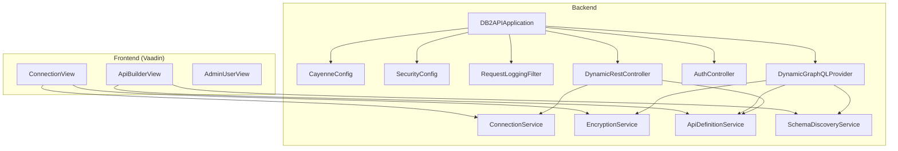
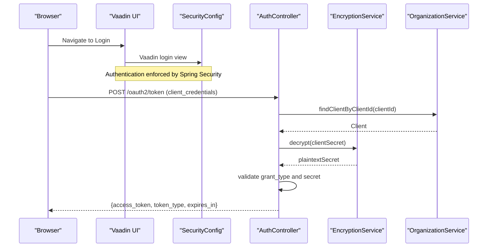
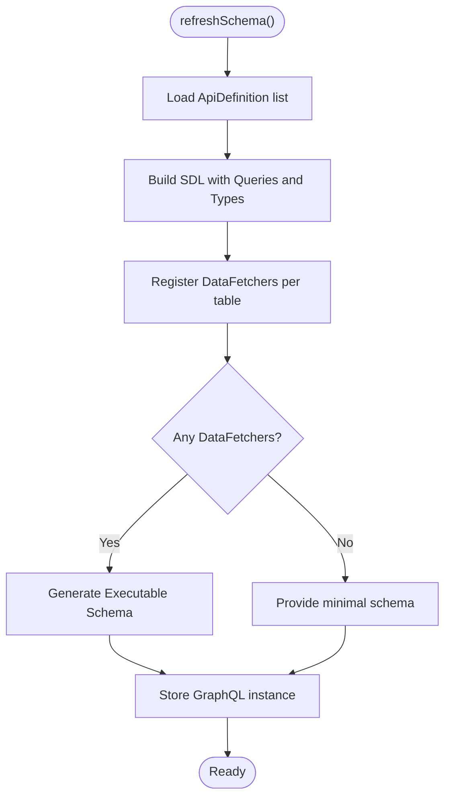
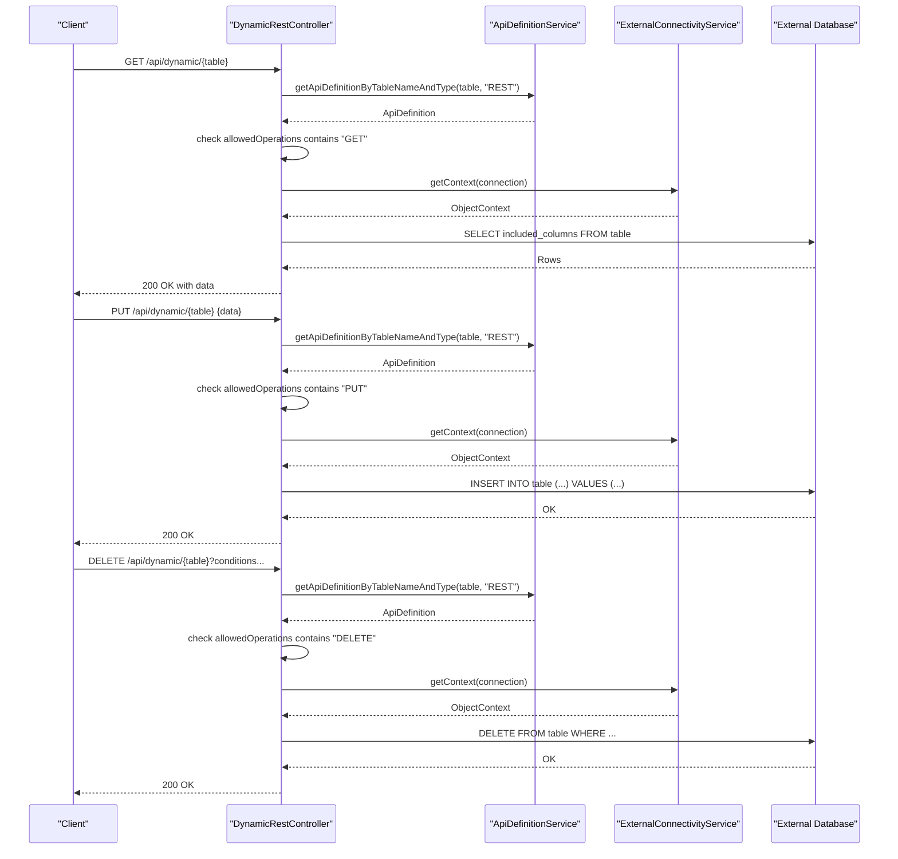
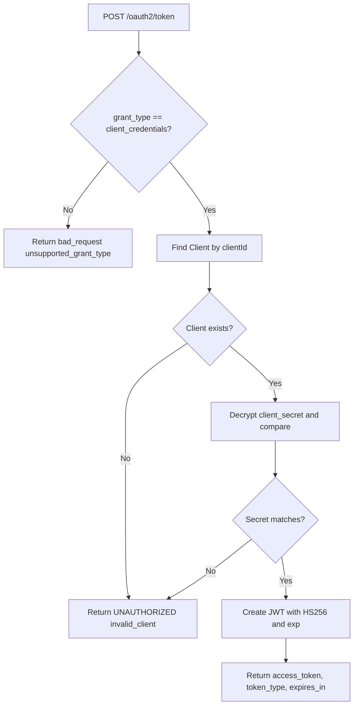
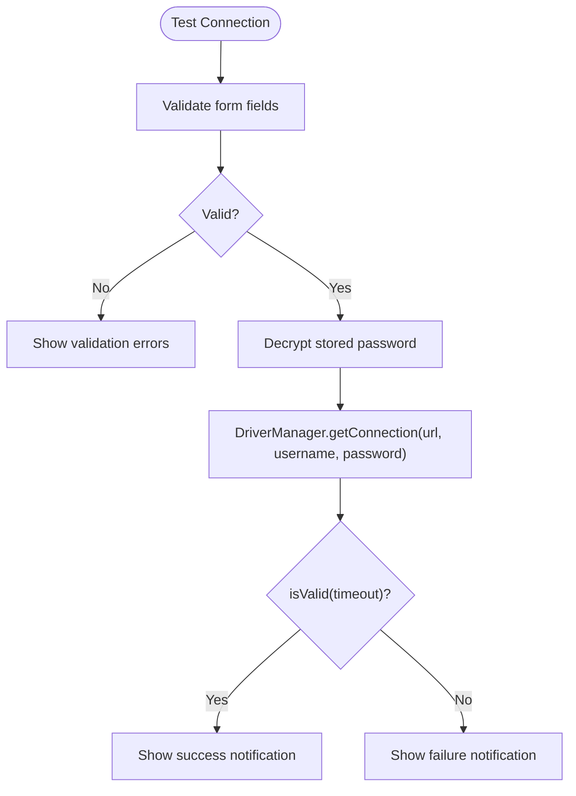
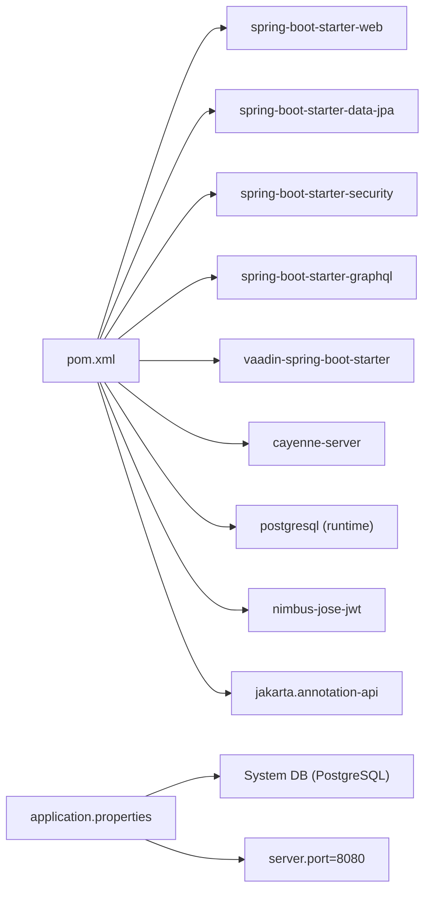

# Troubleshooting & FAQ

<cite>
**Referenced Files in This Document**
- [README.md](file://README.md)
- [application.properties](file://src/main/resources/application.properties)
- [pom.xml](file://pom.xml)
- [DB2APIApplication.java](file://src/main/java/com/db2api/DB2APIApplication.java)
- [CayenneConfig.java](file://src/main/java/com/db2api/config/CayenneConfig.java)
- [SecurityConfig.java](file://src/main/java/com/db2api/config/SecurityConfig.java)
- [DataInitializer.java](file://src/main/java/com/db2api/config/DataInitializer.java)
- [DynamicGraphQLProvider.java](file://src/main/java/com/db2api/config/DynamicGraphQLProvider.java)
- [RequestLoggingFilter.java](file://src/main/java/com/db2api/config/RequestLoggingFilter.java)
- [AuthController.java](file://src/main/java/com/db2api/controller/AuthController.java)
- [DynamicRestController.java](file://src/main/java/com/db2api/controller/DynamicRestController.java)
- [ConnectionService.java](file://src/main/java/com/db2api/service/connection/ConnectionService.java)
- [EncryptionService.java](file://src/main/java/com/db2api/service/EncryptionService.java)
- [ApiDefinitionService.java](file://src/main/java/com/db2api/service/api/ApiDefinitionService.java)
- [SchemaDiscoveryService.java](file://src/main/java/com/db2api/service/api/SchemaDiscoveryService.java)
- [AdminUserView.java](file://src/main/java/com/db2api/ui/admin/AdminUserView.java)
- [ApiBuilderView.java](file://src/main/java/com/db2api/ui/api/ApiBuilderView.java)
- [ConnectionView.java](file://src/main/java/com/db2api/ui/connection/ConnectionView.java)
</cite>

## Table of Contents
1. [Introduction](#introduction)
2. [Project Structure](#project-structure)
3. [Core Components](#core-components)
4. [Architecture Overview](#architecture-overview)
5. [Detailed Component Analysis](#detailed-component-analysis)
6. [Dependency Analysis](#dependency-analysis)
7. [Performance Considerations](#performance-considerations)
8. [Troubleshooting Guide](#troubleshooting-guide)
9. [FAQ](#faq)
10. [Conclusion](#conclusion)

## Introduction
This document provides a comprehensive Troubleshooting and FAQ guide for DB2API. It focuses on diagnosing and resolving common issues such as database connection problems, authentication failures, API generation errors, and UI interface issues. It also includes performance tuning recommendations, debugging techniques, log analysis guidance, and diagnostic procedures. The content is grounded in the repository’s source files and aims to be accessible to both technical and non-technical users.

## Project Structure
DB2API is a Spring Boot application with a Vaadin UI. The backend integrates Apache Cayenne for ORM, exposes REST and GraphQL endpoints, and manages database connections and API definitions. The frontend is organized under the Vaadin UI views.

**Diagram sources**
- [DB2APIApplication.java:13-24](file://src/main/java/com/db2api/DB2APIApplication.java#L13-L24)
- [CayenneConfig.java:21-27](file://src/main/java/com/db2api/config/CayenneConfig.java#L21-L27)
- [SecurityConfig.java:37-40](file://src/main/java/com/db2api/config/SecurityConfig.java#L37-L40)
- [RequestLoggingFilter.java:32-48](file://src/main/java/com/db2api/config/RequestLoggingFilter.java#L32-L48)
- [DynamicGraphQLProvider.java:58-71](file://src/main/java/com/db2api/config/DynamicGraphQLProvider.java#L58-L71)
- [AuthController.java:54-109](file://src/main/java/com/db2api/controller/AuthController.java#L54-L109)
- [DynamicRestController.java:47-81](file://src/main/java/com/db2api/controller/DynamicRestController.java#L47-L81)
- [ConnectionService.java:47-56](file://src/main/java/com/db2api/service/connection/ConnectionService.java#L47-L56)
- [EncryptionService.java:35-57](file://src/main/java/com/db2api/service/EncryptionService.java#L35-L57)
- [ApiDefinitionService.java:19-37](file://src/main/java/com/db2api/service/api/ApiDefinitionService.java#L19-L37)
- [SchemaDiscoveryService.java:24-58](file://src/main/java/com/db2api/service/api/SchemaDiscoveryService.java#L24-L58)
- [ConnectionView.java:132-203](file://src/main/java/com/db2api/ui/connection/ConnectionView.java#L132-L203)
- [ApiBuilderView.java:165-257](file://src/main/java/com/db2api/ui/api/ApiBuilderView.java#L165-L257)
- [AdminUserView.java:136-188](file://src/main/java/com/db2api/ui/admin/AdminUserView.java#L136-L188)

**Section sources**
- [README.md:65-82](file://README.md#L65-L82)
- [DB2APIApplication.java:13-24](file://src/main/java/com/db2api/DB2APIApplication.java#L13-L24)
- [pom.xml:25-99](file://pom.xml#L25-L99)

## Core Components
- Application bootstrap and theme configuration
- Security configuration with Vaadin login view and BCrypt encoder
- Request logging filter for timing and status
- Dynamic GraphQL provider that builds schemas and data fetchers at runtime
- REST controller for dynamic API routing
- Authentication controller for OAuth2 client_credentials token issuance
- Services for connection management, encryption, API definitions, and schema discovery
- Vaadin UI views for connections, API builder, and admin users

**Section sources**
- [DB2APIApplication.java:13-24](file://src/main/java/com/db2api/DB2APIApplication.java#L13-L24)
- [SecurityConfig.java:37-50](file://src/main/java/com/db2api/config/SecurityConfig.java#L37-L50)
- [RequestLoggingFilter.java:32-48](file://src/main/java/com/db2api/config/RequestLoggingFilter.java#L32-L48)
- [DynamicGraphQLProvider.java:58-132](file://src/main/java/com/db2api/config/DynamicGraphQLProvider.java#L58-L132)
- [DynamicRestController.java:47-166](file://src/main/java/com/db2api/controller/DynamicRestController.java#L47-L166)
- [AuthController.java:54-109](file://src/main/java/com/db2api/controller/AuthController.java#L54-L109)
- [ConnectionService.java:47-56](file://src/main/java/com/db2api/service/connection/ConnectionService.java#L47-L56)
- [EncryptionService.java:35-57](file://src/main/java/com/db2api/service/EncryptionService.java#L35-L57)
- [ApiDefinitionService.java:19-37](file://src/main/java/com/db2api/service/api/ApiDefinitionService.java#L19-L37)
- [SchemaDiscoveryService.java:24-58](file://src/main/java/com/db2api/service/api/SchemaDiscoveryService.java#L24-L58)

## Architecture Overview
The system integrates a Vaadin UI with Spring Boot controllers and services. Data persistence uses Apache Cayenne with a system database configured in application properties. Encryption is applied to sensitive fields such as passwords. Authentication uses JWT issued by the OAuth2 token endpoint.

**Diagram sources**
- [SecurityConfig.java:37-40](file://src/main/java/com/db2api/config/SecurityConfig.java#L37-L40)
- [AuthController.java:54-109](file://src/main/java/com/db2api/controller/AuthController.java#L54-L109)
- [EncryptionService.java:47-57](file://src/main/java/com/db2api/service/EncryptionService.java#L47-L57)

## Detailed Component Analysis

### Dynamic GraphQL Provider
The provider generates a runtime GraphQL schema from API definitions and external database metadata. It constructs SDL, wires data fetchers, and executes queries against external databases using decrypted credentials.

**Diagram sources**
- [DynamicGraphQLProvider.java:77-132](file://src/main/java/com/db2api/config/DynamicGraphQLProvider.java#L77-L132)

**Section sources**
- [DynamicGraphQLProvider.java:77-164](file://src/main/java/com/db2api/config/DynamicGraphQLProvider.java#L77-L164)

### Dynamic REST Controller
Handles GET, PUT, and DELETE operations against external databases based on ApiDefinition configurations. It validates allowed operations and uses Cayenne to execute SQL.

**Diagram sources**
- [DynamicRestController.java:47-166](file://src/main/java/com/db2api/controller/DynamicRestController.java#L47-L166)
- [ApiDefinitionService.java:23-25](file://src/main/java/com/db2api/service/api/ApiDefinitionService.java#L23-L25)

**Section sources**
- [DynamicRestController.java:47-166](file://src/main/java/com/db2api/controller/DynamicRestController.java#L47-L166)

### Authentication Flow
Issues around authentication often stem from invalid grant type, missing client, or incorrect client secret. The token endpoint uses HMAC signing and a configurable secret.

**Diagram sources**
- [AuthController.java:54-109](file://src/main/java/com/db2api/controller/AuthController.java#L54-L109)

**Section sources**
- [AuthController.java:54-109](file://src/main/java/com/db2api/controller/AuthController.java#L54-L109)

### Connection Management and Testing
Connection testing uses decrypted credentials to validate connectivity. UI provides Test Connection feedback.

**Diagram sources**
- [ConnectionView.java:114-125](file://src/main/java/com/db2api/ui/connection/ConnectionView.java#L114-L125)
- [ConnectionService.java:47-56](file://src/main/java/com/db2api/service/connection/ConnectionService.java#L47-L56)

**Section sources**
- [ConnectionView.java:114-125](file://src/main/java/com/db2api/ui/connection/ConnectionView.java#L114-L125)
- [ConnectionService.java:47-56](file://src/main/java/com/db2api/service/connection/ConnectionService.java#L47-L56)

## Dependency Analysis
The application depends on Spring Boot starters, Vaadin, Apache Cayenne, and PostgreSQL driver. Encryption relies on a configurable secret property.

**Diagram sources**
- [pom.xml:25-99](file://pom.xml#L25-L99)
- [application.properties:7-16](file://src/main/resources/application.properties#L7-L16)

**Section sources**
- [pom.xml:25-99](file://pom.xml#L25-L99)
- [application.properties:7-16](file://src/main/resources/application.properties#L7-L16)

## Performance Considerations
- Logging overhead: The request logging filter measures request durations. In high-throughput environments, consider adjusting logging levels or disabling verbose SQL logging.
- Encryption cost: Encryption/decryption is performed for secrets. Ensure keys are stable and avoid frequent re-initialization.
- GraphQL schema refresh: Recreating the schema on changes can be expensive. Batch updates and cache results where appropriate.
- REST dynamic queries: Avoid wildcard selects on large tables; specify included columns to reduce payload sizes.
- Database connectivity: Reuse connections and tune timeouts. Validate external database performance separately.

[No sources needed since this section provides general guidance]

## Troubleshooting Guide

### Database Connection Problems
Symptoms
- UI shows “Connection Failed” when testing
- REST/GraphQL requests fail with connectivity errors
- Schema discovery returns empty lists

Common causes and resolutions
- Incorrect JDBC URL, username, or password
  - Verify the JDBC URL and credentials in the connection editor. Use the Test Connection button to validate.
  - Confirm the driver class matches the target database.
  - Ensure the external database is reachable from the application host.
  - References:
    - [ConnectionView.java:114-125](file://src/main/java/com/db2api/ui/connection/ConnectionView.java#L114-L125)
    - [ConnectionService.java:47-56](file://src/main/java/com/db2api/service/connection/ConnectionService.java#L47-L56)
- Decryption issues for stored secrets
  - Ensure the encryption secret property is correctly set and consistent across restarts.
  - References:
    - [EncryptionService.java:18-19](file://src/main/java/com/db2api/service/EncryptionService.java#L18-L19)
- System database configuration mismatch
  - Confirm the system database properties match the running instance.
  - References:
    - [application.properties:7-16](file://src/main/resources/application.properties#L7-L16)

Escalation
- Capture network traces between the app and the external database.
- Temporarily enable SQL logging to inspect generated queries.
- Validate firewall and SSL/TLS settings if applicable.

### Authentication Failures
Symptoms
- Token endpoint returns unsupported_grant_type
- Token endpoint returns invalid_client
- Unauthorized responses despite valid tokens

Common causes and resolutions
- Grant type mismatch
  - Ensure the request uses grant_type=client_credentials.
  - References:
    - [AuthController.java:59-61](file://src/main/java/com/db2api/controller/AuthController.java#L59-L61)
- Missing or invalid client
  - Verify the client_id exists and the client secret matches the decrypted value.
  - References:
    - [AuthController.java:77-87](file://src/main/java/com/db2api/controller/AuthController.java#L77-L87)
- JWT signing secret misconfiguration
  - Confirm the JWT secret property is set and consistent.
  - References:
    - [AuthController.java:31-32](file://src/main/java/com/db2api/controller/AuthController.java#L31-L32)
- Time skew or expiration issues
  - Ensure the system clock is synchronized; tokens expire in one hour.

Escalation
- Review token endpoint logs and request timings.
- Validate client credentials storage and decryption.

### API Generation Errors
Symptoms
- GraphQL schema not updating after changes
- REST endpoints return 404 or 405
- Column selections not reflected in queries

Common causes and resolutions
- Missing or disabled API definition
  - Ensure an ApiDefinition exists for the target table and type.
  - References:
    - [ApiDefinitionService.java:23-25](file://src/main/java/com/db2api/service/api/ApiDefinitionService.java#L23-L25)
- Allowed operations not configured
  - Verify allowedOperations includes the requested HTTP verb.
  - References:
    - [DynamicRestController.java:56-58](file://src/main/java/com/db2api/controller/DynamicRestController.java#L56-L58)
- Included columns not set
  - Specify included columns in the API definition to restrict queries.
  - References:
    - [DynamicRestController.java:63-66](file://src/main/java/com/db2api/controller/DynamicRestController.java#L63-L66)
- GraphQL schema rebuild issues
  - Trigger a schema refresh after updating definitions.
  - References:
    - [DynamicGraphQLProvider.java:58-61](file://src/main/java/com/db2api/config/DynamicGraphQLProvider.java#L58-L61)

Escalation
- Manually validate the generated SDL and data fetchers.
- Check logs for exceptions during schema generation.

### UI Interface Issues
Symptoms
- Save/Delete/Add buttons disabled
- Role-based access prevents editing
- Form validation blocks submission

Common causes and resolutions
- Role restrictions
  - ADMIN role is required for editing connections and API definitions; VIEWER role limits actions.
  - References:
    - [ConnectionView.java:196-201](file://src/main/java/com/db2api/ui/connection/ConnectionView.java#L196-L201)
    - [ApiBuilderView.java:250-255](file://src/main/java/com/db2api/ui/api/ApiBuilderView.java#L250-L255)
    - [AdminUserView.java:27-27](file://src/main/java/com/db2api/ui/admin/AdminUserView.java#L27-L27)
- Validation errors
  - Ensure required fields are filled before saving.
  - References:
    - [ConnectionView.java:87-92](file://src/main/java/com/db2api/ui/connection/ConnectionView.java#L87-L92)
- UI not reflecting changes
  - Refresh the page or trigger a grid update after save/delete.

Escalation
- Inspect browser console for JavaScript errors.
- Verify Vaadin session and CSRF settings if using custom security.

### Debugging Techniques and Log Analysis
- Enable request logging
  - The filter logs method, URI, status, and duration. Use this to correlate slow endpoints.
  - References:
    - [RequestLoggingFilter.java:32-48](file://src/main/java/com/db2api/config/RequestLoggingFilter.java#L32-L48)
- Inspect application logs
  - Look for stack traces from encryption, schema discovery, and controller exceptions.
  - References:
    - [EncryptionService.java:31-32](file://src/main/java/com/db2api/service/EncryptionService.java#L31-L32)
    - [SchemaDiscoveryService.java:35-37](file://src/main/java/com/db2api/service/api/SchemaDiscoveryService.java#L35-L37)
    - [DynamicRestController.java:77-80](file://src/main/java/com/db2api/controller/DynamicRestController.java#L77-L80)
- Diagnose authentication failures
  - Confirm client existence and secret comparison outcomes.
  - References:
    - [AuthController.java:77-87](file://src/main/java/com/db2api/controller/AuthController.java#L77-L87)
- Monitor system database
  - Ensure the system database is reachable and schema migration is applied.
  - References:
    - [application.properties:7-16](file://src/main/resources/application.properties#L7-L16)

### Diagnostic Procedures
- Connectivity diagnostics
  - Use the Test Connection action in the Connections view.
  - References:
    - [ConnectionView.java:114-125](file://src/main/java/com/db2api/ui/connection/ConnectionView.java#L114-L125)
- Schema discovery diagnostics
  - Verify tables and columns are returned for the selected connection.
  - References:
    - [SchemaDiscoveryService.java:24-58](file://src/main/java/com/db2api/service/api/SchemaDiscoveryService.java#L24-L58)
- API definition diagnostics
  - Confirm ApiDefinition entries and their allowed operations.
  - References:
    - [ApiDefinitionService.java:19-37](file://src/main/java/com/db2api/service/api/ApiDefinitionService.java#L19-L37)
- Encryption diagnostics
  - Validate encryption secret and key preparation.
  - References:
    - [EncryptionService.java:23-33](file://src/main/java/com/db2api/service/EncryptionService.java#L23-L33)

**Section sources**
- [RequestLoggingFilter.java:32-48](file://src/main/java/com/db2api/config/RequestLoggingFilter.java#L32-L48)
- [ConnectionView.java:114-125](file://src/main/java/com/db2api/ui/connection/ConnectionView.java#L114-L125)
- [SchemaDiscoveryService.java:24-58](file://src/main/java/com/db2api/service/api/SchemaDiscoveryService.java#L24-L58)
- [ApiDefinitionService.java:19-37](file://src/main/java/com/db2api/service/api/ApiDefinitionService.java#L19-L37)
- [EncryptionService.java:23-33](file://src/main/java/com/db2api/service/EncryptionService.java#L23-L33)

## FAQ

Q: How do I configure the system database?
A: Update the system database properties in the application configuration file. Ensure the URL, username, and password match your PostgreSQL instance.
References:
- [application.properties:7-16](file://src/main/resources/application.properties#L7-L16)

Q: How do I add a new database connection?
A: Use the Connections view to add a new connection. Fill in the name, JDBC URL, username, password, and driver class. Use the Test Connection button to validate.
References:
- [ConnectionView.java:132-203](file://src/main/java/com/db2api/ui/connection/ConnectionView.java#L132-L203)

Q: How do I generate a REST API from a table?
A: Use the API Builder view to select a connection, table, API type (REST or GraphQL), allowed operations, and included columns. Save the definition.
References:
- [ApiBuilderView.java:165-257](file://src/main/java/com/db2api/ui/api/ApiBuilderView.java#L165-L257)
- [ApiDefinitionService.java:23-25](file://src/main/java/com/db2api/service/api/ApiDefinitionService.java#L23-L25)

Q: How do I obtain an access token for API usage?
A: Call the OAuth2 token endpoint with grant_type=client_credentials, providing a valid client_id and client_secret.
References:
- [AuthController.java:54-109](file://src/main/java/com/db2api/controller/AuthController.java#L54-L109)

Q: Why does my GraphQL query return no results?
A: Ensure an API definition exists for the table and type, and that the schema has been refreshed. Also verify included columns and allowed operations.
References:
- [DynamicGraphQLProvider.java:77-132](file://src/main/java/com/db2api/config/DynamicGraphQLProvider.java#L77-L132)
- [ApiDefinitionService.java:23-25](file://src/main/java/com/db2api/service/api/ApiDefinitionService.java#L23-L25)

Q: How are passwords stored securely?
A: Passwords are encrypted using AES before persisting. Ensure the encryption secret property is set and consistent.
References:
- [EncryptionService.java:18-19](file://src/main/java/com/db2api/service/EncryptionService.java#L18-L19)
- [ConnectionService.java:30-36](file://src/main/java/com/db2api/service/connection/ConnectionService.java#L30-L36)

Q: How do I troubleshoot slow API responses?
A: Use the request logging filter output to identify slow endpoints. Reduce payload sizes by limiting included columns and avoid wildcard queries.
References:
- [RequestLoggingFilter.java:32-48](file://src/main/java/com/db2api/config/RequestLoggingFilter.java#L32-L48)
- [DynamicRestController.java:63-66](file://src/main/java/com/db2api/controller/DynamicRestController.java#L63-L66)

Q: How do I reset the default admin user?
A: On startup, the application initializes a default admin user if none exists. You can manage admin users via the Admin Users view.
References:
- [DataInitializer.java:46-58](file://src/main/java/com/db2api/config/DataInitializer.java#L46-L58)
- [AdminUserView.java:136-188](file://src/main/java/com/db2api/ui/admin/AdminUserView.java#L136-L188)

Q: Where can I find the REST and GraphQL endpoints?
A: REST endpoints are under /api/dynamic. GraphQL endpoint is available at /graphql.
References:
- [README.md:84-99](file://README.md#L84-L99)

Q: How do I run the application locally?
A: Build and run the Spring Boot application using Maven. The application starts on port 8080.
References:
- [README.md:57-63](file://README.md#L57-L63)
- [application.properties:4](file://src/main/resources/application.properties#L4)

**Section sources**
- [application.properties:7-16](file://src/main/resources/application.properties#L7-L16)
- [ConnectionView.java:132-203](file://src/main/java/com/db2api/ui/connection/ConnectionView.java#L132-L203)
- [ApiBuilderView.java:165-257](file://src/main/java/com/db2api/ui/api/ApiBuilderView.java#L165-L257)
- [ApiDefinitionService.java:23-25](file://src/main/java/com/db2api/service/api/ApiDefinitionService.java#L23-L25)
- [AuthController.java:54-109](file://src/main/java/com/db2api/controller/AuthController.java#L54-L109)
- [DynamicGraphQLProvider.java:77-132](file://src/main/java/com/db2api/config/DynamicGraphQLProvider.java#L77-L132)
- [EncryptionService.java:18-19](file://src/main/java/com/db2api/service/EncryptionService.java#L18-L19)
- [ConnectionService.java:30-36](file://src/main/java/com/db2api/service/connection/ConnectionService.java#L30-L36)
- [DataInitializer.java:46-58](file://src/main/java/com/db2api/config/DataInitializer.java#L46-L58)
- [AdminUserView.java:136-188](file://src/main/java/com/db2api/ui/admin/AdminUserView.java#L136-L188)
- [README.md:84-99](file://README.md#L84-L99)
- [README.md:57-63](file://README.md#L57-L63)
- [application.properties:4](file://src/main/resources/application.properties#L4)

## Conclusion
This guide consolidates practical steps to diagnose and resolve common DB2API issues. By validating connections, ensuring proper authentication, configuring API definitions accurately, and leveraging logging and diagnostics, most problems can be resolved quickly. For persistent issues, escalate by capturing logs, reviewing encryption and schema generation flows, and verifying system database connectivity.

[No sources needed since this section summarizes without analyzing specific files]